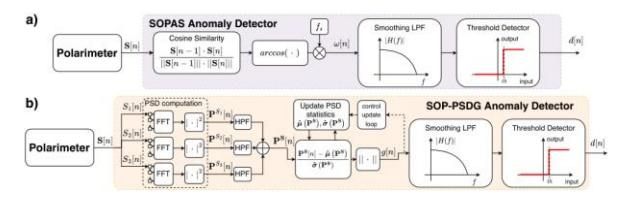
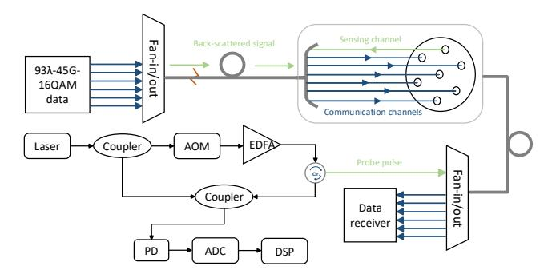
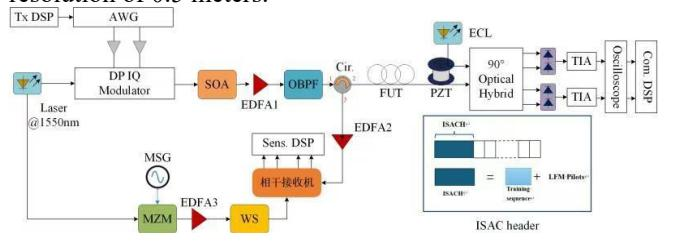

{0}------------------------------------------------

# Recent Advancements and Challenges in Integrated Sensing and Communication in Optical Fiber

Ying Wu,¹ Chao Xu,² Fang Chen,³ Ying Wang,³ Guangzhe Wu,³ Peizhe Xin,⁴ Zhiyi Chen,⁴ Peng Zhan,⁵ Zhirui Zhou,⁵ Zuoxing Zhang,⁵ Weizhe Ma,² Meng Li,² Jing Yan,¹ Mengwen Pa,¹ Yajie Li,¹ Yongli Zhao,¹ Jie Zhang,¹,\*

¹Beijing University of Posts and Telecommunications, Beijing, China

²State Grid Liaoning Information and Communication Company, Shenyang, China

³State Grid Information & Telecommunication Branch, Beijing, China

⁴State Grid Economic and Technology Research Institute Co. Ltd, Beijing, China

⁵State Grid Hubei Electric Power Co. Ltd.,Information and Communication Branch,Wuhan,China

\*Email: jie.zhang@bupt.edu.cn

Abstract—This paper tends to introduce the current development status of integrated sensing and communication in optical fiber by presenting several of the latest solutions. Then, we analyze the differences, advantages and disadvantages among various solutions. Finally, several potential research challenges are discussed.

Keywords— integrated sensing and communication, forward transmitted light, backscattered light

#### I. INTRODUCTION

In addition to communication, optical fibers can also acquire information about the surrounding environment through the technology of fiber sensing[1]. "Compared to electronic sensors, using optical fibers as sensors has several advantages, including being lightweight, compact, immune to electromagnetic interference, adaptable to harsh environments, offering longer sensing ranges, and providing high spatial resolution and sensitivity [2-3]. In recent years, the integration of fiber communication and sensing has attracted more and more attention, as it provides additional value to extensive fiber-optic networks[4-5]. The integrated sensing and communication in optical fiber (ISAC-OF) does not require the installation of additional sensors. It has the ability to sense the surrounding environment and facilitate communication simultaneously, offering extensive coverage.

When transmitting optical signals, both forward transmitted light and backscattered light are presented in the optical fiber. It has been demonstrated that it is possible to transmit communication signals while using either forward transmitted light or backscattered light to monitor environmental changes [6-7]. Forward transmitted light, with its high power, can be amplified by optical amplifiers, allowing sensing schemes based on forward transmitted light to achieve a large monitoring range [8]. Currently, many studies on ISAC-OF systems based on forward transmitted light focus on enhancing the monitoring and forecasting capabilities for natural disasters such as earthquakes and tsunamis. However, these schemes based on forward

transmitted light face limitations in terms of localization accuracy and handling multiple vibration sources. During forward transmission, backscattering phenomena within the optical fiber, such as Rayleigh scattering, Brillouin scattering, and Raman scattering, serve as the foundation for various distributed fiber optic sensors. Among these, Distributed Acoustic Sensors (DAS) based on Rayleigh scattering have become a primary technology for monitoring large structures. Typical applications include intrusion detection, monitoring of oil and gas pipelines, structural health monitoring, earthquake monitoring, railway track monitoring, and traffic monitoring. Distributed Optical Fiber Sensing (DOFS) technology, which relies on backscattered light, enables the localization of disturbances along the entire length of the sensing fiber and offers high spatial resolution [9-10]. The integration of DAS with fiber optic communication is also gradually developing. However, because DAS relies on weak backscattered light, its sensing range is limited. Additionally, if the sensing system needs to operate on an amplified link with isolators, sensing systems based on backscattering may face certain limitations.

This paper analyzes the state-of-the-art schemes of ISAC-OF, categorizing them into two main types: solutions based on forward transmitted light and those based on backscattered light. Then, we analyze the differences, advantages and disadvantages among various solutions. Finally, we also discuss the potential technical challenges and development trends.

# II. SCHEME OF ISAC-OF BASED ON FORWARD TRANSMITTED LIGHT

Sensing technology based on forward transmitted light has played a significant role in monitoring submarine optical fiber cables. Early research has demonstrated the feasibility of extracting the state of polarization (SOP) and optical phases from digital coherent transponders for vibration detection. At present, compared to SOP-based vibration detection methods, optical phase-based methods offer higher

{1}------------------------------------------------

sensitivity [12-13]. The use of SOP for vibration monitoring is not suitable for providing accurate location information [11]. However, SOP provides greater stability compared to optical phase.

# A. Solution based on SOP

Reference [14] explores the potential of extracting the optical fiber channel transmission matrix from digital coherent receivers for environmental sensing. The study examines the sensitivity of various quantities derived from the transmission matrix to environmental disturbances. The results indicate that when using telecom-grade lasers with linewidths ranging from kilohertz to tens of kilohertz, the rotation vectors representing the unitary part of the transmission matrix exhibit high sensitivity to disturbances in the fiber link.

ISAC-OF schemes based on forward transmitted light can be used not only for monitoring and predicting natural disasters such as earthquakes and tsunamis but also for detecting abnormal vibrations, ensuring information security. In the latest schemes for extracting SOPs, Minelli et al.[15] proposed two anomaly detection digital signal processing (DSP) schemes for extraction SOP, demonstrating that SOPpower spectral density gap exhibits greater sensitivity to subtle anomalies. The flowcharts for the two proposed DSP schemes are shown in figure 1. Mazur et al. [16] conducted fracture detection experiments on a 524 km optical fiber link, showing that coherent DSP can effectively identify significant changes in the fiber environment. This capability enhances the stability of future optical networks by controlling proactive rerouting and mitigating potential disruptions.

Fig.1 Two DSP schemes for anomaly detection in SOP extraction proposed

Due to the requirement for precise time synchronization to accurately locate detected vibration events in ISAC-OF solutions based on forward transmitted light. Tang et al. [17] addressed this issue in a C+L wavelength division multiplexing (WDM) transmission system, experimental setup shown in figure 2. They achieved effective perturbation localization by demodulating the SOP fluctuations of two forward transmitted lights with different group velocities to measure the delay between SOP fluctuations. This scheme has low requirements for timing synchronization and is compatible with communication signals in both the C-band and L-band. It provides an economical and high-precision solution for integrating distributed fiber sensing functions into existing C+L WDM networks.

Fig.2 Experimental setup of proposed integrated coherent transmission and distributed fiber sensing in scheme [17].

# Solution based on optical phases

Currently, ISAC-OF solutions based on forward transmitted light can be implemented through both SOP extraction and phase extraction. These two techniques have different characteristics.

Fig.3 Experimental setup for demonstrating vibration detection and localization based on forward transmitted light in scheme [18].

Fig.4 Experimental setup of a 32km single-mode fiber in the Turin metropolitan area in scheme [19]

Ezra Ip et al. [18] conducted a lab demonstration to confirm the feasibility of using optical phase and SOP in vibration detection, with the experimental setup shown in figure 3. Their results demonstrate that the phase-based approach exhibits higher sensitivity and a broader detection bandwidth compared to the SOP-based approach, enabling more precise vibration localization. Lorenzo Andrenacci et al. [19] further compared the performance of these two approaches in different environmental settings. In their study, data transmission occurred over urban optical fiber networks, representing more challenging transmission environments. The experimental setup in the city of Turin is shown in figure 4. They intentionally introduced weaker excitation amplitudes to test the sensing capabilities of both methods under various interference and noise conditions. The results indicate that the SOP-based approach demonstrates greater robustness in 

{2}------------------------------------------------

weaker interference and noise environments. Although these findings may seem to contradict the results of [18], they highlight the distinct advantages of phase-based and SOPbased approaches under different transmission environments and excitation types in optical fibers.

The ISAC-OF system based on forward transmitted light, exhibits an inferior capability in localizing low-frequency events compared to high-frequency events, thereby limiting its broad application. To address this issue, W. Kong et al. proposed Phase-Differentiated End Point Amplification (PDEA)[20] to optimize the system's frequency response and achieve more accurate event localization. PDEA works by differentiating the extracted phase signals and amplifying the amplitude of interference events through cross-correlation, thereby reducing localization errors. The PDEA notably enhances the system's broadband response and improves its ability to localize low-frequency disturbances.

Additionally, phase-based forward transmitted sensing integration has been field-tested on optical fiber links [21] . This approach successfully detected real-world vibration events, such as pole knocks, on-site intrusions, and fiber tampering, with detection distances exceeding 380 kilometers. The method achieves vibration detection and localization by extracting optical phase information from the coherent receiver of a bidirectional WDM system. Localization accuracy is influenced by the relationship between the bandwidth of the vibration events and the environmental noise level. Furthermore, the system enables vibration monitoring with minimal DSP overhead, using low-phase-noise lasers for sensing and response.

# III. SCHEME OF ISAC-OF BASED ON BACKSCATTERED LIGHT

Compared with solutions based on forward transmitted light, solutions of ISAC-OF based on backscattered light offer higher spatial resolution. Currently, phase-sensitive optical time domain reflectometer ( -OTDR) is mostly used to achieve the sensing function in ISAC-OF systems based on backscattered light, due to its significant similarities with conventional optical communication systems in terms of system architecture, signal modulation [22] .

# *A. Solution based on multiplexing technology*

The ISAC-OF solution based on backscattered light was initially implemented in WDM and Space Division Multiplexing (SDM) systems. Experiments reported in [23-24] utilized optical fiber cables for both optical communication and distributed fiber sensing. This work successfully detected vehicle speed and density, as well as road surface conditions along the route of the optical cable. These capabilities were achieved simultaneously with dense wavelength division multiplexing (DWDM) channels in the same fiber, which had a total capacity of approximately 36.8 Tb/s. In a WDM system spanning an 82 km optical fiber link, the simultaneous transmission of sensing and communication signals enabled precise localization of real vibration events within a 600 Hz bandwidth[25] . Ezra Ip's team proposed a bidirectional Data Center Interconnect (DCI) scheme compatible with DAS in WDM systems, utilizing ISAC-OF technology as a diagnostic tool for DCI networks[26] . Yingyu Chen's team successfully

demonstrated an SDM-based ISAC-OF scheme, deploying a seven-core optical fiber in field trials[27] . The schematic of the experimental setup is shown in figure 5. One core was dedicated to the sensing channel, while the remaining six cores were used for communication. Low-crosstalk between cores ensured there was no interference between the communication and sensing channels.

Fig.5 Schematic diagram of experimental structure in scheme [27].

# *B. Solution using the same wavelength*

In ISAC-OF schemes based on WDM and SDM, dedicating spectrum or fiber resources exclusively to sensing can lead to inefficient resource utilization. To enhance the overall resource efficiency of the ISAC-OF systems, reference [28] demonstrated a scheme for synchronous data transmission and DAS within the same wavelength channel of optical fiber. This approach utilized Pulse Amplitude Modulation with 4 levels (PAM4) signals for data transmission, employing periodic linear frequency modulation (LFM) light as both a sensing probe and an optical carrier, with LFM modulated onto the phase of the optical signal. The schematic of the experimental structure is shown in figure 6. This method not only extends the intelligence of optical fiber communication systems but also enhances their transmission performance. However, this scheme is only applicable to intensity modulation direct detection(IM/DD) systems and introduces a complex structure, leading to increased costs.

Fig.6 Schematic diagram of experimental structure in scheme [28].

# *C. Solution Utilizing the Structure of Communication Data Frames*

Reference [29] proposed a straightforward ISAC solution that does not require additional dedicated wavelength channels by utilizing the structure of communication data frames. The schematic of the experimental structure is shown in figure 7. This approach inserts LFM sensing probes into the training symbols within the transmission data frames, creating an ISAC-OF header. This setup enables a unified system that shares the spectrum and transmitter. The presence 

{3}------------------------------------------------

of multiple LFM probes with different central frequencies during the round-trip time in the measured fiber improves the signal-to-noise ratio of the sensing signals and suppresses interference fading. They demonstrated the feasibility of this approach through experiments, achieving 60 GBaud 16-QAM data transmission and vibration sensing with a spatial resolution of 0.5 meters.

Fig.7 Schematic diagram of experimental structure in scheme [29].

#### D. Solution based on DSCM

Zihe Hu et al. [30] integrated the spectrum of sensing probes into the center of the Digital Subcarrier Multiplexing (DSCM) signal spectrum, utilizing DSCM technology to combine communication signals and sensing probes. To optimize sensing performance, they employed the Fractional Fourier Transform of Direct Current (FrFT-DC) signals to obtain continuous LFM signals as sensing probes. The scheme achieved a transmission rate of 100 Gb/s with dualpolarization quadrature phase-shift keying and 200 Gb/s with dual-polarization 16-ary quadrature amplitude modulation, while also achieving a spatial resolution of 4 meters with DAS.

Building on this approach, the team further utilized FrFT-DC signals as pilot sequences for communication signals [3132], proposing a new method to achieve intrinsic DAS in DSCM systems. They redesigned the synchronization pilots based on multi-band FrFT within the DSCM system, using time-division multiplexing to insert these pilots at equal intervals into the DSCM communication signals, which servr as sensing probes. The experimental setup and the spectrum schematic are shown in figure 8. This approach addresses issues of time and frequency offset, achieving highperformance sensing without compromising spectral efficiency. Since coherent DSCM systems are promising candidates for the next-generation point-to-multipoint (P2MP) optical networks, this ISAC solution represents a compelling way to enhance the intelligent capabilities of such networks.

Fig.8 The DSCM-based P2MP system in scheme [31-32]. (a) Experimental setup; (b) Spectrum of the transmitted signals; (c) Spectrum of the received communication signals of Leaf1 or Leaf2.

#### IV. COMPARISON OF SCHEMES AND DEVELOPMENT TRENDS

Table 1 compares all the ISAC-OF schemes mentioned in this paper and proposes several potential research directions. Then, we discuss the challenges faced by ISAC-OF.

# TABLE I. SCHEME COMPARISON

| ISAC-OF system                     | Methodologies                                        | Advantages                                                                                                                             | Potential research directions                                                                                |
|------------------------------------|------------------------------------------------------|----------------------------------------------------------------------------------------------------------------------------------------|--------------------------------------------------------------------------------------------------------------|
| Based on forward transmitted light | Extracting SOP                                       | <ul> <li>Having long sensing range</li> <li>Having a simple structure</li> </ul>                                                       | <ul> <li>Enhancing spatial resolution</li> <li>Solving timing synchronization issues</li> </ul>              |
|                                    | Extracting phase                                     |                                                                                                                                        |                                                                                                              |
| Based on backscatted light         | Based on division multiplexing                       | <ul> <li>Having high spatial resolution</li> <li>Enhancing communication or sensing performance while achieving integration</li> </ul> | <ul> <li>Increasing single-span sensing distance</li> <li>Combining multiple backscattered lights</li> </ul> |
|                                    | Using the same wavelength                            |                                                                                                                                        |                                                                                                              |
|                                    | Utilizing the Structure of Communication Data Frames |                                                                                                                                        |                                                                                                              |
|                                    | Based on DSCM                                        |                                                                                                                                        |                                                                                                              |

- Most current ISAC-OF systems are designed to sense vibrations during transmission. This poses a significant challenge when combining different sensing objects.
- Although ISAC-OF systems based on forward transmitted light offer longer sensing distances, improving spatial resolution remains a major challenge. Detection methods based on SOP and phase are suitable for different transmission environments and the type of excitation applied to the optical fiber. Hence, changes in environment and the type of excitation applied to the optical fiber may affect the effectiveness of these sensing methods.
- For ISAC-OF systems based on backscattered light, the the weak power of backscattered signals limits the

sensing distance of the system. If the system needs to operate on an amplified link with isolators, sensing systems based on backscattering may encounter certain limitations. Currently, the scheme of simultaneously transmitting communication signals and sensing probes using the same wavelength channel can only be applied in IM/DD systems, and this introduces complex structures. Adapting this approach to accommodate more communication modulation formats and the existing fiber network architecture presents a significant challenge.

#### V. CONCLUSION

In this paper, we categorize the solutions of ISAC-OF into two types: those based on forward transmitted light and those 

{4}------------------------------------------------

based on backscattered light. Additionally, we illustrate the research progress and trends of ISAC-OF through recent research findings. Furthermore, we compare the two technological approaches, analyzing their differences, advantages and disadvantages. Finally, we discuss the challenges they face.

# ACKNOWLEDGMENT

This work is supported by the Science and Technology Project of State Grid Corporation of China (No. 5700- 202352265A-1-1-ZN).

# REFERENCES

- [1] G. Marra, D M. Fairweather, V. Kamalov, et al., "Optical interferometry– based array of seafloor environmental sensors using a transoceanic submarine cable." Science, 2022, Vol. 376, pp. 874-879.
- [2] P I. Kuznetsov, D P. Sudas, E A. Savelyev. "Fiber optic lossy mode resonance based sensor for aggressive liquids." Sensors and Actuators A: Physical, 2021, Vol. 321, pp. 112576.
- [3] D.K. Zhang, P.C. Hills, C. Zheng, et al., "Fibre optic ignition of combustible gas mixtures by the radiative heating of small particles." Symposium (International) on Combustion, 1992, Vol. 24, pp. 1762-1767.
- [4] E. Ip, F. Ravet, H. Martins, et al., "Using global existing fiber networks for environmental sensing." Proceedings of the IEEE, 2022, vol. 110, pp. 1853-1888.
- [5] Z. Zhan, M. Cantono, V. Kamalov, et al., "Optical polarization–based seismic and water wave sensing on transoceanic cables." Science, 2021, vol. 371, pp. 931-936.
- [6] C. Pendão, and S. Ivo., "Optical Fiber Sensors and Sensing Networks: Overview of the Main Principles and Applications." Sensors. 2022; vol. 22, pp.7554.
- [7] X. Liu, B. Jin, Q. Bai, et al., "Distributed fiber-optic sensors for vibration detection." Sensors, 2016, vol. 16, pp. 1164.
- [8] Y. Zeng, X. Wang, W. Li, et al., "Integrated communication and polarization sensing in self-homodyne coherent systems." Optics Letters, 2022, vol. 47, pp. 4684–4687.
- [9] T F B. Marie, Y. Bin, H. Dezhi, et al., "Principle and application state of fully distributed fiber optic vibration detection technology based on Φ-OTDR: A review." IEEE Sensors Journal, 2021, vol. 21, pp. 16428-16442.
- [10] Y. Zhan, K. Li, L. Liu, et al., "Performance improvement of optical fiber sensor based on phase sensitive optical time domain reflectometry." Journal of Optics, 2024, pp. 1-13.
- [11] M. Cantono, V. Kamalov, V. Vusirikala, et al., "Sub-Hertz spectral analysis of polarization of light in a transcontinental submarine cable," European Conference on Optical Communications, 2020, pp. 1-3.
- [12] G. Marra, C. Clivati, R. Luckett, et al., "Ultrastable laser interferometry for earthquake detection with terrestrial and submarine cables." Science, 2018, vol. 361, pp. 486-490.
- [13] A. Masoudi and T. P. Newson., "High spatial resolution distributed optical fiber dynamic strain sensor with enhanced frequency and strain resolution." Optics Letters, 2017, vol. 42, pp. 290–293.
- [14] A. Mecozzi, C. Antonelli, M. Mazur, et al., "Use of Optical Coherent Detection for Environmental Sensing," Journal of Lightwave Technology, 2023, vol. 41, pp. 3350-3357.
- [15] L. Minelli, S. Pellegrini, L. Andrenacci, et al., "SOP-based DSP blind anomaly detection for sensing on deployed metropolitan fibers." European Conference on Optical Communications (ECOC), 2023, vol. 2023, pp. 519-522.
- [16] M. Mazur, D. Wallberg, L. Dallachiesa, et al., "Real-Time Monitoring of Cable Break in a Live Network using a Coherent Transceiver Prototype."

- Optical Fiber Communications Conference and Exhibition (OFC), 2024, pp. 1-3.
- [17] J. Tang, X. Li, C. Cheng, et al., "Forward-transmission based distributed fiber sensing compatible with C+L unidirectional communication systems." Optical Fiber Communications Conference and Exhibition (OFC), 2024, pp. 1-3.
- [18] E. Ip, Y K. Huang, G. Wellbrock, et al., "Vibration Detection and Localization Using Modified Digital Coherent Telecom Transponders." Journal of Lightwave Technology, 2022, vol. 40, pp. 1472-1482.
- [19] L. Andrenacci, D. Pilori, S. Pellegrini, et al., "Comparison between Phase and Polarization Sensing using Coherent Transceivers over Deployed Metro Fibers," Optical Fiber Communications Conference and Exhibition (OFC), 2024, pp. 1-3.
- [20] W. Kong, F. Liu, G. Zhu, et al., "Localization Enhancement of Forward-Transmission Distributed Vibration Sensors Using Phase Differentiation Endpoint Amplification." IEEE Sensors Journal, 2024, vol. 24, pp. 17669-17676.
- [21] G A.Wellbrock, T J. Xia, E. Ip, et al., "Field trial of vibration detection and localization using coherent telecom transponders over 380-km link." Optical Fiber Communications Conference and Exhibition (OFC), 2021, pp. 1-3.
- [22] E. Ip, J. Fang, Y. Li, et al., "Distributed fiber sensor network using telecom cables as sensing media: technology advancements and applications [Invited]." Journal of Optical Communications and Networking, 2022, vol. 14, pp. A61-A68.
- [23] G A. Wellbrock, T J. Xia, M. Huang, et al., "First field trial of sensing vehicle speed, density, and road conditions by using fiber carrying high speed data," Optical Fiber Communications Conference and Exhibition (OFC), 2019, pp. 1-3.
- [24] M F. Huang, M. Salemi, Y. Chen, et al., "First field trial of distributed fiber optical sensing and high-speed communication over an operational telecom network," Journal of Lightwave Technology ,2020, vol. 38, pp. 75-81.
- [25] S. Guerrier, K. Benyahya, C. Dorize, et al., "Vibration Detection and Localization in Buried Fiber Cable after 80km of SSMF using Digital Coherent Sensing System with Co-Propagating 600Gb/s WDM Channels." Optical Fiber Communications Conference and Exhibition (OFC), 2022, pp. 1-3.
- [26] E. Ip, Y K. Huang, T. Wang, et al., "Distributed Acoustic Sensing for Datacenter Optical Interconnects using Self-Homodyne Coherent Detection," Optical Fiber Communications Conference and Exhibition (OFC), 2022, pp. W1G-4.
- [27] Y. Chen, Y. Xiao, S. Chen, "Field Trials of Communication and Sensing System in Space Division Multiplexing Optical Fiber Cable.", IEEE Communications Magazine, 2023, vol. 61, pp. 182-188.
- [28] H. He, L. Jiang, Y. Pan, et al., "Integrated sensing and communication in an optical fibre." Light: Science & Applications, 2023, vol. 12, pp. 25.
- [29] J. Wang, L. Lu, L. Wang, et al., "High-efficiency ISAC to enable submeter level vibration sensing for coherent fiber networks." Optical Fiber Communications Conference and Exhibition (OFC), 2024, pp. 1-3.
- [30] Z. Hu, Y. Chen, H. Jiang, et al., "Enabling cost-effective highperformance vibration sensing in digital subcarrier multiplexing systems." Optics Express, 2023, vol. 31, pp. 32114-32125.
- [31] Z. Hu, M. Zhang, Y. Li, et al., "Enabling endogenous distributed acoustic sensing in a digital subcarrier coherent transmission system." Optics Letters, 2024, vol. 49, pp. 3166-3169.
- [32] Z. Hu, C. Zhao, Y. Chen, et al., "Enabling Endogenous DAS in P2MP Digital Subcarrier Coherent Transmission System with Enhanced Frequency Response." Optical Fiber Communications Conference and Exhibition (OFC), 2024, pp. 1-3