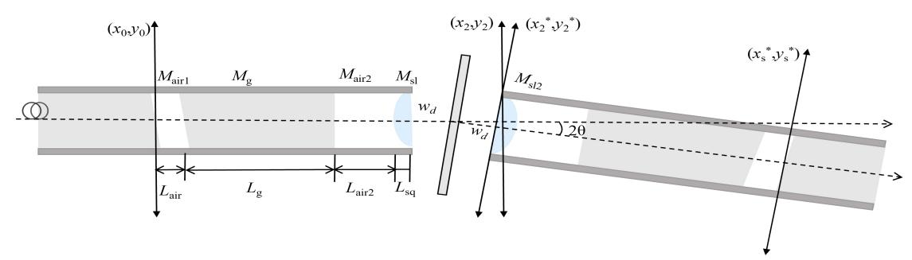

{0}------------------------------------------------

# Miniaturized optical fiber displacement probe with large-collection-angle

Chengpin Wu, 1,2,3 Xikai Hou, 1,2,3 Jiaqi Zhu 1,2,3 and Leiming Wu\*1,2,3

\*leiming wu@gdut.edu.cn

Abstract—In this paper, we propose a fiber optic displacement sensing probe based on a common optical path with a Michelson interferometer structure. The sensing model is established by integrating tilted Gaussian optical field diffraction with an optical transmission matrix, establishing a mapping relationship between the internal component parameters of the probe and the coupling efficiency as well as fringe contrast—thereby providing a theoretical basis for probe design. The proposed method enables high precision measurement of R angles and small rough spots in narrow spaces. Simulation results show that the sensing probe has a dynamic working range of 5.42–5.60 mm and an angular tolerance of ±3.84°.

Keywords—sensing probe, displacement, R angle, narrow space, large-collection-angle

# I. INTRODUCTION

With the continuous development of the aerospace manufacturing industry[1], the technical requirements for engine assembly of the vehicle are getting higher. The internal component may have large shape and position tolerances and R angle after assembly, which affect the flight safety. The internal structure of aircraft engines is compact, and the space is extremely limited and the shape is complicated. Consequently, there is a growing need for precise measurement of R angles and complex shapes in narrow areas.

Fiber optic interferometer sensing probes have been widely studied due to their small size, high measurement accuracy, and ease of embedded measurement[2]. Of the four common fiber optic interferometers, only fiber optic Fabry-Perot interferometer and fiber optic Michelson interferometer can be used for embedded displacement measurement. The light emitted from the fiber diverges and the working distance is usually around 1 mm[3]. Subsequent researchers have collimated lenses and processed tapered fiber tips to reduce beam divergence [4-5]. However most probe research focuses on long-distance measurements and neglects high precision measurement of curved surfaces in narrow spaces.

In this paper, we propose a fiber optic displacement sensing probe with a common optical path Michelson interferometer structure to avoid the nonlinear error caused by F-P multi-beam interference and the effect of the environment without common optical path. Tilted Gaussian optical field diffraction method combined with optical transmission matrix is used to establish the sensing model, and the mapping relationship between the parameters of the

internal components of the probe and the coupling efficiency and fringe contrast is established. A theoretical basis is provided for the design of the probe.

### II. PRINCIPLE

The sensing probe consists of Single Mode Fiber (SMF), air gap, Gradient-Index lenses (GRIN-lens), and single lens with a permeability-enhancing film coated on the necessary end faces. The coupling efficiency and interference quality of the sensing probe are sensitive to the working distance as well as the tilt angle of the surface to be measured. It is necessary to construct a theoretical mathematical model relating the probe element parameters, tilt angle, and coupling efficiency and interference fringe contrast. As shown in Fig. 1, the light in SMF and the outgoing light can be characterized as a Gaussian beam with beam waist size  $w_0$  determined by fiber mode field diameter:

$$I_0 = E(r)E^*(r) = E_0^2 \exp(-\frac{2r^2}{W_0^2})$$
 (1)

where r is the radial distance from the optical field point to the optical axis, and  $E_0$  is the light source amplitude.

Fig. 1. (a) Probe structure . (B) Optical fiber trench . (c) Cross section.

Formation of a fiber trench by removing part of the fiber cladding and core to achieve a Michelson interferometer structure, different beam splitting ratios  $\eta_r$  are achieved by different fiber core transverse cuts  $d_1$ ,  $\eta_r$  expressed as follows:

when 
$$d_1 < w_0$$
,  $\theta_c = \arcsin((w_0 - d_1) / w_0)$   

$$\eta_r = 1 - \frac{\int_{\theta_c}^{\frac{\pi}{2}} \int_{\eta_b}^{w_0} E_0^2 \exp(-2\frac{r^2}{w_0^2}) r dr d\theta_i}{\frac{\pi E_0^2 w_0^2}{2} (1 - \exp(-2\frac{r^2}{w_0^2}))}$$
(2)

&lt;sup>1 Institute of Advanced Photonics Technology, School of Information Engineering, Guangdong University of Technology, Guangzhou, 510006, China

&lt;sup>2 Key Laboratory of Photonic Technology for Integrated Sensing and Communication, Ministry of Education of China, Guangdong University of Technology, Guangzhou, 510006, China

&lt;sup>3 Guangdong Provincial Key Laboratory of Information Photonics Technology, Guangdong University of Technology, Guangzhou, 510006, China

{1}------------------------------------------------

when  $d_1 > w_0$ ,  $\theta_c = \arcsin((d_1 - w_0) / w_0)$ 

$$\eta_r = \frac{\int_{\theta_c}^{\frac{\pi}{2}} \int_{r_b}^{w_0} E_0^2 \exp(-2\frac{r^2}{w_0^2}) r dr d\theta_i}{\frac{\pi E_0^2 w_0^2}{2} (1 - \exp(-2\frac{r^2}{w_c^2}))}$$
(3)

When light is transmitted to the trench surface, a portion of the light is reflected by the high reflecting film, resulting in the generation of reference light, while the remainder is the measurement light. The measurement light, after being collimated by the GRIN-lens, is focused by the single lens, reflected by reflector, and then coupled back to the SMF through the single lens as well as the GRIN-lens. Interference occurs at SMF trench surface and produces an interference signal.

Characterize the isophase radius of curvature  $R_i$  and beam spot radius  $w_i$  of the beam on each surface by the Gaussian beam complex q-parameter. q-parameter is expressed as follows:

$$\frac{1}{q_i} = \frac{1}{R_i} - \frac{i\lambda}{\pi w_i^2} \tag{4}$$

where  $\lambda$  is light source wavelength. The waist position  $w_p$  as well as the waist radius  $w_t$  are then solved by q-parameter combined with the ABCD transfer matrix. The transmission matrix between the output surface of the fiber and the single

lens 
$$M_1 = M_{sl} M_{air2} M_g M_{air1} = \begin{bmatrix} A & B \\ C & D \end{bmatrix}$$
, Therefore, the waist

position  $w_p$  and waist radius  $w_t$  can be derived and expressed as follows:

$$w_{p} = -\frac{AC(\frac{\pi w_{0}^{2}}{\lambda})^{2} + BD}{D^{2} + C^{2}(\frac{\pi w_{0}^{2}}{\lambda})^{2}}$$
 (5)

$$w_{t} = w_{0} \sqrt{\frac{(AD - BC)}{D^{2} + C^{2} (\frac{\pi w_{0}^{2}}{\lambda})^{2}}}$$
 (6)

Fig. 2. Schematic of the measurement optical field transmission of sensing probe

The output optical field of SMF is expressed as follows:

$$E(x_0, y_0) = E_1 \exp(-(\frac{x_0^2 + y_0^2}{w_0^2}))$$
 (7)

where  $E_1$  is the amplitude of output optical field. Measurement optical field distributions in different planes are obtained using the Collins diffraction integral formula combined with the optical transmission matrix. As shown in Fig. 2, the final optical field distribution at the equivalent SMF input plane is obtained and expressed as follows:

$$E(x_s^*, y_s^*) = E_1 \frac{w_0}{w_s^*} \exp(-((x_s^* - d_1)^2 + y_s^{*2}))$$

$$\times (\frac{1}{w_s^{*2}} + \frac{ik}{2R_s^*}) + i\varphi_{total} - ik(2L_{total} - d_2)$$

$$+ikx_s^* (c_g w_d sin2\theta + d_g sin2\theta) + \frac{ik}{2} k_1$$
(8)

where  $w_s \approx w_s^*$ ,  $R_s \approx R_s^*$ ,  $d_1 = a_g w_d \sin 2\theta + b_g \sin 2\theta$ ,  $d_2 = w_d (1-\cos 2\theta)$ ,  $k = 2\pi/\lambda$ , is wave number,  $\varphi_{\text{total}}$  is the all attachment phase.  $L_{\text{total}}$  is the optical length of the reference optical field along the optical axis. There is an x-axis tilt angle  $\theta$  of the reflector. From coordinate system  $(x_2^*, y_2^*)$  to  $(x_s^*, y_s^*)$ , the

transmission matrix 
$$M_2 = M_{air1}M_gM_{air2}M_{sl2} = \begin{bmatrix} a_g & b_g \\ c_\sigma & d_\sigma \end{bmatrix}$$
.

 $k_1 = a_g c_g (w_d \sin 2\theta)^2 + b_g c_g \sin 2\theta + a_g d_g \sin 2\theta + b_g d_g \sin^2 2\theta$ Using mode field matched fiber coupling efficiency approach[6], the intrinsic mode field distribution of SMF is solved for the coupling efficiency  $\eta_m$  with the optical field distribution at the receiving end of an equivalent SMF, expressed as follows:

$$\eta_{m} = \left| \frac{2 \exp(\frac{G^{2} - 4FH}{4F})}{w_{0}w_{s}F} \right|^{2} \tag{9}$$

where parameters of measurement light coupling efficiency.

$$G = \frac{1}{w_0^2} + \frac{1}{w_s^2} + \frac{ik}{2R_s}, H = (d_1 a_g + b_g \sin 2\theta)^2 (\frac{1}{w_s^2} + \frac{ik}{2R_s}),$$

$$F = 2(d_1 a_g + b_g \sin 2\theta) (\frac{1}{w_s^2} + \frac{ik}{2R_s}) - ik(c_g d_1 + d_g \sin 2\theta) .$$

Therefore, it can be derived the expression for the interference light intensity I, expressed as follows:

$$I = I_s + I_r + 2\sqrt{I_s I_r} \cos(2k(L_{total} + L_{fiber}))$$
 (10)

where the measurement light  $I_{\rm m}=I_0\eta_{\rm m}\eta_{\rm r}^2$ , reference light  $I_{\rm m}=I_0(1-\eta_{\rm r})$ ,  $L_{\rm fiber}$  is the optical path length from SMF trench surface to SMF output surface. The fringe contrast is expressed as follows:

$$v = \frac{2\sqrt{(1-\eta_r)\eta_r^2\eta_m}}{(1-\eta_r) + \eta_r^2\eta_m}$$
(11)

{2}------------------------------------------------

### III. SIMULATION AND RESULT

By the mathematical correlation established above, the air gap  $L_{\rm air}$ , the parameters of the GRIN-lens, the air gap  $L_{\rm air2}$  and the parameters of the single lens are the important factors affecting the coupling efficiency and the fringe contrast. The fiber core transverse cut  $d_1$  affects the spectral ratio  $\eta_r$ , which in turn  $\eta_r$  and  $\eta_m$  affect the fringe contrast. In this design, considering the fabrication of GRIN-lens, and the overall fabrication of the probe, it is chosen to select the GRIN-lens with a self-focusing constant g of 0.199 mm-1. The single lens is LA1026. Different beam splitting ratios  $\eta_r$  are achieved by  $d_1$ . As shown in Fig. 3 below, in order to have a larger angular tolerance as well as a dynamic working range. In reference to the fringe contrast needs to be greater than 0.8, we finally chose beam splitting ratio  $\eta_r$  of 0.8. The fiber core transverse cuts  $d_1$  is 3.22 um.

Fig. 3. Fringe is effected by (a) beam splitting ratios  $\eta_r$  and angle (b) beam splitting ratios  $\eta_r$  and working distance  $w_d$ 

The larger the spot radius of the incident beam and the smaller the divergence angle, the smaller the resulting spot radius and the greater the angular tolerance after focusing by the single lens. Since we designed the GRIN-lens to emit a more collimated beam, we set  $L_{\rm air2}$  to 0 mm, taking into account the dimensions of the probe. The spot size and beam waist position of the GRIN-lens are mainly changed by  $L_{\rm g}$  and  $L_{\rm air}$ , which are shown in Fig. 4. The smaller  $L_{\rm g}$  is, the larger the spot size becomes, however, a longer  $L_{\rm air}$  is required. After considering the overall parameters and the probe size, we choose the  $L_{\rm air}$  to be 6.12 mm and the GRIN-lens length  $L_{\rm g}$  to be 2.368 mm.

Fig. 4. Effect of GRIN-lens length  $L_{\rm g}$  and air length  $L_{\rm air}$  on (a) beam waist position (b) beam waist radius

Numerical simulation of the sensing probes is carried out. Gaussian beam waist size  $w_0$  =5.2 um, fiber core transverse cuts  $d_1$ =3.22 um,  $L_{air}$ =6.12 mm,  $L_g$ =3.368 mm, a self-focusing constant g=0.199 mm-1,  $L_{air2}$  =0 mm, single lens is LA1026. Only when the reflector is located in the waist position, the measurement light can be fully coupled back to SMF. As Fig. 5, coupling efficiency remains above 20% when the working distance is from 5.42 to 5.60 mm, and fringe contrast remains at 0.8 when the working distance is from 5.35 mm to 5.68 mm. Therefore, the probe's dynamic working range is 5.42–5.60 mm. When probe is located in

the waist position, the coupling efficiency remains above 20% when the tilt angle of the reflector is from -3.84° to 3.84°. When the reflector is tilted from -4.84° to 4.84°, the fringe contrast remains above 0.8. Therefore, the dynamic operating range of the probe is 5.42-5.60mm with an angular tolerance of  $\pm 3.84$ °.

Fig. 5. Effect of working distance on (a) efficiency (b) fringe contrast. Effect of tilt angle on (c) efficiency (d) fringe contrast.

## IV. DISCUSSION AND CONCLUSIONS

We propose a fiber optic displacement sensing probe with a common optical path Michelson interferometer structure. The sensing model is established using the tilted Gaussian optical field diffraction method combined with the optical transmission matrix, and the mapping relationship between the parameters of the probe's internal components and the coupling efficiency and fringe contrast is determined. This provides a theoretical basis for the probe's design. Based on the model, parameter simulation is conducted, resulting in the probe's dynamic working range being 5.42–5.60 mm and its angular tolerance being ±3.84°. The sensing probe is mainly used in the narrow space for precision measurement of R angle and small rough spots.

### ACKNOWLEDGMENT

This work is partially supported by the National Naturel Science Foundation of China (Grant No. 62475049).

# REFERENCES

- M. Zhang, D. Liu, and Y. Liu, "Recent progress in precision measurement and assembly optimization methods of the aero-engine multistage rotor: A comprehensive review," *Measurement*, vol. 235, pp. 114990, May 2024.
- [2] Y.-C. Wang, L.-H. Shyu, and C.-P. Chang, "The Comparison of Environmental Effects on Michelson and Fabry-Perot Interferometers Utilized for the Displacement Measurement," Sensors (Basel, Switzerland), vol. 10, no. 4, pp. 2577–2586, Mar. 2010.
- [3] K. Thurner, P.-F. Braun, and K. Karrai, "Fabry-Pérot interferometry for long range displacement sensing," Review of Scientific Instruments, vol. 84, no. 9, Sep. 2013.
- [4] C. J. Moreno-Hernández, D. Monzón-Hernández, A. Martínez-Ríos, D. Moreno-Hernández and J. Villatoro, "Long-Range Interferometric Displacement Sensing With Tapered Optical Fiber Tips," in IEEE Photonics Technology Letters, vol. 27, no. 4, pp. 379-382, 15 Feb.15, 2015.
- [5] K. Thurner, Francesca Paola Quacquarelli, P.-F. Braun, Claudio Dal Savio, and K. Karrai, "Fiber-based distance sensing interferometry," vol. 54, no. 10, pp. 3051–3051, Mar. 2015.
- [6] M. van Buren and N. A. Riza, "Foundations for low-loss fiber gradient-index lens pair coupling with the self-imaging mechanism," Applied Optics, vol. 42, no. 3, pp. 550, Jan. 2003.