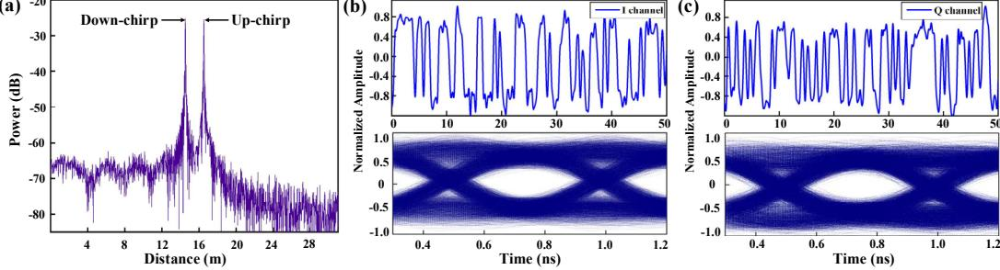
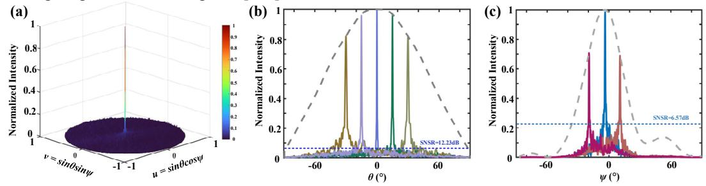

{0}------------------------------------------------

OECC/PSC 2025 OECC/PSC 2025 **ThE1-7**

# **Wide-steering Integrated Sensing and Communication OPA-based Lidar Design with Joint Waveform and Thinned Antenna**

**Yang Chen1 , Xianqiao Liao1 , Jian Xiao1 , Xiaochuan Wang1 , Mengyuan Ye3 , Yu Yu1,2, Chao Wang1,2**

1School of Optical and Electronic Information, Huazhong University of Science and Technology, Wuhan, Hubei, China. 2Wuhan National Laboratory for Optoelectronics, Huazhong University of Science and Technology, Wuhan, Hubei, China. 3School of Automation, China University of Geosciences, Wuhan, Hubei, China

*Abstract: We propose an integrated sensing and communication Lidar design with joint waveform and thinned ring antenna. Evaluation results show a higher data rate of 4Gbps and a wider steering range of 60°×32° can be achieved.* 

*Keywords: Silicon photonics, optical phased array, integrated sensing and communication, joint waveform.*

## **I. INTRODUCTION**

Silicon-based Optical Phased Array (OPA) is a very promising integrated solid-state solution for both Light detection and ranging (Lidar) and optical wireless communication (OWC) systems [1-9]. Recently, Lidar systems with Integrated Sensing and Communication (ISAC) capability have attracted extensive attention in 5/6G era [3]. In ISAC Lidar systems, waveform design plays an essential role that determines the ISAC performance. Y. Li et al. [4] design a joint waveform utilizing Dual Pulse Interval Modulation (DPIM) to implement an ISAC ToF OPA-based Lidar for automobile. However, the communication rate is severely restricted by the ToF pulse at kbps, because the pulse period should be larger than the round-trip time for a detection range up to 200m. C. Poulton et al. [5] adopts two different waveforms of Frequency Modulated Continuous Wave (FMCW) and OOK to achieve ISAC function, but has to use one transmitter OPA chip to alternately implement sensing and communication. Therefore, it is very challenging to design an efficient joint waveform to implement simultaneous sensing and communication without sacrificing any performance.

Meanwhile, performance of optical antenna in 2D plane OPAs should be further optimized to increase both the detection and communication ranges. However, the steering range is limited by high-level side lobes and narrow antenna emission envelopes in the OPA designs. Sparse antenna designs have been used to suppress the side lobes [7, 8]. However, unit spacings required by the sparse method are constrained to be integer multiples of half-wavelength, which limits Side-Mode Suppression Ratio (SMSR) improvement. Besides, the widely used sector grating structure of single antenna element results in a relatively narrow emission envelope, further limiting the steering range below 30° in [8].

This paper presents an ISAC OPA-based Lidar system design. A QPSK-FMCW joint waveform design is proposed to implement simultaneous Lidar sensing and data communication. In addition, a thinned ring antenna array with blazed grating element structure is adopted in the OPA to effectively suppress the side lobes and enlarge the emission envelope, thereby improving the SMSR and steering range of ISAC Lidar system.

## **II. DESIGN AND PRINCIPLE**

Fig.1 (a) shows the proposed ISAC OPA-based Lidar system consisting of one transmitter (TX) terminal and two receiver (RX) terminals. Compared to the conventional FMCW Lidar, the only difference is that an electrical joint waveform of QPSK signal and Linear Frequency Modulated (LFM) triangle signal is generated and then modulated to the optical QPSK-FMCW joint waveform by an MZM in the TX. The two RX are typical Lidar and communication architecture, which can correctly sense target information and recover transmitted data. Fig.1 (b-c) shows the structure of proposed thinned ring antenna array and blazed grating antenna element, which is another key to achieve wide-steering range, high resolution and long detection distance. Note that the other components in OPA are the same as our previous work [6].

Fig. 1. (a) Proposed ISAC OPA-based Lidar system. (b-c) Structure of proposed thinned ring antenna and single blazed grating antenna for OPA.

{1}------------------------------------------------

### A. Principle of QPSK-FMCW Joint Waveform Design

The key idea is to utilize LFM waveform as the subcarrier of MPSK modulation, while the LFM still can be used for FMCW Lidar. This is implemented by mapping MPSK symbols into M phases of the LFM waveform during the frequency sweeping time  $T_m$ , thereby embedding  $N_s$  symbols into the LFM waveform. The MPSK-LFM joint waveform during the  $T_m$  is actually a LFM variant that has a variable phase term determined by the MPSK, as described by

$$s_{MPSK-LFM}(t) = A_s e^{j[\pi \left(2f_0 t + \frac{B}{T_m} t^2\right) + \frac{2\pi}{M} (t - iT_{sub})]}, 0 < t \le T_m, i = 1, 2, \dots, N_s$$
(1)

where  $A_s$ ,  $f_0$ , and B denote the amplitude, initial frequency, and bandwidth of LFM waveform, respectively.  $T_{sub}$  is the MPSK symbol period, which is equal to  $T_m/N_s$ , while M denotes the order of PSK modulation. The MPSK-LFM joint waveform can be directly modulated to the light carrier by MZM without introducing any optical hardware overhead to the Lidar TX, as depicted in Fig. 1 (a). In this study, a QPSK-FMCW joint waveform is implemented.

In the Lidar RX, the OPA antenna delivers the received light to the BD-based coherent receiver. Different from the conventional FMCW Lidar [10], the derived photo current of QPSK-FMCW waveform has only a different phase term, as described by

$$I(t) = 2R\sqrt{P_1P_2}\cos[(2\pi\Delta f t + a_1(t) - a_2(t))]$$
 (2)

where R,  $P_1$ , and  $P_2$  are the responsivity of PD, reflected signal power and LO signal power, respectively.  $\Delta f$  and  $a_1(t)$  denote the frequency difference and phase of reflected signal, respectively, while  $a_2(t)$  are the phase of LO signal. The target's distance and velocity can be well recovered from the frequency term in (2), as the QPSK-LFM joint waveform doesn't affect the frequency and amplitude of optical FMCW waveform, as depicted by (1). Thus, the frequency information and emission power of the Lidar are not affected by the embedded QPSK modulation.

Meanwhile, the communication RX can also properly demodulate the QPSK symbols from the LFM subcarrier, as depicted in Fig. 1 (a). Take the in-phase channel as an example, the recovered data can be derived as described by

$$eI(t) = \frac{1}{2}A_s[I(t) - I(t)\cos(4\pi f_c t) + Q(t)\sin(4\pi f_c t)], f_c = f_0 + \frac{B}{T_m}t$$
(3)

where I(t) and Q(t) are the original in-phase and quadrature signals, respectively. Different from the conventional QPSK communication, the carrier frequency of electrical QPSK-LFM waveform is a chirp signal because the LFM is used as the subcarrier. An ELO is designed to generate the synchronized phase and frequency version of LFM subcarrier for the coherent carrier demodulation, therefore, the transmitted data can be recovered by filtering of the two high-frequency components in (3). Thus, the linearly-changing frequency of LFM subcarrier doesn't affect the QPSK communication.

# B. Principle of Thinned Ring Antenna Design

As OPA is a promising technology to provide OWC systems with high-data-rate and wide-FoV performance [5], the steering range and beam quality in far-field are essential. Our main idea is to utilize the thinned ring antenna with an AI algorithm to suppress side lobes, while adopting the blazed grating antenna element to enlarge emission envelope.

Fig. 1 (b) shows the proposed thinned ring antenna array design based on Genetic Algorithm (GA) method, which consists of M rings with N elements distributed in each ring. The white and blue units in ring array represent the antenna elements before and after the thinning method, respectively. Different from the conventional sparse ring antenna with fixed grid [8], the central angle  $d_{m,n}$  of (m, n)-th elements in proposed antenna array can eliminate the design limit of a fixed  $2\pi(n-1/2)/N_m$  angle, thereby achieving an improved freedom for adopted GA-based element position optimization. The corresponding far-field intensity distribution of proposed thinned-ring based OPA is described as:

$$E(\theta, \psi) = f(\theta, \psi) \cdot \sum_{i=1}^{M} \sum_{j=1}^{N} A_{m,n} e^{j\frac{2\pi}{\lambda} R_m [sin\theta\cos(\psi - d_{m,n}) - sin\theta_s\cos(\psi_s - d_{m,n})]}$$
(4)

where  $\theta$  is the azimuthal angle and  $\psi$  is the elevation angle.  $f(\theta, \psi)$  denotes the emission envelope of single antenna,  $A_{m,n}$  denotes the amplitude of (m, n)-th element and  $R_m$  is the radius of m-th ring. The GA-based antenna design method used in our previous linear thinned antenna in [6] has been extended and adopted into the proposed ring antenna design. Different from the linear thinned antenna, a set of randomly-generated angles  $d_{m,n}$  instead of the element pitches is set as both the initial population and FoM calculation in proposed ring antenna. The FoM function is set to the SMSR of  $20\log_{10}(E_{main}/E_{side})$ , where  $E_{main}$  and  $E_{side}$  are the intensity of main lobe and the maximum side lobe, respectively. During the optimization, the GA iteration process including selection, crossover and mutation is repeated for the population update, until an optimum element position distribution of each ring is reached for a targeted improved SMSR.

In addition to the array-level antenna, the antenna element design is another key to improve the steering range of OPA, because the intensity of steering angle is modulated by the envelope  $f(\theta, \psi)$  [9], as described in (4). Fig. 1 (c) shows the proposed SOI-based antenna element design, which consists of an input waveguide and a group of periodic etched gratings. The emission width W is reduced to generate a large envelope, while the shallow and full etches are designed on grating teeth to exploit blazing effect to strengthen the upward emission power. Thus, both wide envelope and high emission efficiency can be achieved simultaneously. As a result, the steering range of OPA-based sensing and communication can be effectively improved by the array-level and element-level antenna design techniques.

{2}------------------------------------------------

#### III. SIMULATION RESULTS AND DISCUSSION

#### A. ISAC Joint Waveform Evaluation

The VPltransmissionMaker is utilized to evaluate the function of proposed ISAC Lidar system utilizing QPSK-FMCW joint waveform in Fig. 1 (a). Considering the actual experiment setups in our previous FMCW Lidar work, the joint waveform is created by encoding a 4Gbps QPSK signal into the LFM signal with an initial frequency of 8GHz and a bandwidth of 4GHz in a period of 8.192µs. Distance and velocity of a moving target are set as 15m and 7.75m/s, respectively. Fig. 2. (a) shows the result of coherent detection to recover the sensing signal in the Lidar RX. From the frequency sum and difference of beat signal, the distance and velocity of moving target can be correctly calculated as 15.005m and 7.772m/s, respectively. Besides Lidar sensing, the QPSK communication is also verified at the same time. In the communication RX, the optical power received by PD is -4.43dBm and the SNR is 14dB. Fig. 2. (b-c) shows the waveform and eye diagram of recovered data. After DSP processing, the BER is calculated as 4.88×10-4. It indicates that the coherent carrier demodulation and optical DSP processing can properly recover the data at 4Gbps, which is much higher than that in [4].

Fig. 2. (a) Frequency spectra of the Lidar beat signal. (b-c) I/Q waveforms and eye diagrams of the recovered QPSK data.

## B. Thinned Ring Antenna Evaluation

The Lumerical FDTD is utilized to simulate the steering range of proposed thinned ring antenna design at 1550nm. In order to balance the performance and SOI fabrication cost, the number of antenna rings and elements is set to 5 and 128, respectively. After the GA-based element distribution optimization, the Radii of 5 rings are optimized to be  $5\lambda$ ,  $15\lambda$ ,  $25\lambda$ ,  $40\lambda$ , and  $60\lambda$ , while the number of elements on corresponding ring are 5, 12, 28, 35, and 48, respectively. In the element antenna, the width, period, and duty cycle of Si blazed grating are optimized to be 1.2µm, 0.32µm and 0.51, respectively. The simulated emission efficiency is about 55.5% at 1550nm. Fig. 3. (a) shows the 2D far-field simulation results, i.e., a beam resolution of  $0.64^{\circ} \times 0.33^{\circ}$  and SMSR of  $12.23 \text{dB} \times 6.57 \text{dB}$ . Fig. 3. (b-c) show the  $\theta$  axis and  $\psi$  axis far-field steering results, indicating an aliasing-free steering range of  $60^{\circ} \times 32^{\circ}$  and a minimum SMSR higher than 4.43dB. Note that curves in different colors represent different steering angles in the far-field. These results show that the GA-optimization based thinned ring antenna design can effectively suppress the side lobes and improve the emission envelope, thereby achieving a wider steering range of above  $30^{\circ}$  against [7, 8].

Fig. 3. (a) 2D far-field intensity distribution on the u-v plane. (b-c) 1D far-field intensity distribution in  $\theta$  and in  $\psi$  axis dimension.

# IV. CONCLUSIONS

This paper presents a novel OPA-based Lidar system design with ISAC function. Evaluation results show that the QPSK-FMCW joint waveform design can efficiently implement simultaneous sensing and communication, while the proposed thinned ring antenna design with blazed grating structure is able to realize a wide steering range effectively.

## ACKNOWLEDGMENT

This work was partially supported by the Open Project Program of Wuhan National Laboratory for Optoelectronics (2022WNLOKF011) and National Natural Science Foundation of China under Grant (62205312). Corresponding author: Chao Wang.

{3}------------------------------------------------

## **REFERENCES**

- [1] C. P. Hsu et.al., "A Review and Perspective on Optical Phased Array for Automotive LiDAR," IEEE J. Sel. Top. Quantum Electron., vol. 27, no. 1, pp. 1-16, Jan. 2021.
- [2] C. V. Poulton et.al., "Coherent LiDAR with an 8,192-Element Optical Phased Array and Driving Laser," IEEE J. Sel. Top. Quantum Electron., vol. 28, no. 5, pp. 1-8, Oct. 2022.
- [3] Y. Wen et.al., "Optical Integrated Sensing and Communication: Architectures, Potentials and Challenges," IEEE Internet Things Mag., vol. 7, no. 4, pp. 68-74, Jun. 2024.
- [4] Y. Li et.al., "Integrated Communication and Sensing System based on Si-SiN Dual-Layer Optical Phased Array," Opt. Express, vol. 32, no. 19, pp. 33222-33231, Sep. 2024.
- [5] C. V. Poulton et.al., "Long-Range LiDAR and Free-Space Data Communication with High-Performance Optical Phased Arrays," IEEE J. Sel. Top. Quantum Electron., vol. 25, no. 5, pp. 1-8, Sep. 2019.
- [6] M. Ye et.al., "Large Steering Range and Low-Loss Integrated Optical Phased Array with SiN-Si Dual-layer Non-uniform Antenna," Opt. Express, vol. 31, no. 26, pp. 44564-44574, Dec. 2023.
- [7] Q. Huang et.al., "Sparse 2-D Optical Phased Array with Large Grating-lobe-free Steering Range based on an Aperiodic Grid," Opt. Lett., vol. 48, no. 11, pp. 2849-2852, May. 2023.
- [8] D. Lian et.al., "Grating-lobe-free Optical Phased Array with 2-D Circular Sparse Array Aperture and High-efficiency Phase Calibration," Nanophotonics, vol. 13, no. 1, pp. 29-37, Jan. 2023.
- [9] W. Xu et.al., "Aliasing-free optical phased array beam steering with a plateau envelope," Opt. Express, vol. 27, no. 3, pp. 3354- 3368, Feb. 2019.
- [10] W. Zhu et.al., "A Novel Balanced Detection Based Optoelectronic Front End Circuit for FMCW Lidar System," 2024 IEEE International Symposium on Circuits and Systems (ISCAS), pp. 1-4, Singapore, 2024.