{0}------------------------------------------------

# Integrated Positioning and Communication Relying on Wireless Optical OFDM

Chao X[u](https://orcid.org/0000-0002-8423-0342) , *Senior Member, IEEE*, Christos Masouro[s](https://orcid.org/0000-0002-8259-6615) , *Fellow, IEEE*, Shinya Sugiur[a](https://orcid.org/0000-0001-7736-8696) , *Senior Member, IEEE*, Periklis Petropoulos [,](https://orcid.org/0000-0002-1576-8034) *Member, IEEE*, Robert G. Maunde[r](https://orcid.org/0000-0002-7944-2615) , *Senior Member, IEEE*, Lie-Liang Yan[g](https://orcid.org/0000-0002-2032-9327) , *Fellow, IEEE*, Harald Haa[s](https://orcid.org/0000-0001-9705-2701) , *Fellow, IEEE*, and Lajos Hanzo [,](https://orcid.org/0000-0002-2636-5214) *Life Fellow, IEEE*

*Abstract*— Visible Light Positioning and Communication (VLPC) is a promising candidate for implementing Integrated Sensing And Communication (ISAC) in the unlicensed 400 THz to 800 THz band. The current Visible Light Positioning (VLP) systems mainly operate based on the Received Signal Strength (RSS) of the Line-of-Sight (LoS) path. However, its accuracy is degraded by interferences from Non-LoS (NLoS) paths. Furthermore, in Visible Light Communication (VLC) systems, the estimation of Channel State Information (CSI) also becomes challenging, when the optical channel becomes dispersive. Against this background, we propose a new VLPC scheme using Direct Current (DC) biased Optical Orthogonal Frequency-Division Multiplexing (VLPC-DCO-OFDM), where OFDM-based sensing is applied for the sake of improving the resolution of the estimated Channel Impulse Response (CIRs) exploited for positioning functionality. The CIRs estimated by sensing are further exploited to provide enhanced CSI for communication data detection. Moreover, we propose a hybrid Radar-RSS based solution, where the conventional RSS-aided VLP method is invoked for the sake of refining OFDM radar. Our simulation results demonstrate that the proposed VLPC-DCO-OFDM scheme – which simultaneously supports the triple functionalities of illumination, bi-static sensing and communication – is capable of achieving centimeter-level positioning accuracy and Giga-bits-per-second data rate.

*Index Terms*— Visible light communication, VLC, visible light positioning, VLP, integrated sensing and communication, ISAC, orthogonal frequency-division multiplexing, OFDM, channel estimation, non-line-of-sight, NLoS, multipath, bi-static.

Received 14 March 2024; revised 27 August 2024; accepted 4 November 2024. Date of publication 24 February 2025; date of current version 14 May 2025. The work of Christos Masouros was supported by Horizon Europe project 6G MUSICAL UKRI under Grant 10093329. The work of Shinya Sugiura was supported by Japan Science and Technology Agency (JST) as part of the Adopting Sustainable Partnerships for Innovative Research Ecosystem (ASPIRE) under Grant JPMJAP2345. The work of Lajos Hanzo was supported in part by the Engineering and Physical Sciences Research Council (EPSRC) Projects under Grant EP/Y037243/1, Grant EP/W016605/1, Grant EP/X01228X/1, Grant EP/Y026721/1, Grant EP/W032635/1, and Grant EP/X04047X/1; and in part by European Research Council's Advanced Fellow Grant QuantCom under Grant 789028. *(Corresponding author: Lajos Hanzo.)*

Chao Xu, Robert G. Maunder, Lie-Liang Yang, and Lajos Hanzo are with the School of Electronics and Computer Science, University of Southampton, SO17 1BJ Southampton, U.K. (e-mail: cx1g08@soton.ac.uk; rm@soton.ac.uk; lly@soton.ac.uk; lh@soton.ac.uk).

Christos Masouros is with the Department of Electronic and Electrical Engineering, University College London, WC1E 7JE London, U.K. (e-mail: chris.masouros@ieee.org).

Shinya Sugiura is with the Institute of Industrial Science, The University of Tokyo, Meguro City, Tokyo 153-8505, Japan (e-mail: sugiura@ieee.org). Periklis Petropoulos is with the Optoelectronics Research Centre, University

of Southampton, SO17 1BJ Southampton, U.K. (e-mail: pp@orc.soton.ac.uk). Harald Haas is with the Department of Engineering, Electrical Engineering Division, Cambridge University, CB3 0FA Cambridge, U.K. (e-mail: huh21@cam.ac.uk).

Digital Object Identifier 10.1109/JSAC.2025.3543532

# I. INTRODUCTION

I NTEGRATED Sensing And Communication (ISAC) has recently garnered significant attention and it is anticipated to serve as a pillar of 6G [\[1\],](#page-14-0) [\[2\],](#page-15-0) [\[3\]. O](#page-15-1)n one hand, Global Navigation Satellite System (GNSS) boasted of an estimated market value of \$184 million USD in 2022 [\[4\]. Th](#page-15-2)e location-based services are increasingly utilized in sectors like healthcare and assisted living. On the other hand, according to Cisco's Visual Networking Index [\[5\], th](#page-15-3)e global mobile data traffic is projected to escalate to 77.5 exabytes per month by 2025. However, the seamless integration of communication and sensing technologies remains challenging in the highly congested Radio Frequency (RF) bands. Specifically, 5G positioning that operates based on positioning/sounding reference signals can only provide about 1 meter and 10 meters indoor/outdoor accuracy [\[6\]. M](#page-15-4)oreover, the GNSS signals are prone to severe degradation by multipath propagation in urban street-canyons and can be obstructed by indoor structures. The major challenge of realizing ISAC for 6G is that the combination of high-rate communication and highresolution sensing requires a large bandwidth, which may not be available in the fragmented RF spectrum. By contrast, the bandwidths available in the unlicensed visible light band ranging from 400 THz to 800 THz offer the potential of achieving both Gigabits-per-second (Gbps) communication and millimeter-precision sensing [\[7\].](#page-15-5)

To harness this spectrum, significant efforts have been invested in improving the Light Emitting Diode (LED) modulation bandwidth. Traditional Red-Green-Blue (RGB) LEDs have been phased out in the lighting industry due to their difficulties in colour balancing and costs, making white LEDs – utilizing a blue LED with a yellow phosphor coating – a popular alternative [\[8\],](#page-15-6) [\[9\],](#page-15-7) [\[10\].](#page-15-8) However, the modulation bandwidth of white LEDs is often constrained by the resistivecapacitive delay of the blue LEDs and the slow response time of the phosphors. Advances in display technologies, particularly in micro-LED, have addressed these limitations by reducing the junction capacitance through smaller chip size [\[11\],](#page-15-9) [\[12\].](#page-15-10) Notably, the invention of Gallium Nitride (GaN) based blue LEDs, which won the 2014 Nobel Prize in Physics for their high efficiency and ability to synthesize white light [\[13\], m](#page-15-11)arked a significant breakthrough. Since their development in the 1990s, substantial efforts have been dedicated to improving both the carrier transport velocity and recombination rate of GaN based blue LEDs [\[14\],](#page-15-12) [\[15\],](#page-15-13) [\[16\],](#page-15-14) 

{1}------------------------------------------------

[\[17\],](#page-15-15) [\[18\].](#page-15-16) As a result, GaN micro-LEDs have achieved a remarkable 3-dB modulation bandwidth in excess of 1 GHz, as demonstrated in [\[18\],](#page-15-16) [\[19\],](#page-15-17) [\[20\],](#page-15-18) [\[21\], a](#page-15-19)nd [\[22\].](#page-15-20)

However, the current Visible Light Positioning (VLP) technologies have not been designed to benefit from the improved LED modulation bandwidth. More explicitly, for the proximity-based VLP systems [\[23\],](#page-15-21) [\[24\], t](#page-15-22)he mobile device receives a low-rate identification message through visible light and then looks up its location in a database. In order to improve accuracy, fingerprinting VLP systems [\[25\],](#page-15-23) [\[26\]](#page-15-24) estimate the user location by matching online measured data with a comprehensive database that models a room's topology. Moreover, camera-based VLP solutions have been proposed in [\[27\]](#page-15-25) and [\[28\], w](#page-15-26)hich have increased hardware cost and signal processing complexity. By contrast, the VLP technologies relying on signals received within the field-of-view (FoV) of a 'single-pixel' photodiode (PD) are more practical and economical solutions, where the Time-of-Arrival (ToA) [\[29\], A](#page-15-27)ngle-of-Arrival (AoA) [\[30\],](#page-15-28) [\[31\],](#page-15-29) [\[32\]](#page-15-30) and Received Signal Strength (RSS) [\[33\],](#page-15-31) [\[34\],](#page-15-32) [\[35\],](#page-15-33) [\[36\],](#page-15-34) [\[37\]](#page-15-35) have been evaluated. However, the ToA/AoA/RSS-based VLP systems generally assume perfect knowledge of both path loss model and transceiver parameters, such as LED/PD directions, which limits the types of applications, users and their mobilities. Furthermore, the above VLP techniques purely rely on the assumption of Line-of-Sight (LoS) propagation, hence their accuracies are severely degraded by the Non-LoS (NLoS) reflections from buildings, walls and diverse other surfaces. The detrimental multipath effects imposed on VLP have been confirmed both theoretically and experimentally in [\[38\],](#page-15-36) [\[39\],](#page-15-37) [\[40\],](#page-15-38) [\[41\].](#page-15-39)

The detrimental frequency selectivity induced by the multipath effect can be effectively mitigated by the multi-carrier waveform of Orthogonal Frequency-Division Multiplexing (OFDM). In contrast to RF systems, the practical intensity modulation with direct detection (IM/DD) used for Visible Light Communication (VLC) requires real- and positivevalued signals in the time-domain (TD). In order to facilitate this for Optical OFDM (O-OFDM), Direct Current (DC) biased O-OFDM (DCO-OFDM) [\[42\]](#page-15-40) was proposed to rely on the Hermitian symmetry, where half of the modulated symbols in the frequency-domain (FD) are the conjugates of the other half, so that the TD signals become real-valued after Inverse Fast Fourier Transform (IFFT). In order to eliminate the DC power dissipation, the Asymmetrically Clipped O-OFDM (ACO-OFDM) scheme [\[43\],](#page-15-41) [\[44\]](#page-15-42) arranges odd-indexed subcarriers to obey Hermitian symmetry, while all even-indexed subcarriers are set to zeros. Moreover, in order to attain the DCO-OFDM throughput, the Layered ACO-OFDM (LACO-OFDM) [\[45\]](#page-15-43) modulates all subcarriers layer by layer. It was demonstrated in [\[45\],](#page-15-43) [\[46\],](#page-15-44) and [\[47\]](#page-16-0) that the family of O-OFDM schemes is capable of outperforming the single-carrier optical waveforms of On-Off Keying (OOK) and Pulse-Position Modulation (PPM) in the face of frequency selectivity. Moreover, channel estimation (CE) can be performed for O-OFDM in the TD, FD or Delay-Doppler (DD)-domain [\[48\],](#page-16-1) [\[49\],](#page-16-2) [\[50\],](#page-16-3) [\[51\]. S](#page-16-4)pecifically, by invoking the Symplectic Finite Fourier Transform (SFFT), the DD-domain pilot symbols are

TABLE I NOVEL CONTRIBUTIONS OF THE PROPOSED VLPC SCHEME IN COMPARI-SON TO THE STATE-OF-THE-ART VLP AND VLC SCHEMES

|                        |                                       | Arbitrary LED/PD Parame- ters? | Separate LoS and NLoS for VLP? | Mitigate Multi- path for VLC? | Channel Estima- tion for VLC? |
|------------------------|---------------------------------------|-----------------------------------------|-----------------------------------------|----------------------------------------|----------------------------------------|
| VLP                    | Proximity [23], [24]                  | $\checkmark$                            |                                         |                                        |                                        |
|                        | Fingerprinting [25], [26], [52], [53] | √                                       |                                         |                                        |                                        |
|                        | Camera [27], [28]                     |                                         | <b>√</b>                                |                                        |                                        |
|                        | ToA [29]                              |                                         |                                         |                                        | LoS                                    |
|                        | AoA [30]–[32]                         |                                         |                                         |                                        | LoS                                    |
|                        | RSS [33]–[37]                         |                                         |                                         |                                        | LoS                                    |
| VLC                    | OOK/PPM                               |                                         |                                         |                                        | LoS                                    |
|                        | DCO-OFDM [42]                         |                                         |                                         |                                        | TD/FD                                  |
|                        | ACO-OFDM[43], [44]                    |                                         |                                         | $\sqrt{}$                              | TD/FD                                  |
|                        | LACO-OFDM[45]–[47]                    | <b>√</b>                                |                                         | <b>√</b>                               | TD/FD                                  |
| Proposed VLPC-DCO-OFDM |                                       | <b>√</b>                                | <b>√</b>                                | $\checkmark$                           | Radar                                  |

spread over the entire time-frequency (TF)-domain, which improves the diversity gain attained, as detailed in [\[51\].](#page-16-4)

In RF systems, OFDM ISAC [\[54\],](#page-16-5) [\[55\],](#page-16-6) [\[56\]](#page-16-7) is capable of benefiting from an improved modulation bandwidth in terms of improving both the radar sensing resolution and communication data rate, which have not been applied to the joint design of Visible Light Positioning and Communication (VLPC). More explicitly, DCO-OFDM was invoked for VLP in [\[33\]](#page-15-31) and [\[37\], w](#page-15-35)here the LoS-based distance estimation is performed by averaging RSSs over all subcarriers, while a reduced number of subcarriers associated with high RSSs were selected for LoS-based VLP in [\[35\]. I](#page-15-33)n [\[57\], a](#page-16-8) VLP algorithm was constructed by observing the phase rotation of the LoS path on different subcarriers. These VLP schemes cannot separate the LoS and NLoS paths, hence leading to degraded indoor VLP accuracies in the same way as the single-carrier VLP systems. Moreover, in [\[36\], t](#page-15-34)he DCO-OFDM-based VLC schemes utilize TD-estimated channel state information (CSI) in order to infer the position of the user, which is inferior both to OFDM radar sensing and to DD-domain CSI estimation. Against this background, we propose an O-OFDM based VLPC for the first time in the literature, where the sensing precision is improved by separating the LoS and NLoS components, while the communication data rate is improved by utilizing sensing-aided CSI estimation. In summary, the novel contributions of this work are highlighted in comparison to the state-of-the-art in Table [I,](#page-1-0) which are detailed as follows:

- • We propose a new VLPC scheme using DCO-OFDM (VLPC-DCO-OFDM), where OFDM radar[1](#page-1-1) is applied for the sake of improving the resolution and quality of estimated Channel Impulse Response (CIRs). In the absence of Doppler detection in IM/DD, only a single OFDM pilot symbol is required for facilitating OFDM radar sensing in the delay domain, which is capable of improving both the VLP accuracies and the CSI for VLC data detection, hence realizing ISAC in the optical band.
- • Compared to the existing VLP solutions, the proposed VLPC-DCO-OFDM sensing is capable of making the LoS and NLoS paths resolvable in the delay domain by OFDM radar. Moreover, we further propose a hybrid

1The original OFDM radar of [\[54\]](#page-16-5) was designed for a mono-static scenario, but here we extend this concept to bi-static sensing for VLPC.

{2}------------------------------------------------

Radar-RSS arrangement, where the RSS-based VLP may be invoked again for the sake of refining OFDM radar sensing.

- Compared to the classic VLC systems, we demonstrate that optical OFDM radar is capable of producing enhanced CIR estimation that outperforms the conventional TD/FD-based CSI estimation [\[42\],](#page-15-40) [\[43\],](#page-15-41) [\[44\],](#page-15-42) [\[45\],](#page-15-43) [\[46\],](#page-15-44) [\[47\], l](#page-16-0)eading to increased VLC data rates in the face of optical channel dispersion. The sensing-aided CSI estimation operates under the same principle as the best-performing DD-domain CSI estimation [\[51\], b](#page-16-4)ut the DD-domain CSI estimation benchmark requires multiple OFDM pilot symbols.
- Our simulation results demonstrate that the proposed VLPC-DCO-OFDM schemes – which simultaneously support the triple functionalities of illumination, positioning and communication – are capable of achieving centimeter-level positioning accuracy and Giga-bits-persecond (Gbps) data rate, thanks to the application of OFDM radar to optical ISAC.

Nonetheless, we must report that compared to singlecarrier LoS-based VLP [\[29\],](#page-15-27) [\[30\],](#page-15-28) [\[31\],](#page-15-29) [\[32\],](#page-15-30) [\[34\], t](#page-15-32)he extra complexities of FFT/IFFT are required by the proposed VLPC-DCO-OFDM, which is inevitable for facilitating OFDM-based VLC in the face of optical channel dispersion. Moreover, we note that the IM/DD based VLP schemes cannot directly facilitate velocity estimation for ISAC applications, because all signal powers across all frequencies are combined by direct detection, where the velocity-dependent Doppler frequencies cannot be directly estimated. Nonetheless, it has been recently demonstrated in [\[58\]](#page-16-9) that the Doppler frequency estimation for a single target becomes feasible for IM/DD, when an additional reference RF carrier is added to modulate the optical signal. However, this issue deserves a paper in its own right in our future research.

The paper is organized as follows. The optical channel model is presented in Sec. [II,](#page-2-0) and the VLPC-DCO-OFDM signal transmission and reception are modelled in Sec. [III.](#page-4-0) The proposed VLPC-DCO-OFDM sensing and communication functionalities are developed in Sec. [IV](#page-5-0) and Sec. [V,](#page-7-0) respectively. Our simulation results are presented in Sec. [VI,](#page-9-0) and our conclusions are offered in Sec. [VII.](#page-14-1)

The notations (·) ∗ and exp(·) denote the conjugate of a complex number and the natural exponential function, respectively, while we have ω b a = exp(j 2πb a ). The notations ℜ(·) and ℑ(·) represent the real and the imaginary parts of a complex number, respectively, while p(·) and E(·) are the probability and the expectation, respectively. The key abbreviations used in this paper are summarized in Table [II.](#page-2-1)

# II. OPTICAL CHANNEL MODEL

# *A. Scenarios and System Description*

A variety of ISAC use cases such as gesture recognition, health monitoring, smart mobility, indoor navigation and augmented reality are expected to be realized in indoor environments, where the satellite-based Global Positioning System (GPS) signals are blocked. Therefore, in this work, an indoor LED/PD-based visible light system is considered,

TABLE II NOMENCLATURE

| ACO   | Asymmetrically clipped optical                        |
|-------|-------------------------------------------------------|
| AWGN  | Additive white Gaussian noise                         |
| BW    | Bandwidth                                             |
| CCMC  | Continuous-input continuous-output memoryless channel |
| CE    | Channel estimation                                    |
| CFR   | Channel frequency responses                           |
| CIR   | Channel impulse response                              |
| CSI   | Channel state information                             |
| CP    | Cyclic prefix                                         |
| DC    | Direct current                                        |
| DCO   | DC-biased optical                                     |
| DCMC  | Discrete-input continuous-output memoryless channel   |
| DD    | Delay-Doppler                                         |
| FD    | Frequency-domain                                      |
| GPS   | Global positioning system                             |
| IM/DD | Impulse modulation with direct detection              |
| ISAC  | Integrated sensing and communication                  |
| LACO  | Layered ACO                                           |
| LED   | Light emitting diode                                  |
| LoS   | Line-of-sight                                         |
| NLoS  | None-line-of-sight                                    |
| OFDM  | Orthogonal frequency-division multiplexing            |
| OOK   | On-off keying                                         |
| PD    | Photodiode                                            |
| PSK   | Phase shift keying                                    |
| QAM   | Quadrature amplitude modulation                       |
| RF    | Radio frequency                                       |
| RMSE  | Root mean squared error                               |
| RSS   | Received signal strength                              |
| SCS   | Subcarrier spacing                                    |
| TD    | Time-domain                                           |
| VLC   | Visible light communication                           |
| VLP   | Visible light positioning                             |
| VLPC  | Visible light positioning and communication           |
|       |                                                       |

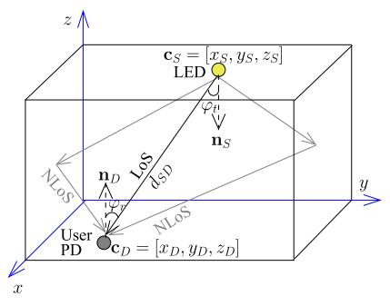

Fig. 1. VLPC for supporting the triple functionalities of illumination, positioning and communication.

as portrayed by Fig. [1.](#page-2-2) We note that the extension of this work to outdoor services is also feasible, when the same LED hardwares are used by street lights [\[59\].](#page-16-10)

In Fig. [1,](#page-2-2) the communication data is modulated onto the instantaneous power of the LED light emission using intensity modulation at a high frequency, which is imperceptible to the human eye having a low fusion frequency of about 20 Hz. Direct detection is performed by the PD, which produces a current that is proportionate to the instantaneous received signal power. Consequently, the PD receiver positions itself based on the sensing estimates of signal strengths and/or delays, where we propose to harness OFDM radar principles for separating the LoS and NLoS paths. Moreover, we expploit for the first time the OFDM radar-sensed LoS and NLoS strengths as estimated CSI for improving the performance of communication data detection.

{3}------------------------------------------------

Generally speaking, there are three sensing modes in RF systems, namely mono-static, bi-static and electronic support measures (ESM) [60], [61]. The mono-static active sensing mode relies on a collocated transmitter and receiver pair. By contrast, the transmitter and the receiver are separated in the bi-static active sensing mode, where the receiver estimate CIRs via reflected signals. Moreover, for the ESM passive sensing, the receiver directly detects the signals emitted by the transmitter, which is how GPS operates. The conventional VLP methods based on ToA [29], AoA [30], [31], [32] and RSS [33], [34], [35], [36], [37] belong to the ESM mode. By contrast, in our proposed VLPC scheme, optical bi-static sensing is implemented based on visible light reflected signals, as portrayed by Fig. 1.

#### B. LoS Modelling

According to the generalized Lambertian pattern, the LoS path spanning from a LED to a PD seen in Fig. 1 is formulated as [41], [62], [63]:

$$h_0(\tau) = \frac{(q+1)A_{\text{PD}}}{2\pi d_{\text{SD}}^2} \cos^q(\varphi_t) \cos(\varphi_r) g_{\text{of}}(\varphi_r) g_{\text{oc}}(\varphi_r) \delta(\tau - \tau_0),$$
(1)

where  $q=-\frac{\ln 2}{\ln \cos(\phi_{1/2})}$ ,  $\phi_{1/2}$ ,  $g_{\rm of}$  and  $\varphi_t$  refer to the LED's Lambertian mode order, half-power semi-angle, gain of optical filter, and emergence angle, respectively. We note that the special case of q=1 indicates the ideal Lambertian pattern, which generally cannot be achieved by real-world LEDs due to their realistic manufacturing impairment.  $A_{\rm PD}$  represents the PD's detector physical area, while the PD's gain of optical concentrator is:

$$g_{\text{oc}}(\varphi_r) = \begin{cases} \frac{n^2}{\sin^2 \psi_{\text{FoV}}}, & 0 \le \varphi_r \le \psi_{\text{FoV}} \\ 0, & \varphi_r > \psi_{\text{FoV}}, \end{cases}$$
(2)

where  $\varphi_r$ ,  $\psi_{FoV}$  and n refer to the PD's incidence angle, FoV semi-angle and refractive index of the optical concentrator, respectively. The coordinate of source LED and its unit normal vector are given by  $\mathbf{c}_S = [x_S, y_S, z_S]$  and  $\mathbf{n}_S =$  $[\sin(\pi - \theta), \sin(\pi - \theta), \cos(\pi - \theta)]$ , respectively, where  $\theta$ refers to the LED's tilt angle. The coordinate of the PD and its unit normal vector are given by  $\mathbf{c}_D = [x_D, y_D, z_D]$ and  $\mathbf{n}_D = [\sin \varphi_r^{\alpha} \cos \varphi_r^{\beta}, \sin \varphi_r^{\alpha} \sin \varphi_r^{\beta}, \cos \varphi_r^{\alpha}],$  respectively, where  $\varphi_r^{\alpha}$  and  $\varphi_r^{\beta}$  refer to the polar angle and azimuth angle of the PD in the spherial coordinate system, respectively. We note that  $\varphi_r^{\alpha}$  and  $\varphi_r^{\beta}$  can be arbitrary, owing to the fact that  $\mathbf{n}_D$  of the user PD may be completely random without the user being aware of it. Therefore, the emergence angle of the LED and incidence angle of PD are evaluated by  $\varphi_t = \arccos((\mathbf{c}_D - \mathbf{c}_S) \cdot \mathbf{n}_S/d_{SD})$  and  $\varphi_r = \arccos\left((\mathbf{c}_S - \mathbf{c}_D) \cdot \mathbf{n}_D/d_{\mathrm{SD}}\right)$ , respectively. The distance between the LED and PD is given by  $d_{SD} = \|\mathbf{c}_S - \mathbf{c}_D\|^2$ , and the delay of LoS path within the impulse function  $\delta(\tau - \tau_0)$ of (1) is given by  $\tau_0 = \frac{d_{\rm SD}}{c}$ , where c refers to the speed of light. The relationships between these VLPC system parameters are summarized in Table III.

TABLE III
SUMMARY ON VLPC PARAMETER EVALUATIONS

| Notation                                                                                                                                   | Parameter                      |  |
|--------------------------------------------------------------------------------------------------------------------------------------------|--------------------------------|--|
| $q = -\frac{\ln 2}{\ln \cos(\phi_{1/2})}$                                                                                                  | Lambertian mode order of       |  |
| $q = \frac{1}{\ln \cos(\phi_{1/2})}$                                                                                                       | LED                            |  |
| $\mathbf{c}_S = [x_S, y_S, z_S]$                                                                                                           | Coordinate of source (LED)     |  |
| $\mathbf{c}_D = [x_D, y_D, z_D]$                                                                                                           | Coordinate of destination (PD) |  |
| $\mathbf{n}_S = [\sin(\pi - \theta), \sin(\pi - \theta), \cos(\pi - \theta)]$                                                              | Unit normal vector of source   |  |
| $\mathbf{n}_S = [\sin(\pi - v), \sin(\pi - v), \cos(\pi - v)]$                                                                             | (LED)                          |  |
| $\mathbf{n}_D = [\sin \varphi_r^{\alpha} \cos \varphi_r^{\beta}, \sin \varphi_r^{\alpha} \sin \varphi_r^{\beta}, \cos \varphi_r^{\alpha}]$ | Unit normal vector of destina- |  |
| $\mathbf{n}_D = [\sin \varphi_r \cos \varphi_r, \sin \varphi_r \sin \varphi_r, \cos \varphi_r]$                                            | tion (PD)                      |  |
| $\varphi_t = \arccos\left((\mathbf{c}_D - \mathbf{c}_S) \cdot \mathbf{n}_S / d_{\text{SD}}\right)$                                         | Emergence angle of LED         |  |
| $\varphi_r = \arccos\left((\mathbf{c}_S - \mathbf{c}_D) \cdot \mathbf{n}_D / d_{\text{SD}}\right)$                                         | Incidence angle of PD          |  |
| $d_{SD} = \ \mathbf{c}_S - \mathbf{c}_D\ ^2$                                                                                               | Distance between LED and PD    |  |

#### C. NLoS Modelling

As demonstrated in Fig. 1, the light propagation spanning from a LED to a PD may experience reflections from a variety of surfaces. The reflectivities of plaster wall, as well as of the ceiling and floor are estimated to be 0.74, 0.38 and 0.61, respectively, within the 400 THz to 800 THz visible light band [64]. The NLoS link spanning from the LED to the PD may be modelled by I segments of I-1 reflections by Lambertian reflectors [41], [62], [63] as follows:

$$h_{p} = \frac{(q+1)A_{PD}A_{R_{1}}\rho_{R_{1}}}{2\pi^{2}d_{SR_{1}}^{2}d_{R_{I}D}^{2}}\cos^{q}(\varphi_{t}^{SR_{1}})\cos(\varphi_{r}^{SR_{1}})\cos(\varphi_{t}^{R_{I}D})$$

$$\times\cos(\varphi_{r}^{R_{I}D})g_{of}(\varphi_{r}^{R_{I}D})g_{oc}(\varphi_{r}^{R_{I}D})$$

$$\times\prod_{i=1}^{I-1}\frac{A_{R_{i+1}}\rho_{R_{i+1}}}{\pi d_{R_{i}R_{i+1}}^{2}}\cos(\varphi_{t}^{R_{i}R_{i+1}})\cos(\varphi_{r}^{R_{i}R_{i+1}})\delta(\tau-\tau_{p}),$$
(3)

where  $A_{R_i}$  and  $\rho_{R_i}$  refer to the area and reflectance of the i-th reflecting area, respectively. The superscripts  $SR_1$ ,  $R_iR_{i+1}$  and  $R_ID$  indicate the link segments from the LED to first reflecting area, the i-th reflecting area to the (i+1)-th reflecting area, and the last reflecting area to the PD, respectively. In summary, there are a total of P CIRs, where the LoS path of (1) associated with index p=0 is the first CIR, while the NLoS paths of (3) associated with  $(1 \le p \le P-1)$  constitute the rest of the CIR taps. Based on (3), the delay of the NLoS path is given by  $\tau_p = \frac{d_{\text{SRD}_p}}{c}$ , where the NLoS propagation distance is  $d_{\text{SRD}_p} = d_{SR_1} + d_{R_ID} + \sum_{i=1}^{I-1} d_{R_iR_{i+1}}$ .

#### D. Noise Modelling

Naturally, the VLPC channel modelling also takes into account the Additive White Gaussian Noise (AWGN) [41], [62], [63] having zero mean and a variance of  $N_0 = N_0^{\rm shot} + N_0^{\rm thermal}$ . Explicitly, the variance of shot noise is given by  $N_0^{\rm shot} = 2eR_pP_rB + 2eI_{bg}I_2B$ , where  $e, R_p, P_r$  and B refer to an electron's charge, PD responsivity, as well as to the received signal power and bandwidth, respectively, where  $I_{bg}$  and  $I_2$  are the background current and noise bandwidth factor, respectively, where the effective noise bandwidth is given by  $I_2B$ . The variance of the thermal noise is given by  $N_0^{\rm thermal} = \frac{4k_BT_K}{R_f}I_2B + \frac{16\pi^2k_BT_k\Gamma}{g_m}\eta^2A_{\rm PD}^2I_3B^3 \approx \frac{8\pi k_BT_K}{G_{\rm oc}}\eta A_{\rm PD}I_2B^2 + \frac{16\pi^2k_BT_k\Gamma}{G_{\rm oc}}\eta^2A_{\rm PD}^2I_3B^3$ , where the two terms of  $\frac{4k_BT_K}{R_f}I_2B \approx \frac{8\pi k_BT_K}{G_{\rm oc}}\eta A_{\rm PD}I_2B^2$  and  $\frac{16\pi^2k_BT_k\Gamma}{G_{\rm oc}}\eta^2A_{\rm PD}^2I_3B^3$  represent the feedback-resistor noise and field-effect transistor (FET) channel noise, respectively. The feedback resistance is calculated

{4}------------------------------------------------

TABLE IV
SUMMARY ON VLPC PARAMETERS

| Parameter                                | Example Value                                                                                                                                                                                                                                                                                                                                                                                                                                                                                 |
|------------------------------------------|-----------------------------------------------------------------------------------------------------------------------------------------------------------------------------------------------------------------------------------------------------------------------------------------------------------------------------------------------------------------------------------------------------------------------------------------------------------------------------------------------|
| Half-power semi-angle of LED             | 60°                                                                                                                                                                                                                                                                                                                                                                                                                                                                                           |
| Detector physical area of PD             | 1 cm 2                                                                                                                                                                                                                                                                                                                                                                                                                                                                             |
| LED tilt angle                           | 00                                                                                                                                                                                                                                                                                                                                                                                                                                                                                            |
| Polar angle of PD                        | arbitrary                                                                                                                                                                                                                                                                                                                                                                                                                                                                                     |
| Azimuth angle of PD                      | arbitrary                                                                                                                                                                                                                                                                                                                                                                                                                                                                                     |
| Gain of optical filter at LED            | 2.5481                                                                                                                                                                                                                                                                                                                                                                                                                                                                                        |
| Refractive index of optical concentrator | 1.5                                                                                                                                                                                                                                                                                                                                                                                                                                                                                           |
| Field-of-view semi-angle of PD           | 60°                                                                                                                                                                                                                                                                                                                                                                                                                                                                                           |
| Electron charge                          | $1.602 \times 10^{-19} \text{ C}$                                                                                                                                                                                                                                                                                                                                                                                                                                                             |
| Responsivity of PD                       | 0.54 A/W                                                                                                                                                                                                                                                                                                                                                                                                                                                                                      |
| Background current                       | 5100 μA                                                                                                                                                                                                                                                                                                                                                                                                                                                                                       |
| Noise bandwidth factor                   | 0.562                                                                                                                                                                                                                                                                                                                                                                                                                                                                                         |
| Boltzmann's constant                     | $1.381 \times 10^{-23}$ J/K                                                                                                                                                                                                                                                                                                                                                                                                                                                                   |
| Absolute temperature                     | 300 K                                                                                                                                                                                                                                                                                                                                                                                                                                                                                         |
| Channel noise factor of the FET          | 1.5                                                                                                                                                                                                                                                                                                                                                                                                                                                                                           |
| Open-loop voltage gain                   | 10                                                                                                                                                                                                                                                                                                                                                                                                                                                                                            |
| Field capacitance per unit area          | 11.2pF/cm 2                                                                                                                                                                                                                                                                                                                                                                                                                                                                        |
| FET trans-conductance                    | 30 ms                                                                                                                                                                                                                                                                                                                                                                                                                                                                                         |
| Noise bandwidth factor                   | 0.0868                                                                                                                                                                                                                                                                                                                                                                                                                                                                                        |
| Subcarrier spacing                       | 240 kHz                                                                                                                                                                                                                                                                                                                                                                                                                                                                                       |
|                                          | Half-power semi-angle of LED  Detector physical area of PD  LED tilt angle Polar angle of PD  Azimuth angle of PD  Gain of optical filter at LED  Refractive index of optical concentrator Field-of-view semi-angle of PD  Electron charge Responsivity of PD  Background current  Noise bandwidth factor  Boltzmann's constant  Absolute temperature  Channel noise factor of the FET  Open-loop voltage gain Field capacitance per unit area  FET trans-conductance  Noise bandwidth factor |

by  $R_f \approx \frac{G_{\rm oc}}{2\pi B \eta A_{\rm PD}}$ . Here,  $k_B$ ,  $T_K$  and  $G_{\rm oc}$  refer to Boltzmann's constant, absolute temperature and to the open-loop voltage gain, respectively, while  $\eta$ ,  $g_m$ ,  $\Gamma$  and  $I_3$  refer to the field capacitance per unit area, FET trans-conductance, FET channel noise factor and noise bandwidth factor, respectively. We note that the FET channel noise is a function of  $B^3$  due to nonlinearities in the FET. Interested readers might like to refer to [65] for more details. In summary, the VLPC modelling parameters are summarized in Table IV, where the numerical values are chosen based on the simulations and experiments presented in [33], [34], [35], [41], [57], [62], [63], and [66].

## E. Localization and Synchronization

For the calculation of PD coordinate  $\mathbf{c}_D = [x_D, y_D, z_D]$ , the three distances between the PD and three LEDs have to be estimated, so that the three variables of  $x_D$ ,  $y_D$  and  $z_D$  can be determined by triangulation. Nonetheless, when the LEDs and the PD are not perfectly synchronized, four LEDs have to be harnessed for determining an additional variable related to a synchronization error.' This technique is known as the time-difference-of-arrival (TDoA) [67]. For the same reason, the common GPS service requires four satellites instead of three. In this work, we focus our attention on the fundamental VLPC waveform design related to the detection of the distance between an LED transmitter and a PD receiver, as demonstrated by Fig. 1.

#### III. VLPC-DCO-OFDM SIGNAL MODELLING

In this section, the LED transmission is modelled in Sec. III-A, and the PD's received model is given in Sec. III-B.

# A. LED Signal Transmission

Firstly, the proposed VLPC-DCO-OFDM maps the information to PSK/QAM symbols in the FD, where the  $\overline{m}$ -th subcarrier ( $0 \le \overline{m} \le M - 1$ ) of the n-th VLPC-DCO-OFDM

symbol  $(n \ge 0)$  is expressed as follows:

$$\overline{s}[n,\overline{m}] = \begin{cases}
\overline{s}[n,\overline{m}], & 1 \leq \overline{m} \leq \frac{M}{2} - 1 \\
\overline{s}^*[n,M-\overline{m}], & \frac{M}{2} + 1 \leq \overline{m} \leq M - 1 \\
\eta_0, & \overline{m} = 0 \\
1, & \overline{m} = \frac{M}{2},
\end{cases} \tag{4}$$

where M is the number of subcarriers, while  $\eta_0$  refers to the DC bias. In contrast to the conventional DCO-OFDM schemes of [33], [35], [37], and [42], VLPC-DCO-OFDM activates all subcarriers in (4), so that multi-carrier OFDM radar sensing can be applied. As discussed in Sec. I, ACO-OFDM [43], [44] is capable of avoiding the DC bias in (4) at the cost of halving the throughput. LACO-OFDM [45] is capable of improving the throughput of ACO-OFDM at the cost of layer-by-layer data detection complexity and potential cross-layer error propagation. Without diverging from our main focus, we focus our attention on DCO-OFDM schemes in this paper.

The Hermitian symmetry property is retained, i.e. we have  $\{\overline{s}[n,\overline{m}]=\overline{s}^*[n,M-\overline{m}]\}_{\overline{m}=\frac{M}{2}+1}^{M-1}$  as shown in (4). As a result, the TD signals after IFFT become:

$$s[n,m] = \frac{1}{\sqrt{M}} \sum_{\overline{m}=0}^{M-1} \overline{s}[n,\overline{m}] \omega_M^{m\overline{m}}$$

$$= \frac{1}{\sqrt{M}} \left[ \eta_0 + (-1)^m \right] + \frac{2}{\sqrt{M}} \operatorname{Re} \left( \sum_{\overline{m}=1}^{\frac{M}{2}-1} \overline{s}[n,\overline{m}] \omega_M^{m\overline{m}} \right),$$
(5)

where  $\omega_M = \exp(j\frac{2\pi}{M})$ . The DC bias  $\eta_0$  has to be sufficiently high, so that the TD signals s[n,m] of (5) can be clipped at zero with negligible loss [46], [51].

# B. PD Signal Reception

Based on the multipath channel model of Sec. II, the TD received signal is given by [51]:

$$y[n, m] = \int \sqrt{P_t} h(\tau) s(t - \tau) d\tau + v(t) \Big|_{t = \frac{nT}{M} = \frac{n}{M\Delta f}, \tau_p = \frac{l_p}{M\Delta f}}$$

$$= \sum_{p=0}^{P-1} \sqrt{P_t} h_p s[n, < m - l_p >_M] + v[n, m]$$

$$= \sqrt{\frac{P_t}{M}} \sum_{p=0}^{P-1} h_p \sum_{\overline{m}=0}^{M-1} \overline{s}[n, \overline{m}] \omega_M^{(m-l_p)\overline{m}} + v[n, m],$$
(6)

where the delay index of the LoS path of (1) and that of the NLoS path of (3) are given by  $l_0 = \lfloor \frac{\tau_0}{T} \rceil = \lfloor \tau_0 M \Delta f \rceil$  associated with p=0 and  $l_p = \lfloor \frac{\tau_p}{T} \rceil = \lfloor \tau_p M \Delta f \rceil$  associated with  $(1 \leq p < P)$ , respectively. The noise term v[n,m] includes both the AWGN modelled in Sec. II-D and the clipping noise discussed in Sec. III-A. The notations  $<\cdot>_M$  and  $\lfloor\cdot\rceil$  represent the M-tuple circular shift and rounding to integer, respectively. Moreover, a cyclic prefix (CP) should be added to the TD signal transmission of (5) and removed from the TD signal reception of (6). For the circular convolutional

{5}------------------------------------------------

model of (6) to be free of inter-symbol interference, the CP length has to be higher than the maximum delay, i.e.  $M_{cp} > \max_{\forall p} l_p$ , which is easy to achieve in high-bandwidth VLPC. For example, when a subcarrier spacing (SCS) of 240kHz and 10% CP overhead are used, the NLoS paths spreading up to  $\frac{10\times SCS}{10\times SCS} = 125$ m are covered by CP.

We note that (6) is also valid for fractional delay indices  $l_p = \frac{\tau_p}{T}$  encountered in RF systems [48], [68], [69]. However, unlike RF systems that rely on pulse shaping based waveforms, IM/DD-based optical OFDM systems [42], [43], [44], [45], [46], [47], [51] utilizes optical intensity, where the PD collects all signal powers across all frequencies over each sampling duration. Therefore, the channel model of (6) only registers integer-spaced delay indices  $l_p = \lfloor \frac{\tau_p}{T} \rfloor$  for optical OFDM systems. In order to better demonstrate this, we further extend the TD received signal of (6) based on (5) as follows:

$$y[n,m] = \sqrt{\frac{P_t}{M}} \sum_{p=0}^{P-1} h_p \{ \eta_0 + (-1)^{m-l_p} + \sum_{\overline{m}=1}^{\frac{M}{2}-1} \left( \overline{s}[n,\overline{m}] \omega_M^{(m-l_p)\overline{m}} + \overline{s}^*[n,\overline{m}] \omega_M^{(m-l_p)(M-\overline{m})} \right) \} + v[n,m],$$
(7)

which remains real- and positive-valued for IM/DD only when we have  $\omega_M^{(m-l_p)(M-\overline{m})}=\omega_M^{-(m-l_p)\overline{m}}\omega_M^{(m-l_p)M}=\omega_M^{-(m-l_p)\overline{m}}$  for integer delay indices  $l_p=\lfloor \frac{\tau_p}{T} \rceil$ , leading to:

$$y[n,m] = \sqrt{\frac{P_t}{M}} \sum_{p=0}^{P-1} h_p \{ \eta_0 + (-1)^{m-l_p} + 2\text{Re}\left(\sum_{\overline{m}=1}^{\frac{M}{2}-1} \overline{s}[n,\overline{m}] \omega_M^{(m-l_p)\overline{m}}\right) \} + v[n,m].$$
(8)

# IV. VLPC-DCO-OFDM SENSING

In this section, the conventional RSS-based VLP systems are introduced in Sec. IV-A. OFDM radar and a hybrid Radar-RSS scheme are proposed for VLPC-DCO-OFDM in Sec. IV-B and Sec. IV-C, respectively.

#### A. Conventional VLP Based on RSS

As introduced in Sec. I, the conventional RSS-based VLP systems [33], [34], [35], [36], [37] generally assume LoS transmission. Based on (1), the distance estimation may be expressed by:

$$\hat{d}_{SD} = \sqrt{\frac{(q+1)A_{PD}}{2\pi P_r}\cos^q(\varphi_t)\cos(\varphi_r)g_{of}(\varphi_r)g_{oc}(\varphi_r)P_t},$$
(9)

where  $P_t$  and  $P_r$  refer to the transmit and receive powers, respectively. For the special case of  $\mathbf{n}_D = [0,0,1]$ , which requires  $\varphi_r^{\alpha} = 0^o$ , we have  $\cos(\varphi_t) = \cos(\varphi_r) = \frac{z_S - z_D}{d_{SD}} = \frac{\Delta z_{SD}}{d_{SD}}$ , leading to the following simplified version of (9):

$$\hat{d}_{SD} = \left[ \frac{(q+1)A_{PD}}{2\pi P_r} (\Delta z_{SD})^{q+1} g_{of}(\varphi_r) g_{oc}(\varphi_r) P_t \right]^{\frac{1}{q+3}}. (10)$$

As discussed in Sec. II, the superposition of LoS path (1) and NLoS paths (3) inevitably misleads VLP, resulting in severely degraded performance. Moreover, the RSS-based VLP design requires the knowledge of the LED and PD parameters, such as the Lambertian mode order q, unit normal vectors  $\mathbf{n}_S$  and  $\mathbf{n}_D$ , as well as gains of optical filter and concentrator  $g_{\rm of}(\varphi_r)$  and  $g_{\rm oc}(\varphi_r)$ . Specifically, the unit normal vector of the user PD may be completely random without the user being aware of it. Therefore, the RSS-based VLP relying on (9) may limit the types of applications, the users and their mobilities, where the PD's unit normal vector  $\mathbf{n}_D = [\sin\varphi_r^\alpha\cos\varphi_r^\beta,\sin\varphi_r^\alpha\sin\varphi_r^\alpha,\cos\varphi_r^\alpha]$  has to be either fixed or estimated.

#### B. Optical OFDM Radar Sensing

The FFT operation at the receiver transforms signals from the TD to FD, as follows:

$$\overline{y}[n,\overline{m}] = \frac{1}{\sqrt{M}} \sum_{m=0}^{M-1} y[n,m] \omega_M^{-m\overline{m}} \\
= \frac{1}{M} \sum_{p=0}^{P-1} \sqrt{P_t} h_p \sum_{m=0}^{M-1} \sum_{\overline{m}'=0}^{M-1} \overline{s}[n,\overline{m}'] \omega_M^{(m-l_p)\overline{m}'} \\
\times \omega_M^{-m\overline{m}} + \overline{v}[n,\overline{m}], \\
= \frac{1}{M} \sum_{p=0}^{P-1} \sqrt{P_t} h_p \sum_{m=0}^{M-1} \sum_{\overline{m}'=0}^{M-1} \overline{s}[n,\overline{m}'] \\
\times \omega_M^{(m-l_p)(\overline{m}'-\overline{m})} \omega_M^{-l_p\overline{m}} + \overline{v}[n,\overline{m}], \\
= \sum_{p=0}^{P-1} \sqrt{P_t} h_p \omega_M^{-\overline{m}l_p} \overline{s}[n,\overline{m}] + \overline{v}[n,\overline{m}], \tag{11}$$

which is obtained by invoking (6). The FD AWGN in (11) is given by  $\overline{v}[n,\overline{m}]=\frac{1}{\sqrt{M}}\sum_{m=0}^{M-1}v[n,m]\omega_{M}^{-m\overline{m}}.$  It is widely recognized that the real- and positive-valued

It is widely recognized that the real- and positive-valued visible light signal transmission leads to the loss of half the data rate, when the classic OFDM waveform is applied to VLC with Hermitian symmetry. By contrast, since all subcarriers are activated for the VLPC-DCO-OFDM of (4), the real-and positive-valued signal transmission does not affect the application of classic RF OFDM radar sensing [54], [55], [56] to VLP, even though this has never been recognized before. Explicitly, the FD signals of (11) may be expressed as:

$$\overline{y}[n,\overline{m}] = \overline{s}[n,\overline{m}] \sum_{p=0}^{P-1} \sqrt{P_t} h_p[\mathbf{a}_R(l_p)]_{\overline{m}} + \overline{v}[n,\overline{m}], \quad (12)$$

where the  $\overline{m}$ -th element in the FD steering vector of  $\mathbf{a}_R(l_p) \in \mathcal{C}^{M \times 1}$  is given by  $[\mathbf{a}_R(l_p)]_{\overline{m}} = \omega_M^{-\overline{m}l_p}$ . This leads to the following OFDM radar sensing property in the optical domain:

IFFT 
$$[\mathbf{a}_{R}(l_{p})] = \frac{1}{\sqrt{M}} \sum_{\overline{m}=0}^{M-1} \omega_{M}^{-\overline{m}l_{p}} \omega_{M}^{\overline{m}l}$$

$$= \frac{1}{\sqrt{M}} \sum_{\overline{m}=0}^{M-1} \omega_{M}^{\overline{m}(l-l_{p})}, \qquad (13)$$

which has a peak of  $\sqrt{M}$  at  $l=l_p$ . The IM/DD based optical received signal model of (6) cannot directly facilitate velocity estimation, because all signal powers across all frequencies are combined by direct detection, where the velocity-induced Doppler frequencies cannot be directly estimated. Therefore, the range estimation based on (13) only requires us to remove

{6}------------------------------------------------

one transmitted VLPC-DCO-OFDM symbol from (12) as follows:

$$\overline{y}'[0,\overline{m}] = \frac{\overline{y}[0,\overline{m}]}{\overline{s}[0,\overline{m}]} = \sum_{p=0}^{P-1} \sqrt{P_t} h_p[\mathbf{a}_R(l_p)]_{\overline{m}} + \frac{\overline{v}[0,\overline{m}]}{\overline{s}[0,\overline{m}]}.$$
(14)

Therefore, our VLPC-DCO-OFDM scheme assumes that the first VLPC-DCO-OFDM symbol associated with n=0 is a pilot transmission, and the subsequent symbols associated with n>0 carry user data. We note that this method can also be applied to light detection and ranging (LiDar) based on the signal bounced back to the transmitter, which may no longer require pilots but additional receivers have to be installed for the illumination infrastructure. Finally, the ranging is performed by IFFT over  $\overline{m}$  as follows:

$$\widetilde{y}[0, l] = \frac{1}{\sqrt{M}} \sum_{\overline{m}=0}^{M-1} \overline{y}'[0, \overline{m}] \omega_M^{\overline{m}l} 
= \frac{1}{\sqrt{M}} \sum_{p=0}^{P-1} \sqrt{P_t} h_p \sum_{\overline{m}=0}^{M-1} \omega_M^{\overline{m}(l-l_p)} + \widetilde{v}[0, l],$$
(15)

where the ranging noise is given by  $\widetilde{v}[0,l] = \frac{1}{\sqrt{M}} \sum_{m=0}^{M-1} \overline{v}[0,\overline{m}] \omega_M^{\overline{m}l}$ . Therefore, (15) has peaks at  $\{l=l_p\}_{p=0}^{P-1}$ , which are expressed by:

$$\widetilde{y}[0, l_p] = \sqrt{M} \sqrt{P_t} \left( h_p + \sum_{\forall l_{p'} = l_p, p' \neq p} h_{p'} \right) + \widetilde{v}[0, l_p],$$
(16)

where the paths that arrive within the same delay bin are not resolvable, i.e. we have  $l_{p'} = l_p = \lfloor \frac{\tau_{p'}}{T} \rceil = \lfloor \frac{\tau_p}{T} \rceil$  for  $p' \neq p$ .

In rich scattering environments such as indoor and urban street canyon scenarios, the LoS path power might not be the highest peak. Instead, the LoS path is the earliest peak detected from (15), which is expressed as:

$$\hat{l}_0 = \arg\min_{l=0,\dots,M-1} (\widetilde{y}[0,l])^2 > \mathcal{T},$$
 (17)

where  $\mathcal{T}$  refers to threshold for peak detection. Finally, the distance between LED and PD is estimated as:

$$\hat{d}_{SD} = \hat{l}_0 \cdot c \cdot T = \frac{\hat{l}_0 \cdot c}{M\Delta f} = \frac{\hat{l}_0 \cdot c}{BW},$$
(18)

where c and  $BW = \frac{1}{T} = M\Delta f$  refer to the speed of light and the bandwidth, respectively.

Based on (15)-(18), we summarize the following properties of the proposed VLPC-DCO-OFDM sensing. Firstly, the OFDM radar sensing operation of (16) increases the peak power in the delay domain, which is summarized in Property 1 as follows2:

Property 1 (Improved Peak Power): The IFFT of (15) does not change the noise variance, but the peak for  $h_p$  is amplified by a factor of  $M = \sum_{\overline{m}=0}^{M-1} \omega_M^{\overline{m}(l-l_p)}|_{l=l_p}$  in the delay domain by OFDM radar sensing, leading to an improved SNR for peak detection.

Therefore, the proposed VLPC-DCO-OFDM sensing is more accurate than the positioning method based on the

(a) M = 256, BW = 61.44MHz

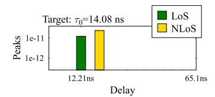

(b) M = 1024, BW = 245.76MHz

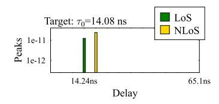

(c) M = 4096, BW = 983.04MHz

Fig. 2. Effect of bandwidth on CIR: VLPC-DCO-OFDM sensing peaks associated with different number of subcarriers M and bandwidth BW =  $M \cdot \text{SCS}$ . The coordinates of LED, PD and wall reflection are given by  $\mathbf{c}_S = [3,5,3.4]$ ,  $\mathbf{c}_D = [1,2,1.2]$ ,  $\mathbf{c}_R = [0,2,2]$ , and their unit normal vectors are  $\mathbf{n}_S = [0,0,-1]$ ,  $\mathbf{c}_D = [0,0,1]$ ,  $\mathbf{c}_R = [1,0,0]$ . The areas of PD and wall reflection are given by  $A_{\text{PD}} = 1 \text{cm}^2$  and  $A_{R_1} = 2 \text{cm}^2$ . The transmit power is given by  $P_t = -20$  dBm. The sensed peaks are obtained based on (16).

TD/FD-estimated CSI for DCO-OFDM systems [36], which will be further demonstrated in Sec. VI.

Secondly, since the delay index is defined by  $\{l_p=\lfloor \frac{\tau_p}{T} \rceil\}_{p=0}^{P-1}$ , an improved VLPC-DCO-OFDM bandwidth leads to a better sensing precision, where we have  $T=\frac{1}{\mathrm{BW}}$ . This is encapsulated by Property 2:

Property 2 (Sensing Precision): The precision of VLPC-DCO-OFDM sensing can be improved by increasing the system bandwidth. Explicitly, based on (18), the maximum positioning error based on OFDM radar sensing is given by  $\frac{c}{2\mathrm{BW}}$ , provided that the integer delay index  $\hat{l}_0$  is correctly detected, as expected at high SNRs.

Property 2 is confirmed by Fig. 2, which exemplifes the CIRs experienced by a VLPC-DCO-OFDM system that models a LED, a PD and a wall reflection. The related parameters are listed both in Table IV and in the caption of Fig. 2. The Subcarrier Spacing (SCS) is given by SCS = 240kHz, and the CP overhead is  $M_{CP} = M/16$ . We note that Fig. 2 displays the sensed peaks obtained based on (16). It is demonstrated by Fig. 2a that the target delay  $\tau_0 = 14.08$ ns is detected as 16.28ns for BW = 61.44MHz, which is improved to 12.21ns and 14.24ns, when the LED bandwidth is increased to BW = 245.76MHz and BW = 983.04MHz in Fig. 2b and Fig. 2c, respectively. Therefore, the positioning accuracy can be substantially improved by exploiting the system bandwidth with the aid of OFDM radar.

In addition to the capability of separating the LoS and NLoS paths, the proposed optical OFDM radar scheme also no longer requires to know the LED/PD parameters, including q,  $\mathbf{n}_S$ ,  $\mathbf{n}_D$ ,  $g_{\rm of}(\varphi_r)$  and  $g_{\rm oc}(\varphi_r)$  in the RSS scheme of Sec. IV-A,

&lt;sup>2The OFDM radar gain in the RF band was presented by (27) in [54].

{7}------------------------------------------------

owing to the fact that the LED-PD distance is evaluated based on the LoS delay, instead of the modelling of the LoS power.

# C. Hybrid Radar-RSS Sensing

It can be observed from (18) that OFDM radar applied to VLPC-DCO-OFDM can only detect integer delay indices, where the precision is determined by the LED bandwidth, as summarized by Property 2. Nonetheless, the LoS path of (1) is a direct function of  $d_{\rm SD}$  without being impacted by the LED bandwidth. Against this background, we further propose a hybrid Radar-RSS solution, where the RSS-based LoS detection of Sec. IV-A is invoked for detecting the earliest peak  $\widetilde{y}[0,l_0]$  of (16). In this way, the sensing precision can be further improved, without increasing the bandwidth. Therefore, the separation of LoS and NLoS paths is of prime importance for hybrid Radar-RSS, which is formulated by Property 3:

Property 3 (Resolvable Multi-Paths): The separation of LoS and NLoS paths in the delay domain requires sufficient system bandwidth. Explicitly, a sufficient condition for achieving  $\{l_0 \neq l_p\}_{\forall p \neq 0}$  is having a bandwidth of BW  $\geq \frac{c}{d_{\text{SRD}_p}-d_{\text{SD}}}$ , which is derived from  $l_0 = \frac{d_{\text{SD}}}{c}$ BW,  $l_p = \frac{d_{\text{SRD}_p}}{c}$ BW and  $\left\{\frac{d_{\text{SRD}_p}}{c}$ BW  $-\frac{d_{\text{SD}}}{c}$ BW  $\geq 1\right\}_{\forall p \neq 0}$ . Property 3 may be instrumental for fingerprinting-based

Property 3 may be instrumental for fingerprinting-based VLP [25], [26], [52], [53], where the minimum bandwidth requirement may be pre-determined based on the topology of the environment. Without the topology knowledge, we have to make sure that the Radar-estimated LoS path and the RSS-estimated LoS path have the same integer delay index. Otherwise, the radar-based range estimation is leveraged. More explicitly, the hybrid Radar-RSS sensing method is proposed as follows:

$$\hat{d}_{SD} = \begin{cases} \hat{d}'_{SD}, & \hat{l}_0 = \hat{l}'_0 \\ \frac{\hat{l}_0 \cdot c}{BW}, & \hat{l}_0 \neq \hat{l}'_0, \end{cases}$$
(19)

where OFDM radar obtains  $l_0$  based on (17), while the RSS estimates the LED-PD distance based on:

$$\hat{d}'_{SD} = \sqrt{\frac{(q+1)A_{PD}}{2\pi(\widetilde{y}[0,l_0])^2}\cos^q(\varphi_t)\cos(\varphi_r)g_{of}(\varphi_r)g_{oc}(\varphi_r)P_tM}.$$

Similar to (21), for the special case of  $\mathbf{n}_D = [0, 0, 1]$ , (20) can be simplified as:

$$\hat{d}_{SD} = \left[ \frac{(q+1)A_{PD}}{2\pi (\widetilde{y}[0, l_0])^2} (\Delta z_{SD})^{q+1} g_{of}(\varphi_r) g_{oc}(\varphi_r) P_t \right]^{\frac{1}{q+3}}.$$
(21)

Based on (19), the RSS-aided estimate  $\hat{d}'_{\text{SD}}$  is adopted only when its corresponding delay index  $\hat{l}'_0 = \lfloor \frac{\hat{d}'_{\text{SD}}}{\varsigma} \text{BW} \rceil$  equals to the Radar-estimated delay index, i.e.  $\hat{l}_0 = \hat{l}'_0$ . This scenario is encountered under two conditions. Firstly, the LoS path is separated from the NLoS paths, as summarized by Property 2. Secondly, the LED/PD parameters including q,  $\mathbf{n}_S$ ,  $\mathbf{n}_D$ ,  $g_{\text{of}}(\varphi_r)$  and  $g_{\text{oc}}(\varphi_r)$  are fixed or known. Otherwise, we have  $\hat{l}_0 \neq \hat{l}'_0$ , and the radar-based range estimation is used.

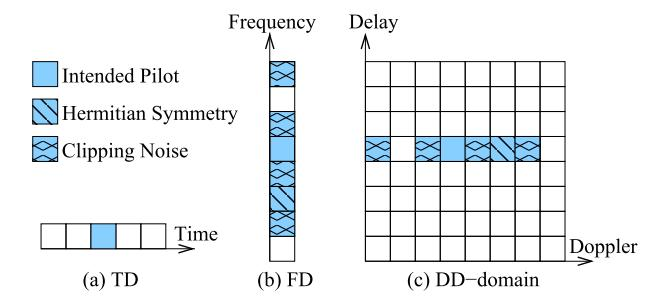

Fig. 3. Pilot transmission for TD-CE, FD-CE and DD-CE methods.

#### V. VLPC-DCO-OFDM COMMUNICATION

In this section, the proposed sensing-aided channel estimation is presented in Sec. V-A. The subsequent optical OFDM data detection is devised in Sec. V-C. The maximum achievable rates are analysed in Sec. V-D.

#### A. Radar-Aided Channel Estimation

According to Property 1, the optical OFDM radar sensing operation beneficially improves the SNR for detecting peaks. These peaks detected in the delay domain correspond to the CIR taps. Therefore, we propose a Radar-CE solution, which carries out CSI estimation based on all peaks obtained from OFDM radar. Assuming that the proposed VLPC-DCO-OFDM does not have any topology knowledge, the receiver does not know the number of paths P and cannot guarantee to separate the paths from its sensing observations of (16). Therefore, the peaks observed by (16) form a set of sensing-estimated CIRs:

$$\hat{h}_l = \frac{\widetilde{y}[0, l]}{\sqrt{M}}, \text{ where } (\widetilde{y}[0, l])^2 > \mathcal{T},$$
 (22)

where threshold  $\mathcal{T}$  is defined in (17). The range of CIR tap indices is  $0 \le l \le \hat{L}$ , where  $\hat{L}$  is the maximum delay obtained from (22). Following this, the sensing-estimated Channel Frequency Responses (CFRs) in the FD can be formulated as:

$$\hat{\bar{h}}_{\overline{m}} = \sum_{l=0}^{\hat{L}} \hat{h}_l \omega_M^{-\overline{m}l}, \tag{23}$$

where we have  $0 \leq \overline{m} \leq M-1$ . The Radar-CE methods of (22) and (23) are used for both the Radar and Radar-RSS VLPC systems. Moreover, we note that the RSS system of Sec. IV-A assumes LoS transmission, hence the received pilot signal strength normalized by the transmit power is directly used as the estimated channel, i.e.  $\hat{h}_0 = \sqrt{\frac{P_r}{P_t}}$ .

# B. Conventional Channel Estimation Methods

As benchmarks for our proposed Radar-CE in Sec. V-A, the conventional CE methods are portrayed by Fig. 3. Firstly, the TD-CE scheme inserts a Dirac delta impulse-based CP in the TD, as portrayed by Fig. 3(a). The TD pilot can be directly modulated as a unipolar symbol without the need of clipping. Secondly, Fig. 3b) demonstrates that the FD-CE scheme aims to insert pilots in the FD [50], [70], [71], where a pilot symbol inserted at  $\overline{m}=3$  must have its conjugate transmitted at  $M-\overline{m}=5$ , while the clipping noises fall on the even-indexed subcarriers. Thirdly, for the DD-CE method [48], [50], [68], [69], a pilot DD-domain orthogonal

{8}------------------------------------------------

time frequency space (OTFS) symbol is formed by N OFDM symbols associated with M subcarriers. Similarly to Fig. 3b), the pilot transmission in the DD-domain is subject to the requirement of Hermitian symmetry and the clipping noise, as demonstrated by Fig. 3c). The pilot signals after clipping are known and can be easily removed at the receiver. Given the quasi-static nature of optical channels, the pilot overhead is negligible, since the pilots do not have to be repeated.

#### C. Data Detection

For the data transmission associated with n > 0, the FD received signal of (11) may be expressed as follows:

$$\overline{y}[n,\overline{m}] = \overline{h}_{\overline{m}}\overline{s}[n,\overline{m}] + \overline{v}[n,\overline{m}], \tag{24}$$

where the time-invariant FD CFRs are given in the absence of mobility in IM/DD by:

$$\overline{h}_{\overline{m}} = \sum_{p=0}^{P-1} \sqrt{P_t} h_p \omega_M^{-\overline{m}l_p}, \qquad (25)$$

for  $0 \le \overline{m} \le M-1$ . In the absence of perfect CSI knowledge, conventional one-tap FD equalization can be performed with the aid of the sensing-estimated CFR of (23) as follows:

$$\bar{s}'[n, \overline{m}] = \frac{\bar{y}[n, \overline{m}]}{\hat{h}_{\overline{m}}},$$
(26)

which can be demodulated based on the VLPC-DCO-OFDM mapping of (4).

#### D. Maximum Achievable Rates

Based on the FD received signal model of (24), the conditional probability of transmitting  $\overline{s}[n,\overline{m}]$  and receiving  $\overline{y}[n,\overline{m}]$  is given by:

$$p(\overline{y}[n,\overline{m}]|\overline{s}[n,\overline{m}]) = \frac{1}{\sqrt{2\pi N_0}} \exp\left(-\frac{|\overline{y}[n,\overline{m}] - \overline{h}_{\overline{m}}\overline{s}[n,\overline{m}]|^2}{N_0}\right), \qquad (27)$$

which leads to the following Continuous-input Continuous-output Memoryless Channel (CCMC) sum rate [72], [73], [74]:

$$C^{\text{CCMC}}(P_t) = \frac{\text{BW}}{M/2 - 1} E\left[\sum_{\overline{m}=1}^{\frac{M}{2} - 1} \log_2 \left(1 + \frac{|\overline{h}_{\overline{m}}|^2}{N_0}\right)\right].$$
(28)

However, in the absence of perfect CSI, the CCMC rate of (28) has to be rewritten based on the estimated CFR of (23) as follows [75]:

$$C^{\text{CCMC}}(P_t) = \frac{\text{BW}}{M/2 - 1} E\left[ \sum_{\overline{m}=1}^{\frac{M}{2} - 1} \log_2 \left( 1 + \frac{|\hat{\overline{h}}_{\overline{m}}|^2}{N_0 + \sigma_{CE}^2} \right) \right], \tag{29}$$

where the maximum achievable rate is given by a Gaussian-distributed CSI estimation error with zero mean and a variance of  $\sigma_{CE}^2=E(|\overline{h}_{\overline{m}}-\bar{h}_{\overline{m}}|^2).$ 

When the Gaussian-distributed continuous-input assumed for (28) is replaced by equi-spaced and equi-probable  $\mathcal{L}$ -PSK/QAM constellations, i.e. we have  $\{p(\overline{s}^{\widetilde{l}}) = \frac{1}{\mathcal{L}}\}_{\widetilde{l}=0}^{\mathcal{L}-1}$ ,

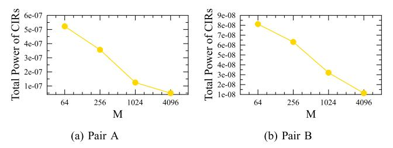

Fig. 4. Effect of bandwidth on the total power of CIRs: Total power of CIRs associated with different number of subcarriers M and bandwidth  $\mathrm{BW}=M\cdot\mathrm{SCS}$ , where the transmit power is given by  $P_t=-20$  dBm. The simulation parameters for the multipath scenario are detailed in Sec. VI. The subfigures are plotted for (a) LED-User Pair A, (b) LED-User Pair B.

the resultant Discrete-input Continuous-output Memoryless Channel (DCMC) sum rate is expressed as [76]:

$$C^{DCMC}(P_{t}) = \frac{BW}{\frac{M}{2} - 1} \sum_{\overline{m}=1}^{\frac{M}{2} - 1} \sum_{\widetilde{l}=0}^{\mathcal{L}-1} \int p(\overline{y}[n, \overline{m}] | \overline{s}^{\widetilde{l}}) p(\overline{s}^{\widetilde{l}})$$

$$\times \log_{2} \frac{p(\overline{y}[n, \overline{m}] | \overline{s}^{\widetilde{l}})}{\sum_{\widetilde{l}=0}^{\mathcal{L}-1} p(\overline{y}[n, \overline{m}] | \overline{s}^{\widetilde{l}}) p(\overline{s}^{\widetilde{l}})} d\overline{y}$$

$$= \frac{BW}{\frac{M}{2} - 1} E \left\{ \frac{1}{\mathcal{L}} \sum_{\overline{m}=1}^{\frac{M}{2} - 1} \sum_{\widetilde{l}=0}^{\mathcal{L}-1} \log_{2} \left[ \frac{\mathcal{L} \cdot p(\overline{y}[n, \overline{m}] | \overline{s}^{\widetilde{l}})}{\sum_{\widetilde{l}'=0}^{\mathcal{L}-1} p(\overline{y}[n, \overline{m}] | \overline{s}^{\widetilde{l}'})} \right] \right\}$$

$$= \frac{BW}{\frac{M}{2} - 1} \frac{1}{\mathcal{L}} E \left\{ \sum_{\overline{m}=1}^{\frac{M}{2} - 1} \sum_{\widetilde{l}=0}^{\mathcal{L}-1} \log_{2} \left[ \frac{\mathcal{L} \cdot \exp\left(-\frac{|\overline{y}[n, \overline{m}] - \overline{h}_{\overline{m}} \overline{s}^{\widetilde{l}}|^{2}}{N_{0}}\right)}{\sum_{\widetilde{l}'=0}^{\mathcal{L}-1} \exp\left(-\frac{|\overline{y}[n, \overline{m}] - \overline{h}_{\overline{m}} \overline{s}^{\widetilde{l}'}|^{2}}{N_{0}}\right)} \right\} .$$

$$(30)$$

Furthermore, given the estimated CFR of (23), the DCMC rate of (30) is rewritten as:

$$C^{DCMC}(P_t) = \frac{BW}{\frac{M}{2} - 1} \frac{1}{\mathcal{L}} E \left\{ \sum_{\overline{m}=1}^{\frac{M}{2} - 1} \sum_{\tilde{l}=0}^{\mathcal{L} - 1} \log_2 \left[ \frac{\mathcal{L} \cdot \exp\left(-\frac{|\overline{y}[n,\overline{m}] - \hat{h}_{\overline{m}} \bar{s}^{\tilde{l}}|^2}{N_0}\right)}{\sum_{\tilde{l}'=0}^{\mathcal{L} - 1} \exp\left(-\frac{|\overline{y}[n,\overline{m}] - \hat{h}_{\overline{m}} \bar{s}^{\tilde{l}'}|^2}{N_0}\right)} \right] \right\}. (31)$$

We note that both geometric shaping and probabilistic shaping are capable of further improving the DCMC sum rate by optimizing the non-equal-spaced and non-equi-probable QAM constellations. Interested readers may refer to [77] and [78] for more details.

Based on Property 1, the sensing accuracy improves, as the bandwidth increases. However, we note that the total power of CIRs may be reduced, as the bandwidth increases. Specifically, for the two non-zero paths shown in Fig. 2, the total power of CIRs is reduced from  $(h_0+h_1)^2$  to  $(h_0)^2+(h_1)^2$  as they are separated upon increasing the bandwidth, because we always have  $(h_0+h_1)^2>(h_0)^2+(h_1)^2$  for real- and positive-valued  $h_0$  and  $h_1$ , according to the LoS and NLoS modelling in

{9}------------------------------------------------

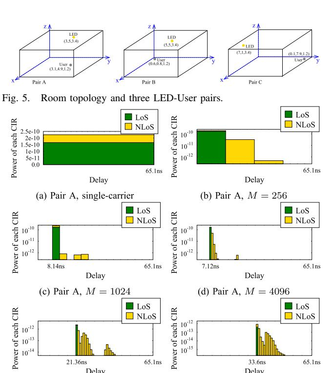

Fig. 6. Power of each CIR for VLPC-DCO-OFDM with different bandwidths  $BW = M \cdot SCS$  in multipath scenario. The subfigures are (a) Pair A with single-carrier, (b) Pair A with M=256, (c) Pair A with M=1024, (d) Pair A with M = 4096, (e) Pair B with M = 4096, (f) Pair C with M = 4096. SCS = 240 kHz is fixed.

Delay

(e) Pair B, M = 4096

10

Delay

(f) Pair C, M = 4096

Sec. II. This trend is evidenced by Fig. 4, where the total power of CIRs  $\sum_{l=0}^{L} (h_l)^2$  decreases as the bandwidth increases. Therefore, the reduction in the total power of CIRs may lead to a degraded BER performance, which will be discussed in Sec. VI. Nonetheless, (28)-(31) demonstrate that the data rates will always increase with the bandwidth. This unique tradeoff observed for DCO-OFDM has not been exploited before, which is summarized as follows:

Property 4 (Effect of Bandwidth on the Total Power of CIRs): Upon increasing the system bandwidth, the total power of CIRs reduces, which may lead to degraded BER performance. Nonetheless, the motivation of increasing the system bandwidth for communication functionality is justified by the achievable communication data rate, which increases linearly with the bandwidth.

# VI. PERFORMANCE RESULTS

Our simulation parameters and CIR analysis are presented in Sec. VI-A and Sec. VI-B, respectively. The positioning and communication functionalities of the proposed VLPC-DCO-OFDM recorded for three LED-user pairs are discussed in Sec. VI-C and Sec. VI-D, respectively. Finally, the overall performance results of illumination, positioning and communication functionalities are presented in Sec. VI-E, Sec. VI-F and Sec. VI-G for all possible combinations of LED-user pairs, respectively.

# A. Simulation Parameters

The simulation parameters of the LEDs and user PDs are detailed in Table IV and Table III. The typical indoor

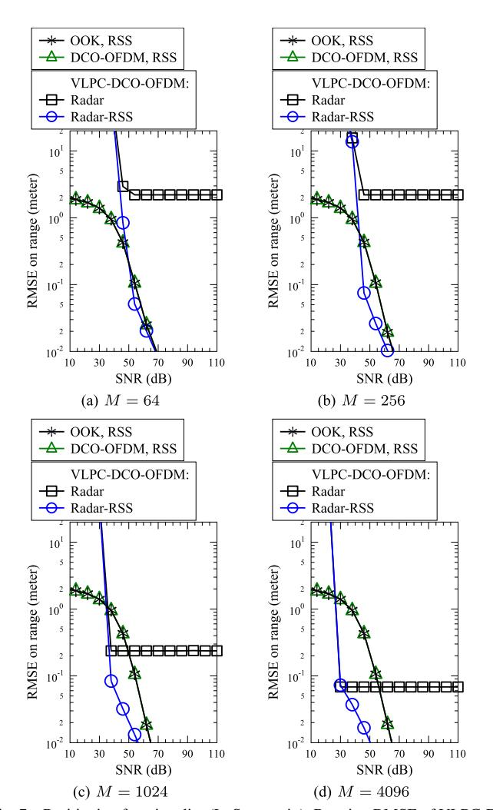

Fig. 7. Positioning functionality (LoS scenario): Ranging RMSE of VLPC-D-CO-OFDM for LED-User Pair A in LoS-only scenario. The subfigures are (a) M = 64, (b) M = 256, (c) M = 1024, (d) M = 4096. SCS=240 kHz is fixed.

environment of Fig. 5 is considered, where the configurations are summarized in Table V. The LEDs are equi-spaced on the ceiling with 2 m distances from each other. Both LoS-only and multipath scenarios are considered. The LoS-only scenario is simulated for each LED-PD pair based on (1). For rich scattering multipath scenarios, each of the ceiling, wall and floor surfaces are divided into grids of very small reflective areas of 4 cm2. Hence each wall has 70 000 reflection tiles, while the ceiling/floor has 320 000 reflection tiles. In this way, the first-order multipath reflections modelled by (3) are simulated. The three typical LED-user location pairs seen in Fig. 5 are considered for our simulations in Secs. VI-B-VI-D. Pair A corresponds to the scenario, where the user is near to an LED. For Pair B and Pair C, the user locations are near the corners, where the LEDs are in the middle of the room and near the opposite corner of the room, respectively. In Secs. VI-E-VI-G, all possible user locations ranging within 0.1-7.9 m (with a step size of 0.1 m) for x-/y-axis are considered, where the height of a user is fixed to 1.2 m. We note that SCS = 240 kHzand DC bias of  $\eta_0 = 9$  dB are used for all simulations in this paper. The number of subcarriers considered are M = $\{64, 256, 1024, 4096\}$ , which correspond to the bandwidths

{10}------------------------------------------------

 $\label{eq:table V} \textbf{Room and Transceiver Configurations}$ 

| Room dimension  | Length: 8m, Width 8m, Height: 3.5 m                                                                                                                   |  |  |  |  |
|-----------------|-------------------------------------------------------------------------------------------------------------------------------------------------------|--|--|--|--|
| Reflectivities  | Plaster wall: 0.74, ceiling: 0.38, floor: 0.61                                                                                                        |  |  |  |  |
| LED Coordinates | (1,1,3.4) (1,3,3.4) (1,5,3.4) (1,7,3.4) (3,1,3.4) (3,3,3.4) (3,5,3.4) (3,7,3.4) (5,1,3.4) (5,5,3.4) (5,7,3.4) (7,1,3.4) (7,3,3.4) (7,5,3.4) (7,7,3.4) |  |  |  |  |

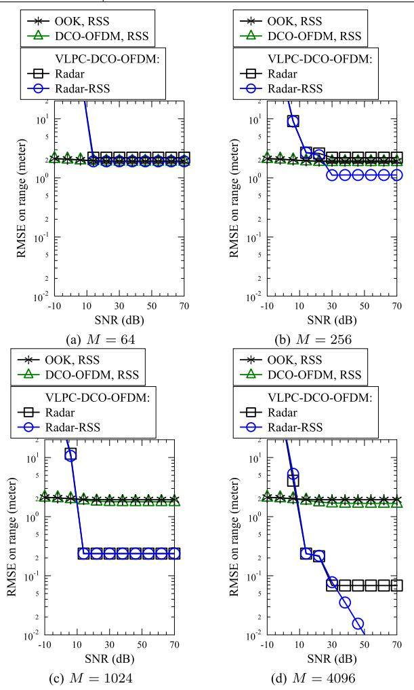

Fig. 8. Positioning functionality (multipath): Ranging RMSE of VLPC-D-CO-OFDM for LED-User Pair A in multipath scenario. The subfigures are (a) M=64, (b) M=256, (c) M=1024, (d) M=4096. SCS=240 kHz is fixed.

of BW =  $\{15.36, 61.44, 245.76, 983.04\}$ MHz. The transmit power is normalized in the TD as  $P_t$ , regardless of the number of subcarriers in the FD.

#### B. CIR Analysis

The CIRs experienced by the VLPC-DCO-OFDM systems are analysed in Fig. 6. First of all, Fig. 6a demonstrates the superposition of the LoS and NLoS paths for a single-carrier system, which is detrimental for the RSS-based VLP [33], [34], [35], [36], [37]. Secondly, Figs. 6b-6d evidence that the precision of CIRs is improved as the system bandwidth increases, which confirms Property 2 of Sec. IV-B. Thirdly, Figs. 6b-6d also demonstrate that as the system bandwidth increases, the LoS and NLoS paths become more resolvable, which confirms Property 3 of Sec. IV-C. This verifies the

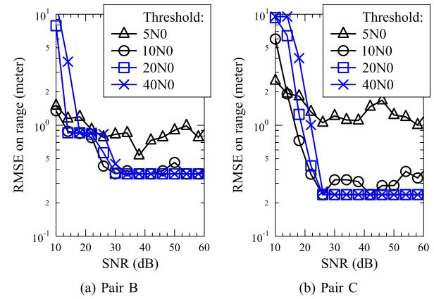

Fig. 9. Effect of  $\mathcal{T}$ : Ranging RMSE of VLPC-DCO-OFDM for (a) Pair B and (b) Pair C in multipath scenario. M=1024 is used.

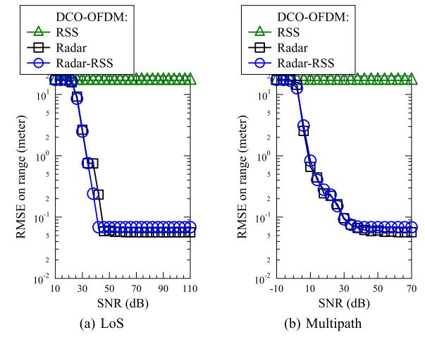

Fig. 10. Effect of unknown  $\mathbf{n}_D$ : Ranging RMSE of VLPC-DCO-OFDM for Pair A in (a) LoS and (b) multipath scenarios, when the PD's unit normal vector  $\mathbf{n}_D$  is unknown. M=4096 is used.

motivation of the Hybrid Radar-RSS scheme of Sec. IV-C. However, Fig. 6f also demonstrates that even for M=4096, there is still noticeable residual NLoS power superimposed onto LoS in the earliest peak. This indicates that RSS estimation can only be used, when both the Radar and RSS estimations have the same integer delay index, which is taken into account by the proposed Hybrid Radar-RSS in Sec. IV-C.

#### C. Positioning Accuracy

Fig. 7 characterizes the Root Mean Squared Error (RMSE) of positioning functionality in a LoS-only scenario. Based on the simulation parameters of Sec. VI-A, the SNR range of  $10{\sim}110{\rm dB}$  corresponds to the range of  $-100{\sim}0{\rm dBm}$  for  $P_t$ . First of all, in the absence of NLoS paths, Figs. 7a-7d demonstrate that RSS-based VLP schemes using OOK and DCO-OFDM modulations exhibit sub-centimeter ranging RMSEs, as  $P_t$  increases. Secondly, Figs. 7a-7d confirm that the precision of OFDM radar sensing improves upon increasing M, where the Hybrid Radar-RSS scheme is also capable of achieving sub-centimeter ranging RMSEs. We note that the RMSE lower bound of OFDM radar is given by  $|d_{\rm SD} - \lfloor \frac{d_{\rm SD} \cdot {\rm BW}}{c} \rfloor \cdot \frac{c}{{\rm BW}}|$ , which correspond to 2.2m, 2.2m 0.24m and 0.07m for M=64, 256, 1024 and 4096, respectively, in Fig. 7.

{11}------------------------------------------------

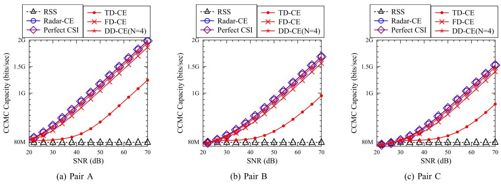

Fig. 11. Communication functionality: CCMC sum rate of VLPC-DCO-OFDM in comparison to DCO-OFDM relying on conventional TD/FD/DD-estimated CSI for (a) Pair A, (b) Pair B and (c) Pair C in multipath scenario, where M = 1024 is used.

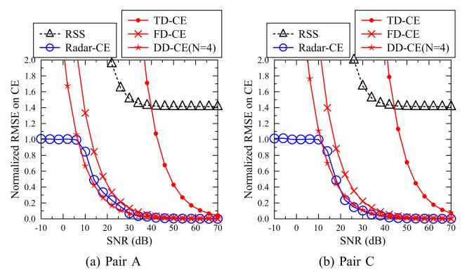

Fig. 12. Communication functionality: Normalized RMSE on channel estimation of VLPC-DCO-OFDM systems for (a) Pair A and (b) Pair C in multipath scenario, where M = 1024 is used.

However, in the rich scattering multipath scenario of Fig. [8,](#page-10-3) the conventional RSS-based VLP schemes suffer from severe performance degradation, where their ranging RMSEs become higher than 1 m. By contrast, Figs. [8a-8d](#page-10-3) demonstrate that the proposed optical OFDM radar sensing is still capable of improving the RMSE as the bandwidth increases, where a subcentimeter RMSE is achieved by the proposed Hybrid Radar-RSS scheme, as seen in Fig. [8d.](#page-10-3)

Fig. [9](#page-10-4) demonstrates the effect of the threshold T on the sensing peak detection of [\(17\).](#page-6-7) It can be seen in Fig. [9](#page-10-4) that low radar peak detection thresholds of T = 5N0 and T = 10N0 lead to fluctuating RMSE in the high SNR region, where the instantaneous noise may be falsely detected as a CIR tap. Moreover, as the threshold is increased to a very high T = 40N0, its convergence requires a higher SNR, owing to the fact that the peaks cannot be detected until the noise power becomes sufficiently low. In this work, we opt for using T = 20N0 for both the radar peak detection of [\(17\)](#page-6-7) and communication Radar-CE of [\(22\)](#page-7-7) for all simulation results.

The simulation results in this section assume that the LED/PD parameters including the Lambertian mode order q, unit normal vectors nS and nD, as well as the gains of the optical filter and concentrator gof(φr) and goc(φr) are known for the RSS-based schemes. However, in practice, the user PD's unit normal vector nD may be completely random without the user being aware of it. This effect is demonstrated by Fig. [10,](#page-10-5) where the conventional RSS-based

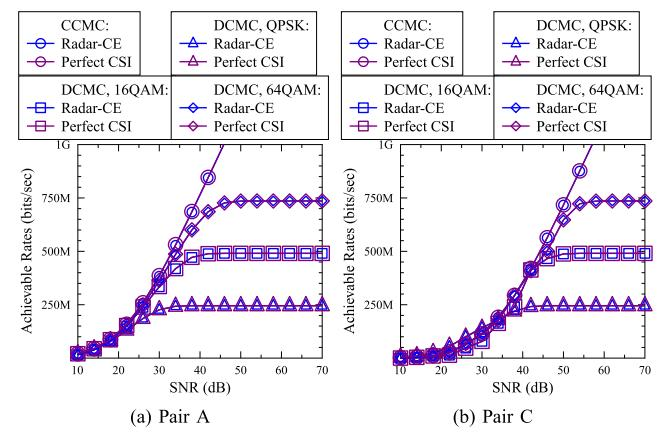

Fig. 13. Communication functionality: CCMC and DCMC data rates of VLPC-DCO-OFDM systems for (a) Pair A and (b) Pair C in multipath scenario, where M = 1024 is used.

sensing scheme exhibits poor sensing performance in both LoS and NLoS scenarios. Moreover, Fig. [10](#page-10-5) demonstrates that the hybrid Radar-RSS scheme performs similarly to the Radaraided sensing scheme, when nD is unknown. This is due to the fact that the hybrid Radar-RSS scheme adopts the RSS estimation only when the Radar-estimated LoS path and the RSS-estimated LoS path have the same integer delay index, as discussed in Sec. [IV-C.](#page-7-1)

# *D. Communication Data Rates and BERs*

Fig. [11](#page-11-1) demonstrates the CCMC rates of the VLPC-DCO-OFDM communication functionality, when the CSI is either obtained from the sensing functionality or estimated in the TD/FD/DD as those in conventional DCO-OFDM systems. *First of all*, Fig. [11](#page-11-1) demonstrates that RSS-assisted sensing provides eroded CSI estimation, which can only support a low data rate below 100 Mbps. *Secondly*, the data rates achieved with the aid of the proposed Radar-CE approach the full CCMC sum rate of VLPC-DCO-OFDM relying on perfect CSI, as evidenced by Fig. [11.](#page-11-1) *Thirdly*, for conventional DCO-OFDM CSI estimation methods, DD-CE performs the best, followed by FD-CE and TD-CE, as demonstrated by Fig. [11.](#page-11-1) We note that although DD-domain CSI estimation achieves similar performance to the proposed Radar-CE method, the DD-domain CSI estimation requires an increased number of N = 4 OFDM pilot symbols. By contrast, the proposed

{12}------------------------------------------------

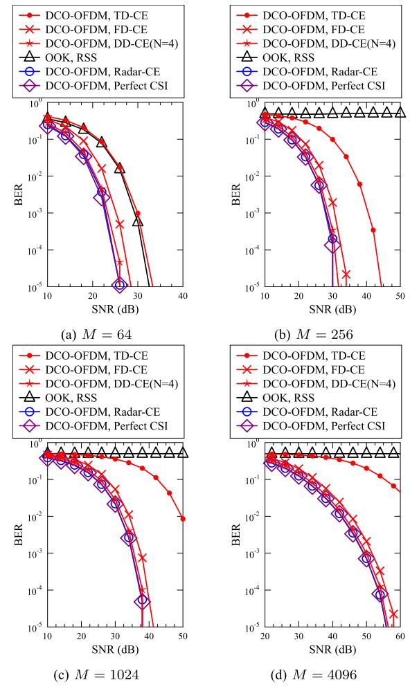

Fig. 14. Communication functionality: BER performance of VLPC-D-CO-OFDM for LED-User Pair A in multipath scenario, where QPSK is used. The subfigures are (a) M = 64, (b) M = 256, (c) M = 1024, (d) M = 4096. SCS = 240 kHz is fixed.

VLPC-DCO-OFDM only requires a single transmission of a single OFDM pilot symbol for the dual functionalities of sensing and CSI estimation. *Finally*, it is worth noting that the LED-User Pair A exhibits higher data rates in Fig. [11a](#page-11-1) in comparison to the LED-User Pair B of Fig. [11b](#page-11-1) and the LED-User Pair C of Fig. [11c,](#page-11-1) due to the fact that the LED-User Pair A experiences stronger LoS power compared to the users located in corners for the LED-User Pairs B and C.

We note that the CCMC rate evaluation of [\(28\)](#page-8-4) can only be approached for idealistic Gaussian-distributed input and output signals through channel coding, and this rate is non-zero at high SNRs, despite the fact that the specific OOK modulation cannot be reliably detected, as evidenced by the BER results of Fig. [14.](#page-12-1) Moreover, the ≪ 100Mbps theoretical CCMC rate of the RSS scheme is neglible in comparison to the Gbps-level rates of the proposed schemes using practical CE methods, as demonstrated by Fig. [11.](#page-11-1)

The results of Fig. [11](#page-11-1) are confirmed by the channel estimation errors compared in Fig. [12.](#page-11-2) The RMSE on CE is normalized by the total power of perfect CSI. The RSSsensed and TD-estimated CSI suffer from severely degraded accuracies, which are further improved by FD-/DD-CE, as demonstrated by Fig. [12.](#page-11-2) The Radar-sensed CSI exhibits

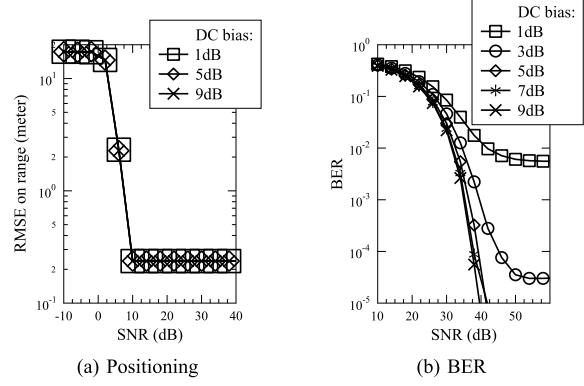

Fig. 15. Effect of DC bias: Ranging RMSE and BER performance of VLPC-DCO-OFDM for LED-User Pair A in multipath scenario, where QPSK and M = 1024 are used.

substantially reduced channel estimation error, as evidenced by Fig. [12.](#page-11-2)

Fig. [13](#page-11-3) further demonstrates the relationship between DCMC and CCMC rates. As the number of modulation levels increases, the DCMC rates move closer to their CCMC counterparts assuming continuous Gaussian-distributed input signals, as evidenced by Fig. [13.](#page-11-3) Furthermore, Fig. [13](#page-11-3) once again confirms that the data rate achieved based on the proposed Radar-CE scheme approaches the ideal sum rate relying on perfect CSI.

Fig. [14](#page-12-1) characterizes the BER performance of the VLPC-DCO-OFDM communication functionality. Similarly to the sum rate evaluations of Fig. [13,](#page-11-3) Fig. [14](#page-12-1) demonstrates that the proposed Radar-estimated CSI schemes perform similarly to the ideal scenario of relying on perfect CSI, followed by the DD-/FD-/TD-estimated CSI schemes, where the OOK scheme relying on LoS-based RSS suffers from an error floor. Furthermore, Figs. [14a-14d](#page-12-1) demonstrate that as M increases from M = 64, M = 256, M = 1024 to M = 4096, the transmit power Pt required for the Radar-CE scheme to achieve a target BER = 10−5 is increased from SNR = 25 dB, SNR = 30 dB, SNR = 38 dB to SNR = 55 dB. This confirms Property [4](#page-9-5) of Sec. [V-D.](#page-8-2)

Fig. [15](#page-12-2) demonstrates the effect of DC bias on both the positioning and on the communication BER. It can be seen in Fig. [15a](#page-12-2) that the DC bias has no effect on the ranging RMSE, owing to the fact that the positioning functionality is implemented based on a single pilot transmission, where the pilot signal after clipping is known and can be removed at the receiver in the FD. By contrast, as expected, Fig. [15b](#page-12-2) confirms that sufficient DC bias has to be provided for communication functionality.

# *E. Overall Illumination Functionality*

Fig. [16](#page-13-0) demonstrates the received signal powers of all possible LED-User pairs in a LoS-only scenario, which indicate the illumination power distribution across the room. For each 1 × 1 m2 area on the floor, the average, maximum and minimum of all LED-User pairs' RSSs are portrayed in Fig. [16a,](#page-13-0) Fig. [16b](#page-13-0) and Fig. [16c,](#page-13-0) respectively. *Firstly*, it can be seen in Fig. [16](#page-13-0) that on average, the center of the room receives higher RSSs. *Secondly*, Fig. [16b](#page-13-0) demonstrates

{13}------------------------------------------------

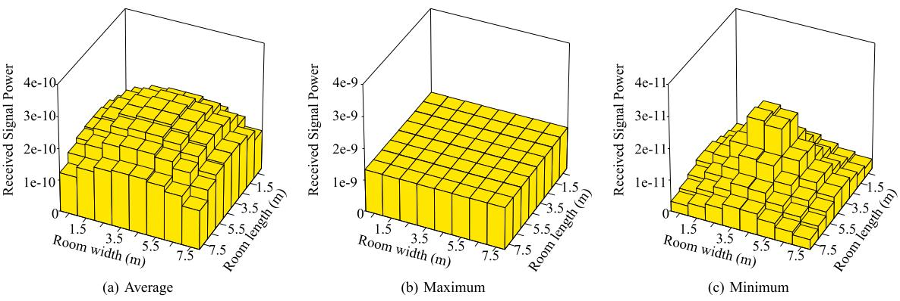

Fig. 16. Illumination functionality: Received signal power in LoS scenario, where we have Pt = −20dBm. The subfigures are average, maximum and minimum received signal powers of all LED-User pairs in each 1 × 1 m2 area.

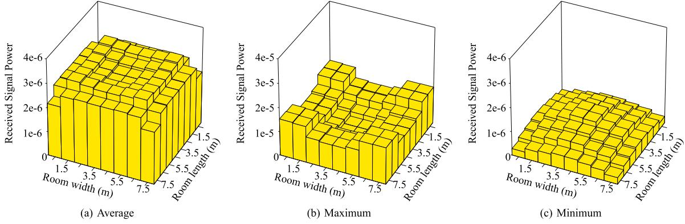

Fig. 17. Illumination functionality: Received signal power in multipath scenario, where Pt = −20dBm. The subfigures are average, maximum and minimum received signal powers of all LED-User pairs in each 1 × 1 m2 area.

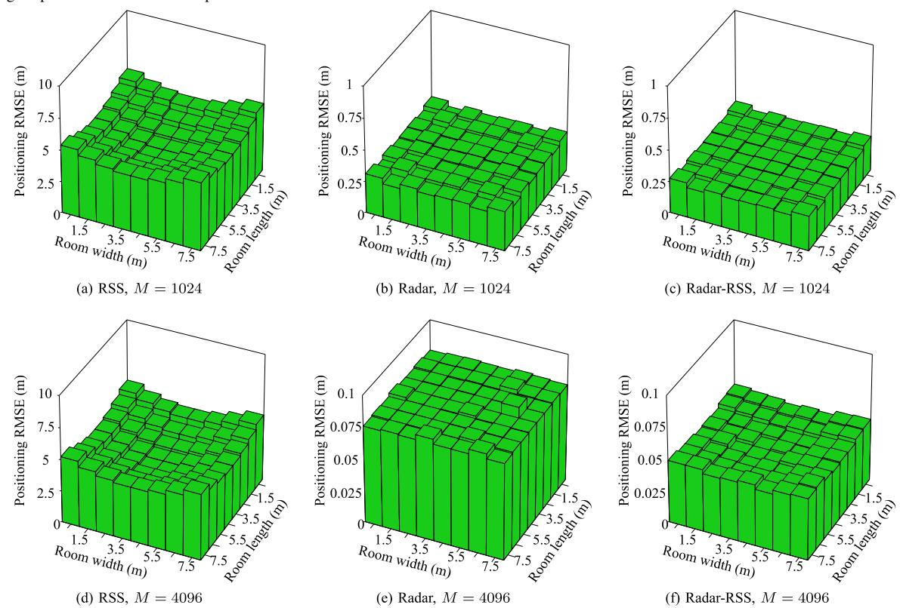

Fig. 18. Positioning functionality: Average localization error of VLPC-DCO-OFDM in multipath scenario, where we have Pt = −20dBm. The subfigures are average RMSE on ranging for all LED-User pairs in each 1 × 1 m2 area.

that there exist RSS-optimized LED-User pairing arrangements that allow all user locations to receive the same maximum RSS. *Thirdly*, Fig. [16c](#page-13-0) demonstrates that for the worst LED-User arrangements that lead to minimum

{14}------------------------------------------------

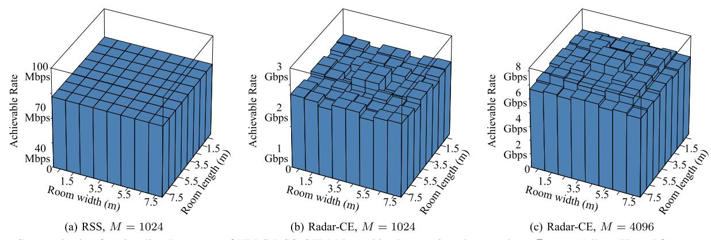

Fig. 19. Communication functionality: Data rates of VLPC-DCO-OFDM in multipath scenario, where we have  $P_t = -20 \text{dBm}$ . The subfigures are average achievable rates for all LED-User pairs in each  $1 \times 1$   $m^2$  area.

RSSs, the center of the room still receives higher signal power.

Fig. 17 further demonstrates the RSS distribution, when multipath reflections are taken into account. In terms of the maximum RSSs, the corners of the room receive the highest NLoS reflection powers, as evidenced by Fig. 17b. By contrast, the minimum RSSs of Fig. 17c exhibit similar distribution to the LoS-only scenario of Fig. 16c, where the center of the room receives higher RSSs. The average RSSs of Fig. 17a are balanced between those of Fig. 17b and Fig. 17c.

We note that the positioning functionality relies exclusively on LoS, while the communication data rate can benefit from both LoS and NLoS paths, provided that reliable CSI estimation can be obtained. These will be further investigated in the following sections.

# F. Overall Positioning Functionality

Fig. 18 demonstrates positioning performance of VLPC-DCO-OFDM in multipath scenarios. First of all, as expected, the RSS-based VLP suffer from severe multi-meter-level positioning errors in multipath scenarios, as evidenced by Fig. 18a. The performance degradation of the conventional RSS-based VLP cannot be mitigated by increasing the system bandwidth, as evidenced by Fig. 18d. By contrast, the proposed optical OFDM radar sensing is capable of achieving decimeter-level positioning accuracy for M=1024 in Fig. 18b, which is further improved to centimeter-level for M=4096 in Fig. 18e. The positioning accuracies of optical OFDM radar of Fig. 18b and Fig. 18e are further improved by Hybrid Radar-RSS in Fig. 18c and Fig. 18f, respectively.

# G. Overall Communication Functionality

Finally, Fig. 19 portrays the communication data rate distribution in multipath scenarios, where OOK is used by the RSS scheme, while QPSK is used by DCO-OFDM at the same throughput R=1 bit/Hz/sec due to Hermitian symmetry. It can be seen in Fig. 19a that even though a bandwidth of 245.76 MHz is provided, relatively low data rates below 100 Mbps are recorded, when degraded CSI estimation is provided by RSS-based sensing. By contrast, Fig. 19b confirms that Gbps-level data rates can be achieved, when optical OFDM radar provides enhanced CSI estimation. Finally, the

data rates of Fig. 19a-19b are further improved in Fig. 19c, when M=1024 is increased to M=4096, which justifies the motivation of increasing the system bandwidth for improving both the positioning accuracy and communication data rate.

#### VII. CONCLUSION AND FUTURE OPPORTUNITIES

We proposed a new VLPC-DCO-OFDM scheme that simultaneously supports the tripple functionalities of illumination, positioning and communication. More explicitly, we conceived OFDM radar for VLP for the first time in the open literature, which exploited the wide optical bandwidth in order to improve estimated CSI accuracy. Moreover, the sensing-estimated CIR was reused for supporting communication data detection. The following conclusions were verified. *Firstly*, optical radar sensing is capable of improving the SNR of peak detection. *Secondly*, the precision of optical radar sensing can benefit from the recent advances in improving LED bandwidth. *Thirdly*, a sufficient condition of separating the LoS and NLoS paths has been devised. *Finally*, the relationship between CIR power and bandwidth has been derived.

The proposed VLPC-DCO-OFDM also opens up new opportunities for future study within the realm of optical ISAC. Firstly, both OFDM-based positioning and communication rely on precise synchronization, which can be enhanced through the application of time-difference-of-arrival (TDoA) techniques [67], where the differences in distances from the user PD to multiple LEDs are exploited. Secondly, the development of VLPC-DCO-OFDM can be instrumental for the deployment of optical Reconfigurable Intelligent Surfaces (RIS) [79]. Based on Property 3 of Sec. IV-C, the sufficient condition for introducing a RIS-reflected NLoS path that does not overlap with the LoS path is given by  $d_{SRD_n} \geq$  $(d_{\rm SD} + \frac{c}{\rm BW})$ , which can be ensured by activating optical RIS at the designated location. Thirdly, since the location of RIS is known, the RIS-reflected NLoS signals can also be utilized for localization.

#### REFERENCES

[1] 6G—Connecting a Cyber-Physical World. Accessed: Feb. 24, 2025. [Online]. Available: https://www.hs-osnabrueck.de/fileadmin/HSOS/Forschung/Recherche/Laboreinrichtungen\_und\_Versuchsbetriebe/Labor\_fuer\_Hochfrequenztechnik\_und\_Mobilkommunikation/Mobilkomtagung/2023/Vortraege/18\_V\_Torsten\_Dudda.pdf

{15}------------------------------------------------

- [\[2\] H](#page-0-2)uawei. *6G: The Next Horizon*. Accessed: Feb. 24, 2025. [Online]. Available: https://www-file.huawei.com/-/media/corp2020/pdf/tech-insig hts/1/6g-white-paper-en.pdf
- [\[3\] In](#page-0-3)tel. *Next-Generation Wi-Fi: Wi-Fi 7 and Beyond*. Accessed: Feb. 24, 2025. [Online]. Available: https://www.intel.com/content/dam/ www/central-libraries/us/en/documents/2022-06/wi-fi-tutorial-long.pdf
- [\[4\] M](#page-0-4)arketsandMarkets. *GNSS Simulators Market by Component, GNSS Receiver, Application, Vertical, Type and Region—Global Forecast to 2027*. Accessed: Feb. 24, 2025. [Online]. Available: https://www. marketsandmarkets.com/PressReleases/gnss-simulators.asp
- [\[5\] C](#page-0-5)isco. *Cisco Annual Internet Report (2018–2023) White Paper*. Accessed: Feb. 24, 2025. [Online]. Available: https://www.cisco. com/c/en/us/solutions/collateral/executive-perspectives/annual-internetreport/white-paper-c11-741490.html
- [\[6\]](#page-0-6) *Summary of Rel-16 Work Items*, document TR 21.916, 3GPP, Jun. 2020. [Online]. Available: http://www.3gpp.org/release-16
- [\[7\] H](#page-0-7). Wymeersch, G. Seco-Granados, G. Destino, D. Dardari, and F. Tufvesson, "5G mmWave positioning for vehicular networks," *IEEE Wireless Commun.*, vol. 24, no. 6, pp. 80–86, Dec. 2017.
- [\[8\] H](#page-0-8). Le Minh et al., "100-Mb/s NRZ visible light communications using a postequalized white LED," *IEEE Photon. Technol. Lett.*, vol. 21, no. 15, pp. 1063–1065, May 15, 2009.
- [\[9\] C](#page-0-9).-H. Yeh, Y.-L. Liu, and C.-W. Chow, "Real-time white-light phosphor-LED visible light communication (VLC) with compact size," *Opt. Exp.*, vol. 21, no. 22, p. 26192, 2013.
- [\[10\]](#page-0-10) H. Li, X. Chen, B. Huang, D. Tang, and H. Chen, "High bandwidth visible light communications based on a post-equalization circuit," *IEEE Photon. Technol. Lett.*, vol. 26, no. 2, pp. 119–122, Nov. 7, 2014.
- [\[11\]](#page-0-11) T. Wu et al., "Mini-LED and micro-LED: Promising candidates for the next generation display technology," *Appl. Sci.*, vol. 8, no. 9, p. 1557, Sep. 2018.
- [\[12\]](#page-0-12) H.-Y. Lan, I.-C. Tseng, Y.-H. Lin, G.-R. Lin, D.-W. Huang, and C.-H. Wu, "High-speed integrated micro-LED array for visible light communication," *Opt. Lett.*, vol. 45, no. 8, pp. 2203–2206, 2020.
- [\[13\]](#page-0-13) I. Akasaki, "Fascinating journeys into blue light (Nobel Lecture)," *Annalen der Physik*, vol. 527, nos. 5–6, pp. 311–326, Jun. 2015.
- [\[14\]](#page-0-14) D. Tsonev et al., "A 3-Gb/s single-LED OFDM-based wireless VLC link using a gallium nitride µLED," *IEEE Photon. Technol. Lett.*, vol. 26, no. 7, pp. 637–640, Jan. 2, 2014.
- [\[15\]](#page-0-15) J.-Y. Sung, C.-W. Chow, and C.-H. Yeh, "Is blue optical filter necessary in high speed phosphor-based white light LED visible light communications?" *Opt. Exp.*, vol. 22, no. 17, pp. 20646–20651, 2014.
- [\[16\]](#page-0-16) S. Rajbhandari et al., "A review of gallium nitride LEDs for multigigabit-per-second visible light data communications," *Semicond. Sci. Technol.*, vol. 32, no. 2, Feb. 2017, Art. no. 023001.
- [\[17\]](#page-1-2) R. Wan, L. Wang, J. Huang, X. Yi, H.-C. Kuo, and J. Li, "Improving the modulation bandwidth of GaN-based light-emitting diodes for high-speed visible light communication: Countermeasures and challenges," *Adv. Photon. Res.*, vol. 2, no. 12, Dec. 2021, Art. no. 2100093.
- [\[18\]](#page-1-3) Y.-H. Chang et al., "2.805 Gbit/s high-bandwidth phosphor white light visible light communication utilizing an InGaN/GaN semipolar blue micro-LED," *Opt. Exp.*, vol. 30, no. 10, pp. 16938–16946, 2022.
- [\[19\]](#page-1-4) J.-W. Shi, K.-L. Chi, J.-M. Wun, J. E. Bowers, Y.-H. Shih, and J.-K. Sheu, "III-Nitride-based cyan light-emitting diodes with GHz bandwidth for high-speed visible light communication," *IEEE Electron Device Lett.*, vol. 37, no. 7, pp. 894–897, Jul. 2016.
- [\[20\]](#page-1-5) A. Rashidi, M. Monavarian, A. Aragon, A. Rishinaramangalam, and D. Feezell, "Nonpolar m -plane InGaN/GaN micro-scale light-emitting diode with 1.5 GHz modulation bandwidth," *IEEE Electron Device Lett.*, vol. 39, no. 4, pp. 520–523, Apr. 2018.
- [\[21\]](#page-1-6) M. Nami et al., "Electrically injected GHz-class GaN/InGaN core–shell nanowire-based µLEDs: Carrier dynamics and nanoscale homogeneity," *ACS Photon.*, vol. 6, no. 7, pp. 1618–1625, 2019.
- [\[22\]](#page-1-7) M. S. Islim et al., "Towards 10 Gb/s orthogonal frequency division multiplexing-based visible light communication using a GaN violet micro-LED," *Photon. Res.*, vol. 5, no. 2, pp. 35–43, 2017.
- [\[23\]](#page-1-8) J. Armstrong, Y. A. Sekercioglu, and A. Neild, "Visible light positioning: A roadmap for international standardization," *IEEE Commun. Mag.*, vol. 51, no. 12, pp. 68–73, Dec. 2013.
- [\[24\]](#page-1-9) Y. U. Lee and M. Kavehrad, "Two hybrid positioning system design techniques with lighting LEDs and ad-hoc wireless network," *IEEE Trans. Consum. Electron.*, vol. 58, no. 4, pp. 1176–1184, Nov. 2012.

- [\[25\]](#page-1-10) J. Vongkulbhisal, B. Chantaramolee, Y. Zhao, and W. S. Mohammed, "A fingerprinting-based indoor localization system using intensity modulation of light emitting diodes," *Microw. Opt. Technol. Lett.*, vol. 54, no. 5, pp. 1218–1227, May 2012.
- [\[26\]](#page-1-11) S.-H. Yang, H.-S. Kim, Y.-H. Son, and S.-K. Han, "Three-dimensional visible light indoor localization using AOA and RSS with multiple optical receivers," *J. Lightw. Technol.*, vol. 32, no. 14, pp. 2480–2485, Jul. 15, 2014.
- [\[27\]](#page-1-12) H. S. Liu and G. Pang, "Positioning beacon system using digital camera and LEDs," *IEEE Trans. Veh. Technol.*, vol. 52, no. 2, pp. 406–419, Feb. 2003.
- [\[28\]](#page-1-13) R. Zhang, W.-D. Zhong, K. Qian, and D. Wu, "Image sensor based visible light positioning system with improved positioning algorithm," *IEEE Access*, vol. 5, pp. 6087–6094, 2017.
- [\[29\]](#page-1-14) T. Q. Wang, Y. A. Sekercioglu, A. Neild, and J. Armstrong, "Position accuracy of time-of-arrival based ranging using visible light with application in indoor localization systems," *J. Lightw. Technol.*, vol. 31, no. 20, pp. 3302–3308, Oct. 15, 2013.
- [\[30\]](#page-1-15) M. Yasir, S.-W. Ho, and B. N. Vellambi, "Indoor positioning system using visible light and accelerometer," *J. Lightw. Technol.*, vol. 32, no. 19, pp. 3306–3316, Oct. 1, 2014.
- [\[31\]](#page-1-16) A. Arafa, S. Dalmiya, R. Klukas, and J. F. Holzman, "Angle-of-arrival reception for optical wireless location technology," *Opt. Exp.*, vol. 23, no. 6, pp. 7755–7766, 2015.
- [\[32\]](#page-1-17) M. Yasir, S.-W. Ho, and B. N. Vellambi, "Indoor position tracking using multiple optical receivers," *J. Lightw. Technol.*, vol. 34, no. 4, pp. 1166–1176, Feb. 15, 2016.
- [\[33\]](#page-1-18) N. Kalikulov, K. Dautov, and R. C. Kizilirmak, "Location estimation for DCO-OFDM based VLC in realistic indoor channel," in *Proc. IEEE 11th Int. Conf. Appl. Inf. Commun. Technol. (AICT)*, Sep. 2017, pp. 1–4.
- [\[34\]](#page-1-19) L. Wang, C. Guo, P. Luo, and Q. Li, "Indoor visible light localization algorithm based on received signal strength ratio with multi-directional LED array," in *Proc. IEEE Int. Conf. Commun. Workshops (ICC Workshops)*, May 2017, pp. 138–143.
- [\[35\]](#page-1-20) B. Lin, X. Tang, Z. Ghassemlooy, C. Lin, and Y. Li, "Experimental demonstration of an indoor VLC positioning system based on OFDMA," *IEEE Photon. J.*, vol. 9, no. 2, pp. 1–9, Apr. 2017.
- [\[36\]](#page-1-21) K. Wang, Y. Liu, and Z. Hong, "RSS-based visible light positioning based on channel state information," *Opt. Exp.*, vol. 30, no. 4, pp. 5683–5699, 2022.
- [\[37\]](#page-1-22) Y. Xu et al., "Accuracy analysis and improvement of visible light positioning based on VLC system using orthogonal frequency division multiple access," *Opt. Exp.*, vol. 25, no. 26, pp. 32618–32630, 2017.
- [\[38\]](#page-1-23) M. A. Elkarim, N. A. Mohammed, and M. H. Aly, "Exploring the performance of indoor localization systems based on VLC-RSSI, including the effect of NLOS components using two light-emitting diode lighting systems," *Opt. Eng.*, vol. 54, no. 10, Oct. 2015, Art. no. 105110.
- [\[39\]](#page-1-24) W. Fang, J. Chen, X. You, and C. Yu, "Study of NLOS effect on indoor visible light positioning in different room sizes," in *Proc. 18th Int. Conf. Opt. Commun. Netw. (ICOCN)*, Aug. 2019, pp. 1–3.
- [\[40\]](#page-1-25) B. Zhou, A. Liu, and V. Lau, "Performance limits of visible light-based user position and orientation estimation using received signal strength under NLOS propagation," *IEEE Trans. Wireless Commun.*, vol. 18, no. 11, pp. 5227–5241, Nov. 2019.
- [\[41\]](#page-1-26) W. Gu, M. Aminikashani, P. Deng, and M. Kavehrad, "Impact of multipath reflections on the performance of indoor visible light positioning systems," *J. Lightw. Technol.*, vol. 34, no. 10, pp. 2578–2587, May 15, 2016.
- [\[42\]](#page-1-27) J. B. Carruthers and J. M. Kahn, "Multiple-subcarrier modulation for nondirected wireless infrared communication," *IEEE J. Sel. Areas Commun.*, vol. 14, no. 3, pp. 538–546, Apr. 1996.
- [\[43\]](#page-1-28) J. Armstrong and A. J. Lowery, "Power efficient optical OFDM," *Electron. Lett.*, vol. 42, no. 6, pp. 370–372, Mar. 2006.
- [\[44\]](#page-1-29) X. Li, J. Vucic, V. Jungnickel, and J. Armstrong, "On the capacity of intensity-modulated direct-detection systems and the information rate of ACO-OFDM for indoor optical wireless applications," *IEEE Trans. Commun.*, vol. 60, no. 3, pp. 799–809, Mar. 2012.
- [\[45\]](#page-1-30) Q. Wang, C. Qian, X. Guo, Z. Wang, D. G. Cunningham, and I. H. White, "Layered ACO-OFDM for intensity-modulated directdetection optical wireless transmission," *Opt. Exp.*, vol. 23, no. 9, pp. 12382–12393, May 2015.
- [\[46\]](#page-1-31) X. Zhang, Q. Wang, R. Zhang, S. Chen, and L. Hanzo, "Performance analysis of layered ACO-OFDM," *IEEE Access*, vol. 5, pp. 18366–18381, 2017.

{16}------------------------------------------------

- [\[47\]](#page-1-32) R. Bai and S. Hranilovic, "Absolute value layered ACO-OFDM for intensity-modulated optical wireless channels," *IEEE Trans. Commun.*, vol. 68, no. 11, pp. 7098–7110, Nov. 2020.
- [\[48\]](#page-1-33) P. Raviteja, K. T. Phan, and Y. Hong, "Embedded pilot-aided channel estimation for OTFS in delay–Doppler channels," *IEEE Trans. Veh. Technol.*, vol. 68, no. 5, pp. 4906–4917, May 2019.
- [\[49\]](#page-1-34) W. Shen, L. Dai, J. An, P. Fan, and R. W. Heath Jr., "Channel estimation for orthogonal time frequency space (OTFS) massive MIMO," *IEEE Trans. Signal Process.*, vol. 67, no. 16, pp. 4204–4217, Aug. 2019.
- [\[50\]](#page-1-35) C. Xu et al., "OTFS-aided RIS-assisted SAGIN systems outperform their OFDM counterparts in doubly selective high-Doppler scenarios," *IEEE Internet Things J.*, vol. 10, no. 1, pp. 682–703, Jan. 2023.
- [\[51\]](#page-1-36) C. Xu et al., "Optical OTFS is capable of improving the bandwidth-, power- and energy-efficiency of optical OFDM," *IEEE Trans. Commun.*, vol. 72, no. 2, pp. 938–953, Feb. 2024.
- [\[52\]](#page-0-17) H. Huang, L. Feng, P. Guo, A. Yang, and G. Ni, "Iterative positioning algorithm to reduce the impact of diffuse reflection on an indoor visible light positioning system," *Opt. Eng.*, vol. 55, no. 6, Jun. 2016, Art. no. 066117.
- [\[53\]](#page-0-17) W. Guan, Y. Wu, C. Xie, H. Chen, Y. Cai, and Y. Chen, "High-precision approach to localization scheme of visible light communication based on artificial neural networks and modified genetic algorithms," *Opt. Eng.*, vol. 56, no. 10, p. 1, Oct. 2017.
- [\[54\]](#page-1-37) C. Sturm and W. Wiesbeck, "Waveform design and signal processing aspects for fusion of wireless communications and radar sensing," *Proc. IEEE*, vol. 99, no. 7, pp. 1236–1259, Jul. 2011.
- [\[55\]](#page-1-38) Y. Liu, G. Liao, J. Xu, Z. Yang, and Y. Zhang, "Adaptive OFDM integrated radar and communications waveform design based on information theory," *IEEE Commun. Lett.*, vol. 21, no. 10, pp. 2174–2177, Oct. 2017.
- [\[56\]](#page-1-39) H. Hawkins, C. Xu, L.-L. Yang, and L. Hanzo, "IM-OFDM ISAC outperforms OFDM ISAC by combining multiple sensing observations," *IEEE Open J. Veh. Technol.*, vol. 5, pp. 312–329, 2024.
- [\[57\]](#page-1-40) B. Ghimire, J. Seitz, and C. Mutschler, "Indoor positioning using OFDM-based visible light communication system," in *Proc. Int. Conf. Indoor Positioning Indoor Navigat. (IPIN)*, Sep. 2018, pp. 1–8.
- [\[58\]](#page-2-3) S. Kameyama, M. Furuta, and Y. Hirano, "Intensity-modulated directdetection Doppler LiDAR using pseudo-random code and optical direct down-conversion of modulation frequency for range and speed measurement of a hard target," *J. Lightw. Technol.*, vol. 41, no. 19, pp. 6157–6168, Oct. 1, 2023.
- [\[59\]](#page-2-4) B. G. Guzmán, V. P. G. Jiménez, M. C. Aguayo-Torres, H. Haas, and L. Hanzo, "Downlink performance of optical OFDM in outdoor visible light communication," *IEEE Access*, vol. 6, pp. 76854–76866, 2018.
- [\[60\]](#page-3-4) H. Wymeersch and G. Seco-Granados, "Radio localization and sensing—Part I: Fundamentals," *IEEE Commun. Lett.*, vol. 26, no. 12, pp. 2816–2820, Dec. 2022.
- [\[61\]](#page-3-5) W. L. Melvin and J. A. Scheer, *Principles of Modern Radar: Volume III, Radar Applications*. Rijeka, Croatia: SciTech, 2014.
- [\[62\]](#page-3-6) J. M. Kahn and J. R. Barry, "Wireless infrared communications," *Proc. IEEE*, vol. 85, no. 2, pp. 265–298, Feb. 1997.

- [\[63\]](#page-3-7) T. Komine and M. Nakagawa, "Fundamental analysis for visible-light communication system using LED lights," *IEEE Trans. Consum. Electron.*, vol. 50, no. 1, pp. 100–107, Feb. 2004.
- [\[64\]](#page-3-8) K. Lee, H. Park, and J. R. Barry, "Indoor channel characteristics for visible light communications," *IEEE Commun. Lett.*, vol. 15, no. 2, pp. 217–219, Feb. 2011.
- [\[65\]](#page-4-7) B. G. Streetman and S. Banerjee, *Solid State Electronic Devices*. Upper Saddle River, NJ, USA: Prentice-Hall, 2000.
- [\[66\]](#page-4-8) S. Aboagye et al., "Intelligent reflecting surface-aided indoor visible light communication systems," *IEEE Commun. Lett.*, vol. 25, no. 12, pp. 3913–3917, Dec. 2021.
- [\[67\]](#page-4-9) F. Zafari, A. Gkelias, and K. K. Leung, "A survey of indoor localization systems and technologies," *IEEE Commun. Surveys Tuts.*, vol. 21, no. 3, pp. 2568–2599, 3rd Quart., 2019.
- [\[68\]](#page-5-7) L. Gaudio, G. Colavolpe, and G. Caire, "OTFS vs. OFDM in the presence of sparsity: A fair comparison," *IEEE Trans. Wireless Commun.*, vol. 21, no. 6, pp. 4410–4423, Jun. 2022.
- [\[69\]](#page-5-8) C. Xu et al., "Noncoherent orthogonal time frequency space modulation," *IEEE Trans. Wireless Commun.*, vol. 23, no. 8, pp. 10072–10090, Aug. 2024.
- [\[70\]](#page-7-10) Y. Yang, B. Zheng, S. Zhang, and R. Zhang, "Intelligent reflecting surface meets OFDM: Protocol design and rate maximization," *IEEE Trans. Commun.*, vol. 68, no. 7, pp. 4522–4535, Jul. 2020.
- [\[71\]](#page-7-11) C. Xu et al., "Reconfigurable intelligent surface assisted multi-carrier wireless systems for doubly selective high-mobility Ricean channels," *IEEE Trans. Veh. Technol.*, vol. 71, no. 4, pp. 4023–4041, Apr. 2022.
- [\[72\]](#page-8-8) L. Hanzo, O. Alamri, M. El-Hajjar, and N. Wu, *Near-Capacity Multi-Functional MIMO Systems: Sphere-Packing, Iterative Detection and Cooperation*. Hoboken, NJ, USA: Wiley, May 2009.
- [\[73\]](#page-8-9) C. Xu, S. Sugiura, S. X. Ng, P. Zhang, L. Wang, and L. Hanzo, "Two decades of MIMO design tradeoffs and reduced-complexity MIMO detection in near-capacity systems," *IEEE Access*, vol. 5, pp. 18564–18632, 2017.
- [\[74\]](#page-8-10) C. Xu et al., "Sixty years of coherent versus non-coherent tradeoffs and the road from 5G to wireless futures," *IEEE Access*, vol. 7, pp. 178246–178299, 2019.
- [\[75\]](#page-8-11) A. Lapidoth and S. Shamai, "Fading channels: How perfect need, 'perfect side information' be?" *IEEE Trans. Inf. Theory*, vol. 48, no. 5, pp. 1118–1134, May 2002.
- [\[76\]](#page-8-12) S. X. Ng and L. Hanzo, "On the MIMO channel capacity of multidimensional signal sets," *IEEE Trans. Veh. Technol.*, vol. 55, no. 2, pp. 528–536, Mar. 2006.
- [\[77\]](#page-8-13) Z. Qu and I. B. Djordjevic, "On the probabilistic shaping and geometric shaping in optical communication systems," *IEEE Access*, vol. 7, pp. 21454–21464, 2019.
- [\[78\]](#page-8-14) J. Cho and P. J. Winzer, "Probabilistic constellation shaping for optical fiber communications," *J. Lightw. Technol.*, vol. 37, no. 6, pp. 1590–1607, Mar. 15, 2019.
- [\[79\]](#page-14-5) S. Sun, T. Wang, F. Yang, J. Song, and Z. Han, "Intelligent reflecting surface-aided visible light communications: Potentials and challenges," *IEEE Veh. Technol. Mag.*, vol. 17, no. 1, pp. 47–56, Mar. 2022.