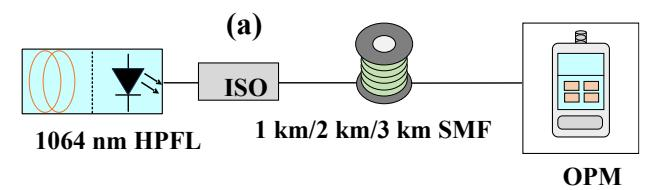
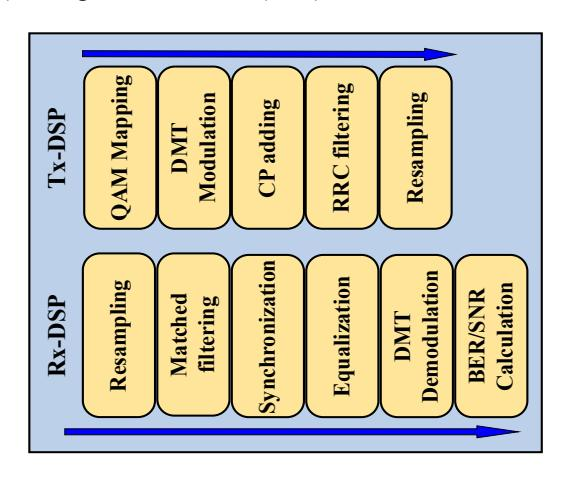
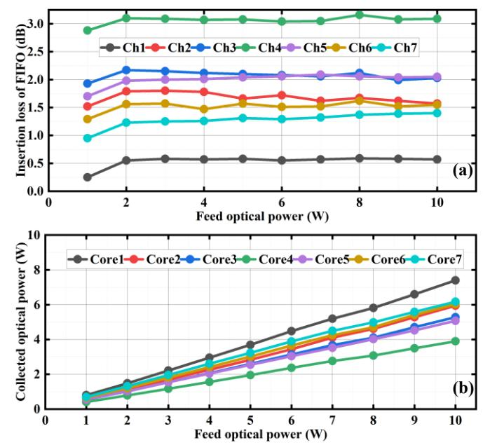

{0}------------------------------------------------

# High-speed DMT signal and power-over-fiber simultaneous transmission over weakly-coupled multicore Fiber

### Wei Chen

Institute of Advanced
Photonics Technology, School
of Information Engineering;
Key Laboratory of Photonic
technology for Integrated
Sensing and Communication,
Ministry of Education;
Guangdong Provincial Key
Laboratory of Information
Photonics Technology,
Guangdong University of
Technology
cw1341300642@163.com

Jianping Li \*
Institute of Advanced
Photonics Technology, School
of Information Engineering;
Key Laboratory of Photonic
technology for Integrated
Sensing and Communication,
Ministry of Education;
Guangdong Provincial Key
Laboratory of Information
Photonics Technology,
Guangdong University of
Technology
jianping@gdut.edu.cn
\*Corresponding author

Songnian Fu Institute of Advanced Photonics Technology, School of Information Engineering; Key Laboratory of Photonic technology for Integrated Sensing and Communication, Ministry of Education; Guangdong Provincial Key Laboratory of Information Photonics Technology, Guangdong University of Technology songnian@gdut.edu.cn

Xinkuo Yu
Institute of Advanced
Photonics Technology, School
of Information Engineering;
Key Laboratory of Photonic
technology for Integrated
Sensing and Communication,
Ministry of Education;
Guangdong Provincial Key
Laboratory of Information
Photonics Technology,
Guangdong University of
Technology
yuxinkuo@sina.com

Yuwen Qin Institute of Advanced Photonics Technology, School of Information Engineering; Key Laboratory of Photonic technology for Integrated Sensing and Communication, Ministry of Education; Guangdong Provincial Key Laboratory of Information Photonics Technology, Guangdong University of Technology qinyw@gdut.edu.cn

Jianbo Zhang
Institute of Advanced
Photonics Technology, School
of Information Engineering;
Key Laboratory of Photonic
technology for Integrated
Sensing and Communication,
Ministry of Education;
Guangdong Provincial Key
Laboratory of Information
Photonics Technology,
Guangdong University of
Technology
Jianbo zhang@gdut.edu.cn

Abstract—We experimentally demonstrate transmission of 50 and 60 GBaud 64-level quadrature amplitude modulation (QAM) high-speed optical discrete multi-tone (DMT) signal corresponding to the data rate of 117 Gbit/s and 140 Gbit/s, and 60-W power over fiber (PoF) over 1-km 7-core single-mode weakly coupled multi-core fiber (WC-MCF) for the first time. In this demonstration, the optical power transmission efficiency (OPTE) of energy light is up to 53.9%, and the collected optical power at the remote unit (RU) can be up tp 32.4 W. Meanwhile, the bit error rates (BERs) of 50 GBaud and 60 GBaud 64-QAM DMT signal in the intensity modulation direct detection (IM-DD) system at RU are all lower than the soft decision forward error correction (SD-FEC) threshold of 2E-2. In addition, the signal-tonoise ratio (SNR) of 50 GBaud is more than 22 dB within the limit

established in the  $3^{rd}$  Generation Partnership Project (3GPP) defined requirement.

Keywords— discrete multi-tone modulation, power over fiber, weakly coupled multi-core fiber, intensity modulation direct detection.

## I. INTRODUCTION

Power-over-fiber (PoF) is an attractive technology that simultaneously transmits optical data signal and power light over an optical fiber link. The PoF technology is effectively used to centralize the required power in a central office (CO) and to transmit the power light with the optical data signal to the remote unit (RU) in the same fiber [1, 2]. In future Digital Grid application scenarios, power must be

{1}------------------------------------------------

supplied remotely to high-power devices in the RU. In addition, to meet the growing demand for mobile traffic, it is necessary to support higher-rate data signal communication from CO to RU [3]. Therefore, PoF technology is desired to realize the high-speed and high-optical power transmission over certain-distance fiber link. In conventional PoF systems, radio-over-fiber (RoF) is one of the indispensable technologies that uses optical fiber to transmit radio frequency signals (RF) to remote RU [4-7]. Although the OPTE of PoF is lower than that of copper wires, PoF can dynamically adjust the power delivery capability, effectively reducing the RU consumption [8, 9].

In recent years, PoF schemes based on double-clad fiber (DCF), standard single-mode fiber (SSMF), multi-mode fiber (MMF), multicore fiber (MCF), and hollow-core fiber (HCF) with RoF technology have been demonstrated [10-19]. For the PoF scheme based on DCF, a 60-W and 150-W energy light at 808 nm can be delivered through the 105 µm or 125 µm inner cladding with a large core region. Meanwhile, the 64-level quadrature amplitude modulation orthogonal frequency division multiplexing (64 QAM-OFDM) RF signal at 1550 nm at the 8 µm or 9 µm single-mode core, with a data rate of 54 Mbit/s have been achieved over 300 m or 1 km DCF [10, 11]. Since it is hard to extract optical power effectively from the inner cladding, the transmission loss of the energy light is high, although the data signal maintains good performance. In [12], a 10W power light at 1550 nm co-transmission with a 2.45-GHz 64 QAM-OFDM signal at 1310 nm has been demonstrated over 2-km MMF with the data rate limited to 54 Mbit/s, due to the intermodal dispersion of MMF. The cotransmission of 10-W energy light at 1064-nm and 1.5-Gbit/s 5G NR signal at 1550-nm over a 1-km SSMF through wavelength division multiplexing (WDM) has been reported [13]. However, SSMF cannot transmit high-power light due to the power threshold limitations of stimulated Raman scattering (SRS) and stimulated Brillouin scattering (SBS). The power-over-MCF scheme can co-transmit energy and signal light over individual cores using space division multiplexing (SDM) technology [14,15]. Although the transmission energy light is 60 W over 1 km of 7-core fiber, the rate of signal light is only 9 Gbit/s, which does not meet the requirements of high-speed optical transmission. In the HCF scheme [16], there is no degradation in the co-transmission with energy light in terms of the extreme low nonlinear effects. However, the attenuation of the HCF would be a problem for the OPTE of the PoF link. Weakly coupled MCF integrates multiple SMFs through SDM to reduce the inter-core crosstalk (XT), which can significantly increase the data signal rate and energy light transmission efficiency to meet the high-speed and high-power transmission needs [17, 18]. Moreover, multiple advanced modulation formats, such as pulse amplitude modulation (PAM), carrier-less amplitude phase modulation (CAP), and discrete multitone modulation (DMT), are the research focuses of high-rate and high-power co-transmission with fiber [19, 20].

However, the primary challenges confronting systems capable of simultaneously transmitting optical signals and PoF are twofold. First, the transmission rate of the signal light is insufficient to meet the highspeed data communication requirements from the CO to the RU in power grid scenarios. Second, the energy-carrying optical power lacks the necessary strength to provide a stable and adequate power supply for the operational load of the RU. Therefore, to solve this problem, in this paper, we present a novel method for a high-speed signal light and high-power energy light co-transmission system using a 1-km 7-core MCF for driving RU devices in the Digital Grid. To realize the high bit-rate, the high-speed DMT signals with 50 GBaud and 60 GBaud corresponding to 114 Gbit/s and 140 Gbit/s have been adopted. Then we experimentally demonstrate that the simultaneoustransmission of total 60-W PoF signal at 1064 nm and the IM-DD high-speed 64- QAM DMT signal at 1550 nm over 1-km 7-core MCF for the first time.

# II. EXPERIMENTAL SETUP

First, wemeasured the transmission of 1064 nm PoF signal over 1 to 3 km of SMF, asshown in Fig. (a). Ahigh power fiber laser(HPFL) is used as an high-powersource, with a wavelength of 1064 nm and a maximum output of 10 W. Due to the spectral width of HFPL being over 40 GHz, which is much larger than the Brillouin gain bandwidth, the effect of SBS was negligible [21, 22]. To avoid the damage to the laser by the reflection of the SRS effect, an isolator is added to the output end of the laser. Therefore, the impact of SRS in the experiment has been considered. As shown in Fig. 1(b), the collected power increases linearly as the HPFL output power increases after1 km SMF transmission, indicating no SRS effect happened. As fiber length increases to 2 km, when the HFPL output is about 9 W, the collected optical power tends to be saturated, resulting in the SRS effect. Finally, with a fiber length of 3 km, a significant SRS effect occurs when the HPFL output starts at about 6 W. Therefore, we use 1 km as the transmission link length to ensure no SRS effect.

HPFL: High power fiber laser, OPM: Optical power meter. ISO: isolator.

Fig. 1. (a) Experimental setup for transmission of 1064 nm energy light over 1 to 3 km SMF. (b) Collected optical power of energy light after transmission over 1 km/2 km/3 km SMF.

In the following, the experimental setup for co-transmission over 1-km 7-core single-mode WC-MCF with high-power PoF signal and IM-DD based high-speed DMT signal is shown in Fig. 2. At the transmitter, 50 GBaud and 60 GBaud 64-QAM corresponding to 117 Gbit/s and 140 Gbit/s DMT digital signal respectively are generated off-line in MATLAB software and converted into an analog signal using an arbitrary waveform generator (AWG) (Keysight M8194A), with a 120 GSa/s sampling rate and 45 GHz analog bandwidth. The continuous-wave (CW) optical carrier is from an external cavity laser (ECL) with 16 dBm optical power operating at 1550 nm. The polarization controller (PC) is used to control the

{2}------------------------------------------------

Fig. 2. Experimental setup for co-transmission over 1-km 7-core WC-MCF of 60-W power light and optically carried DMT signal.

polarization state of the output light of ECL. Then, the optical carrier is fed into a LiNbO3-based electro-optic Mach-Zehnder modulator (MZM) with a 3 dB bandwidth of 45 GHz. In the modulator, the electrical DMT signal amplified by an electrical amplifier (EA) is converted to an optical DMT signal through intensity modulation, and the output optical signal is fed into any core of a customized 7-core WC-MCF fan-in module. Meanwhile, six single-mode 10 W HPFLs at 1064 nm used for PoF signal delivery are fed into the remaining six cores of the 7-core WC-MCF fan-in module. As shown in the inset of Fig. 2(a),which is a microscope cross-section of 7-core WC-MCF, the core pitch is 41.5 µm, the mode field diameter (MFD) is 9.5 µm, and the XT of PoF signal at 1064 nm is less than -110 dB. The inset (b) shows the used low insertion loss Fan-in and Fan-out (FIFO) device. Fusion splicing of fan-in and fan-out (FIFO) devices and WC-MCF is implemented by Fujikura's special optical fiber splicer (FSM-100P+) with fusion loss less than 0.1 dB.Next, the opticalDMT signal and the six-channel PoF signal are co-transmitted over 1-km 7-core WC-MCF with a cladding diameter of 150 µm (YOFC, MCF 7-42) using SDM. At the RU, a variable optical attenuator (VOA) is used to adjust the input power of the DMT optical signal to be amplified by the erbiumdoped fiber amplifier (EDFA). Then, a photodetector (PD) with an electrical bandwidth of 50 GHz is used to convert optical signal to electrical signal, which is then captured by a real-time digital storage oscilloscope (DSO) at 160 GSa/s. For energy light, the power of the six-channel energy light is monitored by an optical power meter. It is converted into electrical power by six photovoltaic power converters (PPC) and supplies power to the loads in the end.

The DSP flow charts of the transmitter and receiver are shown in Fig. 3. At the transmitter side, the pseudorandom binary sequence (PRBS) is first generated and mapped into 64 QAM symbols. After mapping, the inverse fast Fourier transform (IFFT) transforms the frequency domain symbols into the time domain ones to realize the DMT modulation. Then, a 32-point cyclic prefix (CP) is added to reduce the inter-symbol interference (ISI). After the parallel to serial (P/S) conversion, the received DMT signal is filtered by a raised cosine filter and resampled before being sent to the AWG. At the receiver side, the signal captured by the DSO is first resampled to the sampling rate of the AWG, filtered by a matched filter and then synchronized to obtain the DMT symbol. Subsequently, feed-forward equalization (FFE) is used to compensate for the signal impairment induced by the channel. After the serial to parallel (S/P) conversion and CP removing, a fast Fourier transform (FFT) is used to demodulate the DMT signal from the time domain to the frequency domain. At last, bit-error-rate (BER) and signal-to-noise ratio (SNR) are calculated.

Figure 3. The DMT DSP flow charts of the transmitter and receiver.

# III. RESULTS AND DISCUSSIONS

We first verify that the high-power PoF signal does not produce SRS and SBS nonlinear effects over 1-km 7-core single-mode WC-MCF transmission. When the PoF signal at 1064 nm with a variable launched power from 1 W to 10 W is fed into each core, the insertion loss of each channel induced by the FIFO is shown in Fig. 4 (a). The maximum insertion loss of channel 4 is more than 3 dB, and the minimum insertion loss of channel 1 is less than 0.6 dB. With the increase of PoF signal power, the insertion loss of each channel basically keeps the same. As shown in Fig. 4(b), the curve of the 

{3}------------------------------------------------

energy light collected by each core shows a linear variation trend, indicating no obvious nonlinear effect of SRS at 1 km 7-core WC-MCF. On the other hand, there is also no SBS effect found because of the customized high-power laser with a linewidth of 40 GHz at 1064 nm wavelength, which greatly increases the SBS power threshold.

Figure 4. (a) Insertion loss per channel of FIFO at 1064 nm, (b) collected optical power per core of the WC-MCF.

To validate the performance of the DMT signal light with the 60 W PoF signal in any fiber core, the optical DMT signal is fed into core 1 to 7 (the corresponding number of cores is 1 to 7) in turn, while the remaining six coressimultaneously transmit 60 W PoF signal at 1064 nm by six HPFLs. After parameter optimization, the successful transmission of 50 GBaud 64-QAM DMT optical signal with and without feed light has been realized, and the BER performance is shown in Fig. 5(a).Meanwhile, the BER of 60GBaud 64-QAM DMT optical signal is shown in Fig. 5(b). It can be observed that the BER is below the soft decision forward error correction (SD-FEC)limit of 2E-2 for both cases, which indicates that the high-power PoF signal has no significant impact on the BER performance. As an example, specifically, Fig. 5(c) shows the SNR of 50 G-Baud 64-QAM DMT signal with and without the feed light for core 1 to 7. In this case, the data rate of 117 Gbit/s has been realized. Due to the performance difference among seven fiber cores, although the SNR performance has slight fluctuation, all SNRs can meet the desired 3GPP requirement of 21.9 dB corresponding to the error vector magnitude (EVM) < 8% [22], for the high-speed mobile fronthaul scenarios. We do the corresponding experimental validation for 60 GBaud 64-QAM corresponding to 140 Gbit/s DMT signal, subsequently, and the SNR performance is shown in Fig. 5(d). In such a case, the received SNR cannot meet the desired 3GPP requirement. However, it can be concluded that the co-transmission of high-power energy light has no significant impact on the high-speed DMT signal over the 1km MCF link. Finally, take core 1 as an example, the constellation diagram of 50GBaud and 60GBaud 64-QAM DMT signals in the corresponding case asshown in the insets(a) and (b) of Fig. 5, respectively.

Figure 5. The BER of different fiber core with and without feed light under (a) the 50 GBaud and (b) the 60 GBaud cases. The SNR of different fiber core with and without feed light under (c) the 50 GBaud and (d) the 60 GBaud cases.

Next, six outer cores are chosen for PoF signal delivery, while the central core is used to transmit a 50 GBaud DMT optical signal, for example. When six outer cores simultaneously input 10 W PoF signal, therefore, the simultaneous transmission of a total of 60 W PoF signal over the outer six cores of 1-km 7-core WC-MCF can be realized. After transmission, the total collected optical power and the corresponding OPTE of each core from the RU are shown in Fig. 6. It should be noted that the OPTE is defined as the ratio of collected optical power to the feed power of six HPFLs. Thus, from the results, we can achieve a total optical power of 32.4 W and an OPTE of ~53.9%. Finally, we estimate the temporal stability of the high-power PoF signal delivery over different fiber cores and total collected power, as shown in Fig. 7 and Fig. 8, respectively. The collected optical power is monitored for one hour with a measurement interval of 5 minutes. It can be found that the fluctuation of the collected optical power of separated fiber cores and the total one are both less than 1%. It indicates that the high-power PoF signal delivery over the MCF link is relatively stable. Given a PPC with a theoretical maximum of 54.7% optical-electrical conversion efficiency [24], the converted electrical power can be up to ~18 W for this demonstration, which can be used to power tens or hundreds of the lower power consumption devicesin the remote scenarios, such as picocell, remote radio head (RRH), etc.

Figure 6. The total collected optical power and OPTE of the WC-MCF.

{4}------------------------------------------------

Figure 7. Temporal power fluctuation of the delivered light over WC-MCF.

Figure 8. Temporal fluctuation of total collected optical power.

# IV. CONCLUSION

In conclusion, we experimentally demonstrate the simultaneous transmission of 60 W PoF signal with 117 Gbit/s and 140 Gbit/s highspeed DMT signal in an IM-DD system over 1 km 7-core multicore fiber for the first time. The performance of the DMT signal can meet the 3GPP requirement of the SNR, and the collected optical power can be up to ~32.4 W with an OPTE of 53.9%. In addition, the temporal fluctuation of the collected power among different fiber core is less than 1% over 1 hour, which shows that the high-power PoF systems can provide stable electrical power to low-voltage loads in the Grid scenario. Therefore, the demonstration has good potential in remote application scenarios of short-range Digital Grids.

# ACKNOWLEDGMENT

This work is partly supported by National Natural Science Foundation of China (U22A2087, 62022029) and Guangdong Introducing Innovative and Entrepreneurial Teams of "The Pearl River Talent Recruitment Program" (2019ZT08X340).

# REFERENCES

- [1] R. C. Miller, R. B. Lawry, and Bell Syst, "Optically powered speech communication over fiber lightguide," Tech. J, 58, 1735 (1979).
- [2] R. Altuna, J. D. López-Cardona, and C. Vázquez, "Monitoring of Power Over Fiber Signals Using Intercore Crosstalk in AroF 5G NR Transmission," J. Lightwave Technol, 41(23), 7155 (2023).
- [3] A. Kanno, P. Dat, and N. Yamamoto, "High-Speed Railway Communication System Using Linear-Cell-Based Radio-Over-Fiber Network and Its Field Trial in 90-GHz Bands," J. Lightwave Technol. 38(1), 112 (2020).
- [4] M. Sauer, A. Kobyakov, and J. George, "Radio Over Fiber for Picocellular Network Architectures," J. Lightwave Technol. 25(11), 3301 (2007).

- [5] N. Takehiro, N. Satoshi, B. Anass, K. Yoshihisa, H. Tang, X. D. Shen, and N. Li, "Non-Orthogonal Multiple Access (NOMA) for Cellular Future Radio Access", IEEE Commun. Mag. 51(2), 98 (2013).
- [6] R. Altuna, A. Nkansah, J. D. López-Cardona, F. M. A. Al Zubaidi D. S. Montero, and C. Vázquez, "Power-over-Fiber Impact and Chromatic-Induced Power Fading on 5G NR Signals in Analog RoF", J. Lightwave Technol. 40(20), 6976 (2022).
- [7] D. Wake N. J. Gomes, C. Lethien, C. Sion, and J. P. Vilcot, "An optically powered radio over fiber remote unit using wavelength division multiplexing", J. Lightwave Technol. 26, 2484 (2008).
- [8] J. D. L. Cardona, R. Altuna, D. S. Montero, and C. Vazquez, "Power Over Fiber in C-RAN With Low Power Sleep Mode Remote Nodes Using SMF", J. Lightwave Technol. 39(15), 4951 (2021).
- [9] M. Matsuura, "Recent Advancement in Power-over-Fiber Technologies," Photonics, 8(8), 335 (2021).
- [10] M. Matsuura, N. Tajima, H. Nomoto, and D. Kamiyama, "150-W Power-Over-Fiber Using Double-Clad Fibers", J. Lightwave Technol. 38(2), 401 (2020).
- [11] M. Matsuura, H. Nomoto, H. Mamiya, T. Higuchi, D. Masson, and S. Fafard, "Over 40-W Electric Power and Optical Data Transmission Using an Optical Fiber", IEEE Trans. Power Electron. 36(4), 4532 (2021).
- [12] H. Kuboki and M. Matsuura, "60 W power-over-fiber feed using doubleclad fibers for radio-over-fiber systems with optically powered remote antenna units", Opt. Lett. 43(23), 1067 (2018).
- [13] H. L. Yang, D. Peng, Y. W. Qin, J. P. Li, M. Xiang, O. Xu, and S. N. Fu, "10-W power light co-transmission with optically carried 5G NR signal over standard single-mode fiber", Opt. Letters 46(20), 5116 (2021).
- [14] H. Yang, S. Wang, D. Peng, Y. Qin, and S. N. Fu, "Optically powered 5G WDM fronthaul network with weakly-coupled multicore fiber", Opt. Express 30(11), 19795 (2022).
- [15] S. Wang, H. Yang, Y. Qin, D. Peng, and S. N. Fu, "Power-Over-Fiber in Support of 5G NR Fronthaul: Space Division Multiplexing Versus Wavelength Divison Multiplexing", J. Lightwave Technol. 40(13), 4169 (2022).
- [16] R. Altuna, Y. Jung, P. Petropoulos, and C. Vázquezl, "Power Over Fiber and Analog Radio Over Fiber Simultaneous Transmission Over Long Distance in Single Mode, Multicore, and Hollow Core Fibers", Laser & Photonics Rev 36(11), 2400157 (2024).
- [17] S. Rommel, D. Perez-Galacho, J. M. Fabrega, R. Muñoz, S. Sales, and I. T. Monroy, "High-Capacity 5G fronthaul networks based on optical space division multiplexing," IEEE Trans. Broadcast. 65(2), 434 (2019).
- [18] J. J. Wu, Y. J. Zhang, M. Zukerman, and E. K.-N. Yung, "Energy-Efficient Base-Stations Sleep-Mode Techniques in Cellular Networks: A Survey," IEEE Commun. Surveys Tuts. 17, 803 (2015).
- [19] S. An, Q. Zhu, J. Li, H. Pang, and Y. Su, "Experimental Demonstration of Single-wavelength, single-polarization 102-Gb/s DMT signal Transmission over 105-km Single-span SMF in an IM-DD System," in The International Photonics and Optoelectronics Meeting (POEM), paper OT4A. 10.
- [20] D. Zou and Y. Chen, "Comparison of Bit-Loading DMT and Pre-Equalized DFT-Spread DMT for 2-km Optical Interconnect System," J. Lightwave Technol. 37(10), 2194 (2019).
- [21] H. H. Diamandi, Y. London, G. Bashan, K. Shemer, and A. Zadok, "Forward Stimulated Brillouin Scattering Analysis of Optical Fibers Coatings," J. Lightwave Technol. 39 (6), 1800 (2021).
- [22] M. Wada, K. Kurokawa, T. Matsui, K. Omoto, H. Iida, and K. Nakajima, "Standard Cladding Diameter 4-Core Fiber Based Power Over Fiber and Bi-Directional Data Transmission," J. Lightwave Technol. 42 (23), 8414 (2024).
- [23] V. Fito, R. Ortiz, M. Morant, L. Mercadé, R. Llorente, and A. Martínez, "Experimental Evaluation of All-Optical Up- and Down-Conversion of 3GPP 5G NR Signals Using an Optomechanical Crystal Cavity Frequency Comb," J. Lightwave. Technol. 42 (19), 6825 (2024).
- [24] C. Pellegrino, H. Helmers, J. Ohlmann, O. Höhn and D. Lackner, European Space Power Conference (ESPC) (2023).