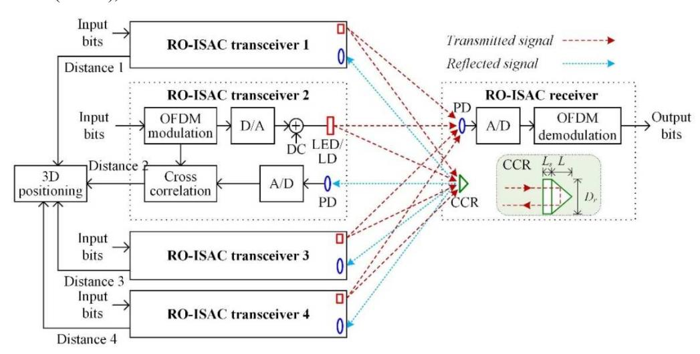
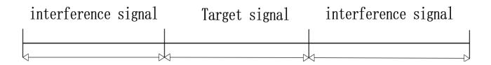
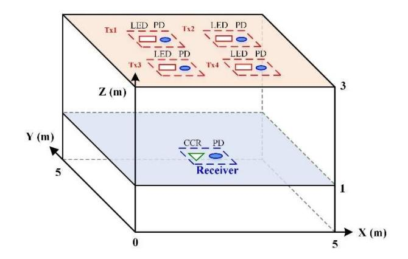
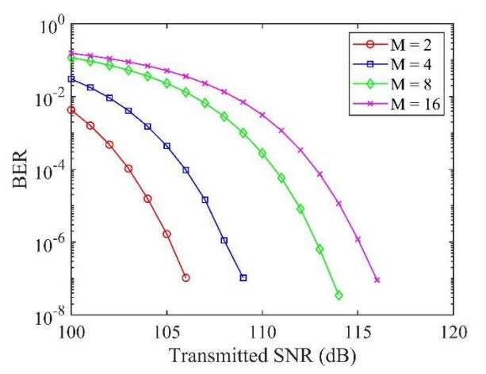
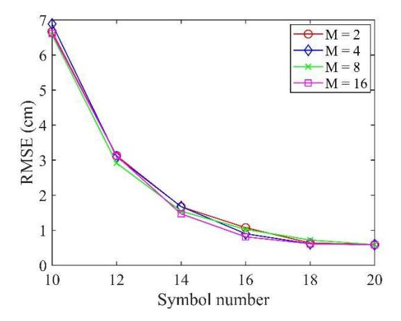
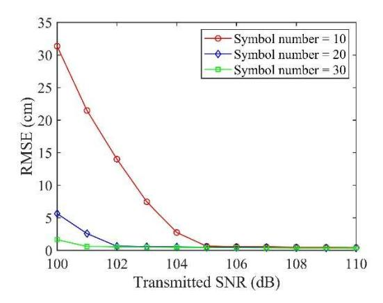
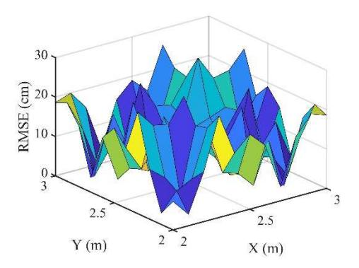
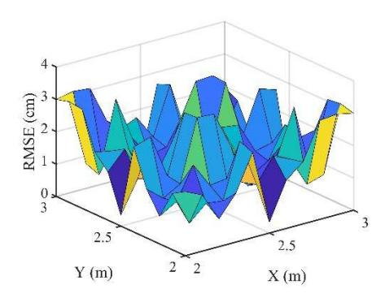

{0}------------------------------------------------

# Retroreflective Optical ISAC Supporting 3D Positioning in Indoor Environments

Haochuan Wang *School of Microelectronics and Communication Engineering Chongqing University*  Chongqing, China 202312131101T@stu.cqu.edu.cn

Binbin Zhu *Shenzhen Hua Chuang Chip Lighting Company, Ltd.* Shenzhen, China binbin.zhu@hccl-tech.com

Zhihong Zeng *School of Microelectronics and Communication Engineering Chongqing University*  Chongqing, China zhihong.zeng@cqu.edu.cn

Sihua Shao *Department of Electrical Engineering Colorado School of Mines*  Colorado, USA sihua.shao@mines.edu

Chen Chen *School of Microelectronics and Communication Engineering Chongqing University*  Chongqing, China c.chen@cqu.edu.cn

Min Liu *School of Microelectronics and Communication Engineering Chongqing University*  Chongqing, China liumin@cqu.edu.cn

*Abstract***—A retroreflective optical ISAC (RO-ISAC) system supporting 3D positioning is proposed. This system used the transmitted signal and the reflected signal to measure the distance, which can further locate position of the target.**

*Keywords—orthogonal frequency division multiplexing; optical integrated sensing and communication; visible light communication (key words)* 

## I. INTRODUCTION

With the development of the sixth-generation communication technology (6G), visible optical communication (VLC) is regarded as a promising technology to adapt to 6G technology [1], because VLC system has rich spectrum resources to meet the needs of communication performance, but also has the advantages of security, antiinterference and low cost. At present, LED lights in the market are usually band limit with low-pass effect. So far, a variety of technologies have been proposed to improve the performance of band limit VLC system, such as frequency domain equalization, multi-input and multi-output (MIMO) [2-5] and orthogonal frequency division multiplexing (OFDM) [6-9].

So far, many algorithms have been applied in visible light positioning system, such as time of arrival (TOA), received signal strength (RSS), angle of arrival (AOA), phase difference of arrival (PDOA), time difference of arrival (TDOA). Compared with the traditional positioning perception system [10], integrated sensing and communication (ISAC) [11] refers to the realization of communication function while realizing the perception, which has the advantages of low cost, reducing equipment size, reducing power consumption, ignoring the interference between communication perception and improving spectrum utilization. Due to the bandwidth limit, the ranging accuracy of RF sensing integration system can only reach the meter level, while the optical integrated sensing and communication (OISAC) benefits from the visible light spectrum resources, which can reach the ranging accuracy of centimeter or even millimeter level, and can provide higher perception accuracy and resolution.

In this paper, we use the transceiver integrated design at the signal transmitter, requiring no additional equipment hardware, and use OFDM waveform for data transmission and positioning. This system uses the cross-correlation calculation between the transmitted signal and the reflected signal to find the time delay between the receiver and the transmitter. The system adopts passive ranging, which means that the sensing process is undertaken by the transmitter side, and the user's communication performance will not be affected by the sensing process. In order to achieve low complexity and low cost, we design an OISAC system with intensity modulation and direct detection.

Fig. 1. Schematic diagram of a RO-ISAC system supporting 3D positioning.

{1}------------------------------------------------

#### II. SYSTEM MODEL

The model of OISAC system using OFDM is introduced in this section, where the architecture of the system is first described, the principle of distance measurement and the principle of localization are further discussed.

#### A. Channel model

Fig. 1 illustrates the Schematic diagram of the RO-ISAC system. When the signal is transmitting in the space, it will finally reach a photo-detector (PD) and the corner cube reflector (CCR), both of them are in the receiver side. The CCR will reflect the optical signal to the transmitter side, which will be capture by the PD in the transmitter.

For the communication channel model, assuming the LED light source follows the Lambertian emission pattern and only considering the line-of-sight (LOS) transmission, the communication channel gain can be expressed by [12]

$$h_c = \begin{cases} \frac{(m+1)A_c\rho_c}{2\pi d^2} cos^m(\varphi)\kappa(\theta) \cos(\theta), & \text{for } 0 \le \theta \le \varphi_c \\ 0, & \text{else,} \end{cases} \tag{1}$$

where  $m = -\ln 2/\ln(\cos(\Psi))$  is the order of Lambertian emission with  $\Psi$  being the semi-angle at half power of the LED light source;  $A_c$  and  $\rho_c$  are the active area and responsivity of the PD in the RO-ISAC receiver, respectively; d is the distance between the RO-ISAC transceiver and the RO-ISAC receiver;  $\varphi$  and  $\theta$  are the irradiance angle and the incident angle, respectively; and  $\kappa(\theta) = T_s(\theta)g(\theta)$ , where  $T_s(\theta)$  is the gain of optical filter and  $g(\theta) = n^2/\sin^2(\Phi_c)$  is the gain of optical lens, with n and  $\Phi_c$  denoting the refractive index and half-angle field of view (FOV) of the optical lens, respectively.

For the sensing channel model, we can posit the light emitted by the point source can always be fully reflected by the CCR, so the sensing channel gain can be described by [13]

$$h_c = \begin{cases} \frac{(m_p + 1)A_S \rho_S k}{2\pi d^2} \cos^{m_p}(\varphi) \kappa(\varphi) \cos(\theta), \\ \text{for } 0 \le \theta \le \Phi_r \text{ and } 0 \le \varphi \le \Phi_s \\ 0, \text{else,} \end{cases}$$
 (2)

where  $m_p = -\ln 2/\ln(\cos(\Psi_p))$  is the corresponding Lambertian emission order and  $\Psi_p$  is the small semi-angle at half power of the point source, while  $A_s$ ,  $\rho_s$ , and  $\Phi_s$  are the active area, responsivity, and half-angle FOV of the PD in the RO-ISAC transceiver, respectively, and k and  $\Phi_r$  are the reflectance and the half-angle FOV of the CCR in the RO-ISAC receiver, respectively. An additional  $\cos(\varphi)$  term is included due to the incidence of the reflected signal to the PD in the RO-ISAC transceiver. Moreover, the term  $\kappa(\varphi)$  should also be calculated with respect to  $\varphi$ .

#### B. Principle of communication

For the communication, the input binary data is converted to decimal data, and mapped onto M complex-valued QAM symbols. After QAM mapping, the QAM symbols will be transformed from serial to parallel (S/P). To generate the real-valued and non-negative transmit signal, the inverse fast Fourier transform (IFFT) which is imposed with the Hermitian symmetry (HS) constraint and parallel-to-serial(P/S) is executed. The DC bias will be added to the transmitted signal, which will ensure the signal can activate the LEDs. After Digital-to-Analog (DAC) operation, the

analog signal can be loaded onto LED and emitted by it, and it will be captured by the PD.

To localize the target, four transmitters are used to transmit the same signal. So, in the receiver side the system needs to merge these diversity signals, which is imposed under the principle of Maximal Ratio Combining (MRC). After Analog-to-Digital (ADC), S/P and frequency-domain equalization (FDE) operation, the signal will further be recovered to QAM symbols by fast Fourier transform (FFT). Subsequently, the demodulation data can be recovered through demapping and binary converting.

## C. Principle of sensing

In the transmitter side, PD and LED are high synchronized. When the LED starts to emit the target signal, the PD in the transmitter will began to sense the optical signal. After a certain period of time, the PD will stop collecting the signal. The length of the time is determined by the maximum measurement distance. So, the block diagram of the receiving signal as shown in the Fig. 2.

Fig. 2. Illustration of the reflected signal.

To synchronize the reflected signal and measure the distance between the transmitter and user, the system will use the transmitted signal to make cross-correlation calculation with the reflected signal. This procession is as follows: starting from the first sampling point of the reflected signal, each mutual calculation takes the same number of sampling points from the reflected signal as the number of sampling points from the transmitted signal to complete the crosscorrelation calculation. After completing a cross-correlation calculation, record the results, and the next cross-correlation calculation will start from the next sampling point of the reflected signal from the previous calculation. In this way, a series of cross-correlation calculation results can be obtained. Finally, the system can find the maximum value of crosscorrelation calculation results, and its index represents the time delay of the reflected signal. This can be represented by

$$\hat{\tau} = \arg\max\sum_{n=0}^{m} y(n)x(n-\tau)$$
 (3)

where x(n) and y(n) respectively represents for transmitted signal's sampling points and reflected signal's sampling points and m presents for the maximum delay sampling point number. So, the estimate distance can be calculated by  $\hat{d} = c\hat{\tau}/2$ , with c represents the speed of light. The range resolution and the maximum ranging distance are respectively given by  $\Delta d = cTs/2$  and  $d_{max} = cmTs/2$ , with Ts represents for the sampling interval.

In this system, four LEDs are used to measure the distances between the user. So, four quadratic equations can be created as follows:

$$\begin{cases} (x_{t1} - x_r)^2 + (y_{t1} - y_r)^2 + (z_{t1} - z_r)^2 = r_1^2 \\ (x_{t2} - x_r)^2 + (y_{t2} - y_r)^2 + (z_{t2} - z_r)^2 = r_2^2 \\ (x_{t2} - x_r)^2 + (y_{t2} - y_r)^2 + (z_{t2} - z_r)^2 = r_2^2 \\ (x_{t4} - x_r)^2 + (y_{t4} - y_r)^2 + (z_{t4} - z_r)^2 = r_4^2 \end{cases}$$
(4)

{2}------------------------------------------------

where  $x_r$ ,  $y_r$ , and  $z_r$  represent for the 3D coordinates of the user,  $x_i$ ,  $y_i$ , and  $z_i$  represent for the 3D coordinates of the  $i^{th}$  transmitter,  $r_i$  represents for the distance between  $i^{th}$  transmitter and user. Subtracting the last equation from the first three equations yields the following result:

$$\begin{cases} x_r(x_{t1} - x_{t4}) + y_r(y_{t1} - y_{t4}) + z_r(z_{t1} - z_{t4}) = \\ \frac{(r_4^2 - r_1^2 + x_4^2 - x_1^2 + y_4^2 - y_1^2 + z_4^2 - z_1^2)}{2} \\ x_r(x_{t2} - x_{t4}) + y_r(y_{t2} - y_{t4}) + z_r(z_{t2} - z_{t4}) = \\ \frac{(r_4^2 - r_2^2 + x_4^2 - x_2^2 + y_4^2 - y_2^2 + z_4^2 - z_2^2)}{2} \\ x_r(x_{t3} - x_{t4}) + y_r(y_{t3} - y_{t4}) + z_r(z_{t3} - z_{t4}) = \\ \frac{(r_4^2 - r_3^2 + x_4^2 - x_3^2 + y_4^2 - y_3^2 + z_4^2 - z_3^2)}{2} \end{cases}$$
(5)

These equations can be represented as a matrix format: AX=B, where A, B and X are defined as

$$\mathbf{A} = \begin{bmatrix} x_{t1} - x_{t4} & y_{t1} - y_{t4} & z_{t1} - z_{t4} \\ x_{t2} - x_{t4} & y_{t2} - y_{t4} & z_{t2} - z_{t4} \\ x_{t3} - x_{t4} & y_{t3} - y_{t4} & z_{t3} - z_{t4} \end{bmatrix}$$
(6)

$$X = \begin{bmatrix} x_r \\ y_r \\ z_r \end{bmatrix} \tag{7}$$

$$B = \begin{bmatrix} \frac{(r_4^2 - r_1^2 + x_4^2 - x_1^2 + y_4^2 - y_1^2 + z_4^2 - z_1^2)}{2} \\ \frac{(r_4^2 - r_2^2 + x_4^2 - x_2^2 + y_4^2 - y_2^2 + z_4^2 - z_2^2)}{2} \\ \frac{(r_4^2 - r_3^2 + x_4^2 - x_3^2 + y_4^2 - y_3^2 + z_4^2 - z_3^2)}{2} \end{bmatrix}$$
(8)

Then, the estimated receiver coordinates can be obtained using the linear least squares estimation method, as shown below [14]

$$\widehat{\mathbf{X}} = (A^T A (A^T) B)^{-1} \tag{9}$$

#### III. SIMULATION RESULTS

In this section, a series simulation results in an indoor space will be shown, where the simulation setup will be first described and the simulation results are further discussed.

## A. Simulation Setup

The simulation considers a space size of 5m\*5m\*3m indoor space. Take any one of the bottom four corners in space as the origin. The coordinates of the device can be shown as TABLE I. .

TABLE I. SPACE LOCATION SETTINGS

| Name           | Location      |
|----------------|---------------|
| LED in Tx1     | (2,2,2.95) m  |
| LED in Tx 2    | (3,2,3) m     |
| LED in Tx 3    | (2,3,3) m     |
| LED in Tx 4    | (3,3,2.95) m  |
| PD in Tx 1     | (2,2,2.95) m  |
| PD in Tx 2     | (3,2,3) m     |
| PD in Tx 3     | (2,3,3) m     |
| PD in Tx 4     | (3,3,2.95) m  |
| CCR            | (2.5,2.5,1) m |
| PD in receiver | (2.5,2.5,1) m |

where LEDi represents for the ith LED, PD\_Ti represents for the PD in the ith LED, and PD\_R represents for the PD in the receiver. The 3D illustration is shown as

Fig. 3. Simulation setup.

For this simulation, the added noise is additive Gaussian White Noise. The OFDM signal adopts the length of IFFT/FFT to be 256, and the number of data subcarrier is 64. The DAC sampling rate is 5GSa/s, and ADC sampling rate is 15GSa/s, so the range resolution is 1cm. The simulation takes four different base constellations into consideration. The detailed simulation parameters are given in TABLE II.

TABLE II. SIMULATION PARAMETERS

| Parameter                 | Value        |
|---------------------------|--------------|
| IFFT/FFT size             | 256          |
| Base constellations       | 2,4,8,16-QAM |
| Number of data subcarrier | 64           |
| DAC sampling rate         | 5 GSa/s      |
| ADC sampling rate         | 15 GSa/s     |
| Upsampling ratio          | 3            |

#### B. Simulation Results

Fig. 4. BER vs. transmitted SNR for different modulation orders.

Fig. 4 compares the different modulation order's BER performance in different transmitted SNR under the conditions that simulation sets. Compared to traditional point-

{3}------------------------------------------------

to-point communication, the system proposed in this paper provides diversity gain for communication. It well shown the different modulation order OFDM signal's the ability to against the noise which can help to adapt different channel.

Fig. 5. The distance measurement RMSE vs. symbol number.

Fig. 5 shows the influence of the number of symbols that used to make cross-correlation calculation to the distance measurement root mean square error (RMSE) [15]. It indicates the more samples used to make cross-correlation calculation, the lower distance measurement RMSE we can get. This illustrates that increases the length of crosscorrelation calculation will enhance system's sensing ability to against noisy. And it also shows the modulation order of OFDM signal is no influence to the distance measurement.

Fig. 6 further shows the distance measurement RMSE changes with transmitted SNR under different symbol number and indicates the increase of noise will hugely increase the RMSE when it reaches the limited SNR.

Fig. 6. The distance measurement RMSE vs. transmitted SNR.

Fig. 7. Positioning RMSE distribution when Tx1 and Tx4 are located at the height of 2.95m.

To explore the positioning capability of the system at different positions in space when ensure the time delay will be correctly measured, we move the receiver in a 1m \* 1m plane with a height of 1m and locate the receiver at different positions. Fig. 7 and Fig. 8 indicate the localization RMSE versus position when two transmitters in the different heights. It is obvious that when two LEDs in the height of 2.5m the positioning RMSE is lower than it in 2.95m. This because when two LED in the height of 2.95m, their height is two similar to the other two LEDs, which will make the estimation of z coordinate become very inaccurate. This is caused by the least squares method which requires different distance measurement result under a certain height difference.

Fig. 8. Positioning RMSE distribution when Tx1 and Tx4 are located at the height of 2.5m

# IV. CONCLUSION

In this paper, we propose a retroreflective optical ISAC supporting 3D Positioning in indoor environments, and it achieves the combination of high-speed communication and positioning functions by adding a small amount of complexity. Because its ranging way is passive, it will not lead to the deterioration of communication, only one CCR has been added at the receiving end. At the same time, multiple LEDs supply the diversity gain for the communication. And compared with radio frequency ISAC, it has higher bandwidth which means it can get higher ranging resolution. Simulation results show we can increase the length of cross-correlation calculation to well defend the influence of noise and make the system can adapt worse channel.

## V. REFERENCES

{4}------------------------------------------------

- [1] H. Burchardt, N. Serafimovski, D. Tsonev, S. Videv and H. Haas, "VLC: Beyond point-to-point communication," IEEE Communications Magazine, vol. 52, no. 7, pp. 98-105, July 2014.
- [2] C. Chen, W. -D. Zhong, H. Yang and P. Du, "On the performance of MIMO-NOMA-based visible light communication systems," IEEE Photonics Technology Letters, vol. 30, no. 4, pp. 307-310, 15 Feb.15, 2018.
- [3] H. Yang, C. Chen, W. -D. Zhong and A. Alphones, "Joint precoder and equalizer design for multi-user multi-cell MIMO VLC systems," IEEE Transactions on Vehicular Technology, vol. 67, no. 12, pp. 11354- 11364, Dec. 2018.
- [4] C. Chen, H. L. Yang, P. F. Du, W.-D. Zhong, A. Alphones, Y. B. Yang, and X. Deng, "User-centric MIMO techniques for indoor visible light communication systems," IEEE Systems Journal, vol. 14, no. 3, pp. 3202-3213, Sept. 2020.
- [5] C. Chen, X. Zhong, S. Fu, X. Jian, M. Liu, H. Yang, A. Alphones, and H. Y. Fu, "OFDM-based generalized optical MIMO," Journal of Lightwave Technology, vol. 39, pp. 6063-6075, 2021.
- [6] J. Armstrong, "OFDM for optical communications," Journal of Lightwave Technology, vol. 27, no. 3, pp. 189-204, Feb.1, 2009.
- [7] C. Chen, W.-D. Zhong and D. Wu, "Indoor OFDM visible light communications employing adaptive digital pre-frequency domain equalization," 2016 Conference on Lasers and Electro-Optics (CLEO), San Jose, CA, USA, 2016, pp. 1-2.
- [8] C. Chen, X. Zhong, S. Fu, X. Jian, M. Liu, X. Deng, and H. Y. Fu, "Enhanced OFDM-based optical spatial modulation," IEEE International Conference on Communications (ICC), Montreal, QC, Canada, 2021, pp. 1-6.

- [9] A. A. Abdulkafi, M. Y. Alias and Y. S. Hussein, "Performance analysis of DCO-OFDM in VLC system," IEEE 12th Malaysia International Conference on Communications (MICC), Kuching, Malaysia, 2015, pp. 163-168.
- [10] R. Mautz and S. Tilch, "Survey of optical indoor positioning systems," 2011 International Conference on Indoor Positioning and Indoor Navigation, Guimaraes, Portugal, 2011, pp. 1-7.
- [11] C. Ouyang, Y. Liu and H. Yang, "Performance of downlink and uplink integrated sensing and communications (ISAC) systems," IEEE Wireless Communications Letters, vol. 11, no. 9, pp. 1850-1854, Sept. 2022.
- [12] T. Komine and M. Nakagawa, "Fundamental analysis for visible-light communication system using LED lights," IEEE Transactions on Consumer Electronics, vol. 50, no. 1, pp. 100–107, Feb. 2004.
- [13] Y. X. Cui, C. Chen, Y. P. Cai, Z. H. Zeng, M. Liu, J. Ye, S. H. Shao, and H. Haas, "Retroreflective optical ISAC using OFDM: Channel modeling and performance analysis," Optics Letters, vol. 49, no. 15, pp. 4214–4217, Aug. 2024.
- [14] M. Aminikashani, W. Gu and M. Kavehrad, "Indoor positioning with OFDM Visible Light Communications," IEEE Annual Consumer Communications & Networking Conference (CCNC), Las Vegas, NV, USA, 2016, pp. 505-510.
- [15] E. B. Muller, V. N. H. Silva, P. P. Monteiro and M. C. R. Medeiros, "Joint optical wireless communication and localization using OFDM," IEEE Photonics Technology Letters, vol. 34, no. 14, pp. 757-760, 15 July15, 2022.