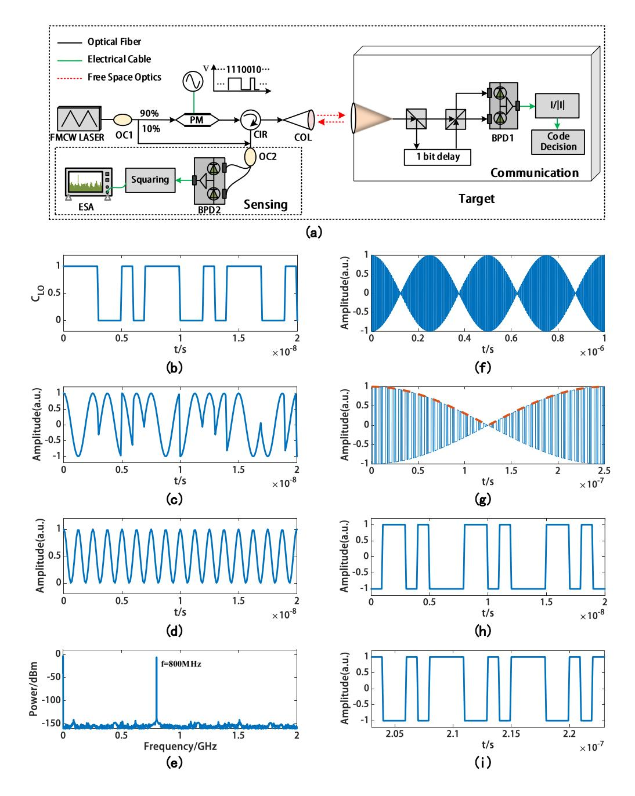
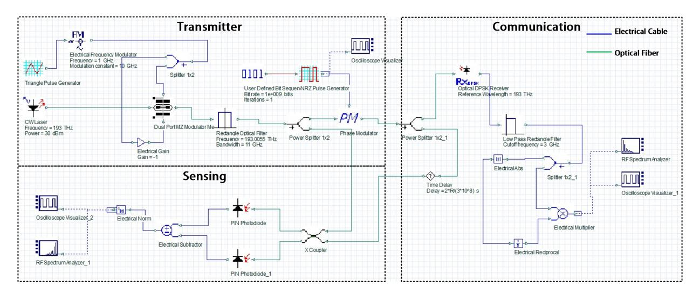
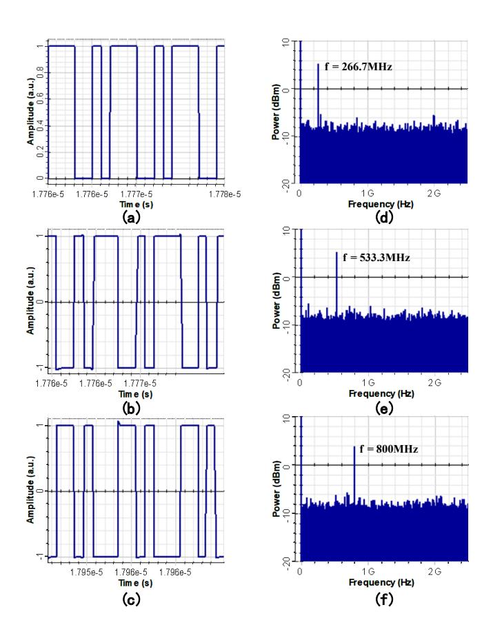

{0}------------------------------------------------

# Phase-Coded FMCW for Optical Integrated Sensing and Communication

Tianzhu Zhang *School of Electronics Peking University* Beijing, China

Zhongji Yan *School of Electronics Peking University* Beijing, China

Anning Pang *School of Electronics Peking University* Beijing, China

Anhong Dang\* *School of Electronics Peking University* Beijing, China \*ahdang@pku.edu.cn

*Abstract*—A scheme for optical integrated sensing and communication using phase coded frequency-modulated continuous wave (PC-FMCW) is proposed. By using phase modulation, communication codes are carried on the FMCW laser radar. Sensing and communication are achieved respectively through coherent detection and self-delayed coherent detection on the sensing side and the communication side. Through theoretical analysis and simulation, we verified the sensing and communication capabilities of this scheme when the code rate is 1 Gbit/s, and the target distances are 10, 20 and 30 meters. Additionally, we confirmed that there is no mutual interference between sensing and communication when the phase shifts of communication codes satisfy 0 and π.

*Index Terms*—LiDAR, integrated sensing and communication, self-delayed coherent detection, phase modulation.

# I. INTRODUCTION

In recent years, sensing and communication systems (S&C) have been evolving towards higher frequency bandwidth, larger antenna arrays, and miniaturization. Consequently, they have become increasingly similar in terms of hardware architecture, channel characteristics, and signal processing. This similarity creates the potential for using wireless infrastructure to achieve sensing [1] [2]. Integrated Sensing and Communication (ISAC) technology leverages the similarities in hardware architecture and signal processing techniques between communication and sensing to achieve spectrum sharing and hardware reuse, and has been widely used in various environmental sensing scenarios, such as vehicular networks, smart homes, remote sensing and environmental monitoring [2]. Currently, there has been extensive research on RF-based ISAC, but relatively less research on optical ISAC.

Optical wireless communication (OWC) has many advantages such as large capacity, high security, and license-free spectrum. Compared to traditional radar, Light detection and range (LiDAR) has higher directionality, higher accuracy, smaller divergence angle, and greater resolution. Additionally, because light is not subject to electromagnetic interference, optical communication and sensing systems are suitable for electromagnetically sensitive environments. Moreover, due to the requirement for line-of-sight (LOS) links in optical communication and sensing, optical signals are difficult to intercept and eavesdrop on, ensuring the security of communication and sensing [3]. Therefore, integrating optical communication and optical sensing into one system is a very promising and meaningful research direction.

Current research schemes on integrated optical sensing and communication include: Pseudo-random code modulation [4], where ranging is achieved through autocorrelation of pseudorandom code and communication codes are loaded onto pseudo-random code through direct spread spectrum method. Pulse sequence sensing and pulse position modulation [5], where the autocorrelation property of pseudo-random codes is used on the sensing side and the Pulse Position Modulation (PPM) principle is used on the communication side. Phase-coded phase-shift LiDAR [6], where spread spectrum communication is combined with DPSK subcarrier intensity modulation for joint waveform design, this allows a single detection signal to perform both ranging and communication functions and effectively extends the unambiguous range of phase-based ranging. The above schemes generally use direct detection, which requires high signal power, easily interfered by environmental light and cannot measure velocity directly. For coherent schemes, Amplitude modulated FMCW (AM-FMCW) scheme is proposed to achieve LiDAR with communication capability [7] [8], where FMCW is used for sensing, and digital baseband signals are carried on the amplitude via intensity modulation.

In this paper, we propose a PC-FMCW scheme. By using phase coding, communication codes are carried on the FMCW LiDAR. communication and sensing are achieved respectively through self-delayed coherent detection and coherent detection. Compared with previous coherent schemes [7] [8], our scheme enjoys better BER through phase coding [9] and better resistance to phase drift introduced by turbulence through self-delayed coherent detection. Besides, by simple coherent detection and signal squaring processing, the influence of communication codes can be eliminated when ranging and velocity measurement.

# II. OPERATION PRINCIPLE

Fig. 1 shows the schematic diagram and post-processing process of PC-FMCW. The up ramp of the FMCW laser shown in Fig. 1(a) can be written as

$$E_{LO} = A_T e^{[j2\pi(f_c + kt/2)t]}$$
 (1)

{1}------------------------------------------------

where AT , fc and k are the amplitude of transmit signal, the frequency of the optical carrier and the slope of sweep frequency. When using the communication code shown in Fig. 1(b) to phase modulate the FMCW laser, the encoded light can be expressed as

$$E_T = A_T e^{j\phi_s(t)} e^{j2\pi(f_c + kt/2)t} \tag{2}$$

where ϕs(t) represents the phase shift corresponding to the communication code. The encoded light is transmitted into free space and partially received at the target for communication, while partially reflected by the target and received at the transmitter for sensing. Here we set the frequency sweep bandwidth B = 10GHz, frequency sweep period T = 2Tupramp = 10us, code rate Rb = 1Gbit/s and distance R = 30m.

## *A. Sensing*

At the transmitter, the echo signal is

Fig. 1. (a) Schematic Diagram of PC-FMCW system. OC: optical coupler, PM: phase modulator, CIR: circulator, COL: collimator, BPD: balanced photodetector, ESA: electronic spectrum analyzer; (b) communication code; (c), (d), (e) The post-processing process on the sensing side; (f), (g), (h), (i) The post-processing process on the communication side.

{2}------------------------------------------------

$$E_R = A_R e^{j\phi_s(t-\tau)} e^{j2\pi(f_c + k(t-\tau)/2)(t-\tau)}$$
(3)

where τ = 2R/c is the round-trip time related to the distance R. After combining the received signal ER and the local oscillator signal ELO, coherent detection is performed. If the phase shifts introduced in the phase encoding stage satisfy ϕs = 0, π, then the balanced detection result is shown in Fig. 1(c), which can be expressed as

$$I_s \propto e^{j\phi_s} \cos(2\pi f_r t + \phi_0) \tag{4}$$

where fr is the difference frequency introduced by the distance delay. Squaring the signal, the corresponding phase code ±1 becomes 1, this means the influence of the communication code is eliminated when sensing. The waveform after squaring is shown in Fig. 1(d), and the corresponding signal expression is

$$I_s^2 \propto \frac{I_{\text{amp}}^2}{2} \cdot (1 + \cos(2 \cdot (2\pi f_r t + \phi_0)))$$
 (5)

By performing Fourier transform on the signal in Fig. 1(d), the spectrum as shown in Fig. 1(e) can be obtained and the corresponding peak frequency fr = 800MHz can be used for ranging. It is easy to know that when the target has a radial velocity in the measurement direction, the Doppler frequency fd corresponding to the radial velocity can also be obtained.

## *B. Communication*

At the target, the self-delayed coherent detection schematic is shown in the communication module in Fig. 1(a). The received signal and 1 bit delayed signal can be expressed as

$$\begin{cases}
E_{i1} = A_c e^{j\phi_s(t')} \exp^{j2\pi(f_c + kt'/2)t'} \\
E_{i2} = A_c e^{j\phi_s(t'-T_b)} \exp^{j2\pi(f_c + k(t'-T_b)/2)(t'-T_b)}
\end{cases} (6)$$

where Tb denotes a code duration and t ′ is used to make a distinction with the time t at the transmitter. After self-delayed coherent detection, the corresponding signal expression can be given as

$$I_c \propto A_c^2 \cos(\phi_s(t') - \phi_s(t' - T_b) + 2\pi k T_b t' + \phi_0')$$
 (7)

According to the corresponding parameters set earlier, the difference frequency fb = kTb = 4MHz can be obtained. Obviously, the carrier frequency fb is much smaller than the phase coding rate Rb , the corresponding waveform as shown in Fig. 1(f) and 1(g) (local zoom). When phase encoding satisfies ϕs = 0, π, Eq. 7 can be simplified to

$$I_c \propto A_c^2 \cos(\phi_s(t') - \phi_s(t' - T_b)) \cos(2\pi f_b t' + \phi_0')$$
 (8)

After eliminating the carrier by using the received signal (solid blue line in Fig. 1(g)) divided by the absolute value of the received signal (dashed orange line in Fig. 1(g)) as shown in Eq. 9. The corresponding code can be recovered by decision.

$$I_c = I_c/|I_c| = \pm \cos(\phi_s(t') - \phi_s(t' - T_b))$$
 (9)

According to the phase shift values and the principle of self-delayed coherent detection, the correspondence between the codes at the transmitter and the decoding codes at the receiver can be obtained as shown in table I.

TABLE I CODING AND DECODING

| Code               | 0 | 1 | 1 | 1 | 0  | 0 | 1 | 0  |
|--------------------|---|---|---|---|----|---|---|----|
| ϕs(t)              | 0 | π | π | π | 0  | 0 | π | 0  |
| ϕs(t) − ϕs(t − TB) |   | π | 0 | 0 | −π | 0 | π | −π |
|                    |   |   |   |   |    |   |   |    |

It should be noted that the code recovery method shown in Eq. 9 also results in code flipping due to the use of absolute values as shown in Fig. 1(h) and Fig. 1(i), which can be solved by differential encoding.

Fig. 2. PC-FMCW simulation system.

{3}------------------------------------------------

### III. SIMULATION AND RESULT

In order to verify the correctness of our proposed scheme, we built a simulation system for the PC-FMCW scheme shown in Fig. 1(a) using OptiSystem 15.

The simulation system is shown in Fig. 2 where the system is divided into three parts, Transmitter, Communication (target) and Sensing. Linear Frequency Modulation (LFM) laser source generated by external modulation principle with corresponding frequency sweep bandwidth B=10GHz and frequency sweep period T=10us. The communication code is 1110010 with a rate of  $R_b=1Gbit/s$ , and the delayed time  $T_b$  in self-coherent detection (optical DPSK receiver) delay is 1ns. The time delay  $\tau=2*R/(3*10^8)$  is introduced to simulate the round trip time of light at distance R.

Fig. 3. Simulation result. (a) communication codes; (b), (c) communication decoding result; (d), (e), (f) sensing signal spectrum with distance of 10m, 20m and 30m.

The communication and sensing simulation results of the PC-FMCW system are given in Fig. 3, where Fig. 3(a) shows the communication code at the transmitter, Fig. 3(b) shows the decoding result at the corresponding time, and Fig. 3(c) shows the decoding result after delaying half a carrier period. It can be seen that the decoding result is consistent with the decoding result shown in Table I. In addition, The code flipping relationship between Fig. 3(b) and Fig. 3(c) also verifies the inadequacy of the code recovery method

shown in Equation 9. Thanks to the application of differential encoding, overall flipping of code does not affect the recovery of information

Figures 3(d), (e), and (f) give the corresponding sensing signal spectrum when the measurement distance R is 10m, 20m, and 30m, respectively. It can be seen that the communication code in the sensing side can be perfectly eliminated by simple squaring of the signals after coherent detection.

### IV. CONCLUSION

In summary, we propose a phase-coded FMCW scheme for optical sensing and communication and simulate the communication and sensing results of the scheme using OptiSystem 15 at a code rate of 1 Gbit/s and distances of 10, 20, and 30 m, respectively. The simulation results show that the scheme achieves the integration of optical sensing and communication without mutual interference.

#### REFERENCES

- A. Liu et al., "A survey on fundamental limits of integrated sensing and communication," IEEE Commun. Surveys Tuts., vol. 24, no. 2, pp. 994–1034, 2nd Ouart., 2022.
- [2] F. Liu et al., "Integrated sensing and communications: Towards dual functional wireless networks for 6G and beyond," IEEE J. Sel. Areas Commun., vol. 40, no. 6, pp. 1728–1767, Jun. 2022.
- [3] N. An, F. Yang, L. Cheng, J. Song and Z. Han, "Free Space Optical Communications for Intelligent Transportation Systems: Potentials and Challenges," IEEE Veh. Technol. Mag., vol. 18, no. 3, pp. 80-90, Sept. 2023.
- [4] Y, Zhang, Y. He, M. Liu, and W. Chen, "Integrated LiDAR of ranging and communication based on pseudorandom code modulation," Infr. Laser Eng., vol. 47, no. 9, Sept. 2018.
- [5] Y. Wen, F. Yang, J. Song, and Z. Han, "Pulse sequence sensing and pulse position modulation for optical integrated sensing and communi cation," IEEE Commun. Lett., vol. 27, no. 6, pp. 1525–1529, Jun. 2023.
- [6] Y. Hai, Y. Luo, C. Liu, and A. Dang, "Remote phase-shift LiDAR with communication," IEEE Trans. Commun., vol. 71, no. 2, pp. 1059–1070, Feb. 2023.
- [7] Z. Xu et al., "Frequency-modulated continuous-wave coherent LiDAR with downlink communications capability," IEEE Photon. Technol. Lett., vol. 32, no. 11, pp. 655–658, Jun. 2020.
- [8] A. V. Marti, T. Zemen and B. Schrenk, "FM-CW LiDAR for Proximity Sensing Applications Integrating an Alignment-Tolerant FSO Data Channel," Proc. Eur. Conf. Opt. Commun. (ECOC), We1F.5, Sept. 2022.
- [9] W. Lim, "BER analysis of coherent free space optical systems with BPSK over gamma-gamma channels," J. Opt. Soc. Korea, vol. 19, no. 3, pp. 237-240, Jun. 2015.