{0}------------------------------------------------

# Single-Ended > 100-km Distributed Vibration Sensor Based on OFDR Using Pearson Correlation Coefficient

Haohan Guo, Kun Liu , Yuanyao Li , Ji Liu, Huafang Wang, Jinqi Deng, Junfeng Jiang , Tiegen Liu , and Zhenyang Ding

*Abstract***—Distributed optical fiber vibration sensor (DOFVS) is an ideal technology for integrated sensing and communication in an optical fiber (ISAC-OF), which can be widely applied to urban structure health monitoring, ocean seismic detection, and pipelines/cable/border safety monitoring. In this article, we present a single-ended** > **100-km distributed vibration sensor based on optical frequencydomain reflectometry (OFDR) by detecting Rayleigh backscattering change that is evaluated by the Pearson correlation coefficient (Pearson-CC). By using a simple internal modula-**

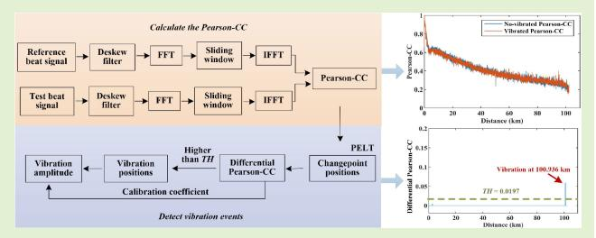

**tion OFDR system without any amplifier, specialty optical fiber, and complex modulation techniques, vibration events can be located by detecting changepoints in step form in the Pearson-CC, and the amplitude of vibration events is proportional to the differential Pearson-CC. A pruned exact linear time (PELT) algorithm is performed in the Pearson-CC along fiber under test (FUT) to detect all changepoints. In experiments, we achieve distributed vibration sensing (DVS) with a range of 100.9 km, a sensing spatial resolution of 15.3 m, and a strain resolution of 868 p**ε**. The differential Pearson-CC and amplitude of the vibration event have a good linear relationship, whose** *R***-square reaches 0.9993. We also successfully located two simultaneous vibration events over 100-km fiber.**

*Index Terms***— Distributed optical fiber vibration sensor (DOFVS), optical frequency-domain reflectometry (OFDR), Pearson correlation coefficient (Pearson-CC), pruned exact linear time (PELT).**

# I. INTRODUCTION

D ISTRIBUTED optical fiber vibration sensor (DOFVS) is an ideal technology for integrated sensing and communication in an optical fiber (ISAC-OF) [1]. Using optical fiber acts as both a transmission medium and a sensing medium [2], DOFVSs can discriminate, localize, and measure vibration events along the entire fiber with high sensitivity and high spatial resolution. Besides, compared with elec-

Received 3 March 2025; accepted 20 March 2025. Date of publication 1 April 2025; date of current version 1 May 2025. This work was supported in part by the National Key Research and Development Program of China under Grant 2023YFF0715700, in part by the National Natural Science Foundation of China under Grant 61975147, and in part by the Special Technical Support Project of China Market Supervision and Administration under Grant 2023MK012. The associate editor coordinating the review of this article and approving it for publication was Dr. Nageswara Lalam. *(Corresponding author: Zhenyang Ding.)*

Haohan Guo, Kun Liu, Ji Liu, Huafang Wang, Jinqi Deng, Junfeng Jiang, Tiegen Liu, and Zhenyang Ding are with the School of Precision Instruments and Opto-Electronics Engineering, Tianjin University, Tianjin 300072, China, also with Tianjin Optical Fiber Sensing Engineering Center, Institute of Optical Fiber Sensing of Tianjin University, Tianjin 300072, China, and also with the Key Laboratory of Opto-Electronics Information Technology (Tianjin University), Ministry of Education, Tianjin 300072, China (e-mail: zyding@tju.edu.cn).

Yuanyao Li is with Tianjin Institute of Metrological Supervision and Testing, Tianjin 300192, China.

Digital Object Identifier 10.1109/JSEN.2025.3554542

tronic sensors, it has the advantages of anti-electromagnetic interference, corrosion resistance, and no need for power supply, which makes it widely applied in ocean seismic detection [3], [4], perimeter intrusion detection, oil/gas pipeline monitoring [5], [6], electric cable monitoring [7], and so on. In recent years, DOFVSs have been developing vigorously, and ultralong-distance DOFVSs over 100 km are gradually becoming a research hotspot which includes forward interferometer and backscattering-based technologies, as shown in Table I.

Forward interferometers utilize the transmission of light in the forward direction for sensing, whose structures commonly include a Mach–Zehnder interferometer (MZI) [8], a Michelson interferometer (MI) [9], and a Sagnac interferometer (SI) [10]. Moreover, merged Michelson–SI (M–SI) [11] and the hybrid structure of 8-OTDR and MZI [12] are also reported. Compared with backscattering, the intensity of forward-transmitted light is stronger, making it easier to achieve long-distance DOFVSs but difficult to identify multiple vibration events and a dual-ended system limits its application in existing optical fiber communication networks.

Backscattering-based sensors utilize Rayleigh backscattering in fiber under test (FUT) for vibration sensing, mainly including phase-sensitive optical time-domain

{1}------------------------------------------------

TABLE I PERFORMANCE SUMMARY OF RECENT LONG-DISTANCE DOFVSs

| System                 | Method                                                | Ref. | Distance (single span) (km) | Spatial resolution (m) | Multi-events verification | Strain resolution verification | Single/Dual- ended |
|------------------------|-------------------------------------------------------|------|--------------------------------|------------------------|---------------------------|--------------------------------|-----------------------|
| Forward interferometer | MZI                                                   | [8]  | 101                            | 11.12                  |                           |                                | Dual                  |
|                        | SI                                                    | [10] | 150                            | 30                     |                           |                                | Dual                  |
|                        | M-SI                                                  | [11] | 120                            | 35                     |                           |                                | Dual                  |
| φ-OTDR                 | Distributed amplification                          | [6]  | 131.5                          | 8                      |                           |                                | Dual                  |
|                        |                                                       | [14] | 125                            | 10                     |                           |                                | Dual                  |
|                        |                                                       | [15] | 125                            | 10                     |                           |                                | Dual                  |
|                        |                                                       | [16] | 204                            | 2                      | Yes                       | 287 pε/√Hz                     | Dual                  |
|                        |                                                       | [17] | 205                            | 15                     | Yes                       |                                | Dual                  |
|                        |                                                       | [18] | 208                            |                        |                           |                                | Dual                  |
|                        |                                                       | [19] | 124                            | 20                     | Yes                       |                                | Dual                  |
|                        |                                                       | [20] | 150.62                         | 28.8                   |                           |                                | Dual                  |
|                        |                                                       | [21] | 175                            | 25                     | Yes                       |                                | Dual                  |
|                        | Multi-span relay amplification                  | [22] | 100 (48)                       | 2.6                    |                           | 100 nε                         | Dual                  |
|                        |                                                       | [23] | 130 (84)                       | 20                     |                           |                                | Dual                  |
|                        |                                                       | [24] | 151 (50)                       |                        |                           |                                | Dual                  |
|                        |                                                       | [25] | 246 (49.4)                     |                        | Yes                       |                                | Dual                  |
|                        |                                                       | [26] | 300 (50.2)                     | 20                     | Yes                       | 51.8 pε/√Hz                    | Dual                  |
|                        |                                                       | [2]  | 1007 (79.7)                    | 20                     |                           | 100 pε/√Hz                     | Dual                  |
|                        | Enhanced scattering fiber                             | [29] | 195                            |                        |                           | 59.9 pε/√Hz                    | Single                |
|                        |                                                       | [30] | 99.4                           | 10                     |                           | 33 pε/√Hz                      | Single                |
|                        |                                                       | [31] | 101.64                         | 10                     | Yes                       |                                | Single                |
|                        | Pattern recognition                                   | [32] | 80                             |                        | Yes                       |                                | Single                |
|                        | Improved hardware                                  | [33] | 102.7                          | 15                     | Yes                       |                                | Single                |
|                        |                                                       | [34] | 103                            | 9.3                    |                           | 97 pε/√Hz                      | Single                |
|                        |                                                       | [35] | 100                            | 10                     |                           | 200 pε/√Hz                     | Single                |
| OFDR                   | Distributed amplification                             | [38] | 108                            | 5                      |                           | 220 pε/√Hz                     | Dual                  |
|                        | Enhanced                                              | [39] | 101                            | 1.4                    | Yes                       |                                | Single                |
|                        | scattering fiber                                      | [36] | 100                            | 100                    | Yes                       |                                | Single                |
|                        | Relay amplification                                   | [37] | 220 (110.9)                    | 20.4                   |                           |                                | Dual                  |
|                        | Internal modulation and Pearson-CC algorithm | Ours | 100                            | 15                     | Yes                       | 868 рε                         | Single                |

reflectometry (ϕ-OTDR) and optical frequency-domain reflectometry (OFDR). There are many methods for vibration sensing in ϕ-OTDR to further sensing distance. First, the commonly used method is pumping distributed amplifications, such as Raman amplification [6], [13], [14], [15], [16], [17], [18], Brillouin amplification [19], or their combination [20], [21]. These amplifiers are all bi-directional amplifiers, which limits their application in existing optical fiber communication networks. Second, multispan relay amplifications are installed to increase the intensity of signal light along ultralong-FUT [2], [22], [23], [24], [25], [26]. However, the single-span sensing distance is generally tens of kilometers and cannot meet the needs of existing optical communication networks. The repeaterless sensing distance must exceed 100 km to meet the current requirements of ISAC-OF [27], [28]. Third, some specialty optical fibers such as enhanced scattering fiber [29] and weak FBGs [30], [31] are used to improve the signal-to-noise ratio (SNR) in FUT. The vibration waveform can be correctly recovered using specialty optical fiber with high strain resolution up to the pε lever, but these specialty optical fibers are high cost. More seriously, the existing optical fiber communication network did not have enhanced scattering fiber or weak FBG deployments. Fourth, in recent years, pattern recognition [32] has been used for vibration demodulation and has the potential to identify multiple vibration events in a single-ended system. However, it requires large datasets to train the models and the performance depends on prior conditions, resulting in the training models may not apply to various vibration events in real environments. Fifth, to solve these problems, complex single-ended OTDR systems are designed for vibration detection. Uyar et al. [33] located multiple vibration events along 102.7-km FUT, using two cascaded acousto-optic modulators to generate optical pulses with a high extinction ratio. Xiong et al. [34] used sideband modulation technology based on IQ modulation and 90◦ optical hybrid and multiplexed the positive and negative frequency to break the inherent tradeoff between sensing distance and the scan rate. They recovered 

{2}------------------------------------------------

vibration waveform at 103-km fiber, with 97-pε/ √ Hz strain resolution and 9.3-m spatial resolution [34]. Piñeiro et al. [35] applied pulse compression to coherent OTDR and recovered vibration waveform in 100 km with a 10-m spatial resolution and a 200-pε/ √ Hz strain resolution. However, the increase in hardware equipment leads to an increase in system cost and has a limited effect on the improvement of vibration signal quality. Moreover, DOFVSs and optical communication use the same fiber core in different wavelengths. The laser output in these DOFVS systems is amplified via an EDFA or Raman amplification and high-power pulse light will generate a higher nonlinear effect in optical fiber, influencing signal transmission in optical communication networks.

Another long-distance DOFVS is based on OFDR. Traditional OFDR systems are single-ended based on external modulation, using a single sideband with a suppressed carrier (SSB-SC) modulator and a narrow linewidth fiber laser as a tunable laser source (TLS), which is high-cost and requiring complex hardware to be readjustment before each measurement. The methods for OFDR to extend sensing distance are similar to ϕ-OTDR. Using weak reflection generated by FBG, Zhang et al. [36] recovered multipoint vibration events over 100 km. However, it is no longer suitable for existing optical communication networks. By relay amplifier, Qin et al. [37] successfully located vibration events up to 220 km, and the single-span distance reached 110.9 km. However, the strain resolution is not mentioned and multiple simultaneous vibration events are not verified. Besides, the time-gated digital OFDR (TGD-OFDR) or gated OFDR (G-OFDR) as a branch of OFDR can recover the waveform of vibration events. However, these methods also need a dual-ended amplification structure [38] or construct weak reflections [39] to enhance backscattering to detect vibration events >100 km.

Rayleigh backscattering can act as an FUT "fingerprint" in OFDR. The vibration events on an FUT give rise to a variation in the "fingerprint" of FUT. In our previous works, we use a cross correlation similarity analysis (CCSA) to evaluate the variation of two separated measured local Rayleigh backscattering spectra (RBSs), the location and amplitude of vibration events at 40 km are acquired [41]. We also combine the CCSA and "V"-shaped characteristics in Rayleigh backscattering, locating multiple vibration events at 92 km [42]. We achieve a >100-km DOFVS based on the internal modulation OFDR and CCSA method without any optical amplifier [43]. However, the CCSA method cannot prove that the nonsimilarity has a linear relationship with strain caused by vibration events. Meantime, the strain resolution is also not evaluated. It is urgent to find a similarity evaluation index to quantitatively analyze the amplitude of vibration events.

In this article, we present a simple and effective method to demodulate vibration events by detecting Rayleigh backscattering change that is evaluated by the Pearson correlation coefficient (Pearson-CC). The proposed DOFVS system is a simple single-ended internal modulation OFDR system without any optical amplifier and sensitized fiber. A vibration event >100 km can be located by detecting changepoints in step form in the Pearson-CC, and the amplitude of the vibration event is proportional to the differential Pearson-CC. A pruned exact linear time (PELT) algorithm is performed in the Pearson-CC along FUT to detect all changepoints. In experiments, we achieve distributed vibration sensing (DVS) with a range of 100.9 km, a sensing spatial resolution of 15 m, and a strain resolution of 868 pε. The differential Pearson-CC and amplitude of the vibration event have a good linear relationship, whose *R*-square reaches 0.9993. We also successfully located two simultaneous vibration events over 100-km fiber.

## II. PRINCIPLE

# *A. Basic Theory of OFDR*

In OFDR, local oscillator reference light interferes with the signal light composed of Rayleigh backscattering and Fresnel reflection to form a beat signal. We assume that FUT can be regarded as *M* scattering elements, and the beat signal can be expressed as

$$I(t) = \sum_{i=1}^{M} 2E_0^2 \sqrt{R(\tau_{z_i})} \cos\left(2\pi \gamma \tau_{z_i} t + \varphi_{z_i} + \varphi_n\right)$$
 (1)

where *E*0 is the initial amplitude of light, *zi* is the position of the *i*th scattering elements, τ*zi* is the time delay difference between the signal light at *zi* and the local oscillator reference light, *R* is the reflectivity, γ is the optical frequency tuning speed, ϕ*zi* is the initial phase of the beat signal at *zi* , and ϕ*n* is the nonlinear phase noise, which can be mostly eliminated by the deskew filter, so we will not consider it in the following part.

We slide the window on the RBS and perform IFFT on the local RBS from each window. The reference beat signal without vibration from the window where *zi* located can be expressed as

$$I_{\text{ref}}(t) = 2E_0^2 \sqrt{R(\tau_{z_i})} \cos\left(2\pi \gamma \tau_{z_i} t + \varphi_{z_i}\right) * \frac{N}{2\pi} \text{sinc}(Nt)$$
(2)

where *N* is the number of data points of local RBS signals in each window and the sinc function is the inverse Fourier transform of a rectangular window in the spatial domain. The sensing spatial resolution 1*x* can be calculated by

$$\Delta x = N \Delta z = \frac{Nc}{2n\Delta F} \tag{3}$$

where *c* is the speed of light in vacuum, *n* is the effective refractive index of the fiber, and 1*F* is the tuning range of the TLS. We regard the length of 1*x* as a sample window and assume ε(*t*) as the vibration, which is manifested as a timevarying strain. The test beat signal with vibration ε(*t*) from the window where *zi* located can be expressed as

$$I_{\text{test}}(t) = 2E_0^2 \sqrt{R(\tau_{z_i})} \cos\left(2\pi \gamma \tau_{z_i} t + \varphi_{z_i} + \varphi_{\varepsilon}(l_i, t)\right) * \frac{N}{2\pi} \text{sinc}(Nt)$$
(4)

where ϕε(*li*, *t*) is an additional phase term induced by ε(*t*), which can be expressed as [38]

$$\varphi_{\varepsilon}(l_i, t) = 2k \left( n - \frac{1}{2} n^3 p_e \right) \varepsilon(t) l_i = \frac{\varepsilon(t) l_i}{K}$$
(5)

{3}------------------------------------------------

where k is the wavenumber,  $p_e$  is the effective photograph elastic coefficient, and  $l_i$  is the distance between the scattering elements  $z_i$  and the start point of the vibration event. When the wavelength is 1550 nm, the refractive index is 1.46, and the  $p_e$  of glass is 0.22, the coefficient K is calculated to be 110.36 n $\epsilon$ ·m/rad. We perform subsequent processes in the optical frequency domain rather than the spatial domain because the spectrum in the former contains the initial phase information of the beat signal. This initial phase is the effective term that carries vibration information.

### B. Theory of the Pearson-CC

The essence of vibration demodulation in OFDR is to detect local RBS variation between the reference no-vibrated signal and the test vibrated signal, which can be evaluated by the Pearson-CC. We assume that there are two n-point discrete sequences  $X_i$  and  $Y_i$ , the mean values of them are, respectively,  $\bar{X}$  and  $\bar{Y}$ , and the standard deviation of them are, respectively,  $\sigma_X$  and  $\sigma_Y$ . The Pearson-CC represented by R is defined as [44]

$$R = \frac{\sum_{i=1}^{n} (X_i - \bar{X})(Y_i - \bar{Y})}{\sigma_X \sigma_Y}.$$
 (6)

We will verify by numerical simulation in Section III that a vibration event can cause a decrease in the Pearson-CC, and the extent of the decrease is proportional to the amplitude of the vibration event. Based on this, we can demodulate the position and the amplitude information of the vibration event.

### C. Theory of PELT

We use the PELT algorithm [45] for optimal segmentation to locate the changepoints in the Pearson-CC so as to locate the vibration events. The PELT algorithm is based on dynamic programming, through segmentation to minimize a cost function, thereby obtaining the optimal number and positions of changepoints. The PELT algorithm has a high segmentation accuracy and its computational cost has a linear relationship with the number of observation points, making it suitable for processing large volumes of data.

We assume that the sequence of the Pearson-CC is given by  $R_{1:N} = (R_1, R_2, ..., R_N)$ . The model may have a number of changepoints, m, with their positions  $z_{1:m} = (z_1, z_2, ..., z_m)$ . We define  $z_0 = 0$  and  $z_{m+1} = N$ . Let F(s) denote the minimization cost for data  $R_{1:s}$  and  $z_s$  be the set of possible vectors of changepoints. F(s) follows that [45]:

$$F(s) = \min_{z \in z_s} \left\{ \sum_{i=1}^{m+1} \left[ C(R_{(z_{i-1}+1):z_i}) + p \right] \right\}$$

$$= \min_{y} \left\{ \min_{z \in z_y} \sum_{i=1}^{m} \left[ C(R_{(z_{i-1}+1):z_i}) + p \right] + C(R_{(y+1):N}) + p \right\}$$

$$= \min_{y} \left\{ F(y) + C(R_{(y+1):N}) + p \right\}$$
(7)

where p is the penalty to guard against overfitting. C is the cost function for a segment. Here, we use the residual sum

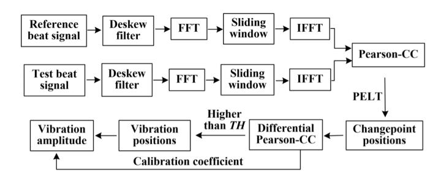

Fig. 1. Flowchart of algorithmic processing to demodulate vibration events.

of squares (RSSs) to calculate

$$C(R_{(z_{i-1}+1):z_i}) = \sum_{j=z_{i-1}+1}^{z_i} (R_j - \hat{R}_j)^2$$
 (8)

where  $\hat{R}_j$  is the predicted value obtained from linear regression. Equation (7) provides a recursion that gives the minimal cost for data  $R_{1:s}$  in terms of the minimal cost for data  $R_{1:y}$  for y < s. This recursion can be solved, in turn, for s = 1,  $2, \ldots, N$ . The pruning condition is as follows:

$$F(y) + C(R_{(y+1);s}) + p \ge F(s)$$
 (9)

holds, y can never be the optimal changepoint, so we remove y from the next iteration. When the iteration is over, we can obtain the optimal changepoints.

According to (7) and (8), the PELT algorithm is more sensitive to the overall trend change caused by vibration events than several jump points caused by random noise in Pearson-CC sequences. Besides, the setting of *p* prevents infinite segmentation and thus avoids noise being judged as a changepoint. The PELT algorithm can demonstrate good noise resistance for changepoint detection in Pearson-CC sequences.

### D. Steps of the Vibration Demodulation Method

We perform a series of algorithmic processes to demodulate vibration events on the FUT trace in OFDR as shown in Fig. 1. First, we, respectively, compensate for the nonlinear phase in the reference signal and the test beat signal using a deskew filter [46] and perform FFT to obtain the RBS. Second, we slide the window in the RBS to obtain the local RBS at each position and perform IFFT to convert it into the optical frequency domain. Third, the Pearson-CC between the reference signal and the test signal in each window is calculated based on (6). The calculation is performed in the optical frequency domain rather than the spatial domain because the spectrum in the optical frequency domain contains the initial phase term that carries vibration information. Fourth, the PELT algorithm is applied to the Pearson-CC sequence to detect changepoints. The detailed algorithmic process of PELT will be explained in Section II-E. Besides vibration events, external environment noise, the TLS's phase noise, polarization or coherent fading may also cause fluctuations in the Pearson-CC and result in changepoints. The relative change in the Pearson-CC from these noise factors is small and continuous. Whereas, large and steps change in the Pearson-CC is caused by vibration events. We can distinguish vibration from noise based on this criterion.

{4}------------------------------------------------

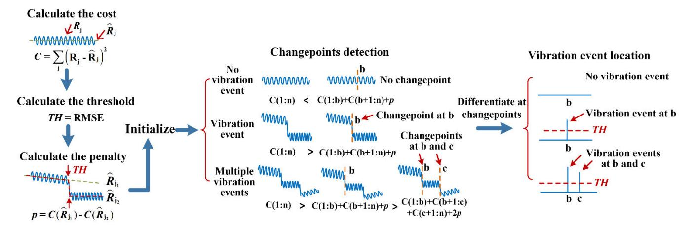

Fig. 2. Flowchart of PELT processing for changepoint detection.

Fifth, the differential Pearson-CC is calculated in each changepoint. Then, while comparing the differential Pearson-CC with the threshold which is expressed as TH, positions higher than TH are identified as vibration positions. The value of TH is defined by background noise in the Pearson-CC which will be discussed in detail in Section II-E. Finally, according to the calibration coefficient, we can determine the amplitude of vibration events from the differential Pearson-CC.

### *E. Steps of PELT*

According to the analysis in Section II-C, the principle of the PELT algorithm is to segment the Pearson-CC sequence to minimize the cost function. Fig. 2 shows the PELT processing steps for changepoint detection and vibration events location. The cost function of a segment is defined as RSS according to (8). There inevitably exists random noise in the Pearson-CC, if the vibrated-induced step changes lower than the noise, that vibration event will not be identified. To distinguish the vibration event from noise, we set TH as the threshold for the differential Pearson-CC, the vibration event leading to the Pearson-CC variation higher than noise can be identified. TH is defined as the RMSE of the Pearson-CC, it is commonly used to characterize the noise level and can be calculated by

$$TH = \sqrt{\frac{\Delta x}{L} \sum (R_j - \hat{R}_j)^2}$$
 (10)

where *Rj* is the *j*th actual value of the Pearson-CC and *R*ˆ *j* is the *j*th predicted value obtained from regression fitting of the Pearson-CC. *p* is another important parameter in PELT, which decides the sensitivity of changepoint detection. To detect the changepoint where the differential Pearson-CC is TH and avoid excessive nonvibrated positions being classified as changepoints, *p* is defined as: when the variation of the Pearson-CC is TH, the cost difference between that position being and not being identified as a changepoint. *p* can approximately be calculated by

$$p = TH^2 \Delta L / \Delta x \tag{11}$$

where 1*L* is the length of reference tail fiber. It should be noted that PELT requires a length of tail fiber as a reference for changepoint detection. Then, we initialize the iteration conditions and set *F*(0) = −*p* in (7). The optimal segmentation can be obtained through iteration based on (7), thus the changepoints are recorded. As shown in Fig. 2, in the cases of no vibration event, the cost of segmenting the sequence at each point is higher than the overall cost of not segmenting it. Thus, no changepoint is detected. Whereas, in the cases of a single vibration event we assume at "b," the minimum cost occurs when the sequence is segmented into two parts at "b." Thus, only "b" is detected as a changepoint. Similarly, in the cases of multiple vibration events we assume at "b" and "c," the minimum cost occurs when the sequence is divided into three segments: from start point to "b," from "b" to "c," and from "c" to the endpoint. Thus, "b" and "c" are detected as changepoints. Since *p* in (11) is relative to 1*L*, setting a fixed value may lead to different resolutions of changepoint detection along FUT. Therefore, after changepoint detection, we calculate differential Pearson-CC at all changepoints and compare it with TH, only the position higher than TH be identified as a vibration event.

The strain resolution *Sr* depends on the noise level [16], [22], [26], [30], [34], [38]. Since TH is set to distinguish vibration events from noise, *Sr* largely depends on TH. *Sr* can be expressed as

$$S_r = \frac{\mathrm{TH}}{\alpha} \tag{12}$$

where α is the calibration coefficient of the amplitude of the vibration event and the differential Pearson-CC, which will be acquired through experiments in Section IV-C.

### III. NUMERICAL SIMULATION

We simulate to determine the relationship between the Pearson-CC and the amplitude of vibration events. According to the experimental parameters, we set the simulation parameters as follows: the tuning rate of the TLS is 84 GHz/s, the effective tuning range is 6.72 GHz, and the fiber length applied vibration is 10 m. The vibration event is set to a sin waveform with an amplitude of 0–100 nε in steps of 2 nε. We set 1*x* to 15 and 10 m, respectively, the simulation results of the Pearson-CC variation with the amplitude of vibration event are, respectively, shown in Fig. 3(a) and (b). The Pearson-CC remains 1 when no vibration event is applied and decreases

{5}------------------------------------------------

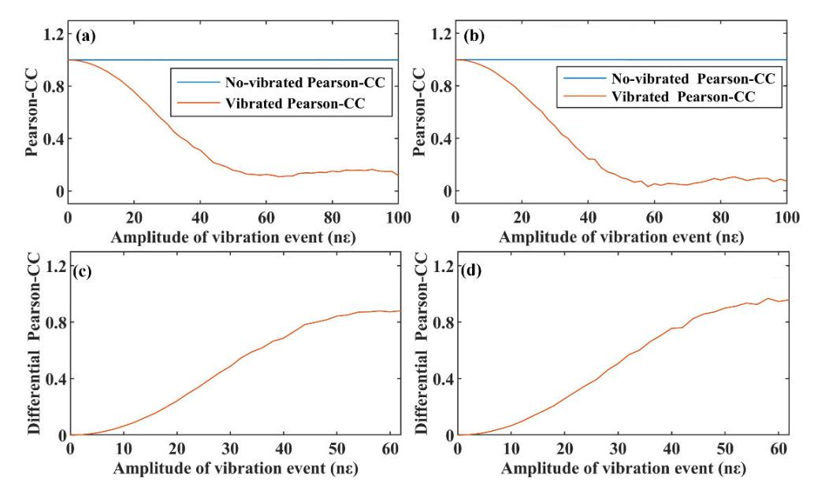

Fig. 3. (a) Pearson-CC variation with the amplitude of vibration events when ∆*x* = 15 m. (b) Pearson-CC variation with the amplitude of vibration events when ∆*x* = 10 m. (c) Differential Pearson-CC variation with the amplitude of vibration events when ∆*x* = 15 m. (d) Differential Pearson-CC variation with the amplitude of vibration events when ∆*x* = 10 m.

monotonically in a certain range with the amplitude of the vibration event when the vibration is applied. The monotone interval is limited by the maximum additional phase term induced by the vibration event. The amplitude of the vibration event can be determined only when the maximum additional phase term according to (5) is within 2π, which can be expressed as

$$\varphi_{\varepsilon}(l_{\rm s}, t) = \frac{\varepsilon(t)l_{\rm s}}{K} < 2\pi$$
(13)

where *l*s is the length of the strain area caused by the vibration event. From (13), the measurable range of strain is influenced by *l*s , and the upper limit of the strain is 62 nε when *K* = 110.36 nε ·m/rad and *l*s = 10 m in numerical simulation. Besides, the Pearson-CC in Fig. 3(a) decreases to 0.15 not 0 when the amplitude of the vibration event is increased to 62 nε. That is because we only set a vibration event with *l*s = 10 m in a sample window with 1*x* = 15 m, which is consistent with the experimental conditions. The data in that sample window still contains a part of a no-vibrated signal, the Pearson-CC between the reference and test signals does not decrease to 0. In contrast, the Pearson-CC in Fig. 3(b) decreases close to 0 when the vibration amplitude is increased to 62 nε. The reason is that the vibration event with an *l*s = 10 m covers the entire sample window with 1*x* = 10 m. However, the Pearson-CC in Fig. 3(b) is close to 0 rather than being exactly 0. That is because the value of RBS we set is random, and the Pearson-CC at each vibration amplitude is predicted by the mean value of observation, which inevitably introduces statistical error. By detecting the decreased position, we can locate the vibration event. The dynamic range of the Pearson-CC 1*R* determines the measurable amplitude level and number of vibration events, which can be expressed as

$$\Delta R = \alpha \sum_{q} \varepsilon_{q} \tag{14}$$

where α is the calibration coefficient of the amplitude of the vibration event and the differential Pearson-CC, which will be calculated in Section IV-C. *q* is the measurable number of vibration events. ε*q* is the amplitude of the *q*th vibration events. If the previous vibration event causes the Pearson-CC to decrease to the minimum value, it will no longer have the ability to measure the next vibration event.

Then, we calculate the reduction of the Pearson-CC by differentiating the Pearson-CC in Fig. 3(a) and (b), and the results are shown in Fig. 3(c) and (d). The differential Pearson-CC and the amplitude of the vibration event have an approximately linear proportional relationship when the strain variation caused by the vibration event is at 0∼62 nε, and the corresponding differential Pearson-CC is, respectively, at the range of 0–0.85 and 0∼1 when 1*x* = 15 m and 1*x* = 10 m. Based on the numerical simulation and analysis, we can demodulate the amplitude of the vibration event after calibrating the amplitude of the vibration event and differential Pearson-CC.

# IV. EXPERIMENT AND DISCUSSION

# *A. OFDR System Configuration*

We briefly describe the internal modulation OFDR system [43], whose configuration is shown in Fig. 4. The main interferometer is a modified MZI. The auxiliary interferometer is an unbalanced MI that is used to obtain the TLS optical frequency for nonlinear phase compensation by a deskew filter. A silicon-based photonic-chip laser is selected as the laser source, with a narrow linewidth of less than 1 kHz at a center wavelength of 1550 nm and an optical power of about 8 mW. The laser is connected externally to an arbitrary waveform generator (AWG). The TLS is achieved by controlling the external cavity temperature of the laser, which is driven by a linear voltage waveform generated by the AWG. The tuning speed is about 84 GHz/s, and the

{6}------------------------------------------------

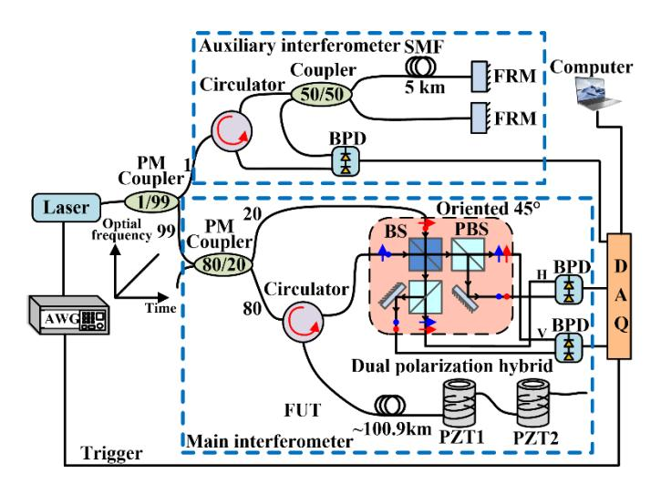

Fig. 4. OFDR system configuration. The main interferometer is a modified fiber-based MZI. The auxiliary interferometer is an unbalanced MI with the 5-km reference delay fiber. AWG is the arbitrary waveform generator; PM coupler is the polarization maintaining coupler; FRM is the Faraday rotating mirror; BS is the polarization-insensitive beam splitter; PBS is the polarization beam splitter; BPD is the balanced photodetector; DAQ is data acquisition; FUT is fiber under test; PZT is the piezoelectric transducer. The AWG is used to generate a linear voltage curve, which induces temperature changes in the laser, thereby producing a tunable laser. The PZTs are used to excite a mechanical vibration event on fiber.

effective tuning range is about 6.72 GHz. The sweep frequency of the TLS in the proposed OFDR system is about 4 Hz. The sampling rate of data acquisition (DAQ) is 200 MS/s, and the number of sampling points is 16 MS. DAQ selects the internal clock and the external trigger generated from AWG start. The delay fiber is 5 km in the auxiliary interferometer. Two faraday rotating mirrors (FRMs) in an auxiliary interferometer, a polarization-insensitive beam splitter (BS), and a polarization BS (PBS) in the main interferometer are used to suppress the polarization fading effect. FUT is a >100-km single-mode fiber (SMF), which does not contain any optical amplification components. FUT contains two piezoelectric transducers (PZTs) at about 100.9 and 101.8 km. Each PZT is wrapped with 10-m SMF to excite a mechanical vibration. We calibrated the PZTs with an MI based on a 3 × 3 coupler. The voltage-induced strain coefficients of PZT1 and PZT2 are, respectively, 3.26 and 3.11 nε/V.

### *B. Vibration Event Localization*

To verify the effectiveness of the proposed method, we carry out a series of experiments using the OFDR system shown in Fig. 4 and following the processing steps shown in Fig. 1. The PZT1 is applied by a rectangular pulse to simulate a vibration event, with a pulsewidth of 60 µs and a period of 1 ms. The applied waveform is a rectangular pulse that contains many frequency components and can better resemble actual intrusion events. We select 60 µs as the pulsewidth because it corresponds to the bandwidth of approximately 17 kHz, which effectively avoids the PZT's resonance frequency of 19 kHz. We select 1 ms as the pulse period because, at lower frequencies, the PZT can no longer respond effectively.

First, we apply a pulse voltage of 0.8 V and the corresponding amplitude of the vibration event is 2.608 nε

according to the strain coefficients of PZT1. After measuring the reference beat signal and the test beat signal, we use a deskew filter to compensate for the nonlinear tuning effect of the TLS and then perform FFT to transform them into a spatial domain. Rayleigh backscattering signal of the entire FUT in the spatial domain is shown in Fig. 5(a). The SNR at the end of 102.42-km FUT is about 10 dB. Balancing the sensing spatial resolution and SNR in each sample window, we select *N* = 1000 and segment the spatial domain using a sliding window with 1000 points to obtain local RBS. According to (3), 1*z* is 0.0153 m when 1*F* is set to 6.72 GHz and the sensing spatial resolution is 15.3 m when *N* is set to 1000. The local RBS in each window is then transformed back to the optical frequency domain using IFFT. Then, we sequentially calculate the Pearson-CC between the reference and test signals for each local RBS according to (6). The distributed Pearson-CC is shown in Fig. 5(b). Fig. 5(d) is the local zoomin for Fig. 5(b). There is significant random noise in the Pearson-CC, the vibrated-induced step changes lower than the noise will not be identified. We have defined the parameter TH to characterize the noise level in the Pearson-CC, and the calculated TH = 0.0197 when *L* = 102.42 km and 1*x* = 15.3 m according to (10). Compared with the no-vibrated Pearson-CC, the vibrated Pearson-CC undergoes a stairstep change at the position of the vibration event. We use the PELT algorithm to detect changepoints in the Pearson-CC. According to (11), the calculated *p* = 0.06, when TH = 0.0197, 1*L* = 2.42 km, and 1*x* = 15.3 m. By setting *p* appropriately, we aim to find the optimal number of changepoints that ensures strain resolution to be recognized as a changepoint while avoiding noise being classified as changepoints. The number of iterations is set to be the data number of the Pearson-CC. In each iteration, the point satisfying the pruning condition in (9) is pruned to improve the efficiency of iteration. When iteration is over, all changepoints are recorded and marked in Fig. 5(b). Benefiting from the PELT algorithm which is more sensitive to overall changes compared to several noise points and the setting of parameter *p*, the random noise is not recognized as changepoints. Since the sensitivity of changepoint detection is different along FUT, some changepoints with changes lower than TH may also be detected by setting a fixed *p*. To eliminate the changepoints where Pearson-CC variation is lower than TH, we differentiate the Pearson-CC at the marked positions, resulting in Fig. 5(c). Comparing the differential Pearson-CC with TH, the changepoints where the differential Pearson-CC is higher than 0.0197 is determined as a vibration event. The vibration event caused by PZT1 occurs at 100.936 km, which is consistent with the PZT1 we have placed.

According to the analysis in Section III, the Pearson-CC along FUT should remain 1 when there is no vibration applied. However, the Pearson-CC is lower than 1 and decreases with distance in the experiment as shown in Fig. 5(b). This decrease is caused by multiple reasons. First, the similarity of local RBS decreases with the sensing distance due to the phase noise of the TLS. Second, the transmission loss causes the SNR to decrease along FUT. Besides, the first changepoints marked at 5 km in Fig. 5(b) have an obvious inflection point. The reason is that the delay fiber in the

{7}------------------------------------------------

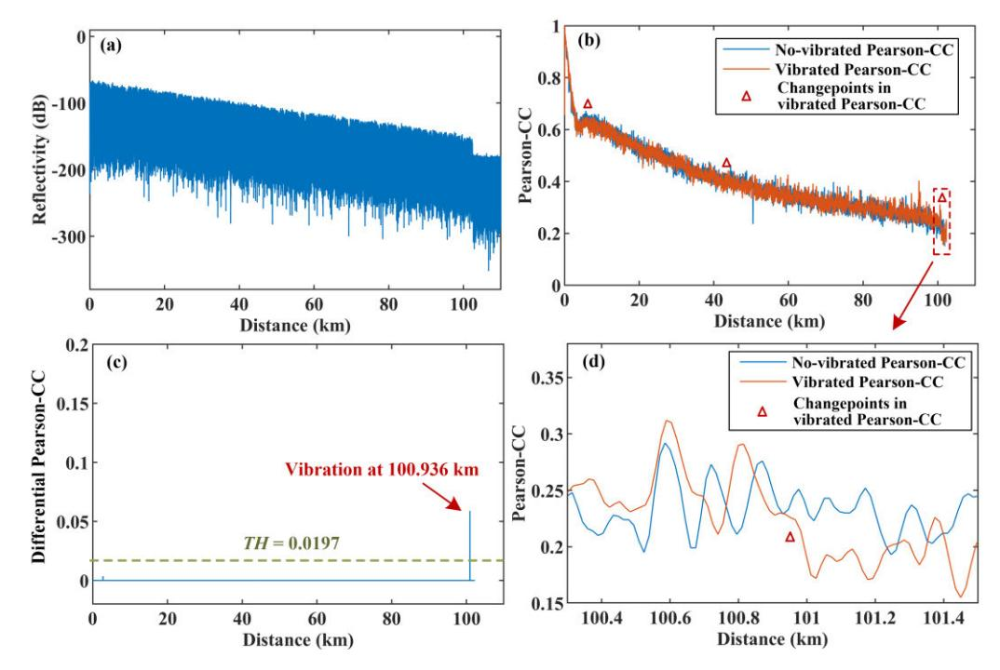

Fig. 5. (a) Rayleigh backscattering of 102.42-km FUT in the spatial domain. (b) Measured distributed Pearson-CC, all changepoints in the vibrated Pearson-CC are marked by PELT. (c) Differential Pearson-CC in the positions of changepoints. The arrow indicates the position above the threshold. (d) Local zoom-in for (b).

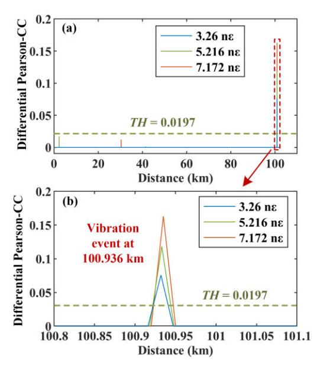

Fig. 6. (a) Differential Pearson-CC for different vibration events with an amplitude of 3.26, 5.216, and 7.172 nε. The dotted box marks the positions above the threshold. (b) Local zoom-in for (a).

auxiliary interferometer is 5 km and the compensation effect of the nonlinear phase is the best within 5 km. The nonlinear phase noise will increase along with the sensing distance increasing. However, the no-vibrated Pearson-CC is changed as a slow oscillating form for these reasons above, while the vibration-induced Pearson-CC is changed as stairstep form as shown in Fig. 5(d). By setting TH for the differential Pearson-CC, we can still correctly distinguish vibration events from others.

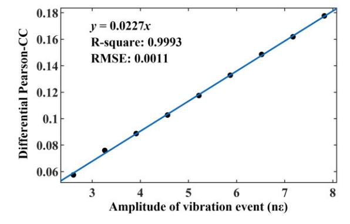

Fig. 7. Calibration curve of the amplitude of the vibration event and the differential Pearson-CC.

Second, we change the pulse voltage applied to PZT1 to 1.0, 1.6, and 2.2 V, the amplitude of the vibration event is, respectively, 3.26, 5.216, and 7.172 nε. The other processing steps are the same as above. The calculated differential Pearson-CC is shown in Fig. 6. Fig. 6(b) is the local zoom-in for Fig. 6(a). The differential Pearson-CC in three groups at 100.936 km is higher than TH, which illustrates vibration events occur at 100.936 km. In addition to the peaks at 100.936 km, there are also several small peaks appearing in the differential Pearson-CC as shown in Figs. 5(c) and 6(a), they will not have a negative impact on the location of the vibration event, as long as the amplitude of vibration events is higher than the strain resolution. Because we have set TH for the differential Pearson-CC to distinguish whether these peaks are caused by noise or vibration events. The values of these peaks are lower than TH and they are identified as noise. Besides, the differential Pearson-CC increases with the

{8}------------------------------------------------

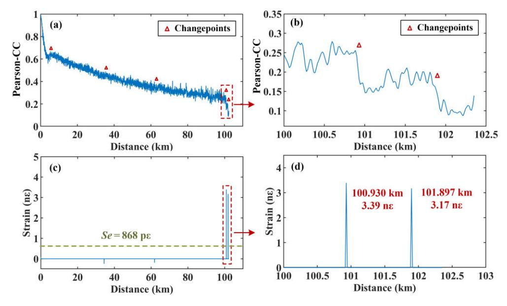

Fig. 8. (a) Measured distributed Pearson-CC, all changepoints are marked by PELT. (b) Local zoom-in for (a). (c) Vibration demodulation results. The strain resolution is 868 pε. The dotted box marks the position above strain resolution. (d) Local zoom-in for (c).

increase of vibration amplitude, which is consistent with the numerical simulation.

# *C. Vibration Amplitude Calibration*

In Section III, we prove that the differential Pearson-CC is linearly proportional to the amplitude of the vibration event by numerical simulation. To verify this conclusion experimentally, we successively apply a pulse voltage of 0.8–2.4 V on PZT1 with a 0.2-V step. The corresponding strain is 2.608–7.824 nε with a 0.625-nε step. The other experimental conditions and processing steps remain consistent with Section IV-B. We calculate the differential Pearson-CC for each amplitude of the vibration event and perform a linear fitting. The calibration curve of the amplitude of the vibration event and the differential Pearson-CC is shown in Fig. 7. We find that the differential Pearson-CC and the amplitude of the vibration event have a good linear relationship, whose *R*-square is 0.9993. The RMSE of linear fitting is 0.0011. The calibration coefficient of the amplitude of the vibration event and the differential Pearson-CC α is 0.0227.

### *D. Discussion on Strain Resolution*

According to (12), the strain resolution in our experiment is 868 pε when TH = 0.0197 and α = 0.0227. The position where the measured amplitude of vibration events is higher than 868 pε is regarded as a vibration event. It should be noted that we set a length of tail fiber as a reference for changepoint detection, we cannot ensure the same strain resolution in reference tail fiber. But if weak vibration events need to be measured at the tail fiber, we can segment FUT and set a smaller *p* in the tail fiber to detect changepoints and then locate vibration events.

### *E. Multiple Vibration Events Location*

The proposed method also has the potential to locate multiple vibration events. To simulate multiple vibration events, PZT1 and PZT2 are simultaneously applied rectangular pulse waveform with a voltage of 1 V. The corresponding strain caused by vibration events applied to PZT1 and PZT2 are, respectively, 3.26 and 3.11 nε. Other parameters and experimental conditions are consistent with the above. The measured distributed Pearson-CC is illustrated in Fig. 8(a). Fig. 8(b) is the local zoom-in for Fig. 8(a). Two stairstep changes appear in the Pearson-CC at the positions of two PZTs. The PELT algorithm marks all changepoints in the Pearson-CC. The vibration demodulation result is shown in Fig. 8(c), which is obtained by differentiating the Pearson-CC at changepoints and then calibrating it with α = 0.0227. Fig. 8(d) is the local zoom-in for Fig. 8(c). The amplitude of vibration events at 100.930 and 101.897 km are 3.39 and 3.17 nε, respectively, which are higher than strain resolution, so they are marked as vibration events. The slight location difference of PZT1 with Section IV-B is due to small fluctuations in the tuning rate and tuning range of the TLS, although we have calibrated it in the spatial domain, inevitable positioning errors still exist.

### *F. Comparison With Previous CCSA Methods*

To demonstrate that the proposed method is superior to the previous CCSA method [40], [41], [42], [43] in vibration demodulation, we perform cross correlation on the experimental data in Section IV-B, and the nonsimilar level is shown in Fig. 9. Liu et al. [41] proposed the nonsimilar level has a significant change when a vibration event occurs, and the position of the first peak beyond the setting threshold is the location of the vibration events. Fig. 9(a) shows the nonsimilar level when there is no vibration event, which decides the minimum threshold is 15. A vibration as weak as 2.608 nε cannot be distinguished as shown in Fig. 9(b), but it can be easily identified through our method as shown in Fig. 5.

Besides, the authors proposed that the nonsimilar level is proportional to the vibration level and verified it at 41 km. We calculate the nonsimilar level for the nine groups

{9}------------------------------------------------

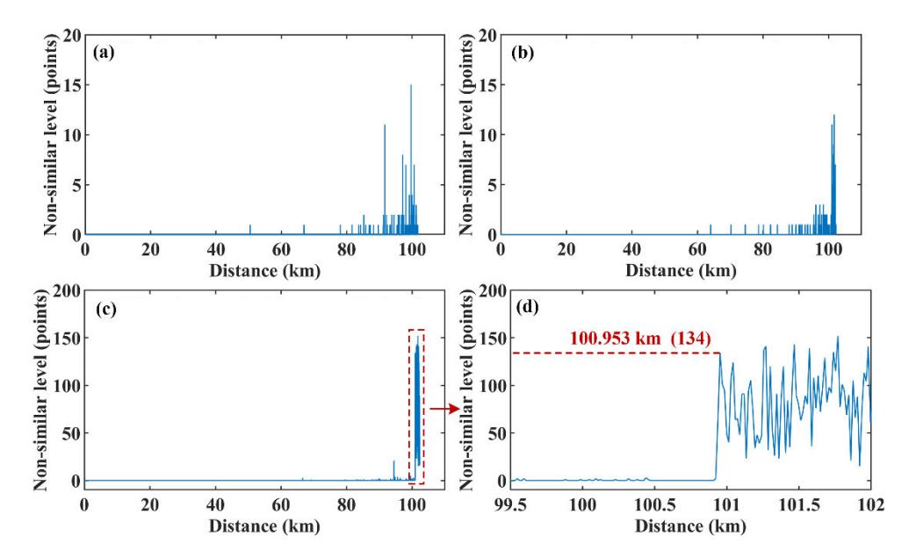

Fig. 9. Measured distributed nonsimilar level based on the CCSA method. (a) No vibration event. (b) Vibration event with an amplitude of 2.608 nε. (c) Vibration event with an amplitude of 7.824 nε. (d) Local zoom-in for (c).

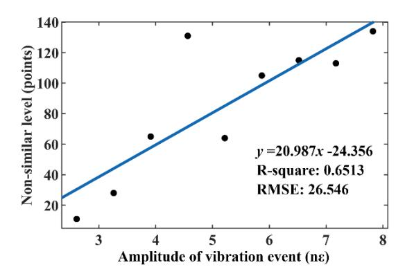

Fig. 10. Calibration curve of the amplitude of the vibration event and nonsimilar level using the CCSA method.

of experimental data in Section IV-C and perform a linear fit to obtain the calibration curve of the amplitude of the vibration event and nonsimilar level as shown in Fig. 10. The nonsimilar level and the amplitude of the vibration event do not have a good linear relationship at >100 km, whose *R*-square is only 0.6513. To summarize, the proposed method based on the Pearson-CC has a higher strain resolution and higher linearity than the previous CCSA methods.

Using a simple OFDR system, we successfully measure a weak vibration event >100 km and calibrate its amplitude. It also has the potential to be used for multiple simultaneous vibration events. However, it should be noted that the measurable range of vibration amplitude depends on the dynamic range of the Pearson-CC and the maximum additional phase term induced by vibration events. The detectable number of vibration events is related to the length and the SNR of FUT and the intensity of the previous vibration events. If the transmission loss over long distances or a previous vibration event causes the Pearson-CC to decrease to 0, it will no longer have the ability to measure the next vibration event. Besides, compared with distributed acoustic sensing (DAS) [47] which can recover the time-domain waveform of the vibration events, the proposed method can only detect the position and amplitude of vibration events, which belongs to DVS. Since the sweep frequency of the TLS in the proposed OFDR system is about 4 Hz, the measurement rate is 4 Hz, which will result in that the proposed OFDR system cannot recover the time-domain waveform of the vibration events with high frequency. As a result, the unit of strain resolution calculated by (12) is pε rather than pε/ √ Hz as calculated in DAS [38]. In the future, if we apply a higher sweep rate of the TLS and compressive sensing algorithm [48], the proposed OFDR system can recover the time-domain waveform of the vibration events. Whereas, the proposed OFDR system is a simpler single-ended structure, requiring no modulation techniques, amplifier, and specialty optical fiber. Using this simple system, we successfully locate weak vibration events over 100 km, demodulate the amplitude of vibration events, and detect multiple vibration events. Those make it more suitable for distributed monitoring of weak vibrations in existing optical networks.

## V. CONCLUSION

In summary, we propose a simple and effective vibration demodulation method based on OFDR by detecting Rayleigh backscattering change that is evaluated by the Pearson-CC. The system is a single-ended internal modulation OFDR system without any optical amplifier, specialty optical fiber, and complex modulation techniques, which is low cost and facilitates placement in existing optical communication networks. We calculate the Pearson-CC between no-vibrated signal and vibrated signal, and the vibration events can be located by detecting changepoints in the Pearson-CC with stairstep changes. The amplitude of the vibration event is approximately proportional to the calculated differential Pearson-CC. The PELT algorithm used for sequence segmentation is applied for 

{10}------------------------------------------------

changepoint detection in the Pearson-CC. In the experiment, we successfully measure a weak vibration event with a range of 100.9 km, a sensing spatial resolution of 15.3 m, and a strain resolution of 868 pε. We also successfully located two simultaneous vibration events over 100-km fiber. The reported technique allows OFDR as a powerful tool for an ultralong-distance and high-resolution DOFVS, which has the potential to be applied in ocean seismic detection, perimeter intrusion detection, oil/gas pipeline monitoring, electric cable monitoring, and so on, and it shows a good application prospect in ISAC-OF based on existing optical fiber communication network.

### REFERENCES

- [1] H. He et al., "Integrated sensing and communication in an optical fibre," *Light, Sci. Appl.*, vol. 12, no. 1, pp. 1–14, Jan. 2023, Art. no. 25.
- [2] E. Ip et al., "DAS over 1,007-km hybrid link with 10-Tb/s DP-16QAM co-propagation using frequency-diverse chirped pulses," *J. Lightw. Technol.*, vol. 41, no. 4, pp. 1077–1086, Feb. 15, 2023.
- [3] M. R. Fernández-Ruiz et al., "Seismic monitoring with distributed acoustic sensing from the near-surface to the deep oceans," *J. Lightw. Technol.*, vol. 40, no. 5, pp. 1453–1463, Mar. 1, 2022.
- [4] A. Sladen et al., "Distributed sensing of earthquakes and ocean-solid Earth interactions on seafloor telecom cables," *Nature Commun.*, vol. 10, no. 1, pp. 1–8, Dec. 2019, Art. no. 5777.
- [5] J. Tejedor et al., "Real field deployment of a smart fiber-optic surveillance system for pipeline integrity threat detection: Architectural issues and blind field test results," *J. Lightw. Technol.*, vol. 36, no. 4, pp. 1052–1062, Feb. 15, 2018.
- [6] F. Peng, H. Wu, X.-H. Jia, Y. Rao, Z. Wang, and Z.-P. Peng, "Ultra-long high-sensitivity φ-OTDR for high spatial resolution intrusion detection of pipelines," *Opt. Exp.*, vol. 22, no. 11, p. 13804, May 2014.
- [7] W. Qin, G. Ma, S. Wang, J. Hu, T. Guo, and R.-B. Shi, "Distributed discharge detection based on improved COTDR method with dual frequency pulses," *IEEE Trans. Instrum. Meas.*, vol. 72, pp. 1–8, 2023.
- [8] Z. Sun, S. Li, and H. Yang, "Precise disturbance localization of long distance fiber interferometer vibration senor based on an improved time–frequency variation feature extraction scheme," *Infr. Phys. Techn.*, vol. 137, Dec. 2023, Art. no. 105097.
- [9] Q. Liu, Z. Jing, A. Li, Y. Liu, Z. Xia, and W. Peng, "Simultaneous measurement of vibration and temperature using frequency-scanned parallel phase-shifting interferometry," *J. Lightw. Technol.*, vol. 39, no. 12, pp. 4094–4100, Jun. 15, 2021.
- [10] J. Huang et al., "A 150 km distributed fiber-optic disturbance location sensor with no relay based on the dual-Sagnac interferometer employing time delay estimation," *Opt. Commun.*, vol. 479, Jan. 2021, Art. no. 126420.
- [11] Q. H. Song, Q. Xiao, H. Y. Wu, and B. Jia, "Improved localization algorithm for distributed fiber-optic sensor based on merged Michelson– Sagnac interferometer," *Opt. Exp.*, vol. 28, no. 5, pp. 7207–7220, Mar. 2020.
- [12] Z. Zhao, M. Tang, L. Wang, N. Guo, H.-Y. Tam, and C. Lu, "Distributed vibration sensor based on space-division multiplexed reflectometer and interferometer in multicore fiber," *J. Lightw. Technol.*, vol. 36, no. 24, pp. 5764–5772, Dec. 15, 2018.
- [13] J. Pastor-Graells et al., "Chirped-pulse phase-sensitive reflectometer assisted by first-order Raman amplification," *J. Lightw. Technol.*, vol. 35, no. 21, pp. 4677–4683, Nov. 1, 2017.
- [14] H. F. Martins, S. Martin-Lopez, P. Corredera, M. L. Filograno, O. Frazao, and M. Gonzalez-Herraez, "Phase-sensitive optical time domain reflectometer assisted by first-order Raman amplification for distributed vibration sensing over >100 km," *J. Lightw. Technol.*, vol. 32, no. 8, pp. 1510–1518, Feb. 25, 2014.
- [15] H. F. Martins, S. Martin-Lopez, P. Corredera, J. D. Ania-Casta non, O. Fraz ao, and M. Gonzalez-Herraez, "Distributed vibration sensing over 125 km with enhanced SNR using phi-OTDR over a URFL cavity," *J. Lightw. Technol.*, vol. 33, no. 12, pp. 2628–2632, Jun. 15, 2015.
- [16] P. Wang et al., "Ultra-long range distributed acoustic sensor using poly-phase coding approach," *J. Lightw. Technol.*, vol. 42, no. 7, pp. 2595–2603, Apr. 1, 2024.

- [17] M. Nie et al., "Ultra long single span distributed sensing distance over 200km based on the phase-sensitive OTDR with bidirectional high-order Raman amplification," in *Proc. 19th Int. Conf. Opt. Commun. Netw. (ICOCN)*, Aug. 2021, pp. 01–03.
- [18] J. Liu et al., "208km ultra-long single span hybrid BOTDR and φ-OTDR with ROPA technology," in *Proc. Opt. Fiber Commun. Conf. Exhib. (OFC)*, Mar. 2023, pp. 1–3, doi: 10.1364/OFC.2023.W2B.18.
- [19] J. Li et al., "124km phase-sensitive OTDR with Brillouin amplification," *Proc. SPIE*, vol. 9157, pp. 1–4, Jun. 2014, Art. no. 91575Z.
- [20] Y. Fu et al., "Ultra-Long-Distance hybrid BOTDA/φ-OTDR," *Sensors*, vol. 18, no. 4, p. 976, Mar. 2018.
- [21] Z. Wang et al., "Ultra-long phase-sensitive OTDR with hybrid distributed amplification," *Opt. Lett.*, vol. 39, no. 20, pp. 5866–5869, 2014.
- [22] L. D. van Putten, A. Masoudi, and G. Brambilla, "100-km-sensing-range single-ended distributed vibration sensor based on remotely pumped erbium-doped fiber amplifier," *Opt. Lett.*, vol. 44, no. 24, p. 5925, 2019.
- [23] Y. Wang et al., "Long-distance OPGW optical cable monitoring system based on f-OTDR technology," in *Proc. Asia Commun. Photon. Conf. (ACP)*, Nov. 2022, pp. 1992–1994.
- [24] M. Song et al., "151-km single-end phase-sensitive optical time-domain reflectometer assisted by optical repeater," *Opt. Eng.*, vol. 57, no. 2, Feb. 2018, Art. no. 027104.
- [25] F. Cunzheng, L. Hao, Y. Baoqiang, Y. Zhijun, and S. Qizhen, "246km long distance fiber optic DAS system based on multi-span bidirectional EDFAs and cascaded AOMs," in *Proc. Opt. Fiber Commun. Conf. Exhib. (OFC)*, Mar. 2022, pp. 1–3.
- [26] C. Fan et al., "300 km ultralong fiber optic DAS system based on optimally designed bidirectional EDFA relays," *Photon. Res.*, vol. 11, no. 6, p. 968, 2023.
- [27] H.-K. Lo, M. Curty, and K. Tamaki, "Secure quantum key distribution," *Nature Photon.*, vol. 8, no. 8, pp. 595–604, 2014.
- [28] B. Korzh et al., "Provably secure and practical quantum key distribution over 307 km of optical fibre," *Nature Photon.*, vol. 9, no. 3, pp. 163–168, Feb. 2015.
- [29] B. Zhu et al., "Long reach fibre optic distributed acoustic sensing using enhanced scattering fibre," in *Proc. 49th Eur. Conf. Opt. Commun. (ECOC)*, vol. 2023, Nov. 2023, pp. 131–134.
- [30] Z. Deng, A. Wan, R. Xu, Y. Wang, J. Jiang, and Z. Wang, "Quasi-distributed acoustic sensing based on orthogonal codes and empirical mode decomposition," *IEEE Sensors J.*, vol. 23, no. 20, pp. 24591–24600, Oct. 2023.
- [31] G. Liang et al., "Phase demodulation method based on a dual-identicalchirped-pulse and weak fiber Bragg gratings for quasi-distributed acoustic sensing," *Photon. Res.*, vol. 8, no. 7, p. 1093, 2020.
- [32] J. Li, Y. Wang, P. Wang, J. Zhong, Q. Bai, and B. Jin, "Detection range enhancement for φ-OTDR using semantic image segmentation," *J. Lightw. Technol.*, vol. 40, no. 14, pp. 4886–4895, Jul. 15, 2022.
- [33] F. Uyar, T. Onat, C. Unal, T. Kartaloglu, E. Ozbay, and I. Ozdur, "A direct detection fiber optic distributed acoustic sensor with a mean SNR of 7.3 dB at 102.7 km," *IEEE Photon. J.*, vol. 11, no. 6, pp. 1–8, Dec. 2019.
- [34] J. Xiong et al., "Long-distance distributed acoustic sensing utilizing negative frequency band," *Opt. Exp.*, vol. 28, no. 24, pp. 35844–35856, Nov. 2020.
- [35] E. Piñeiro, M. Sagues, and A. Loayssa, "Compensation of phase noise impairments in distributed acoustic sensors based on optical pulse compression time-domain reflectometry," *J. Lightw. Technol.*, vol. 41, no. 10, pp. 3199–3207, May 15, 2023.
- [36] Z. Zhang, X. Fan, and Z. He, "Long-range and wide-band vibration sensing by using phase-sensitive OFDR to interrogate a weak reflector array," *Opt. Exp.*, vol. 28, no. 12, pp. 18387–18396, Jun. 2020.
- [37] Z. Qin, Y. Hu, Y. Yue, and C. Tan, "A dual-ended 400 km OFDR for vibration detection," *Meas. Sci. Technol.*, vol. 33, no. 4, Apr. 2022, Art. no. 045203.
- [38] D. Chen, Q. Liu, and Z. He, "108-km distributed acoustic sensor with 220-pε/√ Hz strain resolution and 5-m spatial resolution," *J. Lightw. Technol.*, vol. 37, no. 18, pp. 4462–4468, Sep. 15, 2019.
- [39] I. Steinberg, L. Shiloh, H. Gabai, and A. Eyal, "Over 100km long ultrasensitive dynamic sensing via gated-OFDR," *Proc. SPIE*, vol. 9634, pp. 1–4, Sep. 2015.
- [40] Z. Ding et al., "12km-Long-range vibration sensor based on correlation analysis of optical frequency-domain reflectometry signals," *Opt. Exp.*, vol. 20, no. 27, pp. 28319–28329, 2012.

{11}------------------------------------------------

- [41] T. Liu, Y. Du, Z. Ding, K. Liu, Y. Zhou, and J. Jiang, "40-km OFDR-based distributed disturbance optical fiber sensor," *IEEE Photon. Technol. Lett.*, vol. 28, no. 7, pp. 771–774, Apr. 1, 2016.
- [42] Z. Ding et al., "Long-range OFDR-based distributed vibration optical fiber sensor by multicharacteristics of Rayleigh scattering," *IEEE Photon. J.*, vol. 9, no. 5, pp. 1–10, Oct. 2017.
- [43] Y. Yue, J. Zeng, Z. Ding, T. Zhang, H. Guo, and T. Liu, "Long-range distributed vibration sensing based on internal-modulation OFDR," *Nanotechnol. Precis. Eng.*, vol. 7, no. 4, pp. 1–8, Dec. 2024.
- [44] M. Tang, D. Zhang, D. Wang, J. Deng, D. Kong, and H. Zhang, "Performance prediction of 2D vertically stacked MoS2-WS2 heterostructures base on first-principles theory and Pearson correlation coefficient," *Appl. Surf. Sci.*, vol. 596, Sep. 2022, Art. no. 153498.
- [45] R. Killick, P. Fearnhead, and I. A. Eckley, "Optimal detection of changepoints with a linear computational cost," *J. Amer. Stat. Assoc.*, vol. 107, no. 500, pp. 1590–1598, Dec. 2012.
- [46] Z. Ding et al., "Compensation of laser frequency tuning nonlinearity of a long range OFDR using deskew filter," *Opt. Exp.*, vol. 21, no. 3, pp. 3826–3834, Feb. 2013.
- [47] Z. He and Q. Liu, "Optical fiber distributed acoustic sensors: A review," *J. Lightw. Technol.*, vol. 39, no. 12, pp. 3671–3686, Jun. 15, 2021.
- [48] S. Qu et al., "Distributed sparse signal sensing based on compressive sensing OFDR," *Opt. Lett.*, vol. 45, pp. 3288–3291, Jun. 2020.

**Ji Liu** received the B.S. degree from the College of Electronic Information and Optical Engineering, Nankai University, Tianjin, China, in 2020. He is pursuing the Ph.D. degree with the School of Precision Instruments and Opto-Electronics Engineering, Tianjin University, Tianjin.

His research interests include optical fiber sensing.

**Huafang Wang** received the B.S. degree from the School of Precision Instruments and Opto-Electronics Engineering, Tianjin University, Tianjin, China, in 2023, where she is pursuing the M.S. degree with the School of Precision Instruments and Opto-Electronics Engineering.

Her research interests include optical fiber sensing.

**Haohan Guo** received the B.S. degree from the School of Information Science and Engineering, Yanshan University, Qinhuangdao, China, in 2020, and the M.S. degree in optical engineering from the School of Precision Instruments and Opto-Electronics Engineering, Tianjin University, Instruments and Opto-Electronics Engineering.

**Jinqi Deng** received the B.S. degree from the School of Precision Instruments and Opto-Electronics Engineering, Tianjin University, Tianjin, China, in 2023, where he is pursuing the M.S. degree with the School of Precision Instruments and Opto-Electronics Engineering.

His research interests include optical fiber sensing.

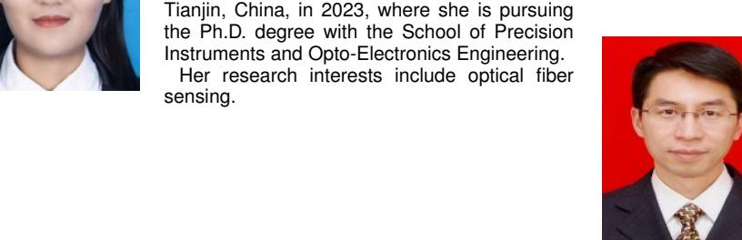

**Junfeng Jiang** received the B.S. degree from the Southwest Institute of Technology, Mianyang, China, in 1998, and the M.S. and Ph.D. degrees from Tianjin University, Tianjin, China, in 2001 and 2004, respectively.

He is currently a Professor with Tianjin University. His research interests include fiber sensors and optical communication performance measurement.

**Kun Liu** received the B.S. degree in optoelectronics information engineering and the M.S. and Ph.D. degrees in optical engineering from Tianjin University, Tianjin, China, in 2004, 2006, and 2009, respectively.

He is currently a Professor with Tianjin University. His research interests include the development of physics and chemistry sensing systems based on optical fiber lasers.

**Tiegen Liu** received the B.S., M.S., and Ph.D. degrees from Tianjin University, Tianjin, China, in 1982, 1987, and 1999, respectively.

He is currently a Professor with the School of Precision Instrument and Optoelectronics Engineering, Tianjin University. His research interests include optical fiber sensing and photoelectric detection.

**Yuanyao Li** received the B.S. degree in optoelectronics information engineering and the Ph.D. degree in optical engineering from Tianjin University, Tianjin, China, in 2007 and 2012, respectively.

He is currently a Researcher with Tianjin Institute of Metrological Supervision and Testing, Tianjin. His research interests include optics measurements and optical fiber sensing.

**Zhenyang Ding** received the B.S. degree in optoelectronics information engineering and the M.S. and Ph.D. degrees in optical engineering from Tianjin University, Tianjin, China, in 2008, 2010, and 2013, respectively.

From 2013 to 2015, he was a Postdoctoral Researcher with the University of Maryland, College Park, USA. He is currently a Professor with the School of Precision Instruments and Optoelectronics Engineering, Tianjin University. His research interests include optical fiber sensing and optical coherence tomography.