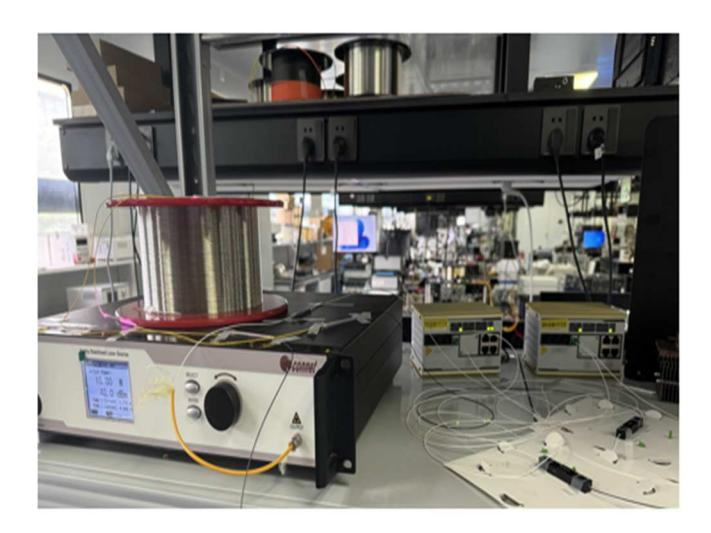
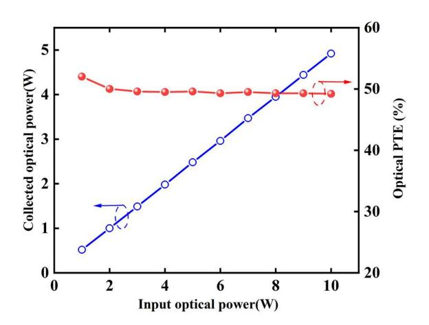
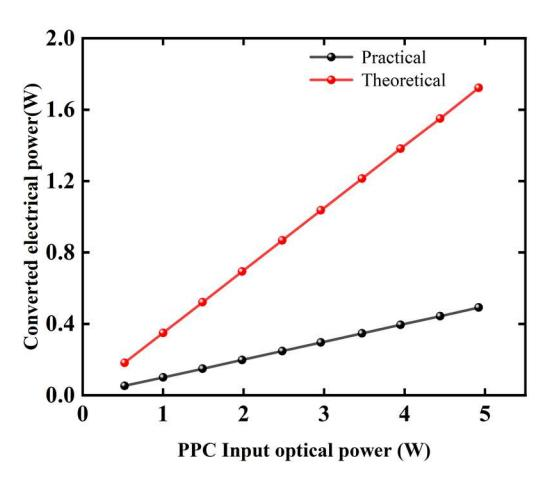

{0}------------------------------------------------

# Experimental Demonstration of Power over Fiber for Power Grid Application

*Zemian Zeng,1 Changna Chen,1 Xiaosheng Lin,1 Wei Chen,2,3 Jianping Li,2,3,\* and Yuwen Qin2,3*

1Guangzhou Power Supply Bureau,Guangdong Power Grid Co,Lid, Guangzhou, China 2 Institute of Advanced Photonics Technology, School of Information Engineering, Guangdong University of Technology, Guangzhou, China

3Key Laboratory of Photonic Technology for Integrated Sensing and Communication, Ministry of Education of China, Guangdong Provincial Key Laboratory of Information Photonics Technology, Guangdong University of Technology Guangzhou, China

\*Email: jianping@gdut.edu.cn

*Abstract***—In this paper, we experimentally demonstrate the standard single mode fiber based PoF system with 10W optical power and 155 Mb/s data rate transmitted simultaneously over 1 km. The high-speed data signal is generated from an commercial optical module with combination of the optical switch applied in the Power Grid infrastructure. The experimental results show the potential application of PoF technology for Power Grid to provide the the low-power consumption inline performance monitoring or electrical power supply under emergency rescue etc.** 

*Keywords—Optical fiber communication, power over fiber, single mode fiber, Power Grid.* 

#### I. INTRODUCTION

Electricity systems form the basic infrastructure of modern societies. Grids and distribution networks are often large, reaching almost every home, office and factory. The power grid can be defined as the entire installation of wires and machinery connecting the source of electricity (i.e., the power plant) to the customers and their myriad needs[1]. Power grids are interconnected networks for delivering electricity from stations to consumers. A power grid usually consists of transformers, power towers, overhead transmission lines and distribution lines[2]. The power over fiber (PoF) systems with high optical power delivery and high-speed data transmission simultaneously over optical fiber have been gained a lot of attractions in various scenarios, including the mobile fronthaul in 5G/6G systems , electrical power supply for hazard environments in Power Grid [3], internet of things (IoT) in industry [4], and so on. PoF technology can provide an optical fiber link to remote sites for some low power-consumption devices, (such as telecommunication equipment, mobile antennas, sensors, or monitors) with data transmission as well as electrical powering and then eliminating the need for metal wires or on-site power [5,6].

In the past few years, double-cladding fiber (DCF), standard single-mode fiber (SSMF), multimode fiber (MMF) and multi-core fiber (MCF) based PoF systems have been demonstrated widely. In the DCF-based systems, a data rate of 54 Mbit/s and optical power of 150 W has reported over 1 km DCF with the power transfer efficiency (PTE) of 19.46% [7,8]. For the SSMF-based PoF systems, the co-transmission of 1064 nm energy light and 1550 nm signal light over 1 km was achieved with an optical transmission efficiency (OTE) of 71.8 %, which can generate an electrical power of 2.51 W . For the MMF based demonstration. Meanwhile, for the MCFbased PoF experiment, high optical power delivery and electrical power conversion of 11.9 W has been shown in the PoF system with co-propagating a 64-ary quadrature amplitude modulation orthogonal frequency division multiplexing (64QAM OFDM) signal through a 1 km 7-core MCF [9,10,11]. However, for the optical transmission system deployed in the Power Grid, the most used optical fiber is the SSMF. Thus, it is desired to study the PoF performance in SSMF link for the Power Grid scenarios.

In this work, we experimentally demonstrated that the high optical power delivery with 1064 nm light and 155M bit/s signal generated by the commercial small form-factor pluggable (SFP) optical moduleoptical module with a combination of optical switch are transmitted simultaneoulsy over a 1 km SSMF. The experimental results show that the OTE of 1064 nm power light is about 50 %, and the data signal can be stably transmitted through the SSMF.

## II. EXPERIMENTAL SETUP

Figure. 1 shows the experimental setup of the SSMF based PoF system. In this setup, a single-mode high power laser diode (HPLD) centered at a wavelength1064.8 nm is used to generate the high-power power light. Its linewidth has been optimized to be 40 GHz to mitigate the stimulated Brillouin scattering (SBS) effect and then realize high-power transmission over the SSMF. The transmitter and receiver used to demonstrate the data transmission in center office (CO) and remote unit (RU) are composed of a commercial optical switch and SFP optical module respectively with the signal wavelength of 1310 nm and data rate of 155 M bit/s[12]. The generated optical signal and power light are combined via a customed 1064 nm/1310 nm single-mode wavelength division multiplexer (SM-WDM), which is specifically fabricated with a high-power damage threshold. Then, the combined optical signal is fed into the 1-km SSMF spool with the core diameter of 9 μm, which is slightly larger than that of the used SM-WDM fiber (8.2 μm). But, the fusion loss of the two fibers is less than 0.1 dB with the splicing image as show in the inset of Fig. 1. At the SSMF output, the optically data signal and high-power light are separated by using another 1064 nm/1310 nm SM-WDM with an isolation of 30 dB between the two wavelengths. The insertion loss of a pair of SM-WDM is ~2 dB. Meanwhile, the photoelectric conversion module used here is a photovoltaic power converter (PPC YCH-H003) to convert the delivered high optical power into electrical power [13]. Before this conversion, the delivered optical power can be measured by an optical power meter (OPM, Laser Point A-40-D25-HPB) [14].

{1}------------------------------------------------

Fig. 1. Experimental setup of the SSMF based PoF system. CO: Central office, HPLD: High power laser diode, SSMF: Standard single mode fiber, PPC: Photovoltaic power converter, SFP: Small form pluggable, MUX: Multiplexer, DEMUX: Demultiplexer.

Fig. 2. the practical experiment system

# III. RESULTS AND DISCUSSION

In order to evaluate the power transfer capability of the SSMF link, the relationship between the output optical power of the high power laser and the collected optical power for the PPC will be measured firstly. The Optical PTE defined as the ratio of the PPC input optical power to the HPLD output optical power has been shown in Fig. 3. It can be found that when the HPLD output power is 10W, the collected optical power at the PPC input is 4.9 W with corresponding to the Optical PTE of 49 %, which is higher than that of the DCFbased and the MMF-based configurations. The total loss of the configuration is about 3 dB, which includes the 1.94dB insertion loss of the 2 SM-WDMs, 0.8 dB fiber transmission loss of the 1064 nm energy light and the 0.2 dB SM-SM fusion loss. Therefore, the experimental data has a good agreement with the theoretical analyzed values.

Fig. 3.The collected optical power for PPC and the optical PTE versus the input optical power of HPLD in the PoF system.

Fig. 4.Converted electrical power of the PoF system under theoretical and practical conversion efficiency of the PPC.

{2}------------------------------------------------

Fig. 5. the physical diagram of the experimental system

Fig. 4 then shows the converted electrical power of the PoF system under theoretical and practical conversion efficiency of the PPC. As reported in [15], at the wavelength of 1064nm, the theoretical of conversion efficiency of the PPC will be up to 35% while only ~10% in our demonstration. Take the input 10 W light power for example, an electrical power of about 500 mW has been realized. In addition, the data signal generated by the SFP optical module can maintain stable transmission over the SSMF link as shown in Fig. 5. Thus, this demonstration has validated the potential application in the Power Grid systems.

## IV. CONCLUSION

In conclusion, we have successfully demonstrated the simultaneous transmission of 10 W 1064 nm power light and data rate of 155 M bit/s signal over 1-km SSMF with the use of commercial optical switch and SFP optical module. The optical PTE is about 50 %, and the converted electrical power of 500mW has been obtained under the limited practical 10% photoelectric conversion efficiency. The experimental results show the demonstrated PoF system has indeed the ability to applied in the Power Grid under some scenarios.

## ACKNOWLEDGMENT

This study is supported by the by the Science and Technology Project of China Southern Power Grid (GDKJXM20222034).

#### REFERENCES

- [1] Amin, Massoud & Stringer, John. (2008). The Electric Power Grid: Today and Tomorrow. MRS Bulletin. 33. 10.1557/mrs2008.80.
- [2] Aguero, Julio Romero et al. "Grid modernization: challenges and opportunities." The Electricity Journal 30 (2017): 1-6.
- [3] M. Wada, K. Kurokawa, T. Matsui, H. Iida and K. Nakajima, "Highefficiency and long-distance power-over-fibre transmission using a 125-μm cladding diameter 4-core fibre," 49th European Conference on Optical Communications (ECOC 2023), Hybrid Conference, Glasgow, UK, 2023, pp. 84-87.
- [4] J. D. López-Cardona, P. C. Lallana, R. Altuna, A. Fresno-Hernández, X. Barreiro, and C. Vázquez, "Optically feeding 1.75 W with 100 m MMF in efficient CRAN front-hauls with sleep modes," Journal of Lightwave Technology, vol. 39, no. 24, pp. 7948–7955, 2021.
- [5] J. D. López-Cardona, R. Altuna, D. S. Montero and C. Vázquez, "Power Over Fiber in C-RAN With Low Power Sleep Mode Remote Nodes Using SMF," in *Journal of Lightwave Technology*, vol. 39, no. 15, pp. 4951-4957, Aug.1, 2021.
- [6] N. K. Fontaine, Haoshuo Chen, Mikael Mazur, Lauren Dallachiesa, K. W. Kim, Roland Ryf, "Hermite-Gaussian mode multiplexer supporting 1035 modes," 2021 Optical Fiber Communications Conference and Exhibition (OFC), San Francisco, CA, USA, 2021, pp. 1-3.
- [7] M. Matsuura, H. Nomoto, H. Mamiya, T. Higuchi, D. Masson, and S. Fafard, "Over 40-W electric power and optical data transmission using an optical fiber," IEEE Transactions on Power Electronics, vol. 36, no. 4, pp. 4532–4539, 2021.
- [8] D. Kamiyama, A. Yoneyama, and M. Matsuura, "Multichannel data signals and power transmission by power-over-fiber using a doubleclad fiber," IEEE Photonics Technology Letters, vol. 30, no. 7, pp. 646649, 2018.
- [9] Yang H, Peng D, Qin Y, Li J, Xiang M, Xu O, Fu S. 10-W power light co-transmission with optically carried 5G NR signal over standard single-mode fiber. Opt Lett. 2021 Oct 15;46(20):5116-5119.
- [10] Hailin Yang, Shan Wang, Di Peng, Yuwen Qin, and Songnian Fu, "Optically powered 5G WDM fronthaul network with weakly-coupled multicore fiber," Opt. Express 30, 19795-19804 (2022)
- [11] S. Wang, H. Yang, Y. Qin, D. Peng and S. Fu, "Power-Over-Fiber in Support of 5G NR Fronthaul: Space Division Multiplexing Versus Wavelength Division Multiplexing," in *Journal of Lightwave Technology*, vol. 40, no. 13, pp. 4169-4177, 1 July1, 2022.
- [12] K. Kurokawa, H. Iida, N. Hanzawa, T. Oguma, Y. Yamashita, T. Mori, T. Matsui, and K. Nakajima, "Stimulated Raman Scattering and Powerover-Fiber Property of Multi-core Fiber," in *Optical Fiber Communication Conference (OFC) 2022*, S. Matsuo, D. Plant, JE. Shan Wey, C. Fludger, R. Ryf, and D. Simeonidou, eds., Technical Digest Series (Optica Publishing Group, 2022), paper Tu3F.3.
- [13] Souza, Letícia C. et al. "Enabling Next-generation Gbps Full-duplex Communications Systems Applying Radio- and Power-over-Fiber Integration." *Optics Communications* (2024): n. pag.
- [14] Guo, C.; Guan, C.; Lv, H.; Chai, S.; Chen, H. Multi-Channel Long-Distance Audio Transmission System Using Power-over-Fiber Technology. *Photonics* 2023, *10*,521.
- [15] J. J. Yin, Y. R. Sun, S. Z. Yu, Y. M. Zhao, R. W. Li, and J. R. Dong, J. Semicond. Technol. Sci. 41, 062303 (2020).