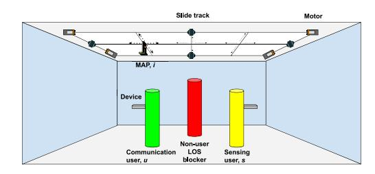
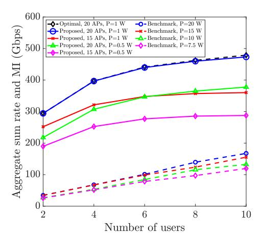
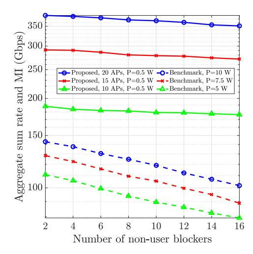
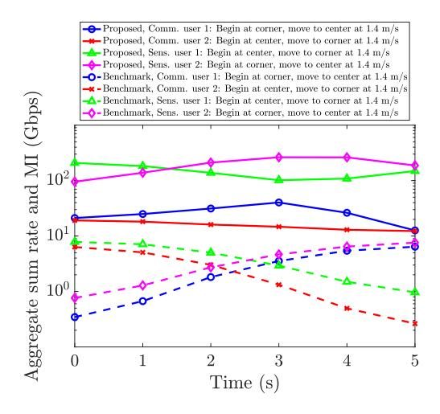
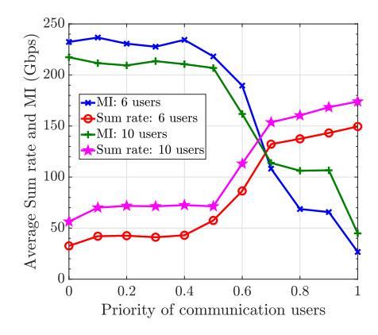

{0}------------------------------------------------

# Movable Access Point-Aided Integrated Visible Light Communication and Sensing Networks

Zohaib Saghir® and Sylvester Aboagye®, Member, IEEE

Abstract—The emergence of visible light communication (VLC) provides a promising low-cost, radiation-free, and energyefficient solution to the limited spectrum of wireless networks. However, the design issues of line-of-sight (LOS) blockage, user mobility support, random device orientation, and the limited field-of-view of VLC access points (APs) and receivers have delayed its adoption. This letter explores the use of movable AP (MAP) technology to address these issues in a visible light based joint communication and sensing system. First, a system model for a MAP-aided integrated visible light communication and sensing (IVLCS) network is proposed. Then, a non-convex optimization problem is formulated to maximize the aggregate sum rate and sensing mutual information (MI) by jointly optimizing MAPs' position and user association. A low-complexity algorithm that obtains a locally optimal solution is proposed by leveraging the difference of convex functions and the majorization-minimization technique. Simulation results reveal that the proposed MAP-aided IVLCS system is more robust against link blockages, provides mobility support and can significantly enhance aggregate sum rate and MI compared to a fixed AP system.

Index Terms—Integrated visible light communication and sensing, movable access point, user association, user mobility, mutual information.

# I. INTRODUCTION

THE VISIBLE light spectrum has been identified as one of the key spectra in future wireless networks due to its vast and unlicensed bandwidth. In visible light communication (VLC), low-cost light fixtures are used to provide radiation-free, ultra-high data rate and energy-efficient wireless connectivity [1]. The successful deployment of VLC systems in future wireless networks is dependent on overcoming several signal propagation, transceiver design, and mobility management challenges such as susceptibility to line-of-sight (LOS) link blockages, limited field-of-view (FOV) of transceivers, and random device orientation.

Few studies have been carried out to tackle some of the above-mentioned challenges. Specifically, the design of reconfigurable intelligent surface (RIS)-based VLC systems to overcome LOS link blockages, the limited FOV issue, and the random device orientation has been investigated in [2], [3], [4], [5]. Mobility-aware resource allocation in VLC systems has been explored in [6], [7]. However, most studies on RIS-aided VLC systems typically use the RIS to reflect incident waves from the transmitter to the receiver to

Received 21 October 2024; revised 21 November 2024; accepted 14 December 2024. Date of publication 23 December 2024; date of current version 10 March 2025. This work was supported by the University of Guelph. The associate editor coordinating the review of this article and approving it for publication was N. Zhao. (Corresponding author: Sylvester Aboagye.)

The authors are with the School of Engineering, University of Guelph, Guelph, ON N1G 2W1, Canada (e-mail: zsaghir@uoguelph.ca; saboagye@uoguelph.ca).

Digital Object Identifier 10.1109/LWC.2024.3521192

compensate for blocked LOS paths. Thus, under the assumptions that (i) the direct path between the VLC access point (AP) and the receiver is blocked by an object and (ii) there are no objects between the RIS and users, the parameters of the RIS are optimized to maximize the RIS non-LOS link performance. These assumptions are oversimplified since there can be objects between the RIS elements and VLC receivers. Also, the performance gain of the RIS non-LOS link is insignificant when compared to that of the direct LOS path between the VLC AP and receiver. Thus, it is important to always guarantee a direct LOS path in VLC systems.

Recently, there have been few studies on integrated visible light communication and sensing (IVLCS) [8], [9]. In [8], the authors optimized time slot selection and power allocation to minimize transmit power under sum rate, echo-to-noise ratio (ENR), sensing slot, and power constraints. A multi-band carrierless amplitude and phase modulation for received signal strength-based trilateration IVLCS system was explored in [9]. The above-mentioned studies did not consider practical design issues such as user mobility, link blockages, and random device orientation. Moreover, these studies were either communication or sensing centric and did not explore unified IVLCS that jointly optimizes sensing and communication metrics. With the rapid growth and spread of the Internet-of-Things technology and devices, IVLCS is expected to play a key role in the success of Industry 4.0+, where traditional manufacturing and industrial practices become automated by leveraging advanced wireless communications and sensing technologies. Moreover, a variety of high-accuracy sensing services such as augmented and virtual reality in mobile indoor environments are expected in future wireless networks. It is therefore important to explore IVLCS systems with ubiquitous and robust mobility management, sensing, and communication solutions.

Motivated by the above literature, a movable access point (MAP)-based system is exploited to overcome the LOS blockage, limited FOV, random device orientation, and mobility issues in IVLCS systems. To the best of the authors' knowledge, this letter makes the first attempt to quantitatively examine the utilization of movable antenna (MA), an emerging technology in radio frequency communication systems [10], [11], [12], [13], to provide a robust IVLCS system, improve network reliability, and enhance mobility support in IVLCS systems. The main contributions are summarized as follows:

- • We propose a novel system model for IVLCS that integrates MAP technology in an indoor environment to resolve issues related to LOS blockage, limited FOV, and random device orientation.
- We formulate an optimization problem that optimizes MAPs' position and assigns APs to users to maximize the aggregate communication sum rate and sensing mutual information (MI).

{1}------------------------------------------------

Fig. 1. MAP-aided IVLCS system with communication and sensing users and non-user blockers.

- To handle this non-convex problem, we leverage the difference of convex functions and the majorization-minimization (MM) method to propose a low-complexity solution that obtains a locally optimal solution.
- We evaluate the effectiveness of the proposed system model and algorithm for aggregate sum rate and MI and examine the impact of number of blockers, user mobility, and trade-off between sensing and communication.

#### II. SYSTEM MODEL

# A. Network Model

As shown in Fig. 1, an indoor IVLCS system with multiple movable transceivers (i.e., MAPs) serves several mobile communication and sensing users, simultaneously, in the presence of non-user blockers is considered. The set of MAPs, communication users, and sensing users are denoted as  $\mathcal{I}$  =  $\{1, 2, \dots, i, \dots, I\}, \ \mathcal{U} = \{1, 2, \dots, u, \dots, U\}, \ \text{and} \ \mathcal{S} = \{1, 2, \dots, u, \dots, U\}$  $\{1, 2, \dots, s, \dots, S\}$ , respectively. The total number of users is defined as  $\mathcal{J} = \{ \mathcal{S} \cup \mathcal{U} \}$ , where  $j \in \mathcal{J}$ , and  $\mathcal{S} \cap \mathcal{U} = \emptyset$ . Each MAP consists of a light emitting diode (LED) and a photodetector (PD) while each user holds a receiver equipped with a PD in a random direction. For communication services, the AP transmits a signal which is received by the PD. For active sensing, the LEDs emit sensing signals and the PD at the MAP receives the reflected echo to measure any variations in the light intensity. As depicted in Fig. 1, the position of the *i*-th MAP is defined by a two dimensional grid coordinate system and the number of all grid points is represented by the set  $\mathcal{G} = \{1, 2, \dots, g, \dots, G\}$ . The AP movement is supported by motors and slide tracks that cooperate to relocate the AP to a target position specified by a central processing unit (CPU). Without loss of generality, it is assumed that the channel state information (CSI) is known at the CPU, which can be achieved via VLC channel estimation techniques [14], and uplink infra-red or wireless fidelity transmission. Interference is not considered since the MAPs use LEDs with narrow semiangle half-angle to emit highly directional and narrow beams.

## B. Blockage and Mobility Model

Self blockage – which refers to link blockage by the user – and non-user blockage are considered. A non-user is said to block the LOS link between MAP i and user j if the height of the non-user blocker  $H_b$  is greater than the threshold [15]:

$$H_T = \frac{x_i h_j + (d_x - x_i h_{\rm AP})}{d_x},\tag{1}$$

where  $x_i$  is the distance between the blocker and MAP i,  $h_j$  is the height at which the j-th user holds the receiver,  $d_x$  is the horizontal distance between the i-th MAP located at grid point g and user j. The random way point mobility model is used to characterize user movement indoors [16].

#### C. Channel Model

The LOS channel gain between the i-th AP located at grid g and the j-th user be can be modeled by [2]:

$$g_{i_{j},g} = \begin{cases} \frac{(m+1)A_{\text{PD}}}{2\pi d_{i_{j},g}^{2}} \cos^{m\left(\phi_{i_{j},g}\right)} \mathcal{T}(\theta_{i_{j},g}) \mathcal{G}(\theta_{i_{j},g}) \cos\left(\theta_{i_{j},g}\right), \\ H_{b} < H_{T} \text{ and } 0 \leq \theta_{i_{j},g} \leq \Phi_{\text{FOV}} \\ 0, \text{ otherwise} \end{cases}$$
(2)

where  $m=-1/\log_2(\cos\Theta_{1/2})$  is the Lambertian index, with  $\Theta_{1/2}$  being the half-intensity radiation angle,  $A_{\rm PD}$  is the surface area of the PD,  $d_{i_j,g}$  is the distance from MAP i to user  $j, \phi_{i_j,g}$  is the irradiance angle,  $\theta_{i_j,g}$  is the incidence angle,  $\mathcal{T}(\theta_{i_j,g})$  is the optical filter gain and  $\mathcal{G}(\theta_{i_j,g})=f^2/\sin^2$  is the optical concentrator gain, where f is the refractive index.  $\Phi_{\rm FOV}$  is the FOV of the PD. Device orientation affects the incidence angle  $\theta_{i_j,g}$ , but not the irradiance angle. The cosine of  $\theta_{i_j,g}$  can be expressed in terms of the device's polar angle,  $\alpha$ , and azimuth angle,  $\beta$ , as [17]:

$$\cos\left(\theta_{i_{j},g}\right) = \frac{x_{i} - x_{i_{j},g}}{d_{i_{j},g}} \sin\left(\alpha\right) \cos\left(\beta\right) + \frac{y_{i} - y_{i_{j},g}}{d_{i_{j},g}} \sin\left(\alpha\right) \sin\left(\beta\right) + \frac{z_{i} - z_{i_{j},g}}{d_{i_{j},g}} \cos\left(\alpha\right),$$
(3)

where  $(x_i,y_i,z_i)$  and  $(x_{i_j,g},y_{i_j,g},z_{i_j,g})$  represent position vectors for AP and user locations, respectively. According to [17],  $\alpha$  can be modeled using the truncated Laplace distribution with the mean and standard deviation of 41° and 9°, respectively. Its value is typically restricted to the range  $[0,\pi/2]$ .  $\beta$  follows a uniform distribution with  $\beta U[-\pi,\pi]$ .

# III. JOINT MAP POSITION AND USER ASSOCIATION OPTIMIZATION

#### A. Communication Metric

The achievable data rate for communication user u that is served by MAP i located at grid g can be characterized by the lower bound [2]:

$$R_{i_u,g} = W \log_2 \left( 1 + \frac{e}{2\pi} SNR_{i_u,g} \right), \tag{4}$$

where W is the channel bandwidth.  $SNR_{i_u,g}$  denotes the signal-to-noise ratio and can be expressed as:

$$SNR_{i_u,g} = \frac{p_{i_u,g} \left( R_{\text{PD}} \ g_{i_j,g} \right)^2}{WN_{\text{VLC}}},\tag{5}$$

where  $p_{i_u,g}$  is the transmit power from AP i to user u,  $R_{\rm PD}$  is the responsivity of the PD, and  $N_{\rm VLC}$  is the power spectral density of additive white Gaussian noise at the PD.

#### B. Sensing Metric

MI is considered as the sensing metric to measure how much information about the channel is conveyed to the PD at the VLC MAP [18]. MI is chosen as the sensing metric 

{2}------------------------------------------------

because several parameters about sensing users (e.g., speed and location) and other sensing performance indicators such as ENR [8], and probability of detection sensing metrics can be derived from it. Active sensing is considered where the LED of an AP emits light beam to a user, and the user reflects it to the PD. According to [18], sensing MI can be expressed as:

$$R_{i_s,g} = W \log_2 \left( 1 + ENR_{i_s,g} \right), \tag{6}$$

where  $ENR_{i_s,q}$  denotes the ENR and is given by

$$ENR_{i_s,g} = \frac{e}{2\pi} \left( \frac{p_{i_s,g} \Gamma g_{i_s,g}^2}{WN_{\text{VLC}}} \right), \tag{7}$$

with  $\Gamma$  being the reflecting loss factor,  $p_{i_s,g}$  is the transmit power from MAP i at grid point g to sensing user s,  $g_{i_s,g}^2$  is the cascaded channel gain for the path from the LED of MAP i located at grid point g to user s and that from the user to the PD of the MAP.

#### C. Problem Formulation

The unified optimization framework to maximize the sum of data rate and MI by jointly optimizing MAP position and user association can be formulated in (8), where  $a_{i_j,g}$  is a binary variable that indicates that whether user j is being served by MAP i located at grid point g. Constraints  $\mathbf{C}_1$  and  $\mathbf{C}_2$  guarantee that the data rate and MI requirements of communication and sensing users exceed the minimum requirements  $R_{\min}^u$  and  $R_{\min}^s$ , respectively. Constraint  $\mathbf{C}_3$  indicates that AP i can be positioned at a single grid point at any time. The constraint  $\mathbf{C}_4$  ensures that for grid point g, there cannot be more than one MAP. Note that the optimization problem in (8) allows multi-connectivity since each user could be served by multiple MAPs.

$$\max_{\mathbf{a}} \sum_{g=1}^{G} \sum_{i=1}^{I} \left( \sum_{u=1}^{U} a_{i_{u},g} R_{i_{u},g} + \sum_{s=1}^{S} a_{i_{s},g} R_{i_{s},g} \right)$$
s.t. 
$$\mathbf{C}_{1} : \sum_{g=1}^{G} \sum_{i=1}^{I} a_{i_{u},g} R_{i_{u},g} \ge R_{min}^{u}, \forall u,$$

$$\mathbf{C}_{2} : \sum_{g=1}^{G} \sum_{i=1}^{I} a_{i_{s},g} R_{i_{s},g} \ge R_{min}^{s}, \forall s,$$

$$\mathbf{C}_{3} : \sum_{g=1}^{G} \left( \sum_{u=1}^{U} a_{i_{u},g} + \sum_{s=1}^{S} a_{i_{s},g} \right) = 1, \forall i,$$

$$\mathbf{C}_{4} : \sum_{i=1}^{I} \left( \sum_{u=1}^{U} a_{i_{u},g} + \sum_{s=1}^{S} a_{i_{s},g} \right) \le 1, \forall g,$$

$$\mathbf{C}_{5} : a_{i_{u},g} \in \{0,1\}, a_{i_{s},g} \in \{0,1\}, \forall i,g,u,s.$$
(8)

#### D. Proposed Solution

The problem in (8) belongs to the class of combinatorial optimization which is generally challenging to obtain the global optimal solution. A straightforward approach involves enumerating all possible MAPs via the exhaustive search method to find the global optimal solution. However, this approach is impractical due to its exorbitant computational complexity, even for small number of APs. In the sequel, an efficient low-complexity solution based on the difference of

# **Algorithm 1** Proposed Algorithm for Solving (12)

- 1: Initialize the maximum number of iterations  $k_{\text{max}}$ , penalty factor  $\Psi \gg 1$ , iteration index k = 1, and  $\mathbf{a}^{(0)}$ ;
- 2: Repeat
- 3: Solve (12) for a given  $\mathbf{a}^{(k-1)}$  and obtain the intermediate MAP position  $\mathbf{a}'$ ;
- 4: Set  $\mathbf{a}^k = \mathbf{a}', k = k + 1;$
- 5: **Until** convergence or  $k = k_{\text{max}}$ ;

convex functions [19] and the MM technique [20] is proposed to obtain a locally optimal solution.

The first step is to express the binary constraint  $C_5$  into the equivalent form:

$$\mathbf{C}_{5a}: 0 \le a_{i_j,g} \le 1,$$

$$\mathbf{C}_{5b}: \sum_{i=1}^{I} \sum_{j=1}^{J} \sum_{g=1}^{G} a_{i_j,g} - \sum_{i=1}^{I} \sum_{j=1}^{J} \sum_{g=1}^{G} a_{i_j,g}^2 \le 0, \quad (9)$$

where  $C_{5a}$  relaxes the binary requirement and  $C_{5b}$  is the difference of convex functions since the term  $\sum_{i=1}^{I}\sum_{j=1}^{J}\sum_{g=1}^{G}a_{i_{j},g}^{2}$  is convex. Problem (8) can be written as:

$$\max_{\mathbf{a}} \sum_{g=1}^{G} \sum_{i=1}^{I} \left( \sum_{u=1}^{U} a_{i_{u},g} R_{i_{u},g} + \sum_{s=1}^{S} a_{i_{s},g} R_{i_{s},g} \right)$$
s.t.  $\mathbf{C}_{1} - \mathbf{C}_{4}, \mathbf{C}_{5a}, \mathbf{C}_{5b}$ . (10)

Problem (10) is still a non-convex optimization problem since the left hand side of  $C_{5b}$  is not a convex function.

Following the approach in [19], the problem in (10) can be written in the equivalent form:

$$\max_{\mathbf{a}} \sum_{g=1}^{G} \sum_{i=1}^{I} \left( \sum_{u=1}^{U} a_{i_{u},g} R_{i_{u},g} + \sum_{s=1}^{S} a_{i_{s},g} R_{i_{s},g} \right)$$

$$-\Psi \left( \sum_{i=1}^{I} \sum_{j=1}^{J} \sum_{g=1}^{G} a_{i_{j},g} - \sum_{i=1}^{I} \sum_{j=1}^{J} \sum_{g=1}^{G} a_{i_{j},g}^{2} \right)$$
s. t.  $\mathbf{C}_{1} - \mathbf{C}_{4}, \mathbf{C}_{5a},$  (11)

where  $\Psi \gg 0$  is a large constant value that acts as a penalty factor for penalizing the objective function for any  $a_{i_j,g}$  that is not binary. Note that the constraints in (11) span a convex set which facilitates the development of an efficient algorithm. However, the objective function remains non-convex due to

the penalty function 
$$\left(\sum_{i=1}^{I}\sum_{j=1}^{J}\sum_{g=1}^{G}a_{i_j,g}-\sum_{i=1}^{I}\sum_{j=1}^{J}\sum_{g=1}^{G}a_{i_j,g}^2\right).$$

By leveraging the MM technique [20] to construct a surrogate function as a convex approximation of the penalty function via first-order Taylor expansion, the optimization problem in (11) can be equivalently formulated as:

$$\max_{\mathbf{a}} \sum_{g=1}^{G} \sum_{i=1}^{I} \left( \sum_{u=1}^{U} a_{i_{u},g} R_{i_{u},g} + \sum_{s=1}^{S} a_{i_{s},g} R_{i_{s},g} \right) - \Psi \left( \sum_{i=1}^{I} \sum_{j=1}^{J} \sum_{g=1}^{G} \left( a_{i_{j},g} \left( 1 - 2a_{i_{j},g}^{(k-1)} \right) + \left( a_{i_{j},g}^{(k-1)} \right)^{2} \right) \right) \\
\text{s.t.} \quad \mathbf{C}_{1} - \mathbf{C}_{4}, \mathbf{C}_{5a}, \tag{12}$$

{3}------------------------------------------------

where  $a_{i_j,g}^{(k-1)}$  is the k-1-th iterate solution of the problem. The problem in (12) is a convex optimization problem which can be solved efficiently by employing some convex optimization algorithm and tools, such as CVX. The proposed solution is summarized in Algorithm 1. The proposed algorithm converges to a locally optimal solution of (8) with polynomial time complexity as shown in [19], and after three iterations. Specifically, the per iteration computational complexity is  $\mathcal{O}((IJG)^3(I+J+G))$ .

#### E. Practical Implementation

The proposed MAP-aided IVLCS network can be implemented using motorized track lighting fixtures. These motorized (using direct current motors or actuators) fixtures use adaptors (e.g., J, H, and L system adapters) and mounting arms to enable the light fixtures to move along the track in 2D directions, tilt vertically up to 90°, and rotate horizontally under the control of the CPU. Since track lighting systems are already commercially available at a low-cost, they offer cost-efficient infrastructure for MAPs. A summary of how to realize the movement of APs is as follows. A wireless fidelity AP obtains the CSI for all users and shares it via wireless or wired connection with the CPU. The CPU uses the available CSI and the users' QoS requirements, APs' transmit power budget, and APs' movement constraints as inputs, and then executes the proposed optimization algorithm. The algorithm produces position coordinates for all APs and APuser association information as an output. The CPU sends this output to all APs via wired or wireless connections and APs move to their respective locations using motors or actuators along the motorized tracks.

# IV. SIMULATION RESULTS

A  $10m \times 10m \times 3m$  room model is considered with multiple users and blockers randomly deployed according to a uniform distribution. Users and blockers are modeled as cylinders with 0.15 m radius, 1.65 m height, and a user-to-device distance of 0.36 m. Users' mobility speed, minimum data rate and MI requirements are randomly selected according to a uniform distribution from the range 0.5 to 2 m/s, 5 to 10 Gbps, and 1 to 4 Gbps, respectively. The results have been averaged over 30 instances with each having 10 time slots. Unless stated otherwise, the following parameters have been used: U =S = J/2, G = 100 (10 × 10 grid lines), 4 non-user blockers,  $A_{\rm PD} = 1 {
m cm}^2$ ,  $\mathcal{T}(\theta_{i_j,g}) = 1$ ,  $\Phi_{\rm FOV} = 70^\circ$ ,  $\Theta_{1/2} = 60^\circ$ , f = 1.5, W = 5 GHz,  $R_{\rm PD} = 0.53$  A/W,  $\Gamma = 0.9$ ,  $N_{\rm VLC} = 0.9$  $10^{-21} \text{ A}^2/\text{Hz}$ , and  $\Psi = 10^6$ . The performance of the proposed system model and algorithm is compared with a fixed AP system, referred to as "Benchmark", that has the same number of APs in an array at the room center.

Figure 2 compares the aggregate sum rate and MI performance for the proposed algorithm, the global optimal solution obtained from Mosek CVX, and the benchmark scheme for varying number of APs and transmit power. It can be observed that the aggregate sum rate and MI increases with increasing number of users, APs, and transmit power for all the considered schemes. This is because the feasible region of the optimization problem increases for higher values of number

Fig. 2. Aggregate sum rate and MI vs. number of users.

Fig. 3. Aggregate sum rate and MI vs. number of blockers.

of users, APs, and transmit power. The proposed solution significantly outperforms the benchmark scheme (about 353.69% gain) for the considered number of APs and transmit power values. The improved performance is due to MAP technology, allowing for APs to be optimally positioned and bypass LOS blockages while reducing the impact of user mobility and the limited FOV of APs. Finally, the proposed solution closely matches the optimal solution as the performance gap is less than 1%.

Figure 3 shows the aggregate sum rate and MI performance of the proposed scheme and the benchmark for different number of blockers when J=10. While the performance of the benchmark scheme decreases rapidly with increasing number of blockers, that of the proposed solution remains relatively steady. This demonstrates how robust the proposed method is against LOS link blockages.

Figure 4 examines the impact of user mobility on the aggregate sum rate and MI for the proposed scheme and benchmark. It can be observed that the performance of the benchmark scheme is greatly influenced by user mobility as the data rate and MI significantly changes as the user moves from one part of the room to another. However, this is not the case for the proposed scheme as there is the flexibility to position APs and assign users such that the performance is optimized.

{4}------------------------------------------------

Fig. 4. Impact of user mobility on aggregate sum rate and MI.

Fig. 5. Trade-off between MI and sum rate versus priority of communication users.

Finally, Fig. 5 shows the trade-off between MI and sum rate for different user priorities. In this figure,  $\Omega_m=1-\Omega_c$ , where  $\Omega_c$  and  $\Omega_m$  are the priorities of the communication and sensing users, respectively. It can be observed that the performance of sensing (i.e., MI) reduces with increasing  $\Omega_c$  while the performance of communication (i.e., sum rate) improves as  $\Omega_c$  increases. This observation is true for 10 and 6 users and reveals that it is important to select an appropriate set of priorities to balance the performance of sensing and communication. Moreover, the MI for 6 users is greater than MI for 10 users for priority values  $\Omega_c < 0.7$  due to resource competition among users, double pathloss effect, and the requirement to satisfy sensing QoS demands.

## V. CONCLUSION

In this letter, a novel IVLCS system equipped with MAPs has been considered to solve the LOS blockage, device orientation, limited FOV, and user mobility issues. A nonconvex optimization problem for maximizing the aggregate sum rate and sensing MI by jointly optimizing MAP position and user association subject to minimum data rate and sensing MI requirements and AP movement constraints has been formulated. By leveraging the difference of convex function and the MM technique, the non-convex problem was transformed into a convex problem for which a low complexity

solution has been proposed. Simulation results have revealed that the proposed MAP-aided IVLCS system outperforms the traditional fixed AP system in terms of aggregate sum rate and MI, user mobility support and overcoming LOS link blockages.

#### REFERENCES

- [1] S. Aboagye, A. R. Ndjiongue, T. M. N. Ngatched, O. A. Dobre, and H. V. Poor, "RIS-assisted visible light communication systems: A tutorial," *IEEE Commun. Surveys Tuts.*, vol. 25, no. 1, pp. 251–288, 1st Ouart., 2023.
- [2] S. Aboagye, T. M. N. Ngatched, O. A. Dobre, and A. R. Ndjiongue, "Intelligent reflecting surface-aided indoor visible light communication systems," *IEEE Commun. Lett.*, vol. 25, no. 12, pp. 3913–3917, Dec. 2021
- [3] A. A. Hammadi, L. Bariah, S. Muhaidat, M. Al-Qutayri, P. C. Sofotasios, and M. Debbah, "Deep Q-learning-based resource management in IRS-assisted VLC systems," *IEEE Trans. Mach. Learn. Commun. Netw.*, vol. 2, pp. 34–48, 2024.
- [4] S. Sun, F. Yang, and J. Song, "Sum rate maximization for intelligent reflecting surface-aided visible light communications," *IEEE Commun. Lett.*, vol. 25, no. 11, pp. 3619–3623, Nov. 2021.
- [5] O. Maraqa, S. Aboagye, and T. M. N. Ngatched, "Optical STAR-RIS-aided VLC systems: RSMA versus NOMA," *IEEE Open J. Commun. Soc.*, vol. 5, pp. 430–441, 2024.
- [6] M. A. Dastgheib, H. Beyranvand, J. A. Salehi, and M. Maier, "Mobility-aware resource allocation in VLC networks using T-step look-ahead policy," J. Lightw. Technol., vol. 36, no. 23, pp. 5358–5370, Dec. 1, 2018.
- [7] L. Li, Y. Zhang, B. Fan, and H. Tian, "Mobility-aware load balancing scheme in hybrid VLC-LTE networks," *IEEE Commun. Lett.*, vol. 20, no. 11, pp. 2276–2279, Nov. 2016.
- [8] J.-Y. Wang, H.-N. Yang, J.-B. Wang, M. Lin, and P. Shi, "Joint optimization of slot selection and power allocation in integrated visible light communication and sensing systems," *IEEE Internet Things J.*, vol. 10, no. 24, pp. 22415–22426, Dec. 2023.
- [9] L. Shi, B. Béchadergue, L. Chassagne, and H. Guan, "Joint visible light sensing and communication using m-CAP modulation," *IEEE Trans. Broadcast.*, vol. 69, no. 1, pp. 276–288, Mar. 2023.
- [10] L. Zhu, W. Ma, and R. Zhang, "Movable antennas for wireless communication: Opportunities and challenges," *IEEE Commun. Mag.*, vol. 62, no. 6, pp. 114–120, Jun. 2024.
- [11] H. Wu, H. Ren, C. Pan, and Y. Zhang, "Movable antenna-enabled RISaided integrated sensing and communication," 2024. arXiv:2407.03228.
- [12] W. Mei, X. Wei, B. Ning, Z. Chen, and R. Zhang, "Movable-antenna position optimization: A graph-based approach," *IEEE Wireless Commun. Lett.*, vol. 13, no. 7, pp. 1853–1857, Jul. 2024.
- [13] X. Wei, W. Mei, D. Wang, B. Ning, and Z. Chen, "Joint beamforming and antenna position optimization for movable antenna-assisted spectrum sharing," *IEEE Wireless Commun. Lett.*, vol. 13, no. 9, pp. 2502–2506, Sep. 2024.
- [14] X. Chen and M. Jiang, "Adaptive statistical Bayesian MMSE channel estimation for visible light communication," *IEEE Trans. Signal Process.*, vol. 65, no. 5, pp. 1287–1299, Mar. 2017.
- [15] T. Bai, R. Vaze, and R. W. Heath, "Analysis of blockage effects on urban cellular networks," *IEEE Trans. Wireless Commun.*, vol. 13, no. 9, pp. 5070–5083, Sep. 2014.
- [16] C. Bettstetter, H. Hartenstein, and X. Pérez-Costa, "Stochastic properties of the random waypoint mobility model," *Wireless Netw.*, vol. 10, no. 5, pp. 555–567, 2004.
- [17] M. D. Soltani et al., "Modeling the random orientation of mobile devices: Measurement, analysis and LiFi use case," *IEEE Trans. Commun.*, vol. 67, no. 3, pp. 2157–2172, Mar. 2019.
- [18] Q. Zhang et al., "Design and performance evaluation of joint sensing and communication integrated system for 5G mmWave enabled CAVs," *IEEE J. Sel. Topics Signal Process.*, vol. 15, no. 6, pp. 1500–1514, Nov. 2021.
- [19] E. Che, H. D. Tuan, and H. H. Nguyen, "Joint optimization of cooperative beamforming and relay assignment in multi-user wireless relay networks," *IEEE Trans. Wireless Commun.*, vol. 13, no. 10, pp. 5481–5495, Oct. 2014.
- [20] Y. Sun, P. Babu, and D. P. Palomar, "Majorization-minimization algorithms in signal processing, communications, and machine learning," IEEE Trans. Signal Process., vol. 65, no. 3, pp. 794–816, Feb. 2017.