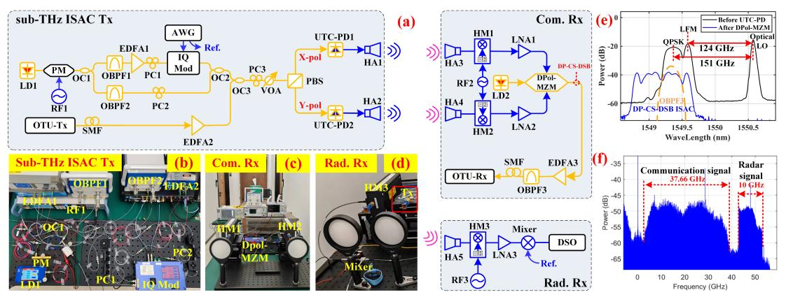
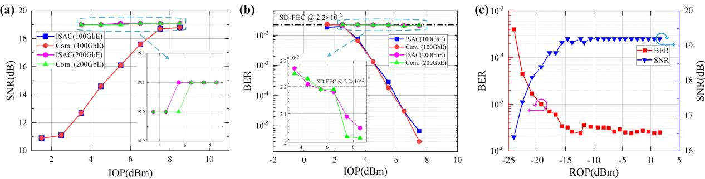
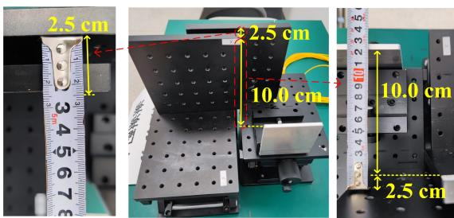
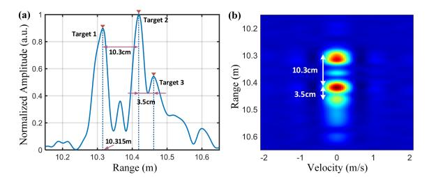

{0}------------------------------------------------

# Demonstration of Photonic Sub-THz ISAC System with Real-Time 251.03-Gbps Communication Rate and Offline 2.5-cm Sensing Resolution

*Mingzheng Lei1,†, Zhidong Lyu2,†, Qingzhi Zhou3 , Junhao Zhang3 , Hao Li3 , Bingchang Hua1 , Jiao Zhang1 , Yuancheng Cai1 , Junjie Ding1 , Xingyu Chen1 , Lu Zhang2,\*, Jianjun Yu1,4 , and Min Zhu1,3,\**

(1) Purple Mountain Laboratories, Nanjing 211111, China

\*E-mail: minzhu@seu.edu.cn, zhanglu1993@zju.edu.cn

*Abstract—***The intelligence of future society necessitates an immediate requirement for ultra-high-speed communication and ultra-resolution sensing in the 6G era. In this demonstration, we present a photonic sub-THz integrated sensing and communication system. The demonstrated system achieves a real-time line rate of 251.03 Gbps and an offline sensing resolution of 2.5 cm, resulting in an impressive capacityresolution quotient of up to 100.41 Gbps/cm. The ultra-highspeed real-time communication is based on a fiber-THz-fiber transmission architecture, which boasts ultra-wideband realtime processing capability. Meanwhile, the ultra-resolution sensing is accomplished utilizing an optical frequency comb with low frequency offset and low phase noise.** 

*Keywords—integrated sensing and communication; real time; sub-THz; photonics*

#### I. INTRODUCTION

The sixth-generation (6G) mobile communication network is under active development worldwide to meet the growing demand for advanced communication services in future society. Wireless communication frequency bands are gradually transitioning to higher frequency ranges, encompassing millimeter-wave (mmW) and terahertz (THz), to fulfill the ultra-high data rate requirements of future 6G. Integration of sensing and communication in mmW and THz bands is a crucial opportunity driven by the application of mmW/THz techniques in radar and mobile communication and the pressing need for collaboration between sensing and communication in prospective intelligent applications. Consequently, integrated sensing and communication (ISAC) has emerged as one of the pivotal 6G hallmarks of IMT-2030.

The construction of mmW/THz ISAC systems using purely electrical means is associated with bandwidth and frequency adjustability limitations. Photonics-aided mmW/THz techniques, with inherent wide bandwidth and flexible reconfigurability, have been extensively explored. A plethora of photonics-assisted ISAC systems in mmW/THz bands have been reported, employing time-division multiplexing (TDM) [1-2], frequency-division multiplexing (FDM) [3-6], and co-time and co-frequency (CTCF) [7-8] mechanisms. Table 1 summarizes some typical existing ISAC

**Tab. 1:** Comparison of photonics-aided ISAC systems

| Wave. Mode  | Wireless Distance (m) | Com. Rate (Gbps) | Sen. Res. (cm) | CRQ (Gbps/cm) |
|----------------|-----------------------------|------------------------|----------------------|------------------|
| TDM[1]         | 1.15                        | 68.6 (OL)              | 2                    | 34.4             |
| TDM[2]         | 50                          | 60 (OL)                | 10                   | 6                |
| FDM[3]         | 1                           | 78 (OL)                | 20                   | 3.9              |
| FDM[4]         | 1.2                         | 18 (OL)                | 0.97                 | 18.557           |
| FDM[5]         | 0.5                         | 40 (OL)                | 0.25                 | 160              |
| FDM[6]         | 0.92                        | 125.516(RT)            | 1                    | 125.516          |
| CTCF[7]        | 2                           | 16 (OL)                | 4.8                  | 3.333            |
| CTCF[8]        | 10.8                        | 92 (OL)                | 1.5                  | 61.333           |
| FDM[This work] | 10.3                        | 251.03 (RT)            | 2.5                  | 100.41           |

systems. In most reported works, the capacity-resolution quotient (CRQ) was constrained to below 50 Gbps/cm. In [5], an ultra-high CRQ was achieved at the expense of a reduced communication rate, and the communication was measured offline (OL). In our previous work [6], real-time (RT) communication was demonstrated; however, processing sensing signals in the digital domain necessitates a widebandwidth analog-to-digital converter, and the wireless range is restricted to less than 1m.

This study experimentally demonstrates a photonics-aided ISAC transmission system at the D band (110-170 GHz), which integrates high-speed real-time communication and high-resolution offline sensing. The proof-of-concept experimental results indicate that a pair of FDM-based sub-THz ISAC signals is successfully transmitted over a 10.3-m wireless distance through a multiple-input multiple-output construction. We successfully achieve a real-time 251.03- Gbps communication rate based on an ultra-wideband fiber-THz-fiber transmission architecture we proposed [9]. Meanwhile, an offline 2.5-cm radial resolution is realized by using an optical frequency comb (OFC) to eliminate the frequency offset and phase noise caused by the free-ruing laser beats. To the best of our knowledge, this is the first achievement of integrating 200 Gbps-scale communication and cm-scale sensing.

# II. SYSTEM DESCRIPTION AND PRINCIPLE

The experiment set-up of the proposed photonic sub-THz ISAC system is shown in Fig.1 (a), which mainly includes the photonic sub-THz ISAC transmitter (Tx), communication receiver (Com. Rx), and radar receiver (Rad. Rx).

(2) College of Information Science and Electronic Engineering, Zhejiang University, Hangzhou 310027, China (3) National Mobile Communications Research Laboratory, Southeast University, Nanjing 210096, China (4) Key Laboratory for Information Science of Electromagnetic Waves, Fudan University, Shanghai 200433, China † Equal contribution

The National Key Research and Development Program (2022YFB2903800), the National Natural Science Foundation of China (62201393 and 62201397), and the Natural Science Foundation of Jiangsu Province (BK20220210 and BK20221194).

{1}------------------------------------------------

**Fig. 1:** (a) Schematic diagram of the proposed system. Photos of the sub-THz (b) transmitter, (c) communication receiver, and (d) radar receiver. (e) Optical spectra at different nodes. (f) Spectrum of down-converted ISAC signals at the communication receiver.

## *A. Photonics-aided sub-THz ISAC transmitter*

In the ISAC Tx, an optical dual-polarization ISAC (DP-ISAC) signal is first generated, and then photonic upconversion is performed to convert the optical DP-ISAC signal to a pair of sub-THz ISAC signals. The optical DP-ISAC signal is produced through the wavelength-division multiplexing (WDM) of a real-time dual-polarization communication (DP-COM) signal with an offline dualpolarization linear frequency-modulated (DP-LFM) signal. The DP-COM signal of 31.38 GBaud is generated by a commercial optical transport unit (OTU) operating in the 100-GbE or 200-GbE modes centered at 1549.32 nm. The modulation format is QPSK/16QAM for the 100-GbE/200- GbE mode. In parallel, an optical LFM signal is generated by offline electro-optic modulation. In order to reduce the impact of frequency offset and phase noise on the sensing function, an OFC centered at 1550.032 nm is generated using a phase modulator (PM). Then, the OFC with a repetition frequency of 31 GHz is divided into two branches by an optical coupler (OC1). The -2nd- and +2nd- order optical lines of the OFC are filtered out by the OBPF1 and OBPF2 as the optical carrier for modulation of the LFM signal and the optical local oscillation (LO) for generation of the sub-THz signals, respectively. Subsequently, a single-polarization LFM (SP-LFM) signal with the 10-GHz bandwidth is generated using a 64-GSa/s arbitrary waveform generator (AWG) and an IQ modulator. Next, the SP-LFM signal is coupled with the optical LO and the DP-COM signal by the OCs. The combined signals are divided into X- and Ypolarizations by a polarization beam splitter (PBS). Thus, a pair of WDM-based DP-ISAC signals are obtained. Afterward, two uni-traveling carrier photodiodes (UTC-PDs) convert the DP-ISAC signals to two parallel sub-THz ISAC signals through the optical heterodyne beats. The spectrogram of the optical signals injected into the UTC-PD is shown in Fig. (e). From the spectrogram, the generated sub-THz communication and LFM signals will be located at 151 GHz and 124 GHz, respectively. The sub-THz FDM-ISAC signals are finally radiated into the free space for wireless communication and sensing. Fig. 1(b) shows the built scenario of the photonics-aided sub-THz ISAC Tx.

#### *B. Communication receiver*

In the Com. Rx, after transmitting over a 10.3-m wireless distance, the sub-THz ISAC signals are received and then down-converted to a pair of intermediate frequencies (IFs). The spectrum of one IF is shown in Fig.1 (f). According to the figure, the received ISAC signals have a favorable signal-tonoise ratio (SNR). The bandwidths of the communication and LFM signals are 37.66 GHz and 10 GHz, respectively, which aligns with the transmitter settings. A laser set at 1549.128 nm from the laser diode (LD2) is sent to a dual-polarization Mach-Zehnder modulator (DP-MZM) operated in carriersuppression double-sideband (CS-DSB) mode. The DP-MZM converts the IFs back to the optical DP-COM signals, as shown in Fig. 1(e). The acquired DP-CS-DSB signal is injected into the OBPF3 to select one of the sidebands that has the same wavelength as the transmitting end. Finally, the chosen sideband is transmitted to the OTU-Rx for high-speed real-time coherent communication demodulation to get the communication bit error ratio (BER) and SNR. Fig. 1(c) shows the sense of the Com. Rx.

## *C. Radar receiver*

In the Rad. Rx, sensing echoes are first down-converted to IFs by the harmonic mixer (HM3). After power compensation, the IFs are mixed with their references from the AWG for dechirping. The de-chirped signals are captured using a 1.25-

**Fig. 2:** (a) SNR and (b) BER of the received ISAC signals and pure communication signals under different IOP of the UTC-PDs; (c) BER and SNR of the received ISAC signals under different ROP.

{2}------------------------------------------------

GSa/s digital storage oscilloscope (DSO) and processed in the digital domain to obtain the two-dimensional (2D) imaging of the targets. Figs. 1(d) shows the scene photos of the Rad. Rx.

#### III. RESULTS AND DISCUSSION

First, we measure the communication SNR and BER versus the average incident optical power (IOP) into the two UTC-PDs by varying the variable optical attenuator (VOA), aiming to investigate the impact of transmitter power on the communication performance. Initially, the OTU is operated in the 100-GbE mode. The measured results are shown by the blue lines in Figs. 2(a) and (b). The figures show that the increase in the IOP leads to a proportional rise in the SNR at the OTU Rx, consequently decreasing the BER. When the IOP is higher than 3.5 dBm, the overall real-time communication performances are below the soft-decision forward-errorcorrection (SD-FEC) threshold. To protect the UTC-PDs, the maximum IOP is set at 8.5 dBm, at which the real-time BER stood at 1.6×10-6 .

We then transmit a pure communication signal to investigate the impact of the sensing signal on the communication performance. The two cases have the same SNR, as shown in Fig. 2(a). Compared with the pure communication case, the BER of the ISAC signal deteriorates slightly, as shown in Fig. 2(b). The sensing signal has minimal influence on the communication function thanks to the sufficient guard band of FDM modulation, as shown in Fig. 1(f).

Fig. 2(c) shows the received optical power (ROP) of the OTU-Rx versus the communication performance by varying the bias current of the EDFA3. When the ROP is in the range of -24.08 dBm to -14.64 dBm, an increase in the ROP leads to an elevation of the SNR, resulting in a reduced BER. The magnitude of this effect regressively diminishes with the ROP. Even if the ROP is as low as -24.08 dBm, the communication BER can still reach 4×10-4 . However, the communication performance cannot be further improved by increasing the ROP from -14.64 dBm to 1.56 dBm.

Subsequently, the OTU is switched to the 200-GbE mode. The SNR can reach 19 dB but exhibits minimal variation with the IOP, as shown in Fig. 2(a). Due to the lower robustness of the 16QAM format compared to the QPSK format, it is not easy for the received DP-QAM16 signals with the 19-dB SNR to exhibit excellent BER. However, the BER can still be below the SD-FEC threshold, as shown in Fig. 2(b). That is, a realtime line rate of 251.03 Gbps is successfully realized.

In the analysis of the sensing function, three metal targets are placed on a fixed platform. The radial spacing between the middle one and the front one is 10 cm, while that between the middle and the back is 2.5 cm, as shown in Fig. 3. The front one is 10.3 m away from the midpoint of the two lenses at the ISAC Tx and Rad. Rx. Fig. 4(a) shows the normalized cross-

**Fig**. 3: Photos of the radar targets.

correlation results between the received IF echoes and the reference signal. Three correlated peaks are clearly visible. The distance between the three correlated peaks is very close to the relative distance between the three targets. The main reason for the error is that the three static metal plates are not essentially ideal point targets. Fig. 4 (b) is the 2D imaging of the targets using the Range-Doppler imaging algorithm. Three targets can be clearly distinguished with the maximum error of 1 cm thanks to the low frequency offset and phase noise possessed by the coherent OFC. Thus, an ultra-high radial sensing resolution of up to 2.5 cm is successfully achieved.

**Fig**. 4: (a) Normalized cross-correlation results. (b) 2D imaging result.

#### IV. CONCLUSIONS

We have presented a photonics-assisted ISAC system at the D-band. The experimental results demonstrate the simultaneous achievement of real-time 251.03-Gbps data rate under the SD-FEC limit and offline 2.5-cm imaging resolution over a wireless distance of 10.3 m. The ultra-high-speed data rate and exceptional radial resolution result in a remarkable CRQ of up to 100.41 Gbps/cm.

#### REFERENCES

- [1] J. Jia, B. Dong, L. Tao, J. Shi, N. Chi, and J. Zhang, "Demonstration of radar-aided flexible communication in a photonics-based W-band distributed integrated sensing and communication system for 6G," Chinese Optics Letters, vol. 22, no. 4, pp. 043901, Apr. 2024.
- [2] Y. Wang et al., "Integrated 1.58 cm range Resolution Radar and 60 Gbit/s 50m Wireless Communication Based-on Photonics technology in Terahertz Band," Optical Fiber Communications Conference and Exhibition, IEEE, 2022, pp. 01-03.
- [3] Y. Wang, J. Liu, J. Ding, M. Wang, F. Zhao, and J. Yu, "Joint communication and radar sensing functions system based on photonics at the W-band," Optics Express, vol. 30, no. 8, pp. 13404-13415, Apr. 2022.
- [4] N. Zhong, P. Li, W. Bai, W. Pan, L. Yan, and X. Zou, "Spectral-Efficient Frequency-Division Photonic Milli-meter-Wave Integrated Sensing and Communication System Using Improved Sparse LFM Sub-Bands Fusion," Journal of Lightwave Technology, vol. 41, no. 23, pp. 7105-7114, 1 Dec. 2023.
- [5] Z. Lyu et al., "Photonic THz-ISAC demonstration with simultaneous 120Gbit/s communication and 2.5mm sensing resolution," in European Conference on Optical Communications, IEEE, 2023, pp. 1650-1653.
- [6] Q. Zhou, M. Lei, J. Jun et al., "A Sub-THz ISAC System with Simultaneous Real-Time 125.516-Gbps Communication Rate and Offline 10-mm Sensing Resolution Enabled by Photonics," submitted to European Conference on Optical Communications 2024.
- [7] F. Liu, P. Li, N. Zhong, X. Deng, L. Yan, W. Pan, and X. Zou, "Millimeter-wave over fiber integrated sensing and communication system using self-coherent OFDM," Optics Express, vol. 32, no. 9, pp. 15493-15506, Apr. 2024.
- [8] M. Lei et al., "Integration of Sensing and Communication in a W-Band Fiber-Wireless Link Enabled by Electromagnetic Polarization Multiplexing," Journal of Lightwave Technology, vol. 41, no. 23, pp. 7128-7138, Dec. 2023.
- [9] J. Zhang, M. Lei, M. Zhu et al., "Optical-terahertz-optical seamless integration system for dual-λ 400 GbE real-time transmission at 290 GHz and 340 GHz," Science China Information Sciences, vol. 66, pp. 214301, Jun. 2023.