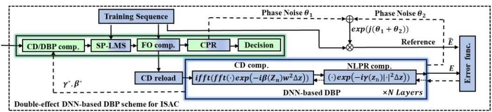
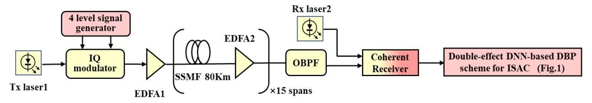
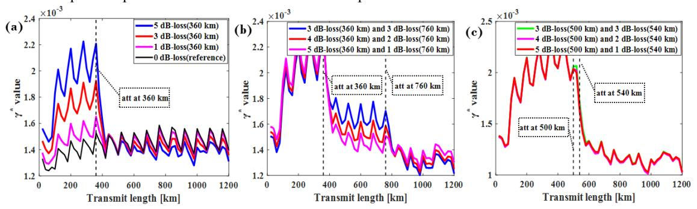

{0}------------------------------------------------

# **Double-effect DNN-based DBP Scheme for Integrated Sensing and Communications (ISAC)**

**Feiyu Li1 , Xian Zhou1\* , Qirui Fan2 , Yuyuan Gao1 , Jiahao Huo1 , Jinhui Yuan1 and Keping Long1**

1University of Science & Technology Beijing (USTB), No.30 Xue Yuan Road, Haidian, Beijing, 100083, China 2Photonics Research Center, Department of Electrical Engineering, The Hong Kong Polytechnic University, Hung Hom, Kowloon, Hong Kong, China

Author e-mail address: zhouxian219@ustb.edu.cn

**Abstract:** A double-effect deep neural network (DNN)-based DBP scheme is developed to integrate communication and sensing, which can mitigate nonlinear interference effectively and estimate optical power distribution accurately through the optimized nonlinear parameters. © 2022 The Author(s)

### **1. Introduction**

Nonlinear interference mitigation is a significant research topic in long-haul, large-capacity and high-speed optical fiber communication systems. The DBP is one of the methods to remove the fiber nonlinearity which use the split-step Fourier method (SSFM) to solve nonlinear Schrödinger equation (NLSE) [1]. In recent years, machine learning (ML) has received great attention and achieved strong benefits for nonlinear compensation [2, 3]. Instead of the common 'black-box' approach, the mathematical structure of neural networks was studied and its physical mechanism for nonlinear compensation was revealed in [4]. In another work of NTT, the method based DBP with small step size was used to estimate the dispersion distribution and detect the abnormal loss points [5]. However, above technologies are separated from transmission and sensing. In the future, we hope to realize the integration of sensing communications (ISAC) scheme in order to ensure communication operation and monitor channel status at the same time without additional bandwidth overhead and hardware equipment [6].

In this paper, a double-effect DNN-based DBP scheme is proposed to realize ISAC for implement nonlinear compensation and monitor link status simultaneously. Its feasibility and effectiveness are verified in a 28-GBaud 16-QAM coherent system over 15×80 km SSMF transmission. In addition to nonlinear compensation result, the monitoring effect of abnormal loss points which including the multiple abnormal loss points at the same position, at different span and at the same span, is also shown. In this case, the function of ISAC can be achieved based on the received signal without any other measuring instruments.

# **2. Double-effect DNN-based DBP scheme for ISAC**

Due to DBP is similar to DNN in structure, a Neural Network can be used to build the mathematical structure of DBP [7]. However, it is difficult to update the DNN-based DBP module at the beginning of DSP, since the update processing will go through all the compensation processing which leads to high complexity, low time efficiency and low stability. In order to overcome this obstacle and achieve an effective ISAC, a doubleeffect DNN-based DBP scheme is proposed as shown in Fig.1.

Fig. 1 The detailed structure of Double-effect DNN-based DBP scheme for ISAC.

Considering that it is usually to use training sequence to compensate the fiber link impairment for highspeed optical communication system, the training sequence is further exploited in our scheme to avoid additional training costs. For the early training stage, dispersion compensation is performed and the signalphase aid least-mean-square (SP-LMS) algorithm is used to achieve adaptive equalization and compensate polarization correlation effect [8], followed by using training sequence to estimate laser frequency offset [9]. After FOE, the signal will enter two branches for processing. For the lower branch, the signal is reload dispersion to reconstruct the signal containing dispersion and nonlinear damage. Then, the signal is sent to DNN-based DBP scheme for parameters update. In DNN-based DBP, the number of layers is the total

{1}------------------------------------------------

transmission distance divided by step size of the SSFM, which represents the distance resolution of the optical fiber propagation. By doing that a neural network can be built. Then, the error function I can be calculated by using the output signal E that is obtained by the neural network and the reference signal  $\hat{E}$ , which is defined as:  $I = \arg\min \|E - \widehat{E}\|^2$ . In order to obtain the accurate reference signal  $\widehat{E}$ , the phase noise consisting of two parts is reload to training sequence. One part phase noise is estimated in CPR by using the blind phase search (BPS) technique. The other part phase rotation is caused by the DNN-based DBP compensation network, which can be found by pre-compensation. By doing so, the difference between the two signals is whether it contains dispersion and nonlinear damage. Finally, make the output signal as similar as possible to the reference signal is our goal, which can be regarded as a classic supervised machine learning. For neural network training process, all  $\beta^*$  and  $\gamma^*$  are set to averaged values of estimated total dispersion and 0 as initial values. The number of iterations and learning rate  $\mu$  are set to 50 and 0.0001. Therefore, for kth step (where k = 1, 2 ... N) of DBP in DNN, the estimated parameters for linear and nonlinear compensation, namely  $\beta_k^*$  and  $\gamma_k^*$ , can be optimized based on  $\beta_k^*(m+1) = \beta_k^*(m) - \mu \cdot \partial I/\partial \beta_k^*(m)$ ,  $\gamma_k^*(m+1) = \gamma_k^*(m) - \mu \cdot \partial I/\partial \gamma_k^*(m)$ , where m is the update times,  $\mu$  is the learning rate. The optimized  $\gamma^*$  and  $\beta^*$  values can be used to standard DBP module for nonlinear compensation. Then, the signal is recovered through the subsequent DSP process and the bit error rate is applied to check the compensation effect. At the same time, the characteristics of the  $\beta^*$  and  $\gamma^*$  parameters can be used to estimate dispersion distribution and detect abnormal loss.

#### 3. Results and Discussion

In order to verify the feasibility and effectiveness of the DNN-based DBP scheme for ISAC, a 28-GBaud 16-QAM coherent optical system is built over a  $15 \times 80$  km SSMF transmission link as shown in Fig.2. Here, fiber attenuation coefficient is 0.2dB/km, the coefficients of dispersion and nonlinearity are  $17 \, ps/nm/km$  and  $1.3w^{-1}km^{-1}$  respectively. In the transmitter, a root cosine filter with roll-off factor of 0.18 is used for pulse shaping. For the fiber link, the optical amplifier with a 6 dB of noise figure is used to compensate the power loss of each span. The optical attenuators can be inserted in fiber link to simulate excess loss points. The laser linewidth of transmitter and receiver are both 100 kHz, and 1GHz frequency offset is considered. After coherent receiver, the electrical signal is sent to the double-effect DNN-based DBP scheme for data recovery. Here, about 15,000 training symbols and Adam optimizer are used to updated parameters. The nonlinear compensation effects are demonstrated by another data set which never be used to training. All algorithms are coded in MATLAB and Python 3.9 and the training result can be returned within about a minute.

Fig. 2 Optical fiber link settings for verify the double-effect DNN-based DBP scheme for ISAC.

#### 3.1 Nonlinear interference mitigation

Based on obtained the optimized  $\gamma^*$  and  $\beta^*$  value, nonlinear compensation effects are investigated. Here, considering the launch power range of -4.0 dBm to 6.0 dBm and the step is 1.0 dBm. Besides, the different

Fig. 3 (a) Nonlinear interference mitigation effects for different step size and launch power. (b) Optimized  $\gamma^*$  by DNN-based DBP method with 3 dBm launch power and the step size is 20 km.

{2}------------------------------------------------

step size is studied for the effect of nonlinear compensation. From Fig. 3(a), the result shows that the smaller the step size, the effect is better. When the step size is set to 20 km, the optimized ∗ values are approximately the cumulative amount within this step size and ∗ values reflect the power distribution and the position of optical amplifier in the fiber link as shown in Fig. 3(b).

## **3.2 Abnormal loss detection**

Figure 4(a) shows the abnormal loss of 5 dB, 3 dB, and 1 dB are inserted at 360 km respectively to simulate excess loss points and the normal link (0 dB-loss) is used as reference. Here, the step is set to 20 km for a fine distance resolution. When abnormal loss occurs in the link, the ∗ values near the loss point will drop sharply and show the greater the abnormal loss, the greater the steep drop. Next, there are two abnormal loss points are set to (3 dB, 3 dB), (4 dB, 2 dB), (5 dB, 1 dB) at 360 km and 760 km respectively. From Fig. 4(b), the position of abnormal loss points can be found clearly by observe the two sharply decreasing bands. However, it is worth noting that no matter how large the abnormal loss when two loss points in same fiber span, we only found one sharp drop band from Fig. 4(c). This means the loss monitoring effect will be reduced when multiple loss points are located in the same fiber span.

Fig. 4 Optimized ∗ values (a) for adding different losses at 360 km, (b) for adding different losses at 360 km and 760 km respectively, and (c) for adding different losses at 500 km and 540 km respectively but within the same span of the fiber link.

## **4. Conclusion**

In this work, the feasibility of double-effect DNN-based DBP scheme is used for implementing ISAC is verified, which can not only compensate nonlinear damage, but also estimate the power profile in the fiber link from the parameter characteristics. This is a potential method for accurately sensing the link status and making strategies to ensure communication operations.

#### **Acknowledgements**

This work was supported by the National Key Research and Development Program of China (2019YFB1803905), the National Natural Science Foundation of China (No. 61871030, No. 62171022), Guangdong Basic and Applied Basic Research Foundation (2020A1515111047), the Fundamental Research Funds for the Central Universities (No. FRF-GF-18-015B), the Scientific and Technological Innovation Foundation of Shunde Graduate School, USTB (No. BK19AF005) and the Foundation of Beijing Engineering and Technology Center for Convergence Networks and Ubiquitous Services.

#### **References**

- [1] E. Ip and J. M. Kahn, "Compensation of dispersion and nonlinear impairments using digital backpropagation" J. Lightw. Technol. 26, 3416–3425 (2008).
- [2] C. Hager *et al.*, "Nonlinear interference mitigation via deep neural networks", in Proc. of OFC 2018, W3A.4, (2018).
- [3] V. Oliari *et al*., "Revisiting efficient multi-step nonlinearity compensation with machine learning: An experimental demonstration". J. Lightw. Technol. 38(12), 3114-3124 (2020).
- [4] Q. Fan *et al.,* "Advancing theoretical understanding and practical performance of signal processing for nonlinear optical communications through machine learning. " Nat Commun. 11(1), 1-11 (2020).
- [5] T. Sasai *et al*., "Simultaneous detection of anomaly points and fiber types in multi-span transmission links only by receiver-side digital signal processing."in Proc. of OFC 2020, Th1F.1, (2020).
- [6] D. K. Pin Tan *et al*., "Integrated Sensing and Communication in 6G: Motivations, Use Cases, Requirements, Challenges and Future Directions." in Proc. of JC&S 2021.
- [7] B. I. Bitachon, *et al*., "Deep learning based digital backpropagation demonstrating SNR gain at low complexity in a 1200 km transmission link." Opt. Express, 28(20), 29318-29334 (2020).
- [8] X. Zhou *et al*., "112 Gb/s transmission over 80 km SSMF using PDM-PAM4 and coherent detection without optical amplifier." Opt. Express, 24(15), 17359-17371 (2016).
- [9] X. Zhou *et al*., "Wide-range frequency offset estimation algorithm for optical coherent systems using training sequence." IEEE Photon. Technol. Lett, 24(1), 82-84 (2011).