{0}------------------------------------------------

# Coexistence of Distributed Sensing and Ultra-Simple Coherent RoF Based Front-Haul for Radio Access Network

Maoqi Liu10, Jingchuan Wang10, Chen Liu10, Senior Member, IEEE, Changyuan Yu10, Fellow, OSA, and Chao Lu10, Fellow, OSA

Abstract—The radio access network requires high-speed transmission and multifunctionality to support the increasing demand for advanced communication services. Radio-over-fiber (RoF) technology fulfills these requirements by enabling the delivery of millimeter-wave (MMW) band wireless signals via optical fiber front-haul. This paper presents an ultra-simple RoF system that achieves the coexistence of distributed sensing and telecommunication. A commercially available coherent modulator achieves signal modulation and remote up-conversion by the beat between the residual carrier and the modulated radio signal. The linearfrequency modulated carrier enables distributed sensing while simultaneously serving as the beat tone of RoF communication, showcasing the potential for integrated sensing and communication (ISAC) applications in next-generation radio access networks. We demonstrate the sensing and transmission performance over a 10-km fiber link and a 1-m wireless MMW channel. The system achieves a distributed sensing detection sensitivity of 28 p $\varepsilon/\sqrt{\text{Hz}}$ and supports 1.6 GBaud 16 QAM radio transmission in the Kaband of 28 GHz.

Index Terms—Integrated sensing and communication, linear frequency modulation, optical fiber sensing, radio-over-fiber.

#### I. INTRODUCTION

S the telecommunication industry moves towards the fifth generation of fixed networks (F5G), there is a rising demand for higher data rates and enhanced functionalities within the radio access network (RAN) [1], [2], [3]. The particularly significant segment of RAN is the front-haul, which connects active antenna units (AAUs) to distribute units (DUs) [4], [5],

Received 25 December 2024; revised 16 March 2025; accepted 25 March 2025. Date of publication 27 March 2025; date of current version 16 June 2025. This work was supported in part by the National Key Research and Development Program of China under Grant 2023YFB2905300 and in part by Hong Kong Government under Grant HK RGC GRF 15209321 B-Q85G. (Maoqi Liu and Jingchuan Wang contributed equally to this work.) (Corresponding author: Jingchuan Wang.)

Maoqi Liu and Chen Liu are with the National Engineering Laboratory for Next Generation Internet Access System, School of Optical and Electronic Information, Huazhong University of Science and Technology, Wuhan 430074, China (e-mail: maoqi.liu@connect.polyu.hk; liuchen@hust.edu.cn).

Jingchuan Wang, Changyuan Yu, and Chao Lu are with the Photonics Research Institute, Department of Electrical and Electronic Engineering, The Hong Kong Polytechnic University, Hong Kong SAR, China (e-mail: jingchuan98.wang@connect.polyu.hk; changyuan.yu@polyu.edu.hk; chao.lu@polyu.edu.hk).

Color versions of one or more figures in this article are available at https://doi.org/10.1109/JLT.2025.3555486.

Digital Object Identifier 10.1109/JLT.2025.3555486

[6]. Radio-over-fiber (RoF) technology leverages optical devices and fiber links to enable the modulation and front-haul transmission of microwave signal, offering seamless integration of microwave technology and fiber-optic communication [7], [8], [9]. Optical heterodyne detection-based analog RoF systems present a promising solution by remotely generating modulated microwave signals without requiring a local laser source at the AAU side. This approach enables polarization multiplexed detection using only two photodetectors (PDs), significantly reducing the complexity and cost of coherent RoF systems [10], [11], [12]. Furthermore, a single dual drive Mach-Zehnder modulator (DD-MZM) or IQ modulator is employed to achieve optical I/Q up-conversion, simultaneously generating signal and local oscillator (LO) light for heterodyne coherent detection [13].

Integrated sensing and communication (ISAC) has become a prominent research focus in wireless and optical fiber communication, allowing real-time network awareness and environmental sensing without additional infrastructure. When ISAC is implemented over a RoF system, it combines the strengths of both technologies, making RoF-based ISAC an optimal solution for intelligent and adaptive front-haul networks. Recent studies have demonstrated the potential of ISAC in RoF systems. Distributed acoustic sensing (DAS) utilizes Rayleigh backscattering to detect subtle changes in the fiber link, enabling real-time monitoring of external disturbances [14], [15], [16]. DAS has been successfully applied to front-haul access networks, enhancing system capabilities for both communication and sensing [17]. Furthermore, a cost-effective ISAC paradigm has recently been proposed for access networks by applying digital subcarrier multiplexing (DSCM) [18]. Expanding ISAC capabilities to RAN promises to enhance the intelligence and adaptability of front-haul and access network segments, laying the groundwork for an integrated communication and sensing framework across both optical fiber and wireless radio domains. Currently, RoF-based ISAC systems typically employ linear frequency modulation (LFM) signal as a sensing probe to perform ranging and angle estimation within wireless channels [19], [20]. However, these methods often require separate branches to generate communication and sensing signals, resulting in low hardware-sharing efficiency. Moreover, they primarily focus on sensing functionalities in the wireless domain while neglecting the potential for sensing in optical fiber

0733-8724 © 2025 IEEE. All rights reserved, including rights for text and data mining, and training of artificial intelligence and similar technologies. Personal use is permitted, but republication/redistribution requires IEEE permission. See https://www.ieee.org/publications/rights/index.html for more information.

{1}------------------------------------------------

Previously, we demonstrated a method adopting LFM carrier to achieve optical fiber ISAC in RoF systems [21]. This approach employs an MZM to generate a high-frequency double-sideband LFM carrier. The lower sideband is modulated with transmission data, while the upper sideband serves as both a continuous sensing probe and a carrier for RoF communication. This configuration enables the coexistence of distributed sensing and forward communication over a single optical fiber. However, the modulation process introduces an additional optical branch, requiring extra components such as a wavelength selective switch (WSS) and an Erbium-doped fiber amplifier (EDFA) for dual-sideband diversity processing and amplification. Furthermore, due to the high-frequency nature of the LFM carrier, the sensing reception requires a second laser operating at a different frequency for local oscillation.

In this paper, we propose an ultra-simple system that integrates distributed sensing and RoF communication. By intentionally setting the bias points in each MZM within the coherent driver module (CDM), we simultaneously modulate the communication signal and achieve the up-conversion of the baseband radio signal without an extra optical branch. To address the nonlinear distortion introduced by the CDM, we employ a probabilistic constellation shaping (PCS) QAM signal and a precompensation algorithm to optimize transmission performance. A continuous low-frequency LFM carrier is utilized to serve as the sensing probe. This LFM-based RoF system not only facilitates distributed sensing but also mitigates the fiber nonlinear effects, leading to a slight improvement in communication performance. Remarkably, the entire system operates with a single laser to achieve polarization diversity reception for the sensing side and the generation of ISAC signal. We evaluate the performance of the RoF system through mixed transmission over fiber and wireless channels. We achieved distributed sensing of vibration signals across different frequencies and intensities in the fiber link. While in the forward communication process, we successfully demonstrated stable transmission of a 1.6 Gbaud 16-QAM signal in the Ka-band of 28 GHz. This integration of distributed sensing and a simplified communication transmission architecture opens up new possibilities for RoF front-haul network solutions.

#### II. THEORETICAL ANALYSIS

#### A. Modulation Principle of IQ Modulator

Fig. 1(a) illustrates the structure of the IQ modulator used to generate the modulated signal. The IQ parent MZM comprises two child MZMs and a phase modulator(PM). In the typical push-pull operation mode of a child MZM, the voltages applied to the two arms ( $V_1$  and  $V_2$ ) are equal in magnitude but opposite in sign. The input optical field  $E_{in}$  is split equally into the two arms of the MZM. The phase shifts introduced in the upper and lower arms are controlled by the voltages  $V_1$  and  $V_2$ , respectively. Assuming a linear relationship with the input voltage in the Electro-optical materials, the phase shifts of arm1  $\phi_1$  and arm2  $\phi_2$  can be expressed as

$$\phi_1 = \frac{\pi V_1}{V_{\pi}}, \quad \phi_2 = \frac{\pi V_2}{V_{\pi}},$$
 (1)

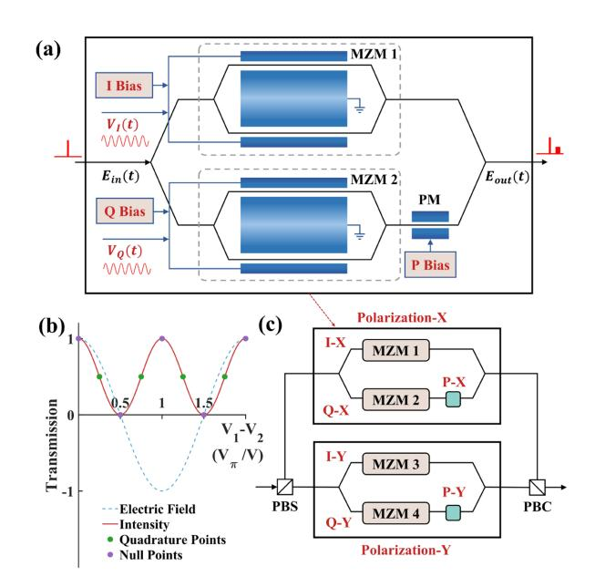

Fig. 1. (a) Structure of the IQ modulator. (b) The characteristic curve of the MZM and bias points. (c) Structure of a commercial CDM device and relevant bias points.

where  $V_{\pi}$  is the half-wave voltage required to induce a  $\pi$ -phase shift.

After the two arms recombine at the output of the MZM, the resulting optical field can be expressed as

$$E_{MZM} = \frac{1}{2} E_0 \left( e^{j\phi_1} + e^{j\phi_2} \right), \tag{2}$$

where  $E_0$  is the input field of MZM and  $E_{MZM}$  is the output field of MZM. Substituting (1) and introducing  $V_1 = -V_2$  for a push-pull mode of MZM, the output field becomes

$$E_{MZM} = E_0 \cos\left(\frac{\pi \left(V_1 - V_2\right)}{2V_{\pi}}\right). \tag{3}$$

The input field  $E_0$  is designed as an LFM carrier, which can be expressed as

$$S_{\text{lfm}}(t) = A \operatorname{rect}\left(\frac{t}{T}\right) e^{j\left(2\pi f_0 t + \pi k t^2\right)},\tag{4}$$

where A is the amplitude of the carrier,  $k = \frac{B}{T}$  is the chirp rate, where B is the bandwidth of the LFM carrier and T is the duration of the chirp. Notably, the LFM carrier is continuous, but its frequency is discontinuous between communication frames due to bandwidth and hardware limitations. Thus, T represents both the chirp period and the duration of the communication frame.  $f_0 = f_{\rm cw} + f_{\rm st}$  is the initial frequency, with  $f_{\rm cw}$  being the center frequency of the laser and  $f_{\rm st}$  the start frequency of the LFM carrier.

When extending the operation of one child MZM to the IQ parent MZM, the output optical field incorporates both in-phase (I) and quadrature (Q) components of the signal. The input optical field  $E_{in}$  is split into two components. The I-arm child MZM introduces a phase modulation proportional to the applied voltage  $V_I(t) = V_{I1}(t) - V_{I2}(t)$ . The Q-arm child MZM modulates the optical field with a voltage  $V_Q(t) = V_{Q1}(t) - V_{Q2}(t)$ , introducing a phase shift  $\varphi$  by phase modulator (usually  $+\pi/2$ )

{2}------------------------------------------------

to ensure quadrature operation. Refer to (3), we can get the expressions for  $E_I(t)$  and  $E_Q(t)$ , and the combined field  $E_{\rm out}(t)$  of IQ modulator can be expressed as

$$E_{\text{out}}(t) = \frac{1}{2} S_{\text{lfm}}(t) \left[ \cos \left( \frac{\pi V_I(t)}{2V_{\pi}} \right) + \cos \left( \frac{\pi V_Q(t)}{2V_{\pi}} \right) e^{j\varphi} \right]. \quad (5)$$

In an IQ modulator, the applied voltages  $V_I(t)$  and  $V_Q(t)$  consist of two components: a direct current (DC) component and an alternating current (AC) component. These can be expressed as

$$V_I(t) = V_{I,\text{bias}} + I(t), \quad V_Q(t) = V_{Q,\text{bias}} + Q(t),$$
 (6)

where  $V_{I,\mathrm{bias}}$  and  $V_{Q,\mathrm{bias}}$  are the DC components applied to the in-phase and quadrature arms, respectively. These biases set the operating point of the MZM, as shown in Fig. 1(b). I(t) and Q(t) are the AC components carrying information that modulate the optical field.

#### B. Proposed Modulation Scheme of CDM

In the commercially available coherent driver module (CDM), as shown in Fig. 1(c), each of the X and Y polarization states has three bias voltage points that can be set intentionally. Taking the X-polarization as an example, XI, XQ, and XP correspond to  $V_{\rm I,bias}$ ,  $V_{\rm Q,bias}$ , and  $\varphi$ , respectively.

In our proposed scheme,  $\varphi$  is set to be  $\pi/2$ ,  $V_{\rm I,bias}$  and  $V_{\rm Q,bias}$  are set to the quadrature point positions, specifically  $V_{\rm I,bias} = V_{\rm Q,bias} = \frac{3}{2}V_{\pi}$ . Combined with (5) and (6), the output optical fields for the X-polarization can be expressed as

$$E_{\rm X}(t) = S_{\rm comm}(t) + S_{\rm carr}(t), \tag{7}$$

where  $S_{\rm comm}(t)$  is the signal carrying communication information,  $S_{\rm carr}(t)$  is the remaining component of the carrier, and they can be expressed as:

$$S_{\text{comm}}(t) =$$

$$\frac{\sqrt{2}S_{\text{lfm}}(t)}{4} \left[ \sin \left( \frac{\pi}{2V_{\pi}} I(t) \right) + j \sin \left( \frac{\pi}{2V_{\pi}} Q(t) \right) \right], \quad (8)$$

$$S_{\rm carr}(t) =$$

$$\frac{\sqrt{2}S_{\text{lfm}}(t)}{4} \left[ \cos \left( \frac{\pi}{2V_{\pi}} I(t) \right) + j \cos \left( \frac{\pi}{2V_{\pi}} Q(t) \right) \right]. \tag{9}$$

For the communication signal  $S_{\rm comm}(t)$ , we apply an upconversion modulation, where the frequency shift  $f_{\rm IF}$  is controlled to fall within the intermediate frequency (IF) range required by the RoF antenna for transmission. This approach effectively separates the carrier and communication spectrum in the frequency domain, as illustrated in Fig. 2(a). Since I(t) and Q(t) are tiny compared to the overall bias voltage, higher-order Taylor series of functions  $\sin(x), \cos(x)$  become negligible, and  $S_{\rm comm}(t)$  and  $S_{\rm carr}(t)$  can be approximated as

$$S_{\text{comm}}(t) \approx S_{\text{lfm}}(t)e^{j2\pi f_{\text{IF}}t} \left( I(t) + jQ(t) \right), \tag{10}$$

$$S_{\rm carr}(t) \approx S_{\rm lfm}(t),$$
 (11)

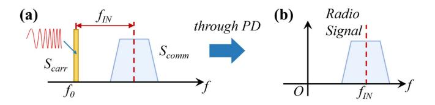

Fig. 2. Theoretical signal spectrum (a) after CDM modulation and (b) after beat-frequency detection by PD.

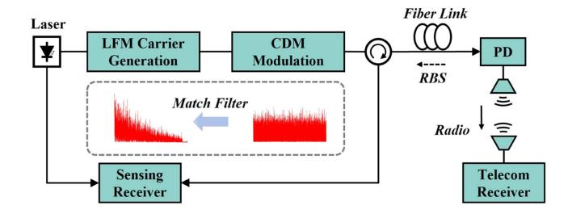

Fig. 3. Conceptual diagram of the RoF-based ISAC scheme.

where constant terms are typically omitted to simplify analysis. On the communication side, the signal  $E_{\rm X}(t)$  passes through the PD, undergoing square-law detection. The output power can be expressed as

$$P_{X}(t) = |E_{X}(t)|^{2} = |S_{carr}(t)|^{2} + |S_{comm}(t)|^{2} + 2 \operatorname{Re}\{S_{carr}^{*}(t)S_{comm}(t)\},$$
(12)

where  $|S_{\text{carr}}(t)|^2$  and  $|S_{\text{comm}}(t)|^2$  corresponds to the power of the carrier and communication signal. The radio signal can be obtained by removing these undesired DC components, the spectrum of which is shown in Fig. 2(b).

## C. RoF-Based ISAC Scheme

The conceptual diagram of the RoF-based ISAC system is illustrated in Fig. 3. The forward-transmitted radio signal propagates through free space and is captured by the telecommunication receiver to continue the communication digital signal process (DSP).

Concurrently, The LFM carrier is processed at the sensing receiver to remove the communication signal and extract the fiber link information. The received Rayleigh backscattering (RBS) sensing signal r(t) can be seen as the convolution between the LFM carrier and the impulse response h(t) of the fiber link:

$$r(t) = S_{\text{lfm}}(t) * h(t), \tag{13}$$

where '\*' denotes the operation of convolution. Similar to the principle of pulse compression, we employ a matched filter at the coherent receiver to process the signal:

$$r_f(t) = S_{\rm lfm}(t) \otimes r(t) = [S_{\rm lfm}(t) \otimes S_{\rm lfm}(t)] * h(t), \quad (14)$$

where  $r_f(t)$  represents the recovered sensing signal, the operator ' $\otimes$ ' represents the correlation operation. Considering a single frame of the communication carrier as a frame duration T, the autocorrelation result of the LFM carrier can be formally

{3}------------------------------------------------

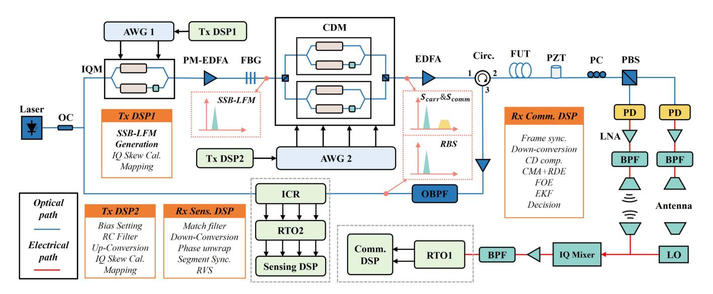

Fig. 4. Experimental setup of RoF-based ISAC system.

expressed as

$$S_{\rm lfm}(t) \otimes S_{\rm lfm}(t) \approx A^2 T {\rm Sa}(\pi B t) {\rm rect}\left(\frac{t}{2T}\right),$$
 (15)

where  $Sa(\pi Bt)$  represents the sinc function  $\frac{\sin(\pi Bt)}{\pi Bt}$ . The full width at half maximum (FWHM) of the autocorrelation function is determined by the chirp bandwidth B of the LFM carrier. The FWHM can be reduced by increasing the chirp bandwidth, which greatly enhances detection accuracy and spatial resolution of backscattering sensing.

### III. EXPERIMENTAL RESULTS AND DISCUSSION

#### A. Experimental Setup

The experimental setup is depicted in Fig. 4. A narrowlinewidth laser (NKT E15) serves as the light source, with its output split by a coupler into two paths. One path provides local oscillator light for the integrated coherent receiver (ICR), enabling sensing signal reception. The other path is directed to a polarization-maintained (PM) IQ modulator operating at the null point. A real-valued LFM carrier, generated by an arbitrary waveform generator (AWG, Keysight 8190 A) with a start frequency of 400 MHz and a sweep bandwidth of 50 MHz, is continuously applied to the modulator, producing a single-sideband LFM carrier. Subsequently, the LFM carrier is amplified by a PM EDFA and passed through a fiber Bragg grating (FBG) to suppress ASE noise and residual carrier components. The purified LFM carrier is then sent to a commercial CDM. Another AWG (Keysight 8196 A) is used to load a 1.6 GBaud 16QAM signal, which is upconverted to 28 GHz, onto the LFM carrier via the previously described multi-bias point modulation scheme. After modulation by the CDM, the optical signal is amplified by an EDFA and transmitted through a 10-km fiber under test (FUT) with a 10-m piezoelectric transducer (PZT) connected at the far end.

Upon transmission, the signal is split by a PBS into two paths, each received by a PD. A polarization controller (PC) is typically

employed to equalize the polarization powers at the receiver, which can be replaced by automatic polarization control (APC) in practical implementations. The electrical signal output from the PDs undergoes DC blocking through bandpass filtering, followed by amplification using low-noise amplifiers (LNAs). It is then transmitted via a bandpass filter (BPF) to remove amplifier noise. Subsequently, the radio signal is transmitted to the wireless channel through two antennas. On the communication receiver side, the signal is captured by antennas and processed through an IQ mixer. After going through an LNA and a BPF, the radio signal is acquired by a digital real-time oscilloscope (RTO, Keysight DSAZ594 A). On the sensing side, the receiver employs a phase-sensitive optical time-domain reflectometry ( $\phi$ -OTDR) technique based on chirped pulse compression to extract channel information from the RBS signal. Matched filtering is applied to the received RBS signal to enhance sensing power and achieve ultra-high spatial resolution dominated by the LFM bandwidth. The sensing receiver adopts polarization-diverse reception, consisting of an ICR (Neophotonic class 40) and another RTO (Keysight MSOS404A). The DSP flows for both sensing and communication are included in the diagram.

#### B. Sensing Performance

A 500 mV Vpp 400 Hz sine wave was applied to the 10-m PZT, and the received signal was processed employing a matched filter. Polarization-coherent reception significantly mitigated polarization fading, resulting in the backscattering signal intensity trace depicted in Fig. 5(a). The signal-to-noise ratio (SNR) was estimated to be approximately 16 dB from the intensity profile. The LFM carrier enabled the implementation of the rotate-vector summed (RVS) algorithm [22]. By employing five 10 MHz matched filters, traces corresponding to five distinct frequency bands were directly extracted, effectively mitigating interference fading. The post-RVS intensity profile is shown in Fig. 5(b), from which the vibration location can be accurately identified.

{4}------------------------------------------------

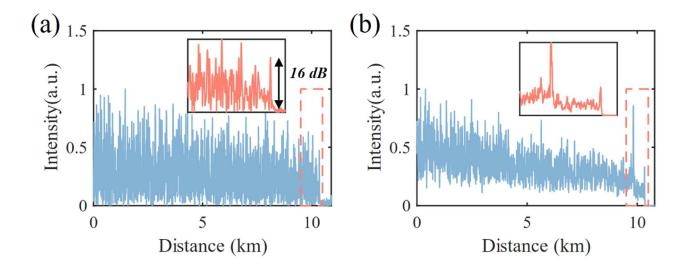

Fig. 5. Intensity trace (a) before RVS and (b) after RVS.

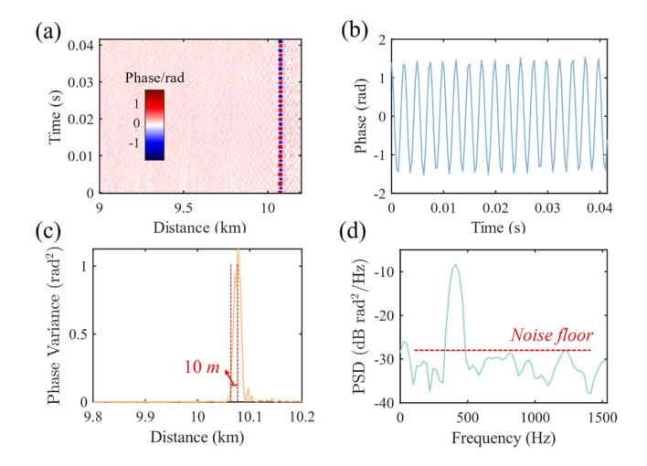

Fig. 6. (a) Phase waterfall plot along 10-km fiber. (b) Phase waveform at the vibration point. (c) Spatial distribution of phase variance. (d) PSD of phase variation at 10.08 km.

Fig. 6(a) presents the phase waterfall plot, showing the temporal evolution of the RBS signal along a 10-km fiber. The phase waveform at the vibration point is extracted and plotted in Fig. 6(b), with the periodic oscillations confirming the dynamic disturbance introduced by the 10 m PZT at the fiber end. Fig. 6(c) illustrates the spatial distribution of phase variance at a specific time instance, showing a sharp peak around 10.08 km, corresponding to a spatial resolution of 10 m. This spatial resolution is related to the chirped LFM carrier bandwidth and the number of RBS traces divided by the RVS algorithm. Fig. 6(d) shows the power spectral density (PSD) of the phase variation at 10.08 km, with the dominant frequency matching the 400 Hz applied perturbation. The noise floor is maintained below −27 dB rad2/Hz, corresponding to a strain resolution of 28 pε/√ Hz.

The impulse response of the sensing system to vibration intensity is calibrated by varying the driving voltage of the PZT from 100 mV to 800 mV in steps of 100 mV. The peak-to-peak phase values are calculated and shown in Fig. 7(a). The results indicate a linear relationship between the phase value and the applied voltage, corresponding to the vibration amplitude. We evaluated the sensing sensitivity (SS) and sensing SNR under varying launch power levels before the FUT. The results indicate that SNR and SS remain nearly constant regardless of the launch power, as shown in Fig. 7(b). While higher launch power enhances the RBS signal intensity, it simultaneously increases

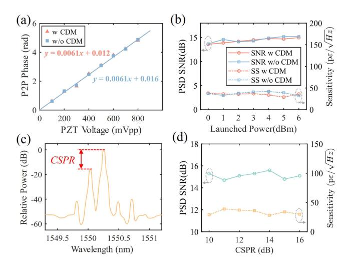

Fig. 7. (a) Peak-to-peak phase variation as a function of PZT voltage with and without CDM modulation. (b) SNR and SS in relation to launch power from 0 dBm to 6 dBm. (c) Optical spectrum after CDM modulation. (d) SNR and SS in relation to CSPR from 10 dBm to 16 dBm.

the ASE noise introduced by the EDFA and modulation-induced noise. It demonstrates that the sensing accuracy and sensitivity are mainly independent of the launch power.

Furthermore, experiments were conducted without CDM modulation to assess the impact of CDM modulation on sensing performance. As illustrated in Fig. 7(a) and (b), the inclusion of CDM introduces minimal influence in sensing performance, thereby validating the feasibility of integrating CDM-modulated signal into chirp φ -OTDR systems. According to the analysis before, the light entering the FUT consists of two components: the LFM carrier and the communication signal modulated at 1.6 GBaud. The center frequencies of these two components are separated by 28 GHz, the spectrum of which is illustrated in Fig. 7(c). By varying the carrier-to-signal power ratio (CSPR) and calculating the PSD of the extracted vibration waveform, the relationship between sensing sensitivity and CSPR is obtained, as shown in Fig. 7(d). Obviously, variations in the power of the communication signal have little effect on sensing performance. This is due to the exclusive use of the carrier for sensing, while the high-frequency communication signal is effectively suppressed at the sensing receiver.

Subsequently, the sensing system was tested with vibrations at different frequencies. Fig. [8\(a\)](#page-5-0) illustrates the PSD of the phase signal for vibrations at 50 Hz, 400 Hz, and 1000 Hz, where distinct peaks corresponding to each vibration frequency are visible. Furthermore, the SNR and sensing sensitivity at different frequencies remained highly consistent, demonstrating the robustness of the LFM-based system in detecting vibrations across a wide frequency range. Fig. [8\(b\)](#page-5-0) and [\(c\)](#page-5-0) illustrate the time-domain phase responses for 50 Hz and 1000 Hz sinusoidal vibrations, respectively.

## *C. Transmission Performance*

The transmission performance of the system was evaluated by utilizing an IQM-modulated LFM optical carrier and a

{5}------------------------------------------------

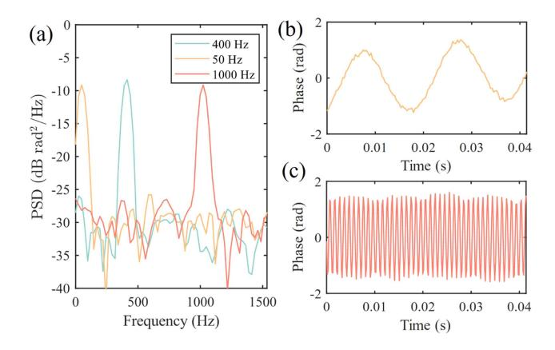

Fig. 8. (a) PSD of phase variation for vibrations at 50 Hz, 400 Hz, and 1000 Hz, along with the corresponding waveforms at (b) 50 Hz and (c) 1000 Hz.

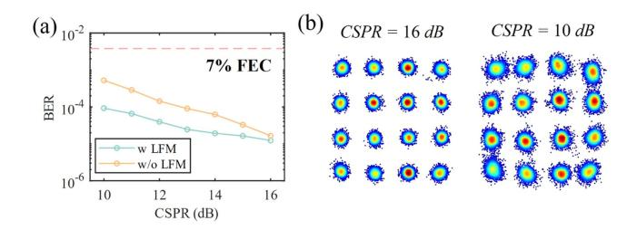

Fig. 9. (a) BER performance with LFM optical carrier and single-frequency optical carrier under CSPR from 10 dB to 16 dB. (b) Signal constellation diagrams at CSPR = 10 dB and CSPR = 16 dB.

conventional single-frequency optical carrier under different CSPR conditions. As shown in Fig. 9(a), when the signal power is relatively low (high CSPR), the bit error rate (BER) performance of both systems is comparable. However, the LFMmodulated carrier demonstrates superior BER performance at higher signal powers due to its ability to suppress stimulated Brillouin scattering (SBS). Nevertheless, the overall trend indicates that BER deteriorates as the signal power increases. This behavior aligns with the limitations of the small-signal approximation, where the assumption sin x ≈ x becomes invalid at higher powers. Consequently, the modulated signal experiences nonlinear distortion, as illustrated in Fig. 9(b), adversely impacting transmission performance.

In the context of CDM modulation at quadrature points, the applied voltage is theoretically I + jQ, but due to practical constraints, the actual modulation is implemented as sin(I) + j sin(Q). While the approximation sin(x) ≈ x holds for small signal amplitudes, it becomes invalid as the signal voltage increases, leading to nonlinear distortion. For constant-envelope signals such as QPSK, nonlinear distortion results in a uniform attenuation of the signal amplitude, which minimally impacts demodulation performance. In contrast, for higher-order modulation formats such as 16QAM, nonlinearity reduces the voltage ratio α between high and low amplitude levels below the ideal value. In 16QAM, the ideal voltage ratio α is determined by the evenly spaced amplitude levels (−3, −1, +1, +3) along each axis of the constellation. This deviation from the ideal ratio

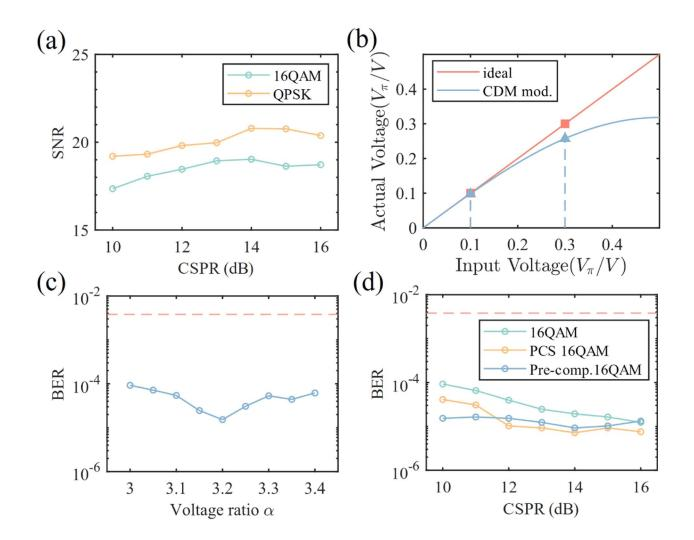

Fig. 10. (a) Communication SNR with QPSK and 16QAM signals under CSPR from 10 dB to 16 dB. (b) The relationship between the actual applied voltage and the AWG input voltage. (c) BER performance under voltage ratio from 3 to 3.4. (d) BER performance of 16QAM, PCS 16QAM, and pre-compensated 16QAM signals.

directly affects the equalization algorithm and shifts the decision boundaries, ultimately leading to a degradation in system performance. Fig. 10(a) compares the transmission performance of QPSK and 16QAM, showing that QPSK achieves error-free transmission. As the CSPR decreases (i.e., the signal power increases), the received signal SNR initially improves slightly but then degrades due to modulation-induced nonlinearity. Fig. 10(b) illustrates the relationship between the actual applied voltage and the AWG input voltage for high-order QAM signal, demonstrating the nonlinearity-induced distortion in signal amplitude levels.

A pre-compensation strategy can be applied to the symbolmapping process by adjusting the transmitted voltage ratio α to eliminate the nonlinear distortion. As shown in Fig. 10(c), under a CSPR of 9 dB, optimizing α to 3.2 ensures accurate compensation and minimizes distortion effects. Furthermore, probabilistic constellation shaping (PCS) can be utilized to further reduce the BER by configuring probability distribution factor λ = 0.05. The combined BER improvements achieved through these approaches are demonstrated in Fig. 10(d). These methods provide practical frameworks for mitigating nonlinearity-induced impairments in proposed modulation systems.

In practice,We employed a pair of phase arrays (PAs) as antennas to validate the transmission performance of the RoF system. The phased array operates at a center frequency of 28 GHz. The experimental setup, illustrated in Fig. [11\(a\),](#page-6-0) involved two PAs separated by a distance of 1 m. The signal constellations before and after wireless channel transmission are presented in Fig. [11\(b\).](#page-6-0) A noticeable degradation in the SNR was observed due to the wireless channel and antenna transmission processes. Fig. [12\(a\)](#page-6-0) illustrates the BER results for back-to-back (B2B), 10-km fiber, and combined fiber-wireless transmissions, demonstrating the impact of wireless channel transmission on system performance. Despite an apparent BER degradation compared to B2B and fiber-only scenarios, the system maintains robust

{6}------------------------------------------------

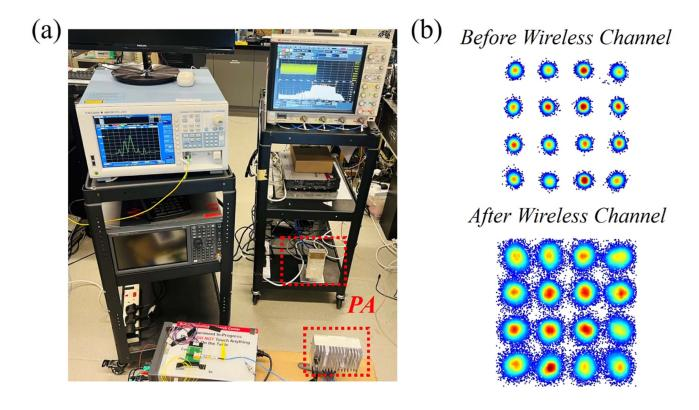

Fig. 11. (a) Experimental setup of the RoF system. (b) Signal constellation diagrams before and after the wireless channel.

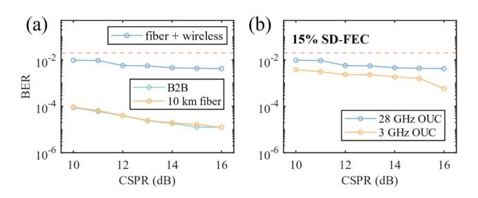

Fig. 12. (a) Comparison of BER performance for B2B, 10 km fiber-only, and fiber-wireless transmission. (b) BER performance across two schemes, 28 GHz and 3 GHz OUC.

communication performance for a wide range of CSPR values. This scheme directly up-converts the signal to 28 GHz, which can transmit the radio signal without further up-conversion in the electrical domain. An additional experiment was conducted utilizing an alternative scheme, where the signal was first up-converted to 3 GHz and subsequently up-converted in the electrical domain to 28 GHz before transmission through PA. Fig. 12(b) compares the BER performance across the two schemes, 28 GHz and 3 GHz optical up-conversion (OUC). The enhanced BER performance with 3 GHz up-conversion can be ascribed to the comparatively lower attenuation of lowfrequency signal within the system and the reduced impact of AWG quantization noise relative to the 28 GHz optical signal.

# IV. CONCLUSION

This paper proposes a compact and efficient solution for the coexistence of distributed sensing and coherent MMW RoF front-haul communication, targeting next-generation RANs. By employing an LFM carrier and a commercially available CDM, the system integrates high-accuracy sensing and stable communication in an ultra-simple architecture. The experiment evaluates the communication and sensing performance of the system under different CSPR conditions. On the communication side, the proposed design successfully demonstrates robust radio signal transmission in the MMW band of 28 GHz. A nonlinear pre-compensation algorithm for CDM is developed to optimize communication performance. On the sensing side, the system achieves a strain detection accuracy of 28 pε/√ Hz, demonstrating its capability for precise environmental monitoring.

#### REFERENCES

- [1] W.-C. Chien, C.-F. Lai, M. S. Hossain, and G. Muhammad, "Heterogeneous space and terrestrial integrated networks for IoT: Architecture and challenges," *IEEE Netw.*, vol. 33, no. 1, pp. 15–21, Jan./Feb. 2019.
- [2] J. Zhang, E. Björnson, M. Matthaiou, D. W. K. Ng, H. Yang, and D. J. Love, "Prospective multiple antenna technologies for beyond 5G," *IEEE J. Sel. Areas Commun.*, vol. 38, no. 8, pp. 1637–1660, Aug. 2020.
- [3] G. O. Pérez, J. A. Hernández, and D. Larrabeiti, "Fronthaul network modeling and dimensioning meeting ultra-low latency requirements for 5G," *J. Opt. Commun. Netw.*, vol. 10, no. 6, pp. 573–581, Jun. 2018.
- [4] I. A. Alimi, A. L. Teixeira, and P. P. Monteiro, "Toward an efficient C-RAN optical fronthaul for the future networks: A tutorial on technologies, requirements, challenges, and solutions," *IEEE Commun. Surveys Tuts.*, vol. 20, no. 1, pp. 708–769, Firstquarter 2018.
- [5] C. Ranaweera, E. Wong, A. Nirmalathas, C. Jayasundara, and C. Lim, "5G C-RAN with optical fronthaul: An analysis from a deployment perspective," *J. Lightw. Technol.*, vol. 36, no. 11, pp. 2059–2068, Jun. 2018.
- [6] C. Liu, J. Wang, L. Cheng, M. Zhu, and G.-K. Chang, "Key microwavephotonics technologies for next-generation cloud-based radio access networks," *J. Lightw. Technol.*, vol. 32, no. 20, pp. 3452–3460, Oct. 2014.
- [7] K. Xu et al., "Microwave photonics: Radio-over-fiber links, systems, and applications," *Photon. Res.*, vol. 2, no. 4, pp. B54–B63, Aug. 2014.
- [8] R. A. Minasian, "Ultra-wideband and adaptive photonic signal processing of microwave signals," *IEEE J. Quantum Electron.*, vol. 52, no. 1, Jan. 2016, Art. no. 0600813.
- [9] D. Milovanˇcev, N. Voki´c, D. Löschenbrand, T. Zemen, and B. Schrenk, "Analog coherent-optical mobile fronthaul with integrated photonic beamforming," *IEEE J. Sel. Areas Commun.*, vol. 39, no. 9, pp. 2827–2837, Sep. 2021.
- [10] C. Lim, Y. Tian, C. Ranaweera, T. A. Nirmalathas, E. Wong, and K.-L. Lee, "Evolution of radio-over-fiber technology," *J. Lightw. Technol.*, vol. 37, no. 6, pp. 1647–1656, Mar. 2019.
- [11] R. Agoua, A. Kamagaté, A. Konaté, M. Menif, and O. Asseu, "Radio over fiber architecture very high-speed wireless communications in the unlicensed 60 Ghz band," *Opt. Photon. J.*, vol. 10, pp. 29–40, 2020.
- [12] C. Lim and A. Nirmalathas, "Radio-over-fiber technology: Present and future," *J. Lightw. Technol.*, vol. 39, no. 4, pp. 881–888, Feb. 2021.
- [13] F. Li et al., "Optical I/Q modulation utilizing dual-drive MZM for fiberwireless integration system at Ka-band," *Opt. Lett.*, vol. 44, no. 17, pp. 4235–4238, Sep. 2019, [Online]. Available: [https://opg.optica.org/ol/](https://opg.optica.org/ol/abstract.cfm{?}URI$=$ol-44-17-4235) [abstract.cfm?URI=ol-44-17-4235](https://opg.optica.org/ol/abstract.cfm{?}URI$=$ol-44-17-4235)
- [14] E. Ip et al., "Distributed fiber sensor network using telecom cables as sensing media: Technology advancements and applications [invited]," *J. Opt. Commun. Netw.*, vol. 14, no. 1, pp. A61–A68, Jan. 2022.
- [15] C. Dorize, S. Guerrier, E. Awwad, and J. Renaudier, "Capturing acoustic speech signals with coherent MIMO phase-OTDR," in *Proc. 2020 Eur. Conf. Opt. Commun.*, 2020, pp. 1–4.
- [16] J. Xiong, Z. Wang, Y. Wu, Y. Chen, J. Li, and Y. Rao, "High performance CP-ΦOTDR utilizing the negative band," presented at 26th Int. Conf. Opt. Fiber Sensors, 2018, Paper FB5.
- [17] Y.-K. Huang and E. Ip, "Simultaneous optical fiber sensing and mobile front-haul access over a passive optical network," presented at Opt. Fiber Commun. Conf., 2020, Paper Th1K.4.
- [18] Z. Hu et al., "Enabling cost-effective high-performance vibration sensing in digital subcarrier multiplexing systems," *Opt. Exp.*, vol. 31, pp. 32114–32125, 2023.
- [19] M. Lei et al., "Photonics-assisted joint radar and communication system in w band using electromagnetic polarization multiplexing," presented at 2023 Opt. Fiber Commun. Conf. Exhib., 2023, pp. 1–3.
- [20] B. Dong et al., "Photonic-based W-band flexible TFDM integrated sensing and communication system for fiber-wireless network," in *Proc. 2023 Opt. Fiber Commun. Conf. Exhib.*, 2023, pp. 1–3.
- [21] J. Wang, L. Lu, Y. Yan, A. P. T. Lau, and C. Lu, "Joint-design of ultra high resolution vibration sensing and optical heterodyne mm-Wave RoF," in *Proc. 2024 Conf. Lasers Electro- Opt.*, 2024, pp. 1–2.
- [22] D. Chen, Q. Liu, and Z. He, "Phase-detection distributed fiber-optic vibration sensor without fading-noise based on time-gated digital OFDR," *Opt. Exp.*, vol. 25, pp. 8315–8325, 2017.