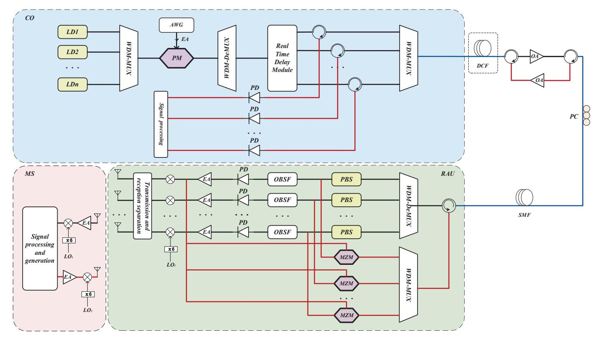
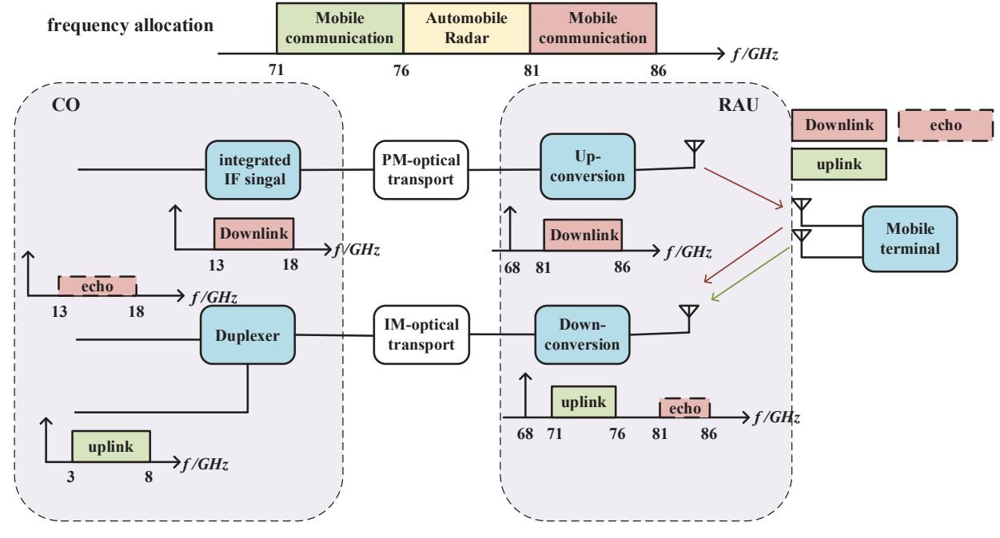
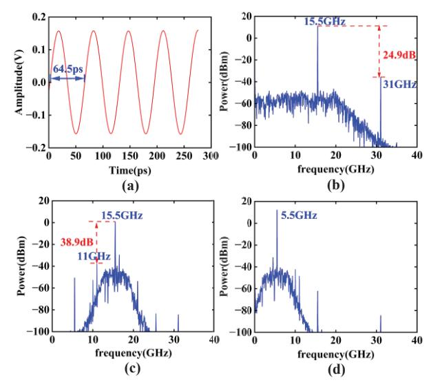
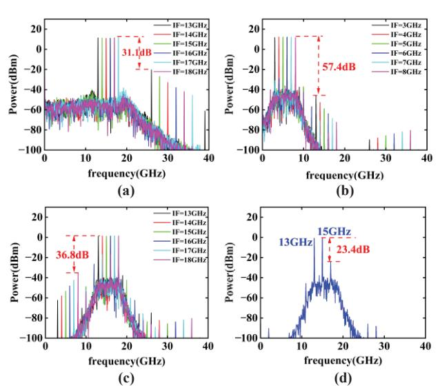
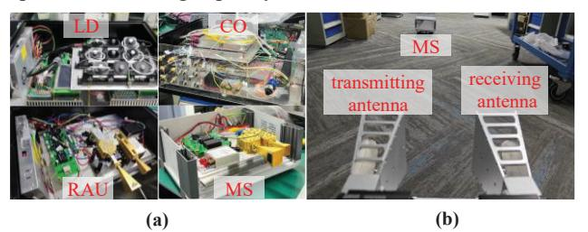
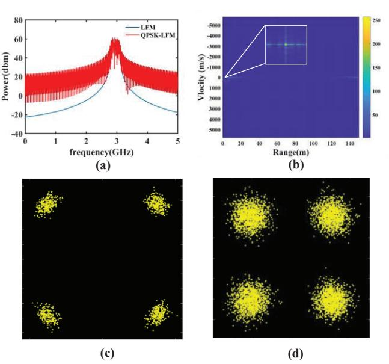

{0}------------------------------------------------

# Full-duplex Integrated Sensing and Communication System Based on Microwave Photonics

Weiqiong Wang
School of Electronic Engineering
Beijing University of Posts and
Telecommunications
Beijing, China
wangweiqiong@bupt.edu.cn

Guanxing Zhang
School of Electronic Engineering
Beijing University of Posts and
Telecommunications
Beijing, China
zgx2023@bupt.edu.cn

He Wen
School of Electronic Engineering
Beijing University of Posts and
Telecommunications
Beijing, China
wen.he@bupt.edu.cn

Jie Zhang
School of Electronic Engineering
Beijing University of Posts and
Telecommunications
Beijing, China
lgr24@bupt.edu.cn

full-duplex Abstract—A integrated sensing and communication (ISAC) system based on microwave photonics technology is proposed, including a Central Office (CO), Remote Antenna Unit (RAU), and Mobile Station (MS). The system employs phase modulation for downlink transmission and intensity modulation for uplink transmission to enable the reuse of optical carrier over a single fiber for bidirectional transmission, thereby reducing system complexity and cost Simultaneous sensing and full-duplex communication in E band is realized by using frequency division multiplexing (FDM). Both simulation and experimental verification were conducted to validate the proposed approach.

Keywords—ISAC, microwave photonics, full-duplex, optical carrier reuse.

# I. INTRODUCTION

The emergence of 6G as the next generation of intelligent integrated digital information infrastructure is driven by the synergy with artificial intelligence, big data, advanced computing, and other information technologies. This convergence aims to achieve a deep integration of communication and sensing, as well as computing and control. Consequently, 6G is expected to fulfill the vision of "intelligent connectivity of everything and digital twins."

Due to the involvement of radio wave transmission and reception in communication and radar, researchers have proposed the concept of ISAC to develop communication and sensing as closely integrated functionalities. In the early stages of development, systems integrating transmitter and antenna modules were reported [1]-[5], to reduce system complexity and save costs. However, this loosely coupled integration approach degrades the performance of one side and sacrifices the adaptability of the system. Thus, relying solely on the original system architecture is insufficient. To support higher data rates and finer sensing resolution, microwave photonic technology was adopted for the ultra-wide bandwidth, diverse and flexible processing of Integrated signal, enabling tightly coupled communication and sensing [6][7]. Whereas, the frequency bands employed for wireless propagation are predominantly situated in the low-frequency spectrum. In contrast, the millimeter-wave (MMW) band offers abundant spectrum resources, which can enhance the accuracy of target detection and identification greatly [8][9]. But MMW attenuates much faster in free space compared to lower frequency waves. To overcome the limitation of MMW spatial propagation, fiber optic remote structures have been designed in [10]-[13]. In particular, the concept of CO and RAU is proposed in [12], by separating signal detection and processing physically, to improve the performance and flexibility of the architecture.

In the aforementioned architecture, the RAU inevitably interacts with multiple MSs, making it necessary to introduce full-duplex technology [14]. However, most of the experiments reported [15]-[18] rarely realized bidirectional communication. The reason behind is that the RAU must send and receive data simultaneously and continuously, requiring the separation of incoming and outgoing signals with high Nevertheless, during the integration of communication and sensing, the addition of sensing capabilities should not hinder bidirectional communication. To address this issue, we propose a microwave photonicsbased full-duplex ISAC system architecture, which separates signals using FDM. Additionally, for transmitting uplink signals, we designed a carrier reuse unit with downlink phase modulation and uplink intensity modulation, significantly reducing both costs and system complexity.

# II. PRINCIPLE

Fig. 1 demonstrates a schematic of the proposed system. The following sections provide a detailed description of the downlink and uplink processes.

#### A. Downlink

The optical carrier is multiplexed from the outputs of N lasers of different wavelengths. Multiwavelength optical carrier is used to support multichannel RF for the application of a phased array. The integrated signal in the form of intermediate frequency(IF) is modulated onto an optical carrier via a phase modulator (PM). The PM output is demultiplexed by a wavelength demultiplexer into N channels and injected into an optical delay time network unit. This unit independently adjusts the delay of each channel, enabling beamforming before long-distance fiber optical transmission. Notably, if the transmission distance is long, a segment of dispersion compensation fiber can be added for pre-dispersion compensation.

{1}------------------------------------------------

Fig. 1 Microwave photonics-based full-duplex ISAC system. WDM-MUX: Wavelength Division Multiplexing. WDM-DeMUX: Wavelength Division Demultiplexing. MZM: Mach-Zehnder Modulator. LD: Laser Diode. LO: Local Oscillator. OA: Optical Amplifier. PBS: Polarization Beam Splitter. PC: Polarization controller. PD: Photodiode. PM: Phase Modulation. EA: Electrical Amplifier.

Before transmission, a Polarization Controller (PC) is used to adjust the polarization state to circular polarization for the purpose of carrier reuse at the RAU, ensuring equal power between two orthogonal linear projections, regardless of the decomposition angle. In RAU, each channel is separated by a polarization beam splitter, with one path fed to an intensity modulator for carrying the integrated signal received by the RAU. Since the downlink signal from the CO to the RAU uses phase modulation, the optical carrier can be reused for the uplink signal. Meantime, to demodulate the PM signal from the other path of the polarization beam splitter, a band-stop filter removes the negative first-order sideband. The filtered signal is detected by a photodetector and then amplified and upconverted to a millimeter wave before being transmitted by the antenna array.

#### B. Uplink

The antenna array receives RF signals sent by MSs and echoes reflected off targets. These signals are down-converted to IF at the RAU and sent to the CO by fiber after being loaded to the reused optical carrier through an intensity modulation Mach-Zehnder Modulator (MZM). At CO, the optical signals are amplified, demultiplexed, optoelectronic converted and processed by digital signal processing (DSP) to extract target information and communication data. Note that bi-directional transmission of the uplink and downlink over the same fiber is proposed to improve resource utilization. While a great challenge to separate the bi-directional transmission signals with sufficient isolation is imposed that requires suppressing backscattering, reflection and leakage as high as possible.

#### C. Signal Frequency Allocation

Fig. 2 illustrates the signal spectrum at various reference points within the ISAC system. The signal spectrum allocation adheres to the frequency resource planning requirements set by the International Telecommunication Union (ITU) and the National Radio Regulatory Commission. The system employs the 71-76 GHz and 81-86 GHz bands, each link offering a 5-GHz bandwidth to achieve millimeter-wave communication and radar functionality.

In line with the previously mentioned characteristics of the system, the 81-86 GHz band is chosen for transmitting downlink data from CO to MSs. The 71-76 GHz band is used for uplink data from MSs to CO.

In order to prevent harmonic interference during phase modulation, the allocation ensures that the highest signal frequency is less than twice the lowest frequency. The integrated IF signal frequency range of 13-18 GHz is selected for phase modulation to meet this requirement. When the IF signal reaches the RAU, it is upconverted to 81-86 GHz using a local oscillator frequency of 68 GHz, which can be generated through a frequency multiplier. To simplify the system, the same local oscillator frequency is used for down-conversion of received signals. Consequently, the uplink signal is downconverted to 3-8 GHz at RAU. Since this signal spans an octave, it cannot be phase-modulated and must rely on intensity modulation. Upon the uplink signal's arrival at CO, a duplexer separates the radar echoes from the uplink communication signals in the frequency domain. DSP is then employed to extract the relevant information.

{2}------------------------------------------------

Fig. 2 Signal frequency allocation.

Mapping the baseband signal to the 13-18 GHz IF range requires an IQ modulation scheme with a local oscillator frequency centered at 15.5 GHz. This involves modulating the in-phase and quadrature components of the baseband signal, which is limited to a DC-2.5 GHz bandwidth, onto a 15.5 GHz carrier.

### III. SIMULATION

System simulation is performed by using OptiSystem15 software. Four lasers with different central frequencies (193.1 THz, 193.3 THz, 193.5 THz, 193.7 THz) are used. The optical spectrum of the lasers, after phase modulation by a 15.5-GHz IF signal with a modulation index of  $\pi/2$ , are shown in Fig. 3 (a).

After transmission through the optical path and band-stop filtering described in II, the signal is converted into electrical signals by ideal photodetectors with infinite bandwidth. After passing through a low-pass filter with bandwidth of 20 GHz, the waveform and RF power spectrum of the IF on the first channel are shown in Fig. 4(a) and (b). The waveform looks clean and the power of the second harmonic is roughly -25 dB lower than that of the fundamental wave. In practice, the second harmonic will be suppressed further by using a PD with a 20 GHz bandwidth. Simultaneously, the received radar echo and uplink communication signal are down-converted and transmitted through the optical path back to CO. The spectrum of the reused optical carriers bearing intensity modulated signal are shown in Fig. 3(b), indicating successful intensity modulation across all of the four channels. The waveform and RF spectrum of the photo-detected uplink IF signal are shown in Fig. 4 (c) and (d), respectively. The simulation results are consistent with expectations.

Fig. 3 (a) Optical spectrum of four-channel downlink phase modulation (b) Optical spectrum of four-channel uplink intensity ( $f_1$  is the center frequency of the first channel)

To evaluate the RF bandwidth, the downlink IF frequency is swept across 13~18 GHz with 1-GHz step and the uplink IF frequency is swept across 3~8 GHz. The RF spectrum traces are overlayed in Fig. 5 (a)-(c) for a clear vision. The power deviation is less than 1 dB in the pass band. As shown in Fig. 5 (a), the power of the second harmonic is 31.1 dB lower than the fundamental wave. In Fig. 5 (b) and (c), the radar signal and communication signal are separated by a duplexer with isolation of 50 dB, achieving out-of-band power suppression ratio greater than 36.8 dB. Both radar echo and communication information are received correctly.

Additionally, we tested and analyzed the third-order intermodulation (IM3) as shown in Fig. 5(d). We used a two-tone signal at frequencies of 13 GHz and 15 GHz with power of -0.8 dBm. The IM3 power was -24.2 dBm. To receive the radar echo effectively allowed by the dynamic range of analog-to-digital conversion (ADC), the intermodulation signal must be weaker than the radar echo to ensure sufficient signal-to-interference ratio. This can be addressed by reducing the modulation index or applying linearized modulation technique.

{3}------------------------------------------------

Fig. 4 (a) Waveform of the downlink transmitted IF signal.

- (b) RF spectrum of the downlink transmitted IF signal.
- (c) RF spectrum of the uplink received IF signal.
- (d) RF spectrum of the downlink received IF signal.

Fig. 5 (a) Overlapped spectrum of downlink signal at various frequencies. (b) Overlapped spectrum of received uplink communication signal at

- various frequencies. (c) Overlapped spectrum of received radar echo.
- (d) Intermodulation spectrum of two-tone test.

# IV. EXPERIMENT SETUP

The wireless transmission link for ISAC demonstration is established by using a pair of antennas. Fig. 6 shows the photos of the experimental setup.

For the purpose of stability of the demonstration system and capability of real-time signal processing, we ultimately opted to choose microwave band for demonstration, i.e. LO1 at 10 GHz. Namely, the radar and downlink communication operated in the higher frequency band of 12.8-13.1-GHz, while the uplink communication occupied 2.8-3.1-GHz band. A 600-Mbit/s QPSK-LFM signal is transmitted, with the RF spectrum shown in Fig. 7(a). The constellation diagrams for the downlink and uplink communication are shown in Fig. 7(c)(d), with EVMs of 9.43% and 20.72%, respectively.The reason for the poorer performance of the uplink is that the RF band we chose for the uplink falls into the UHF band, resulting in higher noise power and a lower signal-to-noise ratio (SNR).Such 'noise' is introduced by the surrounding electromagnetic environment , therefore, SNR can be further improved through channel equalization algorithms and tight filtering in the future work. Accordingly, the uplink and downlink communication can work simultaneously, meeting requirements for high-quality communication.

Fig. 6 Experimental setup for demonstrating (a) Close-up views of each chassis. (b)Antennas and moving MS.

The radar functionality was tested using a mobile car pulling the MS. The measured MS's position ranged from 0.5 to 5 meters. Fig. 7(d) shows the 2D Range-Doppler map when the MS is located 1.9m from antennas and moving at a speed of 0.2 m/s. From the figure, the measured distance and speed are 1.8975m and 0.1258 m/s respectively. Whereas, the currently measured speed is unreliable, because the MS's movement is too slow, and insufficient data limited by the oscilloscope's buffer can't resolve low speed. As a result, the MS's speed is much lower than the radar's current velocity resolution. We would try faster-moving target in outdoor tests in the future.

Notably, the aforementioned uplink and downlink communication, along with measurement of velocity and range with the same signal waveform, is simultaneously achieved.

Fig. 7 (a) Spectrum diagram of the QPSK-LFM transmitted signal.

- (b) Radar 2D range-doppler map.
- (c) Constellation diagram of downlink communication signal.
- (d) Constellation diagram of uplink communication signal.

# V. CONCLUSION

This paper proposed and experimentally demonstrated a novel ISAC system based on microwave photonics to offer wide bandwidth. The key significance of the work is that it supports full-duplex ISAC, where phase modulation is used 

{4}------------------------------------------------

for the downlink and intensity modulation for the uplink. Additionally, carrier reuse and multiplexing techniques are adopted to reduce both cost and complexity of the system, while 5-GHz bandwidth was reserved for transmitting the ISAC signal, supporting various formats of ISAC signal transmission. A proof-of-concept experiment was successfully carried out that the radar achieved a distance resolution of 1.5 cm while simultaneously transmitting communication data at 600 Mbit/s. We believe the system can be widely used in various fields such as intelligent transportation, environmental monitoring, and extended reality.

# REFERENCES

- [1] Hassanien, Aboulnasr, Moeness G. Amin, Yimin D. Zhang, and Fauzia Ahmad. "Signaling strategies for dual-function radar communications: An overview." IEEE Aerospace and Electronic Systems Magazine 31, no. 10 (2016): 36-45.
- [2] Ma, Dingyou, Nir Shlezinger, Tianyao Huang, Yimin Liu, and Yonina C. Eldar. "Joint radar-communication strategies for autonomous vehicles: Combining two key automotive technologies." IEEE signal processing magazine 37, no. 4 (2020): 85-97.
- [3] Rappaport, Theodore S., Shu Sun, Rimma Mayzus, Hang Zhao, Yaniv Azar, Kevin Wang, George N. Wong, Jocelyn K. Schulz, Mathew Samimi, and Felix Gutierrez. "Millimeter wave mobile communications for 5G cellular: It will work!." IEEE access 1 (2013): 335-349.
- [4] Blunt, Shannon D., Matthew R. Cook, and James Stiles. "Embedding information into radar emissions via waveform implementation." In 2010 International waveform diversity and design conference, pp. 000195-000199. IEEE, 2010.
- [5] Euziere, Jerome, Régis Guinvarc'h, Marc Lesturgie, Bernard Uguen, and Raphaël Gillard. "Dual function radar communication timemodulated array." In 2014 International Radar Conference, pp. 1-4. IEEE, 2014.
- [6] Xue, Zhujun, Shangyuan Li, Xiaoxiao Xue, Xiaoping Zheng, and Bingkun Zhou. "Photonics-assisted joint radar and communication system based on an optoelectronic oscillator." Optics Express 29, no. 14 (2021): 22442-22454.
- [7] Mingzheng Lei, Bingchang Hua, Yuancheng Cai, Jiao Zhang, Yucong Zou, Weidong Tong, Xiang Liu, Miaomiao Fang, Jianjun Yu, and Min Zhu, "Photonics-aided integrated sensing and communications in mmW bands based on a DC-offset QPSK-encoded LFMCW," Opt. Express 30, 43088-43103 (2022)
- [8] Gao, Zhen, Ziwei Wan, Dezhi Zheng, Shufeng Tan, Christos Masouros, Derrick Wing Kwan Ng, and Sheng Chen. "Integrated sensing and communication with mmWave massive MIMO: A compressed sampling perspective." IEEE Transactions on Wireless Communications 22, no. 3 (2022): 1745-1762.
- [9] Qi, Chenhao, Wei Ci, Jinming Zhang, and Xiaohu You. "Hybrid beamforming for millimeter wave MIMO integrated sensing and communications." IEEE Communications Letters 26, no. 5 (2022): 1136-1140.
- [10] Hsueh, Yu-Ting, Ming-Fang Huang, Meilong Jiang, Yin Shao, Kyungtae Kim, and Gee-Kung Chang. "A novel wireless over fiber access architecture employing moving chain cells and rof technique for broadband wireless applications on the train environment." In 2011 Optical Fiber Communication Conference and Exposition and the National Fiber Optic Engineers Conference, pp. 1-3. IEEE, 2011.
- [11] Huang, Long, Ruoming Li, Shangjing Liu, Pan Dai, and Xiangfei Chen. "Centralized fiber-distributed data communication and sensing convergence system based on microwave photonics." Journal of Lightwave Technology 37, no. 21 (2019): 5406-5416.
- [12] Umezawa, T., K. Jitsuno, A. Kanno, K. Akahane, N. Yamamoto, and Tetsuya Kawanishi. "OFDM millimeter-wave radar experiment combined with radio over fiber technology." In 2016 41st International Conference on Infrared, Millimeter, and Terahertz waves (IRMMW-THz), pp. 1-2. IEEE, 2016.
- [13] Shao, Yufeng, Yanjin Wang, and Nan Chi. "60-GHz RoF system with low PAPR 16QAM-OFDM downlink using PTS segmentation." IEEE Photonics Technology Letters 25, no. 9 (2013): 855-858.

- [14] Zhang, Zhongshan, Keping Long, Athanasios V. Vasilakos, and Lajos Hanzo. "Full-duplex wireless communications: Challenges, solutions, and future research directions." Proceedings of the IEEE 104, no. 7 (2016): 1369-1409.
- [15] Ge, Xinyi, Fangzheng Zhang, Shilong Pan, Xiaopeng Hu, and Cong Ma. "Photonic integrated sensing and communication system with multi-target detection capability." In 14th International Photonics and Optoelectronics Meetings (POEM 2022), vol. 12614, pp. 232-238. SPIE, 2023.
- [16] Bai, Wenlin, Xihua Zou, Peixuan Li, Jia Ye, Yang Yang, Li Yan, Wei Pan, and Lianshan Yan. "Photonic millimeter-wave joint radar communication system using spectrum-spreading phase-coding." IEEE Transactions on Microwave Theory and Techniques 70, no. 3 (2022): 1552-1561.
- [17] Xue, Zhujun, Shangyuan Li, Jiading Li, Xiaoxiao Xue, Xiaoping Zheng, and Bingkun Zhou. "OFDM radar and communication joint system using opto-electronic oscillator with phase noise degradation analysis and mitigation." Journal of Lightwave Technology 40, no. 13 (2022): 4101-4109.
- [18] Zhong, Ningyuan, Peixuan Li, Wenlin Bai, Wei Pan, Lianshan Yan, and Xihua Zou. "Spectral-efficient frequency-division photonic millimeter-wave integrated sensing and communication system using improved sparse LFM sub-bands fusion." Journal of Lightwave Technology 41, no. 23 (2023): 7105-7114.