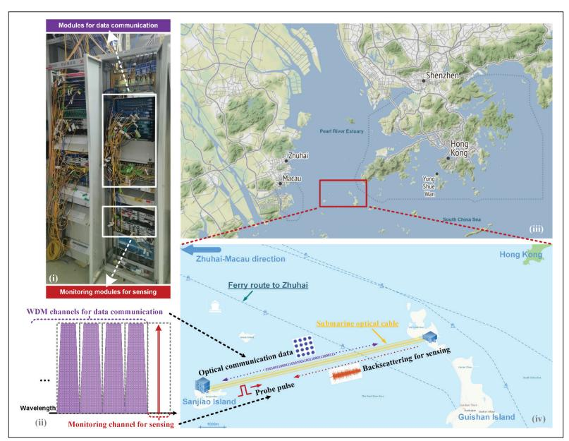
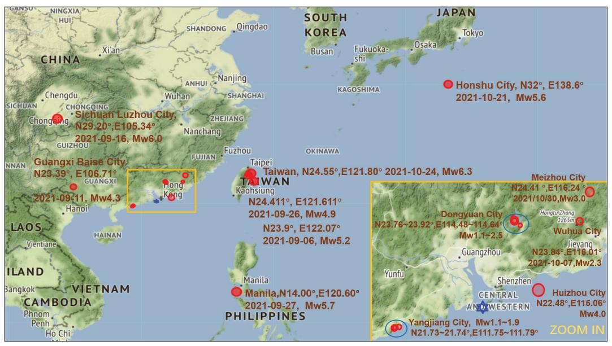
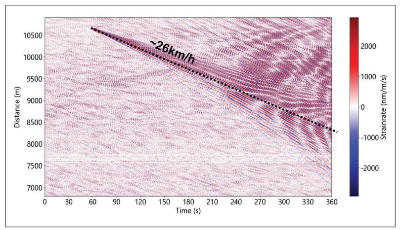

{0}------------------------------------------------

# Photonic Integrated Sensing and Communication System Harnessing Submarine Fiber Optic Cables for Coastal Event Monitoring

Shaoyi Chen, Kun Zhu, Jun Han, Qi Sui, and Zhaohui Li

The authors present work on coastal event monitoring with photonic integrated sensing and communication technology using submarine telecommunication optical cables.

**ABSTRACT** 

Information and knowledge explosions boost the development of telecommunication infrastructures, especially for submarine fiber optic cables. These underwater fibers not only undertake most of the international data transmission on this planet, but also offer new opportunities to study earth science and human marine activities. The emerging technology of integrated sensing and communication is putting this concept into practice. In this article, we present work on coastal event monitoring with photonic integrated sensing and communication technology using submarine telecommunication optical cables. Ocean wave analysis, earthquake detection, and marine ferry monitoring are highlighted for detailed analysis. With the proposed integrated system, we successfully observed ocean waves with different frequencies and velocities, microseisms within 200 km, Mw 4.3 – Mw 6.3 earthquakes in the Far East, and vessel sailing activities. Enabled by the novel integrated technology and mass submarine fiber networks, more research works on photonic integrated sensing and communication systems aiming at ocean science and marine engineering are expected for future insights.

#### INTRODUCTION

More than two-thirds of Earth's surface is covered by oceans, so nowadays people from different countries communicate through the submarine fiber optic cable system. As the most important medium of international telecommunication traffic, the submarine fiber optic cable system carries more than 95 percent of the world's international data traffic. In the last decade, global international Internet traffic has been growing continuously, which has accelerated the construction of global submarine optical fiber infrastructures. By the end of 2021, there were more than 400 submarine optical cables in use worldwide, with a total length of more than 1.4 million km, as shown in Fig. 1. This developed submarine optical cable network not only improves the bandwidth performance of the international telecommunication system, but also provides a potential approach for the research (of earth science and ocean related studies [1]. More recently, an emerging technology called integrated sensing and communication (ISAC) has attracted people's attention. Originating from the wireless application scenario, the ISAC system efficiently utilizes hardware and signal resources, which can be shared for both sensing and communication functionalities [2, 3]. A similar concept can also be transferred to the fiber optic system. Based on the developed submarine fiber network, both the photonic data communication and sensing functions can be simultaneously realized with the shared hardware and fiber network infrastructure, which would help monitor various marine activities.

Meanwhile, about 60 percent of humans on Earth live within 100 km of the coastline. Many coastal baselines lie at the boundaries between geological plates. In these regions, active geological activities, including annual climate disasters such as typhoons and tsunamis caused by submarine seismic activities, all threaten human activities in these coastal areas. To acquire geological information and monitor these activities, conventional methods use single or series of fixed-point sensors, which may be limited in monitoring area, diverse functionality, real-time data acquisition, and longterm power supply. The developed submarine fiber optic infrastructures with ISAC technology have recently been found ideal to solve these problems. The fiber itself can be used as both the sensing gauge and signal transmission medium. Its silica core material offers advantages such as low loss, light weight, dielectric, immunity to electromagnetic interference, and ability to withstand harsh environments over long ranges and long periods. Based on the fiber's different scattering properties, such as Rayleigh backscattering, Brillouin backscattering, and Raman backscattering, a wide range of sensing parameters can be detected and measured (e.g., temperature, strain, and acoustic disturbance, which enables us to detect and monitor various coastal and oceanic events. Thanks to the low-loss and large-bandwidth characteristics of the optical fiber as a transmission medium, these sensing data can be sent back to

This work was supported in part by the Key-Area Research and Development Program of Guangdong Province (Grant No. 2020B0101080002), in part by the National Natural Science Foundation of China (Grant No. U2001601), in part by the Program of Marine Economy Development Special Fund (Six Marine Industries) under Department of Natural Resources of Guangdong Province (Grant No. GDNRC [2021]33).

Digital Object Identifier:

Shaoyi Chen, Jun Han, and Zhaohui Li (corresponding author) are with Sun Yat-sen University, China. Zhaohui Li is also with the Southern Marine Science and Engineering Guangdong Laboratory (Zhuhai), PR China; Kun Zhu (corresponding author) is with The Hong Kong Polytechnic University, PR China; Qi Sui (corresponding author) is with the Southern Marine Science and Engineering Guangdong Laboratory (Zhuhai), PR China.

{1}------------------------------------------------

FIGURE 1. Illustration of the existing global submarine telecommunication optical cables. [Map and cable data are from TeleGeography's Telecom Resources licensed under Creative Commons ShareAlike.]

the in-land control offices for further real-time processing and analysis.

In this article, we propose the idea of photonic photonic ISAC and summarize the work on the photonic ISAC system for monitoring different coastal events based on submarine fiber optic cables. In this photonic ISAC system, we utilize the existing monitoring channel of the commercial fiber optic communication system for sensing to realize various maritime sensing and monitoring functions without affecting the ongoing optical communication. In this way, the optical communication and sensing parts can be smoothly integrated by sharing a single submarine fiber. For the sensing part of this integrated system, we use the so-called phase-sensitive optical time-domain reflectometry (Phi-OTDR) technology to detect the acoustic signals caused by various geological and marine activities. Here we focus on ocean wave analysis, earthquake detection, and marine ferry monitoring. With mass data acquired and analyzed, we record and study these coastal events, which provides a helpful tool for geoscientists, oceanographers, and scientists in many other research fields.

## Photonic IntegratedSensingandCommunication TechnologyUsingSubmarineOpticalCables

The initial idea of ISAC was proposed in the wireless scenario. It refers to the fusion of wireless communication and radar sensing systems, which utilizes the wireless signal and hardware resources efficiently and implements multiple functions simultaneously [3]. ISAC has been seen as an enabling technology for the next-generation wireless systems (6G) and many other emerging applications, such as the Internet of Things (IoT), smart city, and environmental monitoring.

In these future wireless systems using extremely high bands, the concept of ISAC provides leverage, since as the frequency bands go higher with larger bandwidths, better sensing capability and higher resolution can be potentially achieved. The concept of the photonic ISAC is similar to that of the wireless ISAC, since in both the photonic and wireless ISAC systems some of the hardware resources are shared by the communication and sensing parts to form the integrated systems of dual functions. Instead of transmitting and receiving signals in the free space environment, the photonic ISAC system utilizes one single optical fiber as both the transmission and sensing medium. In our proposed photonic ISAC system, we use the existing monitoring channel of the commercial optical communication system to perform the sensing function. Based on mature wavelength-division multiplexing (WDM) technology, this scheme provides enough isolation between the optical communication and sensing channels, as shown in Fig. 2(i-ii). In this way, the sensing part is smoothly integrated with the current commercial optical communication network sharing the same submarine fiber without occupying the ongoing WDM data channels. The novelty and advantage of this photonic ISAC system rely on this, since the communication and sensing parts can run independently. In the photonic ISAC system, the optical sensing probes would not interfere with the communication messages, unlike in a wireless ISAC system this interference has to be considered because the same signals are used for both communication and sensing functions. Due to the limited bandwidths occupied by both the sensing and monitoring signals, which are normally below 100 MHz, the two signals with different wavelengths can be arranged within the monitoring channel. Though the sensing signal would

{2}------------------------------------------------

FIGURE 2. i) Photograph of the PISAC rack in the control room of Sanjiao Island; (ii) illustrated optical spectrum showing data communication channels and single monitoring channel for sensing; (iii) map of the sea area between Hong Kong and Macau in Guangdong-Hong Kong-Macau Greater Bay Area, China; (iv) enlarged map of the testbed area. The yellow line shows the submarine optical cable between Sanjiao Island and Guishan Island for the photonic ISAC system.

not interfere with the optical communication and monitoring services in principle, it somehow increases the system's complexity, since additional filters have to be used within the monitoring channel to distinguish the sensing and monitoring signals. In a photonic ISAC system, the optical communication part is mature and normally compatible with state-of-the-art commercial optical fiber networks. In this section, we will mainly discuss the optical sensing part of the photonic ISAC system in the following.

Distributed fiber optic sensing technology can be used for the sensing part of the photonic ISAC systems due to its inherent compatibility with the commercial optical fiber networks. It can use standard telecommunication optical fibers as the sensing elements without changing the current fiber networks. With the distributed sensing technique, the whole fiber can be seen as the interrogator, thus we can obtain a large number of sensing elements along the fiber for joint analysis. In fact, the distributed sensing scheme using standard optical fibers has attracted lots of research attention in the last decade, owing to its numerous sensing elements and outstanding performance from the inherent property of optical fiber. It has shown great potential in various applications, though most of which are terrestrial in the beginning. Recently, researchers develop various fiber sensing technologies and start to use them for ocean-related studies, such as offshore earthquake detection [4,5], ocean dynamics [6,7], hydroacoustics [8,9], etc. For the sensing part of the proposed photonic ISAC system in this work, Rayleigh backscattering of the submarine fiber is utilized to measure the surrounding acoustic or vibration signals with a highly coherent optical source. This capability of dynamic parameter sensing enables us to detect and monitor various coastal and oceanic events. The basic principle to perform the distributed sensing in the photonic ISAC is based on the Phi-OTDR technology, which is similar to a 1D radar system in an optical fiber [9–12]. Figure 2 shows the principle and testbed of our photonic ISAC, from which we can notice that the optical communication and sensing parts are in the same rack but work independently in different wavelength channels without interference. As shown in Fig. 2(iv), to perform the distributed acoustic or vibration sensing function, a coherent optical probe pulse is sent into the underwater fiber periodically. Due to the Rayleigh scattering property of silica fiber, the specific backscattering signal from each gauge point is received at a different time within a cycle, forming a speckle-like pattern. The amplitude and phase of the Rayleigh backscattering signal can be demodulated with coherent detection technology. It should be noticed that the coherent detection scheme is essential for phase demodulation in both optical communication and sensing systems. Specifically, homodyne detection and heterodyne detection are the two commonly used coherent detection methods for phase demodulation. In the optical systems with coherent detection, a portion of the laser source as the LO light is mixed with the received optical signals before entering the photodetector. After that, a few simple algorithms and operations, such as frequency mixing, band-pass and lowpass filtering, and trigonometric and unwrapping operations, can be adopted to retrieve the optical phase information. When there is external vibration or acoustic signal around the sensing fiber, the recovered phase change is found linear to the external vibration at a certain location. With simple frequency filtering operation and time-frequency analysis of the demodulated sensing signals, most of the acoustic or vibration signals can be detected and measured. Aiming at marine applications, distributed fiber sensing with outstanding performance is needed, e.g., with longer distance and better sensitivity [10]. Advanced optical communication techniques and machine learning algorithms are recently introduced to distributed fiber sensing for better signal-to-noise ratio (SNR) and pattern recognition function [11, 12]. Besides, due to the multi-source feature of distributed fiber sensing, signal enhancement and direction cognition techniques have been developed for underwater acoustic source localization [13, 14]. All of these prove that the sensing part of the photonic ISAC system can be qualified for coastal and marine applications.

Our testbed is built outside the Pearl River estuary of China. We use the submarine telecommunication optical cable between Sanjiao Island and Guishan Island in the sea area between Hong Kong and Macau. As shown in Fig. 2(iii-iv), the ferry route from Guishan Dock to Zhuhai Port goes across the layout line of the submarine fiber. In this photonic ISAC system, the single-end sensing facility is located in the telecommunication control office at Sanjiao Island. Figure 2(i) shows the communication and sensing modules in the same rack at Sanjiao Island. During the period of our experiments, the optical communication service runs normally between the two islands. Based on our photonic ISAC testbed, we realize long-term sensing and monitoring for up to ten months without the problems of power supply 

{3}------------------------------------------------

and real-time data acquisition. With the mass long-term received sensing data in this photonic ISAC system, we can analyze the geological, marine, biological, and human activities. All these coastal events, such as earthquakes, tsunamis, ocean wave movement, vessel sailing, and marine life activities, can be monitored with this integrated system simultaneously, without disturbing the communication services, which proves photonic ISAC to be versatile based on the submarine fiber optic cables. Here we highlight ocean wave analysis, earthquake detection, and ferry monitoring with our testbed for detailed analysis.

## Ocean Wave AnalysisUsing Photonic ISAC withSubmarine Telecommunication Fiber

The pre-existing submarine telecommunication fiber cables with distributed sensing technology provide researchers with a new approach to studying the ocean wave phenomena, including ocean surface gravity waves and ocean seismic waves [5, 6]. With the photonic ISAC system, we are able to detect and analyze different small ocean signals using the mass submarine optical fiber networks without invading the current optical communication systems.

The frequency-wavenumber (*f-k*) domain analysis is mostly used to study ocean dynamics. In order to figure the *f-k* spectrum, we apply a two-dimensional (2D) fast Fourier transform based on the raw data from the sensing module output, which records the acoustic and vibration information with the submarine fiber interrogator. Figure 3 shows the calculated *f-k* spectrum based on our testbed with the dataset recorded in 14 min at the distance between 2 km and 11 km from Sanjiao Island. With this *f-k* spectrum, we can calculate the phase velocity as the ratio between frequency and wavenumber for different oceanic acoustic signals with different frequencies, which describe the ocean wave propagation. In the *f-k* spectrum, Quadrant 1 and Quadrant 3 show waves with positive phase velocities, while Quadrant 2 and Quadrant 4 show waves with negative phase velocities. The sign of phase velocity indicates the direction of ocean wave propagation across the interrogating fiber. In our case, positive indicates eastward-propagating waves, while negative indicates westward-propagating waves. As the frequency components of most ocean surface gravity waves are below 0.3 Hz, we find more energy with negative phase velocities at low frequencies (< 0.3 Hz) in Quadrants 2 and 4 of Fig. 3. This means that in this period, the westward-propagating ocean surface gravity waves were stronger than eastward-propagating waves, which is in accordance with the actual observation. In addition, the white dashed line in Fig. 3 shows the ocean surface gravity dispersion relation, which also describes the ocean surface gravity waves and indicates the energy propagating axially along the cable both eastward and westward.

To further analyze the phase velocities and energy distribution of ocean waves in the *f-k* figure, we plot the lines of phase velocities of 10 m/s, 100 m/s, and 1000 m/s as the blue dashed lines in Fig. 3. Two main energy distribution

FIGURE 3. Raw distributed acoustic sensing frequency-wavenumber (*f-k*) spectrum calculated between 2 km and 11 km, showing ocean waves and seismic waves.

areas are found in this *f-k* spectrum. The strongest is around the 10 m/s line, whose frequency is below 0.3 Hz. This area indicates the natural ocean waves with small wavenumber (< 0.06 1/m) and slow phase velocity (around 10 m/s). The other area is between the 100 m/s line and the 1000 m/s line, which shows the waves with small wavenumber (< 0.03 1/m) and higher frequency (> 0.8 Hz). These waves with large phase velocities of several hundred m/s are most likely to indicate the transoceanic seismic waves, which implies that the submarine telecommunication fiber cables with the photonic ISAC technology can be utilized for oceanic seismic monitoring and observation.

## EarthquakeDetectionUsing Photonic ISAC withSubmarine Telecommunication Fiber

Distributed sensing with terrestrial fibers has been successfully used to detect in-land earthquakes. Recently, a few works have been reported using submarine optical fiber cables to detect offshore and coastal earthquakes [4–7]. Compared to traditional separated ocean bottom seismometers (OBSs), the novel method of the photonic ISAC system with submarine telecommunication fiber cables demonstrates advantages of a large number of sensing elements, potential large monitoring area, the possibility of microseism and teleseism detection, and cost efficiency, among others. As shown in the ocean wave analysis from the *f-k* spectrum, two kinds of dominant ocean waves contribute to the detected acoustic or vibration signals by our interrogator in the neritic area: ocean surface gravity waves and underwater seismic waves. Since the latter are mostly weaker than the former, in order to seize the underwater microseism and teleseism signals, we need effective data processing operations, such as bandpass filtering and wavelet transform.

We have successfully observed in-land, coastal, and offshore earthquakes based on our submarine fiber testbed. Figure 4 shows an Mw 4.0 offshore earthquake detected at UTC0 2022-03- 13 18:28:47 in the sea area near Huizhou City in Guangdong Province, China, as an example. The exact location can be found in the inset of Fig. 5. The epicenter is about 143 km away from our submarine fiber testbed, with a depth of 21 

{4}------------------------------------------------

km. We record this seismic event in 100 s with 10 km submarine fiber (i.e., the section between 3 km to 13 km from Sanjiao Island). For this 10 km distance, we applied 1226 data channels in space, with a channel interval of 8.1676 m, which can be seen as 1226 seismic sensing elements in total. Basic signal processing operations, such as shorttime Fourier transform and wavelet transform, can be used to better analyze the time and spectrum of the earthquake. With frequency spectrum analysis, we find that the detected nearby microseisms can be observed with more high-frequency components (> 5 Hz), but for remote earthquakes, mainly low-frequency components (< 2 Hz) are observed with our testbed. Since the frequencies of natural ocean waves are almost below 0.3 Hz, for the case shown in Fig. 4, we use a 2–15 Hz bandpass filter on the data of each channel to remove the disturbing frequency components, which help us distinguish the seismic signal from other ocean waves.

The P wave and S wave of the earthquake can be seen clearly in Fig. 4, but some positions are found to have weak signals. This phenome-

FIGURE 4. Recorded P wave and S wave of MW 4.0 earthquake of 21 km depth at epicenter in the sea area near Huizhou City of Guangdong Province, China (22.48°N, 115.06°E) at UTC0 2022-03-13 18:28:47.

non may be due to the destructive interference fading problem from the Phi-OTDR technology, and the complex seabed geology and environment for laying fiber cables. For a better display of the detected earthquake, mean standard deviation normalization could be used for each channel to ease this difference; however, ideally, we can use every single channel to monitor seismic events. It is shown in Fig. 4 that the P wave and S wave arrived at our testbed about 24.5 s and 41.5 s after the earthquake occurred, respectively. With these time intervals, we can calculate the averaging propagating velocities of the P wave and S wave, which are 5.9 km/s and 3.47 km/s, respectively. It is worth mentioning that the green dashed lines in Fig. 4 showing the P and S waves are not absolutely straight, but with a certain tilt and radian. This is due to the actual laying location of the submarine fiber cable. The distances between multiple fiber sensing elements and the epicenter are a bit different; thus, the P and S waves arrived at the closer fiber sections at an earlier time.

We have observed multiple seismic events with our testbed and data processing method discussed above. Figure 5 shows some selected detected earthquakes during September and October 2021. The blue hexagon shows the location of our testbed. It is proved that our photonic ISAC system with submarine telecommunication fiber cables has successfully detected several remote earthquakes with a magnitude greater than Mw 4, such as the coastal one in Taiwan, China (24.55°N, 121.80°E, 2021-10-24, Mw 6.3), the offshore one near Japan (32°N, 138.6°E, 2021-10-21, Mw 5.6), the coastal one in the Philippines (14.00°N, 120.60°E, 2021-09-27, Mw 5.7), the in-land one in Guangxi Province, China (23.39°N, 106.71°E, 2021-09-11, Mw 4.3), and the in-land one in Sichuan Province, China (29.20°N, 105.34°E, 2021-09-16, Mw 6.0). The epicenters of these earthquakes are several hundreds or even thousands of kilometers away from our submarine fiber testbed. In Guangdong Province of China where our testbed is located, we are able to monitor more microseism events, since

FIGURE 5. Map of some detected earthquakes during September and October 2021.

{5}------------------------------------------------

the distances between these epicenters and our submarine fiber testbed are around 200 km or below, resulting in lower energy loss for the seismic wave propagation. We find two major seismic areas in Guangdong Province, the area near Dongyuan City (23.76°N — 23.92°N, 114.48°E — 114.64°E) and the area near Yangjiang City (21.73°N — 21.74°N, 111.75°E — 111.79°E), both of which are in the coastal region and shown as light blue ovals in the inset of Fig. 5. More than four microseisms from each of these two areas are observed with our testbed during September and October in 2021, which are consistent with the records from the official Guangdong Seismological Bureau (GSB). The magnitudes of these microseisms are below Mw 2, and the weakest one is Mw 1.1. This proves that the submarine fiber testbed with the photonic ISAC technology has good sensitivity for microseismic event monitoring. In fact, more unknown acoustic signals have been observed with our testbed, which are not recorded by GSB. Since the seismic stations are quite limited, especially for the offshore scenario, it is possible that we observed some offshore microseisms that were not recorded by the conventional seismic stations. It is worth noticing that besides earthquakes, other artificial transient acoustic signals can also be detected by our system. The spectrum and time domain analysis with advanced machine learning algorithms will help distinguish the seismic signals from other disturbing vibrations.

## Ferry MonitoringUsing Photonic ISAC withSubmarine Telecommunication Fiber

Besides monitoring various natural geological and oceanic events, submarine telecommunication fiber cables with the photonic ISAC technology can also be used to monitor coastal and marine human activities. For our testbed, the fiber cable is laid in the neritic sea area outside the Pearl River estuary, with an average depth of 10 m. Human marine activities are busy in this sea area. Ocean waves caused by different vessels can be easily detected and analyzed with submarine fiber cables and the photonic ISAC technology, so we can achieve vessel sailing monitoring in this area.

With our testbed, we monitored the daily ferry from Guishan Dock to Zhuhai Port, as shown in Fig. 6. As seen in Fig. 2, the ferry route between Guishan Dock and Zhuhai Port goes across the submarine fiber laying route. Although the telecommunication cable is buried under the 10 m seabed, it can feel the ocean waves and currents generated by the sailing ferry. Figure 6 shows the track of the sailing ferry in a time-distance window of 6 min and 4 km. The ferry's trajectory with the highest demodulated signal intensity is marked by the black dotted line. We can calculate its speed to be 26 km/h. However, this speed is not the ferry's sailing speed. Since there is an angle between the ferry route and the fiber direction, this value only corresponds to the ferry's mapping speed along the fiber direction. With the information of the ferry route and the angle, we can calculate the ferry's sailing speed. Even without knowing such information, we can count the vessels passing the fiber laying route in this area during a certain period, which is also important for safety's sake.

FIGURE 6. Track of the daily ferry going from Guishan Dock to Zhuhai Port.

## Conclusion

We present a photonic integrated sensing and communication system based on submarine telecommunication fiber optic cable. Sharing the single fiber and some network hardware, the optical communication part and the sensing part are smoothly integrated based on the current commercial optical communication network without interference. The experimental results show that our testbed can be used for ocean wave analysis, earthquake and microseism detection, and ferry monitoring. Compared to conventional methods of geological and oceanic observation, this novel scheme based on submarine telecommunication cables has the advantages of low cost, versatility, no need for underwater installation, and less impact on marine lives and environment. We believe that the implementation of photonic ISAC can provide a new supplementary approach for conventional methods and help us learn more unknown information from the wide ocean. Based on the photonic ISAC testbed, we expect more research work in the future. First, with the mass long-term sensing data, we need to develop more advanced signal processing methods and AI algorithms, such as the convolutional neural network, to help us analyze and recognize different oceanic signals more accurately and automatically. Second, as the novel fiber technologies (i.e., multicore and few-mode fibers) are introduced to the submarine fiber optic communication systems, it is meaningful to investigate the photonic ISAC with these new fiber technologies for better communication and sensing performance. Last but not least, besides Rayleigh scattering, other fiber scattering properties such as Brillouin scattering and Raman scattering can be utilized to enable the photonic ISAC with the temperature and strain sensing capabilities. With more information from the ocean, we can develop more practical applications such as earthquake and tsunami early warning systems in the future.

#### References

- [1] Y. You, "Harnessing Telecoms Cables for Sci*e*nce," *Nature*, vol. 466, 2010, pp. 690–91.
- [2] Y. Cui *et al.*, "Integrated Sensing and Communications for Ubiquitous IoT: Applications, Trends, and Challenges," *IEEE Network*, vol. 35, no. 5, Sept./Oct. 2021, pp. 158–67.
- [3] L. Zheng *et al.*, "Radar and Communication Coexistence: an Overview: A Review of Recent Methods," *IEEE Signal Processing Mag*, vol. 36, no. 5, 2019, pp. 85–99.
- [4] G. Marra *et al.*, "Ultrastable Laser Interferometry for Earth-

{6}------------------------------------------------

- quake Detection with Terrestrial and Submarine Cables," *Science*, vol. 361, 2018, pp. 486–90.
- [5] E. F. Williams *et al.*, "Distributed Sensing of Microseisms and Teleseisms with Submarine Dark Fibers," *Nat. Comm.,* vol. 10, 2019, Art. no. 5778.
- [6] Z. Zhan *et al.*, "Optical Polarization-Based Seismic and Water Wave Sensing on Transoceanic Cables," *Science*, vol. 371, 2021, pp. 931–36.
- [7] N. J. Lindsey, T. C. Dawe, and J. B. Ajo-Franklin, "Illuminating Seafloor Faults and Ocean Dynamics with Dark Fiber Distributed Acoustic Sensing," *Science*, vol. 366, 2019, pp. 1103–07.
- [8] H. Matsumoto *et al.*, "Detection of Hydroacoustic Signals on a Fiber-Optic Submarine Cable," *Sci. Rep.*, vol. 11, 2021, Art. no. 2797.
- [9] B. Lu *et al.*, "Distributed Optical Fiber Hydrophone Based on ?-OTDR and Its Field Test," *Opt. Express*, vol. 29, no. 3, 2021, pp. 3147–62.
- [10] Y. Yan *et al.*, "Forward Transmission Based Ultra-Long Distributed Vibration Sensing with Wide Frequency Response," *J. Lightwave Tech.*, vol. 39, no. 7, 2021, pp. 2241–49.
- [11] Y. Yan *et al.*, "Distributed Optical Fiber Sensing Assisted by Optical Communication Techniques," *J. Lightwave Tech.*, vol. 39, no. 12, 2021, pp. 3654–70.
- [12] H. Wu *et al.*, "Pattern Recognition in Distributed Fiber-Optic Acoustic Sensor Using An Intensity and Phase Stacked Convolutional Neural Network with Data Augmentation," *Opt. Express*, vol. 29, no. 3, 2021, pp. 3269–83.
- [13] J. Liang *et al.*, "Distributed Acoustic Sensing for 2D and 3D Acoustic Source Localization," *Opt. Lett.*, vol. 44, no. 7, 2019, pp. 1690–93.
- [14] Z. Wang *et al.*, "Multi-Source Aliasing Suppression for Distributed Fiber Acoustic Sensing with Directionally Coherent Enhancement Technology," *Opt. Lett.*, vol. 45, no. 20, 2020, pp. 5672–75.

#### Biographies

Shaoyi Chen (chenshy285@mail2.sysu.edu.cn) is a Ph.D. student in the School of Electronics and Information Technology at Sun Yat-sen University. He received his B.S. degree from Beijing Normal University, China, in 2008, and his M.Sc. degree from Beihang University, Beijing, China, in 2011. His research interests include distributed fiber sensing systems and signal processing based on optical fiber devices.

Kun Zhu (kun.zhu@polyu.edu.hk, kenny.kun.zhu@gmail.com) is a research fellow at Hong Kong Polytechnic University. He received both his B.Eng. and Ph.D. degrees from Zhejiang University, Hangzhou, China, in 2007 and 2012, respectively. His research interests include microwave photonics, distributed fiber sensing systems, signal processing based on optical fiber, and waveguide devices.

Jun Han (hanj56@mail2.sysu.edu.cn) is a graduate student at Sun Yatsen University. He received his Bachelor's degree from Shandong Normal University, Jinan, China, in 2021. His research interests include signal processing and data analysis based on optical fiber systems.

Qi Sui (suiqi@sml-zhuhai.com) received his B.Eng. degree from Shanghai Jiaotong University in 2007 and his Ph.D. degree from Hong Kong Polytechnic University in 2015. He is with Southern Marine Science and Engineering Guangdong Laboratory (Zhuhai). His research interests include optical communications and optical performance monitoring.

Zhaohui Li (lzhh88@mail.sysu.edu.cn) is a professor in the School of Electronics and Information Technology at Sun Yat-sen University. He obtained his B.S. from the Department of Physics and his M.Sc. from the Institute of Modern Optics of Nankai University in 1999 and 2002, respectively, and received his Ph.D. from Nanyang Technological University in 2007. His research interests include optical communication systems, optical signal processing technology, and ultra-fine measurement systems.