{0}------------------------------------------------

# Joint Visible Light Sensing and Communication Using *m*-CAP Modulation

Lina Shi®, Bastien Béchadergue®, Luc Chassagne®, Member, IEEE, and Hongyu Guan®, Member, IEEE

Abstract-As 5G devices and networks continue to roll out. new broadcasting services and capabilities have been introduced to the entire ecosystem, opening up additional new applications and granular business opportunities, where indoor joint communication and sensing are critical. Under this trend, in this paper, we propose a new system using multi-band carrierless amplitude and phase (m-CAP) modulation associated with received signal strength (RSS)-based trilateration to achieve visible light sensing and communication from the same signal. The architecture of this system is first detailed, with an emphasis on how the light source limitations in terms of dynamic range and modulation bandwidth may be taken into account. The proposed set-up is then shown through simulations to provide an illuminance between 300 and 500 lux over the whole room, positioning with an error lower than 7.17 cm in 90% of the cases, and a continuous data connectivity at 32 Mbps. The influence of several parameters, including that of the main m-CAP settings, on this performance is studied in order to define some general rules for the design of such a system.

Index Terms—Multiband CAP (m-CAP), received signal strength (RSS), visible light communication (VLC), visible light positioning (VLP), joint sensing and communication.

#### I. Introduction

THE ENCOUNTER between mobile network technologies and broadcasting services opens up the prospect of radical transformations in the user experience, thanks in particular to the emergence of location-based services (LBS) [1]. Therefore, as with fifth generation (5G) communications, beyond 5G and sixth generation (6G) technologies are expected to deliver high performance mobile data broadcasting along with a variety of high-accuracy sensing services to enable and support the growth of applications such as 4K and beyond live broadcasting or augmented and virtual reality in mobile indoor scenarios [2]. However, such applications are expected to increase the pressure on existing spectrum, so that new spectrum bands will undoubtedly be needed to support future joint communication and sensing technologies.

Manuscript received 22 April 2022; revised 22 July 2022; accepted 27 July 2022. Date of publication 8 September 2022; date of current version 6 March 2023. This work was supported in part by the company OLEDCOMM through the UVSQ-OLEDCOMM industrial partnership; in part by the French National Research Agency (ANR) through the Project SAFELiFi under Grant ANR-21-CE25-0001-01; in part by the European Union's Horizon 2020 Research and Innovation Programme through the Project 6G-BRAINS under Grant 101017226; and in part by the European Cooperation in Science and Technology through COST Action NEWFOCUS under Grant CA19111. (Corresponding author: Bastien Béchadergue.)

The authors are with the Laboratoire d'Ingénierie des Systèmes de Versailles, University of Paris-Saclay, UVSQ, 78140 Vélizy-Villacoublay, France (e-mail: bastien.bechadergue@uvsq.fr).

Digital Object Identifier 10.1109/TBC.2022.3201649

The sensing and communication functions are usually designed and implemented separately, on different hardware that operate on distinct frequency bands. However, the emergence of sub-millimetre waves and massive multiple-input multiple-output (MIMO) technologies is paving the way for communication systems with increased angular and temporal resolution providing high-accuracy sensing and high-speed data transmission over the same frequency band by using the same hardware. For this purpose, several critical technologies have been identified, such as terahertz communications which operate over a wide spectrum from 0.1 to 10 THz and provide high transmission rates, good resilience to interference along with easy integration of high-performance communication and sensing [3], [4], [5].

Optical wireless communication (OWC) is another interesting candidate for last meter wireless connectivity in broadcasting systems, as it can operate over an ultra-wide spectrum from near-infrared to ultraviolet wavelengths, thus including the visible light spectrum. In the latter case, the lighting infrastructure within buildings may also be used to provide not only visible light-based OWC – usually called visible light communication (VLC) –, but also visible light positioning (VLP). Both topics have thus received a lot of attention from researchers and industry [6], [7].

From the data transmission point of view, a large part of the research has been focused on modulation techniques to optimise the performance of VLC systems. In this respect, many variants of the well-known orthogonal frequency division multiplexing (OFDM) scheme have been proposed – for example direct current (DC)-biased optical (DCO) OFDM, asymmetrically clipped optical (ACO) OFDM or layered ACO (LACO) OFDM [8] –, so that it is now the dominant modulation in OWC, including in standards [9]. OFDM offers high spectral and energy efficiency as well as significant time and frequency multiplexing capabilities, but at the cost of a high peak-to-average power ratio (PAPR), which therefore requires highly linear amplifiers and light sources, and high complexity due to the use of fast Fourier transform (FFT) and inverse FFT (IFFT) [10], [11].

Carrierless amplitude and phase (CAP) modulation and multi-band CAP (*m*-CAP) have therefore been proposed as promising alternatives [12], [13], [14], [15], [16], [17], [18], as they have a lower PAPR than common OFDM schemes [16] and rely on digital or even analogue pulse shaping filters less complex than the FFT/IFFT operations. *m*-CAP is a variant which changes the conventional CAP into a multi-carrier format by separating the frequency spectrum into multiple

{1}------------------------------------------------

sub-bands, each using a CAP modulation process [\[13\]](#page-11-12). *m*-CAP thus retains well the advantages of traditional CAP while reducing the sensitivity to non-flat channel response.

From the VLP point of view, the research efforts have been directed towards the development of various algorithms using VLC for high-performance indoor positioning that competes and even outperforms more common radio frequency (RF) based technologies such as WiFi, Bluetooth, radioidentification (RFID), ultra-wide band (UWB) or ZigBee [\[19\]](#page-11-18) in terms of accuracy and system complexity [\[7\]](#page-11-6). When using a photodiode (PD) as receiver, these algorithms include the time of arrival (TOA), time or phase difference of arrival (TDOA/PDOA), angle of arrival (AOA) and received signal strength (RSS) techniques [\[7\]](#page-11-6).

Although they provide good performance, the TOA, TDOA and PDOA methods require precise synchronisation between the transmitter and receiver and are therefore complex to use in practical applications. The AOA method also enables high accuracy, but requires a sensor network that can be very expensive and complex to implement [\[7\]](#page-11-6). In contrast, the RSS technique does not require high precision timing and can be used with a single photodiode, so that it has been adopted in many works [\[20\]](#page-11-19), [\[21\]](#page-11-20), [\[22\]](#page-11-21), [\[23\]](#page-11-22), [\[24\]](#page-11-23).

In practice, this algorithm is coupled either with the proximity, the fingerprinting or the trilateration approach. Proximity is the simplest but also least accurate method, as the location of the target device is assumed to be that of the closest transmitter it detects [\[20\]](#page-11-19). On its side, fingerprinting involves matching real-time measurements with fingerprints stored in a database to determine the location of the device. Therefore, this method does not rely on any specific model or additional device, which saves a considerable amount of computation, but it depends nonetheless on an advanced database that needs to be updated regularly as the environment changes, otherwise the positioning would be extremely inaccurate [\[21\]](#page-11-20). Finally, with trilateration, the device first estimates its distance to at least three transmitters to recover then its coordinates by solving a simple system of equations. Despite its limited accuracy, this method is the simplest to implement and use, as long as several transmitters are seen by the target device [\[22\]](#page-11-21), [\[23\]](#page-11-22), [\[24\]](#page-11-23).

VLC and VLP have raised a strong interest over the past years, but they have generally been treated separately so that only a few works have been focused on joint sensing and communication using visible light [\[25\]](#page-11-24), [\[26\]](#page-11-25), [\[27\]](#page-11-26), [\[28\]](#page-11-27), [\[29\]](#page-11-28), [\[30\]](#page-11-29). In [\[25\]](#page-11-24), [\[26\]](#page-11-25), [\[29\]](#page-11-28), a combination of OFDM and RSS is proposed and analyzed theoretically [\[25\]](#page-11-24) as well as experimentally [\[29\]](#page-11-28), whereas PDOA-based joint VLC and VLP systems were simulated and tested in [\[30\]](#page-11-29) and [\[27\]](#page-11-26) respectively. More recently, the use of *m*-CAP for such systems has been investigated through simulations in [\[28\]](#page-11-27), where the authors combined it with an RSS-fingerprinting algorithm to achieve communication and localization.

Although these works are of great interest, the simulation models on which they are based are generally incomplete, as it is further detailed in Section [II,](#page-1-0) where the interest of the joint visible light communication and sensing system we propose is also exposed along with its architecture and main working

TABLE I COMPARISON BETWEEN OUR WORK AND THE EXITING LITERATURE ON VLC-BASED COMMUNICATION AND SENSING (ND: NON-DEFINED)

| Reference                 | [25]                      | [26]                      | [27]                       | [28]                       | This work              |
|---------------------------|---------------------------|---------------------------|----------------------------|----------------------------|---------------------------|
| Modulation                | OFDM                      | OFDM                      | FBMC                       | m-CAP                      | m-CAP                     |
| Positioning algorithm     | RSS trilatera- tion | RSS trilater- ation | PDOA trilater- ation | RSS finger- printing | RSS trilater- ation |
| Lighting constraints      | No                        | No                        | No                         | No                         | Yes                       |
| Realistic LED model | No                        | No                        | No                         | No                         | Yes                       |
| Data rate                 | ND                        | 1.31 Gbps              | ND                         | ND                         | 32 Mbps                |
| Positioning accuracy      | 2.9 to 21.2 cm         | 4.3 to 20 cm           | 8.1 cm                     | 4.5 to 10.7 cm          | 7.17 cm                |

principles. Section [III](#page-6-0) then gives the simulation hypothesis we have made and results we have obtained along with discussions on the performance. In particular, it shows that our system ensures an illuminance between 300 and 500 lux over the whole room, and that any user equipment (UE) can be located with an error lower than 7.17 cm in 90% of the cases, while receiving data at 32 Mbps without loss of connectivity. Eventually, Section [IV](#page-10-0) lists some concluding remarks and future research directions.

# II. SYSTEM INTEREST, ARCHITECTURE AND MODELING

# *A. Interest of the Proposed System*

In this work, we propose a joint visible light communication and sensing system relying on *m*-CAP modulation and RSSbased trilateration. To the best of our knowledge, this is the first time such a system is proposed, which is highlighted in Table [I](#page-1-1) along with the main other differences between our proposal and existing works on joint VLC and VLP.

Among these main differences, note that our system has been designed to be first and foremost a lighting system with additional VLC and VLP features. Therefore, its architecture and parameters have been carefully defined to ensure that the average radiated optical power remains constant and therefore that the average illuminance it provides remains within standard limits.

In addition to the lighting constraint, we have taken into account the main limitations of light-emitting diode (LED) sources, especially in terms of modulation bandwidth and operating range in drive current. Such an approach strongly limits the variance of the data signal to be transmitted, which in turn may greatly influence the communication and sensing performance, as we will see in Section [III.](#page-6-0) The LED model adopted to take these constraints into account is thus detailed in Section [II-C,](#page-2-0) after a first overview of the proposed system architecture in Section [II-B.](#page-2-1)

Taking into account the constraints induced by lighting standards on the one hand and by the limitations of LEDs on the other hand constitutes, together with the combination of *m*-CAP modulation with RSS-based trilateration, the main motivation of this work. Therefore, note that as these constraints are generally not considered in existing works, our

{2}------------------------------------------------

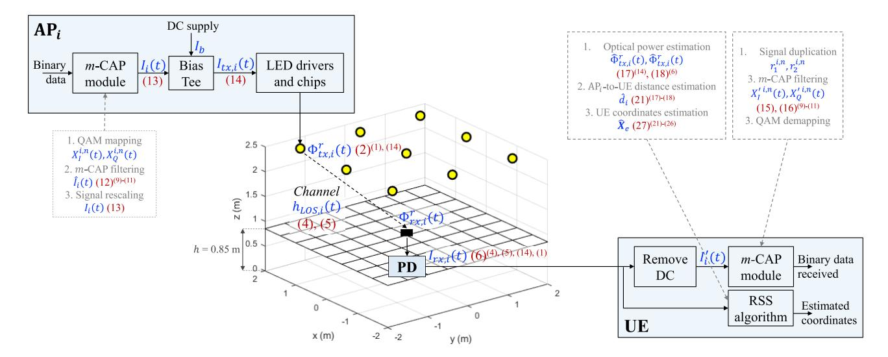

Fig. 1. System configuration (AP: access point, PD: photodiode, UE: user equipment). The main variables are in blue, whereas the equations used to compute them in the simulations are in red (normal font: main equations, superscript: secondary equations). The *m*-CAP modulation, demodulation and RSS algorithm are detailed in the corresponding grey dashed boxes, with reference to variables and equations defined in Sections II-E and II-F. The other variables and equations are defined in Sections II-C and II-D.

study does not aim to compare the performance of different modulation and positioning techniques, so the 'Data rate' and 'Positioning accuracy' criteria are given in Table I for information and not for comparison.

### B. General Architecture of the Proposed System

As detailed in Fig. 1, the proposed system is composed of nine access points (APs), installed on the ceiling of a 4 m  $\times$  4 m  $\times$  2.5 m (length, width, height) room and oriented toward the floor. A single UE is considered. It is oriented toward the ceiling while moving in an x-y plane located 85 cm above the floor. In this section, we consider without loss of generality the i-th AP, which operates as follows.

First, a binary data stream is modulated using an m-CAP scheme. The resulting digital signal is then turned into a scaled analog signal  $I_i(t)$  by a digital-to-analog converter (DAC), to which a DC current  $I_b$  is added via a bias tee to fit the LED characteristics. The resulting signal  $I_{tx,i}(t)$  is eventually fed to the transmitter, composed of an LED driver of impulse response  $h_{\text{LED}}(t)$  and of an LED of wall-plug efficiency  $\eta_{\text{WPE}}$  [31]. This transmitting chain is further detailed in Section II-C.

After free space propagation over a distance  $d_i$ , which influence is detailed in Section II-D, the light signal sent by the i-th AP is collected by the UE using a PD of photosensitivity  $R_{\rm PD}$ , and thus turned into a proportional photocurrent  $I_{rx,i}(t)$ . This analog signal may be first filtered, then converted into a digital signal by an analog-to-digital converter (ADC), and finally processed to recover, on the one hand, the transmitted data as explained in Section II-E, and on the other hand, the UE localization as detailed in Section II-F.

The data stream transmitted by each AP may be formatted according to the medium access control (MAC) cycle structure detailed in Fig. 2. The nine APs first transmit all together the same preamble, specifying for example the modulation and synchronization schemes used and the time and frequency slots

allocated to each AP when multiple access (MA) is needed. This way, the signal received by the UE will be stronger than if it was transmitted by a single AP, hence optimizing the performance of signaling reception. Then, each AP transmits consecutively a location data frame containing at least its coordinates and the optical power it radiates, but short enough that users do not notice any fluctuation in the average illuminance. This way, the UE will be able to measure the optical power received from each AP without interference from the other APs, which is critical to apply then the RSS algorithm. Finally, once all the location data frames have been sent, the nine APs transmit their respective payload following the chosen MA technique.

#### C. Design and Modeling of the Light Sources

The joint sensing and communication system proposed here is above all a lighting system. Consequently, all its parameters must be carefully chosen to ensure an illuminance that complies with the regulations in force for the chosen use case. Here, we consider the scenario of a room dedicated to basic office work, where the illuminance level should be at least 300 lux, and where this minimum level should not be less than 20% of the maximum illuminance [32].

All AP embed light sources of identical characteristics. However, since the datasheets of commercial LED lighting never mention all the optical and electrical parameters relevant for communication and sensing purpose, we preferred to base the design of our sources on Lumileds LUXEON Rebel white LED chips, which characteristics are much more detailed [33]. Each light source is thus composed of four LUXEON LED chips, and each chip is driven in parallel by a 700 mA current, corresponding to a 3.5 V voltage, so as to emit an average luminous flux of 220 lm. Therefore, the *i*-th light source consumes an average electrical power of  $P_{tx,i} = 4 \times 0.7 \times 3.5 = 9.8$  W and emits an average luminous flux  $\Phi_{tx,i}^p = 880$  lm, giving a luminous efficacy of 90 lm/W,

{3}------------------------------------------------

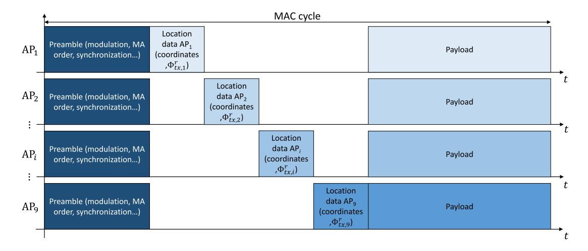

Fig. 2. Proposed MAC cycle for joint sensing and communication with nine white LED-based APs.

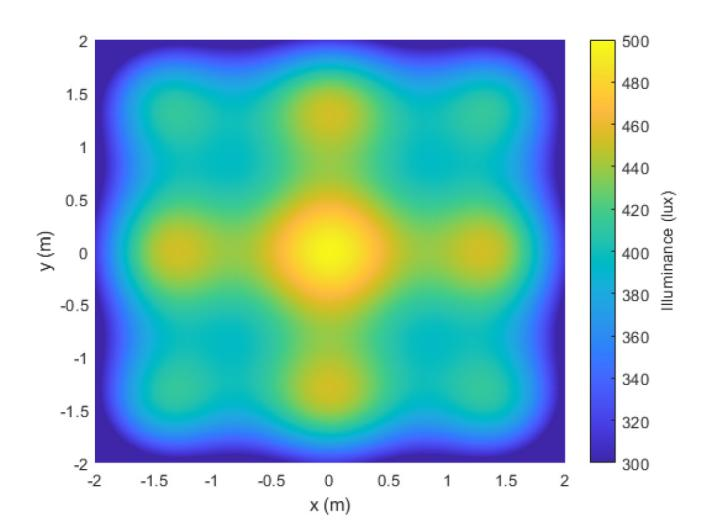

Fig. 3. Distribution of illuminance provided by the proposed system.

a common value for LED lighting. Assuming these chips are mounted on a reflector-based optical system, we set the semi-angle at half-power  $\Phi_{1/2,i}$  of each light source to be 30°, which is also a common value for LED lighting. Using these parameters, we obtain eventually the illuminance map shown in Fig. 3, where we can see the minimum and maximum illuminance levels reach around 300 lux and 500 lux respectively, hence meeting the targeted lighting constraints.

Since our light communication and sensing system relies on a PD and not on human eyes, the optical parameters relevant for its characterization must however be expressed in radiometric units rather than photometric ones. In our case, the average optical power, or radiant flux,  $\Phi^r_{tx,i}$  emitted by a light source of average luminous flux  $\Phi^p_{tx,i} = 880$  lm in photopic conditions and of wavelength spectrum such as that in [33] is 2.84 W. Note that we can also deduce from this value that the wall-plug efficiency  $\eta_{WPE} = \Phi^r_{tx,i}/P_{tx,i}$  of the light sources – i.e., their ability to turn the consumed electrical power  $P_{tx,i}$  into an emitted optical power  $\Phi^r_{tx,i}$  – is equal to 0.29, which is also a common value in LED lighting [34].

In practice, the signal  $I_{tx,i}(t)$  fed to the LED driver is a current signal varying in real-time depending on the data to transmit. In order to model our system, it is therefore useful to define a relationship between this current and the instantaneous optical power signal emitted by each light source  $\Phi^r_{tx,i}(t)$ . As shown in [31], the output optical power of a gallium nitride LED is a non-linear polynomial function of its drive current. However, by using an appropriate DC bias  $I_b$  and setting the swing  $\Delta I_i$  of  $I_{tx,i}(t)$  so that  $I_b \pm \Delta I_i$  remains between the fixed limits  $I_{max}$  and  $I_{min}$ , the drive current  $I_{tx,i}(t)$  can be set to lie in the linear region of the LED.

Here, we consider this linear region to range from 400 mA to 1 A, which corresponds for each LED chip to a current swing  $\Delta I_i = \pm 300$  mA with a current bias  $I_b = 700$  mA. In such a case, the current-to-optical power relationship can be reduced to a first-order polynomial and is thus linear, of coefficient  $\eta_{EO}$ . In order to also take into account the constraints imposed by the limited modulation bandwidth of the LED chips and their driver, we consider that these elements behave as a first-order low-pass filter of -3 dB cut-off frequency  $f_{LED}$ , which impulse response  $h_{LED}(t)$  is thus given by:

$$h_{\text{LED}}(t) = e^{-2\pi f_{\text{LED}}t}.$$
 (1)

Consequently, the drive current-to-transmitted optical power relationship can be written as:

$$\Phi_{tx,i}^{r}(t) = \eta_{\text{EO}} I_{tx,i}(t) \otimes h_{\text{LED}}(t), \tag{2}$$

where  $\otimes$  is the time domain convolution. Note that according to this first-order model, the current-to-optical power conversion factor  $\eta_{EO}$  can also be directly linked with the wall-plug efficiency  $\eta_{WPE}$  by  $\eta_{WPE} = \eta_{EO}V_b$ , with  $V_b$  the bias voltage matching the current DC bias  $I_b$ , and when the alternative current (AC) part of the drive signal  $I_{tx,i}(t)$  has a null mean.

# D. The Optical Wireless Channel

Once the drive current signal  $I_{tx,i}(t)$  of the *i*-th AP is turned into a light signal of instantaneous optical power  $\Phi_{tx,i}^r(t)$ , it travels through free space before being collected and turned

{4}------------------------------------------------

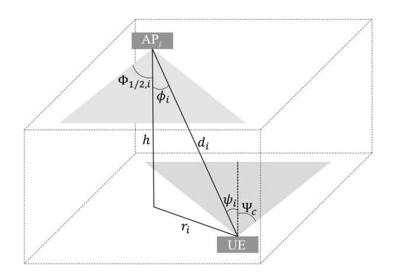

Fig. 4. Light transmission between LED and receiver.

into a photocurrent  $I_{rx,i}(t)$  by the PD in the UE. In order to setup a relationship between these two currents, and knowing (2), we now need to establish the link between  $\Phi^r_{tx,i}(t)$  and  $I_{rx,t}(t)$ , which can be done from the commonly used OWC channel model [35], according to which:

$$I_{rx,i}(t) = R_{\text{PD}} \Phi_{tx,i}^{r}(t) \otimes h_i(t) + n(t), \tag{3}$$

where  $R_{PD}$  is the PD responsivity, n(t) is the channel noise, usually modeled as a signal independent additive white Gaussian Noise (AWGN) of power spectral density (PSD)  $N_0$ , and  $h_i(t)$  is the optical wireless channel impulse response between the i-th AP and the UE.

In indoor OWC systems, the channel impulse response is composed of a line-of-sight (LOS) component  $h_{LOS,i}(t)$  coming from the direct path between the AP and the UE, and of a diffuse component – also know as non-line-of-sight (NLOS) component  $h_{NLOS,i}(t)$  – coming from the multiple paths that include at least one reflection between the AP and the UE. In this work, the NLOS component is not taken into account, since its contribution has been shown to be negligible, except at the room edges [36], so that  $h(t) = h_{LOS,i}(t)$ .

In practice, the LOS impulse response  $h_{LOS,i}(t)$  can be modeled as:

$$h_{\text{LOS},i}(t) = H_{\text{LOS},i}(0)\delta\left(t - \frac{d_i}{c}\right),\tag{4}$$

where  $\delta(\cdot)$  is the Dirac function, c is the light speed so that  $d_i/c$  is the propagation delay between the i-th AP and the UE, and  $H_{\text{LOS},i}(0)$  is the channel DC-gain, which mainly depends on the link geometry. Assuming the link geometry is as represented on Fig. 4, then it can be shown that [35]:

$$H_{\text{LOS,i}}(0) = \begin{cases} \frac{A_{\text{PD}}(m_i+1)}{2\pi d_i^2} \cos^{m_i}(\phi_i) \cos(\psi_i) T_f(\psi_i) G_c(\psi_i) \\ \text{if } 0 \le \psi_i \le \Psi_c \text{ and } 0 \le \phi_i \le \pi/2, \\ 0 \text{ otherwise,} \end{cases}$$
 (5)

where  $\phi_i$  is the radiation angle,  $\psi_i$  is the incident angle,  $\Psi_c$  is the PD field-of-view (FOV),  $A_{PD}$  is its sensitive area,  $m_i$  is the order of Lambertian emission of the *i*-th light source, which is related to its semi-angle at half-power  $\Phi_{1/2,i}$  by  $m_i = -\ln 2/\ln(\cos(\Phi_{1/2,i}))$ , and where  $T_f(\psi_i)$  and  $G_c(\psi_i)$  are respectively the gain of the optical filter and of the optical

concentrator that may be added in front of the PD to enhance light collection. Note also that the incident angle  $\psi_i$  of any light ray must be lower than the PD FOV  $\Psi_c$ , otherwise it will not be collected.

Consequently, by mixing (2), (3) and (4), we can show that the relationship between the drive current of the LED in the *i*-th AP and the photocurrent produced by the PD in the UE is:

$$I_{rx,i}(t) = \eta_{EO} H_{LOS,i}(0) R_{PD} \times \left[ I_{tx,i}(t) \otimes h_{LED}(t) \otimes \delta \left( t - \frac{d_i}{c} \right) \right] + n(t). \quad (6)$$

#### E. m-CAP Data Transmission Principles

The drive current  $I_{tx,i}(t)$  of the *i*-th AP depends on the modulation adopted, which is here an *m*-CAP modulation, where m is the total number of sub-bands [17]. Each AP embeds an m-CAP module, where a binary data stream is first mapped over the m sub-bands by a quadrature amplitude modulation (QAM) mapping scheme of order  $M_n$ , with  $n = 1, \ldots, m$  the sub-band index. Note that here, we adopt a uniform bit loading strategy so that  $M_n = M$  for all n.

In this work, the m-CAP module is designed in such a way that its main parameters are derived from a limited number of parameters that the designer can freely set. These degrees of freedom are the total bandwidth B of the m-CAP signal, the number of sub-bands m, their center frequencies  $f_{sc}^{i,n}$ , and their width  $B_{sc}^{i,n}$ , with n = 1, ..., m. In practice, B can be set from the LED frequency response, and the frequencies  $f_{sc}^{i,n}$  can then be selected to be less than B and greater than a certain DC-centered guard band. This prevents a significant portion of the signal power from being in low frequencies that may be disturbed by other artificial or natural light sources. Finally, the width of the sub-bands  $B_{sc}$  can be set to meet a target data rate  $R_b$  while ensuring sufficient guard bands between each sub-band. Assuming all sub-bands have the same width, that is  $B_{sc}^{i,n} = B_{sc}$  for all n, then the m-CAP symbol duration is indeed  $T_s = 1/B_{sc}$ , which thus means that  $R_b$  directly depends on  $B_{sc}$  through the relation:

$$R_b = \frac{m \log_2(M)}{T_s} = m \log_2(M) B_{sc}.$$
 (7)

In order to respect the chosen constraint on  $B_{sc}$ , the M-QAM data stream of each sub-band must first be upsampled by a factor  $N_{ss}$  setting the number of samples per symbol and defined as:

$$N_{ss} = \left\lfloor \frac{f_{samp}}{B_{sc}} \right\rfloor = \left\lfloor \frac{2B}{B_{sc}} \right\rfloor,\tag{8}$$

where  $\lfloor \cdot \rfloor$  is the floor function and  $f_{samp}$  is the base sampling frequency, defined as twice the m-CAP signal bandwidth B. These upsampled M-QAM symbols are then separated into their in-phase (real) and quadrature (imaginary) components, denoted in the continuous time domain as  $X_I^{i,n}(t)$  and  $X_Q^{i,n}(t)$  respectively.

These m pairs of in-phase and quadrature (I/Q) components are then filtered with analog or digital finite impulse response (FIR) filters of length  $L_{\rm SPAN}$ , of roll-off factor  $\alpha$  and of respective responses  $f_I^{i,n}(t)$  and  $f_Q^{i,n}(t)$ , designed such that they form

{5}------------------------------------------------

Hilbert pairs of time domain form:

$$f_I^{i,n}(t) = g_{SRRC}(t) \cdot \cos\left(\pi \frac{t}{T_s} (2n-1)(1+\alpha)\right), \tag{9}$$

$$f_Q^{i,n}(t) = g_{SRRC}(t) \cdot \sin\left(\pi \frac{t}{T_s} (2n-1)(1+\alpha)\right), \quad (10)$$

where  $g_{SRRC}(t)$  is the response of the square-root raised cosine (SRRC) pulse shaping filter, defined as:

$$g_{SRRC}(t) = \frac{\sin\left(\frac{(1-\alpha)\pi t}{T_s}\right) + \frac{4\alpha t}{T_s}\cos\left(\frac{(1+\alpha)\pi t}{T_s}\right)}{\frac{\pi t}{T_s}\left[1 - \left(\frac{4\alpha t}{T_s}\right)^2\right]}.$$
 (11)

After filtering, all sub-bands are summed together and then passed through a DAC to generate the modulation current  $\hat{I}_i(t)$ , given by:

$$\hat{I}_{i}(t) = \sum_{n=1}^{m} \left[ X_{I}^{i,n}(t) \otimes f_{I}^{i,n}(t) - X_{Q}^{i,n}(t) \otimes f_{Q}^{i,n}(t) \right].$$
 (12)

At this stage, the modulation current  $\hat{I}_i(t)$  is such that its mean value is null, i.e.,  $\mathbb{E}\{\hat{I}_i(t)\}=0$ , with  $\mathbb{E}\{\cdot\}$  the expected value function, and has a PAPR increasing with the number of sub-bands used m and the QAM order or each sub-band M [16]. This behavior may lead, after addition of the DC bias  $I_b$ , to a drive current ranging out of the linear region of the LED (i.e.,  $\max(I_{tx,i}(t)) > I_{max}$  and/or  $\min(I_{tx,i}(t)) < I_{min}$ , with  $\max(\cdot)$  and  $\min(\cdot)$  the maximum and minimum functions respectively).

To avoid this issue, but also to ensure that the luminous flux produced by each light source remains stable, the modulation current may thus be scaled so that its swing  $\Delta I_i$  equals  $(I_{max} - I_{min})/2$ . In practice, this scaling operation may be done by normalizing the m-CAP signal before digital-to-analog conversion, and then amplifying the resulting analog signal by a gain  $\Delta I_i$ . In this case, the scaled drive signal  $I_i(t)$  is given by:

$$I_i(t) = \frac{\hat{I}_i(t)}{\max(|\hat{I}_i(t)|)} \cdot \frac{I_{max} - I_{min}}{2},$$
(13)

where  $|\cdot|$  is the absolute value function. Finally, an appropriate DC bias  $I_b$  can be added via a bias tee to ensure the drive signal  $I_{tx,i}(t)$ , given by the following expression, lies in the linear region of the LED:

$$I_{tx,i}(t) = I_i(t) + I_b, \tag{14}$$

At the receiver, the DC component in the collected photocurrent signal  $I_{rx,i}(t)$  is first removed using a filter, after which the remaining current component  $I_i'(t)$  is sampled by an ADC and then duplicated into 2m equal signals denoted  $r_1^{i,n}$  and  $r_2^{i,n}$ . These signals are filtered using their associated matched filters  $f_I^{\prime i,n}$  and  $f_Q^{\prime i,n}$ , which are the time-reversed versions of the pulse shaping filters used at the transmitter side, i.e.,  $f_I^{\prime i,n}(t) = f_I^{i,n}(-t)$  and  $f_Q^{\prime i,n}(t) = f_Q^{i,n}(-t)$  when expressed in the time domain. The output waveforms for each sub-band are thus the recovered data streams  $X_I^{\prime i,n}$  and  $X_I^{\prime i,n}$ , given by:

$$X_{I}^{'i,n} = r_{1}^{i,n} \otimes f_{I}^{'i,n},$$
 (15)

$$X_O^{'i,n} = r_2^{i,n} \otimes f_O^{'i,n}. {16}$$

After down-sampling and recombination, these I/Q components are demapped and demodulated to recover binary data which can be compared to the original binary data in order to evaluate the BER performance of the link.

This brief description of the m-CAP principles shows that this modulation offers several degrees of freedom to the designer, including not only the number of sub-bands m, their central frequencies  $f_{sc}^{i,n}$ , their width  $B_{sc}$  and their QAM order M, but also the roll-off factor  $\alpha$  and length  $L_{SPAN}$  of the pulse shaping filters, which influence on the communication performance is critical [17].

#### F. RSS-Based Localization Principles

While the photocurrent  $I_{rx,i}(t)$  is processed to retrieve the transmitted data, it can also be used to estimate the UE localization via the RSS technique. RSS-based positioning consists in computing the ratio between the average optical power transmitted by each AP  $\Phi^r_{tx,i}$  and the corresponding average optical power collected by the UE  $\Phi^r_{rx,i}$ . Therefore, the first step in applying this method is for the UE to know the different values of  $\Phi^r_{tx,i}$ .

In practice, each AP is able to estimate its own  $\Phi^r_{tx,i}$ , or at least an image of this parameter, by computing the variance of its drive signal  $I_{tx,i}(t)$ , noted  $P_{tx,i}$ , and then converting it into a pseudo-optical power  $\hat{\Phi}^r_{tx,i}$  using:

$$\hat{\Phi}_{tx,i}^r = \eta_{\text{WPE}} P_{tx,i} = \eta_{\text{WPE}} \mathbb{V}(I_{tx,i}(t)), \tag{17}$$

with  $\mathbb{V}(\cdot)$  the variance function. Although the use of this method will be justified later, note already that in this case, the calculated pseudo-optical power is underestimated compared to the real optical power because the variance of  $I_{tx,i}(t)$  does not correspond exactly to the electrical power consumed by the AP, to which  $\eta_{\text{WPE}}$  normally applies. In any case, once estimated, this pseudo-optical power can then be easily sent by the AP to the UE via its allocated location data frame, as mentioned in Section II-C.

The second step in the application of the RSS technique is for the UE to estimate the optical power it receives from each AP, or at least here again an image of it. The solution adopted thus consists in computing the variance of the photocurrent signal  $I_{rx,i}(t)$ , produced by the PD when receiving the location data frame of each AP so that interference from the other APs is avoided. The resulting signal power  $\hat{P}_{rx,i}$  is then converted into a pseudo-received optical power  $\hat{\Phi}_{rx,i}^r$  using:

$$\hat{\Phi}_{rx,i}^r = \frac{\sqrt{P_{rx,i}}}{R_{PD}} = \frac{\sqrt{\mathbb{V}(I_{rx,i}(t))}}{R_{PD}}.$$
 (18)

Note that without additional hardware, there is no way to measure the actual received optical power, hence the need to compute  $\hat{\Phi}^r_{rx,i}$  through the variance of the photocurrent. This explains why on the AP side, the transmitted optical power is estimated through the drive signal variance rather than through the electrical power consumption, otherwise the comparison between  $\hat{\Phi}^r_{tx,i}$  and  $\hat{\Phi}^r_{tx,i}$  would not be relevant.

This comparison is at the heart of the third step, which consists in estimating the distance  $d_i$  between the i-th AP and the

{6}------------------------------------------------

UE using the values  $\hat{\Phi}^r_{tx,i}$  and  $\hat{\Phi}^r_{rx,i}$ . According to the optical wireless channel model, we know that [35]:

$$\frac{\Phi_{rx,i}^{r}}{\Phi_{rx,i}^{r}} = \frac{A_{\text{PD}}(m_{i}+1)}{2\pi d_{i}^{2}} \cos^{m_{i}}(\phi_{i}) \cos(\psi_{i}) T_{f}(\psi_{i}) G_{c}(\psi_{i}). \quad (19)$$

In this work, we assume the normal vectors of the APs and of the UE are colinear and of opposite direction, which means with reference to Fig. 4 that  $\phi_i = \psi_i$  and  $\cos(\phi_i) = h/d_i$ . We also assume the optical filter and concentrator gains do not vary with the incidence angle. In such a case, (19) can be simplified as follows:

$$\frac{\Phi_{rx,i}^r}{\Phi_{tx,i}^r} = \frac{A_{\text{PD}}(m_i + 1)T_f G_c h^{m_i + 1}}{2\pi d_i^{m_i + 3}}.$$
 (20)

Therefore, an estimate  $\hat{d}_i$  of  $d_i$  can be obtained using:

$$\hat{d}_{i} = \sqrt{(m_{i} + 3) \frac{A_{\text{PD}}(m_{i} + 1) T_{f} G_{c} h^{m_{i} + 1}}{2\pi} \cdot \frac{\hat{\Phi}_{tx,i}^{r}}{\hat{\Phi}_{rx,i}^{r}}}.$$
 (21)

Once at least four distances  $\hat{d}_i$  have been estimated, they can be projected into the receiver plane in order to calculate an estimate  $\hat{r}_i$  of their radial component  $r_i$  using:

$$\hat{r}_i = \sqrt{\hat{d}_i^2 - h^2}. (22)$$

Then, the actual UE coordinates, denoted as  $X_e = (x_e, y_e)$ , can be linked to the coordinates of the four closest APs  $\{(x_i, y_i)\}_{i=1...4}$  using the following system of equations:

$$\begin{cases} (x_e - x_1)^2 + (y_e - y_1)^2 = r_1^2 \\ (x_e - x_2)^2 + (y_e - y_2)^2 = r_2^2 \\ (x_e - x_3)^2 + (y_e - y_3)^2 = r_3^2 \\ (x_e - x_4)^2 + (y_e - y_4)^2 = r_4^2 \end{cases}$$
(23)

which can also be expressed in the matrix form:

$$BX_{e} = C, \tag{24}$$

with B and C defined as

$$\mathbf{B} = \begin{bmatrix} x_2 - x_1 & y_2 - y_1 \\ x_3 - x_1 & y_3 - y_1 \\ x_4 - x_1 & y_4 - y_1 \end{bmatrix}, \tag{25}$$

$$\mathbf{C} = \frac{1}{2} \begin{bmatrix} (r_1^2 - r_2^2) + (x_2^2 + y_2^2) - (x_1^2 + y_1^2) \\ (r_1^2 - r_3^2) + (x_3^2 + y_3^2) - (x_1^2 + y_1^2) \\ (r_1^2 - r_4^2) + (x_4^2 + y_4^2) - (x_1^2 + y_1^2) \end{bmatrix}. \tag{26}$$

$$C = \frac{1}{2} \begin{bmatrix} (r_1^2 - r_2^2) + (x_2^2 + y_2^2) - (x_1^2 + y_1^2) \\ (r_1^2 - r_3^2) + (x_3^2 + y_3^2) - (x_1^2 + y_1^2) \\ (r_1^2 - r_4^2) + (x_4^2 + y_4^2) - (x_1^2 + y_1^2) \end{bmatrix}.$$
(26)

In order to solve this system, we can use the linear least squares method [22], which gives eventually an estimation of the receiver coordinates  $\hat{X}_e = (\hat{x}_e, \hat{y}_e)$ , defined as:

$$\widehat{X}_e = (\mathbf{B}^T \mathbf{B})^{-1} \mathbf{B}^T \widehat{\mathbf{C}}, \tag{27}$$

with  $\hat{C}$  given by (26) where the  $r_i$  are replaced by their estimates  $\hat{r}_i$ . The root-mean square (RMS) localization error  $\Delta_{\text{RMS}}$ is finally given by:

$$\Delta_{\text{RMS}} = \sqrt{(\hat{x}_e - x_e)^2 + (\hat{y}_e - y_e)^2}.$$
 (28)

It appears clearly that this RMS error depends directly on the accuracy with which the radial distances  $\hat{r}_i$  are estimated, and thus on that of the AP-to-UE distances  $\hat{d}_i$ . Therefore, the UE

TABLE II SIMULATION PARAMETERS

| APs parameters                                |                                                                                                                                                                                                   |  |  |  |  |
|-----------------------------------------------|---------------------------------------------------------------------------------------------------------------------------------------------------------------------------------------------------|--|--|--|--|
| Parameter                                     | Value                                                                                                                                                                                             |  |  |  |  |
| 3D coordinates                                | $\begin{array}{c} \text{AP}_{1,2,3,4}\colon (\pm 1.5,\pm 1.5,2.5) \\ \text{AP}_{5,6}\colon (\pm 1.5,0,2.5) \\ \text{AP}_{7,8}\colon (0,\pm 1.5,2.5) \\ \text{AP}_{9}\colon (0,0,2.5) \end{array}$ |  |  |  |  |
| Semi-angle at half-power $(\Phi_{1/2})$       | 30°                                                                                                                                                                                               |  |  |  |  |
| -3 dB cut-off frequency $(f_{\rm LED})$       | 3 MHz [37]                                                                                                                                                                                        |  |  |  |  |
| Bias current $(I_b)$                          | 2.8 A (4×700 mA) [33]                                                                                                                                                                             |  |  |  |  |
| Bias voltage $(V_b)$                          | 3.5 V [33]                                                                                                                                                                                        |  |  |  |  |
| Linear region $(I_{min} \text{ to } I_{max})$ | 4×400 mA to 4×1 A [33]                                                                                                                                                                            |  |  |  |  |
| Electrical power consumption $(P_{tx,i})$     | 9.8 W                                                                                                                                                                                             |  |  |  |  |
| Optical power radiated $(\Phi^r_{tx,i})$      | 2.84 W                                                                                                                                                                                            |  |  |  |  |
| Wall-plug efficiency $(\eta_{\mathrm{WPE}})$  | 0.29 [34]                                                                                                                                                                                         |  |  |  |  |
| UE parameters                                 |                                                                                                                                                                                                   |  |  |  |  |
| Parameter                                     | Value                                                                                                                                                                                             |  |  |  |  |
| Height of the UE                              | 0.85  m  (i.e.  h = 1.65  m)                                                                                                                                                                      |  |  |  |  |
| FOV of the PD $(\Psi_c)$                      | 85° [38]                                                                                                                                                                                          |  |  |  |  |
| Responsivity of the PD $(R_{PD})$             | 0.63 A/W [38]                                                                                                                                                                                     |  |  |  |  |
| Effective area of the PD $(A_{PD})$           | 105.6 mm 2 [38]                                                                                                                                                                        |  |  |  |  |
| Optical filter gain $(T_f)$                   | 1 (no filter used)                                                                                                                                                                                |  |  |  |  |
| Optical concentrator gain $(G_c)$             | 1 (no concentrator used)                                                                                                                                                                          |  |  |  |  |
| Total bandwidth (B)                           | 10 MHz                                                                                                                                                                                            |  |  |  |  |
| Noise PSD $(N_0)$                             | $10^{-21}$ [39]                                                                                                                                                                                   |  |  |  |  |

may in practice prioritize the four larger values of  $\Phi_{rx}^r$ , which correspond to the four closest APs and should provide the best estimates of  $d_i$ .

#### III. SIMULATION RESULTS AND DISCUSSIONS

#### A. Simulation Hypothesis and Method

In our simulations, we consider the 4 m  $\times$  4 m  $\times$  2.5 m room shown in Fig. 1, where nine APs are evenly installed on the ceiling and where the UE may move in a 4 m  $\times$  4 m receiver plane located 85 cm above the floor. The different parameters of the APs and UE used during the simulations are detailed in Table II with their values.

Note that when possible, we set these values according to those of existing components. On the one hand, as detailed in Section II-C, each light source is made of four Lumileds LUXEON LED chips [33], from which we defined the APs bias current  $(I_h)$  and voltage  $(V_h)$  as well as their linear region  $(I_{max}-I_{min})$  and wavelength spectrum. We also set their -3 dB cut-off frequency  $f_{LED}$  to 3 MHz [37], although we exploited these components beyond this limit by sending m-CAP signals of bandwidth B = 10 MHz. On the other hand, we considered the photoreceiver in the UE to be composed of four Hamamatsu S6967 photodiodes in parallel [38], from which we extracted values for the FOV  $(\Psi_c)$ , responsivity  $(R_{PD})$  and effective area  $(A_{PD})$ . In parallel, we set the noise PSD at the receiver level to  $10^{-21}$  W/Hz [39].

The remaining degrees of freedom for the simulations are thus the main m-CAP parameters, listed in Table III. We compared two configurations having different number of sub-bands m and sub-bands width  $B_{sc}$  but providing eventually the same aggregated data rate  $R_b$ . For each configuration, we varied the QAM order of the sub-bands M, along with the FIR filters parameters like their roll-off factor  $\alpha$  and their length  $L_{\rm SPAN}$ .

{7}------------------------------------------------

| TABLE III        |
|------------------|
| m-CAP PARAMETERS |

| Parameter                           | Configuration 1                                                                                                                                                | Configuration 2     |  |
|-------------------------------------|----------------------------------------------------------------------------------------------------------------------------------------------------------------|---------------------|--|
| Number of sub-bands (m)             | 4                                                                                                                                                              | 8                   |  |
| Sub-bands frequencies $(f_{sc})$    | 1, 3, 5, 7 MHz                                                                                                                                                 | 1, 2, · · · , 8 MHz |  |
| Sub-bands width $(B_{sc})$          | 1 MHz                                                                                                                                                          | 500 kHz             |  |
| Symbol period $(T_s)$               | $1~\mu s$                                                                                                                                                      | $2 \mu s$           |  |
| QAM order (M)                       | $16 (R_b = 16 \text{ Mbps})$ $32 (R_b = 20 \text{ Mbps})$ $64 (R_b = 24 \text{ Mbps})$ $128 (R_b = 28 \text{ Mbps})$ $256 (R_b = 32 \text{ Mbps})$ |                     |  |
| Roll-off factor $(\alpha)$          | 0 to 1 by steps of 0.05                                                                                                                                        |                     |  |
| I/Q filters length $(L_{\rm SPAN})$ | 2, 6, 10, 14                                                                                                                                                   |                     |  |

Once all these parameters were set, we defined the coordinates of the UE in the receiver plane and used MATLAB to compute the fundamental variables which are listed successively from left to right in Fig. 1 (in blue) using the corresponding equations (in red). Therefore, we generated 34560 M-QAM symbols with each AP (i.e., more than  $10^5$  bits whatever the QAM order M > 8), which were then modulated with m-CAP, sent through the OWC channel and detected by the PD, before being processed to estimate the coordinates  $\widehat{X}_e$  of the UE on the one hand, and to recover the transmitted data on the other hand.

These results were then used to analyze the influence of the different *m*-CAP parameters on the sensing performance (Section III-B) and on the communication performance (Section III-C) by calculating respectively the RMS positioning error (28) and the bit error rate (BER) along with the signal-to-noise ratio (SNR) at the UE level. All these operation were eventually repeated for all the receiving points by moving the UE in 10 cm steps in the *x* and *y* directions of the receiver plane.

### B. Positioning Performance

1) Overall Performance: First, and without loss of generality, as we will see later, we focus on the positioning performance of 'Configuration 1' when  $\alpha = 0.4$ ,  $L_{\rm SPAN} = 10$  and M = 64. Figure 5 shows the spatial distribution of the RMS positioning error obtained when the DC part of the signals received consecutively by the UE from each AP is not filtered out. Note that such a method is only applicable if the room in which the system is deployed is not lit by additional natural or artificial light. We can see that this error varies between 0.3 cm and 11.7 cm, and is minimal at the center of each group of four APs on the one hand (e.g., point A), at mid-distance between two APs when x = 0 or y = 0 on the other hand (e.g., point B).

This is because at point A, the four signals used by the RSS algorithm to estimate the distances  $\hat{d}_i$  between the UE and the four closest APs have an SNR of 43.1 dB, 44.4 dB, 44.4 and 45.8 dB, whereas at point B, they have an SNR of 32.6 dB, 32.6 dB, 49.0 dB and 50.1 dB. However, the larger this SNR, the lower the error in  $\hat{d}_i$ . Consequently, at point B, the top two SNR values will give better absolute distance estimates than at point A, whereas the next two will give worse distance estimates, leading eventually to a similar RMS error.

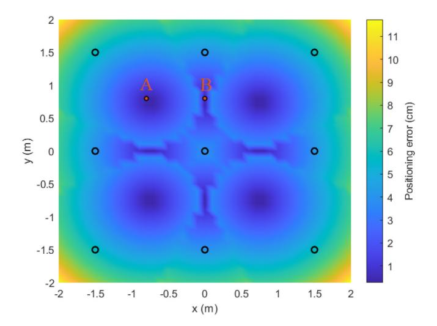

Fig. 5. Distribution of the RMS positioning error over a reception plane of resolution 10 cm in the *x* and *y* directions. The black circles indicate the coordinates of the APs whereas A and B are examples of points where the error is minimal.

Figure 6(a) provides another perspective on the RMS positioning error by showing in black solid line its cumulative distribution function (CDF), calculated from the 1681 values obtained in Fig. 5. We can see that in 90% of the cases, this error is lower than 7.17 cm. If the confidence threshold is set to 66% or 99%, the corresponding errors are 5.34 cm and 9.96 cm respectively, hence showing that the proposed system can provide a very interesting indoor positioning solution. Note that the results presented so far have been obtained by estimating the UE position only once at each test point. When this operation is repeated, the estimates obtained show only a very small variability of the order of a millimeter, which is why these results are not further detailed here.

Figure 6(a) also shows in black dotted line the CDF of the RMS positioning error when the noise PSD is not  $10^{-21}$  W/Hz but null, i.e., when the UE is considered noiseless. In such a case, we can see that there is still a non-null error, which in 90% of the case is lower than 6.95 cm. This is because the RSS algorithm adopted here does not rely on the calculation of the actual optical powers transmitted and received  $\Phi^r_{tx,i}$  and  $\Phi^r_{rx,i}$  but on pseudo optical powers calculated from the variances of the transmitted and received electrical signals  $I_{tx,i}(t)$  and  $I_{rx,i}(t)$ . These pseudo optical powers are lower than their actual counterparts, which leads to intrinsic positioning errors that could however be calibrated and thus corrected using specific methods. Such methods are nevertheless out of the scope of this article.

2) Influence of  $I_b$ ,  $\alpha$ ,  $L_{SPAN}$ , m and M: We now consider the case where the DC part of the signals received consecutively by the UE from each AP is filtered out, which may be necessary when the room is illuminated by additional natural or artificial sources in order to eliminate spurious DC levels. In such a case, the CDF of the RMS positioning error given by Fig. 6(b) shows that 90% of these errors are lower than 64.81 cm, a value way larger than that obtained when keeping the DC part of the received signals.

{8}------------------------------------------------

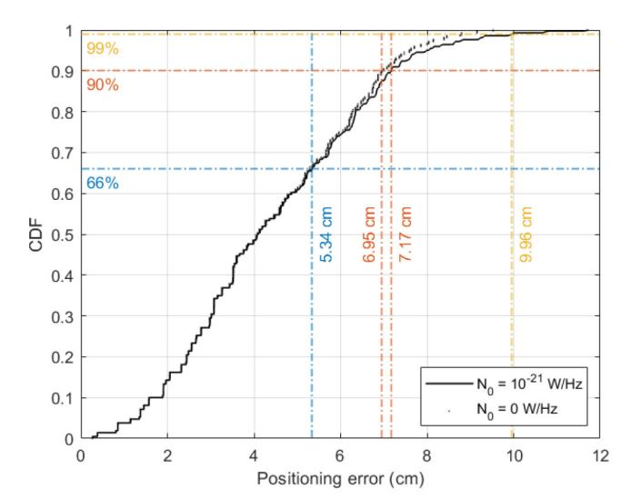

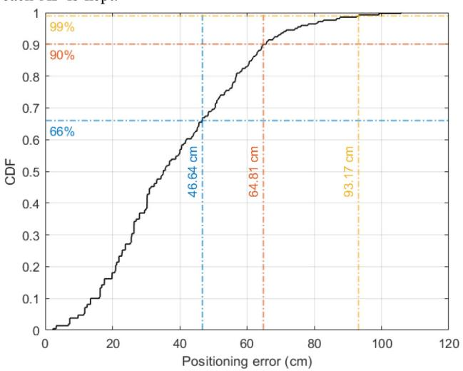

Fig. 6. CDF of the positioning error.

This gap comes from the lower optical power available when discarding the DC component, as highlighted in Fig. [7,](#page-8-2) which shows in orange and yellow the standard deviations of the drive signal with and without its DC part, i.e., of the current signals *Itx*,*i*(*t*) and *Itx*,*i*(*t*) − *Ib* respectively, to which the transmitted optical power is directly proportional according to our first order LED model. We can clearly see that this standard deviation is logically much lower when the DC part is removed, by a factor of about 7. In this case, the received optical power that can be exploited to retrieve the absolute distance between the UE and AP is thus also much lower than when keeping the DC component, leading to worse position estimates.

In Fig. [7,](#page-8-2) the standard deviations of *Itx*,*i*(*t*) and *Itx*,*i*(*t*) − *Ib* are actually given along with that of the initial data signal ˆ*Ii*(*t*) (in blue). They are represented as functions of the QAM order *M* and are framed by vertical bars indicating their minimum and maximum values as the roll-off factor α varies. For example, when *M* = 64, the standard deviation of ˆ*Ii*(*t*) varies

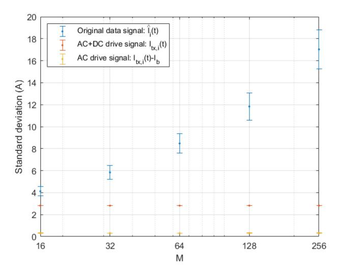

Fig. 7. Standard deviation of the transmitted signal against the QAM order *M*. The vertical bars indicate the variations in standard deviation observed when changing the roll-off factor.

between 7.58 A when α = 1 and 9.37 A when α = 0. Let us recall here that a roll-off factor close to 0 gives almost perfect bandpass filters, whose frequency response is similar to a gate function, while a roll-off factor close to 1 gives a very smooth frequency response at the bandwidth level. In other words, decreasing the roll-off factor leads to sharper I/Q filters and thus to signals with larger power over the same spectrum than when α = 1, hence the observed difference in standard deviation.

As a comparison, the standard deviations of *Itx*,*i*(*t*) and *Itx*,*i*(*t*) − *Ib* for the same QAM order are around 2.82 A and 0.32 A respectively, whatever the roll-off factor. These values also remain constant with the QAM order, whereas this parameter has a strong influence on the standard deviation of ˆ*Ii*(*t*). In order words, α and *M* have a negligible influence on the optical power transmitted by each AP. Although not shown here, the same consequences are observed when varying *L*SPAN and *m*, which can be explained by the scaling performed on ˆ*Ii*(*t*) to obtain *Itx*,*i*(*t*) and fit the LED current limits, which erases the differences in the standard deviation of ˆ*Ii*(*t*) introduced by the I/Q filters and the *m*-CAP parameters. The direct consequence of all this is that, in the end, the positioning performance of the proposed system is only marginally influenced by *m*, *M*, α and *L*SPAN.

#### *C. Communication Performance*

*1) Influence of* α *and LSPAN:* Figure [8](#page-9-0) shows the evolution of the average BER over the whole reception plane against the roll-off factor α for different couples of filter length *L*SPAN and number of sub-bands *m*, with a QAM-order *M* set to 64. Note that we focus here on the average BER rather than on its spatial distribution because it remains rather constant over the whole reception plane, as all APs are used to transmit simultaneously the same signal to the UE. In parallel, note that the black solid black line on Fig. [8](#page-9-0) shows the 3.8 × 10−3 BER limit under which a 7% overhead forward error correction (FEC) code is able to fully correct the corrupted data [\[40\]](#page-12-0).

{9}------------------------------------------------

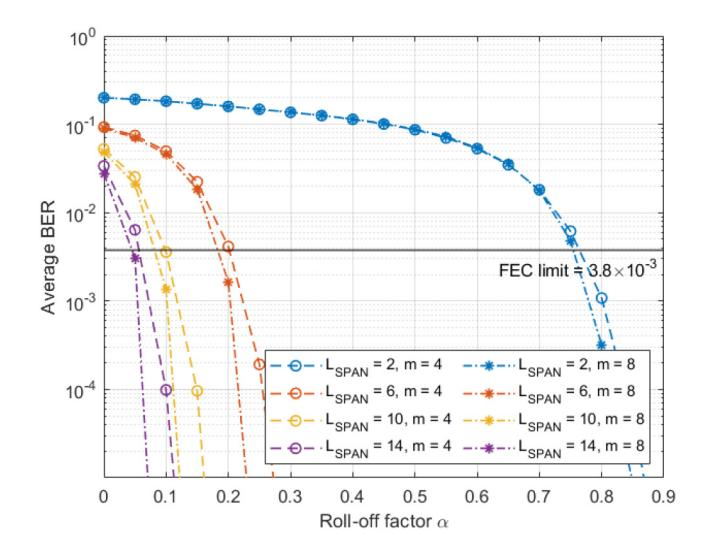

Fig. 8. Evolution of the average BER over the whole reception plane against the roll-off factor α for different filters length *L*SPAN and number of sub-bands *m*, when *M* = 64.

We can first clearly see that whatever the filters length and number of sub-bands, the average BER decreases as the roll-off factor α increases. As previously mentioned, increasing α tends to smooth the I/Q filters frequency response and thus reduces their non-linearity, so that the associated subbands will experience less clipping and thus better the BER performances [\[17\]](#page-11-16).

Then, we observe that for a given roll-off factor, the average BER gets lower as the filter's length increases. This is because the longer the filters, the more accurate the filtering process, and the better the performance. Such an explanation is especially valid when α gets closer to zero, as the filters approach ideal band-pass filters that will thus need a larger span to maintain a small level of residual inter-symbol interference (ISI) [\[17\]](#page-11-16). On the contrary, when α is close to 1, the transfer function of the filter is smoother so that it could be implemented in the digital domain with a lower span for the same level of residual ISI.

*2) Influence of M and m:* Figure [9](#page-9-1) gives the evolution of the average BER against the roll-off factor α for a given filter length *L*SPAN = 10 while the QAM-order *M* of the sub-bands varies between 16 and 256 and the number of sub-bands *m* changes from 4 to 8. We can first confirm that the observations previously made for a QAM-order of 64 are also valid for other values of *M*. In other words, the average BER decreases as the roll-off factor α increases whatever the modulation order, which can be explained by the same reasons as mentioned above.

Then, it can be clearly seen that for a given roll-off factor, the average BER becomes higher as the modulation order increases. This is because for the same symbol energy, the higher the *M*, the smaller the distance between each constellation point, which leads to a higher BER for a given noise level. Despite this limitation, we can observe that the average BER is below the FEC limit whatever the QAM-order and number of sub-bands for roll-off factors α > 0.2. In this case, the spatial distribution of BER is also such that this metric is

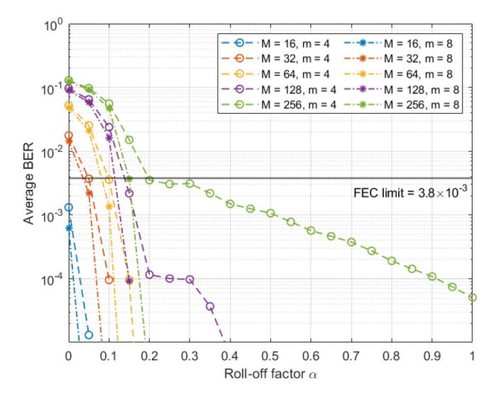

Fig. 9. Evolution of the average BER over the whole reception plane against the roll-off factor α for different modulation orders *M* and number of subbands *m*, when *L*SPAN = 10.

below the FEC limit at any point in the room, showing that our system can provide continuous communication coverage even when the modulation order and thus the data rate and spectral efficiency are increased.

The BER performance can further be improved by moving from *m* = 4 sub-bands to *m* = 8 sub-bands. Note that here, we also changed the sub-bands width when varying *m* so that the data rate remained constant for a given QAM-order, as highlighted in Table [III.](#page-7-0) Figures [8](#page-9-0) and [9](#page-9-1) show not only that when *m* = 8, the same behavior as in the previous sections can be observed, but also that the average BER is lower in this case than when *m* = 4. The reason for this is that as *m* increases, each sub-band has a smaller width and therefore experiences less distortion due to attenuation caused by the LED low-pass filter, even though the envelope of each signal has the same shape. In other words, increasing the number of sub-bands helps to limit frequency-selective channel fading, as also demonstrated in [\[15\]](#page-11-14).

From these various observations, we can deduce that from the communication point of view, it is in our best interest to use *m*-CAP modulations with a large number of sub-bands implemented with I/Q filters of high length and roll-off factor. However, higher *m* values will lead to greater hardware complexity due to the greater number of FIR filters required. Similarly, longer I/Q filters are more complex to implement. At the same time, increasing the roll-off factor introduces for each *m*-CAP band an increasing excess bandwidth, and thus reduces the overall spectral efficiency of the scheme. Consequently, a trade-off must be made when α and *L*SPAN are chosen. Here, we consider that a number of sub-bands *m* = 4, a roll-off factor α = 0.4 and a filter length *L*SPAN = 10 provide a good compromise between performance and complexity, so that these values may be used as standard configuration.

*3) Independent Performance of Each AP:* In such a configuration, we already know that when all AP transmit the same signal at the same time, the BER remains below the FEC limit at all points in the room. Let us now consider the case where

{10}------------------------------------------------

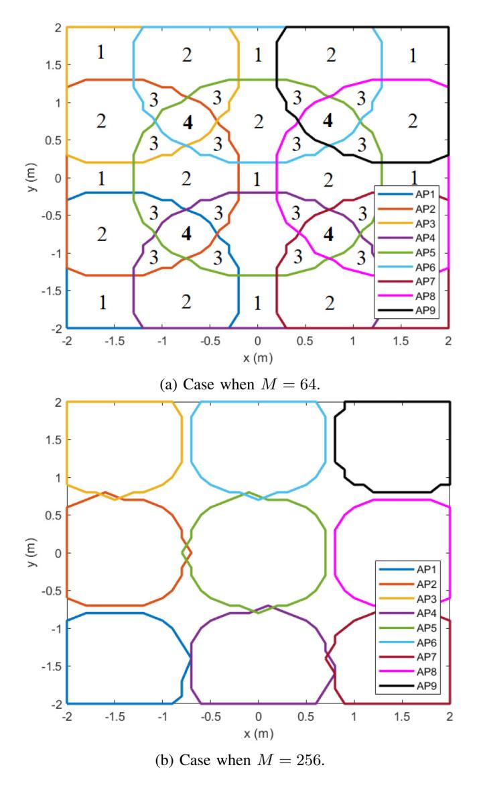

Fig. 10. Coverage area of each AP when used successively and not together to transmit a data signal. The numbers indicate the number of overlapping coverage areas.

each AP transmits data successively during time slots short enough that users do not notice any fluctuation in the average illuminance, as is the case with the location data frames shown in Fig. [2.](#page-3-1) Figure [10](#page-10-1) shows for each AP the boundary of its coverage area, defined as the area where the BER remains below the FEC limit, when the QAM-order of all sub-bands is set to *M* = 64 (Fig. [10\(](#page-10-1)a)) and to *M* = 256 (Fig. [10\(](#page-10-1)b)).

In Fig. [10\(](#page-10-1)a), the number of overlapping coverage zones is also indicated. We can clearly see that the zones where the coverage areas of at least four APs overlap are very limited. We can also see that if a QAM order of 64 is used, an UE will be able to receive data with a BER below the FEC limit wherever it is in the room, providing handover mechanisms that are beyond the scope of this paper are implemented. Conversely, if the QAM order is set to 256, there are no overlapping areas of four APs and some areas will even not properly be covered by any AP. The influence of the modulation order on the coverage of our communication and sensing system is therefore critical, and highlights the interdependence between both functions.

## *D. Interdependence Between Communication and Sensing*

As illustrated above, some modulation parameters such as the number of sub-bands *m*, the roll-off factor α or the filter length *L*SPAN have a very limited impact on the positioning performance. However, other parameters like the QAM order have a direct influence on the communication coverage of our system, which has itself a direct influence on the localisation performance, as the UE needs to receive correctly the location data frames of at least four neighbouring APs in order to have knowledge of the optical power emitted by all the APs from which it receives signals and thus to use the RSS localisation algorithm correctly.

Therefore, in order to ensure proper operation over the whole reception plane without having to degrade the modulation settings, each AP could transmit during its dedicated slot not only its own location data but also that of the neighboring APs. Adaptive bit loading strategies could also be used [\[15\]](#page-11-14), applying for example low QAM orders when transmitting the location data frames and variables QAM orders when transmitting the payload. In all cases, such solutions would however increase the duration of the traffic dedicated to signaling transmission, and thus reduce that of user traffic. Therefore, they could be combined with other solutions, such as the optimization of the AP layout or of the light sources parameters, and especially of their beam pattern, taking however into consideration the lighting constraints.

On its side, the sensing function has very little impact on communications performance, as it mainly relies on the estimation of the transmitted and received optical power. However, the necessary transmission of location data frames adds an overhead, which could probably be reduced by optimizing the MAC cycle structure, although such an optimization is out of the scope of this paper.

# IV. CONCLUSIONS AND FUTURE WORK

In this paper, a joint visible light communication and sensing system using the *m*-CAP modulation and an RSS-based trilateration algorithm is proposed and assessed for the first time. This system is designed to take into account the lighting constraints of the deployment scenario, as well as the bandwidth and current limitations of the LED light sources it uses. The communication and sensing performance is then fully investigated, with a specific attention on the influence of the number of sub-bands *m*, the QAM order *M*, the I/Q filters roll-off factor α and length *L*SPAN or the DC bias *Ib*.

The simulations show that in the proposed set-up, an UE placed at any point 85 cm above the floor will be exposed to an illuminance between 300 and 500 lux, will be located with an error lower than 7.17 cm in 90% of the cases, and will be able to receive data at 32 Mbps with a BER < 3.8×10−3. They also show that the positioning error depends strongly on the bias current *Ib* but marginally on the other studied parameters, whereas the communication performance increase with *m*, α and *L*SPAN, however at the cost of complexity.

These results show that despite lighting and LED constraints, the proposed *m*-CAP and RSS-based joint communication and sensing system could be performing enough to 

{11}------------------------------------------------

support part of the current LBS services such as 4K broadcasting, which currently requires between 15 and 18 Mbps data rates [\[41\]](#page-12-1), or some virtual reality applications [\[42\]](#page-12-2), but also future services that will come with beyond 5G and 6G technologies.

Our simulations also provide useful insight on how to properly implement such an *m*-CAP/RSS system in practice in order to validate it experimentally, an aspect on which we are now focusing our efforts. In parallel, the simulation model used will be improved in order to study the impact on communication and sensing performance of certain critical phenomena such as the propagation of NLOS signals [\[43\]](#page-12-3), the random orientation of the UE caused by the user's movements, but also to take into account a finer model of the photoreceiver and allow 3D positioning [\[44\]](#page-12-4) while reducing the interdependence between communication and sensing. This improved model will finally be used to perform a fair comparison between different modulation schemes, such as *m*-CAP, DCO-OFDM, ACO-OFDM or LACO-OFDM.

# REFERENCES

- [1] Y. Jeong, S. Cho, G. Kim, C. Ahn, S. Lee, and W. Kim, "Location based service based on digital multimedia broadcasting," in *Dig. Tech. Papers Int. Conf. Consum. Electron.*, 2006, pp. 147–148.
- [2] N. Jawad *et al.*, "Smart television services using NFV/SDN network management," *IEEE Trans. Broadcast.*, vol. 65, no. 2, pp. 404–413, Jun. 2019.
- [3] C. Chaccour, M. N. Soorki, W. Saad, M. Bennis, P. Popovski, and M. Debbah, "Seven defining features of terahertz (THz) wireless systems: A fellowship of communication and sensing," *IEEE Commun. Surveys Tuts.*, vol. 24, no. 2, pp. 967–993, 2nd Quart., 2022.
- [4] T. Wild, V. Braun, and H. Viswanathan, "Joint design of communication and sensing for beyond 5G and 6G systems," *IEEE Access*, vol. 9, pp. 30845–30857, 2021.
- [5] H. Sarieddeen, N. Saeed, T. Y. Al-Naffouri, and M.-S. Alouini, "Next generation terahertz communications: A rendezvous of sensing, imaging, and localization," *IEEE Commun. Mag.*, vol. 58, no. 5, pp. 69–75, May 2020.
- [6] D. Karunatilaka, F. Zafar, V. Kalavally, and R. Parthiban, "LED based indoor visible light communications: State of the art," *IEEE Commun. Surveys Tuts.*, vol. 17, no. 3, pp. 1649–1678, 3rd Quart., 2015.
- [7] Y. Zhuang *et al.*, "A survey of positioning systems using visible LED lights," *IEEE Commun. Surveys Tuts.*, vol. 20, no. 3, pp. 1963–1988, 3rd Quart., 2018.
- [8] X. Zhang, Z. Babar, P. Petropoulos, H. Haas, and L. Hanzo, "The evolution of optical OFDM," *IEEE Commun. Surveys Tuts.*, vol. 23, no. 3, pp. 1430–1457, 3rd Quart., 2021.
- [9] *High-Speed Indoor Visible Light Communication Transceiver—-System Architecture, Physical Layer and Data Link Layer Specification*, Rec. ITU-T G.9991, Int. Telecommun. Union, Geneva, Switzerland, Mar. 2019.
- [\[10\]](#page-0-0) M. S. Islim and H. Haas, "Modulation techniques for Li-Fi," *ZTE Commun.*, vol. 14, no. 2, pp. 29–40, 2016.
- [\[11\]](#page-0-0) M. R. H. Mondal, "Comparison of DCO-OFDM, ADO-OFDM, HDC-OFDM and HNC-OFDM for optical wireless communications," *J. Opt. Commun.*, vol. 42, no. 2, pp. 325–340, 2021.
- [\[12\]](#page-0-1) F.-M. Wu, C.-T. Lin, C.-C. Wei, C.-W. Chen, H.-T. Huang, and C.-H. Ho, "1.1-gb/s white-LED-based visible light communication employing carrier-less amplitude and phase modulation," *IEEE Photon. Technol. Lett.*, vol. 24, no. 19, pp. 1730–1732, Oct. 1, 2012.
- [\[13\]](#page-0-1) M. I. Olmedo *et al.*, "Multiband carrierless amplitude phase modulation for high capacity optical data links," *J. Lightw. Technol.*, vol. 32, no. 4, pp. 798–804, Feb. 15, 2014.
- [\[14\]](#page-0-1) P. A. Haigh *et al.*, "A multi-CAP visible-light communications system with 4.85-b/s/Hz spectral efficiency," *IEEE J. Sel. Areas Commun.*, vol. 33, no. 9, pp. 1771–1779, Sep. 2015.
- [\[15\]](#page-0-1) P. A. Haigh *et al.*, "Multi-band carrier-less amplitude and phase modulation for bandlimited visible light communications systems," *IEEE Wireless Commun.*, vol. 22, no. 2, pp. 46–53, Apr. 2015.

- [\[16\]](#page-0-1) M.-A. Khalighi, S. Long, S. Bourennane, and Z. Ghassemlooy, "PAMand CAP-based transmission schemes for visible-light communications," *IEEE Access*, vol. 5, pp. 27002–27013, 2017.
- [\[17\]](#page-0-1) M. M. Merah, H. Guan, and L. Chassagne, "Experimental multi-user visible light communication attocell using multiband carrierless amplitude and phase modulation," *IEEE Access*, vol. 7, pp. 12742–12754, 2019.
- [\[18\]](#page-0-1) X. Li *et al.*, "A full-digital *M*-CAP receiver with synchronisation and adaptive blind equalisation for visible light communications," *J. Lightw. Technol.*, vol. 40, no. 8, pp. 2409–2426, Apr. 15, 2022.
- [\[19\]](#page-1-2) F. Zafari, A. Gkelias, and K. K. Leung, "A survey of indoor localization systems and technologies," *IEEE Commun. Surveys Tuts.*, vol. 21, no. 3, pp. 2568–2599, 3rd Quart., 2019.
- [\[20\]](#page-1-3) P. Lou, H. Zhang, X. Zhang, M. Yao, and Z. Xu, "Fundamental analysis for indoor visible light positioning system," in *Proc. 1st IEEE Int. Conf. Commun. China Workshops (ICCC)*, 2012, pp. 59–63.
- [\[21\]](#page-1-3) X. Guo, S. Shao, N. Ansari, and A. Khreishah, "Indoor localization using visible light via fusion of multiple classifiers," *IEEE Photon. J.*, vol. 9, no. 6, pp. 1–16, Dec. 2017.
- [\[22\]](#page-1-3) W. Zhang, M. I. S. Chowdhury, and M. Kavehrad, "Asynchronous indoor positioning system based on visible light communications," *Opt. Eng.*, vol. 53, no. 4, pp. 1–10, 2014.
- [\[23\]](#page-1-3) W. Gu, W. Zhang, M. Kavehrad, and L. Feng, "Three-dimensional light positioning algorithm with filtering techniques for indoor environments," *Opt. Eng.*, vol. 53, no. 10, pp. 1–11, 2014.
- [\[24\]](#page-1-3) L. Li, P. Hu, C. Peng, G. Shen, and F. Zhao, "Epsilon: A visible light based positioning system," in *Proc. 11th USENIX Symp. Netw. Syst. Des. Implement. (NSDI)*, Seattle, WA, USA, Apr. 2014, pp. 331–343. [Online]. Available: https://www.usenix.org/conference/ nsdi14/technical-sessions/presentation/li
- [\[25\]](#page-1-4) Y. Xu *et al.*, "Accuracy analysis and improvement of visible light positioning based on VLC system using orthogonal frequency division multiple access," *Opt. Exp.*, vol. 25, no. 26, pp. 32618–32630, 2017.
- [\[26\]](#page-1-4) H. Yang, W.-D. Zhong, C. Chen, A. Alphones, and P. Du, "QoS-driven optimized design-based integrated visible light communication and positioning for indoor IoT networks," *IEEE Internet Things J.*, vol. 7, no. 1, pp. 269–283, Jan. 2020.
- [\[27\]](#page-1-4) H. Yang, C. Chen, W.-D. Zhong, S. Zhang, and P. Du, "An integrated indoor visible light communication and positioning system based on FBMC-SCM," in *Proc. IEEE Photon. Conf. (IPC)*, 2017, pp. 129–130.
- [\[28\]](#page-1-4) M. Nassiri, G. Baghersalimi, and Z. Ghassemlooy, "A hybrid VLP and VLC system using *m*-CAP modulation and fingerprinting algorithm," *Opt. Commun.*, vol. 473, Oct. 2020, Art. no. 125699.
- [\[29\]](#page-1-4) B. Lin, X. Tang, Z. Ghassemlooy, C. Lin, and Y. Li, "Experimental demonstration of an indoor VLC positioning system based on OFDMA," *IEEE Photon. J.*, vol. 9, no. 2, pp. 1–9, Apr. 2017.
- [\[30\]](#page-1-4) H. Yang, C. Chen, W.-D. Zhong, A. Alphones, S. Zhang, and P. Du, "Demonstration of a quasi-gapless integrated visible light communication and positioning system," *IEEE Photon. Technol. Lett.*, vol. 30, no. 23, pp. 2001–2004, Dec. 1, 2018.
- [\[31\]](#page-2-3) X. Deng, "Throughput, power consumption and interference considerations in visible light communication," Ph.D. dissertation, Dept. Elect. Eng., Technische Universiteit Eindhoven, Eindhoven, The Netherlands, 2018.
- [\[32\]](#page-2-4) *Light and Lighting—Lighting of Work Places—Part 1: Indoor Work Places*, DIN Standard EN 12464-1, 2021.
- [\[33\]](#page-2-5) *LUXEON Rebel—General Purpose White*, Lumileds, Haarlemmermeer, The Netherlands, 2016.
- [\[34\]](#page-3-4) E. Schubert, *Light Emitting Diodes*, Cambridge, U.K.: Cambridge Univ. Press, 2006.
- [\[35\]](#page-4-4) Z. Ghassemlooy, M.-A. Khalighi, and D. Wu, "Channel modeling," in *Visible Light Communications*. Boca Raton, FL, USA: CRC Press, 2017, pp. 71–96.
- [\[36\]](#page-4-5) L. An, H. Shen, J. Wang, Y. Zeng, and R. Ran, "Energy efficiency optimization for MIMO visible light communication systems," *IEEE Wireless Commun. Lett.*, vol. 9, no. 4, pp. 452–456, Apr. 2020.
- [\[37\]](#page-6-5) D. H. Kwon, S. H. Yang, and S. K. Han, "Modulation bandwidth enhancement of white-LED-based visible light communications using electrical equalizations," in *Proc. Broadband Access Commun. Technol. IX*, 2015, pp. 171–176.
- [\[38\]](#page-6-6) *Si PIN Photodiodes S2506/S6775/S6967 Series*, Hamamatsu, Bridgewater, NJ, USA, 2021.
- [\[39\]](#page-6-7) Y. Hei, Y. Kou, G. Shi, W. Li, and H. Gu, "Energy-spectral efficiency tradeoff in DCO-OFDM visible light communication system," *IEEE Trans. Veh. Technol.*, vol. 68, no. 10, pp. 9872–9882, Oct. 2019.

{12}------------------------------------------------

- [\[40\]](#page-8-3) *Forward Error Correction for High Bit-Rate DWDM Submarine Systems*, Rec. ITU-T G.975.1, Int. Telecommun. Union, Geneva, Switzerland, Feb. 2004.
- [\[41\]](#page-11-39) "Cisco annual Internet report (2018–2023) white paper," San Jose, CA, USA, Cisco, White Paper, Mar. 2020.
- [\[42\]](#page-11-40) S. Mangiante, G. Klas, A. Navon, Z. GuanHua, J. Ran, and M. D. Silva, "VR is on the edge: How to deliver 360◦ videos in mobile networks," in *Proc. Workshop Virtual Reality Augmented Reality Netw.*, 2017, pp. 30–35.
- [\[43\]](#page-11-41) H. Schulze, "Frequency-domain simulation of the indoor wireless optical communication channel," *IEEE Trans. Commun.*, vol. 64, no. 6, pp. 2551–2562, Jun. 2016.
- [\[44\]](#page-11-42) B. Zhu, J. Cheng, Y. Wang, J. Yan, and J. Wang, "Three-dimensional VLC positioning based on angle difference of arrival with arbitrary tilting angle of receiver," *IEEE J. Sel. Areas Commun.*, vol. 36, no. 1, pp. 8–22, Jan. 2018.

**Bastien Béchadergue** received the aeronautical engineering degree from ISAE-Supaero, Toulouse, France, the M.S. degree in communication and signal processing from Imperial College London, London, U.K., in 2014, and the Ph.D. degree in signal and image processing from UVSQ, Université Paris-Saclay, France, in 2017, for his work on visible light communication and sensing for automotive applications. From 2017 to 2020, he was in charge of the research activities with Oledcomm, one of the leading companies in the development of opti-

cal wireless communication products. Since 2020, he has been an Associate Professor with UVSQ, Université Paris-Saclay, where his research focuses on optical wireless communication and sensing.

**Luc Chassagne** (Member, IEEE) received the B.S. degree in electrical engineering from Supelec, France, in 1994, and the Ph.D. degree in optoelectronics from the University of Paris XI, Orsay, France, in 2000, for his work in the field of atomic frequency standard metrology. He is currently a Professor and the Director of the LISV Laboratory, University of Versailles. His research interests include nanometrology, sensors, and visible light communications.

**Lina Shi** received the engineering degree in computer science and electronics for embedded systems from Université Grenoble Alpes, Grenoble, France, in 2017, and the Ph.D. degree in telecommunication from Sorbonne Université, Paris, France. Since 2021, she has been a Postdoctoral Researcher with UVSQ, Université Paris-Saclay, France. Her research activities mainly focus on visible light communication and positioning, optical wireless communication system based on software-defined radio.

**Hongyu Guan** (Member, IEEE) received the B.S. degree in electrical engineering from ENSEIRB, France, in 2007, and the Ph.D. degree in computer science from the University of Bordeaux I, Bordeaux, France, in 2012, for his work on embedded systems for home automation. He is currently a Research Associate and the Chief Project Engineer with the LISV laboratory, Versailles Saint-Quentinen-Yvelines University, University of Paris-Saclay. His current research interests include visible light communications, communication protocol, ubiqui-

tous, data fusion, sensors, and nanometrology.