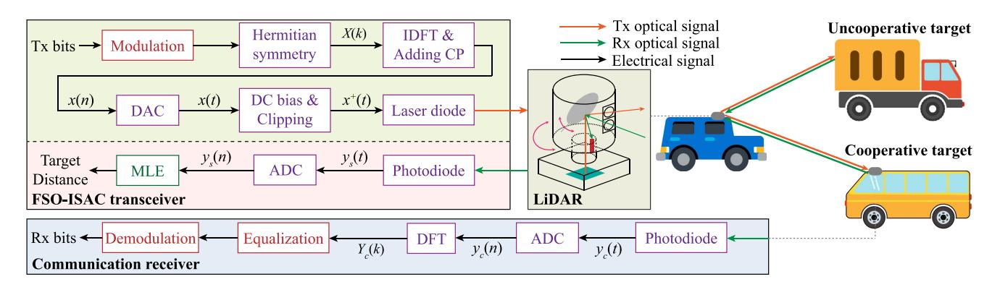
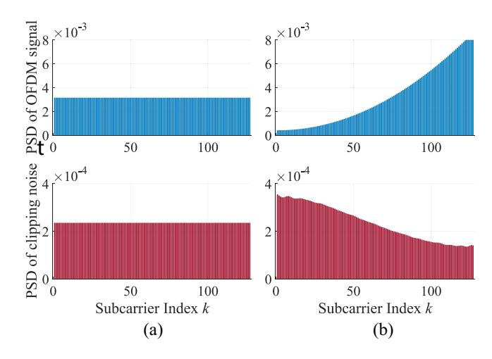
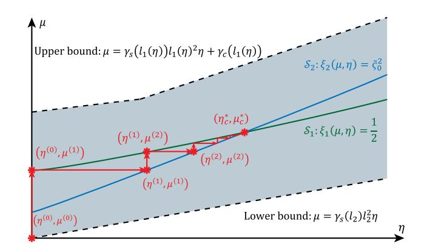
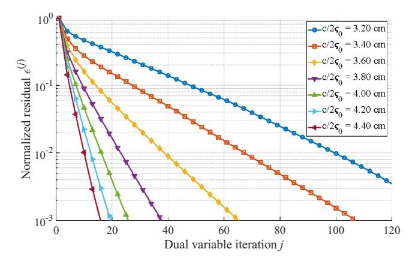
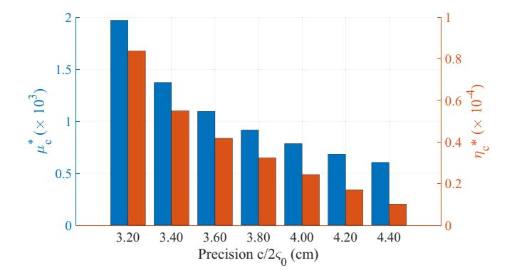
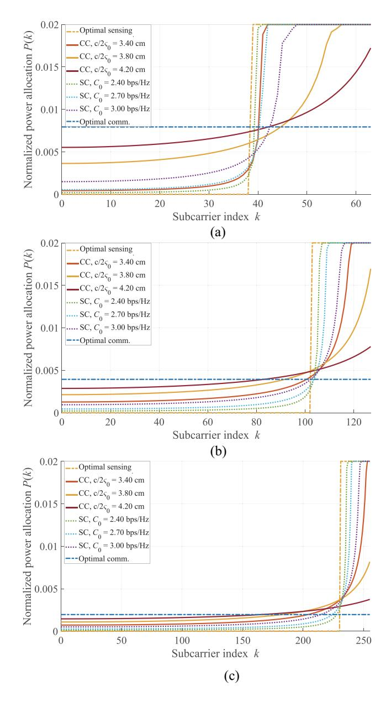
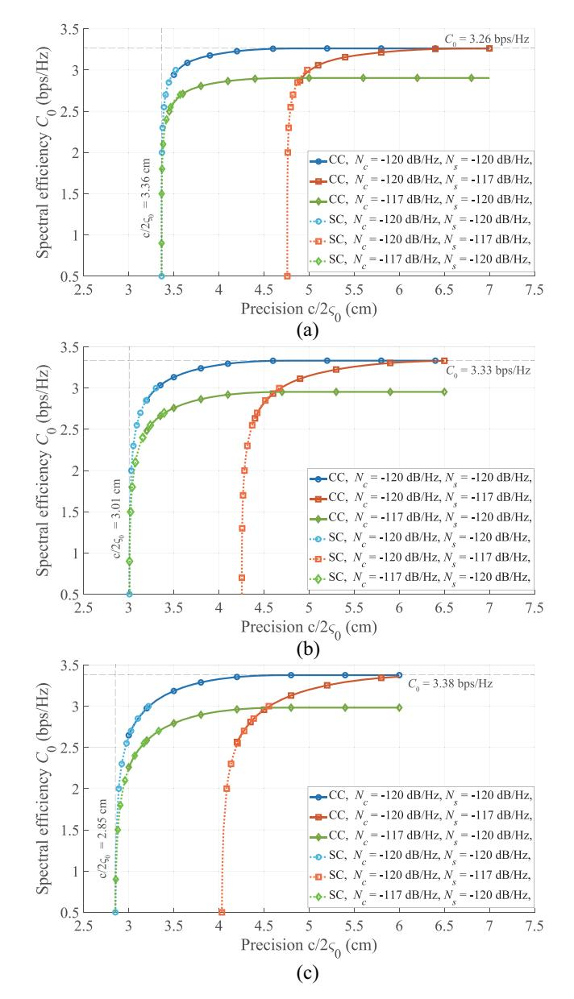
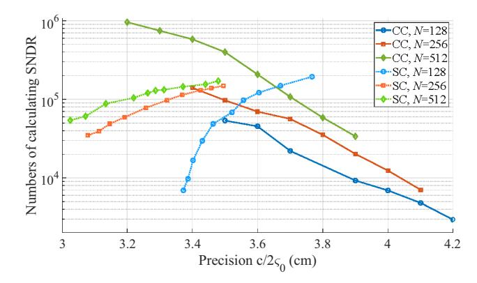
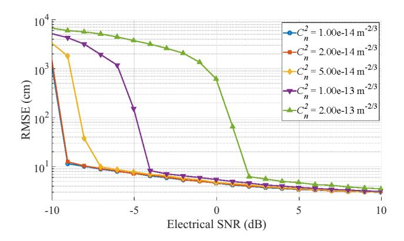

{0}------------------------------------------------

# Free-Space Optical Integrated Sensing and Communication Based on DCO-OFDM: Performance Metrics and Resource Allocation

Yunfeng We[n](https://orcid.org/0009-0000-9708-6012) , Fang Yan[g](https://orcid.org/0000-0003-3575-5086) , *Senior Member, IEEE*, Jian Song [,](https://orcid.org/0000-0002-6066-9510) *Fellow, IEEE*, and Zhu Han [,](https://orcid.org/0000-0002-6606-5822) *Fellow, IEEE*

*Abstract***—As one of the six usage scenarios of the sixthgeneration (6G) mobile communication system, integrated sensing and communication (ISAC) is regarded as a key enabler for the future Internet of Everything (IoE). While numerous studies have been conducted in radio-frequency (RF)-ISAC, freespace optical (FSO)-ISAC is also laying the foundation for the era of connection and intelligence. In this article, a direct-current (DC)-biased optical orthogonal frequency-division multiplexing (DCO-OFDM) scheme is proposed for FSO-ISAC. To derive the performance metrics for communication and sensing, we model the clipping noise of DCO-OFDM as additive colored Gaussian noise and establish an equivalent frequency-selective channel for FSO-ISAC. In addition, joint power allocation problems are formulated for both communication-centric and sensingcentric scenarios based on the derived performance metrics. Subsequently, these nonconvex joint optimization problems are decomposed into subproblems for DC bias and subcarriers, which can be solved by block coordinate descent algorithms. Furthermore, numerical simulations demonstrate the effectiveness of proposed methods and reveal the tradeoff between communication and sensing functionalities of FSO-ISAC based on DCO-OFDM.**

*Index Terms***—Block coordinate descent (BCD), clipping noise, free-space optics, integrated sensing and communication (ISAC),**

Received 14 March 2024; revised 15 August 2024; accepted 23 September 2024. Date of publication 27 September 2024; date of current version 9 January 2025. This work was supported in part by the National Key Research and Development Program of China under Grant 2023YFE0110600; in part by the Science, Technology and Innovation Commission of Shenzhen Municipality under Grant JSGG20211029095003004; in part by the Shenzhen Municipal Government under Grant KJZD20231023094659002; in part by NSF under Grant CNS-2107216, Grant CNS-2128368, Grant CMMI-2222810, and Grant ECCS-2302469; in part by the U.S. Department of Transportation; in part by Toyota; in part by Amazon; and in part by the Japan Science and Technology Agency (JST) Adopting Sustainable Partnerships for Innovative Research Ecosystem (ASPIRE) under Grant JPMJAP2326. This article was presented in part at IEEE International Conference on Communications, Jun. 2024, Denver, CO, USA [DOI: 10.1109/ICC51166.2024.10622583]. *(Corresponding author: Fang Yang.)*

Yunfeng Wen is with the Department of Electronic Engineering, Tsinghua University, Beijing 100084, China (e-mail: wenyf22@mails.tsinghua.edu.cn). Fang Yang is with the Department of Electronic Engineering, Tsinghua University, Beijing 100084, China, and also with the Research Institute of

Tsinghua University in Shenzhen, Tsinghua University, Shenzhen 518057, China (e-mail: fangyang@tsinghua.edu.cn).

Jian Song is with the Department of Electronic Engineering, Tsinghua University, Beijing 100084, China, also with the Shenzhen International Graduate School, Tsinghua University, Shenzhen 518055, China, and also with the Research Institute of Tsinghua University in Shenzhen, Tsinghua University, Shenzhen 518057, China (e-mail: jsong@tsinghua.edu.cn).

Zhu Han is with the Department of Electrical and Computer Engineering, University of Houston, Houston, TX 77004 USA, and also with the Department of Computer Science and Engineering, Kyung Hee University, Seoul 446-701, South Korea (e-mail: hanzhu22@gmail.com).

Digital Object Identifier 10.1109/JIOT.2024.3469279

**orthogonal frequency-division multiplexing (OFDM), power allocation.**

# I. INTRODUCTION

**I** NTEGRATED sensing and communication (ISAC) is a technology that combines communication and sensing functionalities within an individual system [\[2\]](#page-13-0). Leveraging the coexistence, cooperation, and co-design of these functionalities, ISAC can efficiently utilize the limited resources of power, spectrum, and hardware to provide both highrate communication capabilities and high-precision sensing abilities simultaneously [\[3\]](#page-13-1). Therefore, ISAC is recognized as one of the six usage scenarios for the sixth-generation (6G) mobile communication system and also a key enabler for the future Internet of Everything (IoE) [\[4\]](#page-13-2), such as intelligent transportation systems (ITSs) [\[5\]](#page-13-3), unmanned aerial vehicles [\[6\]](#page-14-0), and human–computer interaction [\[7\]](#page-14-1). With its revolutionary potential, ISAC has garnered considerable attention from both academia and industry, and numerous studies have been conducted spanning several areas like waveform design [\[8\]](#page-14-2), [\[9\]](#page-14-3), networking [\[10\]](#page-14-4), resource allocation [\[11\]](#page-14-5), [\[12\]](#page-14-6), and information theory [\[13\]](#page-14-7). In addition, the research contents of ISAC have also been enriched through the interplay with other emerging technologies, like terahertz technologies [\[14\]](#page-14-8), reconfigurable intelligent surface [\[15\]](#page-14-9), and nonorthogonal multiple access [\[16\]](#page-14-10).

Compared with the rapidly developing radio-frequency (RF)-ISAC, the emerging technology of free-space optical (FSO)-ISAC offers *three advantages* for ISAC, i.e., increasing communication rate, enhancing sensing precision, and reducing interference [\[17\]](#page-14-11). Utilizing the large unlicensed spectrum and short wavelength of the optical band, FSO-ISAC can be implemented on optical sensors like light detection and ranging (LiDAR), thus achieving high-rate communication and high-precision sensing simultaneously [\[18\]](#page-14-12). Benefitting from the advantages of the optical band, FSO-ISAC is anticipated to become a powerful complement to RF-ISAC in the upcoming era of connection and intelligence.

To implement FSO-ISAC in the applications of 6G-IoE, various waveforms have been proposed to enable simultaneous communication and sensing. For instance, the boomerang transmission system combines automotive LiDAR with FSO communication, which employs time-hopping pulses as the ISAC signal [\[18\]](#page-14-12). Similarly, the pulse sequence sensing and pulse position modulation scheme utilizes a group of optical pulses for both communication and sensing [\[19\]](#page-14-13). 

{1}------------------------------------------------

For continuous-wave FSO-ISAC, a frequency-modulated continuous-wave coherent LiDAR is addressed to provide downlink communications capability [\[20\]](#page-14-14). Moreover, the phase-shift laser ranging with communication is investigated to mitigate ambiguity caused by the phase-coded signal [\[21\]](#page-14-15). Additionally, a pulse-amplitude-modulation-based scheme has been demonstrated for target detection, which expands the sensing functionalities of FSO-ISAC [\[22\]](#page-14-16). However, the majority of existing FSO-ISAC waveforms focus on pulses or single-carrier continuous waves, which limits their achievable data rate and also makes them vulnerable to nonlinear distortions in optical systems.

While limited attention has been paid to multicarrier schemes in FSO-ISAC, orthogonal frequency-division multiplexing (OFDM) has gained popularity in RF-ISAC due to its time-frequency interpretation [\[23\]](#page-14-17). On the one hand, signal processing techniques have been thoroughly studied for both communication and sensing based on OFDM. For instance, the maximum-likelihood method can be utilized to approach the Cramèr–Rao bound (CRB) asymptotically for point targets in a prior, at the expense of a deteriorated ambiguity function [\[24\]](#page-14-18). Toward this end, an element-wise-division method can be adopted for OFDM-based ISAC to achieve a higher peak-to-sidelobe ratio [\[25\]](#page-14-19). On the other hand, plentiful joint optimization techniques arise from novel performance metrics. Apart from the conventional CRB metric [\[26\]](#page-14-20), mutual information and power minimization present novel objectives for OFDM-based ISAC, with constraints on the quality of communication and sensing services [\[27\]](#page-14-21), [\[28\]](#page-14-22). Furthermore, the rapid growth of OFDM also brings a promising candidate for FSO-ISAC thanks to its high spectral efficiency and resistance to frequency selectivity [\[1\]](#page-13-4). Thereby, FSO-ISAC prototypes exploiting the advantages of OFDM have been demonstrated in [\[29\]](#page-14-23) and [\[30\]](#page-14-24) to achieve a Gb/s-level data rate and a cm-level ranging resolution simultaneously.

Nevertheless, a conventional OFDM waveform for RF-ISAC is not readily applicable to FSO-ISC, since an optical waveform based on intensity modulation and direct detection (IM/DD) is restricted to being real and nonnegative. One of the fundamental methods to obtain an optical OFDM waveform is direct-current-biased OFDM (DCO-OFDM), which adds direct-current (DC) bias to the original OFDM signal and achieves a higher spectral efficiency than other optical OFDM schemes [\[31\]](#page-14-25). In consequence, the DC bias becomes a critical parameter that affects the nonlinear distortion, and therefore the Bussgang theorem has been introduced to model the clipping noise [\[32\]](#page-14-26). Although the Bussgang theorem has been validated in communication systems solely, it may fail in an ISAC scenario where the electrical power is not uniformly distributed on each subcarrier [\[33\]](#page-14-27). Furthermore, the complicated expression of the clipping noise also hampers the optimization of FSO-ISAC [\[34\]](#page-14-28).

Motivated by the potential and challenges mentioned above, we propose a DCO-OFDM scheme for FSO-ISAC, wich aims at achieving sensing–communication integration for optical systems in 6G-IoE. To the best of our knowledge, we are the first to conduct comprehensive analysis of optical OFDM schemes in FSO-ISAC, and our specific contributions are summarized as follows.

- 1) The system model of the DCO-OFDM scheme for FSO-ISAC is presented to provide simultaneous communication and sensing capabilities for a LiDAR. Based on the established system model, we describe the working principles and derive the performance metrics for both communication and sensing. In addition, considering the uneven power allocation on subcarriers, the clipping noise is modeled as additive colored Gaussian noise (ACGN) instead of the conventional white noise, which yields an equivalent frequency-selective channel for FSO-ISAC.
- 2) Given the performance metrics of both communication and sensing, the power allocation problems are formulated for both communication-centric and sensingcentric scenarios. To solve these nonconvex problems, the joint power allocation problem is decomposed into two subproblems, i.e., a subproblem for DC bias and a subproblem for power allocation on subcarriers. In consequence, the subproblem for DC bias degenerates into a single-variable quasi-convex problem, while the subproblem for power allocation on subcarriers is convex.
- 3) A block coordinate descent (BCD) algorithm is proposed to solve the joint power allocation problem, which alternately solves the subproblems for DC bias and power allocation on subcarriers. Specifically, the subproblem for DC bias can be solved by the golden search algorithm, while a closed-form expression of power allocation on subcarriers can be derived. Furthermore, an iterative optimization algorithm is proposed to attain the optimal dual variables in the expression of power allocation on subcarriers. Numerical simulations demonstrate the effectiveness of proposed algorithms and reveal the tradeoff between communication and sensing functionalities.

The remainder of this article is organized as follows. In Section [II,](#page-1-0) the system model is introduced, and the performance metrics for both communication and sensing are derived. In Section [III,](#page-4-0) the communication-centric power allocation problem is formulated and decomposed, with a BCD algorithm proposed to solve the joint power allocation problem. Similarly, the sensing-centric power allocation problem is investigated in Section [IV.](#page-7-0) Moreover, detailed simulation results are illustrated in Section [V,](#page-8-0) and the conclusion is drawn in Section [VI.](#page-12-0)

# II. SYSTEM MODEL

In this section, we introduce the system model of the DCO-OFDM scheme for FSO-ISAC. Taking the ITS system in Fig. [1](#page-2-0) as an example, the FSO-ISAC transceiver is based on a LiDAR, which provides active sensing abilities for both cooperative and uncooperative targets. Moreover, once the communication receiver of cooperative target is not obstructed, a communication link can be established to achieve sensing– communication integration. The DCO-OFDM signal model is first introduced in Section [II-A,](#page-2-1) where the nonnegative clipping is modeled to elicit an equivalent frequency-selective channel. Subsequently, the channel model, the communication

{2}------------------------------------------------

Fig. 1. System model of the proposed DCO-OFDM scheme for FSO-ISAC. The blocks in purple, red, and green are common components for communication and sensing, specific components for communication, and specific components for sensing, respectively. ADC: analog-to-digital converter; DAC: digital-to-analog converter.

subsystem, and the sensing subsystem are investigated in Sections II-B-II-D, respectively.

#### A. DCO-OFDM Signal Model

For optical OFDM, the time-domain signal is constrained to be real and nonnegative. Therefore, the Hermitian symmetry is imposed on the frequency-domain subcarriers, i.e.,  $X(k) = X^*(N-k)$ , where X(k) is the transmitted signal on the kth subcarrier. In addition, X(0) and X(N/2) are set as zeros, yielding N/2-1 independent subcarriers in each OFDM symbol. Then, the time-domain OFDM signal is obtained by inverse discrete Fourier transform (IDFT) as

$$x(n) = \frac{1}{\sqrt{N}} \sum_{k=0}^{N-1} X(k) \exp\left(\frac{j2\pi nk}{N}\right) \operatorname{rect}\left(\frac{n}{T_o N \Delta f}\right)$$
(1)

where N and  $\Delta f$  denote the number of subcarriers and the subcarrier spacing, respectively. Besides, a guard interval filled with cyclic prefix (CP) is concatenated in front of each OFDM symbol to avoid intersymbol interference and maintain the unambiguous distance. The durations of an elementary OFDM symbol, a guard interval, and a total OFDM symbol are denoted as T,  $T_g$ , and  $T_o$ , respectively, where  $T = 1/\Delta f$  and  $T_o = T + T_g$ . In addition, the occupied bandwidth of x(n) is  $B = N\Delta f$ , and rect(·) denotes a rectangular window, during which the signal is sampled at the rate of  $R_s = N/T$  for subsequent digital signal processing.

To obtain a nonnegative signal, a DC component b is added to x(n) to generate the biased signal. Then, the negative part of the biased signal is clipped, which yields the transmitted DCO-OFDM signal as

$$x^{+}(n) = \{x(n) + b\}^{+}$$
 (2)

where the notation  $\{\cdot\}^+$  is defined as  $\{x\}^+ = \max\{x, 0\}$ . As described in (2), the transmitted signal  $x^+(n)$  is a clipped version of x(n), thus having distinct statistics from the original OFDM signal. Supposing that X(k) obeys the Gaussian distribution independently, x(n) is a Gaussian random process with a variance of  $\sigma_x^2$  and is cyclostationary when  $\mathbb{E}(X(k)) = 0$ , i.e., the expectation of X(k) equals to zero.

Moreover, the Bussgang theorem provides the time-domain and frequency-domain expressions for transmitted signal as

$$x^{+}(n) = \mathcal{K}x(n) + w_p(n), \ X^{+}(k) = \mathcal{K}X(k) + W_p(k)$$
 (3)

respectively, where  $w_p(n)$  and  $W_p(k)$  are time-domain and frequency-domain clipping noises uncorrelated to x(n) and X(k) [32]. Denoting the complementary cumulative distribution function of the standard Gaussian distribution as  $Q(\cdot)$ , the coefficient  $\mathcal{K}$  can be calculated as

$$\mathcal{K} = \frac{\mathbb{E}(x(n)x^{+}(n))}{\mathbb{E}(x^{2}(n))} = Q(\lambda_{b})$$
 (4)

where  $\lambda_b = -b/\sigma_x$  is the normalized clipping level.

Furthermore, the time-domain clipping noise  $w_p(n)$  can be viewed as the output of a nonlinear memoryless system  $g_p(x)$  whose input is x(n), i.e.,

$$w_p(n) = \{x(n) + b\}^+ - \mathcal{K}x(n) := g_p(x(n)).$$
 (5)

Assuming that  $\mathbb{E}(X(k)) = 0$ ,  $w_p(n)$  is also a cyclostationary random process. To obtain the power spectral density (PSD) of  $w_p(n)$ , its auto-correlation function is calculated as

$$R_{w_n}(n-m) = \mathbb{E}\big(g_p(x(n))g_p(x(m))\big) \tag{6}$$

which can be derived by the following theorem.

Theorem 1: The auto-correlation function of the clipping noise  $w_n(n)$  can be expressed as

$$R_{w_n}(n) = \mathcal{I}(r) + C_1 r + C_2 \tag{7}$$

where the integral is defined as

$$\mathcal{I}(r) = \int_{-\sigma_x^2}^r \int_{-\sigma_y^2}^s \left[ \frac{1}{2\pi\sqrt{\sigma_x^4 - t^2}} \exp\left(-\frac{b^2}{\sigma_x^2 + t}\right) \right] dt ds \quad (8)$$

and  $r = R_x(n)$  is the auto-correlation function of the original OFDM signal x(n). Besides, the constants  $C_1$  and  $C_2$  are calculated as

$$C_1 = \frac{1}{\sigma_x^2} \left( \mathbb{E}\left( \left( w_p(n) \right)^2 \right) - C_2 - \mathcal{I}\left( \sigma_x^2 \right) \right) \tag{9a}$$

$$C_2 = (\mathbb{E}(w_p(n)))^2 - \mathcal{I}(0). \tag{9b}$$

{3}------------------------------------------------

Fig. 2. Relationship between PSDs of original OFDM signal x(n) and clipping noise  $w_p(n)$ . (a) Even power allocation. (b) Uneven power allocation.

The first-order and second-order momentums of  $w_p(n)$  in (9a) and (9b) are given by

$$\mathbb{E}(w_p(n)) = \sigma_x(-\lambda_h \mathcal{K} + \phi(\lambda_h)) \tag{10a}$$

$$\mathbb{E}(w_p(n))^2 = \sigma_x^2 \left( \mathcal{K} - \lambda_b \phi(\lambda_b) + \lambda_b^2 \mathcal{K} - \mathcal{K}^2 \right)$$
 (10b)

where  $\phi(x)$  is the probability distribution function of the standard Gaussian distribution.

Subsequently, the PSD of clipping noise is obtained by the Wiener–Khinchin theorem as [35]

$$P_{w_p}(k) = \mathbb{E}\Big(|W_p(k)|^2\Big) = \sum_{n=0}^{N-1} R_{w_p}(n) \exp\left(-\frac{j2\pi nk}{N}\right).$$
(11)

To understand Theorem 1 more intuitively, Fig. 2 illustrates the relationship between the PSDs of original OFDM signal and clipping noise. Due to the Hermitian symmetry in the frequency domain, the displayed subcarrier index k is restricted to  $1 \le k \le N/2 - 1$ . The number of subcarriers, total electrical power, and normalized clipping level are set as N = 256, P = 1, and  $\lambda_b = -0.5$ , respectively. As shown by the red bars in (a), the clipping noise can be modeled as white noise if power is uniformly distributed on each subcarrier. Thereby, the conclusion in [32] still holds, since the optimal power allocation for conventional communication is generally in a water-filling form. However, the red bars in (b) indicate that the clipping noise becomes colored when the power allocation is uneven, which is a common case for ISAC [26]. In consequence, the nonnegative clipping elicits an equivalent frequency-selective channel even if the real-world channel is flat.

#### B. Channel Model

For terrestrial scenarios, the FSO signal propagates through an atmospheric channel, where propagation impairments originate from the atmospheric attenuation, turbulence, geometric loss, etc. In addition, the interfaces between electrical and optical signal also contribute to the channel gain, e.g., the responsivity of PD. Therefore, the total channel gain for a communication link distance of D is written as

$$H_c = G_c H(D) \tag{12}$$

where the interface term  $G_c$  can be derived by the gain of optical amplifier and the responsivity of photodiode, while the atmospheric-propagation term H(D) contains atmospheric attenuation, scintillation brought by turbulence, and geometric loss, i.e.,

$$H(D) = L_a(D)L_t(D)L_o(D). \tag{13}$$

Since the atmospheric-propagation term is closely related to the link distance, the terms  $L_t(D)$ ,  $L_a(D)$ , and  $L_g(D)$  are discussed as follows.

The log-normal distribution is adopted to model the FSO turbulent channel under weak atmospheric turbulence, and the stochastic scintillation term  $L_t(D)$  follows the distribution of

$$p(L_t; D) = \frac{1}{L_t \sqrt{2\pi\sigma_t^2}} \exp\left(-\frac{1}{2\sigma_t^2} \left(\ln\frac{L_t}{\bar{L}_t} + \frac{\sigma_t^2}{2}\right)^2\right) \quad (14)$$

where  $\bar{L}_t$  and  $\sigma_t^2(D)$  denote the average turbulence power and the scintillation index, respectively. In this article,  $\bar{L}_t = 1$  is normalized, and  $\sigma_t^2(D)$  can be obtained by the Rytov approximation as

$$\sigma_t^2(D) \approx 1.23 \left(\frac{2\pi}{\lambda}\right)^{7/6} D^{11/6} C_n^2$$
 (15)

where  $C_n^2$  and  $\lambda$  denote the refractive index and the optical wavelength, respectively [36].

The atmospheric attenuation arises from the absorption and scattering of fog, haze, and heavy rain, and an empirical formula to calculate the attenuation in dB scale is given by

$$L_{\alpha}(D) = \alpha V^{\beta} D \tag{16}$$

where V denotes the atmospheric visibility [37]. Besides, the coefficients  $\alpha$  and  $\beta$  can be determined by the optical wavelength and the visibility range.

The geometric loss arises from the divergence of laser beams between the transmitter and the receiver. Supposing that perfect alignment is achieved by the acquisition, tracking, and pointing (ATP) mechanism, the geometric loss can be expressed as

$$L_g(D) = \frac{A}{\pi} \left(\frac{2}{D\theta}\right)^2 \tag{17}$$

where A and  $\theta$  denote the receiver aperture and the beam divergence angle, respectively.

While the communication channel in FSO-ISAC contains a sole Line-of-Sight (LoS) channel, the sensing channel incorporates the round trip from the FSO-ISAC transceiver to a target of distance D, and thus the sensing channel gain can be written as

$$H_s = G_s \Re H(2D) \tag{18}$$

where  $G_s$  and  $\Re$  denote the interface term for sensing and target reflectivity, respectively.

 $^1$ We assume that the reflected optical beam has the same divergence  $\theta$  angle as the transmitted one, which is achievable by a mirror reflector.

{4}------------------------------------------------

#### C. Communication Subsystem

Supposing that perfect synchronization is achieved by the FSO communication receiver, the received communication signal is expressed as

$$y_c(n) = H_c x^+(n) + w_c(n)$$
 (19)

where thermal noise and shot noise are modeled as additive white Gaussian noise (AWGN), i.e.,  $w_c(n) \sim \mathcal{N}(0, \sigma_c^2)$ , with a PSD of  $N_c = \sigma_c^2/B$ . Based on the model of clipped signal in (3), a frequency-domain expression for the received communication signal can be obtained by discrete Fourier transform (DFT) as

$$Y_c(k) = H_c X^+(k) + W_c(k)$$
  
=  $H_c \mathcal{K} X(k) + H_c W_p(k) + W_c(k)$  (20)

where  $W_c(k)$  denotes the DFT of  $w_c(n)$ . The frequency-domain expression in (20) indicates that  $Y_c(k)$  is an attenuated version of X(k), which is disturbed by both the clipping noise and AWGN. Toward this end, we introduce the concept of signal-to-noise-plus-distortion ratio (SNDR) to describe the channel quality of the kth subcarrier, i.e.,

$$\gamma_c(k) = \frac{\mathbb{E}(|H_c \mathcal{K} X(k)|^2)}{\mathbb{E}(|H_c W_p(k) + W_c(k)|^2)} = \frac{H_c^2 \mathcal{K}^2 P(k)}{H_c^2 P_{w_p}(k) + N_c B}$$
(21)

where  $P(k) = \mathbb{E}(|X(k)|^2)$  denotes the power allocated to the kth subcarrier [38]. As  $H_c$  is proportional to the stochastic scintillation  $L_t(D)$ , the SNDR  $\gamma_c(k)$  in (21) is also a stochastic process. To obtain a deterministic performance metric for communication subsystem, we calculate the spectral efficiency based on the ergodic channel capacity with constant transmit power as [39]

$$C = \int_0^{+\infty} p(L_t; D) \frac{1}{BT_o} \sum_{k=1}^{N/2-1} \log(1 + \gamma_c(k)) dL_t$$
$$:= \int_0^{+\infty} p(L_t; D) \tilde{C}(L_t) dL_t$$
(22)

where  $\tilde{C}(L_t)$  is defined as the instantaneous value of the spectral efficiency, i.e., the spectral efficiency calculated by an instantaneous value of the stochastic scintillation  $L_t(D)$ .

#### D. Sensing Subsystem

Similar to the communication subsystem, the received sensing signal in the time domain is expressed as

$$y_s(n) = H_s x^+(n - \tau_0 R_s) + w_s(n)$$
 (23)

where  $w_s(n) \sim \mathcal{N}(0, \sigma_s^2)$  is AWGN with a PSD of  $N_s = \sigma_s^2/B$ , and  $\tau_0$  denotes the Time of Flight (ToF). Moreover, the clipped-signal model in (3) also yields a frequency-domain expression for the received sensing signal, i.e.,

$$Y_{s}(k) = H_{s}X^{+}(k)\Phi(k) + W_{s}(k)$$
  
=  $H_{s}KX(k)\Phi(k) + H_{s}W_{p}(k)\Phi(k) + W_{s}(k)$  (24)

where  $\Phi(k) = \exp(-j2\pi \tau_0 R_s k/N)$  denotes a phase-shift term. Thereby, the delay  $\tau_0$  can be extracted by an estimation of  $\Phi(k)$ , from which the target distance D can be measured as

 $D = 2\tau_0/c$  with c denoting the speed of light. Furthermore, while the cross-correlation method provides the optimal signal-to-noise ratio (SNR) in the context of estimating  $\Phi(k)$ , the element-wise-division method yields a delay profile with a lower sidelobe level [8]. In consequence, we estimate the delay by a weighted sum of these two methods, i.e.,

$$\hat{\Phi}(k) = w_{\Phi} Y_s(k) X^*(k) + (1 - w_{\Phi}) Y_s(k) / X(k)$$
 (25a)

$$\hat{\tau}_0 = \arg \max_{\tau \in [0, T_g]} \left| \sum_{k=0}^{N-1} \hat{\Phi}(k) \exp\left(\frac{j2\pi \tau R_s k}{N}\right) \right|$$
 (25b)

where  $w_{\Phi} \in [0, 1]$  is the weighted factor for delay estimation. Since X(k) rather than  $X^+(k)$  is selected as the local reference signal in (25) to avoid noise amplification [40], the performance metric for sensing also involves an SNDR, as discussed in the following theorem.

Theorem 2: The Fisher information of the target distance estimation based on an OFDM signal is expressed as

$$I = \int_0^{+\infty} p(L_t; D) \frac{8\pi^2}{NT^2} \sum_{k=1}^{N/2-1} k^2 \gamma_s(k) \ dL_t$$
$$\coloneqq \int_0^{+\infty} p(L_t; D) \tilde{I}(L_t) \ dL_t \tag{26}$$

where  $\tilde{I}(L_t)$  is defined as the instantaneous value of Fisher information, and  $\gamma_s(k)$  is the SNDR on the kth subcarrier for sensing, i.e.,

$$\gamma_s(k) = \frac{H_s^2 \mathcal{K}^2 P(k)}{H_s^2 P_{w_p}(k) + N_s B}.$$
 (27)

With appropriate interpolation schemes, the sensing precision can approach CRB asymptotically [41], which is inversely proportional to the Fisher information derived by Theorem 2. Therefore, the Fisher information in (26) is adopted as the performance metric for sensing.

#### III. COMMUNICATION-CENTRIC RESOURCE ALLOCATION

In this section, we consider the joint resource allocation problem for a communication-centric scenario, which optimizes critical parameters of both DC bias b and subcarrier power allocation P(k). The joint optimization problem is first formulated in Section III-A, which is appropriately simplified for a concise result. Then, it is decomposed into a subproblem for DC bias and a subproblem for subcarrier power allocation, which are elaborated in Sections III-B and III-C, respectively. Furthermore, the convergence of proposed algorithms is demonstrated in Section III-D.

#### A. Joint Power Allocation Problem

The joint power allocation problem aims to achieve the optimal communication performance and guarantee the sensing performance simultaneously in a communication-centric scenario. However, the ergodic integrals in both (22) and (26) have high computational complexities, while the instantaneous

{5}------------------------------------------------

values  $\tilde{C}(L_t)$  and  $\tilde{I}(L_t)$  are stochastic considering their relationships with  $L_t$ . Besides, given the total power  $P_t$ , the DC bias is coupled with subcarrier power allocation, i.e.,

$$P_t - b^2 = \sigma_x^2 = \frac{2}{N} \sum_{k=1}^{N/2 - 1} P(k)$$
 (28)

which elicits a complicated form of the optimization problem. To formulate a concise optimization problem, we conduct the following two simplications.

- 1) Simplifying Stochastic Scintillation: We substitute the stochastic scintillation  $L_t$  with a deterministic value  $\tilde{L}_t$  that equals to the 0.05-lower quantile of  $p(L_t; D)$ , so that the desired ISAC performance can be obtained at a probability of more than 95%. Thereby, the performance degradation brought by the atmospheric turbulence is modeled by a deterministic attenuation  $\tilde{L}_t$ , while the concise expressions of  $C(\tilde{L}_t)$  and  $\tilde{I}(\tilde{L}_t)$ are utilized in the optimization.
- 2) Decoupling Optimization Variables: We define a normalized subcarrier power allocation that is independent from the DC bias, i.e.,

$$\tilde{P}(k) = \frac{P(k)}{N(P_t - b^2)} \tag{29}$$

which also sums up to 1/2 with respect to (w.r.t.) subcarrier index  $1 \le k \le N/2 - 1$ . Meanwhile, the SNDR on each subcarrier is also normalized as

$$\tilde{\gamma}_c(k) = \frac{\gamma_c(k)}{\tilde{P}(k)} = \frac{NH_c^2 \mathcal{K}^2 (P_t - b^2)}{H_c^2 P_{w_p}(k) + N_c B}$$
(30a)

$$\tilde{\gamma}_s(k) = \frac{\gamma_s(k)}{\tilde{P}(k)} = \frac{NH_s^2 \mathcal{K}^2 (P_t - b^2)}{H_s^2 P_{w_p}(k) + N_s B}$$
(30b)

which is mainly affected by the DC bias b.

Consequently, the optimization variables are transformed into b and P(k) that are independent from each other. Besides, the performance metrics for communication and sensing are simplified as

$$\tilde{C}(b, \tilde{P}(k); \tilde{L}_t) = \frac{1}{BT_o} \sum_{k=1}^{N/2-1} \log(1 + \tilde{\gamma}_c(k)\tilde{P}(k)) \quad (31a)$$

$$\tilde{I}(b, \tilde{P}(k); \tilde{L}_t) = \frac{8\pi^2}{NT^2} \sum_{k=1}^{N/2-1} k^2 \tilde{\gamma}_s(k) \tilde{P}(k).$$
 (31b)

Based on the simplified performance metrics, the joint power allocation problem is formulated as

(P1): 
$$\max_{b,\tilde{P}(k)} \tilde{C}(b,\tilde{P}(k);\tilde{L}_t)$$
 (32a)

s.t. 
$$\tilde{I}(b, \tilde{P}(k); \tilde{L}_t) \ge \varsigma_0^2$$
 (32b)

$$0 \le b \le \sqrt{P_t} \tag{32c}$$

$$0 \le \tilde{P}(k) \le \tilde{P}_m \tag{32d}$$

$$0 \le \tilde{P}(k) \le \tilde{P}_m$$

$$\sum_{k=1}^{N/2-1} \tilde{P}(k) = \frac{1}{2}$$
(32d)
(32e)

where  $c/2\varsigma_0$  is the desired precision of sensing, and  $\tilde{P}_m$ is the maximum normalized power that can be allocated to an individual subcarrier. Constraint (32b) guarantees that Algorithm 1 BCD Algorithm for Communication-Centric Scenario

**Input:** Tolerance  $\epsilon_c$ . Random initial solution  $b^{(0)}$  and  $\tilde{P}^{(0)}(k)$ inside the feasible region.

**Output:** Optimal  $b_c^*$  and  $\tilde{P}_c^*(k)$  to (P1).

1:  $i \leftarrow 0$ ,  $\tilde{C}^{(0)} \leftarrow 0$ . 2: **while**  $|\tilde{C}^{(i+1)} - \tilde{C}^{(i)}| \ge \epsilon_c$  **do** 

Update  $P_{w_p}(k)$ .

Given  $\tilde{P}^{(i)}(k)$ , solve (P1-1) to obtain  $b_I$ . 4:

Given  $b_I$ , solve (P1-2) to obtain  $\tilde{P}_I(k)$  and  $\tilde{C}^{(i+1)}$ .

 $b^{(i+1)} = \rho b_I + (1 - \rho)b^{(i)}.$ 

 $\tilde{P}^{(i+1)} = \rho \tilde{P}_I + (1 - \rho) \tilde{P}^{(i)}.$ 

 $i \leftarrow i + 1$ .

9: end while

10:  $b_c^* \leftarrow b^{(i)}, \, \tilde{P}_c^*(k) \leftarrow \tilde{P}^{(i)}(k).$ 

the sensing subsystem can achieve the desired precision, while (32c) and (32d) restrict b and P(k) to be nonnegative, respectively. Additionally, (32c) and (32e) impose restrictions on the total power, and we set  $\tilde{P}_m < 1/2 < (N/2 - 1)\tilde{P}_m$  to avoid invalid constraints.

Unfortunately, the joint optimization for b and  $\tilde{P}(k)$  is nonconvex in (P1). By decomposing (P1) into an optimization problem for b with fixed  $\tilde{P}(k)$  and an optimization problem for  $\tilde{P}(k)$  with fixed b, we obtain a single-variable quasi-convex optimization problem and a convex optimization problem with N/2-1 variables, respectively. However,  $\tilde{P}(k)$  affects the PSD of clipping noise, and thus alters the optimal b. On the other hand, b in turn affects the PSD of clipping noise, and the optimal  $\tilde{P}(k)$  is also changed. Therefore, the joint power allocation problem (P1) cannot be solved properly in a single

To solve the complicated problem of (P1), we adopt a BCD algorithm as follows. Given the power allocation  $\tilde{P}^{(i)}(k)$  in the feasible region of (32d) and (32e), the DC bias is optimized to obtain an intermediate value  $b_I$ . Then, the power allocation is further optimized to derive intermediate values  $\tilde{P}_I(k)$  with given  $b_I$ . Subsequently, enlightened by the concept of target network in [42], the optimization variables are updated in a weighted-sum form, i.e.,

$$b^{(i+1)} = \rho b_I + (1 - \rho)b^{(i)} \tag{33a}$$

$$\tilde{P}^{(i+1)} = \rho \tilde{P}_I + (1 - \rho) \tilde{P}^{(i)}$$
 (33b)

where  $\rho \in [0, 1]$  is a weighted factor that determines the step length of the BCD algorithm. The iteration repeats until the objective  $C^{(i)}$  converges, which is summarized in Algorithm 1. Since its convergence cannot be derived theoretically, the iteration of Algorithm 1 should be aborted if the value of  $\tilde{C}^{(i)}$  cannot converge within a given amount of iterations. Afterward, both the initial points  $b^{(0)}$ ,  $\tilde{P}^{(0)}(k)$  and the weighted factor  $\rho$  can be adjusted to accelerate convergence. Additionally, the clipping noise PSD  $P_{w_p}(k)$  is assumed to be a constant and only updated at the start of each iteration to reduce computational complexity.

{6}------------------------------------------------

**Algorithm 2** Golden Search Algorithm for Communication-Centric Scenario

Input: Tolerance  $\epsilon_b$ .

Output: Optimal  $b_c^*$  to (P1-1).

1: Initialize  $j \leftarrow 0$ ,  $b_l \leftarrow 0$ ,  $b_r \leftarrow \sqrt{P_t}$ ,  $r = \left(\sqrt{5} - 1\right)/2$ .

2: while  $|b_r - b_l| \ge \epsilon_b$  do

3:  $b_l^- = b_l + (1 - r)(b_r - b_l)$ ,  $b_r^- = b_l + r(b_r - b_l)$ .

4: if  $\tilde{C}(b_l^-, \tilde{P}(k); \tilde{L}_l) \ge \tilde{C}(b_r^-, \tilde{P}(k); \tilde{L}_l)$  then

5:  $b_r = b_r^-$ .

6: else

7:  $b_l = b_l^-$ .

8: end if

9:  $j \leftarrow j + 1$ .

10: end while

11:  $b_s^* \leftarrow (b_l + b_r)/2$ .

# B. Power Allocation for DC Bias

The subproblem for DC bias is formulated as

(P1-1): 
$$\max_{b \in [0, \sqrt{P_t}]} \tilde{C}(b, \tilde{P}(k); \tilde{L}_t). \tag{34}$$

The spectral efficiency on each subcarrier is a quasi-concave function of b and thus can be maximized by the golden search method [38], [43]. On the contrary, the total spectral efficiency  $\tilde{C}(b, \tilde{P}(k); \tilde{L}_t)$ , as a linear combination of those on each subcarrier, is not necessarily a quasi-concave function in the equivalent frequency-selective channel. However, the golden search through  $[0, \sqrt{P_t}]$  can still achieve a suboptimal solution  $b_c^*$ , which is summarized in Algorithm 2.

#### C. Power Allocation for Subcarriers

Once  $b_c^*$  is obtained by solving (P1-1), the normalized power allocation  $\tilde{P}(k)$  for subcarriers is further optimized to maximize the total spectral efficiency. Therefore, the subproblem for power allocation is formulated as

(P1-2): 
$$\max_{\tilde{P}(k)} \tilde{C}(b, \tilde{P}(k); \tilde{L}_t)$$
 (35)  
s.t. (32b), (32d), (32e).

As indicated by (31), the objective of (P1-2) is a concave function of  $\tilde{P}(k)$ , while the constraints are affine functions of  $\tilde{P}(k)$ . In consequence, maximizing a concave objective under affine constraints yield a convex optimization problem. Therefore, the optimal solution to (P1-2) is obtained if and only if Karush–Kuhn–Tucker (KKT) conditions hold, based on which three cases can be considered as follows.

1) Case A: The sensing constraint (32b) is first assumed to be inactive, and then the power allocation problem can be solved by the conventional water-filling method. Therefore, the normalized power allocation for the kth subcarrier is expressed as

$$\xi_{0}(\mu, \eta, k) = \max \left\{ \mu - \eta \tilde{\gamma}_{s}(k) k^{2}, 1 / (\tilde{P}_{m} + 1 / \tilde{\gamma}_{c}(k)) \right\} (36a)$$

$$\tilde{P}_{c}(k) = \left\{ \frac{1}{\xi_{0}(\mu_{c}^{*}, 0, k)} - \frac{1}{\tilde{\gamma}_{c}(k)} \right\}^{+}$$
(36b)

where the optimal dual variable  $\mu_c^*$  can be obtained by solving (32e). If the sensing constraint is still satisfied, i.e.,

$$\sum_{k=1}^{N/2-1} k^2 \tilde{\gamma}_s(k) \tilde{P}_c(k) \ge \frac{NT^2 \varsigma_0^2}{8\pi^2} := \tilde{\varsigma}_0^2$$
 (37)

then the optimal solution to (35) is  $\tilde{P}_c^*(k) = \tilde{P}_c(k)$ .

2) Case B: The optimal Fisher information is considered, which requires more power allocated to subcarriers with higher normalized frequency, i.e., with larger  $k^2 \tilde{\gamma}_s(k)$ . In this case, the index k of the normalized frequency is first sorted as  $k_l$  in ascending order, which satisfies

$$\tilde{\gamma}_s(k_{l_1})k_{l_1}^2 \le \tilde{\gamma}_s(k_{l_2})k_{l_2}^2 \quad \forall l_1 \le l_2.$$
 (38)

Then, by defining  $l_m = \lfloor N/2 - 1/(2\tilde{P}_m) \rfloor$  with  $\lfloor \cdot \rfloor$  denoting the floor operator, the normalized power allocation for the  $k_l$ th subcarrier is expressed as

$$\tilde{P}_{s}(k_{l}) = \begin{cases} 0, & 1 \leq k_{l} \leq k_{l_{m}} - 1\\ \frac{1}{2} - (\frac{N}{2} - 1 - k_{l_{m}})\tilde{P}_{m}, & k_{l} = k_{l_{m}}\\ \tilde{P}_{m}, & k_{l_{m}} + 1 \leq k_{l} < \frac{N}{2}. \end{cases}$$
(39)

If  $\tilde{P}_s(k)$  cannot satisfy the sensing constraint in (P1-2), i.e.,

$$\sum_{k=1}^{N/2-1} k^2 \tilde{\gamma}_s(k) \tilde{P}_s(k) < \tilde{\varsigma}_0^2$$
 (40)

then the problem is infeasible. Otherwise, the optimization is further conducted in Case C.

3) Case C: In this case, the sensing constraint cannot be satisfied by  $\tilde{P}_c(k)$ , while the problem is still feasible for  $\tilde{P}_s(k)$ . Consequently, a tradeoff exist between communication and sensing metrics, and the optimal power allocation derived by the KKT conditions is expressed as

$$\tilde{P}_c^*(k) = \left\{ \frac{1}{\xi_0(\mu_c^*, \eta_c^*, k)} - \frac{1}{\tilde{\gamma}_c(k)} \right\}^+. \tag{41}$$

As the sensing constraint (32b) is always active in this case, the optimal dual variables  $\mu_c^*$  and  $\eta_c^*$  can be obtained by simultaneously solving

$$\xi_1(\mu_c^*, \eta_c^*) = \frac{1}{2}$$
 (42a)

$$\xi_2(\mu_c^*, \eta_c^*) = \tilde{\xi}_0^2$$
 (42b)

where the functions  $\xi_1(\mu, \eta)$  and  $\xi_2(\mu, \eta)$  are defined as

$$\xi_1(\mu, \eta) = \sum_{k=1}^{N/2-1} \left\{ \frac{1}{\xi_0(\mu, \eta, k)} - \frac{1}{\tilde{\gamma}_c(k)} \right\}^+$$
 (43a)

$$\xi_2(\mu, \eta) = \sum_{k=1}^{N/2-1} k^2 \tilde{\gamma}_s(k) \left\{ \frac{1}{\xi_0(\mu, \eta, k)} - \frac{1}{\tilde{\gamma}_c(k)} \right\}^+. (43b)$$

To obtain the optimal value of  $\tilde{P}_c^*(k)$ , an iterative optimization algorithm for dual variables is proposed, which solves (42a) and (42b) iteratively until the values of  $\eta^{(j)}$  and  $\mu^{(j)}$  converge. The algorithm is summarized in Algorithm 3.

{7}------------------------------------------------

Algorithm 3 Iterative Optimization Algorithm for Dual Variables in Communication-Centric Scenarios

**Input:** Tolerance  $\varepsilon_{\mu}$ ,  $\varepsilon_{\eta}$  for  $\mu$ ,  $\eta$ .

**Output:** Optimal  $\eta_c^*$  and  $\mu_c^*$ .

1: Initialize  $\eta^{(0)} \leftarrow 0$ ,  $\mu^{(0)} \leftarrow 0$ ,  $j \leftarrow 0$ . 2: **while**  $|\mu^{(j+1)} - \mu^{(j)}| \ge \varepsilon_{\mu}$  or  $|\eta^{(j+1)} - \eta^{(j)}| \ge \varepsilon_{\eta}$  **do** 3:  $\mu_{c}(j) = \max_{l} \tilde{\gamma}_{s}(l)l^{2}\eta^{(j)} + \tilde{\gamma}_{c}(l)$ .

Solve (42a) on  $[\mu^{(j)}, \mu_c(j)]$  by the bisection method to 4: obtain  $\mu^{(j+1)}$ .

 $\eta_c(j) = \max_l \mu^{(j+1)} / \tilde{\gamma}_s(l) l^2.$ 5:

Solve (42b) on  $[\eta^{(j)}, \eta_c(j)]$  by the bisection method to obtain  $\eta^{(j+1)}$ .

 $j \leftarrow j + 1$ .

8: end while

9:  $\eta_c^* \leftarrow \eta^{(j)}, \, \mu_c^* \leftarrow \mu^{(j)}$ .

Fig. 3. Sketch map of the iterative optimization algorithm for dual variables.

## D. Convergence Analysis

While the monotonic convergence of Algorithm 1 cannot be derived theoretically, the convergence of Algorithm 3 is proven by Lemmas 1 and 2.

Lemma 1: The optimal  $(\mu_c^*, \eta_c^*)$  exists in the first quadrant, which is the intersection of curves

$$S_1$$
:  $\xi_1(\mu, \eta) = \frac{1}{2}$  (44a)

$$S_2$$
:  $\xi_2(\mu, \eta) = \tilde{\xi}_0^2$ . (44b)

*Proof:* See Appendix C.

Lemma 2: The optimal  $(\mu_c^*, \eta_c^*)$  lies in the region

$$\tilde{\gamma}_s(l_2)l_2^2 \eta \le \mu \le \tilde{\gamma}_s(l_1(\eta))l_1(\eta)^2 \eta + \tilde{\gamma}_c(l_1(\eta))$$
 (45)

where the indices  $l_1(\eta)$  and  $l_2$  are obtained by

$$l_1(\eta) = \arg\max_{l} \ \tilde{\gamma}_s(l)l^2 \eta + \tilde{\gamma}_c(l)$$
 (46a)

$$l_1(\eta) = \arg \max_{l} \ \tilde{\gamma}_s(l)l^2 \eta + \tilde{\gamma}_c(l)$$

$$l_2 = \arg \min_{l} \ \tilde{\gamma}_s(l)l^2.$$
(46a)
(46b)

*Proof:* See Appendix D.

Proposition 1: Algorithm 3 converges to the optimal  $(\mu_c^*, \eta_c^*).$ 

*Proof:* As illustrated in Fig. 3, Lemma 1 indicates the existence of  $(\mu_c^*, \eta_c^*)$ , and Lemma 2 guarantees that  $(\mu^{(i)}, \eta^{(i)})$  will not leave the feasible region during the iteration. Furthermore, we have the initial points  $\mu^{(0)}$  <  $\mu_c^*, \ \eta^{(0)} < \eta_c^* \ \text{since} \ \mu_c^* > 0, \ \eta_c^* > 0.$  Supposing that  $\eta^{(j)} < \eta_c^*, \ \text{solving} \ \xi_1(\mu^{(j+1)}, \eta^{(j)}) = 1/2 \ \text{yields} \ \mu^{(j)} < \mu^{(j+1)} < \mu_c^*.$  Similarly, assuming that  $\mu^{(j+1)} < \mu_c^*, \ \text{solving} \ \xi_2(\mu^{(j+1)}, \eta^{(j+1)}) = \tilde{\zeta}_0^2 \ \text{yields} \ \eta^{(j)} < \eta^{(j+1)} < \eta_c^*.$  Therefore, the distance between the current solution and the optimal solution declines as the algorithm proceeds, i.e.,

$$|\mu^{(j+1)} - \mu_c^*| < |\mu^{(j)} - \mu_c^*| \tag{47a}$$

$$|\eta^{(j+1)} - \eta_c^{(i)}| < |\eta^{(j)} - \eta_c^{(i)}|. \tag{47b}$$

In consequence, the convergence of the algorithm is proven by the Monotone and Boundedness theorem [44].

#### IV. SENSING-CENTRIC RESOURCE ALLOCATION

In this section, we investigate the sensing-centric resource allocation, where the strategies for simplication are the same as those in the communication-centric scenario. The joint power allocation problem is first formulated in Section IV-A. Then, it is decomposed into a subproblem for DC bias and a subproblem for power allocation on subcarriers, which are elaborated in Sections IV-B and IV-C, respectively.

#### A. Joint Power Allocation Problem

For the sensing-centric scenario, the joint power allocation problem achieves the optimal sensing performance and guarantees the communication performance simultaneously, which is formulated as

(P2): 
$$\max_{b,\tilde{P}(k)} \tilde{I}(b,\tilde{P}(k);\tilde{L}_t)$$
 (48a)

s.t. 
$$\tilde{C}(b, \tilde{P}(k); \tilde{L}_t) \ge C_0$$
 (48b)

$$0 \le b \le \sqrt{P} \tag{48c}$$

$$0 \le \tilde{P}(k) \le \tilde{P}_m \tag{48d}$$

$$\sum_{k=1}^{N/2-1} \tilde{P}(k) = \frac{1}{2}$$
 (48e)

where  $C_0$  is the desired spectral efficiency. Constraints (48b)–(48e) correspond to the communication performance, the DC bias, the power allocation for subcarriers, and the total power, respectively.

Similar to the communication-centric scenario, the joint optimization for b and  $\tilde{P}(k)$  is also nonconvex in (P2). Therefore, we also decompose (P2) into a subproblem for band a subproblem for  $\tilde{P}(k)$ , and then adopt a BCD algorithm to solve (P2), which is summarized in Algorithm 4. In addition, the clipping noise PSD  $P_{w_p}(k)$  is still assumed to be a constant and is only updated at the beginning of each iteration.

# B. Power Allocation for DC Bias

The subproblem for DC bias is formulated as

(P2-1): 
$$\max_{b \in [0,\sqrt{P_t}]} \tilde{I}(b,\tilde{P}(k);\tilde{L}_t). \tag{49}$$

Similarly, the Fisher information on each subcarrier is also quasi-concave due to the quasi concavity of normalized SNDR  $\tilde{\gamma}_s(k)$ . As a result, the golden search method in Algorithm 2 is also readily applicable to (P2-1) for a suboptimal  $b_s^*$ , except

{8}------------------------------------------------

# Algorithm 4 BCD Algorithm for Sensing-Centric Scenario

**Input:** Tolerance  $\epsilon_I$ . Random initial solution  $b^{(0)}$  and  $\tilde{P}^{(0)}(k)$  inside the feasible region.

**Output:** Optimal  $b_s^*$  and  $\tilde{P}_s^*(k)$  to (P2).

- 1:  $\tilde{i} \leftarrow 0, \tilde{\tilde{I}}^{(0)} \leftarrow 0.$
- 2: while  $|\tilde{I}^{(i+1)} \tilde{I}^{(i)}| > \epsilon_I$  do
- 3: Update  $P_{w_n}(k)$ .
- 4: Given  $\tilde{P}^{(i)}(k)$ , solve (P2-1) to obtain  $b_I$ .
- 5: Given  $b_I$ , solve (P2-2) to obtain  $\tilde{P}_I(k)$  and  $\tilde{I}^{(i+1)}$ .
- 6:  $b^{(i+1)} = \rho b_I + (1-\rho)b^{(i)}$ .
- 7:  $\tilde{P}^{(i+1)} = \rho \tilde{P}_I + (1-\rho) \tilde{P}^{(i)}$ .
- 8:  $i \leftarrow i + 1$ .
- 9: end while
- 10:  $b_c^* \leftarrow b^{(i)}, \, \tilde{P}_c^*(k) \leftarrow \tilde{P}^{(i)}(k).$

for the substitution of objective function  $\tilde{C}(b, \tilde{P}(k); \tilde{L}_t)$  with  $\tilde{I}(b, \tilde{P}(k); \tilde{L}_t)$ .

## C. Power Allocation for Subcarriers

Once  $b_s^*$  is obtained by solving (P2-1), the normalized power allocation for subcarriers is further optimized to maximize the Fisher information. In consequence, the subproblem to optimize  $\tilde{P}(k)$  is formulated as

(P2-2): 
$$\max_{\tilde{P}(k)} \tilde{I}(b, \tilde{P}(k); \tilde{L}_t)$$
 (50)  
s.t. (48b), (48e), (48d).

As discussed in Section III-C,  $\tilde{C}(b, \tilde{P}(k); \tilde{L}_t)$  is a concave function of  $\tilde{P}(k)$ , which means the feasible region given by (48b) is a convex set. In addition, the objective and power constraints form a linear programming problem, and (50) is therefore a convex optimization problem. Similar to its communication-centric counterpart, three cases derived by the KKT conditions are considered as follows.

1) Case D: The communication constraint is first assumed to be inactive, and (50) is reduced to a linear programming problem, whose optimal solution is given by (39). If the communication constraint is satisfied by  $\tilde{P}_s(k)$ , i.e.,

$$\sum_{k=1}^{N/2-1} \log \left(1 + \tilde{\gamma}_c(k)\tilde{P}_s(k)\right) \ge C_0 B T_o := \tilde{C}_0 \tag{51}$$

then the optimal solution is  $\tilde{P}_s^*(k) = \tilde{P}_s(k)$ .

2) Case E: The optimal spectral efficiency is considered and the optimal power allocation is obtained by the conventional water-filling method, as shown in (36). If  $\tilde{P}_c(k)$  cannot satisfy the communication constraint, i.e.,

$$\sum_{k=1}^{N/2-1} \log(1 + \tilde{\gamma}_c(k)\tilde{P}_c(k)) < \tilde{C}_0$$
 (52)

then the problem is infeasible. Otherwise, the optimization is further conducted in Case F.

3) Case F: In this case, the communication constraint cannot be satisfied by  $\tilde{P}_s(k)$ , while the problem is still feasible for

**Algorithm 5** Iterative Optimization Algorithm for Dual Variables in Sensing-Centric Scenarios

**Input:** Tolerance  $\varepsilon_{\mu}$ ,  $\varepsilon_{\eta}$  for  $\mu$ ,  $\eta$ .

- **Output:** Optimal  $\eta_s^*$  and  $\mu_s^*$ . 1: Initialize  $\eta^{(0)} \leftarrow 0$ ,  $\mu^{(0)} \leftarrow 0$ ,  $j \leftarrow 0$ .
- 2: while  $|\mu^{(j+1)} \mu^{(j)}| \ge \varepsilon_{\mu}$  or  $|\eta^{(j+1)} \eta^{(j)}| \ge \varepsilon_{\eta}$  do
- 3:  $\mu_s(j) = \max_l \tilde{\gamma}_s(l) l^2 + \tilde{\gamma}_c(l) \eta^{(j)}$ .
- 4: Solve (54a) on  $\left[\mu^{(j)}, \mu_s(j)\right]$  by the bisection method to obtain  $\mu^{(j+1)}$ .
- 5:  $\eta_s(j) = \max_l \left( \tilde{P}_m + 1/\tilde{\gamma}_c(l) \right) \left( \mu^{(j+1)} \tilde{\gamma}_s(l)l^2 \right).$
- 6: Solve (54b) on  $[\eta^{(j)}, \eta_s(j)]$  by the bisection method to obtain  $\eta^{(j+1)}$ .
- 7:  $j \leftarrow j + 1$ .
- 8: end while
- 9:  $\eta_s^* \leftarrow \eta^{(j)}, \, \mu_s^* \leftarrow \mu^{(j)}.$

 $\tilde{P}_c(k)$ . In consequence, the optimal power allocation yielded by the KKT conditions is expressed as

$$\psi_{0}(\mu, \eta, k) = \max \left\{ \left( \mu - \tilde{\gamma}_{s}(k)k^{2} \right) / \eta \right.$$

$$1 / \left( \tilde{P}_{m} + 1 / \tilde{\gamma}_{c}(k) \right) \right\}$$

$$\tilde{P}_{s}^{*}(k) = \left\{ \frac{1}{\psi_{0}(\mu_{s}^{*}, \eta_{s}^{*}, k)} - \frac{1}{\tilde{\gamma}_{c}(k)} \right\}^{+}.$$
(53b)

As the communication constraint is always active in this case, the optimal dual variables  $\mu_s^*$  and  $\eta_s^*$  can be obtained by simultaneously solving

$$\sum_{k=1}^{N/2-1} \left\{ \frac{1}{\psi_0(\mu_s^*, \eta_s^*, k)} - \frac{1}{\tilde{\gamma}_c(k)} \right\}^+ = \frac{1}{2}$$

$$\sum_{k=1}^{N/2-1} \log \left( 1 + \tilde{\gamma}_c(k) \left\{ \frac{1}{\psi_0(\mu_s^*, \eta_s^*, k)} - \frac{1}{\tilde{\gamma}_c(k)} \right\}^+ \right) = \tilde{C}_0.$$
(54b)

The value of  $\tilde{P}_s^*(k)$  can also be obtained by an iterative optimization algorithm, which is summarized in Algorithm 5. The proof of convergence resembles that of its communication-centric counterpart and is thus omitted here due to space limitations.

#### V. NUMERICAL RESULTS

This section provides numerical results to evaluate the proposed DCO-OFDM scheme for FSO-ISAC. As shown in Table I, we consider a terrestrial scenario where a 905-nm LiDAR is adopted as the FSO-ISAC transceiver. The guard interval maintains an unambiguous distance of  $cT_g/2 = 300$  m, and the total bandwidth B is fixed as the number of subcarriers changes. Moreover, while the statistical properties of channel gain can be obtained by consecutive observations and feedback in practical systems, the channel gain for resource allocation is generated by the physical model in Section II-B. Specifically, supposing that the target is located at a distance of D = 200 m, the stationary channel gains can be calculated as  $H_c/\tilde{L}_t(D) = -2.17$  dB and  $H_s/\tilde{L}_t(2D) = -23.2$  dB for the communication subsystem and the sensing subsystem,

{9}------------------------------------------------

TABLE I SIMULATION CONFIGURATIONS

| Parameter                       | Notation           | Value                                |  |
|---------------------------------|--------------------|--------------------------------------|--|
| Subcarriers in each OFDM symbol | N                  | 128, 256, 512                        |  |
| OFDM bandwidth                  | B                  | 102.4 MHz                            |  |
| Subcarrier spacing              | $\Delta f$         | 0.8, 0.4, 0.2 MHz                    |  |
| Duration of a guard interval    | $T_g$              | 2 μs                                 |  |
| Duration of an OFDM symbol      | $T_o$              | 3.25, 4.5, 7 µs                      |  |
| Total power                     | $P_t$              | 1 W                                  |  |
| BCD weighted factor             | $\rho$             | 0.8                                  |  |
| Target distance                 | D                  | 200 m                                |  |
| Optical wavelength              | $\lambda$          | 905 nm                               |  |
| Atmospheric attenuation         | $\alpha V^{\beta}$ | -12.8 dB/km                          |  |
| Refractive index                | $C_n^2$            | $5 \times 10^{-14} \text{ m}^{-2/3}$ |  |
| Beam divergence angle           | $\theta$           | 0.5 mrad                             |  |
| Receiver aperture               | A                  | $10 \text{ cm}^2$                    |  |
| Target reflectivity             | R                  | 0.5                                  |  |
| Transmitter gain                | $G_T$              | 1                                    |  |
| Receiver gain                   | $G_R$              | 10                                   |  |

Fig. 4. Convergence of dual variables w.r.t. different sensing precisions in the communication-centric scenario.

respectively. Besides, the stochastic parts of communication and sensing channel gains are replaced by  $\tilde{L}_t(D) = -4.88$  dB and  $\tilde{L}_t(2D) = -9.90$  dB, respectively. Subsequently, we investigate the convergence of proposed algorithms, optimal resource allocation, computational complexity, and robustness to channel variations in Sections V-A–V-D, respectively.

# A. Results of the Iterative Optimization Algorithm

The convergence of the proposed iterative optimization algorithm is first investigated to obtain the optimal subcarrier power allocation. Fig. 4 shows the convergence of Algorithm 3, where we define a normalized residual as

$$\varepsilon^{(j)} = \frac{|\mu^{(j)} - \mu_c^*|}{|\mu^{(0)} - \mu_c^*|} + \frac{|\eta^{(j)} - \eta_c^*|}{|\eta^{(0)} - \eta_c^*|}$$
(55)

to depict the distance between current dual variables and optimal dual variables during the iteration. As shown in Fig. 4, the normalized residual almost decreases geometrically. In addition, when a superior sensing performance is desired, the residual decreases slower, and thus more iterations are required for the iterative optimization algorithm to converge.

Fig. 5. Optimal dual variables w.r.t. different sensing precisions in the communication-centric scenario.

TABLE II OPTIMAL DC BIAS W.R.T. DIFFERENT SENSING PRECISIONS AND SPECTRAL EFFICIENCIES

| Optimal $b_c^*$ for communication-centric scenario |       |       |       |  |
|----------------------------------------------------|-------|-------|-------|--|
| Sensing precision $c/2\varsigma_0$ (cm)            | 3.40  | 3.80  | 4.20  |  |
| N = 128                                            | 0.646 | 0.647 | 0.649 |  |
| N = 256                                            | 0.598 | 0.600 | 0.602 |  |
| N = 512                                            | 0.568 | 0.569 | 0.570 |  |
| Optimal $b_s^*$ for sensing-centric scenario       |       |       |       |  |
| Spectral efficiency $C_0$ (bps/Hz)                 | 2.40  | 2.70  | 3.00  |  |
| N = 128                                            | 0.538 | 0.538 | 0.535 |  |
| N = 256                                            | 0.538 | 0.537 | 0.535 |  |
| N = 512                                            | 0.537 | 0.536 | 0.534 |  |

To reveal the relationship between dual variables and sensing precisions, Fig. 5 illustrates the optimal dual variables  $(\mu_c^*, \eta_c^*)$  in the communication-centric scenario, i.e., the termination values of Algorithm 3. While their values are affected by multiple variables, both  $\mu_c^*$  and  $\eta_c^*$  increase as the desired precision  $c/2\varsigma_0$  becomes smaller. Thereby, more power is allocated to subcarriers with higher normalized frequency, yielding a superior sensing performance. However, since Algorithm 3 starts at  $(\mu^{(0)}, \eta^{(0)}) = (0, 0)$ , a smaller  $c/2\varsigma_0$  pushes the optimal dual variables apart from the initial point. In consequence, more iterations are needed for convergence, which corresponds to the result in Fig. 4.

## B. Optimal Resource Allocation and Tradeoff

The optimal resource allocation for the communication-centric scenario and the sensing-centric scenario can be obtained by Algorithms 1 and 4, respectively, from which the tradeoff curves can also be attained.

Table II displays the optimal DC bias w.r.t. different sensing precisions and spectral efficiencies. While communication and sensing performances only have a slight influence on the optimal DC bias in both scenarios, increasing the subcarrier number N brings a significant decline to  $b_c^*$  in the communication-centric scenario. The reason lies in that the average power on each subcarrier decreases, and thus more power is allocated to information-carrying subcarriers to combat the AWGN, leaving less power for DC bias. In contrast, the sensing subsystem has a channel loss of larger than

{10}------------------------------------------------

Fig. 6. Optimal subcarrier power allocation w.r.t. different sensing precisions and spectral efficiencies. (a) *N* = 128. (b) *N* = 256. (c) *N* = 512.

20 dB compared with its communication counterpart, and thus the AWGN has a much larger PSD than the clipping noise. Consequently, the noise term in the sensing SNDR is dominated by AWGN, i.e., *NsB H*2 *s Pwp* (*k*) in [\(30\),](#page-5-6) and the optimization of DC bias degrades to

$$b_s^* = \arg \max_b \left( P_t - b^2 \right) \mathcal{K}^2. \tag{56}$$

The objective in [\(56\)](#page-10-0) is relevant to neither *c*/2ς0 nor *C*0, and thus we can obtain the optimal DC bias from Algorithm [2](#page-6-2) directly without BCD iterations. Moreover, the low-SNR scenario in the sensing subsystem can also be achieved by the communication subsystem with a large *N*, where [\(56\)](#page-10-0) provides a low-complexity method to obtain the optimal DC bias despite the varying communication or sensing performances.

Fig. [6](#page-10-1) shows the normalized subcarrier power allocation in both communication-centric and sensing-centric scenarios, where system parameters are set to *Nc* = *Ns* = −120 dB/Hz and *P*˜ *m* = 0.02. Specifically, the notations of CC and SC refer to tradeoff in communication-centric (CC) and sensingcentric (SC) scenarios, respectively, while the optimal power allocation schemes for sole communication or sensing are also illustrated for a comparison. As described in [\(36\)](#page-6-7) and [\(39\),](#page-6-6) the water-filling method yields a nearly uniform distribution to maximize the spectral efficiency, while the power is allocated to as high frequency as possible for a superior sensing precision. Moreover, the power allocations in tradeoff scenarios, i.e., Cases C and F, form a group of curves, whose curvatures change continuously with different communication or sensing performances. Specifically, the curvature of a power allocation curve increases as the sensing precision becomes higher and decreases as the spectral efficiency becomes larger.

Additionally, Fig. [6](#page-10-1) also shows the *duality* of (P1-2) and (P2-2). Given the noise PSDs *Nc* and *Ns*, an individual power allocation curve can be derived by the closed-form expressions in both [\(41\)](#page-6-8) and [\(53\)](#page-8-7) with *c*/2ς0 and *C*0 appropriately tuned. Therefore, considering the convergence for different sensing precisions in Fig. [4,](#page-9-2) we can turn to the sensing-centric design for a small *c*/2ς0 to reduce the complexity or vice versa.

To dive deeper into the *duality* between communicationcentric and sensing-centric scenarios, Fig. [7](#page-11-1) illustrates the relationships between the spectral efficiency and the sensing precision, i.e., the tradeoff curves for FSO-ISAC. For fixed *Nc* and *Ns*, the tradeoff curve in the communication-centric scenario links up with that in the sensing-centric scenario, since they origin from an individual tradeoff curve. Besides, a larger *N* provides more degrees of freedom for subcarrier power allocation, yielding a larger mean-square bandwidth or more independent subchannels. As a result, both communication and sensing performances are improved at the expense of a heavier burden of computation.

In addition to the *duality* between communication-centric and sensing-centric scenarios, Fig. [7](#page-11-1) also shows the *marginality* of communication and sensing performances in FSO-ISAC. Specifically, while we can pursue a superior sensing precision at the cost of a declined spectral efficiency, either communication or sensing gets saturated at the margin of a tradeoff curve. For instance, when the sensing precision approaches the left margin of *c*/2ς0 = 2.85 cm in Fig. [7\(](#page-11-1)c), the spectral efficiency deteriorates drastically. Furthermore, apart from the limited improvement in the sensing precision, Algorithm [3](#page-7-2) in the communication-centric scenario also takes more iterations for convergence, eliciting an unworthy rise in computational complexity. In this case, we should exploit the *duality* of (P1-2) and (P2-2), i.e., solve the resource allocation problem in the sensing-centric scenario instead.

# *C. Computational Complexity and Scalability*

Despite the complicated form of the proposed BCD algorithms, the approximation in [\(56\)](#page-10-0) and simulations in Section [V-A](#page-9-1) enlighten us to derive a simplified result. On the one hand, as the optimal DC bias is attained from [\(56\)](#page-10-0) directly, only two BCD iterations are necessary in low-SNR scenarios, i.e., one for the optimal DC bias and the

{11}------------------------------------------------

Fig. 7. Tradeoff curves between the spectral efficiency and the sensing precision. (a) N = 128. (b) N = 256. (c) N = 512.

other to rectify the PSD of clipping noise. Therefore, we only need to conduct the golden search once, which yields a complexity of  $\mathcal{O}(\log(1/\varepsilon_b))$  with  $\varepsilon_b$  denoting the error threshold for b. On the other hand, Fig. 4 indicates that the dual variables can be modeled as geometric convergence during the iterative optimization. Denoting the error threshold for  $\mu$  and  $\eta$  as  $\varepsilon_\mu$  and  $\varepsilon_\eta$ , respectively, each BCD iteration contains about  $\mathcal{O}(\log(1/\varepsilon_\mu) + \log(1/\varepsilon_\eta))$  iterations in the iterative optimization algorithm, where the complexity for bisection methods is also  $\mathcal{O}(\log(1/\varepsilon_\mu) + \log(1/\varepsilon_\eta))$ . In consequence, considering an  $\mathcal{O}(N)$  complexity for calculating SNDR on each subcarrier, the total complexity is expressed as

$$\mathcal{O}\left(N\left(\log(1/\varepsilon_b) + 2\left(\log\left(1/\varepsilon_\mu\right) + \log\left(1/\varepsilon_\eta\right)\right)^2\right)\right).$$
 (57)

Fig. 8. Computational complexity w.r.t. different sensing precisions.

For a more intuitive result, Fig. 8 displays the numbers of calculating SNDR, i.e.,  $\gamma_c(k)$  or  $\gamma_s(k)$ , which depicts the complexities of the proposed BCD algorithms. Due to the *marginality* in FSO-ISAC, the complexities of communication-centric and sensing-centric scenarios have opposite trends as the sensing precision changes. Toward this end, we should exploit their *duality* and switch to an appropriate problem formulation flexibly. Moreover, since the computational complexity increases with a larger N, a compromise should also be made between FSO-ISAC performances and scarce computational resources of IoE devices.

Moreover, while the FSO-ISAC with an individual cooperative target is addressed in this article, the proposed FSO-ISAC scheme can also be extended to multitarget scenarios by time-division multiplexing, i.e., steering laser beams to various directions in different time slots. Since the distances of different targets may differ, the channel gains also change in different slots. Consequently, the resource allocation should be optimized for each target, and the total computational complexity of the FSO-ISAC system should grow linearly with the number of targets.

# D. Robustness to Channel Variations

Although the stochastic scintillation of the atmospheric channel is replaced by a deterministic value during the optimization, its influence on the performance metric should also be investigated by Monte Carlo simulations as done in [19] and [45]. Since DCO-OFDM has been well studied in optical wireless communication, we focus on its sensing performance instead and define its root-mean-square error (RMSE) as

$$\varepsilon_D = \sqrt{\mathbb{E}\left(\left(D - \hat{D}\right)^2\right)} \tag{58}$$

where the target distance  $\hat{D}=c\hat{\tau}_0/2$  is obtained from (25). Besides, the Monte Carlo simulation configurations are the same as Table I except for scintillation indices  $C_n^2$ , while the amount of subcarriers and weighted factor for delay estimation are N=512 and  $w_{\Phi}=0.5$ , respectively. Subsequently, Fig. 9 illustrates the sensing RMSE w.r.t. different electrical SNRs, i.e.,  $\mathbb{E}(|H_s x^+(n)|^2)/\mathbb{E}(|w_s(n)|^2)$ . The sensing performance deteriorates due to the stronger atmospheric

{12}------------------------------------------------

Fig. 9. Sensing RMSE w.r.t. different electrical SNRs and scintillation indices.

turbulence if  $C_n^2$  increases. However, all the simulated curves achieve cm-level precision for an electrical SNR of larger than 2 dB, which demonstrates the robustness of the proposed method.

#### VI. CONCLUSION

In this article, a DCO-OFDM scheme was proposed for FSO-ISAC, whose performance metrics were derived for communication and sensing, i.e., the spectral efficiency and the Fisher information. The clipping noise of DCO-OFDM was modeled as ACGN to elicit an equivalent frequency-selective channel. Additionally, joint power allocation problems were formulated in both communication-centric and sensing-centric scenarios, which were decomposed and solved by BCD algorithms. Moreover, case-by-case solutions to these problems were provided, and iterative algorithms were proposed to attain the optimal dual variables in the closed-form expressions of power allocation. Furthermore, numerical simulations demonstrated the proposed algorithms and revealed the tradeoff between communication and sensing functionalities. Consequently, the proposed DCO-OFDM scheme could meet different requirements of communication and sensing subsystems, and therefore provide a flexible and efficient approach to FSO-ISAC.

As a potential complement to RF-ISAC, widespread research works are still urgently needed for FSO-ISAC in the future. For the waveform design in FSO-ISAC, while this article focuses on DCO-OFDM, other optical OFDM schemes should also be investigated to provide additional degrees of freedom for joint optimization. In addition, novel performance metrics should be proposed for various sensing tasks like detection, tracking, and recognition to enrich the sensing strategies of FSO-ISAC and save the scarce power resources of IoE devices. Moreover, angle-domain sensing remains an unsolved problem in FSO-ISAC, which demands robust and cost-effective beamforming schemes for optical sensors. With the help of emerging photonic technologies like micro-electromechanical system and optical phased array, an FSO-ISAC system can build a map of the surroundings based on the range-angle profile, which lays a solid foundation for multiple sensing tasks in 6G-IoE.

# APPENDIX A PROOF OF THEOREM 1

Regarding the clipping noise  $w_p(n)$  as the output of a memoryless nonlinear system  $g_p(x(n))$ , Lemma 3 can be adopted.

*Lemma 3 (Price Theorem):* Consider a bivariate normal distribution in variables U, V with covariance  $r = \mathbb{E}(UV) - \mathbb{E}(U)\mathbb{E}(V)$  and a regularized function g(u, v). Then, the expectation of a random variable g(U, V) has the property of

$$\frac{\partial^n \mathbb{E}(g(U,V))}{\partial r^n} = \mathbb{E}\left(\frac{\partial^{2n} g(U,V)}{\partial U^n \partial V^n}\right). \tag{59}$$

*Proof:* Lemma 3 can be derived by the characteristic function of a bivariate Gaussian distribution. See [46] for more details.

If we set the regularized function in Lemma 3 as  $g(u, v) = g_p(u)g_p(v)$ , then the auto-correlation function of the clipping noise has the property of

$$\frac{\partial^2 R_{w_p}(n-m)}{\partial r^2} = \frac{\partial^2 \mathbb{E}(g(x(m), x(n)))}{\partial r^2} 
= \mathbb{E}\left(\frac{\partial^4 g(x(m), x(n))}{\partial x(m)^2 \partial x(n)^2}\right) 
= \mathbb{E}\left(\frac{\partial^2 g_p(x(m))}{\partial x(m)^2} \frac{\partial^2 g_p(x(n))}{\partial x(n)^2}\right) 
= \mathbb{E}(\delta(x(m) + b)\delta(x(n) + b)) 
= \frac{1}{2\pi\sqrt{\sigma_x^4 - r^2}} \exp\left(-\frac{b^2}{\sigma_x^2 + r}\right) (60)$$

where r denotes the auto-correlation function of x(n), and the notation  $\delta(x)$  is the Dirac-delta function.

Calculating the indefinite integral yields the auto-correlation function of  $w_p(n)$  as

$$R_{w_n}(n) = \mathcal{I}(r) + C_1 r + C_2 \tag{61}$$

where the integral  $\mathcal{I}(r)$  is defined in (8), while  $C_1$  and  $C_2$  are constants independent from r. Then, by considering two special values of r, the constants  $C_1$  and  $C_2$  can be attained.

When  $r = R_x(n - m) = 0$  for  $n \neq m$ , i.e., x(m) and x(n) are independent statistically, the auto-correlation function of  $w_n(n)$  is given by

$$R_{w_p}(n) = (\mathbb{E}(w_p(n)))^2 = \mathcal{I}(0) + C_2.$$
 (62)

When  $r = R_x(n - m) = \sigma_x^2$  for  $\forall n, m$ , i.e., x(m) always equals to x(n), the auto-correlation function of  $w_p(n)$  is given by

$$R_{w_p}(n) = \mathbb{E}\left(\left(w_p(n)\right)^2\right) = \mathcal{I}\left(\sigma_x^2\right) + C_1\sigma_x^2 + C_2. \tag{63}$$

Consequently, by simultaneously solving (62) and (63), the expressions of (9a) and (9b) can be obtained.

# APPENDIX B PROOF OF THEOREM 2

For simplicity, the signal is vectorized for the following derivation in this appendix. Denoting the signal without noise as  $s(\tau_0)$ , the received sensing signal can be written as

$$y = s(\tau_0) + w \tag{64}$$

{13}------------------------------------------------

where w denotes ACGN, i.e.,  $w \sim \mathcal{N}(\mathbf{0}, \mathbf{C})$ , and the parameter  $\tau_0$  is the ToF to be estimated. Then, the Fisher information is given by [41]

$$I = -\mathbb{E}_{\mathbf{y}} \left( \frac{\partial^2 \log p(\mathbf{y}; \tau_0)}{\partial \tau_0^2} \right) = \frac{\partial s(\tau_0)^{\mathcal{H}}}{\partial \tau_0} C^{-1} \frac{\partial s(\tau_0)}{\partial \tau_0}. \quad (65)$$

Denoting W as the IDFT matrix, whose element in the kth row and the nth column is  $(W)_{k,n} = \exp(j2\pi nk/N)/\sqrt{N}$ , the covariance matrix of w can be expressed in a frequency-domain form as

$$C = W \operatorname{diag}(S_{w}) W^{\mathcal{H}} \tag{66}$$

where  $S_w$  is the PSD vector of w, and diag( $S_w$ ) denotes a diagonal matrix whose diagonal elements are  $S_w$ .

Substituting C in (65) further yields

$$I = \left( \mathbf{W}^{\mathcal{H}} \frac{\partial \mathbf{s}(\tau_0)}{\partial \tau_0} \right)^{\mathcal{H}} \operatorname{diag}(\mathbf{S}_{\mathbf{w}})^{-1} \left( \mathbf{W}^{\mathcal{H}} \frac{\partial \mathbf{s}(\tau_0)}{\partial \tau_0} \right)$$
$$\coloneqq \mathbf{S}'(\tau_0)^{\mathcal{H}} \operatorname{diag}(\mathbf{S}_{\mathbf{w}})^{-1} \mathbf{S}'(\tau_0). \tag{67}$$

For the sensing subsystem, the *n*th elements of  $s(\tau_0)$  and w are defined, respectively, as

$$s(n; \tau_0) = H_s \mathcal{K} x(n - \tau_0 R_s)$$
 (68a)

$$w(n) = H_s w_p(n) + w_s(n).$$
 (68b)

Therefore, the kth element of  $S'(\tau_0)$  is derived as

$$S'(k; \tau_0) = \frac{1}{\sqrt{N}} \sum_{n=0}^{N-1} \frac{\partial s(n; \tau_0)}{\partial \tau_0} \exp\left(-\frac{j2\pi nk}{N}\right)$$

$$= \frac{1}{\sqrt{N}} \sum_{n=0}^{N-1} \left(-H_s \mathcal{K} \frac{dx(R_s t)}{dt}|_{t=\frac{n}{R_s} - \tau_0}\right) \exp\left(-\frac{j2\pi nk}{N}\right)$$

$$= -H_s \mathcal{K} (j2\pi k\Delta f) X(k) \exp(-j2\pi k\Delta f \tau_0). \tag{69}$$

Consequently, the Fisher information I is derived as

$$I = \sum_{k=0}^{N-1} \frac{|S'(k; \tau_0)|^2}{S_{w}(k)} = \frac{8\pi^2}{NT^2} \sum_{k=0}^{N/2-1} k^2 \gamma_s(k).$$
 (70)

# APPENDIX C PROOF OF LEMMA 1

As indicated by (43a) and (43b),  $\xi_1(\mu, \eta)$  and  $\xi_2(\mu, \eta)$  are both continuous, nonincreasing w.r.t.  $\mu$ , and nondecreasing w.r.t.  $\eta$  in the first quadrant. In addition, the existence of  $S_1$  and  $S_2$  is guaranteed by

$$\lim_{\mu \to \infty} \xi_1(\mu, \eta) = 0 \tag{71a}$$

$$\lim_{\mu \to 0} \xi_1(\mu, \eta) = \left(\frac{N}{2} - 1\right) \tilde{P}_m \ge \frac{1}{2}$$
 (71b)

$$\lim_{\mu \to \infty} \xi_2(\mu, \eta) = 0 \tag{71c}$$

$$\lim_{\mu \to 0} \xi_2(\mu, \eta) = \sum_{k=1}^{\frac{N}{2} - 1} k^2 \tilde{\gamma}_s(k) \tilde{P}_m \ge \tilde{\zeta}_0^2.$$
 (71d)

In consequence, as contour lines of  $\xi_1(\mu, \eta)$  and  $\xi_2(\mu, \eta)$ , curves  $S_1$  and  $S_2$  have direction vectors pointing to the first quadrant. Without loss of generality, they are rewritten as

 $S_1$ :  $\mu = \zeta_1(\eta)$  and  $S_2$ :  $\mu = \zeta_2(\eta)$ , where  $\zeta_1(\eta)$  and  $\zeta_2(\eta)$  are continuous and nondecreasing w.r.t.  $\eta$ .

Moreover, if we set  $\eta=0$ ,  $\zeta_1(0)$  corresponds to  $\tilde{P}_c(k)$  as described in (36). However, considering the assumption of Case C, the normalized power allocation for optimal communication performance cannot satisfy the sensing CRB constraint, i.e.,

$$\xi_2(\zeta_1(0), 0) \le \tilde{\zeta}_0^2.$$
 (72)

Therefore,  $\zeta_1(0) \geq \zeta_2(0)$  can be derived as  $\xi_2(\mu, 0)$  is nonincreasing to  $\mu$ .

On the other hand, for a sufficiently large  $\eta^+$ ,  $\zeta_1(\eta^+)$  corresponds to  $\tilde{P}_s(k)$ , and the assumption of Case C reveals its feasibility, i.e.,

$$\xi_2(\zeta_1(\eta^+), 0) \ge \tilde{\zeta}_0^2 \tag{73}$$

which further indicates that  $\zeta_1(\eta^+) \leq \zeta_2(\eta^+)$ . Consequently, the intermediate value theorem gives that  $\exists \eta^* > 0, \zeta_1(\eta^*) = \zeta_2(\eta^*)$ , which completes the proof of Lemma 1 [44].

# APPENDIX D PROOF OF LEMMA 2

Lemma 2 can be proven by contradiction. Supposing that  $\mu < \tilde{\gamma}_s(l_2)l_2^2\eta$ , then the power allocation has the property of

$$\xi_0(\mu, \eta, k) = \frac{1}{\tilde{P}_m + 1/\tilde{\nu}_c(k)} \quad \forall k \tag{74a}$$

$$\xi_1(\mu, \eta) = \left(\frac{N}{2} - 1\right)\tilde{P}_m > \frac{1}{2}.$$
 (74b)

However, the total-power constraint is violated, and therefore the assumption is invalid.

Similarly, supposing that

$$\mu > \tilde{\gamma}_{\rm s}(l_1(\eta))l_1(\eta)^2\eta + \tilde{\gamma}_{\rm c}(l_1(\eta))$$
 (75)

then the power allocation has the property of

$$\xi_0(\mu, \eta, k) = \mu - \tilde{\gamma}_s(k)k^2\eta > \tilde{\gamma}_c(k) \quad \forall k$$
 (76a)

$$\xi_1(\mu, \eta) = \sum_{k=1}^{N/2-1} \left\{ \frac{1}{\mu - \tilde{\gamma}_s(k)k^2 \eta} - \frac{1}{\tilde{\gamma}_c(k)} \right\}^+ = 0.$$
 (76b)

Obviously,  $(\mu, \eta)$  cannot be the solution to (P1-2) neither, and therefore the assumption is also invalid, which completes the proof of Lemma 2.

#### REFERENCES

- Y. Wen, F. Yang, J. Song, and Z. Han, "Power allocation for OFDM-based free space optical integrated sensing and communication," in *Proc. IEEE Int. Conf. Commun.*, Denver, CO, USA, 2024, pp. 2408–2413.
- [2] F. Liu et al., "Integrated sensing and communications: Toward dual-functional wireless networks for 6G and beyond," *IEEE J. Sel. Areas Commun.*, vol. 40, no. 6, pp. 1728–1767, Jun. 2022.
- [3] A. R. Chiriyath, B. Paul, and D. W. Bliss, "Radar-communications convergence: Coexistence, cooperation, and co-design," *IEEE Trans. Cogn. Commun. Netw.*, vol. 3, no. 1, pp. 1–12, Mar. 2017.
- [4] Y. Cui, F. Liu, X. Jing, and J. Mu, "Integrating sensing and communications for ubiquitous IoT: Applications, trends, and challenges," *IEEE Netw.*, vol. 35, no. 5, pp. 158–167, Nov. 2021.
- [5] X. Cheng, D. Duan, S. Gao, and L. Yang, "Integrated sensing and communications (ISAC) for vehicular communication networks (VCN)," *IEEE Internet Things J.*, vol. 9, no. 23, pp. 23441–23451, Dec. 2022.

{14}------------------------------------------------

- [\[6\]](#page-0-4) N. Huang, C. Dou, Y. Wu, L. Qian, B. Lin, and H. Zhou, "Unmanned-aerial-vehicle-aided integrated sensing and computation with mobile-edge computing," *IEEE Internet Things J.*, vol. 10, no. 19, pp. 16830–16844, Oct. 2023.
- [\[7\]](#page-0-5) R. Zhang, C. Jiang, S. Wu, Q. Zhou, X. Jing, and J. Mu, "Wi-Fi sensing for joint gesture recognition and human identification from few samples in human-computer interaction," *IEEE J. Sel. Areas Commun.*, vol. 40, no. 7, pp. 2193–2205, Jul. 2022.
- [\[8\]](#page-0-6) Z. Wei et al., "Integrated sensing and communication signals toward 5G-a and 6G: A survey," *IEEE Internet Things J.*, vol. 10, no. 13, pp. 11068–11092, Jul. 2023.
- [\[9\]](#page-0-6) Y. Ma, Z. Yuan, S. Xia, G. Yu, and L. Hu, "Highly efficient waveform design and hybrid duplex for joint communication and sensing," *IEEE Internet Things J.*, vol. 10, no. 19, pp. 17369–17381, Oct. 2023.
- [\[10\]](#page-0-7) F. Peng, Z. Jiang, S. Zhou, Z. Niu, and S. Zhang, "Sensing and communication co-design for status update in multiaccess wireless networks," *IEEE Trans. Mobile Comput.*, vol. 22, no. 3, pp. 1779–1792, Aug. 2021.
- [\[11\]](#page-0-8) Z. Wang, K. Han, X. Shen, W. Yuan, and F. Liu, "Achieving the performance bounds for sensing and communications in perceptive networks: Optimal bandwidth allocation," *IEEE Wireless Commun. Lett.*, vol. 11, no. 9, pp. 1835–1839, Sep. 2022.
- [\[12\]](#page-0-8) L. Zhao, D. Wu, L. Zhou, and Y. Qian, "Radio resource allocation for integrated sensing, communication, and computation networks," *IEEE Trans. Wireless Commun.*, vol. 21, no. 10, pp. 8675–8687, Oct. 2022.
- [\[13\]](#page-0-9) Y. Xiong, F. Liu, Y. Cui, W. Yuan, T. X. Han, and G. Caire, "On the fundamental tradeoff of integrated sensing and communications under gaussian channels," *IEEE Trans. Inf. Theory*, vol. 69, no. 9, pp. 5723–5751, Sep. 2023.
- [\[14\]](#page-0-10) Z. Chen et al., "Terahertz wireless communications for 2030 and beyond: A cutting-edge frontier," *IEEE Commun. Mag.*, vol. 59, no. 11, pp. 66–72, Nov. 2021.
- [\[15\]](#page-0-11) R. Liu, M. Li, H. Luo, Q. Liu, and A. L. Swindlehurst, "Integrated sensing and communication with reconfigurable intelligent surfaces: Opportunities, applications, and future directions," *IEEE Wireless Commun.*, vol. 30, no. 1, pp. 50–57, Feb. 2023.
- [\[16\]](#page-0-12) X. Mu, Z. Wang, and Y. Liu, "NOMA for integrating sensing and communications toward 6G: A multiple access perspective," *IEEE Wireless Commun.*, vol. 31, no. 3, pp. 316–323, Jun. 2024.
- [\[17\]](#page-0-13) Y. Wen, F. Yang, J. Song, and Z. Han, "Optical integrated sensing and communication: Architectures, potentials and challenges," *IEEE Internet Things Mag.*, vol. 7, no. 4, pp. 68–74, Jul. 2024.
- [\[18\]](#page-0-14) A. J. Suzuki and K. Mizui, "Laser radar and visible light in a bidirectional V2V communication and ranging system," in *Proc. IEEE Int. Conf. Veh. Electron. Saf.*, Yokohama, Japan, 2015, pp. 19–24.
- [\[19\]](#page-0-15) Y. Wen, F. Yang, J. Song, and Z. Han, "Pulse sequence sensing and pulse position modulation for optical integrated sensing and communication," *IEEE Commun. Lett.*, vol. 27, no. 6, pp. 1525–1529, Jun. 2023.
- [\[20\]](#page-1-2) Z. Xu et al., "Frequency-modulated continuous-wave coherent LiDAR with downlink communications capability," *IEEE Photon. Technol. Lett.*, vol. 32, no. 11, pp. 655–658, Jun. 1, 2020.
- [\[21\]](#page-1-3) Y. Hai, Y. Luo, C. Liu, and A. Dang, "Remote phase-shift LiDAR with communication," *IEEE Trans. Commun.*, vol. 71, no. 2, pp. 1059–1070, Feb. 2023.
- [\[22\]](#page-1-4) J. Wang, N. Huang, C. Gong, W. Wang, and X. Li, "PAM waveform design for joint communication and sensing based on visible light," *IEEE Internet Things J.*, vol. 11, no. 11, pp. 20731–20742, Jun. 2024.
- [\[23\]](#page-1-5) C. Baquero Barneto et al., "Full-duplex OFDM radar with LTE and 5G NR waveforms: Challenges, solutions, and measurements," *IEEE Trans. Microw. Theory Techn.*, vol. 67, no. 10, pp. 4042–4054, Oct. 2019.
- [\[24\]](#page-1-6) C. Sturm, T. Zwick, and W. Wiesbeck, "An OFDM system concept for joint radar and communications operations," in *Proc. IEEE 69th Veh. Technol. Conf.*, Barcelona, Spain, 2009, pp. 1–5.
- [\[25\]](#page-1-7) C. Sturm and W. Wiesbeck, "Waveform design and signal processing aspects for fusion of wireless communications and radar sensing," *Proc. IEEE*, vol. 99, no. 7, pp. 1236–1259, Jul. 2011.
- [\[26\]](#page-1-8) S. D. Liyanaarachchi, T. Riihonen, C. B. Barneto, and M. Valkama, "Optimized waveforms for 5G–6G communication with sensing: Theory, simulations and experiments," *IEEE Trans. Wireless Commun.*, vol. 20, no. 12, pp. 8301–8315, Dec. 2021.
- [\[27\]](#page-1-9) Y. Liu, G. Liao, J. Xu, Z. Yang, and Y. Zhang, "Adaptive OFDM integrated radar and communications waveform design based on information theory," *IEEE Commun. Lett.*, vol. 21, no. 10, pp. 2174–2177, Oct. 2017.
- [\[28\]](#page-1-9) J. Zhu, Y. Cui, J. Mu, L. Hu, and X. Jing, "Power minimization strategy based subcarrier allocation and power assignment for integrated sensing and communication," in *Proc. IEEE Wireless Commun. Netw. Conf.*, Glasgow, U.K., 2023, pp. 1–6.

- [\[29\]](#page-1-10) E. B. Muller, V. N. H. Silva, P. P. Monteiro, and M. C. R. Medeiros, "Joint optical wireless communication and localization using OFDM," *IEEE Photon. Technol. Lett.*, vol. 34, no. 14, pp. 757–760, Jul. 15, 2022.
- [\[30\]](#page-1-11) Y. Cui et al., "Retroreflective optical ISAC using OFDM: Channel modeling and performance analysis," *Opt. Lett.*, vol. 49, no. 15, pp. 4214–4217, Aug. 2024.
- [\[31\]](#page-1-12) S. D. Dissanayake and J. Armstrong, "Comparison of ACO-OFDM, DCO-OFDM and ADO-OFDM in IM/DD systems," *J. Lightw. Technol.*, vol. 31, no. 7, pp. 1063–1072, Apr. 1, 2013.
- [\[32\]](#page-1-13) S. Dimitrov, S. Sinanovic, and H. Haas, "Clipping noise in OFDMbased optical wireless communication systems," *IEEE Trans. Commun.*, vol. 60, no. 4, pp. 1072–1081, Apr. 2012.
- [\[33\]](#page-1-14) X. Huang, F. Yang, X. Liu, H. Zhang, J. Ye, and J. Song, "Subcarrier and power allocations for dimmable enhanced ADO-OFDM with iterative interference cancellation," *IEEE Access*, vol. 7, pp. 28422–28435, 2019.
- [\[34\]](#page-1-15) Z. Jiang, C. Gong, and Z. Xu, "Clipping noise and power allocation for OFDM-based optical wireless communication using photon detection," *IEEE Wireless Commun. Lett.*, vol. 8, no. 1, pp. 237–240, Feb. 2019.
- [\[35\]](#page-3-3) L. Cohen, "Generalization of the wiener–Khinchin theorem," *IEEE Signal Process. Lett.*, vol. 5, no. 11, pp. 292–294, Nov. 1998.
- [\[36\]](#page-3-4) H. Singh and A. S. Sappal, "Moment-based approach for statistical and simulative analysis of turbulent atmospheric channels in FSO communication," *IEEE Access*, vol. 7, pp. 11296–11317, 2019.
- [\[37\]](#page-3-5) R. Nebuloni and E. Verdugo, "FSO path loss model based on the visibility," *IEEE Photon. J.*, vol. 14, no. 2, pp. 1–9, Apr. 2022.
- [\[38\]](#page-4-9) X. Ling, J. Wang, X. Liang, Z. Ding, and C. Zhao, "Offset and power optimization for DCO-OFDM in visible light communication systems," *IEEE Trans. Signal Process.*, vol. 64, no. 2, pp. 349–363, Sep. 2016.
- [\[39\]](#page-4-10) K. Sharma and S. K. Grewal, "Capacity analysis of free space optical communication system under atmospheric turbulence," *Opt. Quant. Electron.*, vol. 52, no. 2, p. 82, Jan. 2020.
- [\[40\]](#page-4-11) K. Wu, J. A. Zhang, X. Huang, and Y. J. Guo, "Integrating lowcomplexity and flexible sensing into communication systems," *IEEE J. Sel. Areas Commun.*, vol. 40, no. 6, pp. 1873–1889, Jun. 2022.
- [\[41\]](#page-4-12) S. M. Kay, *Fundamentals of Statistical Signal Processing: Estimation Theory*. Englewood Cliffs, NJ, USA: PTR Prentice-Hall, 1993, ch. 3, pp. 53–56.
- [\[42\]](#page-5-7) T.-Y. Tung, S. Kobus, J. P. Roig, and D. Gündüz, "Effective communications: A joint learning and communication framework for multi-agent reinforcement learning over noisy channels," *IEEE J. Sel. Areas Commun.*, vol. 39, no. 8, pp. 2590–2603, Aug. 2021.
- [\[43\]](#page-6-11) W. Huyer and A. Neumaier, "Global optimization by multilevel coordinate search," *J. Global Optim.*, vol. 14, no. 4, pp. 331–355, Jun. 1999.
- [\[44\]](#page-7-11) G. Strang, *Calculus*. Wellesley, MA, USA: Wellesley-Cambridge Press, 2017, ch. 2, p. 134.
- [\[45\]](#page-11-3) Y. Wen, F. Yang, J. Song, and Z. Han, "Free space optical integrated sensing and communication based on LFM and CPM," *IEEE Commun. Lett.*, vol. 28, no. 1, pp. 43–47, Jan. 2024.
- [\[46\]](#page-12-7) R. Price, "A useful theorem for nonlinear devices having gaussian inputs," *IEEE Trans. Inf. Theory*, vol. 4, no. 2, pp. 69–72, Jun. 1958.

**Yunfeng Wen** received the B.Eng. degree in electronic engineering from Tsinghua University, Beijing, China, in 2022, where he is currently pursuing the Ph.D. degree in communication and information system.

His current research interests include optical wireless communication, optical sensing, and in particular, integrated sensing and communication in the optical band.

{15}------------------------------------------------

**Fang Yang** (Senior Member, IEEE) received the B.S.E. and Ph.D. degrees in electronic engineering from Tsinghua University, Beijing, China, in 2005 and 2009, respectively.

He is currently an Associate Professor with the Department of Electronic Engineering, Tsinghua University. He has published over 180 peer-reviewed journal and conference papers. He holds over 50 Chinese patents and two PCT patents. His research interests are in the fields of power line communication, visible light communication, and digital

television terrestrial broadcasting.

Dr. Yang received the IEEE Scott Helt Memorial Award (Best Paper Award in IEEE Transactions on Broadcasting) in 2015. He is a Fellow of IET.

**Jian Song** (Fellow, IEEE) received the B.Eng. and Ph.D. degrees in electrical engineering from Tsinghua University, Beijing, China, in 1990 and 1995, respectively.

He is currently the Director of the DTV Technology Research and Development Center, Tsinghua University. He has been working in quite different areas of fiber-optic, satellite and wireless communications, as well as the power-line communications. He has published more than 300 peer-reviewed journal and conference papers. He

holds two U.S. and more than 80 Chinese patents. His current research interest is in the area of digital TV broadcasting.

Dr. Song is a Fellow of IET.

**Zhu Han** (Fellow, IEEE) received the B.S. degree in electronic engineering from Tsinghua University, Beijing, China, in 1997, and the M.S. and Ph.D. degrees in electrical and computer engineering from the University of Maryland at College Park, College Park, MD, USA, in 1999 and 2003, respectively.

From 2000 to 2002, he was a Research and Development Engineer with JDSU, Germantown, MD, USA. From 2003 to 2006, he was a Research Associate with the University of Maryland at College Park. From 2006 to 2008, he was an

Assistant Professor with Boise State University, Boise, ID, USA. He is currently a John and Rebecca Moores Professor with the Electrical and Computer Engineering Department and the Computer Science Department, University of Houston, Houston, TX, USA. His main research targets on the novel game-theory-related concepts critical to enabling efficient and distributive use of wireless networks with limited resources. His other research interests include wireless resource allocation and management, wireless communications and networking, quantum computing, data science, smart grid, carbon neutralization, and security and privacy.

Dr. Han received an NSF Career Award in 2010, the Fred W. Ellersick Prize of the IEEE Communication Society in 2011, the EURASIP Best Paper Award for the Journal on Advances in Signal Processing in 2015, the IEEE Leonard G. Abraham Prize in the field of Communications Systems (Best Paper Award in IEEE JSAC) in 2016, the IEEE Vehicular Technology Society 2022 Best Land Transportation Paper Award, and several best paper awards in IEEE conferences. He was an IEEE Communications Society Distinguished Lecturer from 2015 to 2018 and an ACM Distinguished Speaker from 2022 to 2025, and has been an AAAS Fellow since 2019 and an ACM Fellow since 2024. He has been a 1% Highly Cited Researcher since 2017 according to Web of Science. He is also the winner of the 2021 IEEE Kiyo Tomiyasu Award (an IEEE Field Award), for outstanding early to mid-career contributions to technologies holding the promise of innovative applications, with the following citation: "for contributions to game theory and distributed management of autonomous communication networks."