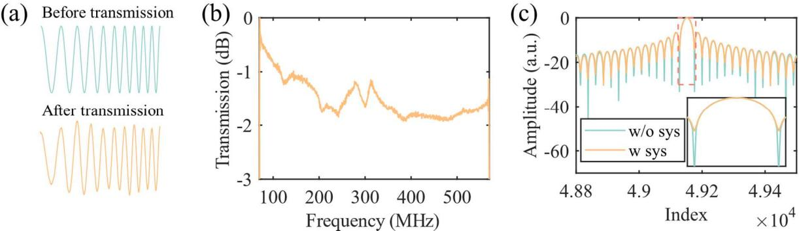
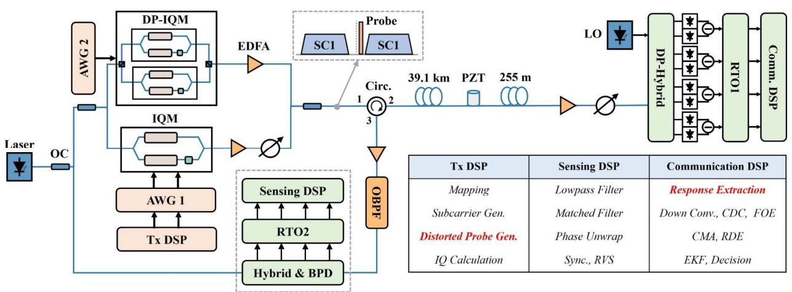
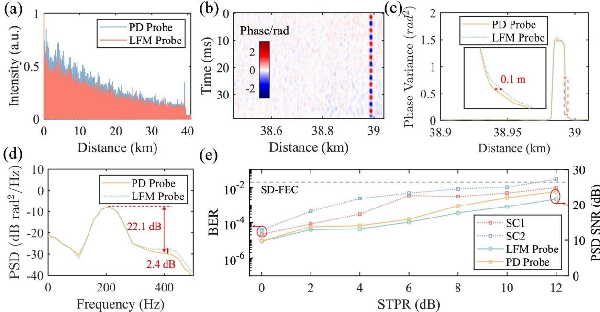

{0}------------------------------------------------

OECC/PSC 2025 OECC/PSC 2025 **ThC1-3**

# **Pre-compensation of LFM Sensing Probe via Integrated Sensing and Communication over Fiber System**

LIU Maoqi1,2, WANG Jingchuan2,\*, LIU Chen1 , YU Changyuan2 , LU Chao2

1 National Engineering Laboratory for Next Generation Internet Access System, School of Optical and Electronic Information, Huazhong University of Science and Technology, Wuhan 430074, China 2Photonics Research Institute, Department of Electrical and Electronic Engineering, The Hong Kong Polytechnic University, Hong Kong SAR, China \* jingchuan98.wang@connect.polyu.hk

*Abstract: We demonstrate an integrated sensing and communication system with sensing probe calibrated through amplitude-frequency response from forward communication, therefore improving sensing signal-to-noise ratio by 2.4 dB.* 

*Keywords: Distributed fiber optical sensing, Optical transmitter and receiver subsystems.* 

### **INTRODUCTION**

Distributed fiber optic sensing (DFOS) systems have become indispensable for large-scale infrastructure monitoring, leveraging optical fibers as distributed sensors to detect temperature, strain, and vibration with high sensitivity [1]. Among DFOS techniques, phase-sensitive optical time-domain reflectometry (*φ*-OTDR) stands out for its ability to detect dynamic perturbations with high signal-to-noise ratio (SNR) [2]. Chirped pulse *φ*-OTDR (CP-*φ*-OTDR), which employs linear frequency modulation (LFM) probe signals, further enhances performance by mitigating coherent fading and improving spatial resolution [3]. However, the chirped sensing probe in CP-*φ*-OTDR systems is susceptible to frequencydependent distortions caused by laser intensity fluctuations, modulation instability, gain tilt and transient effects in erbium-doped fiber amplifiers (EDFAs). These distortions lead to a non-flat frequency response of sensing probe, resulting in mismatched filtering at the receiver and degrading both SNR and spatial resolution. Reference pulse-based method pre-characterizes the response of system for post-processing equalization [4], which is limited due to additional components. pre-distortion of the modulation drive signal has been proposed to compensate sensing probe based on modulation curve [5]. Meanwhile, the integrated sensing and communication (ISAC) system has emerged as a promising paradigm, enabling shared infrastructure for dual-purpose functionality [6]. In ISAC systems, sensing probes are often embedded within communication signals, such as pilot tones [7, 8] or carriers [9], to maximize spectral efficiency. Hence, by taking advantage of the information provided by forward communication side, sensing probe can be furthermore calibrated via the integrated sensing and communication system.

In this paper, we propose a novel framework that exploits the distortion of sensing probe in a digital subcarrier multiplexing (DSCM)-based ISAC system. Our approach captures real-time frequency response data from the forward communication link and utilizes extracted data to dynamically pre-compensate for the probe distortion at the transmitter. This closed-loop structure effectively eliminates mismatched filtering artifacts, resulting in significant performance improvements. We experimentally demonstrate simultaneous 2×120 Gbit/s 16-QAM data transmission and distributed sensing with a spatial resolution of 1 m in 40-km fiber link. The pre-compensation enabled by forward communication information results in significant improvements in both SNR and spatial resolution. Additionally, the impact of sensing on communication is thoroughly discussed.

## **PRINCIPLES**

The non-uniform frequency response of the system distorts the time-domain waveform of the LFM probe due to its intrinsic time-frequency correlation, where frequency-domain imbalances directly manifest as temporal distortions, degrading sensing performance. As shown in Fig. 1 (a), frequency-dependent attenuation from the non-uniform response distorts the received signal. The amplitude-frequency response of the LFM probe, denoted as |H(ω)|, is measured at the communication receiver, as shown in Fig. 1 (b). This response curve characterizes the frequency-dependent loss experienced by the probe during transmission. When a matched filter is applied at the sensing receiver to correlate the received signal with the transmitted LFM probe, the resulting autocorrelation function (ACF) exhibits an elevated noise floor, as depicted in Fig. 1 (c). While the full width at half maxima (FWHM) remains similar, the main lobe widens, degrading the sensing spatial resolution. To address this issue, we employ the frequency response curve obtained from the forward communication link to pre-compensate the transmitted LFM probe, which can be expressed as

$$S_{PD}(t) = \mathbf{F}^{-1} \{ S(\boldsymbol{\omega}) \cdot \left| H(\boldsymbol{\omega}) \right|^{-1} \}, \tag{1}$$

{1}------------------------------------------------

where *S*(*ω*) is the Fourier transformation of sensing probe *s*(*t*) before transmission. When the pre-distorted probe is applied, the imbalance in the amplitude-frequency response of LFM probe within the system is compensated. As a result, the ACF approaches the ideal curve (green) shown in Fig. 1 (c), exhibiting a significant reduction in noise floor and a narrower main lobe compared to the uncompensated case.

Fig. 1. (a) The time-domain waveform of the LFM signal before and after transmission. (b) The amplitude-frequency response of LFM probe within the ISAC system. (c) ACFs in the ideal case and after transmission of system.

Fig. 2. Experimental setup.

#### **EXPERIMENTAL RESULTS**

We conduct a 40-km ISAC experiment to demonstrate the proposed sensing scheme and the setup is depicted in Fig. 2. The narrow linewidth laser (NKT E15) is equally split via a polarization-maintaining coupler into two paths. The first path serves as the local oscillator (LO) for coherent reception in the sensing receiver. The second path is modulated by arbitrary waveform generators (AWGs) to generate an ISAC signal. The sensing component comprises a continuous linear frequency-modulated (LFM) probe with a starting frequency of 70 MHz and a swept bandwidth of 500 MHz, while the communication payload consists of two 30 GBaud 16QAM DSCM signals separated by a 2 GHz guard band. Due to the frame length limitation of AWG (Keysight 8196A), the LFM probe is typically generated by a secondary AWG (Keysight 8190A) in practical implementations. However, in an idealized scenario, both the sensing and communication signals could be synthesized adopting a single AWG. The ISAC signal is launched into a 40-km fiber under test (FUT) via an optical circulator, with a 1 m piezoelectric transducer (PZT) embedded at the distal end to simulate a 200 Hz sinusoidal vibration. At the forward communication receiver, the 16QAM signals are received by utilizing a dual-polarization hybrid and four balanced photodetectors. The ISAC signal is acquired by a digital real-time oscilloscope (RTO, Keysight DSAZ594A), while frequency response of the sensing probe is extracted from the coherent receiver. This frequency response data is fed back to the transmitter through the communication link, enabling dynamic pre-compensation of the LFM probe for systemic frequency-dependent distrtions. On the sensing receiver side, the backscattered signal is isolated by employing an optical bandpass filter (OBPF) and further purified via a digital finite impulse response (FIR) filter to suppress residual communication signal interference. The sensing data is received by the same type of receivers and collected by another RTO (Keysight MSOS404A). The processed signal undergoes matched filtering and is segmented into five overlapping traces for rotate-vector summed (RVS) algorithm, eliminating fading interference and achieving a theoretical spatial resolution of 1 m.

At the sensing side, the Rayleigh scattering trace generated by the uncompensated LFM probe and the pre-distorted probe trace are shown in Fig.3 (a). It can be observed from the traces and noise floors that the signal-to-noise ratio (SNR) 

{2}------------------------------------------------

is generally improved. With the gauge length set to 10 m, the phase waterfall extracted by the pre-distorted probe is shown in Fig.3 (b), where a noticeable vibration trace can be seen. The phase variance obtained is shown in Fig.3 (c), and from the falling edge, it is evident that the tailing effect in the trace produced by the pre-distorted probe has been improved. Comparing the power spectrum density (PSD) curves of the vibration traces from both probes, depicted in Fig.3 (d), reveals that the SNR of the pre-distorted probe has improved by 2.4 dB. Finally, the impact of sensing-to-telecom power ratio (STPR) on the sensing and communication performance is explored. By controlling the launch power of communication signal at 0 dBm through the variable optical attenuator (VOA), the LFM probe power was increased to control the STPR. It can be observed that as STPR increases, the bit error rate (BER) of both communication subcarriers increases, especially for SC2, which is closer to the sensing probe and more affected by fiber nonlinearity. When STPR = 10 dB, both communication and sensing sides achieve a favorable result.

Fig. 3. (a) Rayleigh scattering traces of the LFM probe and pre-distorted probe. (b) Phase waterfall with pre-distorted probe (10 m gauge length). (c) Phase variance and (d) PSD curves of the vibration with LFM probe and pre-distorted probe. (e) Impact of STPR on communication BER and sensing SNR

## **CONCLUSIONS**

We propose an ISAC scheme that leverages forward communication to capture probe distortion, followed by precompensation at the sensing transmission end. This approach allows for distributed sensing and communication over 40 km fiber with minimal impact on both performances. Experimental results show an SNR improvement of 2.4 dB in distributed sensing with 1-m spatial resolution.

## **ACKNOWLEDGMENT**

This work was supported in part by the National Key Research and Development Program of China under Grants 2023YFB2905300 and in part by the Hong Kong Government under Grants HK RGC GRF 15209321, GRF 15227321.

#### **REFERENCES**

- [1] Z. He and Q. Liu, "Optical Fiber Distributed Acoustic Sensors: A Review," *Journal of Lightwave Technology*, vol. 39, no. 12, pp. 3671-3686, 2021.
- [2] Soriano-Amat et al., "Time-expanded phase-sensitive optical time-domain reflectometry," *Light Sci. Appl.,* 10, 51, 2021.
- [3] D. Chen, Q. Liu, and Z. He, "Phase-detection distributed fiber-optic vibration sensor without fading-noise based on time-gated digital OFDR," *Opt. Express,* 25, 8315-8325, 2017.
- [4] Q. Bian, Z. Song, Y. Chen, and X. Zhang, "Pulse reference-based compensation technique for intensity-modulated optical fiber sensors," *Chin. Opt. Lett.* 15, 120603, 2017.
- [5] X. Ji et al. "Chirped-pulse coherent-OTDR with predistortion," *Journal of Optics,* 20, 2018.
- [6] E. Ip et al., "DAS over 1,007-km Hybrid Link with 10-Tb/s DP-16QAM Co-propagation using Frequency-Diverse Chirped Pulses," *Optical Fiber Communications Conference and Exhibition (OFC)*, San Diego, CA, USA, 2022, pp. 1-3.
- [7] J. Wang et al., "High-efficiency ISAC to enable sub-meter level vibration sensing for coherent fiber networks," *2024 Optical Fiber Communications Conference and Exhibition (OFC)*, San Diego, CA, USA, 2024, pp. 1-3.
- [8] Z. Hu et al., "Enabling cost-effective high-performance vibration sensing in digital subcarrier multiplexing systems," *Opt. Express*, 31, 32114-32125, 2023.

{3}------------------------------------------------

[9] H. He et al. "Integrated sensing and communication in an optical fibre," *Light Sci. Appl.,* 12, 25, 2023.