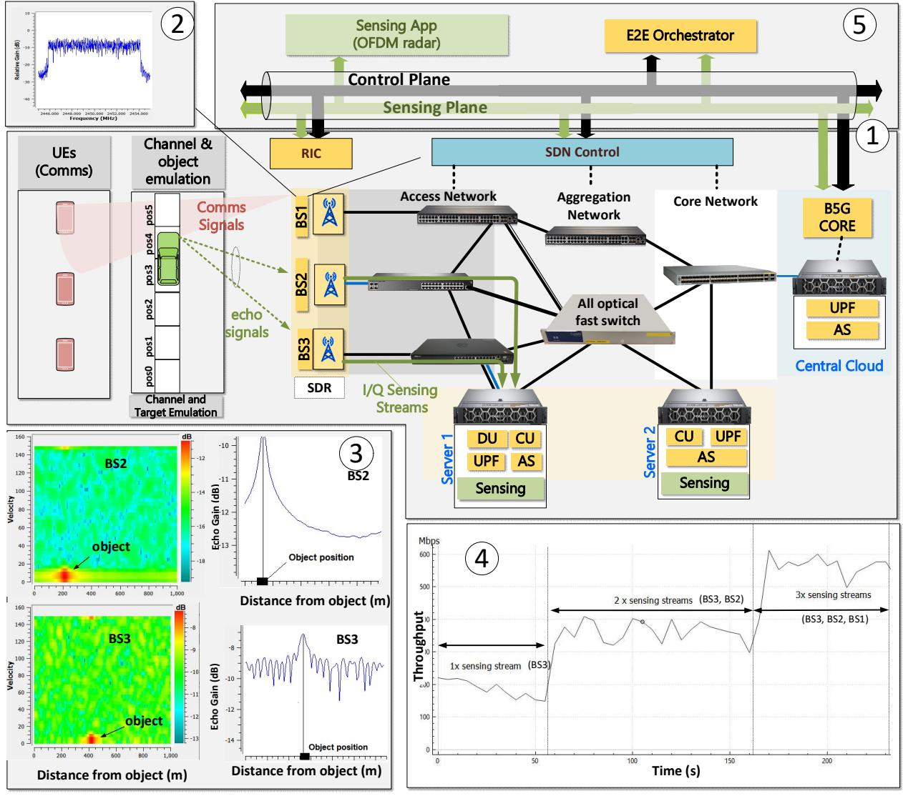
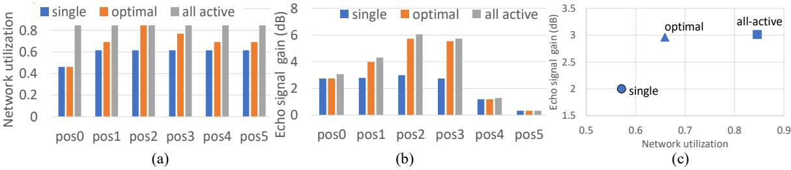

{0}------------------------------------------------

# Optical Transport Network Optimization Supporting Integrated Sensing and Communication Services

Markos Anastasopoulos(1), Jesús Gutiérrez (2), Anna Tzanakaki(1)

(1) National and Kapodistrian University of Athens, GR, (2) IHP – Leibniz-Institut für innovative Mikroelektronik, DE

Abstract: This paper proposes and experimentally validates an architecture exploiting an optical transport network interconnecting Radio Access Network and core domains, to facilitate joint support of sensing and communication services in accordance with the 6G vision.

OCIS codes: (060.4254) Networks, combinatorial network design; (060.4256) Network optimization.

# 1. Introduction

6G services will be associated with a wide spectrum of vertical applications with greatly varying requirements and will offer advanced features beyond connectivity spanning from sensing to monitoring and positioning. To address these requirements, 6G will feature Integrated Sensing and Communication (ISAC) capabilities, performing sensing through the mobile communication infrastructure. Doing this, the network acts as a "radar" sensor, exploiting its own radio signals to sense and comprehend the surrounding physical world. The echoes (reflections) and scattering of wireless signals predominately transmitted for communication purposes, provide information related to the characteristics of the environment and/or objects therein [1]. The sensing data collected and processed by the network can then be leveraged to enhance the network's operations, augment existing services such as XR and digital twinning, and enable new services, such as object detection and tracking, along with imaging and environment reconstruction. This potential has already attracted a lot of attention from 3GPP, which has initiated a preliminary study on use cases and ISAC requirements, making it a promising candidate to optimize both communications and sensing systems [1]. Sensing and communication functions can be performed taking different approaches: (a) adopting separate and dedicated infrastructures for sensing and communications, where information acquired from one infrastructure is used to assist the other, (b) sensing and communication capabilities are supported by common hardware sharing the available spectrum, with the constraint that sensing and communication signals are transmitted over different timeslots, and (c) adopting integrated systems fully sharing both spectrum and time domains. Although some early prototypes are available validating concepts (a) and (b), implementations of 3GPP compliant ISAC systems (concept (c)) are still at a very early stage. These systems demand additional complexity in signal processing but require collection and aggregation of huge volumes of synchronized IQ reflected (echo) streams that need to be processed to extract information on the sensed environment. This processing can only be performed at edge servers, introducing the need to transport the IQ streams over flexible high-capacity transport networks.

In view of this, this paper proposes and experimentally validates an architecture exploiting an optical transport network that interconnects Radio Access Network (RAN) and core domains, to facilitate joint support of sensing and communication services. Sensing is performed based on the principle of a distributed passive wireless radar. According to this, 6G Base Stations (BSs) generate communication signals reflected on "objects" located in the surrounding area, creating IQ echo streams. These IQ echo streams are transmitted in the form of uplink fronthaul streams and are redirected to a multi-access edge computing (MEC) node for storage and processing. A sensing app has been purposely developed to analyze the quality of the IQ echo streams at the MEC and decide which IQ streams can be used to support the required sensing. The IQ streams that are not carrying useful information are dropped. The sensing app output, including only useful IQ streams, is passed to the network orchestrator that decides the optimal transport network configuration to support both communication and sensing services. To perform this, the orchestrator solves the optical transport network optimization problem considering both communication (i.e. fronthaul backhaul) and sensing (IQ echo streams) services. The identified configuration is then executed by the Software Defined Networking (SDN) control of the optical transport network. The proposed architecture has been experimentally implemented and evaluated using a platform that comprises actual hardware for the optical transport network, compute servers and wireless transceivers. The wireless channel (over the air transmission) is emulated through the GNU Radio platform. To the best of our knowledge this is the first experimental study that optimizes the operation of an optical transport network supporting ISAC services using 3GPP compliant RF signals.

# 2. System Architecture

The system architecture (Fig. 1-1) exploits an optoelectronic transport network interconnecting the RAN with the core functions located at the MEC. The hierarchical structure of the proposed architecture offers RAN connectivity and collects and aggregates transport network and sensing traffic streams from the BSs, while it transports these to the servers (shown in green). Both the RAN and aggregation transport network segments are implemented through multivendor SDN-controlled optoelectronic switches with different capabilities (port no, capacity per port & latency). The

{1}------------------------------------------------

access network is equipped with low energy consuming switching nodes with limited number of input ports and relatively small capacity (1/10GbE/port). The aggregation transport network comprises high-end optoelectronic and all-optical fast switches with higher capacity and density (10G/40G/100GbE/ports), offering much higher energy efficiency. All-optical fast switches are a key enabler that facilitates transparent routing of IQ sensing flows to the MEC servers needed to achieve acceptable transport delays. For the RAN segment, a Software Defined Radio (SDR) platform (based on USRP B210 and N310) transmitting 5G New Radio (NR) Orthogonal Frequency Division Multiplexing (OFDM) modulated signals is used (Fig. 1-2) to support the functionality of Remote Units (RUs). For the compute domain, edge servers attached to the access switches and central cloud servers connected to the aggregation/core switches are adopted. These servers are used to host containerized RAN elements (i.e. Distributed Unit (DU)/Central Unit (CU)) and sensing functions (storage of I/Q echoes and processing). The sensing app implements a passive OFDM-based radar [2] that uses as input, signals reflected on objects in the surrounding area, when connectivity between BSs and UEs is established. The sensing app evaluates the quality of the reflected signals captured per BS and, if these are above a specific Signal-to-Noise-Ratio (SNR) threshold, they are used to estimate the position of the corresponding object. These results are then communicated to the E2E orchestrator that calculates the optimal resource allocation policy needed to accommodate both communication and sensing services. This is achieved by identifying the appropriate capacity for the paths implementing "RU-DU-CU" and "RU-Sensing" function connectivity, executed by the SDN transport network controller. Finally, for the wireless channel, a dedicated virtual machine has been deployed hosting the open-source GNU Radio platform, emulating channel impairments and objects in the surrounding area using the "Noise Source" and "Static Target Simulator" blocks, respectively[3]. Sensing Information exchange between different system building blocks is based on ZeroMQ messaging platform [4].

Fig. 1: (1) Optical Transport network supporting ISAC (3) Transmitted 5G-NR compliant OFDM signal (3) (left) Object detection using the echoes at BS2 and BS3. (right) Echoes used for the estimation of the object from BS2 and BS3, (4) Echo streams from various BSs directed to server 1. (5) Sensing information exchange between the sensing app and network orchestrator.

{2}------------------------------------------------

Fig. 2: (a) Network utilization vs object position for different ISAC optimization policies b) Sensing accuracy (measured through echo signal margin) vs object positions. (c) Echo signals strength vs network utilization

## 3. ISAC based transport network optimization

To evaluate the performance of the proposed architectural approach and technical implementation an optimization framework has been designed and deployed in the testbed of Fig.1-1. This framework tries to minimize the number of network links used by identifying the optimal routing and network capacity allocation policies under communication (fronthaul, backhaul) and sensing flow (IQ echo streams) traffic requests. This problem is solved considering the following parameters and constraints: (1) The characteristics of the optical transport network and compute servers including number of nodes, connectivity graph, and capacity. (2) The characteristics of the RAN and mobile core segments including deployment option for the mobile communication (location of RU, DU, CU, UPF elements) and its operational parameters (spectrum allocation, numerology). (3) The received signal strength of the echoes captured by the various BSs. This last parameter is quite important, as received signals with low SNR cannot be exploited by the sensing app in the estimation of the object location. To reduce unnecessary overheads, the model considers as input sensing streams captured by BSs with SNRs exceeding a predefined SNR threshold (SNRth). SNRth depends on several parameters such as transmission conditions, the environment where the system is installed, the location of the RUs, etc., and can be experimentally precomputed. A typical numerical example is shown in the left column of Fig. 1-3, illustrating the spectrograms of the received IQ streams at BS2 and BS3 when their distance from the object is 200 and 400m, respectively. From the same figure we observe (right column) that for objects closely located to a BS (case of BS2) the received SNR is high and, therefore, the object can be detected with high accuracy. However, as the object-BS distance increases, the received SNR is reduced, reducing also the track detection accuracy. The object detection accuracy can be further improved combining estimations from multiple BSs [5]. (4) The capacity requirements for the sensing and communication traffic flow. For the sensing flows, these requirements increase with the number of BSs involved in the sensing process collecting and transmitting IQ echo streams. A typical set of measurements for IQ streams collected for 10MHz bandwidth allocation in the wireless segment (OFDM modulated) is shown in Fig. 1-4. This set of measurements shows the throughput of the IQ streams forwarded by "BS3", "BS3-BS2" and "BS3-BS2-BS1" to the edge server #1. For the fronthaul and backhaul requirements (due to space limitations) the reader is referred to [6] providing a detailed discussion. (5) Delay requirements for the sensing streams. To handle this, sensing flows are transparently transported to the sensing servers through the all-optical transport network switch, acting as an IQ sensing switch, eliminating transmission delays introduced by optoelectronic devices. The use of the all-optical switch is a key enable that allows to maintain the overall transport delay acceptable.

## 4. Numerical results and Conclusions

The proposed scheme is evaluated for the topology of Fig.1-1 considering an object located at different positions. We evaluate three different management policies: a) "single" echo approach, where IQ signals captured by the BS with the strongest SNR are transmitted to the sensing app, b) "optimal" dynamic approach considering echoes with SNR exceeding a specific threshold, and c) "all-active" approach using echoes from all BSs. IQ streams for communication services coexist with sensing streams. Fig. 2 a) and b) compare the transport network utilization (ratio of links used vs total available links) and received echo SNR, respectively, for different object positions and ISAC optimization policies. In the "optimal" approach, the selected echoes are dynamically routed to the sensing server. Optimal routing paths are calculated by the E2E orchestrator and executed by the transport network SDN controller. The "optimal" approach has higher network requirements compared to the "single" echo (~15%) and it is 30% more efficient than the static "all-active" approach. As shown in Fig.2c) illustrating the sensing accuracy of all schemes, the "optimal" scheme receives echoes of similar SNR with the "all-active" approach, while requiring 50% less network resources.

### Acknowledgements

This work has been supported by the EC Horizon Europe, SNS-JU projects 6G-SENSES project and ECO-ENET.

### 5. References

- [1] 3GPP TR 22.837 V19.4.0 (2024-06) Feasibility Study on Integrated Sensing and Communication (Release 19).
- [2] K.Braun, OFDM Radar Algorithms in Mobile Communication Networks, Dissertation, KIT ISSN: 1433-3821, 2014.
- [3] GNU Radio, https://www.gnuradio.org/
- 4] ZeroMQ, https://zeromq.org/
- [5] R. Vasist, et.al, "Localization System Architecture for Enhanced Positioning in Industry 4.0 Applications," ICNC 2023,
- [6] A. Tzanakaki et.al., "Converged Optical, Wireless, and Data Center Network Infrastructures for 5G Services," JOCN (2019)