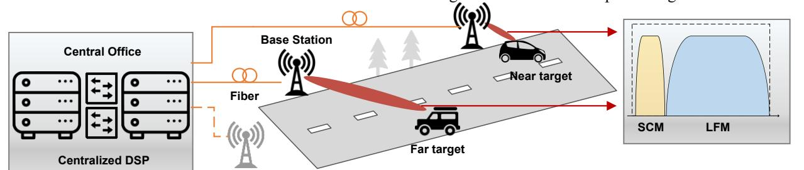
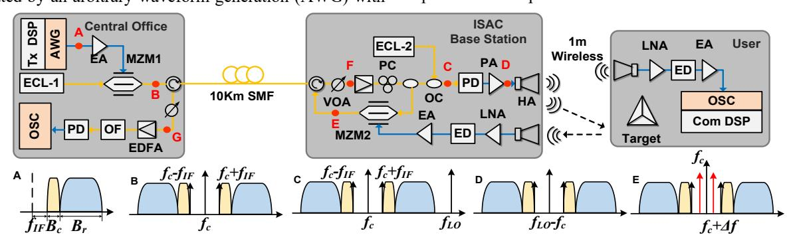
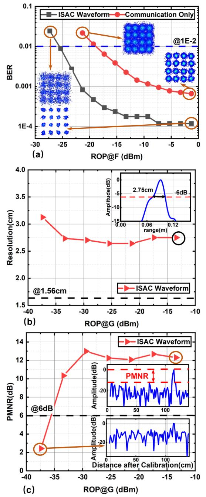
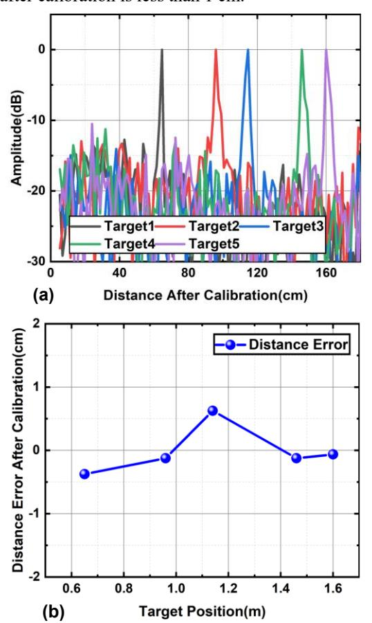

{0}------------------------------------------------

# W-band Photonic-based Integration of Sensing and Communication with Frequency-division Multiplexed Waveforms in Fiber-wireless Integrated Network

#### Boyu Dong

Shanghai ERC of LEO Satellite Communication and Applications, Shanghai CIC of LEO Satellite Communication Technology, Fudan University.

Shanghai, China
e-mail: bydong21@m.fudan.edu.cn

#### Guoqiang Li

Shanghai ERC of LEO Satellite Communication and Applications, Shanghai CIC of LEO Satellite Communication Technology, Fudan University.

Shanghai, China
e-mail: 19210720066@fudan.edu.cn

# HaiPeng Wang

Shanghai ERC of LEO Satellite Communication and Applications, Shanghai CIC of LEO Satellite Communication Technology, Fudan University. Key Laboratory of EMW Information (MoE), Fudan University Shanghai, China e-mail: hpwang@fudan.edu.cn

#### Junlian Jia

Shanghai ERC of LEO Satellite Communication and Applications, Shanghai CIC of LEO Satellite Communication Technology, Fudan University.

Shanghai, China
e-mail: jljia20@fudan.edu.cn

# Jianyang Shi

Shanghai ERC of LEO Satellite Communication and Applications, Shanghai CIC of LEO Satellite Communication Technology, Fudan University. Key Laboratory of EMW Information (MoE), Fudan University
Shanghai, China
Peng Cheng Laboratory
Shenzhen, China
e-mail: jy shi@fudan.edu.cn

## Junwen Zhang\*

Shanghai ERC of LEO Satellite Communication and Applications, Shanghai CIC of LEO Satellite Communication Technology, Fudan University. Key Laboratory of EMW Information (MoE), Fudan University

Shanghai, China
Peng Cheng Laboratory
Shenzhen, China
e-mail: junwenzhang@fudan.edu.cn

#### Nan Chi

Shanghai ERC of LEO Satellite Communication and Applications, Shanghai CIC of LEO Satellite Communication Technology, Fudan University.

Key Laboratory of EMW Information (MoE), Fudan University

Shanghai, China

Peng Cheng Laboratory

Shenzhen, China

e-mail: nanchi@fudan.edu.cn

Abstract—A millimeter-wave (MMW) integrated sensing and communication (ISAC) system based on photonics is proposed. Its structure is simple, and the optical fiber-wireless structure can perfectly adapt to the current centralized fiber-distributed communication network. In the proposed system, the linear frequency modulated (LFM) signal and subcarrier modulated (SCM) 16-quadrature amplitude modulation (QAM) signal are combined by frequency division multiplexing (FDM).

In the experiment, we verify a photonic-based ISAC W-band fiber-wireless integration system at 96.5 GHz over 10-km fiber transmission. We achieve 48 Gbit/s in communication-only mode and 8 Gbit/s in ISAC mode when the sensing resolution is 2.75 cm. By means of external calibration, the distance error of the system is less than 1 cm.

{1}------------------------------------------------

*Keywords- millimeter-wave photonics; integrated sensing and communication; LFM; SCM; fiber-wireless*

## I. INTRODUCTION

In the future 6G, there are many application scenarios such as smart cities and vehicle-to-everything that require a tighter combination of sensing and communication. And in 6G, millimeter-wave (MMW) and even higher frequency bands will be used. Thus, it is foreseen that integrated sensing and communication (ISAC) at the MMW band will become a key technology [1]. All-electronic ISAC systems suffer from limited bandwidth [2] and difficulty in integrating with the current communication network architecture. MMW ISAC systems based on photonics have many outstanding advantages. By microwave photonics technology, broader bandwidth can be produced directly and the carrier frequency can be quickly altered [3]. More importantly, ISAC systems based on photonics can be perfectly integrated with the fiber-wireless communication network, thereby reducing the overhead and complexity of equipment upgrades [4].

There are many research works on ISAC systems based on photonics [4]–[13]. However, the photonic-based ISAC systems demonstrated in [5]–[10] face the problem of low access rates. Sensing and communication signals combined by frequency division multiplexing (FDM) [4,11-12] or time division multiplexing (TDM) [13] can achieve highresolution sensing and high-speed data transmission at the same time. However, in these prototypes, no distributed fiber transmission is considered and the systems are relatively complex. To sum up, the current photonic-based ISAC systems either cannot achieve high-speed communication at MMW or introduces high complexity in a centralized fiberdistributed structure.

To fully explore the ISAC system based on photonics, in this paper, we propose and experimentally demonstrate a novel W-band photonic-based ISAC system with an integrated waveform consisting of subcarrier modulated (SCM) and linear frequency modulated (LFM). The broad bandwidth signal in W-band is generated by heterodyning two free-running external cavity lasers (ECLs). Our proposed system has a simple structure and can perfectly adapt to the current communication network, achieving high-speed communication and high-resolution sensing simultaneously. The experimental demonstration works at 96.5 GHz over 10 km fiber transmission. We achieve 48 Gbit/s in the communication-only mode. In the ISAC mode, a data rate of 8 Gbit/s and a sensing resolution of 2.75 cm are achieved simultaneously. Employing external calibration, the distance error of the system is less than 1 cm.

## II. PRINCIPLE

Fig. 1 shows the proposed architecture of photonic-based, centralized, and seamless fiber-wireless radar sensing and commutation system and the application scenarios. The FDM-based ISAC signals are generated and processed in the centralized office. The SCM signals for communication and LFM signals for radar sensing are combined and multiplexed in the frequency domain so that continuous radar sensing and communication can be maintained simultaneously. Total bandwidth is shared by the two types of signals. The ISAC waveform is then co-transmitted to the remote base station (BS), and the signals are converted into MMW based on the photonic method as the optical-to-electrical conversion. The communication signal can be filtered out at the receiver-side for signal recovery, while the echo signal can be de-chirped through the microwave-photonic method in BS after downconversion. Finally, the de-chirped echo signals with the sensing information of detected targets will be sent back through fiber for centralized processing.

Figure 1. The concept of adaptive photonic-based ISAC networks based on millimeter wave over fiber.

For communication signal, the W-band signal is first down-converted to IF at the user-end (UE) side through an envelope detector. The IF signal is then captured by a digital sampling oscilloscope (DSO) and then processed offline for signal recovery. For radar sensing, the received echo signal is also first down-converted to the IF band at the BS and then modulated through a Mach-Zehnder modulator (MZM) on the reference optical signal that contains the same LFM signal. By doing so, the echo LFM signal is de-chirped by the photonic method after MZM. The frequency difference between echo and reference signal is related to the target distance. The de-chirped signal is then sent back to the central office through an optical fiber. Here, we can use *∆R=cTLFM∆f/2Br* to describe the relationship between the frequency and the target distance, where *c* is the velocity of light, *TLFM* is the duration time of one chirp, *∆f* is the frequency difference of the de-chirped signals, *Br* is the bandwidth of LFM, and ∆*R* is the target distance. A simple fast Fourier transform (FFT) can be used to extract the frequency difference, thus obtaining the distance of the target. Range resolution is another key metric for radar sensing, which represents the smallest distance between objects that 

{2}------------------------------------------------

can be distinguished in a single measurement. The theoretical resolution can be expressed as  $\delta_r = c/2B_r$ , which is highly dependent on the bandwidth of the radar signal.

#### III. EXPERIMENTAL SETTINGS

The experiment setup of the W-band MMW photonic-based ISAC system based on the FDM of SCM and LFM signals for the fiber-wireless integrated network is shown in Fig. 2. At the central office, the SCM signal is first generated to the IF band at 2 GHz after up-sampling. At the same time, an LFM signal is also generated and converted to the IF band. The SCM and LFM signals are offset and multiplexed in the frequency domain without interferences, and they are normalized in the time domain with the same peak-to-peak voltage. Here, the  $T_{LFM}$  is 66.13 ns. A guard band with a bandwidth of 400 MHz is added between the SCM and LFM signals in the frequency domain. The FDM-based ISAC signals with a total bandwidth of 12-GHz are finally generated by an arbitrary waveform generation (AWG) with

a sampling rate of 60 GSa/s. In our demonstration, a 2-GHz SCM signal and 9.6-GHz LFM are applied. The ECL-1 working at 193.1 THz with a linewidth of 100 kHz is applied as the light source, and then the light is modulated by the MZM-1 operating at the quadrature bias point. After transmission over 10-km optical fiber, the optical signal is then split by two cascaded 3-dB polarization-maintaining optical couplers (PM-OCs). After the first PM-OC, one path of the optical signal is combined with the ECL-2, which serves as the local oscillator (LO) for photonics MMW generation. Here, the ECL-2 has a frequency of 193.1965 THz (namely, 96.5 GHz frequency offset to ECL-1) and output power of about 6.0 dBm power. The optical signal is then sent to a 100 GHz high-speed PD for W-band signal generation, which is then amplified by a PA before being launched by a horn antenna (HA). Another path of the first PM-OC is used as the reference signal for the radar sensing part, which is then modulated by MZM-2 operating at the quadrature bias point.

Figure 2. Schematic of the experiment setup. AWG: arbitrary waveform generator, ECL: external cavity laser, EA: electrical amplifier, MZM: Mach-Zehnder modulator, VOA: variable optical attenuator, EDFA: erbium-doped fiber amplifier, PC: polarization controller, OC: optical coupler, PA, power amplifier, PD: photodiode, HA: horn antenna, LNA: low noise amplifier, ED: envelope detector, ADC: analog-to-digital converter, OF: optical filter, OSC: oscilloscope.

#### IV. RESULTS

#### A. Received Optical Power

In experiments, we first explore the effects of received optical power (ROP) on communication and radar sensing, respectively. The related results are shown in Fig. 3.

In Fig. 3 (a), the results about BER versus ROP at point F are shown. We change the optical power through a VOA and analyze the BER at the user end. It can be seen that BER at the user end increases, which means the communication performance degrades, with ROP decreasing. Also shown in Fig. 3 (a) is the performance comparison of the communication-only waveform and the ISAC waveform. We can find that the communication performance of the ISAC waveform is better under the same ROP because the SCM in ISAC waveform is in the low-frequency part and the bandwidth is smaller. At the same time, the main reason why the system communication performance deteriorates with the decrease of optical power is because of the insufficient signal-to-noise ratio (SNR).

As for radar sensing, the related results are shown in Fig. 3 (b) and (c). Similarly, we change the optical power at point

G by a VOA, and we can get the resolution versus ROP. We can find that under different ROPs, the resolution fluctuates slightly, when the ROP is lower than a certain value, the resolution will become very poor. The reason for this is also due to the insufficient SNR.

In order to measure the sensing SNR more intuitively, we introduce peak to maximum noise ratio (PMNR) as a reference, which is defined as the ratio of the peak amplitude to the highest noise amplitude. When the PMNR is less than 6dB, we consider that the target signal and noise cannot be distinguished in the spectrum. The related results about PMNR are shown in Fig. 3 (c).

# B. Distance Errors

In the experiment, we find that the relative position of the measurement target is accurate, but the absolute position has a fixed error, which is caused by the time delay of the optical device noise in the system and some other system errors. To measure the distance of the target more accurately, we performed external calibration to eliminate this systematic error. In the experiment, our method of external calibration is to use the LFM signal to detect a corner reflector set at an absolute distance of 114 cm. The error value of the system

{3}------------------------------------------------

can be obtained by subtracting 114 cm from the detected distance. In our system, the error value obtained by external calibration is 26 cm.

Figure 3. (a) BER versus optial power at point F (b) resolution versus optial power at point G (c) PMNR versus optial power at point G

After external calibration, we conduct localization experiments on targets at different distances. First, the five targets are arranged at different distances of 65 cm, 96 cm, 114 cm, 146 cm, and 160 cm respectively. Then we use the ISAC waveform to detect the target, and the obtained spectrum is shown in Fig. 4 (a). The distance error results after external calibration are shown in Fig. 4 (b), where we can find that in all detection distance ranges, the distance error after calibration is less than 1 cm.

Figure 4. (a) Spectra of the different de-chirped echos which the target distance is 65cm, 96cm, 114cm, 146cm, and 160cm, respectively.(Sensing bandwidth 9.6GHz) (b) measured distance error after calibration

# V. CONCLUSION

In conclusion, we propose and experimentally demonstrate a photonic-based MMW fiber-wireless ISAC system at W-band with an integrated waveform. Based on photonics technology, the SCM signal and LFM signal are generated, sharing a 12 GHz broad bandwidth. The experimental results show that the 8 Gbit/s access rate and 2.75 cm resolution sensing can be achieved with the integrated waveform. The distance error is less than 1 cm after calibration. And with the communication-only waveform, the access rate can achieve 48 Gbit/s after a 1 m wireless link at the 96.5 GHz band. In future work, we can adapt a flexible waveform to realize the trade-off between sensing and communication. It's foreseen that the proposed architecture can play a major role in the future 6G.

## ACKNOWLEDGMENT

This work was partly supported by the NSFC project (No.61925104, No.62031011, No. 62171137) Shanghai NSF project (No. 21ZR1408700) and Peng Cheng Laboratory project (No. PCL2021A14).

{4}------------------------------------------------

## REFERENCES

- [1] D. K. Pin Tan *et al.*, "Integrated Sensing and Communication in 6G: Motivations, Use Cases, Requirements, Challenges and Future Directions," in *2021 1st IEEE International Online Symposium on Joint Communications & Sensing (JC&S)*, Dresden, Germany, Feb. 2021, pp. 1–6. doi: 10.1109/JCS52304.2021.9376324.
- [2] S. Pan and Y. Zhang, "Microwave Photonic Radars," *J. Lightwave Technol.*, vol. 38, no. 19, pp. 5450–5484, Oct. 2020, doi: 10.1109/JLT.2020.2993166.
- [3] E. A. Kittlaus *et al.*, "A low-noise photonic heterodyne synthesizer and its application to millimeter-wave radar," *Nat Commun*, vol. 12, no. 1, p. 4397, Dec. 2021, doi: 10.1038/s41467-021-24637-0.
- [4] S. Jia *et al.*, "A Unified System With Integrated Generation of High-Speed Communication and High-Resolution Sensing Signals Based on THz Photonics," *J. Lightwave Technol.*, vol. 36, no. 19, pp. 4549– 4556, Oct. 2018, doi: 10.1109/JLT.2018.2863684.
- [5] W. Bai, X. Zou, P. Li, W. Pan, L. Yan, and B. Luo, "60-GHz photonic millimeter-wave joint radar-communication system," in *2021 International Conference on Microwave and Millimeter Wave Technology (ICMMT)*, Nanjing, China, May 2021, pp. 1–3. doi: 10.1109/ICMMT52847.2021.9618314.
- [6] L. Huang, R. Li, S. Liu, P. Dai, and X. Chen, "Centralized Fiber-Distributed Data Communication and Sensing Convergence System Based on Microwave Photonics," *J. Lightwave Technol.*, vol. 37, no. 21, pp. 5406–5416, Nov. 2019, doi: 10.1109/JLT.2019.2935903.
- [7] M. Lei *et al.*, "Integrated Wireless Communication and mmW Radar Sensing System for Intelligent Vehicle Driving Enabled by

- Photonics," in *2021 19th International Conference on Optical Communications and Networks (ICOCN)*, Qufu, China, Aug. 2021, pp. 1–3. doi: 10.1109/ICOCN53177.2021.9563796.
- [8] X. Li, S. Zhao, G. Wang, and Y. Zhou, "Photonic Generation and Application of a Bandwidth Multiplied Linearly Chirped Signal With Phase Modulation Capability," *IEEE Access*, vol. 9, pp. 82618– 82629, 2021, doi: 10.1109/ACCESS.2021.3081566.
- [9] W. Bai *et al.*, "Photonic Millimeter-Wave Joint Radar Communication System Using Spectrum-Spreading Phase-Coding," *IEEE Trans. Microwave Theory Techn.*, vol. 70, no. 3, pp. 1552– 1561, Mar. 2022, doi: 10.1109/TMTT.2021.3138069.
- [10] H. Nie, F. Zhang, Y. Yang, and S. Pan, "Photonics-based integrated communication and radar system," in *2019 International Topical Meeting on Microwave Photonics (MWP)*, 2019, pp. 1–4. doi: 10.1109/MWP.2019.8892218.
- [11] Y. Wang, J. Liu, J. Ding, M. Wang, F. Zhao, and J. Yu, "Joint communication and radar sensing functions system based on photonics at the W-band," *Opt. Express*, vol. 30, no. 8, p. 13404, Apr. 2022, doi: 10.1364/OE.449153.
- [12] R. Song and J. He, "OFDM-NOMA combined with LFM signal for W-band communication and radar detection simultaneously," *Opt. Lett.*, vol. 47, no. 11, p. 2931, Jun. 2022, doi: 10.1364/OL.460188.
- [13] Y. Wang *et al.*, "Photonics-assisted joint high-speed communication and high-resolution radar detection system," *Opt. Lett.*, vol. 46, no. 24, p. 6103, Dec. 2021, doi: 10.1364/OL.444252.