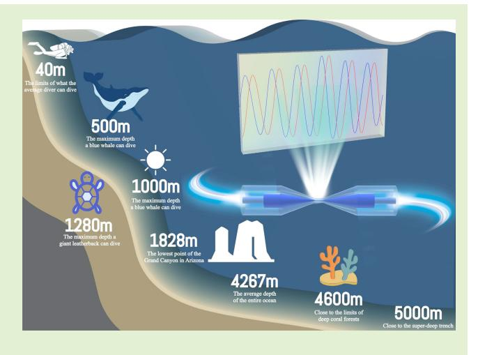
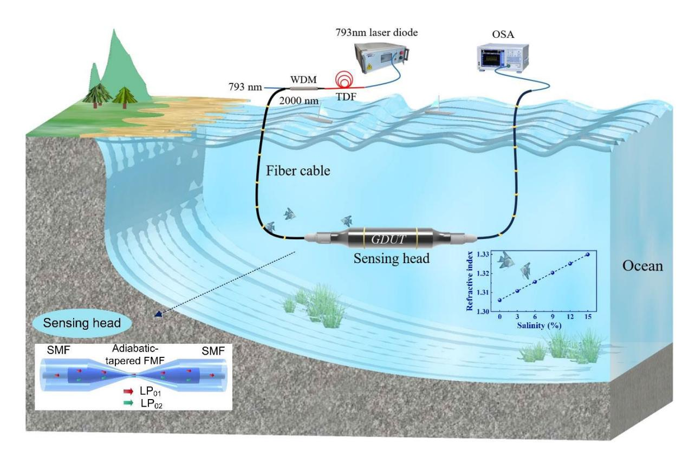
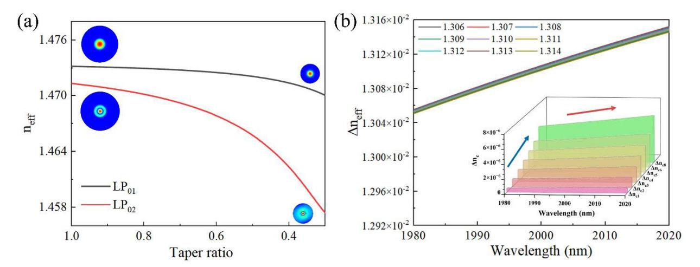
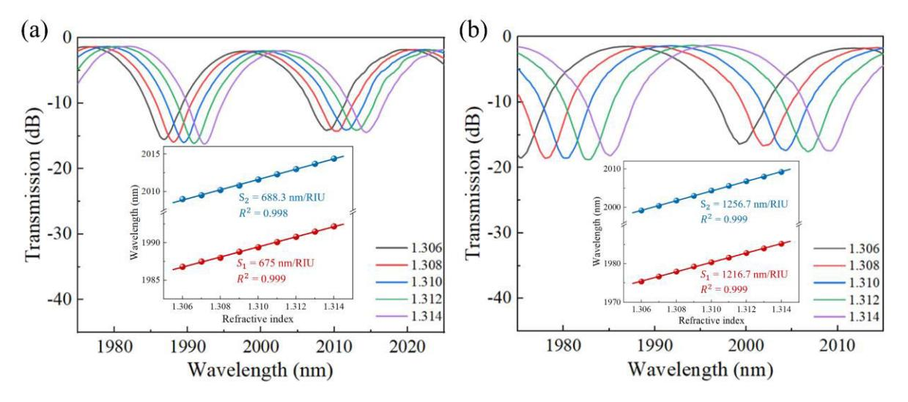
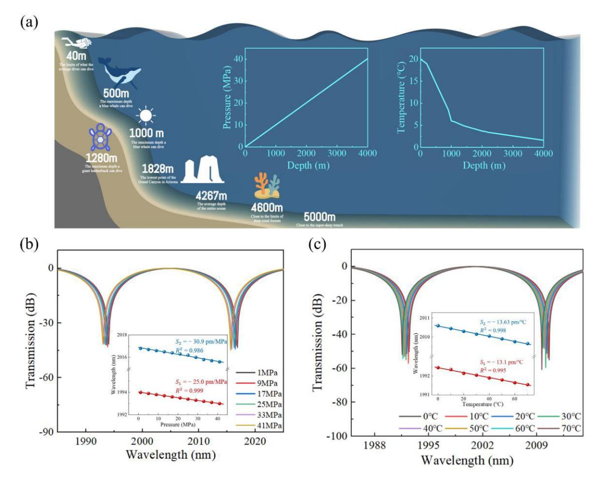
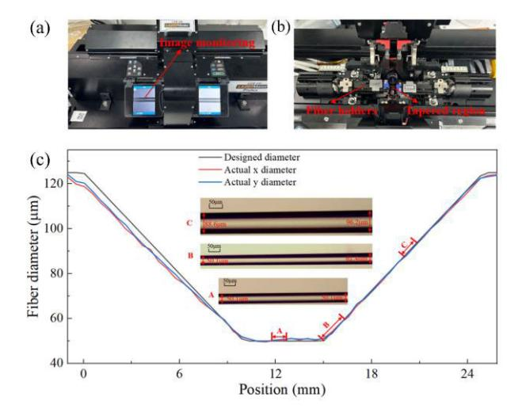
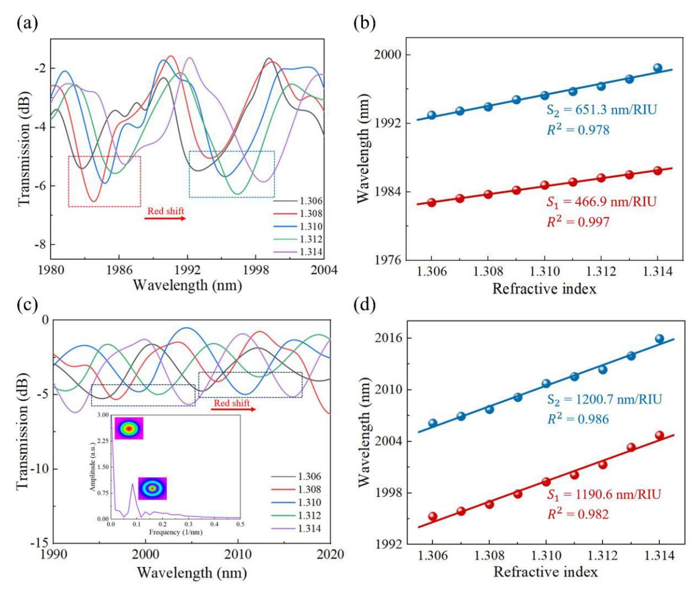
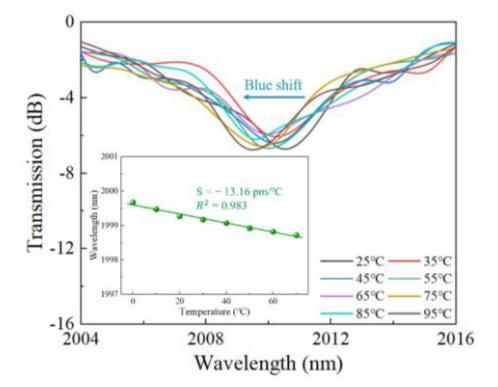
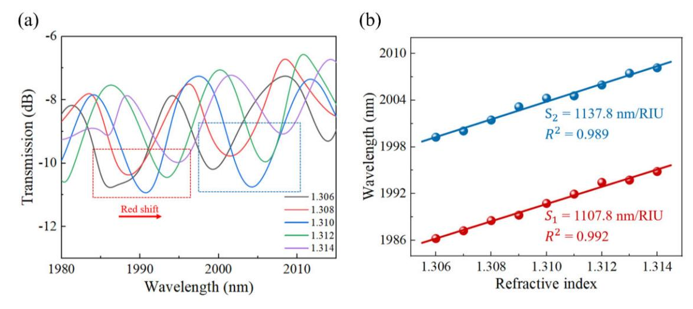
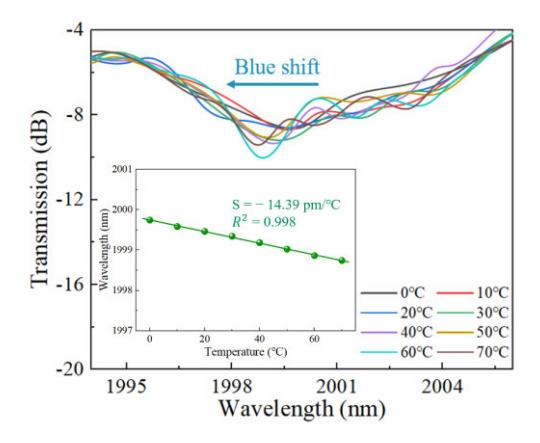

{0}------------------------------------------------

# Low Crosstalk Deep Ocean Salinity Monitoring at 2 µm Wavelength Band

Yahao Li, Quandong Huan[g](https://orcid.org/0000-0002-6177-5550) , *Senior [Me](https://orcid.org/0000-0003-3857-0511)mber, IEEE*, Chaoyue Wang, Yu Hu[ang](https://orcid.org/0000-0002-3445-5455), Wanyu Wu, Jiaqi Ran, Yanping Li, Jun Xue, Sławomir Ertman , [C](https://orcid.org/0000-0002-0144-2260)henxu Lu, Ou Xu [,](https://orcid.org/0000-0001-5491-624X) Xi[nyo](https://orcid.org/0000-0003-1391-4736)ng Dong , *Senior Member, IEEE*, Tomasz R. Wolinski ´ , and Perry Ping Shum , *Fellow, IEEE*

*Abstract***—Accurate ocean salinity detection and monitoring are crucial for protecting the ocean's ecological environment, with low crosstalk sensing heads playing a significant role in this process. To achieve low crosstalk while maintaining high sensor sensitivity, devices operating in the longer wavelength band could be a viable candidate. In this article, we demonstrate an all-optical fiber marine salinity sensor designed for deep ocean environments, formed by adiabatic-tapered few-mode fiber (FMF) with a 40** µ**m waist diameter to balance sensitivity and mechanical stability, operating at the 2** µ**m wavelength band. In the experiment with a refractive index ranging from 1.306 (a salinity of** ∼**0‰) to 1.314 (a salinity of** ∼**50‰), the sensor shows a refractive index sensitivity of 1200.7 nm/RIU, which corresponds to a salinity sensitivity of 0.192 nm/‰. Additionally, the sensor shows low sensitivity to ambient temperature and pressure, and the performance impact caused by their variations at different ocean depths is negligible in practical applications. The proposed all-optical fiber sensor offers a reliable and**

**practical solution for marine salinity sensing across varying ocean depths. The fiber sensor can be further developed to enable the mixture of communication and sensing.**

*Index Terms***— Fiber-optic sensor, modal interference, salinity monitoring.**

Received 11 April 2025; revised 31 May 2025; accepted 11 June 2025. Date of publication 19 June 2025; date of current version 1 August 2025. This work was supported in part by the National Natural Science Foundation of China under Grant 62361136584 and in part by Chinese-Polish SHENG 3 under Grant 2023/48/Q/ST7/00242. The associate editor coordinating the review of this article and approving it for publication was Dr. Shawana Tabassum. *(Corresponding authors: Quandong Huang; Ou Xu; Xinyong Dong.)*

Yahao Li, Quandong Huang, Chaoyue Wang, Yu Huang, Wanyu Wu, Jiaqi Ran, Yanping Li, Jun Xue, Ou Xu, and Xinyong Dong are with the Institute of Advanced Photonics Technology, School of Information Engineering, Key Laboratory of Photonic Technology for Integrated Sensing and Communication, Ministry of Education of China, and Guangdong Provincial Key Laboratory of Information Photonics Technology, Guangdong University of Technology, Guangzhou 510006, China (e-mail: qdhuang@gdut.edu.cn; xuou@gdut.edu.cn; dongxy@ gdut.edu.cn).

Sławomir Ertman and Tomasz R. Wolinski are with the Department of ´ Optics and Photonics, Faculty of Physics, Warsaw University of Technology, 00-665 Warsaw, Poland (e-mail: slawomir.ertman@pw.edu.pl; tomasz.wolinski@pw.edu.pl).

Chenxu Lu is with Southern Marine Science and Engineering Guangdong Laboratory, Guangzhou, Guangdong 510000, China.

Perry Ping Shum is with the Department of Electronic and Electrical Engineering, Southern University of Science and Technology, Shenzhen, Guangdong 518055, China (e-mail: shum@ieee.org).

Digital Object Identifier 10.1109/JSEN.2025.3579715

#### I. INTRODUCTION

T HE ocean is a pivotal component of the ecosystem, intricately linked to human life. Amid global warming, the ocean regulates Earth's climate [\[1\], su](#page-8-0)stains ecological balance [\[2\], su](#page-8-1)pplies resources such as minerals and fishery, provides most of the global oxygen, and significantly influences global economic development [\[3\],](#page-8-2) [\[4\]. In](#page-8-3)-depth ocean exploration and enhancing ocean-understanding capabilities [\[5\]](#page-8-4) are important tasks. Salinity, a key parameter for seawater quality assessment [\[6\], is](#page-8-5) vital for the healthy growth of marine life and the functioning of industrial and agricultural sectors [\[7\],](#page-8-6) [\[8\]. A](#page-8-7)ccurate salinity detection enables further analysis of seawater movement patterns [\[9\], bi](#page-8-8)ological environmental conditions [\[10\], a](#page-8-9)nd climate change trends [\[11\].](#page-8-10) Monitoring seawater salinity provides a scientific basis for ocean conservation and the optimal utilization of marine resources. Currently, the electrical measurement approach is the dominant method for quantifying seawater salinity [\[12\].](#page-8-11) The principle of the electrical measurement approach involves determining salinity through the correlation between electrical conductivity and chloride-ion content in water. However, this 

{1}------------------------------------------------

method is highly susceptible to interference from other conductive ions [13]. Currently, the measurement precision can be improved by using conductivity-temperature-depth (CTD) systems; however, these CTD systems are bulky, complex in structure, and require the series connection of multiple units during sea trials, which significantly increases the overall cost [14], [15], [16]. Additionally, electronic sensors in seawater often face challenges such as electrode contamination and susceptibility to electromagnetic interference during the measurement procedure [17]. Conversely, optical fiber sensors provide advantages such as compact dimensions, electromagnetic interference resistance [18], and durability against corrosion [19], [20]. They are well suited for operation in complex environments such as the marine environment. Optical fiber sensing shows substantial potential for salinity monitoring and has garnered significant attention from numerous scholars [21], [22], [23], [24]. To date, a multitude of schemes based on fiber Bragg grating (FBG) [25], photonic crystal fiber (PCF) [26], polymer optical fiber [27], etc., have been extensively investigated and reported. Recently, an all-optical fiber salinity sensor based on SNS-FBG cascading was demonstrated, which exhibits a salinity sensitivity of 0.027 nm/‰ [12]. An  $\alpha$ -power RI profile circular core FBG sensor with a maximum sensitivity of 35 nm/RIU is also proposed (with a salinity sensitivity of 5.83 pm/‰ [28]. To enhance the device sensitivity, an underwater fiber-optic sensor leveraging surface plasmon resonance (SPR) and multimode interference (MMI) is reported to achieve a salinity sensitivity of 0.36 nm/‰ [29]. A probe-type multicore fiber sensor for seawater multiparameter measurement is also reported, where the sensor attains a salinity sensitivity of similar 0.36 nm/‰ [30]. A dual-hole single-mode fiber (SMF) with two segments of multimode fiber was fused to create an optical-fiber sensor via the double SPR effect, which yields a salinity sensitivity of 0.33 nm/‰ [31]. However, when the sensitivity of the fiber sensors is enhanced, the design and fabrication of such fiber sensors are increasingly challenging. Meanwhile, the intricate structures of the fiber sensors pose significant challenges for practical implementation in complex marine environments. Instead of designing complex structures to enhance the sensor sensitivity, an available way is to explore longer wavelength bands.

In recent years, the mid-infrared wavelength band, especially the 2  $\mu$ m wavelength band, has emerged as a key focus in research and industry areas because of the resonance with the fundamental frequency vibration, stronger spectral absorption intensity, and rich identification characteristics [32]. A wavelength band of 2  $\mu$ m exhibits strong fundamental vibration absorption characteristics of most molecules, showing significant absorption peaks for water, carbon dioxide, and other molecules [33], [34], [35], [36], [37], which allows the 2  $\mu$ m light source to process an excellent application prospect in the field of sensing. Two fiber-optic humidity sensor structures including a tapered fiber and a microfiber knot resonator are designed to operate near the water absorption peak at the 2  $\mu$ m wavelength band with 0.18 mW/% RH sensitivity achieved via direct power measurement, and for the optical spectra of

the fiber knot resonator under different relative humidity, the sensor shows the extinction ratio and wavelength shift sensitivity of 0.034 dB/% RH and 10 pm/% RH, respectively [38]. An agarose-coated macro-bend fiber sensor for measuring relative humidity and temperature at 2  $\mu$ m is also proposed to achieve a humidity sensitivity of 0.314 nm/%RH within a wavelength modulation range of 40%–95% [39]. For the temperature sensing at the 2  $\mu$ m wavelength band, a weakly coupled multicore fiber was reported to measure temperatures up to  $1000 \,^{\circ}$ C with a sensitivity of  $-36.8 \, \text{pm/}^{\circ}$ C [40]. For the long-distance signal transmission at 2  $\mu$ m wavelength band, the signal amplification, which will limit the effectiveness and accuracy of marine sensing, is an important issue and must be addressed first. Luckily, amplifiers at the 2  $\mu$ m wavelength band can achieve high gain, low noise broadband amplification [41], ensuring effective signal amplification during long-distance transmission.

To explore the merits of fiber sensing at the 2  $\mu$ m wavelength band, we develop a simple and compact all-optical fiber sensor to monitor the seawater salinity. In this article, we demonstrate the seawater salinity sensor by using adiabatic-tapered few-mode fiber (FMF) with a waist diameter of 40  $\mu$ m. We study the sensitivity of the sensor to the seawater, ambient temperature, and pressure. The study shows that the sensor has broad application prospects in ocean salinity monitoring at all depths.

#### II. PRINCIPLE AND DEVICE DESIGN

As a salinity sensor, the sensing head is designed for deployment at various ocean depths, as illustrated in Fig. 1. The setup includes a 793 nm laser diode, a thulium-doped fiber (TDF), a wavelength division multiplexer (WDM), a sensing head, and an optical spectrum analyzer (OSA). The inserted image shows a sensing head formed by splicing a short FMF segment, flanked by two adiabatic-tapered sections in the middle, between commercial SMFs. The diameter of the FMF core and cladding are  $R_{\rm core} = 40~\mu{\rm m}$  and  $R_{\rm cladding} = 125~\mu{\rm m}$ , with refractive index of the FMF core and cladding are  $n_{\rm core} = 1.4736$  and  $n_{\rm cladding} = 1.4571$ , respectively. These parameters allow the FMF to support the LP01 mode and the LP02 mode. The refractive index against the variation of salinity is also summarized in the inserted picture.

When the input LP01 mode is launched from the SMF to the FMF at the first splicing point, mode conversion between the LP01 mode and the LP02 mode occurs due to the mode field mismatch caused by changes in the refractive index and core diameter of the fiber. The mode field mismatch between the fibers results in the conversion of both LP01 mode and higher-order modes in the FMF. The conversion ratio of the intended mode is determined by the integral overlap with the light field of the LP01 mode in the SMF. Since the fiber has a symmetric structure, the light field integral of noncircularly symmetric modes will be zero, and thus, the coupling coefficient  $\eta_{mn}$  ( $m \neq 0$ ) is also zero. However, when m = 0, the coupling coefficient cannot be neglected, the coupling coefficient between the circularly symmetric LP0n

{2}------------------------------------------------

Fig. 1. Diagram of the setup for the ocean salinity sensing, where the inserted pictures are the detailed design of the sensing head based on the adiabatic-tapered FMF and the refractive index against the salinity.

mode and the LP01 mode can be expressed as

$$\eta_{0n} = \frac{\left(\int_0^{2\pi} \int_0^{\infty} \psi_s\left(r,\varphi\right) \psi_{0n}^*\left(r,\varphi\right) r \mathrm{d}r \mathrm{d}\varphi^2\right)}{\int_0^{2\pi} \int_0^{\infty} \left|\psi_s\left(r,\varphi\right)\right|^2 r \mathrm{d}r \mathrm{d}\varphi \int_0^{2\pi} \int_0^{\infty} \left|\psi_{\text{on}}\left(r,\varphi\right)\right|^2 r \mathrm{d}r \mathrm{d}\varphi}$$
(1)

where ψon and ψ*s* represent the LP0*n* mode field distribution of the FMF and the LP01 mode field distribution of the SMF, respectively. Because the propagation constants of each mode are different in an FMF, this will result in an accumulated phase difference with the modes propagating along the FMF. As a result, the modal interference occurs when the guided modes in the FMF are coupled back into the SMF at the second fusion point. At the 2 µm wavelength band, the FMF only supports the LP01, LP11*a*, LP11*b*, and LP02 modes. Since the LP11*a* and LP11*b* modes cannot be converted in this design, the guide modes in the FMF are only the LP01 mode and the LP02 mode. The modal interference can be simply expressed as

$$I = I_1 + I_2 + 2\sqrt{I_1 I_2} \cos \Delta \varphi \tag{2}$$

where *I*1 and *I*2 are the light intensities of the LP01 mode and the LP02 mode, 1ϕ = ((2π *L*1*n*eff)/λ) is the phase difference of the two modes, 1*n*eff is the effective refractive index difference between these two modes, *L* is the length of the sensing region, and λ is the wavelength of the input light. When 1ϕ = (2*r* +1) π and *r* is an integer, the resonant wavelength λ*r* can be represented by ((2*L*1*n*eff)/(2*r* + 1)). The free space spectrum (FSR) can be obtained as FSR = ((λ*r*λ*r*+1)/(1*n*eff*L*)), where the FSR is inversely proportional to the effective refractive index difference of the mode and the length of the sensing area. To optimize the sensor, adiabatic tapering is used to proportionally reduce the core and cladding diameters, suppressing unintended mode excitation and minimizing loss. The taper angle at the fiber radius of *a* during the tapering process should be less than the adiabatic cone angle (*a*), where the adiabatic cone angle can be obtained by

$$\Omega(a) = \frac{a(\beta_1(a) - \beta_2(a))}{2\pi}.$$
 (3)

Here, β1(*a*) and β2(*a*) are the propagation constants of the LP01 mode and the LP02 mode. The tapered structure gradually reduces the core diameter of the FMF, thereby decreasing the waveguide capability of the core. The optical field of the LP02 mode, initially confined by the core gradually leaks into the cladding to form a cladding mode. Under these conditions, the tapered fiber structure shows that the cladding of the FMF becomes the new "core layer," and the external environment becomes the new "cladding layer." In this mechanism, the change in the refractive index of the external environment will significantly affect the effective refractive index of the mode. When the salinity of seawater changes, the refractive index of the LP02 mode also changes accordingly, thereby causing a change in the propagation constant and finally resulting in the drift of the spectrum. The wavelength shift at the spectral interference dip is given by 1λ*r* = ((2*L*1*nc*)/(2*r* + 1)) = ((1*nc*)/(1*n*eff))·λ*r* , where 1*nc* is the difference generated by the change in the effective refractive index difference with the

{3}------------------------------------------------

Fig. 2. (a) Dispersion curve of the  $LP_{01}$  mode and the  $LP_{02}$  mode in the FMF against tapering ratio. (b) Effective refractive index difference between the  $LP_{01}$  and the  $LP_{02}$  modes at different external refractive index near 2  $\mu$ m wavelength, the inset picture shows the variation in effective refractive index difference for external refractive index change ranging from 1.307 to 1.314 with a base refractive index of 1.306.

change in the seawater refractive index  $\Delta RI$ . The sensitivity of the sensor can be expressed as

$$\kappa_{\rm RI} = \frac{\Delta \lambda_{\rm dip}}{\Delta RI} = \frac{\Delta n_c}{\Delta n_{\rm eff}} \cdot \frac{\lambda_{\rm dip}}{\Delta RI}.$$
 (4)

In the sensing head, the effective refractive index of the  $LP_{01}$  and  $LP_{02}$  modes are analyzed at 2  $\mu$ m wavelength band under different taper ratios by using the finite element method, where the taper ratio is defined as the ratio of the tapered fiber diameter to the original diameter. As shown in Fig. 2(a), the effective refractive index of the LP01 mode and the LP02 mode decreases when the tapering ratio increases. Since the mode field distribution of the LP01 mode is compact with the electromagnetic field concentrated primarily in the core, the adiabatic taper in FMF has little impact on the confinement ability of the core, allowing only a small proportion of energy to leak into the cladding. In contrast, the effective refractive index of the LP02 mode decreases rapidly when the taper ratio drops below 0.8. The mode field distribution of the LP02 mode shows that the energy of higher-order modes gradually escapes from the core and leaks into the cladding. This leaked energy forms a strong evanescent field at the cladding-external interface, making it highly sensitive to external environmental changes, such as variations in the refractive index.

From (4) reveals that the sensitivity of the fiber sensor depends on the effective index difference between the LP01 mode and the LP02 mode. When the refractive index of external seawater ranges from 1.306 to 1.314, the effective index difference between the LP01 mode and the LP02 mode increases largely near the 2  $\mu$ m wavelength band. In the meanwhile, the refractive index difference increases in the longer wavelength as well. We set the basic refractive index of 1.306 as the benchmark, the change in the effective refractive index difference is demonstrated straightforward in Fig. 2(b) when the refractive index of external seawater increases from 1.307 to 1.314 with a step of 0.001, where the change of the refractive index is labeled as  $\Delta n_{ci}$  (i = 1, 2, ..., 8). At 2  $\mu$ m wavelength,  $\Delta n_{ci}$  gradually increases (blue arrow

mark) as the refractive index of the outside seawater gradually increases. The resonant dip will undergo a regular redshift, which shows that the sensor can achieve sensitive detection of the refractive index through wavelength demodulation. Moreover,  $\Delta n_{ci}$  shows an increasing trend (red arrow mark) when the wavelength increases. From (4), we can see that the sensitivity of the sensor increases as the wavelength increases. This result shows that compared with the traditional 1550 nm band, the ocean sensor designed in the 2  $\mu$ m wavelength band has significant advantages in sensitivity and detection effect.

The influence of FMF waist diameter on sensor performance is studied. When the waist diameter of the FMF is too large, the modes cannot escape from the core confinement. Conversely, when the waist diameter is too small, the light energy will be leaky over a very short transmission length. Additionally, a small waist diameter can significantly reduce the mechanical strength of the sensor, especially during practical use. To ensure the robustness of the fiber sensor, the waist diameters of the FMF are designed to be 50 and 40  $\mu$ m. The beam propagation method is applied to study the performance of the fiber sensor. By parametrically scanning the wavelength parametrically, the interference spectra against the ambient refractive index near the 2  $\mu$ m wavelength band, which are summarized in Fig. 3. To optimize the fiber sensor performance, we design an FMF length of about 10 cm to obtain an FSR of about 25 nm. When the waist diameter of the FMF is set at 50  $\mu$ m, as shown in Fig. 3(a), the sensitivity of the resonant dip at 1993 nm is about 675 nm/RIU (a salinity sensitivity of 0.108 nm/%) and the sensitivity of the resonant dip at 2014 nm is 688.3 nm/RIU (a salinity sensitivity of 0.11 nm/%). When the waist diameter of the FMF is set at 40  $\mu$ m, as shown in Fig. 3(b), the sensitivity of the resonant dip at 1975 nm increases to 1216.7 nm/RIU (a salinity sensitivity of 0.195 nm/‰), and the sensitivity of the resonant dip at 2000 nm is 1256.7 nm/RIU (a salinity sensitivity of 0.201 nm/‰). By slightly adjusting the FMF waist diameter from 50 to 40  $\mu$ m, the value of the sensitivity

{4}------------------------------------------------

Fig. 3. Refractive index sensitivity of fiber sensors with different FMF waist diameters (a) 50 µm and (b) 40 µm.

Fig. 4. (a) Diagram of the ocean environment and the relationships between depth, pressure, and temperature. Sensitivity of the fiber sensor against (b) ambient pressure in the ocean and (c) ambient temperature.

nearly doubles, which indicate the trend to optimize the fiber sensor design while maintaining the mechanical robustness.

Since the fiber sensor is applied in the ocean for seawater salinity monitoring, the fiber sensor will be affected by the ambient pressure and temperature. As the ocean depth increases as shown in Fig. [4\(a\),](#page-4-1) variations in ocean pressure and ambient temperature will affect the sensor, which is called crosstalk. Ocean pressure primarily induces elastic deformation of the fiber geometric structure, which leads to the cross-sectional dimensions of the fiber core and cladding compressing or expanding. The deformation caused by pressure that affects the optical performance is called the photoelastic

{5}------------------------------------------------

Fig. 5. (a) and (b) Laser welding system. (c) Diagram of the design size and actual size of the fiber cone region.

effect of the fiber, which will change the refractive index of the fiber. These changes combine to affect the effective refractive index of the fiber mode and cause interference spectrum drift. In the ocean, there is a linear change between the ambient pressure and the ocean depth of the sensor placed. Specifically, every 100 m increase in ocean depth raises ambient pressure by about 1 MPa, which is shown in the inserted picture of Fig. 4(a). The impact of pressure on the performance of the fiber sensor is calculated and summarized in Fig. 4(b). The sensitivity of the resonant dip at 1993 nm is about -25 pm/MPa and the sensitivity of the resonant dip at 2017 nm is -30 pm/MPa. When the ambient pressure is set at 41 MPa (with an ocean depth of ~4100 m), the cumulative wavelength drifts are only 1 and 1.2 nm, respectively. The crosstalk of the ambient pressure to the seawater salinity is only 0.2055\\(\infty\) (Mpa and 0.2459\\(\infty\) (Mpa, which can be negligible. These results demonstrate the sensor works stably and suits ocean salinity measurement at different depths. Besides pressure, ambient temperature variations also introduce the crosstalk of the sensor. As ocean ambient temperature increases, the thermo-optic effect alters the refractive index of the fiber material, which in turn affects the effective index of the mode and leads to spectrum drift. In practice, ambient temperature varies with depth, location, and season. Evaluating temperature-induced crosstalk is essential for ensuring sensor reliability. As shown in Fig. 4(c), the sensitivity of the resonant dip at 1992 nm is about -13.1 pm/°C and the sensitivity of the resonant dip at 2010 nm is -13.63 pm/°C. The crosstalk of the ambient temperature to the seawater salinity is only 0.1077\%00/°C and 0.1085\%00/°C, which can be negligible as well. These results show that the designed fiber sensor shows minimal sensitivity to pressure and temperature variations. This characteristic ensures stability in marine environments and underscores its potential for broader applications.

#### III. RESULTS AND DISCUSSION

Using the laser fusion splicing system (Fujikura LZM-100), as shown in Fig. 5(a) and (b), the adiabatic-tapered segments

in the FMF are formed. Several steps are required to fabricate such an adiabatic taper. First, strip away the coating layer of the FMF to expose the fiber cladding. Next, the fiber surface is cleaned with alcohol to remove dust, stains, or impurities to prevent uneven laser heating during tapering. Later, the FMF is fixed in the fixture of the LZM-100 laser fusion splicing system. Subsequently, parameters such as the fiber waist diameter, waist region length, transition region length, laser power, and heating time are set. Finally, the laser heats the fiber to soften and stretch it into a tapered shape. To ensure accurate tapering, laser power must be strictly controlled, as high temperatures can damage the fiber, while low temperatures lead to insufficient tapering. Additionally, the stretching rate requires precise adjustment to avoid over-stretching or uneven stretching-induced morphological defects. After the tapering process, the built-in measurement system of the LZM-100 is employed to measure the dimensions of the tapered region. As shown in Fig. 5(c), the taper geometry is measured to ensure consistency with the design specifications. We also measure the tapered fiber with SEM (TM3030) to ensure the precise fabrication of the sensing head. The results demonstrate that the fabricated tapered FMF waist exhibits a manufacturing tolerance of less than  $\pm 1.25 \mu m$ . Finally, a fiber fusion splicer (Fujikura 88S) is used to connect two SMFs to the ends of the adiabatic-tapered FMF. By carefully performing laser tapering and splicing, processing errors are minimized to ensure the stability of the sensor in oceanic environments.

To verify the response characteristics of the fiber sensor to the refractive index of the seawater (i.e., changes in seawater salinity), we build up the testing system with a broadband light source near the 2  $\mu$ m wavelength band. A 5-m-long TDF, with a core diameter of 10  $\mu$ m and a cladding diameter of 130  $\mu$ m, serves as the gain medium in the system; then the TDF is pumped by a 793 nm laser diode, which generates amplified spontaneous emission (ASE) light around 2  $\mu$ m. Subsequently, the ASE light is further purified by using a 793/2000 nm WDM to filter out the unintended pump light. In the experiment, different salinity of the seawater (the salinity is known) was prepared for the measurement, where the refractive index of the seawater was selected ranging from 1.307 to 1.314 with a step of 0.001. The prepared seawater was verified using a fully automated refractometer (SGW-731) to ensure precise control of the refractive index during the experiment. To minimize experimental errors, the sensing head was rinsed with deionized water at least three times when the seawater was replaced. During the measurement process, the sensing head is fully immersed in the seawater, the spectra were recorded by using an OSA, (Yokogawa, AQ6376) when the measurement was stable. Two adiabatic-tapered FMF with waist diameters of 50 and 40  $\mu$ m against the ambient refractive index were studied in the experiment. The experimental results are summarized in Fig. 6, where the resonant dips exhibited a redshift as the ambient refractive index increased, which is shown in Fig. 6(a) and (c), respectively. When the FMF with a waist diameter of 50  $\mu$ m, as shown in Fig. 6(b), the sensitivity of the resonant dip at 1983 nm is about 466.9 nm/RIU (a salinity sensitivity of 0.075 nm/‰) and the sensitivity of the

{6}------------------------------------------------

Fig. 6. Experimental results of refractive index sensitivity (seawater salinity) with different waist diameters. (a) Transmission spectra shift and (b) linear fitting curve at waist diameters of 50 µm. (c) Transmission spectra shift. (d) Linear fitting curve at waist diameters of 40 µm.

resonant dip at 1993 nm is 651.3 nm/RIU (a salinity sensitivity of 0.104 nm/‰). When the waist diameter of the FMF is set to 40 µm, as shown in Fig. [6\(d\),](#page-6-0) the sensitivity of the resonant dip at 1995 nm increases to 1190.6 nm/RIU (a salinity sensitivity of 0.191 nm/‰), and the sensitivity of the resonant dip at 2005 nm is 1200.7 nm/RIU (a salinity sensitivity of 0.192 nm/‰).

The experimental results show that sensing head in FMF with smaller waist diameters exhibit higher sensitivity to the changes in the external refractive index. This is because a greater portion of the light field extends into the cladding region when the fiber diameter decreases. Thereby, the sensing head enhances the interaction with the external seawater. To further verify that no additional guided modes were involved, the output spectrum of the fiber sensor with a 40 µm waist diameter in FMF is subjected to fast Fourier transform (FFT), which is shown in the inset picture of Fig. [6\(c\).](#page-6-0) The FFT results corroborated the simulation findings, confirming that the interference is primarily generated by the LP01 and LP02 modes. When the waist diameter is further decreased, more proportion of 2 µm light will leak into the cladding or even into the surrounding air, and as a result, enhance the

Fig. 7. Experimental results of sensitivity against the variations of ambient temperature.

sensitivity. However, an excessively thin waist diameter may also lead to the risk of optical fiber breakage due to the reduced mechanical strength of the fiber in practical applications. A waist diameter of 40 µm is selected as the optimal parameter in this experiment to strike a balance between sensitivity and fiber mechanical intensity.

{7}------------------------------------------------

Fig. 8. Experimental results of refractive index sensitivity (seawater salinity) with 40  $\mu$ m waist diameters (after two months), (a) transmission spectra shift and (b) linear fitting curve.

Fig. 9. Experimental results of stability sensitivity to ambient temperature change.

In the experiment, the effect of temperature on the sensing head is studied. The sensing head with a waist diameter of 40  $\mu$ m was placed in a temperature-controllable setup to simulate the temperature variations in the ocean. When the temperature increases, the interference dip exhibits a blue shift, which is consistent with the simulation results. As shown in Fig. 7, when the ambient temperature changes from 0 °C to 70 °C with a step size of 10 °C, the output interference spectrum data are recorded, where the maximum wavelength drift observed was 0.9504 nm with the temperature sensitivity of the sensor being -13.16 pm/°C. The corresponding change in refractive index sensitivity per degree Celsius is measured to be 0.1096\%00/°C, which shows that the impact of temperature variations on the performance of the sensor is minimal and can be considered negligible. Although we have a limited measure condition to measure the sensitivity against the ambient pressure changing, we believe that the sensor head will show low sensitivity to the variation of ambient pressure according to the theoretic study together with the supporting theoretic and experimental study of temperature sensitivity.

TABLE I
COMPARISON THE PERFORMANCES OF SALINITY SENSORS
WITH DIFFERENT STRUCTURES

| Structure                                    | Salinity sensitivity(nm/‰) | Salinity range | Reference |
|----------------------------------------------|----------------------------|----------------|-----------|
| Fiber bragg grating                          | 0.024                      | 0-60 ‰         | [42]      |
| Fabry–Pérot cavity                        | 0.168                      | 0.41-26.29 ‰   | [43]      |
| Etched fiber bragg grating                   | 0.0009039                  | 0-40 ‰         | [44]      |
| U-shaped FMF                              | 0.1847                     | 0-10 %         | [45]      |
| 2 μm wavelength band tapered FMF | 0.192                      | 0-50 ‰         | This work |

Since the sensor we designed is intended for ocean salinity monitoring, long-term stability is of paramount importance. After a two-month interval, we repeated the salinity sensing experiment using the aforementioned sensor sample with a waist diameter of 40  $\mu$ m, and the results are shown in Fig. 8. The sensitivity of the resonant dip at 1990 nm is 1107.8 nm/RIU (a salinity sensitivity of 0.172 nm/‰), and the sensitivity of the resonant dip at 2000 nm is 1137.8 nm/RIU (a salinity sensitivity of 0.178 nm/‰). In addition, we carried out experiments to evaluate the long-term stability of the sensor's temperature characteristics. As shown in Fig. 9, the maximum wavelength drift is 1.0005 nm, and the temperature sensitivity of the sensor is -14.39 pm/°C. The corresponding change in refractive index sensitivity per degree Celsius is measured to be 0.126%%°C. The experimental results

{8}------------------------------------------------

demonstrate that our sensor continues to exhibit excellent salinity sensing performance and extremely low-temperature crosstalk even after a two-month interval. This lays a solid foundation for the long-term application of our sensor in ocean salinity monitoring. To package the sensor, a mechanical packaging scheme features a titanium alloy frame combined with a polyether ether ketone (PEEK) flow channel body that could be used for offering both corrosion resistance and low thermal expansion.

Finally, a performance comparison between our sensor and previously reported salinity sensors is presented in Table [I.](#page-7-2) The results demonstrate that our sensor exhibits superior performance in both measurement sensitivity and detection range.

#### IV. CONCLUSION

In this article, an all-optical fiber seawater salinity sensor formed by splicing a segment of adiabatic-tapered FMF and two SMF is demonstrated. The experimental results show that the fiber seawater salinity sensor exhibits a refractive index sensitivity of 1200.7 nm/RIU, which corresponds to a salinity sensitivity of 0.192 nm/‰. The proposed sensor exhibits low crosstalk from ambient pressure and temperature variations in salinity measurements. This sensor shows the advantages of simple manufacturing, low cost, and high stability, which will have broad application prospects in ocean salinity monitoring at various depths. The fiber sensor operates at the 2 µm wavelength band and could be further developed to mix communication (at the C-band) and sensing (at the 2 µm wavelength band) in the same fiber cable due to modal interference primarily occurring at the 2 µm wavelength band. The proposed method could be further applied in the communication network and further developed in artificial intelligent systems for AI sensing proposals.

## ACKNOWLEDGMENT

The authors would like to thank Analysis and Test Center of Guangdong University of Technology for the device measurement.

### DATA AVAILABILITY

Data will be made available on request.

## REFERENCES

- [\[1\] E](#page-0-0). Johansen, "The role of the oceans in regulating the Earth's climate: Legal perspectives," in *The Law of the Sea and Climate Change: Solutions and Constraints*, E. Johansen, S. V. Busch, and I. U. Jakobsen, Eds., Cambridge, U.K.: Cambridge Univ. Press, 2020, pp. 1–21.
- [\[2\] Y](#page-0-1). Chen et al., "Temperature and salinity sensing characteristics of embedded core optical fiber based on surface plasmon resonance," *Heliyon*, vol. 9, no. 11, Nov. 2023, Art. no. e21049.
- [\[3\] Y](#page-0-2). Guo et al., "Submarine optical fiber communication provides an unrealized deep-sea observation network," *Sci. Rep.*, vol. 13, no. 1, Sep. 2023, Art. no. 15412.
- [\[4\] J](#page-0-3). Wu, B. Li, and L. Zhang, "Spatio-temporal differences of marine economy resilience in China," *Regional Stud. Mar. Sci.*, vol. 81, Jan. 2025, Art. no. 103983.
- [\[5\] C](#page-0-4). Li, Y. Zhao, Z. Li, R. Tong, M. Chen, and L. Cai, "Femtosecond laser etching C-type fiber optic Vernier sensor for seawater temperature and salinity measurements," *Sens. Actuators B, Chem.*, vol. 416, Oct. 2024, Art. no. 135983.

- [\[6\] Y](#page-0-5). Shi, X. Li, P. Wang, Y. Zhang, B. Shi, and Y. Li, "A review: Salinity and temperature measurement based on optical fiber sensors," *Sens. Actuators A, Phys.*, vol. 380, Dec. 2024, Art. no. 116040.
- [\[7\] N](#page-0-6). P. Majozi, M. S. Salama, S. Bernard, D. M. Harper, and M. G. Habte, "Remote sensing of euphotic depth in shallow tropical inland waters of lake naivasha using MERIS data," *Remote Sens. Environ.*, vol. 148, pp. 178–189, May 2014.
- [\[8\] E](#page-0-7). Ityel, A. Ben-Gal, M. Silberbush, and N. Lazarovitch, "Increased root zone oxygen by a capillary barrier is beneficial to bell pepper irrigated with brackish water in an arid region," *Agricult. Water Manage.*, vol. 131, pp. 108–114, Jan. 2014.
- [\[9\] L](#page-0-8). Gu, X. He, M. Zhang, and H. Lu, "Advances in the technologies for marine salinity measurement," *J. Mar. Sci. Eng.*, vol. 10, no. 12, p. 2024, Dec. 2022.
- [\[10\]](#page-0-9) F. Yang, S. Sukhishvili, H. Du, and F. Tian, "Marine salinity sensing using long-period fiber gratings enabled by stimuli-responsive polyelectrolyte multilayers," *Sens. Actuators B, Chem.*, vol. 253, pp. 74–84, Dec. 2017.
- [\[11\]](#page-0-10) A. Aretxabaleta, K. Smith, and T. Kalra, "Regime changes in global sea surface salinity trend," *J. Mar. Sci. Eng.*, vol. 5, no. 4, p. 57, Nov. 2017.
- [\[12\]](#page-0-11) G. Fu et al., "Study on the sensing characteristics of salinitytemperature-depth based on SNS-FBG cascade," *Opt. Commun.*, vol. 552, Feb. 2024, Art. no. 130092.
- [\[13\]](#page-1-0) R. A. Cox, F. Culkin, and J. P. Riley, "The electrical conductivity/chlorinity relationship in natural sea water," *Deep Sea Res. Oceanograph. Abstr.*, vol. 14, no. 2, pp. 203–220, Apr. 1967.
- [\[14\]](#page-1-1) X. Li, S. C. Warren-Smith, L. Xie, H. Ebendorff-Heidepriem, and L. V. Nguyen, "Temperature-compensated refractive index measurement using a dual Fabry–Perot interferometer based on C-fiber cavity," *IEEE Sensors J.*, vol. 20, no. 12, pp. 6408–6413, Jun. 2020.
- [\[15\]](#page-1-2) S. Liu et al., "Underwater temperature and salinity fiber sensor based on semi-open cavity structure of asymmetric MZI," *IEEE Sensors J.*, vol. 23, no. 16, pp. 18219–18233, Aug. 2023.
- [\[16\]](#page-1-3) Y. Liao, J. Wang, H. Yang, X. Wang, and S. Wang, "Salinity sensing based on microfiber knot resonator," *Sens. Actuators A, Phys.*, vol. 233, pp. 22–25, Sep. 2015.
- [\[17\]](#page-1-4) M. Kim, W. Choi, H. Lim, and S. Yang, "Integrated microfluidic-based sensor module for real-time measurement of temperature, conductivity, and salinity to monitor reverse osmosis," *Desalination*, vol. 317, pp. 166–174, May 2013.
- [\[18\]](#page-1-5) Y.-J. Rao, "In-fibre Bragg grating sensors," *Meas. Sci. Technol.*, vol. 8, no. 4, pp. 355–375, 1997.
- [\[19\]](#page-1-6) B. Culshaw, "Optical fiber sensor technologies: Opportunities andperhaps-pitfalls," *J. Lightw. Technol.*, vol. 22, no. 1, pp. 39–50, Jan. 15, 2004.
- [\[20\]](#page-1-7) W. Liu et al., "Specialty optical fibers and 2D materials for sensitivity enhancement of fiber optic SPR sensors: A review," *Opt. Laser Technol.*, vol. 152, Aug. 2022, Art. no. 108167.
- [\[21\]](#page-1-8) D. J. Gentleman and K. S. Booksh, "Determining salinity using a multimode fiber optic surface plasmon resonance dip-probe," *Talanta*, vol. 68, no. 3, pp. 504–515, Jan. 2006.
- [\[22\]](#page-1-9) R. Min, Z. Liu, L. Pereira, C. Yang, Q. Sui, and C. Marques, "Optical fiber sensing for marine environment and marine structural health monitoring: A review," *Opt. Laser Technol.*, vol. 140, Aug. 2021, Art. no. 107082.
- [\[23\]](#page-1-10) Y. Zhao, Y. Liao, B. Zhang, and S. Lai, "Monitoring technology of salinity in water with optical fiber sensor," *J. Lightw. Technol.*, vol. 21, no. 5, pp. 1334–1338, May 15, 2003.
- [\[24\]](#page-1-11) F. Zhuang et al., "Review on in-situ marine monitoring using physical and chemical optical fiber sensors," *Photonic Sensors*, vol. 15, no. 2, Jun. 2025, Art. no. 250230.
- [\[25\]](#page-1-12) Q. Chen, P. Lu, and L. Men, "Simultaneous temperature and salinity monitoring with a fiber optic sensor," *Proc. SPIE*, vol. 6756, Sep. 2007, Art. no. 675606.
- [\[26\]](#page-1-13) C. Wu, H. Y. Fu, H. Y. Au, B. Guan, and H. Tam, "High-sensitivity salinity sensor realized with photonic crystal fiber Sagnac interferometer," *Proc. SPI*, vol. 7753, Mar. 2011, Art. no. 77531B.
- [\[27\]](#page-1-14) H. Wang, L. Chen, and X. Bao, "Salinity concentration sensing based on a tapered dual-core As2Se3-PMMA hybrid fiber," *IEEE Photon. Technol. Lett.*, vol. 33, no. 4, pp. 181–184, Feb. 15, 2021, doi: [10.1109/LPT.2021.3051009.](http://dx.doi.org/10.1109/LPT.2021.3051009)
- [\[28\]](#page-1-15) S. K. Raghuwanshi, Y. Singh, P. S. Pandey, and R. Kumar, "Sensitivity analysis of HF etched uniformly thinned α-power refractive index profile fiber Bragg grating sensor," *IEEE Trans. Instrum. Meas.*, vol. 70, pp. 1–9, 2021.

{9}------------------------------------------------

- [\[29\]](#page-1-16) M. S. Yang, Y. L. Zhu, and R. An, "Underwater fiber-optic salinity and pressure sensor based on surface plasmon resonance and multimode interference," *Appl. Opt.*, vol. 60, no. 30, pp. 9352–9357, Oct. 2021.
- [\[30\]](#page-1-17) C. Feng et al., "Probe-type multi-core fiber optic sensor for simultaneous measurement of seawater salinity, pressure, and temperature," *Sensors*, vol. 24, no. 6, p. 1766, Mar. 2024.
- [\[31\]](#page-1-18) R.-J. Tong, K.-J. Zhao, B. Xing, H.-N. Zheng, and S.-C. Wu, "An optical fiber sensor for salinity and temperature simultaneous detection based on dual SPR effect," *Opt. Laser Technol.*, vol. 175, Aug. 2024, Art. no. 110760.
- [\[32\]](#page-1-19) J. Zhang, Q. Huang, F. Li, X. Dong, and O. Xu, "All-fiber 2 µm highorder-mode light-source based on reconfigurable mode conversion," *Opt. Laser Technol.*, vol. 181, Feb. 2025, Art. no. 111961.
- [\[33\]](#page-1-20) Z. Wang, B. Zhang, J. Liu, Y. Song, and H. Zhang, "Recent developments in mid-infrared fiber lasers: Status and challenges," *Opt. Laser Technol.*, vol. 132, Dec. 2020, Art. no. 106497.
- [\[34\]](#page-1-21) S. D. Jackson, "Towards high-power mid-infrared emission from a fibre laser," *Nature Photon.*, vol. 6, no. 7, pp. 423–431, Jul. 2012.
- [\[35\]](#page-1-22) M. Tao, B. Tao, Z. Hu, G. Feng, X. Ye, and J. Zhao, "Development of a 2 µm Tm-doped fiber laser for hyperspectral absorption spectroscopy applications," *Opt. Exp.*, vol. 25, no. 26, pp. 32386–32394, Dec. 2017.
- [\[36\]](#page-1-23) R. Shankar and M. Loncar, "Silicon photonic devices for mid- ˇ infrared applications," *Nanophotonics*, vol. 3, nos. 4–5, pp. 329–341, Aug. 2014.
- [\[37\]](#page-1-24) A. Godard, "Infrared (2–12 µm) solid-state laser sources: A review," *Comp. Rendus. Phys.*, vol. 8, no. 10, pp. 1100–1128, Nov. 2007.

- [\[38\]](#page-1-25) K. Xu et al., "Optical fiber humidity sensor based on water absorption peak near 2-µm waveband," *IEEE Photon. J.*, vol. 11, no. 2, pp. 1–8, Apr. 2019.
- [\[39\]](#page-1-26) W. Chen, Z. Chen, Y. Zhang, H. Li, and Y. Lian, "Agarose coated macrobend fiber sensor for relative humidity and temperature measurement at 2 µm," *Opt. Fiber Technol.*, vol. 50, pp. 118–124, Jul. 2019.
- [\[40\]](#page-1-27) Y. Chunxia, D. Hui, D. Wei, and X. Chaowei, "Weakly-coupled multicore optical fiber taper-based high-temperature sensor," *Sens. Actuators A, Phys.*, vol. 280, pp. 139–144, Sep. 2018.
- [\[41\]](#page-1-28) A. M. Heidt, Z. Li, and D. J. Richardson, "High power diode-seeded fiber amplifiers at 2 µm—From architectures to applications," *IEEE J. Sel. Topics Quantum Electron.*, vol. 20, no. 5, pp. 525–536, Sep. 2014.
- [\[42\]](#page-0-12) D. Luo, J. Ma, Z. Ibrahim, and Z. Ismail, "Etched FBG coated with polyimide for simultaneous detection the salinity and temperature," *Opt. Commun.*, vol. 392, pp. 218–222, Jun. 2017.
- [\[43\]](#page-0-12) M. Tian, P. Lu, L. Chen, D. Liu, M. Yang, and J. Zhang, "Femtosecond laser fabricated in-line micro multicavity fiber FP interferometers sensor," *Opt. Commun.*, vol. 316, pp. 80–85, Apr. 2014.
- [\[44\]](#page-0-12) J. Guo, M. Sun, J. Fang, G. Wei, B. Shi, and H. Jiang, "Highsensitivity seawater salinity sensing with cladding etched fiber Bragg grating technology," *IEEE Sensors J.*, vol. 23, no. 13, pp. 14182–14192, Jul. 2023.
- [\[45\]](#page-0-12) W. Zhang, M. Wu, X. Wang, Z. Tong, M. Dong, and G. Yan, "Temperature insensitive salinity sensor with U-shaped structure based on few-mode fiber," *Opt. Fiber Technol.*, vol. 76, Mar. 2023, Art. no. 103218.