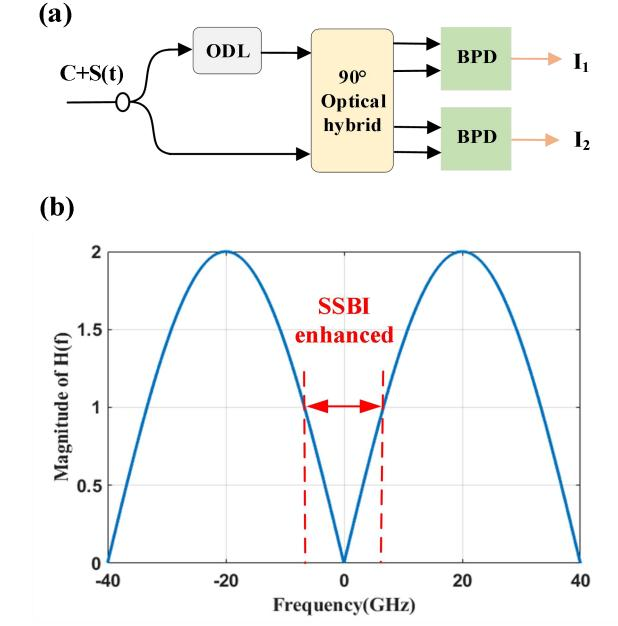
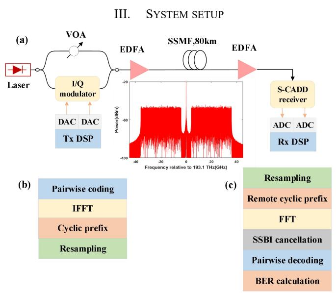
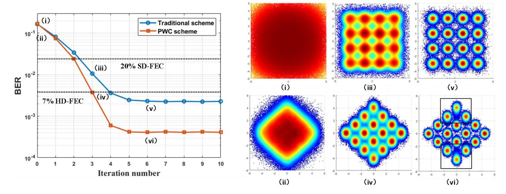
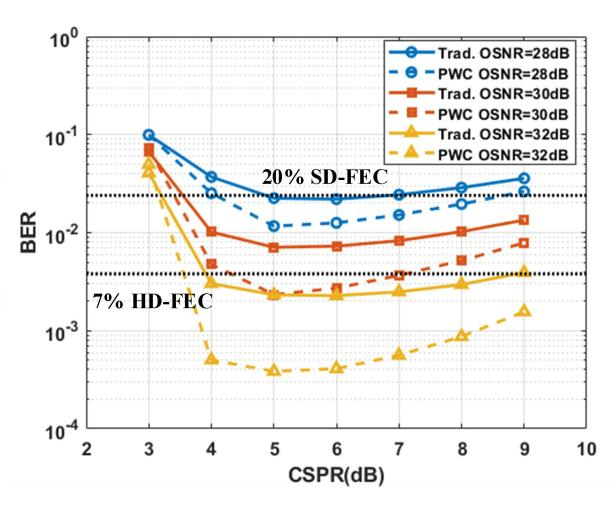
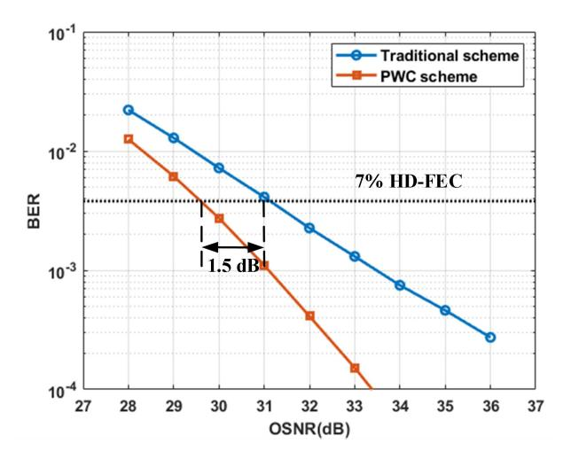

{0}------------------------------------------------

# Performance Improvement for Symmetric Carrierassisted Differential Detection Receiver by Pairwise Coding

Zihua Huang, Jianping Li\*, Xinkuo Yu, Jianqing He, Yuwen Qin, Meng Xiang, and Songnian Fu
Institute of Advanced Photonics Technology, School of Information Engineering
Key Laboratory of Photonic technology for Integrated Sensing and Communication, Ministry of Education
Guangdong Provincial Key Laboratory of Information Photonics Technology
Guangdong University of Technology
Guangzhou, China
\*jianping@gdut.edu.cn

Abstract-Driven by emerging applications originated from the Internet technologies, artificial intelligence (AI), big data and so on, high-speed short-reach optical transmission solutions have attracted more and more attentions such as data center interconnection (DCI). Although the developed intensity modulation direct detection (IMDD) technology has been widely used in DCI, it is necessary to adopt the new transmission system with higher data rate and larger capacity with facing the rapid growth of traffic in the future. Recently, a self-coherent detection technique has been proposed, which can overcome the frequency selective fading caused by fiber dispersion. But most of the techniques are limited to single sideband (SSB) modulated signals. Recently, symmetric carrier-assisted differential detection (S-CADD) has been proposed to realize complex-valued double sideband (DSB) signal transmission, but the intrinsic imperfect transfer function leads to a color signal-to-noise ratio (SNR) effect, which makes the performance of different subcarriers differ, and then results in the overall system performance degradation. In order to alleviate this phenomenon, we propose and numerically verify the S-CADD receiver detection method based on pairwise coding (PWC) to improve the SNR imbalance among different subcarriers. After numerical verification of 64 Gbaud 16-ary quadrature amplitude modulation (16-QAM) orthogonal frequency division multiplexing (OFDM) signal transmission over 80km standard single mode fiber (SSMF), the BER performance of S-CADD receiver under optimal carrier-tosignal-power-ration (CSPR) can be greatly improved. Moreover, an optical signal-to-noise ratio (OSNR) gain of 1.5dB can be achieved under the 7% hard-decision forward-error-correction (HD-FEC) threshold, which will reduce the sensitivity requirement of the receiver and then the hardware cost. Thus, this PWC based method can find the potential in the high-speed large-capacity short-reach optical interconnections.

Keywords—symmetric carrier-assisted differential detection, pairwise coding, optical signal-to-noise ratio, carrier-to-signal-power-ration, optical communications, short-reach optical interconnect, datacenter

## I. INTRODUCTION

With the rapid development of current communication technologies, the emergence of Internet applications such as smart cities, autonomous driving, and mobile video streaming services will further promote traffic growth in short-range optical networks [1-4]. In order to meet the demand of this

rapid traffic growth, short-range optical communication systems have been desired to provide high-speed and largecapacity communication services for data centers, metropolitan area network and access network application scenarios. In these applications, a large number of transceivers between the server and the site will be adopted and then the cost will become the most concern. Therefore, short-range optical communication systems need to increase capacity without much costly. The current mainstream receivers consist of two types, coherent detection receiver and intensity modulation direct detection (IMDD) receiver. Coherent detection has the advantages of high spectral efficiency and sensitivity [5], while the need of expensive narrow linewidth local oscillator (LO) laser accounts for the vast majority of receiver costs [6]. In contrast, traditional IMDD does not require LO laser, which has the advantages of low cost and simple structure [7]. But, its inherent frequency-selective fading effect limits the transmission data rate and distance [8].

In recent years, a series of cost-effective self-coherent detection schemes have been proposed, which can overcome the frequency-selective fading caused by dispersion. By inserting the optical carrier into one side of a single sideband (SSB) signal, after the single-ended photodiode (PD) detection, the field information can be retrieved from the carrier-signal beating term, while the undesired signal-signal beat interference (SSBI) will have an significant influence on the system performance. Therefore, it is usually necessary to insert a frequency gap equivalent to the signal bandwidth between the optical carrier and the modulated signal [9] or adopt an interleaved frequency loading scheme [10]. But these schemes will decrease the spectral efficiency (SE). In order to improve spectral efficiency, SSBI iterative cancellation (IC) receivers [11, 12] and KK receivers [13, 14] have been proposed, which can respectively reduce the interference of SSBI through iterative cancellation algorithm and KK relationship. However, compared with coherent detection, the above schemes are limited to SSB modulation and cannot fully utilize the receiver bandwidth. Therefore, it is necessary to research the selfcoherent detection of signals with double sideband (DSB) modulation to improve SE and relax the bandwidth requirements of receiver.

{1}------------------------------------------------

Recently, a novel carrier-assisted differential detection (CADD) receiver has been proposed by Prof. William Shieh's group and experimentally verified widely [15, 16]. The optical field recovery of complex value DSB signal can be realized without the use of optical filters. Compared with SSB signal, this method has higher electrical spectral efficiency. Later, a more cost-effective symmetric carrier-assisted differential detection (S-CADD) has been proposed in [17], which can reduce one PD and one analog-to-digital convertor (ADC) with a comparison of traditional CADD configuration.

However, with the S-CADD receiver, the intrinsic transfer function leads to a color SNR effect [18], which makes the SNR of the edge subcarrier lower and then reduces the overall system performance. Therefore, with aiming to solve this problem, in this paper, we introduce the pairwise coding (PWC) technique, which can improve the receiver sensitivity of S-CADD in terms of OSNR [19-22]. And we simulate the transmission of 256 Gb/s 64 Gbaud 16-ary quadrature amplitude modulation(16-QAM) orthogonal frequency division multiplexing (OFDM) signal over 80km standard single mode fiber (SSMF). The results show that the BER performance of S-CADD receiver under optimal CSPR is greatly improved, and an OSNR gain of 1.5dB can be achieved under 7% HD-FEC threshold compared with the conventional method. This will reduce the hardware cost requirement for the receiver.

# II. PRINCIPLE

## A. Principle of S-CADD receiver

Fig. 1. (a) Structures of S-CADD receiver. (b) Magnitude of transfer function H(f) for S-CADD,  $\tau = 12.5$  ps.

Fig. 1(a) shows the general structure of S-CADD receiver, which consists of a 90° optical hybrid, an optical delay line (ODL), and two balanced photo-detectors (BPDs) [16]. We represent the received complex valued DSB signal as C + S(t) with C and S(t) for the carrier and modulated signal respectively. Correspondingly, the signal after ODL and PD detection, can be expressed as follows,

$$I_{1} = \operatorname{Re}\left\{ [C + S(t)][C + S^{*}(t - \tau)] \right\}$$

$$I_{2} = \operatorname{Im}\left\{ [C + S(t)][C + S^{*}(t - \tau)] \right\}$$
(1)

Where  $Re\{.\}$  and  $Im\{.\}$  represent real and imaginary part operations, respectively. \* represents the conjugation operation. Finally, the optical field can be restored by two photocurrents,

$$R = I_1 + jI_2 - [(I_1 + jI_2) \otimes T(t)]^*$$
  
=  $C^*[S(t) - S(t - \tau) \otimes T^*(t)] + SSBI$  (2)

$$SSBI = S(t)S^*(t-\tau) - [S^*(t)S(t-\tau)] \otimes T^*(t)$$
(3)

Where T(t) represents the time domain response of ODL,  $\otimes$  is convolution operation and SSBI is the second-order beat interference between the signals. If the SSBI can be accurately estimated and eliminated, the carrier-signal beat term that we desired can be obtained. Afterwards, this term can be used to recover the optical field of the signal in the frequency domain,

$$S(f) = \frac{1}{C^*} \frac{F[R - SSBI]}{H(f)} \tag{4}$$

$$H(f) = 1 - T(f)T^*(-f) = 1 - e^{j2\pi f \cdot 2\tau}$$
 (5)

Where F[.] represents the Fourier transform, H(f) represents the transfer function of S-CADD related to delay of  $\tau$ . The magnitude of H(f) changes with frequency is shown in Fig. 1(b). If the SSBI cannot be completely eliminated and is located in the range of |H(f)| < 1, the SSBI will be enhanced. Namely, the SNR of different frequency subcarriers of the S-CADD receiver will be different inherently.

Fig. 2. The diagram of (a) pairwise coding and (b) pairwise decoding.

## B. Principle of PWC schemes

In order to compensate for this SNR imbalance, the PWC scheme will be an effective scheme, as shown in Fig. 2(a). At

{2}------------------------------------------------

first, the signal is pairwise coding at the transmitting end. The data streams is evenly divided into two parts and 16QAM symbol mapped with  $a_n$ ,  $b_n$ , where n represent the n-th pair of symbols. And then, a constant phase shift  $\theta = 45^{\circ}$ , is applied to all symbols [23],

$$a_{\theta n} = a_n \cdot e^{j\theta}$$

$$b_{\theta n} = b_n \cdot e^{j\theta}$$
(6)

After the angle rotation, interlace the I/Q components of the two signals, a new pair of complex symbols then will be generated as follows,

$$c_n = Re(a_{\theta n}) + \mathbf{j} \cdot Re(b_{\theta n})$$

$$d_n = Im(a_{\theta n}) + \mathbf{j} \cdot Im(b_{\theta n})$$
(7)

Where  $Re\{.\}$  and  $Im\{.\}$  represent real and imaginary part operations, respectively. Then, the two complex signals are assigned to the "good" subcarrier and the "bad" subcarrier respectively. The basic principle of subcarrier allocation is that the two subcarriers are paired with the largest SNR difference as I-th pair of subcarriers, and then the two subcarriers with the second largest difference as 2-th pair of subcarriers and so on. This is implemented in the S-CADD receiver that the middle subcarrier is paired with the edge subcarrier one by one for each sub-band.

At the receiver, after OFDM demodulation and SSBI iteration cancelation, the pairwise decoding is carried out as shown in Fig. 2(b) to extract "good" subcarriers  $(c_n)$  and "bad" subcarriers  $(d_n)$  respectively. In order to balance the noise variance on different subcarriers, SNR estimation and rescaling are performed for each subcarrier respectively. Multiply each subcarrier signal with its corresponding subcarrier SNR. And then, the I/Q components of each pair of subcarriers are deinterleaved, as follows,

$$a'_{\theta n} = Re(c'_{n} \cdot \sqrt{SNR_{good_{n}}}) + j \cdot Re(d'_{n} \cdot \sqrt{SNR_{bad_{n}}})$$
  
$$b'_{\theta n} = Im(c'_{n} \cdot \sqrt{SNR_{good_{n}}}) + j \cdot Im(d'_{n} \cdot \sqrt{SNR_{bad_{n}}})$$
(8)

Where  $SNR_{good\_n}$  and  $SNR_{bad\_n}$  denote the *n-th* subcarrier for high SNR subcarrier and the *n-th* subcarrier for low SNR subcarrier, respectively. Finally, the maximum likelihood detection (MLD) is then applied for symbol decision, as follows,

$$\hat{a}_{n} = \arg\min_{X_{k}} \{ |a'_{\theta n} - s_{k}|^{2} \}$$

$$\hat{b}_{n} = \arg\min_{X_{k}} \{ |b'_{\theta n} - s_{k}|^{2} \}$$
(9)

$$s_k = Re(X_k \cdot e^{j\theta}) \sqrt{SNR_{good_n}} + j \cdot Im(X_k \cdot e^{j\theta}) \sqrt{SNR_{bad_n}}$$
 (10)

Where  $s_k$  are the rotated and rescaled constellation points,

and  $X_k$  are the standard constellation points. The basic idea of pairwise coding between subcarriers with SNR differences is that by interweaving and de-interweaving the I/Q components at the transmitter and receiver ends, the SNR difference between the two subcarriers is converted into the SNR imbalance between the real and virtual components of the two subcarriers. After rotation, the signal space diversity can be maximized, the robustness of constellation point decision making can be improved, and better system performance can be achieved.

Fig. 3. (a) Simulation configuration. (b) transmitter side DSP modules, and (c) receiver side DSP modules. Inset: optical spectrum of the generated 64GBaud 16QAM DSB signal. EDFA: Erbium-doped fiber amplifier. DAC: digital-to-analog convertor. ADC: analog-to-digital convertor. VOA: variable optical attenuator.

The simulation system configuration is shown in Fig. 3. At the transmitter, the OFDM signal is generated with a fast Fourier transform (FFT) size of 4096 and 2184 sub-carriers filled with 16 QAM symbols. The sampling rate is set to 120 GSa/s corresponding to 64 Gbaud 16QAM DSB signal with a raw rate of 256 Gb/s. The signal band is divided into two subbands, each occupying 32 GHz, and an 8 GHz frequency gap is inserted between the upper and lower side bands, which will be suitable for a S-CADD receiver with a delay of 12.5 ps. In the Tx DSP, the signal is encoded in pairs first, and then modulated by OFDM. The signal is pairwise coding before IFFT, a 256-point circular prefix (1/16 of one OFDM symbol) at the head of each OFDM symbol has been inserted to alleviate inter symbol interference (ISI) caused by chromatic dispersion (CD). The laser beam is divided into two separate channels. One channel is dedicated to modulating the signal, while the other channel serves as the optical carrier used to control the CSPR through a variable optical attenuator (VOA). After the modulation signal combined with the optical carrier, the overall optical power is adjusted to a level of 6 dBm using an erbium-doped fiber amplifier (EDFA). The generated optical signal is then transmitted over 80 km SSMF. The dispersion coefficient of 16 e-6 s/m^2 and the nonlinear coefficient of 2.6 e-20 m2/W of the standard single mode

{3}------------------------------------------------

Fig. 4. BER vs. iteration number with different scheme when OSNR = 32dB, CSPR = 5dB.

fiber (SSMF) has been used. Meanwhile, only the additive white Gaussian noise (AWGN) has been considered in the study. At the receiver end, after the BPD detection by the S-CADD receiver, the subsequent optical field recovery is processed by offline DSP, including resampling, FFT, channel equalization, SSBI cancellation, pairwise decoding and BER calculation.

# IV. RESULTS AND DISCUSSIONS

In the S-CADD receiver, the SSBI iterative cancellation process is important for the Rx DSP to restore the signal. As shown in Fig. 4, the BER performance vs. iteration number has been compared with the traditional scheme and the PWC scheme. It is evident that the speed of iteration convergence of the PWC-based scheme is faster the traditional one. The convergence reaches its optimum state after six iterations in both schemes. However, it is worth noting that the PWC scheme can achieve a lower BER. As can be seen from the constellation diagram on the right, the concentration of most constellation points of PWC scheme isbetter than that of the traditional scheme after 6 iterations.Meanwhile, the 6 constellation points located in the centralperiphery show the shape of thin ellipses, which result in the lower concentration than the traditional scheme. However, through Eq.(10), the PWC scheme can adaptively adjust the decision constellation according to the SNR performance ofthe nth pair of subcarrier where the signal is located, so that the signal on the nth pair of subcarriers can be decided to the correct constellation point.

As shown in Fig. 5, the BER vs.CSPR has been compared with the traditional scheme and PWC scheme under different OSNR with a fixed iteration number of 10. It can be found that the best CSPR of the two schemes is about 5dB, and in the case of the best CSPR, PWC scheme has the largest system performance improvement compared with the traditional scheme. This is because the PWC scheme provides a larger signal decision space and improves the tolerance for SSBI noise, so that the signal interfered by SSBI can still be decided to the correct constellation point after adaptive processing by PWC, improving the decision performance and achieving better system performance. The BER vs. OSNR with two

schemes has been also shown in Fig. 6. Compared with the traditional scheme, the PWC scheme can realize an OSNR gain of 1.5dB for the 7% HD-FEC limit underoptimal CSPR conditions.

Fig. 5. BER vs. CSPR with different scheme when OSNR = 28, 30, 32dB.

Fig. 6. BER versus OSNR with different scheme when CSPR = 5dB.

{4}------------------------------------------------

#### V. CONCLUSION

In the last decade, large-capacity short-to-medium range optical networks have been developed rapidly. Therefore, a cost-effective detection scheme with optical field recovery is on demand. The conventional IMDD systems have the disadvantage of CD induced power fading, while coherent detection is limited due to its high cost.

In this paper, the S-CADD receiver based on the PWC scheme is proposed. The DSP is optimized to improve the sensitivity of the receiver. Pairing subcarriers with different SNRS can effectively alleviate the color SNR effect caused by the intrinsic transfer function. This method can effectively improve the performance of low SNR subcarriers, and then the overall system performance. After numerical verification, we realize the 256Gb/s 64Gbaud 16QAM OFDM signal transmission over 80km SSMF. Under optimal CSPR, the OSNR gain of 1.5dB can be achieved at the 7% HD-FEC threshold compared with the conventional method, which will reduce the sensitivity requirement of the receiver and reduce the hardware cost requirement of the receiver.

## VI. FUTURE WORK

Considering the increase of data center applications in the future, the demand for low-cost high-capacity transmission links over short and medium distances will increase. To break the bottleneck of limited transmission range and complex structure of coherent detection receivers in traditional IMDD systems, novel cost-effective direct detection schemes with field recovery will become promising solutions in the near future. Considering that spectral efficiency is a valuable resource in the scenario of short-range transmission, the CADD receiver needs a guard band around the inserted carrier, which still has room for improvement in future research. And from the power consumption point of view, it is expected that more effective DSP technologies can be applied to reduce the demand for carrier power in the future.

## ACKNOWLEDGMENT

This work is partly supported by National Key R&D Program of China (2023YFB2906304), the National Natural Science Foundation of China (U22A2087, 62022029); the Guangdong Introducing Innovative and Enterpreneurial Teams of "The Pearl River Talent Recruitment Program" (2019ZT08X340); and Guangdong Guangxi Joint Science Key Foundation (2021GXNSFDA076001) and Guangdong Basic and Applied Basic Research Foundation (2023A1515010877).

#### REFERENCES

- F. Al-Turjman, E. Ever and H. Zahmatkesh, "Small cells in the forthcoming 5G/IoT: traffic modelling and deployment overview," IEEE Commun. Surv. Tutor. 21(1), 28-65 (2018).
- [2] C. Kachris, K. Kanonakis and I. Tomkos, "Optical interconnection networks in data centers: recent trends and future challenges," IEEE Commun. Mag. 51(9), 39-45 (2013).
- [3] J Li, Z Wang, H Ji, X Li, H Chen, RR Unnithan, W Shieh, Y Su, "Silicon photonic carrier-assisted differential detection receiver with

- high electrical spectral efficiency for short-reach interconnects" J. Lightwave Technol. 41(3), 919-925 (2023).
- [4] L He, Y Yuan, Y Cai, J Li, "Field recovery via simplified carrierassisted differential detection with interleaved subcarrier loading scheme at low CSPR condition" Opt. Lett. 48(15), 4169-4172 (2023).
- [5] K. Kikuchi, "Fundamentals of coherent optical fiber communications," J. Lightwave Technol. 34(1), 157-179 (2016).
- [6] T. Gui, X. Wang, M. Tang, Y. Yu, Y. Lu, and L. Li, "Real-time demonstration of 600 Gb/s DP-64QAM Self-Homodyne coherent bidirection transmission with un-cooled DFB laser," *Proc. Optical Fiber Communication Conference*, paper Th4C.3 (2020).
- [7] K. Zhong, X. Zhou, J. Huo, C. Yu, C. Lu and A. P. T. Lau, "Digital signal processing for short-reach optical communications: a review of current technologies and future trends," J. Lightwave Technol. 36(2), 377-400 (2018).
- [8] Q. Hu, D. Che, Y. Wang, and W. Shieh, "Advanced modulation formats for high-performance short-reach optical interconnects," Opt. Express 23(3), 3245-3259 (2015).
- [9] A. J. Lowery, Liang Du and J. Armstrong, "Orthogonal Frequency Division Multiplexing for Adaptive Dispersion Compensation in Long Haul WDM Systems," *Proc. Optical Fiber Communication Conference*, paper 1-3 (2006).
- [10] Wei-Ren Peng, Xiaoxia Wu, Kai-Ming Feng, Vahid R. Arbab, Bishara Shamee, Jeng-Yuan Yang, Louis C. Christen, Alan E. Willner, and Sien Chi, "Spectrally efficient direct-detected OFDM transmission employing an iterative estimation and cancellation technique," Opt. Express 17(11), 9099-9111 (2009).
- [11] C. Sun, D. Che, H. Ji, W. Shieh, "Investigation of single-and multicarrier modulation formats for Kramers-Kronig and SSBI iterative cancellation receivers," Opt. Lett. 44(7), 1785-1788 (2019).
- [12] S. T. Le, K. Schuh, M. Chagnon, F. Buchali, R. Dischler, V. Aref, H. Buelow, and K. M. Engenhardt, "1.72Tb/s virtual-carrier assisted direct-detection transmission over 200 km," J. Lightwave Technol. 36(6), 1347–1353 (2018).
- [13] A. Mecozzi, C. Antonelli, and M. Shtaif, "Kramers-kronig coherent receiver," Optica. 3(11), 1220–1227 (2016).
- [14] A. Mecozzi, C. Antonelli, and M. Shtaif, "Kramers-Kronig receivers," Adv. Opt. Photon. 11(3), 480-517, (2019).
- [15] W. Shieh, C. Sun, and H. Ji, "Carrier-assisted differential detection," Light: Sci. Appl. 9(1), 18 (2020).
- [16] C. Sun, T. Ji, H. Ji, Z. Xu, and W. Shieh, "Experimental demonstration of complex-valued DSB signal field recovery via direct detection," IEEE Photonics Technol. Lett. 32(10), 585–588 (2020).
- [17] Y. Zhu, L. Li, Y. Fu, and W. Hu, "Symmetric carrier assisted differential detection receiver with low-complexity signal-signal beating interference mitigation," Opt. Express 28(13), 19008–19022 (2020).
- [18] C. Sun, H. Ji, T. Ji, Z. Xu and W. Shieh, "Power Loading for Carrier Assisted Differential Detection," Proc. Asia Communications and Photonics Conference, paper M3B. 4 (2020).
- [19] Y. Hong, A. J. Lowery, and E. Viterbo, "Sensitivity improvement and carrier power reduction in direct-detection optical OFDM systems by subcarrier pairing," Opt. Express 20(2), 1635–1648 (2012).
- [20] B. Song, B. Corcoran, Q. Wang, L. Zhuang, A.J. Lowery, "Subcarrier pairwise coding for short-haul L/E-ACO-OFDM," IEEE Photonics Technol. Lett. 29(18), 1584–1587 (2017).
- [21] J. He, J. He, J. Shi, "An enhanced adaptive scheme with pairwise coding for OFDM-VLC system," IEEE Photonics Technol. Lett. 30 (13), 1254– 1257 (2018).
- [22] J. Shi, J. He, Y. Hong, and L.-K. Chen, "Performance-enhanced NOMA-VLC using subcarrier pairwise coding," Opt. Commun. 450, 141–146 (2019).
- [23] S. K. Mohammed, E. Viterbo, Y. Hong, and A. Chockalingam, "MIMO precoding with X- and Y-codes," IEEE Trans. Inf. Theory, 57(6), 3542–3566 (2011).