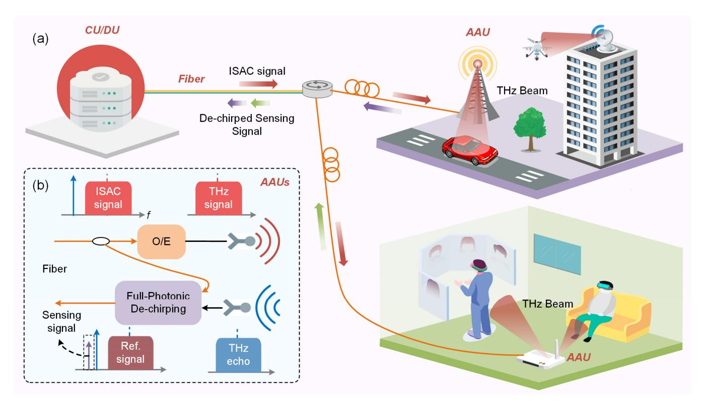
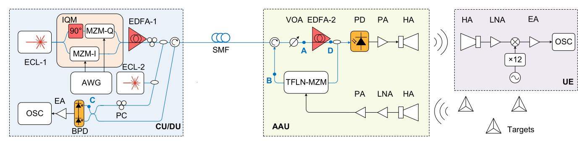
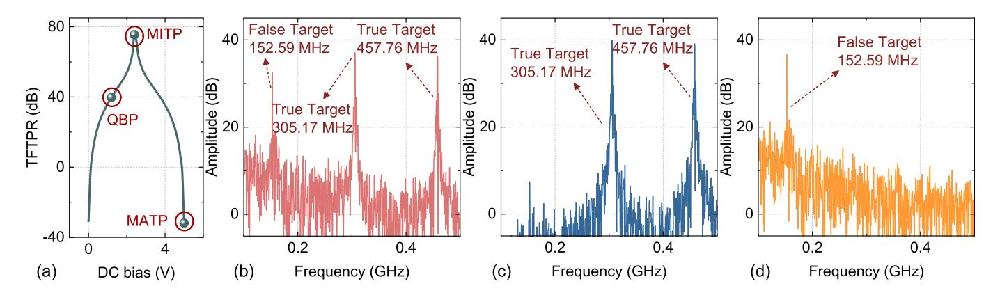
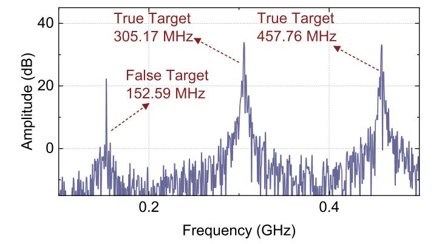
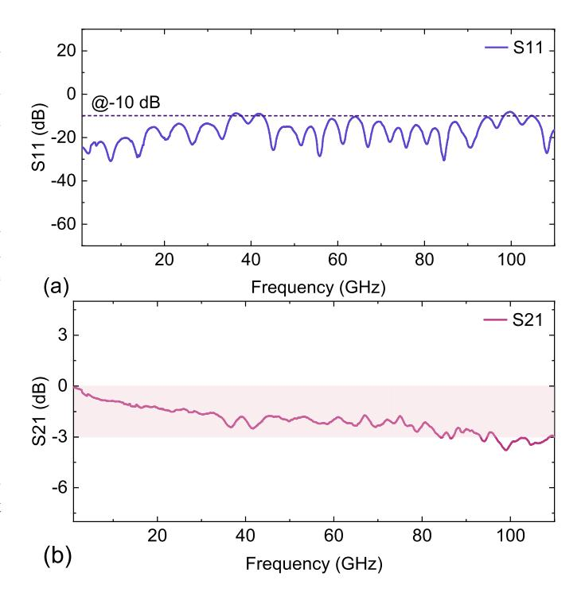
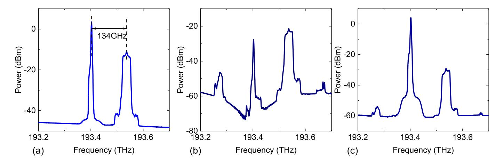
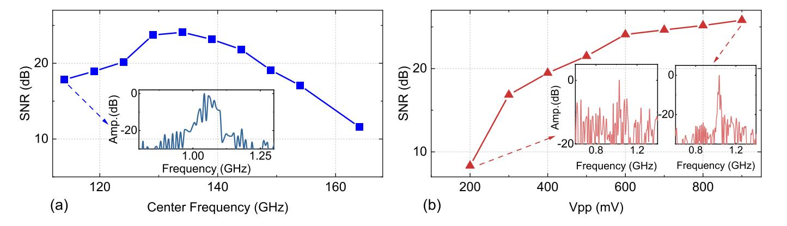
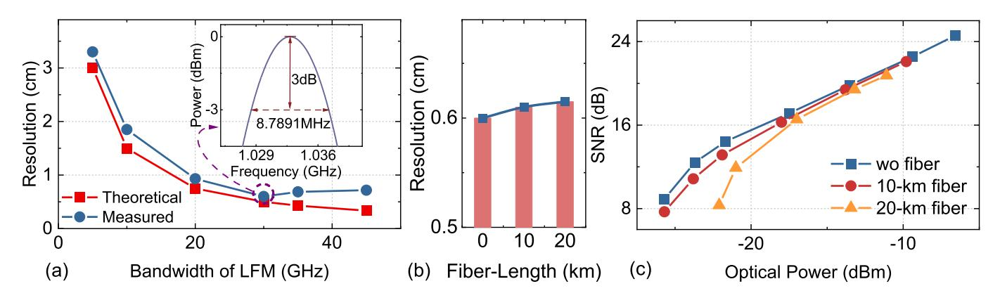
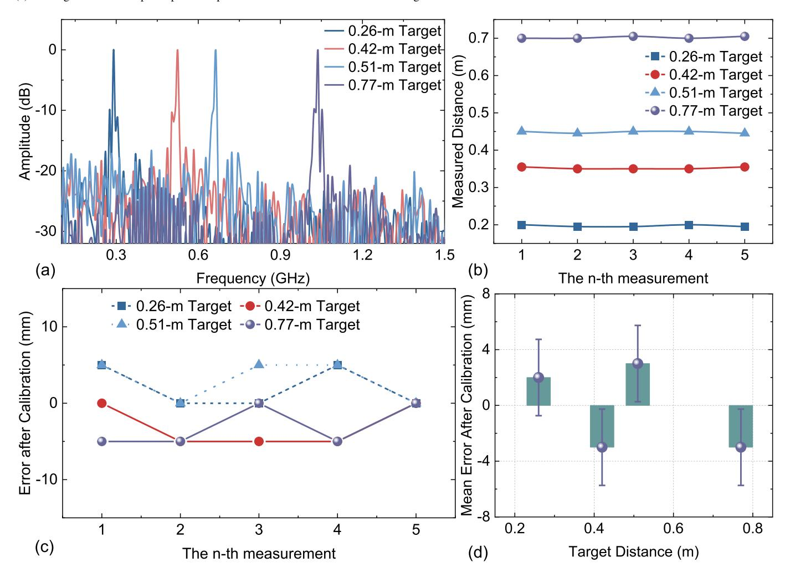
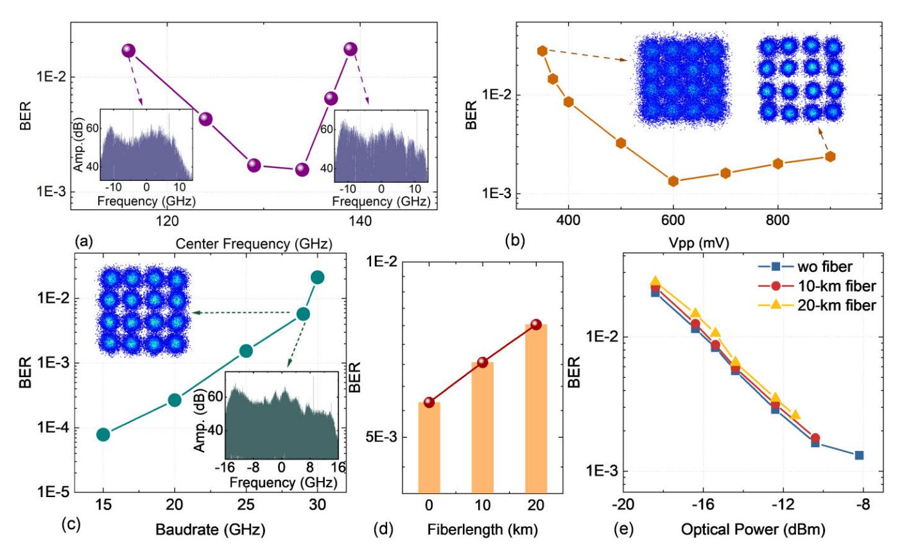

{0}------------------------------------------------

# THz Integrated Sensing and Communication With Full-Photonic Direct LFM Reception and De-Chirping for D-Band Fiber-Wireless Network

Boyu Don[g](https://orcid.org/0000-0002-5971-7386) , Zhongya L[i](https://orcid.org/0000-0003-1247-2059) , Sizhe Xing, Yinjun Liu [,](https://orcid.org/0009-0000-1974-2141) Junhao Zhao, Ouhan Huang [,](https://orcid.org/0000-0002-5624-7665) Junlian Jia [,](https://orcid.org/0000-0001-8878-7423) Jianyang Shi [,](https://orcid.org/0000-0002-5478-3704) Yingjun Zhou [,](https://orcid.org/0000-0003-4177-4742) Haipeng Wang [,](https://orcid.org/0000-0003-1912-7143) *Senior Member, IEEE*, Nan Chi [,](https://orcid.org/0000-0003-4966-3844) *Senior Member, IEEE*, and Junwen Zhan[g](https://orcid.org/0000-0001-8041-1608)

*Abstract*— Integration of sensing and communication (ISAC) systems at the terahertz (THz) band will play a crucial role across a myriad of applications in the 6G era, profoundly enhancing our daily experiences. Photonic-based THz ISAC systems harness the inherent broad bandwidth to directly generate high-frequency broadband signals, ensuring seamless integration with fiber-wireless networks and demonstrating significant potential. Current ISAC systems employ linear frequency modulation (LFM) signals for sensing struggle to directly receive and de-chirp THz echo signals, which, nonetheless, curtails sensing capabilities; moreover, no research has yet investigated the impact of varying fiber lengths on the performance of downlink sensing signal transmission and uplink echo signal return. This article presents a THz photonic-based ISAC system designed to surmount these limitations. At the radar receiver, full-photonic direct reception and de-chirping of D-band LFM signals are realized by a high-bandwidth thin-film lithium niobate Mach– Zehnder modulator (TFLN-MZM); moreover, we evaluate the impact of different fiber lengths on system performance. Our system attains an exceptional range resolution of 6 mm and a peak data rate of 116 Gbit/s at a center frequency of 134 GHz, with a calibrated mean ranging error of less than 3 mm.

*Index Terms*— Fiber-wireless network, integrated sensing and communication, linear frequency modulation (LFM), photonic de-chirping (PDC), terahertz photonics.

## I. INTRODUCTION

I N THE forthcoming Sixth-Generation (6G) network, a multitude of new application scenarios, such as autonomous driving [\[1\], ex](#page-11-0)tended reality (XR) [\[2\], an](#page-11-1)d smart manufacturing [\[3\], w](#page-11-2)ill materialize, significantly altering our daily

Received 17 December 2024; revised 4 February 2025; accepted 2 March 2025. Date of publication 10 April 2025; date of current version 15 August 2025. This work was supported in part by the National Key Research and Development Program of China under Grant 2022YFB2903600; in part by the National Natural Science Foundation of China under Grant 62235005, Grant 62171137, and Grant 61925104; and in part by the Natural Science Foundation of Shanghai under Grant 24ZR1490500. *(Corresponding author: Junwen Zhang.)*

The authors are with the Key Laboratory for Information Science of Electromagnetic Waves (MoE), Department of Communication Science and Engineering, Shanghai Engineering Research Center of Low-Earth-Orbit Satellite Communication and Applications, and Shanghai Collaborative Innovation Center of Low-Earth-Orbit Satellite Communication Technology, Fudan University, Shanghai 200433, China (e-mail: bydong21@m.fudan.edu.cn; zhongyali20@fudan.edu.cn; 21110720072@m.fudan.edu.cn; 23110720080@ m.fudan.edu.cn; 22210720312@m.fudan.edu.cn; huangouhan@hdu.edu.cn; jljia20@fudan.edu.cn; jy\_shi@fudan.edu.cn; yingjunzhou@fudan.edu.cn; hpwang@fudan.edu.cn; nanchi@fudan.edu.cn; junwenzhang@fudan.edu.cn). Digital Object Identifier 10.1109/TMTT.2025.3549729

lives. These advanced scenarios depend on high-data-rate communication and necessitate that the nodes within the 6G network have the capability for environmental sensing. Sensing is, thus, set to evolve beyond its traditional standalone function, becoming fundamentally integrated with communication technologies. The concept of integrating sensing and communication plays a pivotal role in this evolution, offering substantial integration and coordination gains [\[4\], th](#page-11-3)ereby enhancing the overall functionality. Acknowledging its significant potential, the International Telecommunication Union (ITU) has designated integration of sensing and communication (ISAC) as one of the foremost enablers for the impending 6G networks [\[5\]. U](#page-11-4)ltrahigh signal bandwidth, furthermore, serves as a critical foundation for both high-performance communication and radar sensing. In contrast to traditional wireless operation frequencies, the vast spectrum within the sub-terahertz (THz) and THz bands is capable of supporting high-data-rate communication and high-resolution sensing functions. The deployment of ISAC in these spectra is, therefore, poised to unlock even more expansive possibilities in the realm of 6G [\[6\].](#page-11-5)

Traditional electronic-based ISAC systems necessitate multiple-level frequency doubling to generate THz signals. With each increment in the level of frequency doubling, the signal quality correspondingly diminishes [\[7\]. Th](#page-11-6)e bandwidth of ISAC signals is, moreover, constrained by the bandwidth of electronic devices, hindering the ability to fully leverage the extensive spectrum resources available in the THz band. In contrast, photonic-based THz ISAC systems, benefiting from the inherently broad bandwidth of photonic devices, offer more versatile frequency manipulation and broader signal generation capabilities. Additionally, photonic-based THz ISAC systems offer significant benefits in terms of electromagnetic compatibility and seamless integration with fiber-wireless networks.

Owing to the aforementioned benefits, photonic-based THz and sub-THz ISAC systems have garnered increasing interest among researchers [\[8\],](#page-11-7) [\[9\],](#page-11-8) [\[10\],](#page-11-9) [\[11\],](#page-11-10) [\[12\],](#page-11-11) [\[13\],](#page-11-12) [\[14\],](#page-11-13) [\[15\],](#page-11-14) [\[16\],](#page-11-15) [\[17\],](#page-11-16) [\[18\],](#page-11-17) [\[19\],](#page-11-18) [\[20\]. G](#page-12-0)iven the superior performance of linear frequency modulation (LFM) signals in radar sensing, several demonstrations have employed LFM signals to fulfill the sensing function. The photonic de-chirping (PDC) for

{1}------------------------------------------------

| TABLE I                                                |
|--------------------------------------------------------|
| COMPARISON BETWEEN THz AND SUB-THz ISAC DEMONSTRATIONS |

| Sensing Rx | PDC | Fiber Length (km) | Peak Data Rate (Gbit/s)                                | Range Resolution (cm)                         | Ref           |
|---------------|-----|-------------------------|-----------------------------------------------------------|-----------------------------------------------------|---------------|
| Elec.         | N   | /                       | 3.125 (line)                                              | 15                                                  | [8]           |
| Elec.         | N   | /                       | 56 (net)                                                  | 0.73                                                | [9]           |
| Elec.         | N   | /                       | 6 (line)                                                  | 1.3                                                 | [10]          |
| Elec.         | N   | /                       | 20 (line)                                                 | 1.5                                                 | [11]          |
| Elec.         | N   | /                       | 120 (line, multi-channel) 40 (line, per channel) | 0.25 (multi-chan nel)/1.5 (per channel) | [12]          |
| Elec.         | N   | 0.05/0.1                | 92 (line)                                                 | 1.5                                                 | [13]          |
| Mixed         | Y   | /                       | 46.55 (net)                                               | 1.02                                                | [14]          |
| Mixed         | Y   | /                       | 38.1(net)                                                 | 1.58                                                | [15]          |
| Mixed         | Y   | 10                      | 41.48 (line)                                              | 1.53-6.94                                           | [16]          |
| Mixed         | Y   | 10                      | 60 (line)                                                 | 1.59-4.39                                           | [17], [18] |
| Mixed         | Y   | 10                      | 60(line)                                                  | 1.76-3.15                                           | [19]          |
| Mixed         | Y   | 10                      | 68.6(line)                                                | 2                                                   | [20]          |
| Photo.        | Y   | 10/20                   | 116(line)                                                 | 0.6                                                 | This paper    |

LFM signals, furthermore, leverage the extensive bandwidth of photonic devices to attain higher resolution [\[21\],](#page-12-1) [\[22\],](#page-12-2) [\[23\].](#page-12-3) Table [I](#page-1-0) presents the current state of research on W band (75–110 GHz) and higher band photonic-based ISAC systems using LFM signals. We have cataloged critical performance metrics, such as peak data rate, range resolution, and more in the table.

In [\[8\],](#page-11-7) [\[9\],](#page-11-8) [\[10\],](#page-11-9) [\[11\],](#page-11-10) [\[12\],](#page-11-11) and [\[13\],](#page-11-12) the THz or sub-THz LFM echo signal initially undergoes electronic downconversion, followed by baseband signal matched filtering (MF) to extract the target information. While baseband signal processing offers increased flexibility, the long-distance fiber transmission of echo signals presents significant challenges to the system [\[24\]. T](#page-12-4)he first challenge stems from insufficient modulation depth caused by the inherently weak energy of radar echo signals. Considering that long-distance transmission of signals typically requires the use of optical amplifiers, the insufficient modulation depth is likely to further reduce the optical signal-to-noise ratio (SNR). This reduction leads to a deterioration of the signals after long-distance fiber transmission and optic-electric (O/E) conversion. Additionally, the dispersion and nonlinearity introduced by long-distance fiber transmission can cause distortion of broadband echo signals, thereby affecting overall radar sensing performance. The MF method, moreover, requires processing the complete LFM baseband or intermediate frequency (IF) signal, which is not only constrained by the bandwidth limitations of electronic devices in the down-conversion process but also requires high-bandwidth analog-to-digital converters (ADCs), such as oscilloscopes. In [\[14\]](#page-11-13) and [\[15\],](#page-11-14) the THz or sub-THz LFM echo signal is down-converted via an electronic mixer before de-chirping through a photonic device. The frequency jitter resulting from two free-running lasers, however, complicates the coherent superposition of the transmission signal. In our previous research [\[16\],](#page-11-15) [\[17\],](#page-11-16) [\[18\],](#page-11-17) [\[19\],](#page-11-18) [\[20\], t](#page-12-0)he sub-THz LFM echo signal was down-converted using an envelope detector to mitigate frequency jitter from free-running lasers. The system integrates long-distance fibers to accommodate both integrated signal downlink transmission and radar sensing signal uplink transmission. Employing electronic devices for down-conversion, however, limits the bandwidth of the radar sensing signals. Additionally, the use of an envelope detector can introduce the issue of false targets. The ED approach, furthermore, requires the transmitted signal to have a carrier, which can lead to potential losses in both spectral efficiency and energy use.

There is, moreover, plenty of reported work at lower microwave bands enabling by direct full-PDC scheme. At lower frequency bands, microwave ISAC signals can be generated through photonic frequency multiplication [\[25\], b](#page-12-5)ut this method is limited by the output signal bandwidth of the digital-to-analog converter (DAC) and is difficult to extend to higher frequency bands. When the operating frequency band is further increased to V band (40–75 GHz) [\[26\],](#page-12-6) [\[27\], t](#page-12-7)he coherent optical carrier beating (OCB) method is adopted. The advantage of this method is the frequency stability of the generated microwave signals, but it requires additional phase modulator (PM) or Mach–Zehnder modulator (MZM), or even a cascade of both to generate higher frequency carriers, which increases the overall system complexity. In terms of system complexity, when the system extends to higher frequencies, a scheme that uses free-running lasers to directly generate microwave signals is more advantageous [\[7\].](#page-11-6)

Given that fully transparent THz-optical reception offers a promising solution for simplifying antenna sites, it is crucial to investigate methods for directly receiving and demodulating LFM echoes in the THz band. Photonic-based direct reception and processing of THz LFM signals, however, pose significant challenges. From the perspective of THz echo reception, directly receiving THz signals via optical modulators requires the modulator to have a sufficiently high bandwidth to cover the THz frequency range. Although studies [\[28\],](#page-12-8) [\[29\],](#page-12-9) [\[30\]](#page-12-10) have demonstrated the direct reception of D-band and higher-frequency THz signals in communication systems, THz LFM echoes experience additional attenuation due to target reflection and dual-path propagation compared to typical point-to-point communication links. Consequently, weaker signal energy imposes stricter requirements on both the modulation depth [\[31\]](#page-12-11) and the operational bandwidth of the modulator at the radar sensing receiver. As shown in Table [I,](#page-1-0) most existing demonstrations of photonic-based THz and sub-THz ISAC systems, furthermore, still rely primarily on electronic or hybrid reception schemes. These approaches typically require down-converting the THz signal to the IF, where the usable LFM bandwidth is limited by the constraints of electronic mixers or envelope detectors. This limitation hinders the full exploitation of the abundant spectral resources available in the THz band.

In ISAC systems based on free-running lasers, how to design a reasonable architecture and down-conversion strategy to achieve direct full-PDC while minimizing the frequency instability introduced by free-running lasers has not been discussed in existing research, whether at lower microwave bands or THz bands. Besides, in most ISAC systems that use the direct full-

{2}------------------------------------------------

Fig. 1. (a) Concept of photonic-based THz ISAC for fiber-wireless networks. (b) Principle of full-photonic THz ISAC signal generation, direct LFM reception, and de-chirping.

PDC scheme, the MZM at the receiver end primarily serves as an electric-optic (E/O) converter, used to modulate the echo signal onto the light and ultimately achieve PDC and O/E conversion in the photodiode (PD)/balanced PD (BPD). This structure is, however, not conducive to long-distance optical fiber transmission, which is vital in fiber-wireless networks.

This article introduces a novel D-band photonic-based ISAC system for fiber-wireless networks. In the system, communication and radar sensing functions are achieved by using 16-quadrature amplitude modulation (QAM) signals and LFM signals, respectively, through time-division multiplexing (TDM). This approach, which is a common practice in the field, highlights the generality and compatibility of our system with widely adopted waveforms. Broadband D-band ISAC signals are successfully generated by optical heterodyning. At the radar receiver, a thin-film lithium niobate MZM (TFLN-MZM) is used to conduct full-photonic directly receiving and de-chirping of the D-band LFM echo signal. By combining this approach with coherent homodyne photonic down-conversion using a BPD, the impact of the time-varying central frequency of D-band LFM signals on radar detection generated by the heterodyning of free-running lasers can be mitigated. Additionally, the downlink transmission of ISAC signals and the uplink transmission of echo signals after de-chirping through the same long-distance fiber are successfully achieved. The impact of different fiber lengths on communication and radar sensing performance is examined in experiments to better demonstrate the seamless integration with fiber-wireless networks. At a center frequency of 134 GHz, a range resolution of 6 mm and a peak data rate of 116 Gbit/s are successfully achieved. The calibrated average distance error is less than 3 mm. The achieved single-channel range resolution and peak data rate in this research position the system at the forefront of current photonic-based THz ISAC systems.

The structure of this article is organized as follows. Section [II](#page-2-0) describes the principle of the proposed D-band THz ISAC system with full-photonic direct LFM reception and de-chirping for the fiber-wireless network. Section [III](#page-6-0) provides a description of the experimental setup. The experimental results and analysis are presented in Section [IV.](#page-7-0) Finally, Section [V](#page-11-19) presents the conclusion of the study.

## II. PRINCIPLE

Fig. [1\(a\)](#page-2-1) depicts the concept and application scenarios of the photonic-based THz ISAC system integrated with fiberwireless networks, as discussed in this article. In the realm of future 6G technology, there is an urgent need to augment communication capacity by leveraging the spectrum-rich THz band. To actualize a broader spectrum of wireless application scenarios, including vehicular networks, lowaltitude drone management and monitoring, and virtual reality (VR)/augmented reality (AR) applications, sensing capabilities will, moreover, become a fundamental aspect of wireless networks. This mandates the seamless integration of communication and sensing within each radio unit. Additionally, the 6G architecture necessitates a robust bridge linking each radio unit, which serves as a node for direct communication with users and environmental sensing, to the optical backbone [\[32\].](#page-12-12) A critical component of this bridge is the connection between

{3}------------------------------------------------

Fig. 2. Experimental setup of the photonic-based D-band sub-THz ISAC system with direct LFM reception and de-chirping for the fiber-wireless network. ECL: external cavity laser, IQM: in-phase and quadrature modulator, AWG: arbitrary waveform generator, EDFA: erbium-doped fiber amplifier, PC: polarization controller, OC: optical coupler, SMF: single-mode fiber, VOA: variable optical attenuator, PD: photodiode, PA: power amplifier, HA: horn antenna, LNA: low noise amplifier, ED: envelope detector, EA: electrical amplifier, OSC: oscilloscope, TFLN-MZM: thin-film lithium niobate MZM, and BPD: balanced PD.

the central or distributed unit (CU/DU) and the active antenna unit (AAU), where analog wireless waveforms can be simulated via optical fibers to ensure transparent and faithful round-trip communication [\[33\].](#page-12-13) The rapid development of photonic devices, particularly high-speed photodetectors and modulators, has made the seamless integration of THz and optical fiber possible. This architecture simplifies the antenna sites of remote radio units in the 6G radio access network (RAN), meeting the demands for high-speed transmission and ultradense cell distribution in 6G.

Fig. [1\(b\)](#page-2-1) schematically illustrates the architecture of the AAU and the principles underlying photonic THz signal generation, direct LFM echo signal reception, and de-chirping. In each AAU, the optical signal transmitted from the CU/DU consists of a local oscillator (LO) light and a baseband ISAC signal, with their frequency difference corresponding to the generated THz signal frequency. This optical signal is split into two paths via a 3 dB optical coupler (OC). One path is directed to a high-speed PD for O/E conversion, generating the THz signal, which is then radiated into free space via an antenna. At the transmitter end, communication and sensing use the same THz frontend, thereby simplifying the transmission chain. Additionally, the THz echo reflected by the target is captured by the antenna in the AAU. This echo signal is then directly modulated onto the other optical path from the coupler using a broadband optical modulator, achieving direct reception and de-chirping of the THz LFM echo signal. The downlink optical signal from the CU/DU, thus, acts as the light for receiving the echo, eliminating the need for an additional laser at the receiver end and enabling wavelength reuse. After de-chirping, the LFM echo from a single target is converted into a single-tone signal whose frequency lies close to the LO frequency. As indicated in Fig. [1\(b\),](#page-2-1) leveraging photonic up-conversion, down-conversion, and de-chirping technology, the need for additional LOs, both electrical and optical, in the AAU is eliminated, further simplifying its structure. Additionally, the PDC structure streamlines the digital signal processing (DSP) for radar signals.

The de-chirped signal can then be transmitted back to the CU/DU for centralized processing via fibers. Leveraging the advanced DSP capabilities in the cloud, combined with artificial intelligence [\[34\], m](#page-12-14)ore complex and large-scale virtual mappings of real scenes can be realized, facilitating diverse applications. Thanks to the PDC structure, which processes the LFM echo signals directly at the AUU, only the dechirped signals, rather than the complete radar echo signals, need to be transmitted back to the CU/DU. This approach significantly mitigates the impact of fiber transmission on radar performance and reduces uplink transmission pressure.

Based on this framework, Fig. [2](#page-3-0) displays the schematic of the proposed photonic-based D-band THz ISAC system for fiber-wireless networks, featuring direct LFM reception and de-chirping capabilities. In this article, the 16-QAM signal and LFM signal are combined through TDM to serve communication and radar sensing functions, respectively. The LFM signal is represented as

$$s_r(t) = \operatorname{rect}(t/T_r) \exp[j\pi (2f_0t + kt^2)]$$
 (1)

where *Tr* is the duration time of the LFM signal, *f*0 is the initial frequency and *k* is the chirp rate, which can be expressed as *k* = *Br* /*Tr* , and rect(·), is the unit rectangular window function.

The commonly used QAM signals in communication can be expressed as

$$s_c(t) = A(t) \exp[j\varphi(t)]$$
 (2)

where *A*(*t*) and ϕ(*t*) denote the amplitude and phase of the signal, respectively. Since QAM modulation involves both amplitude and phase, systems capable of supporting QAM signals inherently support phase shift keying (PSK) signals, which modulate only the phase.

Considering TDM, the ISAC signal can be written as

$$s_{\text{ISAC}}(t) = \begin{cases} s_r(t), & 0 < t \le T_r \\ s_c(t), & T_r < t \le T_s \end{cases}$$
 (3)

where *Ts* is the total duration of the ISAC signal.

The ISAC signal is generated in the CU/DU and then modulated onto the light emitted by external cavity laser-1 (ECL-1) via the IQM, as shown in Fig. [2.](#page-3-0) The IQM consists of two MZMs and an optical phase shifter. The input laser is split into two beams by a 3 dB waveguide, which are used to modulate the I and Q channels of the electrical signal. In order to achieve IQ summation, a 90◦ phase shift is applied to one of the optical paths, and then the two modulated laser beams are combined through another 3 dB optical waveguide to produce 

{4}------------------------------------------------

IQ-modulated light. At this point, both the upper and lower MZMs need to operate in carrier suppression mode, which is the minimum transmission point (MITP). The bias status of the IQM when implementing the functions of communication and radar sensing is the same. Under small signal modulation, the output of the IQM can be represented as

$$E_{\text{IQM}}(t) \propto E_{c1} \exp(2j\pi f_{c1}t)$$

$$\cdot \begin{cases} \exp[j\pi \left(2f_{0}t + kt^{2}\right)], & 0 < t \leq T_{r} \\ A(t) \exp[j\varphi(t)], & T_{r} < t \leq T_{s} \end{cases}$$
(4)

where *Ec*1 denotes the amplitude of the light emitted by ECL-1, and *fc*1 denotes the frequency of the light.

The modulated optical signal experiences amplification by an erbium-doped fiber amplifier (EDFA) and is then combined with the light from a LO emitted by the ECL-2. This signal then traverses a circulator before being sent to the AAU via a long-distance single-mode fiber (SMF). The signal at the point A in Fig. [2](#page-3-0) can be represented as

$$E_{\text{point-A}}(t) \propto E_{\text{IQM}}(t) + E_{c2} \exp(2j\pi f_{c2}t)$$
 (5)

where *Ec*2 denotes the amplitude of the light emitted by the ECL-2 and *fc*2 denotes the frequency. Subsequently, the optical signal undergoes further amplification by the EDFA and is split into two distinct paths. The first path serves as a reference signal, facilitating the PDC process of the THz LFM echo signal. The second path is directed toward a high-speed PD to accomplish O/E conversion, thereby generating the THz signal. Once amplified by a power amplifier (PA), this signal is emitted into free space via a horn antenna (HA). Ideally, the THz signal transmitted in wireless channels can be represented as

$$E_{\text{THz}}(t) \propto \begin{cases} \cos[2\pi (f_{c1} - f_{c2} + f_0 + kt/2)t], & 0 < t \le T_r \\ A(t)\cos[2\pi (f_{c1} - f_{c2})t + \varphi(t)], & T_r < t \le T_s \end{cases}$$
(6)

where *fc*2 − *fc*1 represents the frequency of the THz signal. At the user end (UE) side, the transmitted THz signal is captured and then mixed with the LO signal generated by the frequency multiplier. The signal is down-converted to the IF after passing through the mixer. The electrical IF signal can be represented as

$$E_{\rm IF}(t) \propto A(t) \cos[2\pi (f_{c1} - f_{c2} - f_{\rm LO})t + \varphi'(t)]$$
 (7)

where *f*LO represents the frequency of the LO signal. It is important to note that the fact that ECL-1 and ECL-2 are not phase-locked means that the frequency instability between them significantly impacts communication performance. As a result, any frequency offset leads to a severe rotation of the QAM constellation points, ultimately causing them to rotate into circles of varying amplitudes, rendering the signal unrecoverable. ϕ ′ (*t*) denotes the phase of the received IF signal, which is determined by the phase of the original QAM signal, the two free-run lasers and the LO signal. The length of the optical fiber, moreover, also affects this phase. In the downlink communication, the optical signal transmitted through the fiber includes both the signal light and the LO light, with their frequency difference corresponding to the transmitted THz signal frequency. Because of the wavelength-dependent refractive index of the fiber, the two optical components experience different phase shifts, resulting in a phase difference that varies with the fiber length. This phase difference ultimately manifests in the phase of the IF signal at the receiving end. Since the refractive index variation is minimal, the phase shift introduced by fiber transmission is, however, not the dominant factor. The frequency and phase offsets caused by the above factors can be recovered through frequency offset and carrier phase estimation (FOE & CPE) algorithms in the communication DSP.

The THz LFM signal reflected by the target is, moreover, captured by the HA in the AAU. The echo signal can be represented as

$$E_{\text{echo}}(t) \propto \cos\{2\pi [f_{c1} - f_{c2} + f_0 + kt/2 + k\tau]t\}$$
 (8)

where τ represents the time delay, allowing us to calculate the distance of the target.

Subsequently, the echo signal is directly modulated onto the reference signal using the TFLN-MZM. The broad bandwidth capabilities of the TFLN-MZM allow for the realization of direct reception and PDC processing of THz LFM echo signals. According to the analysis in [\[17\],](#page-11-16) to avoid range ambiguity and calibrate system errors, optical delay lines can be added in the path entering the TFLN-MZM or the path entering the PD. It should be noted that the operational setting of the TFLN-MZM significantly influences the sensing performance in multiple target detection scenarios [\[19\]. A](#page-11-18)t specific operating points, echo signals reflected from various targets experience frequency beating due to the nonlinear effect of the TFLN-MZM. The beating frequency is directly proportional to the distance differences among the targets. If the signals are sent back to the CU/DU, false targets may emerge, thereby causing substantial interference with the detection of real targets.

In order to demonstrate that the structure used in this study does not introduce false targets due to design issues, which could potentially affect radar sensing performance, and to ensure the effectiveness and practicality of the proposed scheme, simulations are conducted using VPItransmission-Maker, employing the same setup as in the experiment. In the simulation, the LFM bandwidth is set to 5 GHz, and the signal duration is set to 1638.4 ns. Frequencies for the two real targets are established at 305.17 and 457.76 MHz, respectively. The dc bias of the TFLN-MZM is adjusted to manipulate its operating point. The true-to-false target power ratio (TFTPR) of the signal from the BPD is measured to assess the impact of false targets. Results are displayed in Fig. [3.](#page-5-0) It is observed that the TFLN-MZM exhibits optimal suppression performance against false targets when operating at the MITP. The issue of false targets becomes pronounced at the quadrature bias point (QBP) and is most severe when the system operates at the maximum transmission point (MATP). These findings are consistent with the theoretical derivation in [\[19\].](#page-11-18)

In order to avoid the generation of false targets, it is necessary to maintain the TFLN-MZM operating at the MITP. Under small signal modulation, the output of the TFLN-MZM

{5}------------------------------------------------

Fig. 3. (a) TFTPR versus the dc bias voltage. (b) Spectrum after FFT operation with TFLN-MZM operating at QBP. (c) Spectrum after FFT operation with TFLN-MZM operating at MITP. (d) Spectrum after FFT operation with TFLN-MZM operating at MATP.

can be 
$$E_{\text{point-B}}(t) \propto \begin{cases} A_1 \cos \left[ 2\pi (2f_{c2} - f_{c1} - f_0 - kt/2 - k\tau)t \right] \\ + A_2 \cos \left[ 2\pi (f_{c1} + f_0 + kt/2 + k\tau)t \right] \\ + A_3 \cos \left[ 2\pi (2f_{c1} - f_{c2} + 2f_0 + kt + k\tau)t \right] \\ + A_4 \cos \left[ 2\pi (f_{c2} - k\tau)t \right] \\ + A_5 \cos \left[ 2j\pi (f_{c1} + f_0 + kt/2)t \right] \\ + A_6 \cos (2j\pi f_{c2}t) \end{cases}$$
(9)

where *An* denotes the amplitude of different terms in {·}. The first term represents the modulation of the THz LFM echo signal on the LO light from ECL-2, forming the lower sideband. This signal is a broadband LFM echo signal, containing target information *k*τ but without de-chirping. The second term also represents the THz LFM echo signal modulated on the LO light from ECL-2. This term forms the upper sideband, and its frequency coincides with the fifth term in the spectrum. This signal is also a broadband LFM echo signal, containing target information, but similarly, it is not de-chirped. The third term represents the intermodulation result between the THz LFM echo signal and the reference signal, forming a broadband signal with twice the bandwidth of the transmitted LFM signal. The fourth term represents the de-chirped result of the THz LFM echo signal with the reference signal light. This term contains only the de-chirped tone frequency, which is close to *fc*2. The frequencies corresponding to the fifth and sixth terms are related to the optical frequencies entering the TFLN-MZM. Since the TFLN-MZM operates in MITP, these two terms are suppressed.

From the fourth term in [\(9\),](#page-5-1) it can be observed that the echo signal and the reference signal have completed the de-chirping in the TFLN-MZM, thereby eliminating the need for the complete echo signal to be transmitted to the CU/DU for further DSP. Additionally, this term shows that the frequency of the de-chirped signal is independent of *fc*1. Typically, using two free-running lasers, ECL-1 and ECL-2, to generate D-band LFM signals may introduce frequency instability. The use of TFLN-MZM for PDC eliminates the frequency drift issues caused by the frequency jitter of ECL-1. The frequency of de-chirping, related to the target distance, is, moreover, close to the *fc*2, which provides us with the opportunity

Fig. 4. Spectrums after FFT operation with TFLN-MZM operating at MITP and O/E conversion by a single PD.

to extract the frequency of the de-chirped signal through homodyne detection in the CU/DU. This scheme further mitigates the impact of the time-varying central frequency of D-band LFM signals generated by the heterodyning of free-running lasers and enables coherent accumulation of radar sensing signals, provided that ECL-2 exhibits good short-term frequency stability. It is important to note that since the TDM scheme is employed, the communication signals reflected by the targets are also directly received by the AAU. Unlike LFM signals, these communication signals are, however, not de-chirped with the reference signal. In CU/DU, we only need to focus on extracting the de-chirped frequency information rather than the complete LFM echo signals. This implies that the reflected communication signals do not interfere with the radar detection process.

After the de-chirping process, the output signal from the TFLN-MZM is transmitted back to the CU/DU via the same SMF. At this stage, the de-chirped signal undergoes photonic down-conversion and O/E conversion. This conversion process is either executed using a single PD or a BPD. In scenarios involving the detection of multiple targets, square-law detection by the PD results in frequency beating among de-chirped signals from different targets, thus introducing false targets. In order to verify this issue, corresponding simulations are conducted, and the results are displayed in Fig. [4.](#page-5-2) Compared with the BPD scheme shown in Fig. [3\(b\),](#page-5-0) a significant issue with false targets is evident in Fig. [4.](#page-5-2)

{6}------------------------------------------------

Considering that the frequency of the de-chirped signal is proximate to *fc*2, only a narrowband BPD is, moreover, a requisite in our scheme. Disregarding the high-frequency portion subsequent to the O/E conversion, the output of the BPD can be expressed as

$$I_{\rm BPD}(t) \propto R_{\rm BPD} \{\cos(2\pi k \tau t)\}$$
 (10)

where *R*BPD denotes the responsivity of the BPD. We can execute a fast Fourier transform (FFT) operation to obtain the de-chirped frequency, which bears a relationship with the target distance as

$$d = \frac{cT_r \Delta f}{2B_r} \tag{11}$$

where 1*f* is the peak frequency and *d* is the target distance.

## III. EXPERIMENTAL SETUP

As a proof-of-concept, we set up an experiment for the proposed D-band THz ISAC system with full-photonic direct LFM reception and de-chirping for the fiber-wireless network, as shown in Fig. [2.](#page-3-0)

In the CU/DU, the integration of LFM and QAM signals is achieved through TDM. In experimental settings, the durations of LFM and QAM signals were set at 136.533 and 1920 ns, respectively. Based on the analysis in [\[17\],](#page-11-16) the maximum unambiguous detection range achievable in this article is 10.24 m, a range sufficient for most fiber-to-theroom (FTTR) applications. In practical scenarios, the durations can, furthermore, be dynamically adjusted to facilitate flexible performance trade-offs. An arbitrary waveform generator (AWG) with a sampling rate of 60 GSa/s is used to convert the generated digital signal into an analog signal. This sampling rate is more than sufficient to generate signals with a bandwidth exceeding 30 GHz. This analog signal is then modulated onto light emitted from the ECL-1, operating at a frequency of 193.4022 THz with a linewidth of 100 kHz, using the IQM. The optical power output by ECL-1 is 14.5 dBm. The resulting signal is amplified by an EDFA and combined with the LO light from the ECL-2. The LO light has a frequency of 193.5364 THz and a linewidth of 3 kHz, with a power of approximately 1.2 dBm. The frequency difference between the signal and LO light determines the center frequency of the THz signal. The combined signal is transmitted to the AAU through a circulator that distinguishes between forward and backward signals. The experiment involved varying the lengths of SMFs between the CU/DU and AAU. After passing through the second circulator, the signal undergoes further amplification by another EDFA. For a TDM-ISAC signal with an AWG output peak-to-peak voltage of 700 mV, the optical power of the signal entering EDFA-1 is approximately −9.4 dBm after transmission over a 10-km fiber. The signal is then divided into two paths by the OC. One path serves as a reference signal entering the TFLN-MZM, while the other path is directed to a high-speed PD with an optical power of approximately 7.27 dBm, generating a D-band signal centered at 134 GHz with a power of approximately −19 dBm. The TFLN-MZM used in our experiments is model MZ135-LN-110, with a typical half-wave voltage of ≤3 V and a typical optical

Fig. 5. Tested *S*11 and *S*21 parameters of the TFLN-MZM. (a) *S*11 represents the input return loss in the *S* parameter and (b) *S*21 represents the forward transmission loss.

insertion loss of 7.1 dB. In addition, the tested *S*11 and *S*21 parameters of the TFLN-MZM are presented in Fig. [5.](#page-6-1) The *S*11 curve of the TFLN-MZM is present in Fig. [5\(a\),](#page-6-1) which demonstrates that the return loss of the TFLN-MZM is consistently below −10 dB across the entire operating frequency range. This indicates excellent impedance matching and minimal signal reflection, ensuring efficient operation of the modulator. Fig. [5\(b\)](#page-6-1) shows that up to 110 GHz, the *S*21 curve of the TFLN-MZM is relatively flat, with no significant decrease observed at 110 GHz. Because of device limitations, the higher-frequency performance of the TFLN-MZM cannot be measured. The spectrum measured at point D in the AAU is shown in Fig. [6\(a\).](#page-7-1) The frequency difference between the signal light and the LO light is 134 GHz, which corresponds to the center frequency of the THz signal generated by the PD at 134 GHz. This THz signal is amplified by a PA with an 18-dB gain and transmitted into free space through a HA with a 25-dBi gain.

After the 1-m wireless link transmission, the transmitted sub-THz signal is captured by the HA with a 25 dBi gain. Considering the gain of the HAs, the propagation loss after transmission is estimated to be 24.8 dB [\[35\]. C](#page-12-15)onsequently, the sub-THz signal power entering the low-noise amplifier (LNA) is approximately −25.8 dBm. The signal is then amplified by a LNA with a 19 dB gain and mixed with the LO signal generated by the frequency multiplier. In the experiment, a 12-fold frequency multiplier is used. When the center frequency of the transmitted signal is 134 GHz, the LO signal is fixed at 149 GHz. When the center frequency of the transmitted signal varies, the frequency of the LO signal is adjusted accordingly. After passing through the mixer, the THz signal is down-converted to the IF band. Considering

{7}------------------------------------------------

Fig. 6. Optical spectrums at (a) point D, (b) point B, and (c) point C.

the conversion loss of the mixer, the IF signal power is approximately −21.8 dBm. The signal is then amplified by an electric amplifier (EA) with an 18 dB gain and converted from an analog signal to a digital signal using an oscilloscope (OSC) with a sampling rate of 80 GSa/s. Subsequently, a series of offline DSPs are employed to recover the original data.

These offline DSPs primarily include down-conversion, MF, down-sampling, and traditional coherent communication DSP techniques [\[36\],](#page-12-16) [\[37\]. I](#page-12-17)nitially, the Gram-Schmidt orthogonal projection (GSOP) is employed to correct the I/Q imbalance, followed by clock recovery using the fast square-timingrecovery algorithm. Subsequent steps involve signal recovery through equalization using the constant modulus algorithm (CMA). FOE & CPE algorithms are then implemented to alleviate frequency jitter and phase shifts [\[38\],](#page-12-18) [\[39\]. F](#page-12-19)urther enhancements to signal performance are achieved through the decision-directed least mean square (DD-LMS) algorithm. Ultimately, after synchronization, the signal undergoes QAM demodulation, and the bit error rate (BER) is calculated.

At the radar sensing receiving side, the HA in the AAU receives the THz LFM signal reflected by the target in the scenario. The signal is then amplified by the LNA with a 19-dB gain and the PA with a 16-dB gain, and directly modulated onto the reference light signal through the TFLN-MZM to complete the PDC operation. The optical spectrum of the TFLN-MZM output is shown in Fig. [6\(b\),](#page-7-1) where we can observe that each frequency component conforms to the terms in [\(9\).](#page-5-1) The first term appears at the far-left end of the spectrum. The second term overlaps with the fifth term in the spectrum, appearing as a broadband signal near the frequency *fc*1. The broadband signal at the far-right end of the spectrum corresponds to the third term in [\(9\).](#page-5-1) The de-chirped signal is located near *fc*2, but due to the resolution limitations of the spectrometer, it is not clearly visible in the figure.

The de-chirped signal is transmitted back to the CU/DU through the same SMF. In the CU/DU, the de-chirped signal is coupled with the LO light emitted by ECL-2, and photonic down-conversion and O/E conversion are performed by the BPD. The LO light emitted by ECL-2 for the down-conversion of the de-chirping signal is about 12 dBm, and after combing, the signal optical power at point C is approximately 8.3 dBm. The optical spectrum measured at point C in the CU/DU is shown in Fig. [6\(c\),](#page-7-1) illustrating the combination of the LO light from ECL-2 and the output from TFLN-MZM. According to [\(9\),](#page-5-1) the de-chirped signal is centered around frequency *fc*2. By using the BPD, we achieve coherent homodyne detection of the de-chirped signal. In this system, the stability of ECL-2 is critical. Considering that the frequency of ECL-2 is 193.5364 THz, the corresponding refractive index and transmission speed in standard single-mode optical fiber are approximately 1.4682 and 2.04E8 m/s, respectively. In the given scenario, since the target distance is much smaller than the fiber transmission distance, the longest transmission path requires a round-trip distance of 20 km. This means that when the LO optical signal *fc*2 needs to be transmitted from the CU/DU to the AAU and then return, the time taken is approximately 195.9 µs. Ideally, we want the frequency of *fc*2 to vary as little as possible within this time frame. Since 195.9 µs falls within the range of short-term laser stability, commercially available ECL lasers exhibit very high short-term frequency stability, typically ranging from 1E-9 Hz to 1E-12 Hz; thus, frequency shifts within this short-term range are not expected to cause significant interference with radar sensing. Additionally, considering the relatively low optical power output from the TFLN-MZM, the provision of a higher power LO light from ECL-2 is crucial for enhancing the sensitivity of the system [\[40\].](#page-12-20) Subsequently, the signal is sampled using the OSC, and the frequency related to the target distance is obtained through FFT operations.

## IV. RESULTS

## *A. Radar Sensing Performance of the System*

In order to evaluate the performance of our proposed D-band THz ISAC system with full-photonic direct LFM reception and de-chirping for the fiber-wireless network and to assess the influence of different fiber lengths on radar sensing, the experimental setup shown in Fig. [2](#page-3-0) is implemented in three cases, namely back-to-back (BtB), 10-km SMF transmission, and 20-km SMF transmission. In the experiment, the resolution and SNR are obtained by analyzing the range

{8}------------------------------------------------

Fig. 7. (a) Sensing SNR with different carrier frequency. (b) Sensing SNR versus Vpp.

profile of the target after the FFT operation. Specifically, the sensing SNR is defined as the ratio of the energy in the main lobe of the frequency peak, which corresponds to the target distance, to the energy of the noise within the detection range. Additionally, the ranging accuracy is analyzed by positioning the target at diverse distances.

In the experiment, the sensing performance of THz at different center frequencies is initially discussed. In the experiment, the bandwidth of the LFM signal is set to 30 GHz and the system is implemented in the BtB configuration. The frequency difference between the two lasers is altered, and the SNR of the same distance target is analyzed at the receiving end. The relationship between the measured SNR and the center frequency is depicted in Fig. [7\(a\).](#page-8-0) It can be observed that the sensing performance is optimal when the center frequency is within the range of 129–134 GHz. When the center frequency of the signal decreases, the LFM signal exceeds the operating bandwidth of the electronic devices, resulting in a reduction in the coherence between the echo and the reference signal. When the center frequency of the signal increases, aside from the limited bandwidth of electronic devices, the frequency range of the echo signal also exceeds the bandwidth of the TFLN-MZM, resulting in a decrease in the SNR.

In the subsequent experiment, the sensing SNR is measured as a function of the peak-to-peak voltage (Vpp) of the signal output by the AWG, which determines the modulation index of the IQM, a key parameter in the experiments. The system operates in the BtB configuration, with a 30-GHz LFM signal centered at the frequency of 134 GHz. The results, shown in Fig. [7\(b\),](#page-8-0) indicate that higher Vpp corresponds to higher transmission power, resulting in an increased sensing SNR at the receiving end.

Subsequently, the achievable range resolution of the system is investigated. The range resolution in radar sensing represents the ability to distinguish between two closely spaced targets. A smaller range resolution indicates a finer capability to detect multiple targets. Typically, without employing super-resolution algorithms, the measured range resolution should approach but not exceed the theoretical limit. In other words, the measured value should be slightly larger than the theoretical value. The relationship between the range resolution and the bandwidth of the LFM signal is given by δ*R* = *c*/2*Br* . In the experiment, the system operates in the BtB configuration, with a fixed center frequency of 134 GHz and a Vpp of 600 mV while altering the bandwidth of the LFM signal. At the receiving end, the range resolution is characterized by measuring the 3-dB width of the range profile [\[41\],](#page-12-21) [\[42\]. T](#page-12-22)he results are shown in Fig. [8\(a\).](#page-9-0) It can be observed that when the LFM bandwidth is less than 30 GHz, the measured range resolution is slightly higher than the theoretical value. There are several reasons for this discrepancy. First, measurement errors can introduce deviations from the theoretical values. Additionally, factors that degrade the range resolution of photonic-based radar systems include nonlinear effects introduced during O/E and E/O conversions [\[21\], l](#page-12-1)ong-distance fiber transmission [\[43\],](#page-12-23) and even the purity of the testing environment [\[44\]. A](#page-12-24)lthough we employed the PDC scheme at the AAU to mitigate the impact of long-distance fiber transmission on range resolution, other factors and measurement errors still contributed to the observed deviation. Considering these factors and measurement errors, we believe the test results are generally consistent with the theoretical expectations. When the LFM bandwidth exceeds 30 GHz, the achievable range resolution does not improve with increasing bandwidth. This occurs because the bandwidth of the LFM signal surpasses the device bandwidth, leading to a deterioration in range resolution. This is also why we cannot achieve the ultrahigh bandwidth-to-resolution ratio demonstrated in [\[45\]. A](#page-12-25)dditionally, the optimal resolution the system can achieve with different fiber lengths is investigated, as presented in Fig. [8\(b\).](#page-9-0) It can be found that the range resolution only changed slightly with different fiber lengths. In the 20-km SMF transmission configuration, a range resolution close to 6 mm is still achieved. This excellent performance is attributed to our direct LFM signal reception and PDC methods, which, to some extent, alleviate the impact of fiber transmission on radar performance.

The impact of received optical power (ROP) on sensing performance is, moreover, investigated. The optical power at point A in Fig. [2](#page-3-0) is varied by adjusting the variable optical attenuator (VOA) in the AAU. Three configurations for SMF transmission with different lengths are analyzed. The results, shown in Fig. [8\(c\),](#page-9-0) indicate that the sensing SNR decreases as the optical power decreases across all three configurations.

{9}------------------------------------------------

Fig. 8. (a) Theoretical and measured range resolution versus the bandwidth of the LFM signal. (b) Measured range resolution with varying fiber lengths. (c) Sensing SNR versus optical power at point A in three SMF transmission configurations.

Fig. 9. (a) Range profiles for the target at different distances. (b) Measured distances before calibration. (c) Calibrated ranging error at different distances. (d) Measured mean and standard deviation of the calibrated ranging error at different distances.

This decrease occurs because reduced optical power at point A not only lowers transmission power but also affects the optical power of the reference signal.

Finally, the ranging accuracy of the system is evaluated in the experiment. Operating in the 10-km SMF transmission configuration, the system uses a fixed center frequency of 134 and a 30 GHz LFM signal for detection. The target is then placed at distances of 0.26, 0.42, 0.51, and 0.77 m. The range profiles for these distances are shown in Fig. [9\(a\).](#page-9-1) In Fig. [9\(b\),](#page-9-1) we present the distance measurement results obtained from multiple tests at each position. The figure illustrates that there is a fixed offset between the actual measurement results and the true values, attributable to the mismatch of the transceiver link that introduces a systematic measurement error. The causes

{10}------------------------------------------------

Fig. 10. (a) BER with different center frequency. (b) BER versus Vpp. (c) BER versus different baud rates. (d) BER of the 29-GBaud 16-QAM signal under different lengths of SMF transmission. (e) BER of versus optical power at point A under different lengths of SMF transmission.

and elimination methods of this error have been discussed in detail in our previous study [\[16\],](#page-11-15) [\[17\]. S](#page-11-16)imilarly, in this experiment, we also employed an external calibration method and found that the systematic error was 6.5 cm. By subtracting this systematic error, the calibrated distance error is depicted in Fig. [9\(c\).](#page-9-1) After calibration with this systematic error value, the maximum mean error is 3 mm. Considering the measurement error of the measuring tool, this result indicates that the system maintains good accuracy.

## *B. Communication Performance of the System*

In the experiment to measure the communication performance of the system, the effects of the center frequency and Vpp are initially examined. The system operates in the BtB configuration, using a 25 GBaud QAM signal at the transmitting end. While varying the center frequency and maintaining the Vpp of the signal at 600 mV, the frequency of the LO signal at the UE side is adjusted accordingly. The relationship between the center frequency and BER is illustrated in Fig. [10\(a\).](#page-10-0) In our experimental results, the BER we report corresponds to preforward error correction (FEC) BER. If the pre-FEC BER is below the threshold value corresponding to a specific coding scheme and its associated overhead, the post-FEC BER can be considered to be below 1E-12 or 1E-15 [\[46\].](#page-12-26) The results demonstrate that the communication performance of the system is optimal within the center frequency range of 129–134 GHz, consistent with the findings shown in Fig. [7\(a\).](#page-8-0) Subsequently, with the center frequency fixed at 134 GHz, the relationship between Vpp and BER is examined, as shown in Fig. [10\(b\).](#page-10-0) The results indicate that increasing Vpp initially enhances communication performance, but further increases lead to a decline. This occurs because a low Vpp results in an insufficient modulation index, which fails to provide adequate SNR at the UE side. Conversely, as Vpp continues to increase, nonlinear effects are introduced, further degrading performance. This is corroborated by the insert in Fig. [10\(b\).](#page-10-0)

In order to describe the maximum capacity of the system, the BERs of the 16-QAM signal at different baud rates in the BtB configuration are meticulously measured, as shown in Fig. [10\(c\).](#page-10-0) It can be observed that the maximum baud rate achievable for the 16-QAM signal is 29 GBaud when implementing a 7% overhead soft-decision FEC with an acceptable BER threshold of 1E-2 [\[47\]. T](#page-12-27)his translates to a maximum peak net rate of 29 × 4/(1% + 7%) = 108.4 Gbit/s. The BER of the 29-GBaud 16-QAM signal under different lengths of SMF transmission is, furthermore, compared, as shown in Fig. [10\(d\).](#page-10-0) Regardless of the SMF length, the BER remains below 1E-2. The impact of fiber length on system performance is a complex issue, primarily due to the effects of dispersion, nonlinearity, and attenuation. As the fiber length increases, these factors can significantly degrade the signal quality. For the downlink communication, the optical power entering the fiber at the CU/DU end is low, and the maximum transmission distance does not exceed 20 km, so the impact of nonlinearity can be neglected [\[48\]. F](#page-12-28)rom the experimental results shown in 

{11}------------------------------------------------

Fig. [10\(d\)](#page-10-0) and [\(e\),](#page-10-0) it can be observed that in our system, the impact of 20-km fiber length on communication functionality is mainly reflected in the power attenuation. From another perspective, the 20-km fiber length between the CU/DU and AAU is sufficient to meet the fiber-wireless network application scenarios envisioned in this article [\[33\].](#page-12-13)

Finally, the impact of ROP on communication performance under different lengths of SMF transmission is discussed. The notion that longer fiber transmission yields poorer performance is not a common-sense conclusion in all systems. Some studies have shown that, in certain cases, adding long fiber transmission can improve communication performance [\[49\].](#page-12-29) In order to accurately assess the impact of fiber transmission, it is, therefore, necessary to conduct experimental verification to compare the impact of different fiber lengths on communication performance. By changing the optical power at point A in Fig. [2](#page-3-0) through the VOA, the BER at the UE side is calculated, as shown in Fig. [10\(e\).](#page-10-0) It can be observed that BER increases with decreasing optical power. This is because, as the ROP decreases, the power of the transmitted signal also decreases, resulting in insufficient SNR on the UE side, ultimately leading to a decline in communication performance.

## V. CONCLUSION

In summary, a novel D-band photonic-based ISAC system for fiber-wireless networks is proposed and experimentally demonstrated in this article. Owing to the ultra-wideband characteristics of the TFLN-MZM, full-photonic direct reception and PDC of THz LFM echo signals are successfully achieved. This structure significantly enhances the integration of ISAC with fiber-wireless networks, facilitating the uplink transmission of sensing signals through long-distance fibers. This architecture also aligns well with the concept of distributed networks anticipated in 6G. In our experiments, exceptional performance is displayed. At a center frequency of 134 GHz, a range resolution of 6 mm and a peak data rate of 116 Gb/s are achieved. The calibrated mean ranging error is recorded at less than 3 mm. Not only is the downlink transmission of ISAC signals and the uplink transmission of echo signals after de-chirping through the same long-distance fiber accomplished, but the impact of SMF transmission at lengths of 10 and 20 km on communication and sensing performance is also, moreover, assessed. These remarkable achievements position our system at the forefront of photonic-based THz ISAC technology, showcasing its potential for high-performance communication and sensing in future 6G networks.

In our demonstration, we employ the TDM scheme, an imperfect solution, to implement integrated ISAC. Recent studies have demonstrated that LFM can achieve functions such as synchronization [\[11\]](#page-11-10) and FOE [\[50\]. A](#page-12-30) recent study [\[51\]](#page-12-31) has shown that using TDM and FDM combined waveforms can, moreover, achieve high use efficiency. We aim to further explore the potential for deep fusion of ISAC waveforms in future research and adopt joint geometric and probabilistic shaping, along with end-to-end optimization, to improve communication performance [\[52\]. A](#page-12-32)dditionally, future research will delve into the possibility of reusing THz radar sensing with uplink communication receivers to achieve more integration.

## REFERENCES

- [\[1\] P](#page-0-0). Kumari, J. Choi, N. González-Prelcic, and R. W. Heath Jr., "IEEE 802.11ad-based radar: An approach to joint vehicular communicationradar system," *IEEE Trans. Veh. Technol.*, vol. 67, no. 4, pp. 3012–3027, Apr. 2018, doi: [10.1109/TVT.2017.2774762.](http://dx.doi.org/10.1109/TVT.2017.2774762)
- [\[2\] W](#page-0-1). Saad, M. Bennis, and M. Chen, "A vision of 6G wireless systems: Applications, trends, technologies, and open research problems," *IEEE Netw.*, vol. 34, no. 3, pp. 134–142, May 2020, doi: [10.1109/MNET.001.1900287.](http://dx.doi.org/10.1109/MNET.001.1900287)
- [\[3\] K](#page-0-2).-C. Chen, S.-C. Lin, J.-H. Hsiao, C.-H. Liu, A. F. Molisch, and G. P. Fettweis, "Wireless networked multirobot systems in smart factories," *Proc. IEEE*, vol. 109, no. 4, pp. 468–494, Apr. 2021, doi: [10.1109/JPROC.2020.3033753.](http://dx.doi.org/10.1109/JPROC.2020.3033753)
- [\[4\] Y](#page-0-3). Cui, F. Liu, X. Jing, and J. Mu, "Integrating sensing and communications for ubiquitous IoT: Applications, trends, and challenges," *IEEE Netw.*, vol. 35, no. 5, pp. 158–167, Sep. 2021, doi: [10.1109/MNET.010.2100152.](http://dx.doi.org/10.1109/MNET.010.2100152)
- [\[5\] H](#page-0-4). Arslan, S. D. Tusha, and A. Yazar, "6G vision: An ultra-flexible perspective," *ITU J. Future Evolving Technol.*, vol. 1, no. 1, pp. 121–140, Dec. 2020, doi: [10.52953/IKVY9186.](http://dx.doi.org/10.52953/IKVY9186)
- [\[6\] Z](#page-0-5). Liu, C. Yang, and M. Peng, "Integrated sensing and communications in terahertz systems: A theoretical perspective," *IEEE Netw.*, vol. 38, no. 3, pp. 194–201, May 2024, doi: [10.1109/MNET.2023.](http://dx.doi.org/10.1109/MNET.2023.3321543) [3321543.](http://dx.doi.org/10.1109/MNET.2023.3321543)
- [\[7\] E](#page-0-6). A. Kittlaus et al., "A low-noise photonic heterodyne synthesizer and its application to millimeter-wave radar," *Nature Commun.*, vol. 12, no. 1, p. 4397, Jul. 2021, doi: [10.1038/s41467-021-24637-0.](http://dx.doi.org/10.1038/s41467-021-24637-0)
- [\[8\] R](#page-0-7). Song and J. He, "OFDM-NOMA combined with LFM signal for W-band communication and radar detection simultaneously," *Opt. Lett.*, vol. 47, no. 11, p. 2931, Jun. 2022, doi: [10.1364/OL.460188.](http://dx.doi.org/10.1364/OL.460188)
- [\[9\] S](#page-0-8). Jia et al., "A unified system with integrated generation of highspeed communication and high-resolution sensing signals based on THz photonics," *J. Lightw. Technol.*, vol. 36, no. 19, pp. 4549–4556, Oct. 15, 2018, doi: [10.1109/JLT.2018.2863684.](http://dx.doi.org/10.1109/JLT.2018.2863684)
- [\[10\]](#page-0-9) Z. Lyu et al., "Radar-centric photonic terahertz integrated sensing and communication system based on LFM-PSK waveform," *IEEE Trans. Microw. Theory Techn.*, vol. 71, no. 11, pp. 5019–5027, Nov. 2023, doi: [10.1109/TMTT.2023.3267546.](http://dx.doi.org/10.1109/TMTT.2023.3267546)
- [\[11\]](#page-0-10) Z. Lyu et al., "Preamble-free synchronization based on dual-chirp waveforms for photonic THz-ISAC," *J. Lightw. Technol.*, vol. 42, no. 8, pp. 2657–2665, Apr. 15, 2024, doi: [10.1109/jlt.2023.3344788.](http://dx.doi.org/10.1109/jlt.2023.3344788)
- [\[12\]](#page-0-11) Z. Lyu et al., "Multi-channel photonic THz-ISAC system based on integrated LFM-QAM waveform," *J. Lightw. Technol.*, vol. 42, no. 11, pp. 3981–3988, Jun. 15, 2024, doi: [10.1109/jlt.2024.3392282.](http://dx.doi.org/10.1109/jlt.2024.3392282)
- [\[13\]](#page-0-12) M. Lei et al., "Integration of sensing and communication in a W-band fiber-wireless link enabled by electromagnetic polarization multiplexing," *J. Lightw. Technol.*, vol. 41, no. 23, pp. 7128–7138, Dec. 15, 2023, doi: [10.1109/jlt.2023.3280388.](http://dx.doi.org/10.1109/jlt.2023.3280388)
- [\[14\]](#page-0-13) Y. Wang et al., "Photonics-assisted joint high-speed communication and high-resolution radar detection system," *Opt. Lett.*, vol. 46, no. 24, p. 6103, Dec. 2021, doi: [10.1364/OL.444252.](http://dx.doi.org/10.1364/OL.444252)
- [\[15\]](#page-0-14) Y. Wang et al., "Integrated high-resolution radar and long-distance communication based-on photonic in terahertz band," *J. Lightw. Technol.*, vol. 40, no. 9, pp. 2731–2738, May 1, 2022.
- [\[16\]](#page-0-15) B. Dong et al., "Demonstration of photonics-based flexible integration of sensing and communication with adaptive waveforms for a W-band fiber-wireless integrated network," *Opt. Exp.*, vol. 30, no. 22, p. 40936, Oct. 2022, doi: [10.1364/oe.472693.](http://dx.doi.org/10.1364/oe.472693)
- [\[17\]](#page-0-16) B. Dong et al., "Photonic-based W-band integrated sensing and communication system with flexible time-frequency division multiplexed waveforms for fiber-wireless network," *J. Lightw. Technol.*, vol. 42, no. 4, pp. 1281–1295, Feb. 1, 2024, doi: [10.1109/jlt.2024.](http://dx.doi.org/10.1109/jlt.2024.3354070) [3354070.](http://dx.doi.org/10.1109/jlt.2024.3354070)
- [\[18\]](#page-0-17) B. Dong et al., "Photonic-based W-band flexible TFDM integrated sensing and communication system for fiber-wireless network," in *Proc. Opt. Fiber Commun. Conf. Exhib. (OFC)*, Mar. 2023, pp. 1–3, doi: [10.1364/OFC.2023.W4J.5.](http://dx.doi.org/10.1364/OFC.2023.W4J.5)
- [\[19\]](#page-0-18) B. Dong et al., "Photonic-based flexible integrated sensing and communication with multiple targets detection capability for W-band fiber-wireless network," *IEEE Trans. Microw. Theory Techn.*, vol. 72, no. 8, pp. 4878–4891, Aug. 2024, doi: [10.1109/TMTT.2024.](http://dx.doi.org/10.1109/TMTT.2024.3355936) [3355936.](http://dx.doi.org/10.1109/TMTT.2024.3355936)

{12}------------------------------------------------

- [\[20\]](#page-0-19) J. Jia, B. Dong, L. Tao, J. Shi, N. Chi, and J. Zhang, "Demonstration of radar-aided flexible communication in a photonics-based W-band distributed integrated sensing and communication system for 6G," *Chin. Opt. Lett.*, vol. 22, no. 4, 2024, Art. no. 043901, doi: [10.3788/col202422.043901.](http://dx.doi.org/10.3788/col202422.043901)
- [\[21\]](#page-1-1) S. Pan and Y. Zhang, "Microwave photonic radars," *J. Lightw. Technol.*, vol. 38, no. 19, pp. 5450–5484, Oct. 1, 2020, doi: [10.1109/JLT.2020.2993166.](http://dx.doi.org/10.1109/JLT.2020.2993166)
- [\[22\]](#page-1-2) P. Ghelfi et al., "A fully photonics-based coherent radar system," *Nature*, vol. 507, no. 7492, pp. 341–345, Mar. 2014, doi: [10.1038/nature13078.](http://dx.doi.org/10.1038/nature13078)
- [\[23\]](#page-1-3) Z. Zhang, Y. Liu, T. Stephens, and B. J. Eggleton, "Photonic radar for contactless vital sign detection," *Nature Photon.*, vol. 17, no. 9, pp. 791–797, Jun. 2023, doi: [10.1038/s41566-023-01245-6.](http://dx.doi.org/10.1038/s41566-023-01245-6)
- [\[24\]](#page-1-4) L. Huang, R. Li, S. Liu, P. Dai, and X. Chen, "Centralized fiberdistributed data communication and sensing convergence system based on microwave photonics," *J. Lightw. Technol.*, vol. 37, no. 21, pp. 5406–5416, Nov. 1, 2019, doi: [10.1109/JLT.2019.2935903.](http://dx.doi.org/10.1109/JLT.2019.2935903)
- [\[25\]](#page-1-5) H. Nie, F. Zhang, Y. Yang, and S. Pan, "Photonics-based integrated communication and radar system," in *Proc. Int. Topical Meeting Microw. Photon. (MWP)*, Oct. 2019, pp. 1–4, doi: [10.1109/MWP.2019.](http://dx.doi.org/10.1109/MWP.2019.8892218) [8892218.](http://dx.doi.org/10.1109/MWP.2019.8892218)
- [\[26\]](#page-1-6) W. Bai et al., "Photonic super-resolution millimeter-wave joint radarcommunication system using self-coherent detection," *Opt. Lett.*, vol. 48, no. 3, pp. 608–611, Feb. 2023, doi: [10.1364/OL.472155.](http://dx.doi.org/10.1364/OL.472155)
- [\[27\]](#page-1-7) N. Zhong, P. Li, W. Bai, W. Pan, L. Yan, and X. Zou, "Spectral-efficient frequency-division photonic millimeter-wave integrated sensing and communication system using improved sparse LFM sub-bands fusion," *J. Lightw. Technol.*, vol. 41, no. 23, pp. 7105–7114, Dec. 1, 2023, doi: [10.1109/JLT.2023.3265799.](http://dx.doi.org/10.1109/JLT.2023.3265799)
- [\[28\]](#page-1-8) P. T. Dat et al., "151.5-GHz sub-THz signal reception and downconversion using all-optical technology," in *Proc. Opt. Fiber Commun. Conf. (OFC)*, 2024, pp. 1–3, doi: [10.1364/ofc.2024.th3f.1.](http://dx.doi.org/10.1364/ofc.2024.th3f.1)
- [\[29\]](#page-1-9) P. T. Dat et al., "Terahertz signal transparent relay and switching using photonic technology," *J. Lightw. Technol.*, vol. 42, no. 3, pp. 1173–1182, Feb. 1, 2024, doi: [10.1109/jlt.2023.3325277.](http://dx.doi.org/10.1109/jlt.2023.3325277)
- [\[30\]](#page-1-10) Y. Horst et al., "Transparent optical-THz-optical link transmission over 5/115 m at 240/190 Gbit/s enabled by plasmonics," in *Proc. Opt. Fiber Commun. Conf. Exhib. (OFC)*, Jun. 2021, pp. 1–3.
- [\[31\]](#page-1-11) W. Heni et al., "108 Gbit/s plasmonic Mach–Zehnder modulator with > 70-GHz electrical bandwidth," *J. Lightw. Technol.*, vol. 34, no. 2, pp. 393–400, Jan. 15, 2016, doi: [10.1109/JLT.2015.](http://dx.doi.org/10.1109/JLT.2015.2487560) [2487560.](http://dx.doi.org/10.1109/JLT.2015.2487560)
- [\[32\]](#page-2-2) M. Peng, C. Wang, V. Lau, and H. V. Poor, "Fronthaul-constrained cloud radio access networks: Insights and challenges," *IEEE Wireless Commun.*, vol. 22, no. 2, pp. 152–160, Apr. 2015, doi: [10.1109/MWC.2015.7096298.](http://dx.doi.org/10.1109/MWC.2015.7096298)
- [\[33\]](#page-3-1) C. Zhang et al., "Clone-comb-enabled high-capacity digital-analogue fronthaul with high-order modulation formats," *Nature Photon.*, vol. 17, no. 11, pp. 1000–1008, Nov. 2023, doi: [10.1038/s41566-023-01273-2.](http://dx.doi.org/10.1038/s41566-023-01273-2)
- [\[34\]](#page-3-2) Z. Li et al., "Attention-assisted autoencoder neural network for end-to-end optimization of multi-access fiber-terahertz communication systems," *J. Opt. Commun. Netw.*, vol. 15, no. 9, pp. 711–725, Sep. 2023, doi: [10.1364/JOCN.492770.](http://dx.doi.org/10.1364/JOCN.492770)
- [\[35\]](#page-6-2) S. Sun et al., "Investigation of prediction accuracy, sensitivity, and parameter stability of large-scale propagation path loss models for 5G wireless communications," *IEEE Trans. Veh. Technol.*, vol. 65, no. 5, pp. 2843–2860, May 2016, doi: [10.1109/TVT.2016.](http://dx.doi.org/10.1109/TVT.2016.2543139) [2543139.](http://dx.doi.org/10.1109/TVT.2016.2543139)
- [\[36\]](#page-7-2) Y. Tian et al., "Photonics-assisted THz wireless communication enabled by wide-bandwidth packaged back-illuminated modified unitraveling-carrier photodiode," *Opto-Electron. Sci.*, vol. 3, no. 7, 2024, Art. no. 230051, doi: [10.29026/oes.2024.230051.](http://dx.doi.org/10.29026/oes.2024.230051)

- [\[37\]](#page-7-3) Y. Tian et al., "D-band MUTC photodiode module for ultra-wideband 160 Gbps photonics-assisted fiber-THz integrated communication system," *Laser Photon. Rev.*, vol. 19, no. 6, Dec. 2024, doi: [10.1002/lpor.202401459.](http://dx.doi.org/10.1002/lpor.202401459)
- [\[38\]](#page-7-4) T. Pfau, S. Hoffmann, and R. Noe, "Hardware-efficient coherent digital receiver concept with feedforward carrier recovery for *M*-QAM constellations," *J. Lightw. Technol.*, vol. 27, no. 8, pp. 989–999, Apr. 15, 2009, doi: [10.1109/JLT.2008.2010511.](http://dx.doi.org/10.1109/JLT.2008.2010511)
- [\[39\]](#page-7-5) Y. Cao, S. Yu, J. Shen, W. Gu, and Y. Ji, "Frequency estimation for optical coherent MPSK system without removing modulated data phase," *IEEE Photon. Technol. Lett.*, vol. 22, no. 10, pp. 691–693, May 15, 2010, doi: [10.1109/LPT.2010.2044170.](http://dx.doi.org/10.1109/LPT.2010.2044170)
- [\[40\]](#page-7-6) G. Li, S. Xing, J. Jia, Z. Li, J. Zhang, and N. Chi, "Local oscillator power adjustment-based adaptive amplification for coherent TDM-PON with wide dynamic range," *J. Lightw. Technol.*, vol. 41, no. 4, pp. 1240–1249, Feb. 15, 2023, doi: [10.1109/JLT.2022.3216763.](http://dx.doi.org/10.1109/JLT.2022.3216763)
- [\[41\]](#page-8-1) X. Ye, F. Zhang, Y. Yang, and S. Pan, "Photonics-based radar with balanced I/Q de-chirping for interference-suppressed high-resolution detection and imaging," *Photon. Res.*, vol. 7, no. 3, p. 265, Mar. 2019, doi: [10.1364/PRJ.7.000265.](http://dx.doi.org/10.1364/PRJ.7.000265)
- [\[42\]](#page-8-2) M. A. Richards, *Fundamentals of Radar Signal Processing*, 2nd ed., New York, NY, USA: McGraw-Hill, 2014.
- [\[43\]](#page-8-3) M. U. Piracha et al., "Range resolved LiDAR for long distance ranging with sub-millimeter resolution," *Opt. Exp.*, vol. 18, no. 7, p. 7184, Mar. 2010, doi: [10.1364/oe.18.007184.](http://dx.doi.org/10.1364/oe.18.007184)
- [\[44\]](#page-8-4) S. X. Shaofu Xu, W. Z. Weiwen Zou, G. Y. G. Yang, and J. C. J. Chen, "Ultra-high range resolution demonstration of a photonics-based microwave radar using a high-repetition-rate mode-locked fiber laser," *Chin. Opt. Lett.*, vol. 16, no. 6, 2018, Art. no. 062801, doi: [10.3788/col201816.062801.](http://dx.doi.org/10.3788/col201816.062801)
- [\[45\]](#page-8-5) Y. Li, A. Rashidinejad, J.-M. Wun, D. E. Leaird, J.-W. Shi, and A. M. Weiner, "Photonic generation of W-band arbitrary waveforms with high time-bandwidth products enabling 39 mm range resolution," *Optica*, vol. 1, no. 6, p. 446, Dec. 2014, doi: [10.1364/optica.1.000446.](http://dx.doi.org/10.1364/optica.1.000446)
- [\[46\]](#page-10-1) A. Alvarado, E. Agrell, D. Lavery, and P. Bayvel, "LDPC codes for optical channels: Is the 'FEC limit' a good predictor of post-FEC BER?" in *Proc. Opt. Fiber Commun. Conf. Exhib. (OFC)*, Mar. 2015, pp. 1–3, doi: [10.1364/OFC.2015.Th3E.5.](http://dx.doi.org/10.1364/OFC.2015.Th3E.5)
- [\[47\]](#page-10-2) L. Li, Y. Lu, L. Liu, D. Chang, Z. Xiao, and Y. Wei, "20×224Gbps (56Gbaud) PDM-QPSK transmission in 50GHz grid over 3040km G.652 fiber and EDFA only link using soft output faster than Nyquist technology," in *Proc. OFC*, Mar. 2014, pp. 1–3, doi: [10.1364/OFC.2014.W3J.2.](http://dx.doi.org/10.1364/OFC.2014.W3J.2)
- [\[48\]](#page-10-3) S. K. O. Soman, A. Amari, O. A. Dobre, and R. Venkatesan, "Second-order perturbation theory-based digital predistortion for fiber nonlinearity compensation," *J. Lightw. Technol.*, vol. 39, no. 17, pp. 5474–5485, Sep. 1, 2021, doi: [10.1109/JLT.2021.3089872.](http://dx.doi.org/10.1109/JLT.2021.3089872)
- [\[49\]](#page-11-20) M. L. Deng, A. Sankoh, R. P. Giddings, and J. M. Tang, "Experimental demonstrations of 30Gb/s/λ digital orthogonal filtering-multiplexed multiple channel transmissions over IMDD PON systems utilizing 10Gclass optical devices," *Opt. Exp.*, vol. 25, no. 20, p. 24251, Oct. 2017, doi: [10.1364/oe.25.024251.](http://dx.doi.org/10.1364/oe.25.024251)
- [\[50\]](#page-11-21) Z. Lyu et al., "Dual-chirp-based photonic THz-ISAC system with adaptive frequency synchronization," *Opt. Lett.*, vol. 49, no. 16, p. 4493, Aug. 2024, doi: [10.1364/ol.530911.](http://dx.doi.org/10.1364/ol.530911)
- [\[51\]](#page-11-22) J. Zhang et al., "A photonics-assisted D-band ISAC system based on a time-frequency efficient waveform," in *Proc. Asia Commun. Photon. Conf. (ACP) Int. Conf. Inf. Photon. Opt. Commun. (IPOC)*, Nov. 2024, pp. 1–4, doi: [10.1109/acp/ipoc63121.2024.10809716.](http://dx.doi.org/10.1109/acp/ipoc63121.2024.10809716)
- [\[52\]](#page-11-23) Z. Li et al., "Model-free end-to-end deep learning of joint geometric and probabilistic shaping for optical fiber communication in IM/DD system," *J. Lightw. Technol.*, vol. 43, no. 5, pp. 2163–2175, Mar. 1, 2025, doi: [10.1109/JLT.2024.3488121.](http://dx.doi.org/10.1109/JLT.2024.3488121)