{0}------------------------------------------------

# ReflexGest: Recognizing Hand Gestures Under VLC-Capable Lamps

Ziwei Liu®, Jifei Zhu®, Jiaqi Yang®, Yimao Sun®, *Member, IEEE*, Yanbing Yang®, *Member, IEEE*, and Jun Luo®, *Fellow, IEEE* 

Abstract—As a main approach towards touch-free humancomputer interaction, hand gesture recognition (HGR) has long been a research focus for both academia and industry. Meanwhile, visible light communication (VLC) has become increasingly popular with VLC-ready commercial products (e.g., Philips lamps) available on the market. These facts provoke us to ask: can we leverage a VLC-ready lamp to realize integrated sensing and communication (ISAC) by conducting both HGR and VLC simultaneously? To this end, we propose ReflexGest as our answer to this question. ReflexGest is implemented upon a table lamp for the sake of practicality; this VLC-ready lamp is equipped with a ring-shaped light-emitting diode (LED) array and a photodiode (PD, for light intensity sensing) originally aiming for up/down-link VLCs. Demanding hand gestures to be performed between the lamp and a table surface, ReflexGest exploits the variation of the reflection and their unique correlation with the corresponding hand gestures to achieve HGR. In particular, ReflexGest first handles the limited sensing ability of the PD by enhancing the LED lamp and thus diversifying the light emission patterns. Moreover, ReflexGest combats the reflection interference from varying table surfaces via an adversarial learning technique to distill only the features relevant to hand gestures. Our extensive evaluations demonstrate that ReflexGest is able to deliver accurate HGR under realistic VLC traffic.

*Index Terms*—Hand gesture recognition, visible light sensing, visible light communication, integrated sensing and communication, human-computer interaction.

# I. INTRODUCTION

AND gestures as a body language can help people to enrich their communication capability: while making one's verbal expressions more vivid, they are particularly important for those who are speech-impaired or uncomfortable to speak out. Consequently, it is also a trend that people leverage hand gestures to interact with machines. In fact, *hand gesture recognition* (HGR) has already become a common way of HCI

Received 31 May 2024; revised 9 January 2025; accepted 19 February 2025. Date of publication 24 February 2025; date of current version 5 June 2025. This work was supported in part by the National Natural Science Foundation of China under Grant 62272329, Grant 62101359, and in part by National Research Foundation Singapore under Grant FCP-NTU-RG-2022-015. Recommended for acceptance by W. Wang. (Ziwei Liu and Jifei Zhu contributed equally to this work.) (Corresponding author: Yanbing Yang.)

Ziwei Liu, Jifei Zhu, Jiaqi Yang, Yimao Sun, and Yanbing Yang are with the College of Computer Science, Sichuan University, Chengdu 610065, China (e-mail: ziweiliuofficial@outlook.com; zhujifei@stu.scu.edu.cn; ji-aqiy@stu.scu.edu.cn; yimaosun@scu.edu.cn; yangyanbing@scu.edu.cn).

Jun Luo is with the College of Computing and Data Science, Nanyang Technological University, , Singapore 639798 (e-mail: junluo@ntu.edu.sg). Digital Object Identifier 10.1109/TMC.2025.3545340

(human-computer interaction) including, for example, smartphone control [1], [2], Virtual/Augmented Reality (VR/AR) [3], [4], and smart home [5]. Meanwhile, the fast development of visible light communication (VLC), one important branch of Light Fidelity (LiFi) technology in 6G [6], has created a large amount of VLC-ready products, such as Philips lamps Trulifi [7], LiFi desk lamps [8], [9] and smartphone VLC-capable antenna [10]. Though these devices are made for communication purposes"", we may enhance them towards an integrated sensing and communication (ISAC) design, so as to allow certain sensing functions to be piggybacked onto VLC-ready devices.

Based on the sensing mode, existing works for HGR can be broadly categorized into device-based HGR and device-free HGR. Device-based HGR requires users to wear or hold certain hardware on their bodies to capture the motion of their hands [11], [12], [13], [14], so it can cause troubles to users and interfere their daily life. To avoid being intrusive to users, device-free HGR has been widely studied, leveraging various technologies such as camera [15], [16], Wi-Fi [17], [18], [19], [20], radar [21], [22], infrared radiation [23], [24], acoustic signal [25], [26], [27], [28], and visible light [29], [30], [31], [32]. Among all the device-free HGR approaches, the visiblelight-enabled HGR (VL-HGR) is void of privacy concern raised by cameras and it incurs a low complexity in system construction than Wi-Fi, radar and infrared settings. Most importantly, it can be readily integrated with VLC-ready products, setting a good ISAC example for reusing such products in HGR.

Only a few recent proposals have studied VL-HGR [24], [31], [32], [33], and they can be further classified into through and reflected modes. The through VL-HGR [31], [33] sets the light emitter and sensor on the opposite sides; with the hand between them, the sensor simply detects the shadow cast by the hand. The obvious drawback of having separated emitter and sensor is the compromised system integrity and increased system complexity (e.g., a sensor pad is required). On the contrary, the reflected VL-HGR [24], [32] has the emitter and sensor co-located and hence fully integrated, substantially reducing the system complexity. Unfortunately, both proposals [24], [32] require specifically crafted hardware to perform HGR, totally neglecting the ISAC potential offered by increasingly adopted VLC-ready devices. To this end, we propose to realize a reflected VL-HGR by piggybacking on a VLC-ready table lamp, as illustrated in Fig. 1.

Though with a commodity VLC device as the basis, designing a reflected VL-HGR system still faces two major challenges. On

1536-1233 © 2025 IEEE. All rights reserved, including rights for text and data mining, and training of artificial intelligence and similar technologies. Personal use is permitted, but republication/redistribution requires IEEE permission. See https://www.ieee.org/publications/rights/index.html for more information.

{1}------------------------------------------------

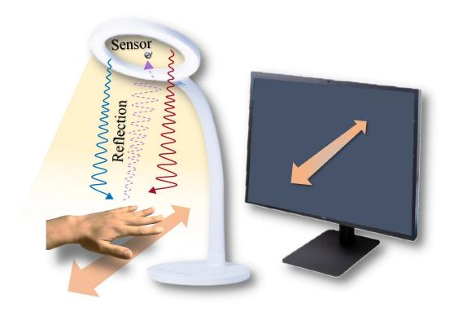

Fig. 1. Hand gesture recognition under VLC-capable lamp.

Fig. 2. Modeling the reflected HGR (r-HGR); colors emphasize different carriers (modulation frequency) of light emissions.

one hand, a *photodiode* (PD) is adopted as the sensor for cost reduction, but PD can obtain only light intensity (one-dimensional information). As intensity sensing can hardly capture any directional information, part of the spatial information concerning hand gestures gets lost. Therefore, one challenge is how to obtain more spatial information with only intensity sensing. On the other hand, since our design piggybacks on a table lamp, the table surface reflections could severely interfere with our gesture sensing function. Basically, the captured information by the PD contains reflections from both the hand and table surface, while the latter may vary significantly from specular to diffuse reflections respectively caused by smooth and rough surfaces. Therefore, another challenge is to recognize hand gestures under the reflection interference caused by the table surface.

In this paper, we propose ReflexGest as our answer to the aforementioned challenges. In order to endow directional information to reflected VL-HGR, we leverage the common design of a ring-shaped light-emitting diode (LED) table lamp containing multiple LED chips regularly distributed along the ring: instead of using all these chips together, we partition them into four equal sections, as illustrated in Fig. 2, respectively indicating the four directions. We program these sections to emit light of distinct modulation frequencies in the baseband commonly adopted by multi-carrier VLC systems [\[34\],](#page-11-0) so that their individual reflections incurred by a gesture can be readily differentiated by the PD. This simple yet effective design upgrades a PD with limited sensing ability to capture directional information. In addition, we propose two methods to tackle the second challenge of background interference. A light-weight method demands a dark pad with a rough surface as an accessory of ReflexGest; it entails a very efficient neural model to obtain excellent HGR accuracy. Another more sophisticated method exploits the adversarial domain adaptation scheme [\[35\]](#page-11-0) to train a slightly more complicated neural model, so that the model extracts only the features concerning the gesture information, regardless of what table surfaces are involved. In summary, we make the following major contributions:

- - We propose ReflexGest as a novel ISAC design of HGR system, piggybacking onto VLC-capable table lamps.
- - We engineer the light emitting scheme of the lamp, so as to embed spatial information of hand gestures into the reflections to be captured by a PD.
- - We propose two methods to effectively recognize hand gestures via their unique correlations with the reflections; they make ReflexGest universally deployable regardless of the reflection interference caused by table surfaces.
- - We implement a ReflexGest prototype; our extensive evaluations clearly demonstrate that ReflexGest can deliver accurate HGR under realistic VLC traffic.

The rest of the paper is organized as follows. Section II introduces the background and uses experiments to motivate our design. Section [III](#page-3-0) presents the system design of ReflexGest. Implementation and extensive evaluations are then reported in Section [IV.](#page-6-0) Related literature and the limitations of ReflexGest are discussed in Section [V.](#page-9-0) Finally, Section [VI](#page-10-0) concludes our paper.

# II. BACKGROUND AND MOTIVATION

We set up the background and motivate ReflexGest design in this section. We first clarify the limit of through HGR (or t-HGR), and we then explain the superiority of reflected HGR (or r-HGR), via a concrete model to characterize the process of reflection sensing. Finally, we use experiments to motivate the design of ReflexGest.

### *A. Primers for Reflected HGR (r-HGR)*

Given its ubiquity in real-life scenes, visible light has a good potential to serve as ISAC medium [\[36\],](#page-11-0) [\[37\],](#page-11-0) [\[38\],](#page-11-0) [\[39\].](#page-11-0) In particular, as table lamp is commonly used by people working at the table and its light emission illuminates the surroundings, it is a natural idea for users to leverage the same medium for HGR, hence calling for a design aiming to realize the VL-HGR function. Existing proposals mainly focus on t-HGR [\[31\],](#page-11-0) [\[33\],](#page-11-0) but such methods bear obvious limitations: since multiple PDs are set on the bottom as receivers, the design occupies the available space on the table (hence hampering concurrent VLC downlinks), while weakening the system integrity and increasing the system complexity. On the contrary, r-HGR design overcomes 

{2}------------------------------------------------

all the above weaknesses by putting the PD receiver on the same side as the LED transmitter; performing HGR via the reflected light intensity also spare the table surface potentially reused by VLC down-links.

In order to characterize the reflected light intensity, we leverage the Lambertian radiation pattern [40] shown in Fig. 2. Since reflected light is a case of non-line-of-sight propagation, the light channel gain can be represented as [41]:

$$h = \frac{(m+1)A}{2\pi^2 d_1^2 d_2^2} \rho dA_s \cos^m(\phi) \cos(\psi) \cos(\alpha) \cos(\beta), \quad (1)$$

where m is the Lambertian emission order of transmitter LED, determined by the semi-angle of half power  $\tilde{\phi}$  as:

$$m = \frac{-\ln 2}{\ln\left(\cos\tilde{\phi}\right)}. (2)$$

In particular,  $\phi$  and  $\psi$  respectively represent the emission angle of LED and receiving angle of PD.  $d_1$  and  $d_2$  are the distances between reflecting point to LED and PD.  $\alpha$  is the incident angle of reflecting point, and  $\beta$  is the scattering angle of reflecting point. A is the effective area of the PD.  $\rho$  is an optical related constant and  $dA_s$  is a reflective area of small region. Note that  $\psi$  must be less than the *field of view* (FoV)  $\psi_{\text{fov}}$  of receiver, i.e., h=0 if the  $\psi>\psi_{\text{fov}}$ .

In our r-HGR design, the overall light intensity received by PD is divided into two parts: reflected light from the hand and the table surface as illustrated in Fig. 2. Assuming in total L LED chips in the ring-shaped array with a homogeneous transmitting power p, the time-varying (reflection) channel gain  $h_i(t)$  for the i-th chip during HGR process can be divided into  $h_i^{\rm hand}(t)$  and  $h_i^{\rm surf}(t)$ , representing the varying reflections from the hand and table surface, respectively. Consequently, the light intensity r(t) received by the PD becomes:

$$r(t) = \omega p \sum_{i=1}^{L} \left( h_i^{\text{hand}}(t) + h_i^{\text{surf}}(t) \right) + n(t), \tag{3}$$

where  $\omega$  is the responsivity of the PD and n(t) represents the ambient noise. It is worth noting that, while the time-varying channel gain characterizes the temporal variation of hand gestures, the difference of these gains (with respective to chips spatially distributed at distinct positions) offers a potential to endow directional information to our design. Although the model brings important insights to motivate our design, model-based approaches are often not practical due to their high run-time complexity and the hardness in determining specific parameters (e.g., the fraction of  $h_i^{\rm hand}(t)$  out of  $h_i(t)$ ). Therefore, one still has to rely on a data-driven learning approach.

#### B. Gaining Directional Information

Involving spatially distributed LED chips (indicated by the subscript i for  $h_i(t)$ ) does offer a potential to gain direction information for HGR, but the summation in (3) has totally annihilated this potential. We hereby use simple experiments to compare two inputs to drive HGR: i) directly taking r(t) in (3), and ii) separating r(t) into two streams by applying carriers

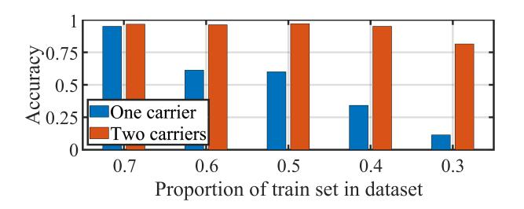

Fig. 3. The accuracy of r-HGR with various carriers under decreasing proportion of train set in dataset.

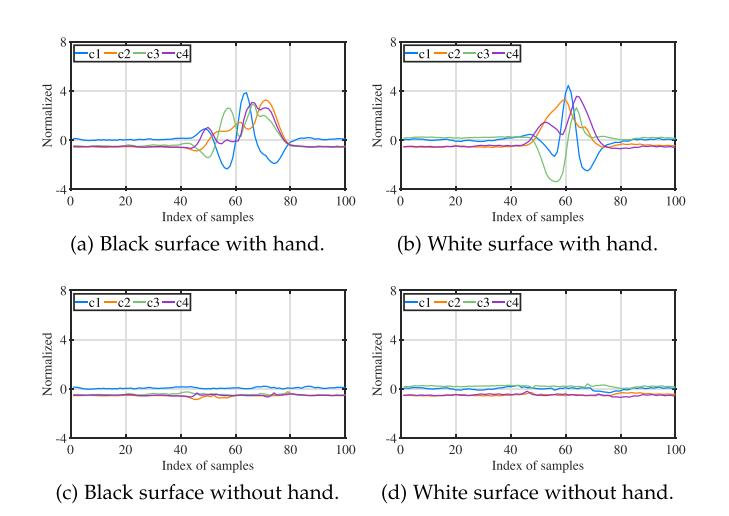

Fig. 4. Reflection intensity under different table surfaces and with or without gestures, the  $\{c_i\}$  referring to light carriers.

with distinct modulation frequencies. We respectively collect 10 classes of hand gestures (diagrams shown in Fig. 10) upon a black table surface, then we adopt our base-design of ReflexGest (presented in Section III-D) to perform HGR. Furthermore, we gradually decrease the proportion of train set in dataset to evaluate the trend of recognition accuracy, and results are shown in Fig. 3. It can be observed that the recognition performance of two carriers constantly outperforms one carrier. Meanwhile, the decreasing proportion of train set barely degrades the accuracy of two carriers, while the accuracy of one carrier has a sharp fall. Additionally, the accuracy of two carriers still maintains above 90% in 0.4 proportion, and is 50% higher than the accuracy of one carrier. Apparently, two modulation frequencies light emitting is more robust for gaining the directional information and motivating us to adopt multi-carrier design in ReflexGest.

# C. Interference of Different Table Surfaces

As discussed in Section II-A, the received light consists of two reflections respectively from user's hand and the table surface. Since the color and texture of a table surface determine its reflection property, they affect  $h_i^{\rm surf}(t)$  in (3) and hence the input for HGR r(t). Fig. 4 clearly shows the difference of normalized reflected light receiving under varying table surfaces and with or without gesture. It can be find that the gesture features are reflected in the fluctuation of intensity, and different table surfaces can cause discrepancies in the fluctuation. To

{3}------------------------------------------------

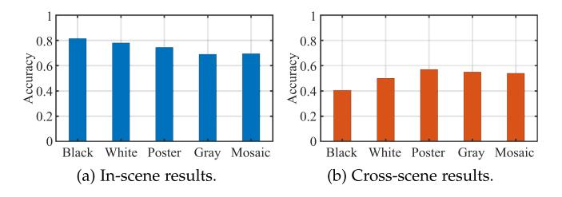

Fig. 5. The interference of various table surfaces.

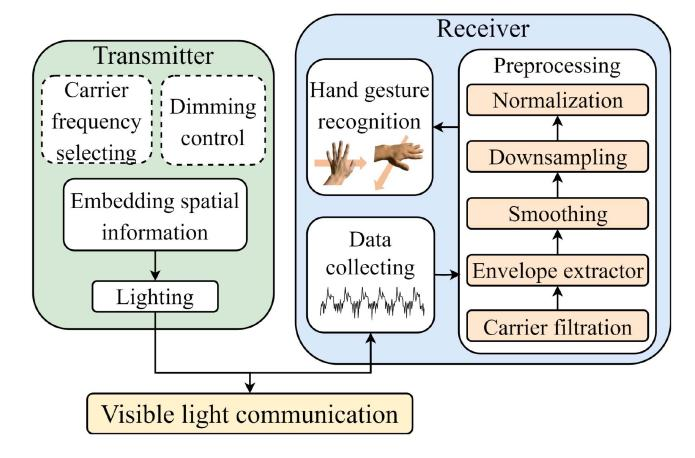

Fig. 6. System architecture of ReflexGest.

quantitatively study the impact on HGR caused by table surfaces, we set up two experiments: in-scene and cross-scene. The former uses disjoint training and testing datasets collected from the same table surface, and the latter trains the model with the data collected from one surface but tests it with those from another. Learning from a recent work [32], we choose *K-Nearest Neighbor* (KNN) to realize HGR.1 As shown in Fig. 5, the average accuracy of the in-scene experiment is around 75%, much higher than the 50% average accuracy achieved under the cross-scene one. Since adapting to various table surfaces is necessary for practical r-HGR, these results call for recognition schemes robust to the cross-scene scenarios.

#### III. REFLEXGEST: HGR VIA REFLECTED LIGHT

In this section, we first introduce the system overview of ReflexGest. Then we present the detailed design of transmitter and receiver of ReflexGest. Finally, we elaborate on two algorithm designs for ReflexGest; they strike different balances between hardware and algorithm complexities.

#### A. System Overview

ReflexGest is a system aiming to recognize in-air hand gestures by leveraging a VLC-capable lamp and its system architecture is shown in Fig. 6. Envisioned as an ISAC design, ReflexGest is considered as a full-duplex VLC system, attaching the sensing ability of r-HGR. Therefore, ReflexGest is mainly

consisted of two parts: transmitter and receiver. The transmitter emits modulated light to deliver VLC data for communication and also embed spatial information into VLC data stream with multi-carrier design. As for the receiver side, it is devised for receiving VLC data2 and the reflected light by hand gesture for sensing. In particular, to address the challenge caused by various table surfaces as described in Section II-C, we equip ReflexGest with two HGR algorithm designs, leveraging either a hardware trick or the adversarial domain adaptation to achieve r-HGR. We will elaborate the details of ReflexGest one by one in the following subsections.

#### B. Transmitter

To embed spatial information in VLC data stream, the LED chips on ReflexGest's transmitter are divided into *four* groups and transmit data with different carriers, so as to cover four distinct directions in 2D space. We choose modulation frequencies following common multi-carrier VLC system. Suppose the duty cycle of the LED pulse wave is  $\alpha$ , the amplitude is A, and the modulation frequency is  $f_c$ , then the Fourier series expansion of this pulse wave can be written as:

$$f(t) = \alpha A + \sum_{k=1}^{\infty} \frac{2A}{\pi k} \sin(\alpha k \pi) \cos(2\pi k f_c t), \qquad (4)$$

where f(t) indicates that the power of LED pulse wave can be decomposed into direct current component, the main frequency power (when k = 1) and a large number of harmonics (when k > 1). This implies that the *i*-th group of LED chips running on a modulation frequency of  $f_c$  results in not only the main frequency power peak at  $f_c$ , but also small power distribution at all harmonic frequencies. Therefore, to avoid the interference across the LED groups, the selected modulation frequencies should be ensured that their harmonic frequencies do not overlap with the main frequencies of the other carriers. In addition, deemed as a desk lamp, the flicker of LEDs should not be perceived by human eyes during data transmission and r-HGR, resulting in the modulation frequency of  $f_c$  should be over 200 Hz according to previous study [36]. Meanwhile, according to the Nyquist-Shannon sampling theorem [42],  $f_c$  should be less than  $\frac{J_s}{2}$ , where  $f_s$  is the sampling rate of 500 kHz in our current implementation of ReflexGest. Subject to above constraints, we set the modulation frequencies for the four LED groups as 40 kHz, 50 kHz, 60 kHz, and 70 kHz, respectively.

Due to its ISAC nature, ReflexGest's transmitter has to support both HGR and VLC concurrently. According to IEEE standard [43], dimming control is necessary for VLC. Existing methods are normally realized by inserting illumination symbols [44] or embedding high-frequency Pulse-Width Modulation (PWM) [45] into VLC data to change average current on the LED for dimming control. However, those schemes are sacrificing spectral efficiency or aggravating transmitter complexity. To this end, we re-visit the design of VLC transmitter and propose a

&lt;sup>1Since HGR-based HCI usually demands low latency, KNN is actually an incompetent solution due to its high run-time complexity.

&lt;sup>2Due to the up-link data in VLC is normally small and working on a relatively higher frequency, we take the up-link VLC data transmission as pulse noise in ReflexGest and focus on the low-frequency light variation caused by hand gesture in this work.

{4}------------------------------------------------

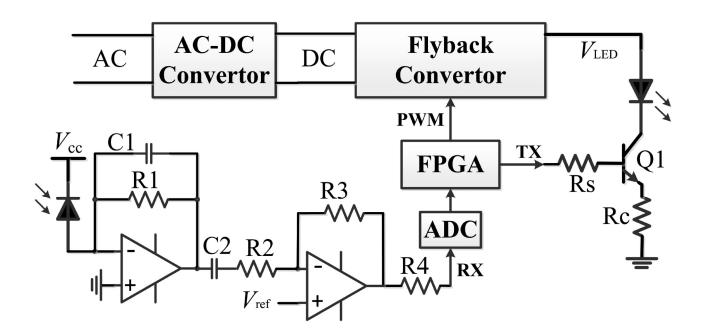

Fig. 7. Circuit diagram of ReflexGest.

two-stage control scheme for ReflexGest's transmitter. Essentially, the transmitter circuitry is split into two parts: voltage control and light modulation, as illustrated in the upper section of Fig. 7. Alternating current (AC) from the power grid is fed into an AC-DC convertor to get stable direct current (DC) which can be further adjusted to deliver variable DC voltage (marked by  $V_{\rm LED}$  in Fig. 7) via low-frequency PWM controlling the flyback convertor. As for light modulation, low-cost MOSFETs are used to control the LED groups "on" or "off" according to the transmitted data bits. This simple yet delicate design in ReflexGest can achieve dimming control by adjusting the duty cycle of low-frequency PWM but not bothering VLC data transmission.

#### C. Receiver

The receiver of ReflexGest is devised for both hand gesture sensing and VLC data reception so as to realize the ISAC ambition. Basically, the receiver is co-located with the transmitter and sharing the same controller of a field programmable gate array (FPGA) to achieve full-duplex communication via VLC, as shown in Fig. 7. In particular, the receiver part consists of a PD and a two-stage amplifier as an analog chain. The PD is used to capture the mixed light signals which combine hand gesture reflection with VLC user's up-link data and convert light signals into tiny current. The current signals are further conditioned and amplified by the two-stage amplifier, where the first stage is a transimpedance amplifying circuit to transfer tiny photocurrent to voltage signal with a fixed gain; the second stage is a voltage amplifying circuit to further enlarge the voltage signals for driving an ADC. The FPGA controller preprocesses digital data from the ADC and forwards them to a computer via Ethernet for HGR currently, and we leave it as future work to realize real-time HGR on the FPGA.

As mentioned in Section II-B, a single PD can only obtain one-dimensional sensing data with light intensity variance caused by hand gestures, which results in hardly realizing HGR. ReflexGest embeds spatial information into VLC data stream via multi-carrier setting. Thus, how to extract distinguishing hand gesture features from the one-dimensional data (as shown in Fig. 8(a)) is challenging. Meanwhile, ambient light and VLC up-link data may also interfere with sensing data, ReflexGest hence needs delicate data preprocessing to extract sufficient features for HGR classifier. Fig. 8 depicts the process of data

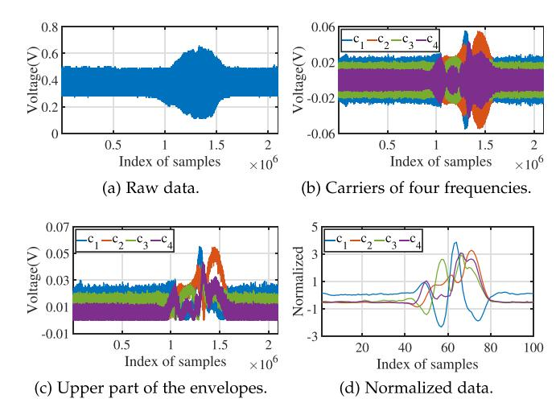

Fig. 8. The process of data preprocessing. (a) One-dimensional time-domain raw data obtained by PD. (b) The carriers of four frequencies obtained by bandpass filters. (c) The envelopes extracted from the four carriers. (d) The data ready for recognition after smoothing, downsampling and normalization.

preprocessing in ReflexGest' receiver. Generally, user's hand gestures may cause significant low-frequency fluctuations in sensing data as illustrated in Fig. 8(a), we so set a threshold empirically to segment the gesture data. To avoid losing valuable information, a fragment of data before and after the segment are also retained in ReflexGest.

After signal segmentation, four band-pass filters are used to extract the four carriers to obtain the spatial information embedded, at the same time, ambient light noise is also filtered out thanks to the band-pass filters. The envelopes of these resulted carriers are exactly indicating hand gesture, due to user's hand gesture normally results in low-frequency fluctuation in time domain compared to VLC data stream. To reduce computational complexity and memory consumption, we only use the upper part of the envelopes for HGR and smooth the envelopes using a sliding average filter. We further downsample the upper envelopes of each carrier to shrink data samples from over  $2 \times 10^6$  to 100, but they are still enough for HGR thanks to our novel multi-carrier design in ReflexGest's transmitter. As a common procedure for using advanced machine learning algorithms for HGR [32], Z-score normalization is performed and the final preprocessed results are shown in Fig. 8(d). Given these indicative gesture sensing results, we are able to step on to two HGR algorithm designs of ReflexGest in the following.

# D. Base-Design of ReflexGest (bReflexGest)

As discussed in Section II-C, the reflection interference caused by varying table surfaces makes ReflexGest face the cross-scene challenge. To tackle this problem, we propose two designs of ReflexGest based on a trade-off between hardware and algorithm complexities. In this section, we first adopt a hardware trick with an efficient neural model for the cross-scene problem. Considering the table surface of r-HGR in daily life almost keeps invariant, it provokes us a base-design of ReflexGest (or bReflexGest) that puts a dark pad on the table surface as an accessory of ReflexGest to avoid the cross-scene problem.

{5}------------------------------------------------

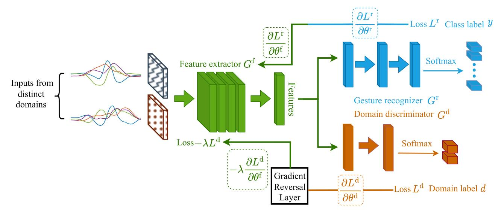

Fig. 9. The adversarial domain adaption scheme: a combination of CNN and domain adversarial learning.

Correspondingly, we choose a *convolutional neural network* (CNN) based scheme to achieve hand gesture recognition. In particular, let x denote the preprocessed reflected light intensity data with the hand gesture class label y. We adopt a feature extractor  $G^{\rm f}$  to extract the hand gesture features and then classify the class labels via a gesture recognizer  $G^{\rm r}$ , which are shown in the green and blue parts of Fig. 9. The cross entropy loss function can be expressed as:

$$\mathcal{L}_{\mathbf{x},\mathbf{y}}\left(\theta^{\mathbf{f}},\theta^{\mathbf{r}}\right) = \mathbb{E}_{\mathbf{x},\mathbf{y}}\left[L^{\mathbf{r}}\left(G^{\mathbf{r}}\left(G^{\mathbf{f}}\left(x\right)\right),y\right)\right],\tag{5}$$

where  $\theta^f$  and  $\theta^r$  respectively represent the parameters of  $G^f$  and  $G^r$ . The target of  $\mathcal{L}_{x,y}(\theta^f,\theta^r)$  is to minimize the label classification error, hence achieving the HGR of bReflexGest.

### E. Cross-Scene ReflexGest (cReflexGest)

We further propose the cross-scene ReflexGest (or cReflexGest) to handle the cross-scene problem by adopting a more sophisticated recognition algorithm, yet decreasing the hardware complexity via removing the dark pad. Inspired by [35], we integrate an adversarial domain adaption scheme into the CNN for achieving cross-scene HGR. Built upon the idea, cReflexGest eliminates the distribution discrepancy of hand gesture features from different scenes (e.g., table surfaces) in latent space, and correctly classifies the cross-scene hand gesture labels. Specifically, the adversarial domain adaption scheme embeds a domain discriminator structure [46] into the standard feed-forward architecture formed by the feature extractor  $G^{f}$  and the gesture recognizer  $G^{r}$ . The domain adaptation is achieved by the domain discriminator  $G^{d}$  connected to the  $G^{f}$  via a gradient reversal layer (GRL) that multiplies the gradient by a certain negative constant during the backpropagation-based training, as shown in Fig. 9. Mathematically, let x and x' respectively denote preprocessed reflected light intensity data from distinct scenes with the same hand gesture class labels y. Our goal is to jointly train the  $G^{\rm f}$  and  $G^{\rm d}$ , hence reconciling the distribution discrepancy between the x and x', making  $G^f$  extract the hand gesture features irrelevant to the scenes, then  $G^{\mathrm{r}}$  accurately classifying the label y. We assume that  $\tilde{x}=x\cup x'$  and d represents domain label of the  $\tilde{x}$ . Thus, the cross entropy loss function  $\mathcal{L}_{\tilde{\mathbf{x}},\mathrm{d}}(\theta^{\mathrm{f}},\theta^{\mathrm{d}})$  can be implemented as:

$$\mathcal{L}_{\tilde{\mathbf{x}},d}\left(\theta^{f},\theta^{d}\right) = \mathbb{E}_{\tilde{\mathbf{x}},d}\left[L^{d}\left(G^{d}\left(G^{f}\left(\tilde{x}\right)\right),d\right)\right]. \tag{6}$$

The target of  $G^{\rm d}$  is to distinguish which scene the data comes from, so the  $\mathcal{L}_{\tilde{\mathbf{x}},{\rm d}}$  should be maximized for confusing  $G^{\rm d}$ . A GRL is implemented between the  $G^{\rm f}$  and  $G^{\rm d}$  to forcefully reverse the gradient of  $\mathcal{L}_{\tilde{\mathbf{x}},{\rm d}}$  before it propagates back to  $G^{\rm f}$ , so as to affect the parameters there negatively. The GRL can be formulated as:

$$R_{\lambda}(\tilde{x}) = \tilde{x},$$

$$\frac{\partial R_{\lambda}}{\partial \tilde{x}} = -\lambda \mathbf{I},$$
(7)

where  $R_{\lambda}(\tilde{x})$  represents the GRL function,  $\lambda$  is a positive constant, and I is an identity matrix. Combining (5), (6), and (7), the overall cross entropy loss function of the adversarial domain adaption scheme becomes:

$$\mathcal{L}\left(\theta^{f}, \theta^{r}, \theta^{d}\right) = \mathcal{L}_{x,y}\left(\theta^{f}, \theta^{r}\right) + \mathcal{L}_{x',y}\left(\theta^{f}, \theta^{r}\right) - \lambda \mathcal{L}_{\tilde{x},d}\left(\theta^{f}, \theta^{d}\right),$$
(8)

and all the parameters are optimized as:

$$\begin{pmatrix} \hat{\theta}^{f}, \hat{\theta}^{r} \end{pmatrix} = \underset{\theta^{f}, \theta^{r}}{\operatorname{arg\,min}} \mathcal{L} \left( \theta^{f}, \theta^{r}, \hat{\theta}^{d} \right), 
\hat{\theta^{d}} = \underset{\theta^{d}}{\operatorname{arg\,max}} \mathcal{L} \left( \hat{\theta}^{f}, \hat{\theta}^{r}, \theta^{d} \right).$$
(9)

The scheme guarantees that  $G^{\rm f}$  extracts the cross-scene hand gesture features and  $G^{\rm r}$  correctly predicts the class labels, so as to achieve generalization performance on other unseen scenes while maintaining the performance on the training scenes.

{6}------------------------------------------------

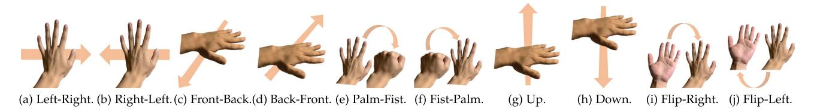

Fig. 10. Diagrams of hand gesture sets.

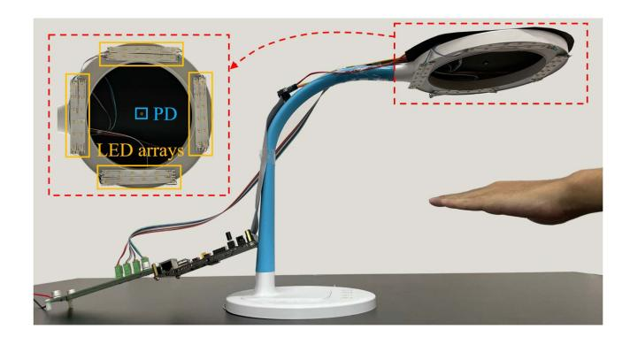

Fig. 11. The prototype of ReflexGest.

#### IV. PERFORMANCE EVALUATION

In this section, we introduce the system implementation and hand gesture dataset, then we evaluate the recognition performance of ReflexGest under different experiment setups, and finally, the communication capability of ReflexGest during performing gestures is studied to show its ISAC potential.

#### A. Implementation and Dataset Acquisition

To quickly evaluate the performance of ReflexGest, we implement a prototype by attaching LED array strips as the transmitter and a PD as the receiver on a commercial desk lamp to mimic the LiFi lamp [8] for achieving bidirectional VLC and r-HGR, as shown in Fig. 11. As detailed in Section III-B, the transmitter consists of an AC-DC convertor, a flyback convertor, LED drivers, and LED strips to convert the AC input to modulated signals, then driving the LED strips emitting modulated light. In particular, the LED array strips carrying totally 48 LED chips consuming a maximum power of 12 W are equally divided into four groups which are driven by four low-cost MOSFETs (SI2310). As for the receiver, we choose a PD which belongs to Hamamatsu S5971 [47], the PD has a 320 to 1060 nm spectral response range and a  $7.4 \times 10^{-15}$  W/Hz1/2 noise equivalent power. The light signals captured by the PD are amplified by a two-stage amplifier built upon commercial amplifiers (LTC6268IS8), and converted to digital signals by an ADC (AD9226ARS). Both the transmitter and receiver of ReflexGest share an identical controller of ZYNQ-7020 which belongs to ALINX, the controller integrates two ARM Cortex-A9 cores and a 28 nm Xilinx FPGA [48], for encoding VLC data and processing received signals.

The software setting of ReflexGest is based on Python 3.7, with the deep learning network built upon PyTorch 1.7.1 [49].

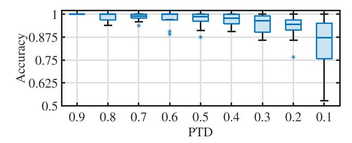

Fig. 12. bReflexGest performance under varying PTDs.

The network is trained on an NVIDIA GeForce GTX 1650 GPU [50]. For the neural network structure, the feature extractor  $G^{\rm f}$  consists of four repeated units of a one-dimensional convolution layer with kernel size 3, followed by a batch normalization, a ReLU (rectified linear unit) and a max-pooling layer with stride 2. The domain discriminator  $G^{\rm d}$  consists of a GRL with two fully-connected layers each followed by a ReLU layer, and a softmax function is in the ending. The gesture recognizer  $G^{\rm r}$  consists of three fully-connected layers each followed by a ReLU layer with a softmax function in the ending.

As for the dataset, we collect 10 classes of hand gestures on 5 different table surfaces (namely black, white, mosaic, poster, and gray) with 8 users (5 males and 3 females) in the age range of 20 to 30. The specific hand gestures are shown in Fig. 10, namely Left-Right (LR), Right-Left (RL), Front-Back (FB), Back-Front (BF), Palm-Fist (PF), Fist-Palm (FP), Up (UP), Down (DN), Flip-Right (FR), Flip-Left (FL). Each gesture is collected within 4 seconds and repeats 20 times by each person in each setting, yielding total 3800 hand gesture segments and more than 380,000 samples. All the experiments are done with ReflexGest's transmitter sending irregular packets: audio streaming and text files.

#### B. Performance of bReflexGest

We start with evaluating the bReflexGest performance. We first explore the impact of various train set proportions in the whole dataset. We further study the impact of different users and luminances with a fixed train set proportion. Comparison experiments adopt the KNN algorithm as the baseline [32].

1) Impact of Varying Train Set Proportions: First, we consider the gradually decreasing proportions of train set in dataset (PTD) in the experiment, and the recognition accuracies of ten classes of hand gestures are drawn as box diagrams shown in Fig. 12. It can be observed that all the accuracies are relatively high (more than 90%) even occurring a few outliers when the PTD  $\geq 0.4$ , then the recognition accuracy distribution slightly

{7}------------------------------------------------

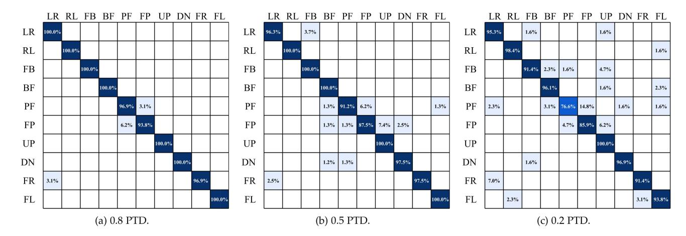

Fig. 13. The confusion matrices of bReflexGest performance given three fixed PTDs.

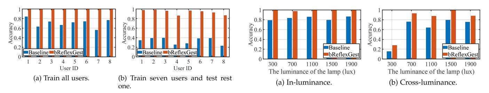

Fig. 14. bReflexGest performance under varying users.

Fig. 15. bReflexGest performance under varying luminances.

becomes spread with the PTD decreasing to 0.2, and finally appears a distinct scatter when the PTD is 0.1. Specifically, we further use three confusion matrices to show the detailed recognition performance of the ten classes of hand gestures with 0.8 PTD, 0.5 PTD, and 0.2 PTD shown in Fig. 13(b) and (c). It can be observed that the performance of 0.8 PTD obviously outperforms the other two PTD results. Additionally, we find that the worst recognized performance of hand gestures are most likely to fall into "PF" (Palm-Fist) and "FP" (Fist-Palm), with average accuracy rates of 96.9% and 93.8% in 0.8 PTD, 91.2% and 87.5% in 0.5 PTD, 76.6% and 85.9% in 0.2 PTD, respectively. This reason may be explained that the two hand gestures' movement ranges are smaller than the others, and the extraction of hand gestures features is relatively indistinguishable compared with other hand gestures, hence resulting in the incorrect recognitions. Consequently, bReflexGest shows a better performance at high PTD, thus we properly fix the PTD at 0.8 hereafter.

*2) Impact of Varying Users:* We further evaluate the performance of bReflexGest with different users. Specifically, we divide the evaluation into two sub-experiments: We first train all users' hand gestures and respectively test on each user's hand gestures. Afterwards, we choose seven users' hand gestures to train and test on the hand gestures of the remaining user. The results reported in Fig. 14 validate bReflexGest outperforms the baseline regardless of whether the tested user's hand gestures are involved in the train set. Fig. 14(a) shows that the accuracy of bReflexGest approaches 100% regardless of which user. Although the results in Fig. 14(b) have a slight drop, the average accuracy of bReflexGest still maintains a high level (around 94%) which indicates bReflexGest is robust for recognizing new user's hand gestures.

*3) Impact of Varying Luminances:* Intuitively, different lamp luminances may affect the recognition accuracy of bReflexGest since achieving HGR is based on the reflected light intensity received by the PD. In this experiment, we evaluate the performance of bReflexGest under varying lamp luminances from 300 lux to 1900 lux with a fixed user. In particular, we set two sub-experiments respectively called in-luminance and cross-luminance. The former one means that we train and test the hand gesture data collected in the same luminance setting. The latter one means that we train the hand gesture data collected in the fixed 1500 lux, and then evaluate the performance on the rest four luminance settings. Fig. 15(a) shows that the recognition accuracy of bReflexGest approaches 100% and outperforms the baseline in every luminance setting. Fig. 15(b) shows that the cross-luminance evaluation performance of bReflexGest still exceeds the baseline, while leaving a poor recognition accuracy in the 300 lux luminance. This may be explained by the fact that the huge discrepancy of received reflected light intensity between 300 lux and 1500 lux. Since the 300 lux luminance is incapable of meeting the daily illumination requirement, the cross-luminance performance confirms that bReflexGest is fully applicable to a reasonable yet wide luminance range without retraining.

*4) Impact of Varying Heights:* Since different positions and orientations of hand gesture may have impact of bReflexGest performance, we conduct experiments to test the system's robustness. We declare that the maximum distance between the VLC-capable desk lamp and the table surface is 40 cm, which

{8}------------------------------------------------

Fig. 16. bReflexGest performance under varying heights.

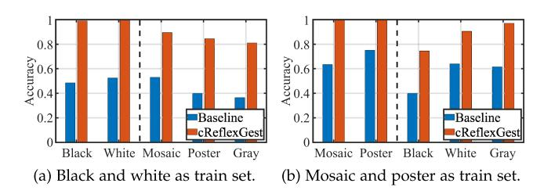

Fig. 17. cReflexGest performance in cross-scene.

is determined by the power of the LED arrays. Beyond this distance, the reflected light signal received by the PD experiences significant attenuation. For the orientations, the Fig. [10](#page-6-0) shows that our hand gesture sets contain different hand movement directions, we focus on the hand positions. Specifically, we evaluate the recognition accuracy under varying heights between hand and reflected surface from 5 cm to 25 cm, and we individually set two sub-experiments called in-height and cross-height. The former one means that training and testing data are in the same height setting, and the latter one fixes 15 cm height to evaluate the HGR performance on the rest four height settings. Fig. 16(a) shows that bReflexGest approaches 100 % recognition accuracy and is better than the baseline. Fig. 16(b) reveals that bReflexGest still exceeds the baseline under crossheight settings except 25 cm, it can be attributed that the hand is excessively closed to the lamp leads to significant discrepancy of received reflected light intensity compared with other heights. Fortunately, this situation hardly occurs in practical application scenarios, hence indicating bReflexGest is capable of meeting diverse positions and orientations HGR.

# *C. Performance of cReflexGest*

We then evaluate the cReflexGest's performance. The goal of cReflexGest is to tackle the cross-scene interference via the adversarial domain adaption scheme. Therefore, we first choose the train set and test set from different scenes (i.e., table surfaces) to evaluate the performance of cReflexGest under cross-scene situation. Furthermore, we increase the cross-scene difficulty via choosing the train set and test set from various user-scene pairs. Similarly, we adopt the KNN algorithm as the baseline.

*1) Cross-Scene:* As we have five table surfaces (black, white, mosaic, poster, and gray) involved in our dataset, we fix the user and luminance, then use two table surfaces (scenes) to train and respectively test on each scene (including train set scene), and the results are shown in Fig. 17. It can be observed that the average accuracy of all cross-scene results (right of

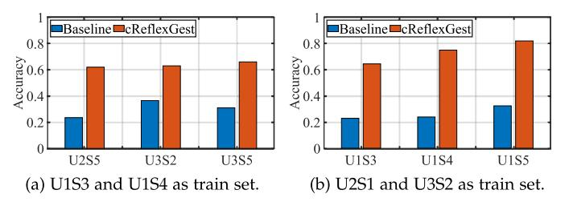

Fig. 18. cReflexGest performance in cross-pair.

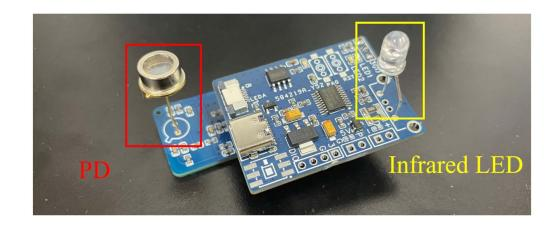

Fig. 19. An example of a VLC user in our tests.

the dashed line of Fig. 17(a) and (b)) are over 85%, and significantly outperforms the baseline. Additionally, we find that the performance of cross-scene black is relatively poor, and the fact may be explained that the black scene reflects less light than the other four scenes, resulting in the correlation between reflection variation and corresponding hand gestures relatively more different from other scenes.

*2) Cross-Pair:* To further evaluate the cross-scene capability of cReflexGest, we pick datasets for different users and scenes to form various pairs, then make the train set and test set come from different pairs. In particular, we form 7 pairs respectively called user1-poster (U1S3), user1-gray (U1S4), user1-mosaic (U1S5), user2-black (U2S1), user2-mosaic (U2S5), user3-white (U3S2), user3-mosaic (U3S5), and results are shown in Fig. 18. It can be observed that the cross-pair performance of cReflexGest outperforms the baseline, while the overall performance is barely satisfactory and requires to be improved. Additionally, we find that the average accuracy of results in Fig. 18(b) is better than the results in Fig. 18(a). This may be explained that the train set pairs of Fig. 18(a) are from the same user while the train set pairs of Fig. 18(b) are from different users, hence the network of Fig. 18(b) owns more robust domain adaption capacity.

### *D. Communication Performance of ReflexGest*

In order to study the ISAC capability of ReflexGest, we employ a VLC based IoT monitoring sensor to serve as a VLC user in ReflexGest, which is a transceiver incorporating a light receiver (i.e. PD) and a light emitter (i.e. infrared LED) shown in Fig. 19. The VLC user is a light detector placed on the table, which can detect the light intensity of the desktop in real-time and feed back to the lamp to achieve constant illumination. Specifically, we evaluate its up-link transmission and down-link transmission respectively, and use bit error ratio (BER) as the indicator. To simplify the experimental setup, the data rate is fixed at 50 kbps for both up-link and down-link transmission in the experiments, but a higher data rate is also feasible. During

{9}------------------------------------------------

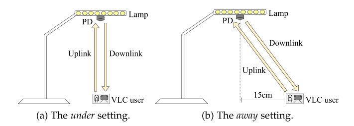

Fig. 20. The experiment setup of up-link/down-link communication test of ReflexGest.

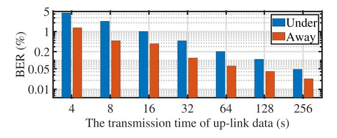

Fig. 21. The up-link BER of ReflexGest under gesture interference.

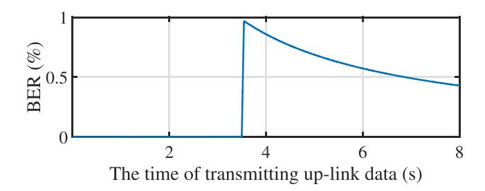

Fig. 22. The BER result when transmitting 8 s of up-link data in the *under* setting while performing gesture LR.

data transmission, we perform two kinds of gestures, i.e. LR and UP gestures. Only one gesture is performed randomly once per transmission, and the average BER results are reported.

- *1) Up-Link Transmission:* Visible light up-link communication is the transmission of light data from a VLC user to a VLC receiver. In this experiment, the VLC user is an infrared LED set opposite the lamp, and the VLC receiver is the PD originally set in the center of the lamp. To evaluate the up-link transmission of ReflexGest, the experiment setup is shown in Fig. 20. Specifically, we set up two cases: one is putting the VLC user directly *under*the lamp (Fig. 20(a)), and the other is putting the user 15 cm *away* from the lamp (Fig. 20(b)). The average BER results are reported in Fig. 21. As the amount of transmitted data increases, the proportion of gesture time in communication time decreases, and the average BER decreases accordingly. Fig. 22 shows an example of BER when transmitting 8 s of up-link data in the *under* setting while performing gesture LR. In this example, the LR gesture was performed during the 3 s and 4 s, resulting in an increase in BER. Besides, when the VLC user is away from the HGR area, performing gestures would not interfere severely with the communication.
- *2) Down-Link Transmission:* The down-link VLC is the transmission of light data from a VLC transmitter to a VLC user.

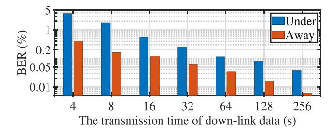

Fig. 23. The down-link BER of ReflexGest under gesture interference.

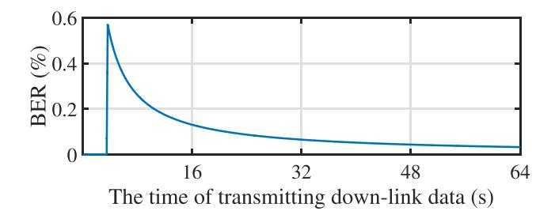

Fig. 24. The BER results when transmitting 64 s of down-link data in the *away* setting while performing gesture UP.

As for ReflexGest, the VLC transmitter is the LED arrays of the lamp, and the VLC user is a PD on the table. The experiment setup is also shown in Fig. 20, and we also conduct the *under* and *away* experiments as Section IV-D1. The experiment results are shown in Fig. 23 which are similar with the results of up-link transmission (Fig. 21). Fig. 24 also shows an example of BER when transmitting 64 s of down-link data in the *away* setting while performing gesture UP. In this example, the UP gesture was performed during the 0 s and 8 s, resulting in an increase in BER. Besides, although the data rate is fixed at 50 kbps for the communication experiments, the throughput of the current ReflexGest prototype is up to 220 kbps with the selected frequencies as presented in Section [III-B](#page-3-0) and OOK (On-Off Keying) modulation. Moreover, the BER of down-link is lower than that of up-link thanks to the down-link having a much higher transmission power to achieve both communication and illumination in VLC compared to the up-link from terminal devices. Nevertheless, in realistic LiFi applications via VLC lamps, down-link data is much huger than up-link and VLC users are usually placed around the VLC lamp, we hence believe these evaluations strongly confirm the ISAC capability of ReflexGest for realizing gesture recognition without bothering concurrent data communication.

# V. RELATED WORK AND DISCUSSIONS

As the superiority of device-free HGR over device-based HGR and the relevant literature on (device-free) VL-HGR have been studied in Sections [I](#page-0-0) and [II-A,](#page-1-0) we hereby survey only the proposals on device-free HGR. While our ReflexGest compares favorably with these proposals, we still discuss two limitations of the current ReflexGest prototype.

Ubiquitously presented in our daily life, Wi-Fi has been intensively used for HGR [\[17\],](#page-10-0) [\[18\],](#page-10-0) [\[19\],](#page-10-0) among other human sensing tasks. WiGest [\[19\]](#page-10-0) leverages Wi-Fi signal strength 

{10}------------------------------------------------

changes caused by hand to achieve HGR. WiDraw [17] uses AoA (angle-of-arrival) values of incoming wireless signals at mobile device to track a user's hand trajectory. Widar3.0 [18] extracts body velocity profiles to realize cross-domain HGR, where the domain refers to specific body orientation. However, the coverage of Wi-Fi signals is too broad to endow HGR with any location-sensitive meaning (e.g, the specific device to be controlled by HGR-enabled HCI), Wi-Fi HGR may not be desirable for certain applications.

As for another active sensing medium, acoustic signals have also been explored for HGR [25], [26]. Strata [25] adopts a smartphone to transmit acoustic signals and exploits the signals reflected by hand for HGR, while smart speakers are used in [26] to realize a similar function; it is based on more fine-grained parameter estimations (e.g., ranging and AoA) to profile hand motions. Obvious drawbacks of acoustic HGR include low energy efficiency, producing audible interference, and susceptible to ambient interference, but VL-HGR can eliminate all these issues, with an additional bonus in achieving an ISAC design by piggybacking onto VLC-ready products.

As the first ISAC prototype for integrating HGR with VLCready products, ReflexGest still bears two issues to be further explored in our future work. On one hand, the performance of HGR simultaneously crossing users and scenes may still need further elevation, though it is already much better than the baseline. Therefore, we are on the way to investigating the cross muti-domain HGR method. On the other hand, we currently process HGR on a PC to avoid detailed code optimization to fit the system into the VLC-ready products. We leave the real-time HGR on the FPGA as future work.

# VI. CONCLUSION

As a pervasive approach towards HCI, HGR retains the potential for ISAC design combined with VLC-ready devices. This ideal provokes us to come up with a reflected HGR design to fulfill HGR and VLC simultaneously, yet this design faces challenges from spatial information loss and background (reflection) interference. To this end, we implement ReflexGest, a HGR/VLC-capable table lamp with carefully engineered hardware designs and customized deep learning models to achieve effective visible-light-enabled HGR. Adopting four LED arrays on different directions of a ring-shaped lamp to emit lights with distinct modulation frequencies, ReflexGest acquires directional hand gesture information. Upon such information, ReflexGest is equipped with two algorithm designs for performing HGR under different peripheral hardware settings. With extensive evaluations under several experiment settings, we have firmly demonstrated the promising performance of ReflexGest for accurate HGR under concurrent VLC data flows. We plan to improve ReflexGest with respect to a few of its limitations, hoping to push VL-ISAC concept to be adopted in wider scenarios.

# REFERENCES

- [1] Huawei, "Huawei mate 30," 2022. Accessed: Jul. 04, 2022. [Online]. Available:<https://consumer.huawei.com/en/phones/mate30/>
- [2] LG, "LG G8 ThinQ," 2022. Accessed: Jul. 19, 2022. [Online]. Available: <https://www.lg.com/us/cell-phones/lg-LMG820UMB-verizon-g8-thinq>

- [3] Ultraleap, "Leap motion," 2022. Accessed: Jul. 04, 2022. [Online]. Available:<https://www.leapmotion.com/>
- [4] N. Nooruddin, R. Dembani, and N. Maitlo, "HGR: Hand-gesturerecognition based text input method for AR/VR wearable devices," in *Proc. 2020 IEEE Int. Conf. Syst. Man Cybern.*, 2020, pp. 744–751.
- [5] A. Alanwar, M. Alzantot, B.-J. Ho, P. Martin, and M. Srivastava, "SeleCon: Scalable IoT device selection and control using hand gestures," in *Proc. 2nd IEEE/ACM Int. Conf. Internet-of-Things Des. Implementation*, 2017, pp. 47–58.
- [6] A. Celik, I. Romdhane, G. Kaddoum, and A. M. Eltawil, "A top-down survey on optical wireless communications for the Internet of Things," *IEEE Commun. Surv. Tut.*, vol. 25, no. 1, pp. 1–45, First Quarter 2023.
- [7] Signify, "Consistent high-speed connectivity through light," 2022. Accessed: Jul. 04, 2022. [Online]. Available: [https://www.signify.com/](https://www.signify.com/global/innovation/trulifi) [global/innovation/trulifi](https://www.signify.com/global/innovation/trulifi)
- [8] VLNComm, "LumiLamp LiFi enabled desklamp," 2022. Accessed: Jul. 26, 2022. [Online]. Available: [https://lifi.co/lifi-product/lumilamp-lifi](https://lifi.co/lifi-product/lumilamp-lifi-enabled-desklamp/)[enabled-desklamp/](https://lifi.co/lifi-product/lumilamp-lifi-enabled-desklamp/)
- [9] A. Picciotto and Oledcomm, "C-224 lamp uses LiFi technology to transmit data through light," 2025. Accessed: Jan. 06, 2025. [Online]. Available: [https://www.dezeen.com/2018/07/24/c-224-lamp-lifi-technology](https://www.dezeen.com/2018/07/24/c-224-lamp-lifi-technology-alexandre-picciotto-ecal-design/)[alexandre-picciotto-ecal-design/](https://www.dezeen.com/2018/07/24/c-224-lamp-lifi-technology-alexandre-picciotto-ecal-design/)
- [10] PureLiFi, "The first LiFi light antenna ready to connect billions of devices through light," 2025. Accessed: Jan. 06, 2025. [Online]. Available: [https:](https://www.purelifi.com/products/light-antenna-one/) [//www.purelifi.com/products/light-antenna-one/](https://www.purelifi.com/products/light-antenna-one/)
- [11] D. Zhang et al., "Fine-grained and real-time gesture recognition by using IMU sensors," *IEEE Trans. Mobile Comput.*, vol. 22, no. 4, pp. 2177–2189, Apr. 2023.
- [12] T. Zheng, C. Cai, Z. Chen, and J. Luo, "Sound of Motion: Real-time wrist tracking with a smart watch-phone pair," in *Proc. 41st IEEE Conf. Comput. Commun.*, 2022, pp. 110–119.
- [13] T. Zhao, J. Liu, Y. Wang, H. Liu, and Y. Chen, "Towards low-cost sign language gesture recognition leveraging wearables," *IEEE Trans. Mobile Comput.*, vol. 20, no. 4, pp. 1685–1701, Apr. 2021.
- [14] S. Shen, H. Wang, and R. R. Choudhury, "I am a smartwatch and I can track my user's arm," in *Proc. 14th ACM Annu. Int. Conf. Mobile Syst. Appl. Serv.*, 2016, pp. 85–96.
- [15] Microsoft, "Kinect for Windows," 2022. Accessed: Jul. 19, 2022. [Online]. Available: [https://www.microsoftstore.com.cn/vr-and-mr/azure](https://www.microsoftstore.com.cn/vr-and-mr/azure-kinect-dk)[kinect-dk](https://www.microsoftstore.com.cn/vr-and-mr/azure-kinect-dk)
- [16] P. Narayana, J. R. Beveridge, and B. A. Draper, "Gesture recognition: Focus on the hands," in *Proc. 31st IEEE Conf. Comput. Vis. Pattern Recognit.*, 2018, pp. 5235–5244.
- [17] L. Sun, S. Sen, D. Koutsonikolas, and K.-H. Kim, "WiDraw: Enabling hands-free drawing in the air on commodity WiFi devices," in *Proc. 21st ACM Annu. Int. Conf. Mobile Comput. Netw.*, 2015, pp. 77–89.
- [18] Y. Zheng et al., "Zero-effort cross-domain gesture recognition with Wi-Fi," in *Proc. 17th ACM Annu. Int. Conf. Mobile Syst. Appl. Serv.*, 2019, pp. 313–325.
- [19] H. Abdelnasser, K. Harras, and M. Youssef, "A ubiquitous WiFi-based fine-grained gesture recognition system," *IEEE Trans. Mobile Comput.*, vol. 18, no. 11, pp. 2474–2487, Nov. 2019.
- [20] S. Tan, J. Yang, and Y. Chen, "Enabling fine-grained finger gesture recognition on commodity WiFi devices," *IEEE Trans. Mobile Comput.*, vol. 21, no. 8, pp. 2789–2802, Aug. 2022.
- [21] Google, "Google Pixel 4," 2022. Accessed: Jul. 19, 2022. [Online]. Available: [https://www.google-mobile.cn/?product=pixel-4](https://www.google-mobile.cn/{?}product$=$pixel-4)
- [22] J. Lien et al., "Soli: Ubiquitous gesture sensing with millimeter wave radar," *ACM Trans. Graph.*, vol. 35, no. 4, pp. 1–19, 2016.
- [23] C. Zhang, J. Tabor, J. Zhang, and X. Zhang, "Extending mobile interaction through near-field visible light sensing," in*Proc. 21st ACM Annu. Int. Conf. Mobile Comput. Netw.*, 2015, pp. 345–357.
- [24] L. Yu, H. Abuella, M. Z. Islam, J. F. O'Hara, C. Crick, and S. Ekint, "Gesture recognition using reflected visible and infrared lightwave signals," *IEEE Trans. Human-Mach. Syst.*, vol. 51, no. 1, pp. 44–55, Feb. 2021.
- [25] S. Yun, Y.-C. Chen, H. Zheng, L. Qiu, and W. Mao, "Strata: Fine-grained acoustic-based device-free tracking," in *Proc. 15th ACM Annu. Int. Conf. Mobile Syst. Appl. Serv.*, 2017, pp. 15–28.
- [26] W. Mao, M. Wang, W. Sun, L. Qiu, S. Pradhan, and Y.-C. Chen, "RNNbased room scale hand motion tracking," in *Proc. 25th ACM Annu. Int. Conf. Mobile Comput. Netw.*, 2019, pp. 1–16.
- [27] K. Ling, H. Dai, Y. Liu, A. X. Liu, W. Wang, and Q. Gu, "UltraGesture: Fine-grained gesture sensing and recognition," *IEEE Trans. Mobile Comput.*, vol. 21, no. 7, pp. 2620–2636, Jul. 2022.

{11}------------------------------------------------

- [28] Y. Wang, J. Shen, and Y. Zheng, "Push the limit of acoustic gesture recognition," *IEEE Trans. Mobile Comput.*, vol. 21, no. 5, pp. 1798–1811, May 2022.
- [29] H. Liu, H. Ye, J. Yang, and Q. Wang, "Through-screen visible light sensing empowered by embedded deep learning," in *Proc. 3rd ACM Int. Workshop Challenges Artif.*, 2021, pp. 478–484.
- [30] D. Ma et al., "Recognizing hand gestures using solar cells," *IEEE Trans. Mobile Comput.*, vol. 22, no. 7, pp. 4223–4235, Jul. 2023.
- [31] T. Li, X. Xiong, Y. Xie, G. Hito, X.-D. Yang, and X. Zhou, "Reconstructing hand poses using visible light," *Proc. ACM Interactive, Mobile, Wearable Ubiquitous Technol.*, vol. 1, no. 3, pp. 1–20, 2017.
- [32] Z. Liao et al., "SMART: Screen-based gesture recognition on commodity mobile devices," in *Proc. 27th ACM Annu. Int. Conf. Mobile Comput. Netw.*, 2021, pp. 283–295.
- [33] H. Duan, M. Huang, Y. Yang, J. Hao, and L. Chen, "Ambient light based hand gesture recognition enabled by recurrent neural network," *IEEE Access*, vol. 8, pp. 7303–7312, 2020.
- [34] M. H. Shoreh, A. Fallahpour, and J. A. Salehi, "Design concepts and performance analysis of multicarrier CDMA for indoor visible light communications," *J. Opt. Commun. Netw.*, vol. 7, no. 6, pp. 554–562, 2015.
- [35] Y. Ganin et al., "Domain-adversarial training of neural networks," *J. Mach. Learn. Res.*, vol. 17, no. 1, pp. 2096–2030, 2016.
- [36] T. Li, C. An, Z. Tian, and C. A. T. X. Zhou, "Human sensing using visible light communication," in *Proc. 21st ACM Annu. Int. Conf. Mobile Comput. Netw.*, 2015, pp. 331–344.
- [37] T. Li, Q. Liu, and X. Zhou, "Practical human sensing in the light," in *Proc. 14th ACM Annu. Int. Conf. Mobile Syst. Appl. Serv.*, 2016, pp. 71–84.
- [38] Y. Yang, J. Hao, J. Luo, and S. J. Pan, "CeilingSee: Device-free occupancy inference through lighting infrastructure based LED sensing," in*Proc. 15th IEEE Int. Conf. Pervasive Comput. Commun.*, 2017, pp. 247–256.
- [39] N. Viet, I. Mohamed, R. Siddharth, J. Minitha, G. Marco, and R. Howard, "Eyelight: Light-and-shadow-based occupancy estimation and room activity recognition," in *Proc. 37th IEEE Conf. Comput. Commun.*, 2018, pp. 351–359.
- [40] J. Kahn and J. Barry, "Wireless infrared communications," *Proc. IEEE*, vol. 85, no. 2, pp. 265–298, Feb. 1997.
- [41] C. Chen, D. A. Basnayaka, X. Wu, and H. Haas, "Efficient analytical calculation of non-line-of-sight channel impulse response in visible light communications," *J. Lightw. Technol.*, vol. 36, no. 9, pp. 1666–1682, May 2018.
- [42] A. Jerri, "The shannon sampling theorem-its various extensions and applications: A tutorial review," *Proc. IEEE*, vol. 65, no. 11, pp. 1565–1596, Nov. 1977.
- [43] S. Yoon et al., IEEE Standard for Local and Metropolitan Area Networks– Part 15.7: Short-Range Optical Wireless Communications, IEEE Std 802.15.7–2018 (Revision of IEEE Std 802.15.7-2011), 2019, pp. 1–407.
- [44] S. H. Lee, S.-Y. Jung, and J. K. Kwon, "Modulation and coding for dimmable visible light communication," *IEEE Commun. Mag.*, vol. 53, no. 2, pp. 136–143, Feb. 2015.
- [45] Y. Yang, J. Hao, and J. Luo, "CeilingTalk: Lightweight indoor broadcast through LED-camera communication," *IEEE Trans. Mobile Comput.*, vol. 16, no. 12, pp. 3308–3319, Dec. 2017.
- [46] I. J. Goodfellow et al., "Generative adversarial nets," in *Proc. 27th Int. Conf. Neural Inf. Process. Syst.*, 2014, pp. 2672–2680.
- [47] Hamamatsu, "Silicon PIN photodiode S5971," 2024. Accessed: Nov. 03, 2024. [Online]. Available: [https://www.hamamatsu.com.cn/cn/zh-cn/](https://www.hamamatsu.com.cn/cn/zh-cn/product/optical-sensors/photodiodes/si-photodiodes/S5971.html) [product/optical-sensors/photodiodes/si-photodiodes/S5971.html](https://www.hamamatsu.com.cn/cn/zh-cn/product/optical-sensors/photodiodes/si-photodiodes/S5971.html)
- [48] ALINX, "XILINX ZYNQ7020 7000 ARM FPGA XC7Z020 AX7Z020B," 2024. Accessed: Nov. 03, 2024. [Online]. Available: [https://www.alinx.](https://www.alinx.com/detail/271) [com/detail/271](https://www.alinx.com/detail/271)
- [49] A. Paszke et al., "PyTorch: An imperative style, high-performance deep learning library," 2019, *arXiv: 1912.01703*.
- [50] NVIDIA, "GET super powers geforce GTX 16 series," 2022. Accessed: Jul. 19, 2022. [Online]. Available: [https://www.nvidia.cn/geforce/](https://www.nvidia.cn/geforce/graphics-cards/16-series/) [graphics-cards/16-series/](https://www.nvidia.cn/geforce/graphics-cards/16-series/)

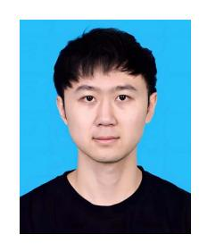

**Ziwei Liu** received the ME and BE degree from Sichuan University, China. He is currently working toward the PhD degree with the College of Computer Science, Sichuan University, China. His research interests include mobile computing, visible light communication and sensing, deep learning and their applications in IoT.

**Jifei Zhu** received the BE and ME degrees from the College of Computer Science, Sichuan University, China. Her research interests include visible light sensing, human-computer interaction, and deep learning.

**Jiaqi Yang** received the BE degree from Sichuan University, China. He is currently working toward the master's of engineering degree with McMaster University, Canada. His research interests include human-computer interaction, Internet of Things, and mobile computing.

**Yimao Sun** (Member, IEEE) received the BS degree from the School of Electronic Engineering, University of Electronic Science and Technology of China (UESTC), Chengdu, China, in 2013, and the PhD degree from the School of Information and Communication Engineering from UESTC in 2019. He has been taking successive postgraduate and doctoral programs of study for doctoral degree since 2015. From 2017 to 2018, he has been awarded a scholarship under the State Scholarship Fund of China Scholarship Council to pursue his study in the Electrical Engineering and

Computer Science Department, University of Missouri (MU), Columbia, MO, USA, as a joint PhD Student. Since 2021, he has been with Sichuan University, Chengdu, China, where he is currently a research associate professor with the College of Computer Science and Institute for Industrial Internet Research. He has been a Research Scholar of courtesy appointment with the EECS, MU, since 2019. His research interests include passive localization, unified near-far-field model, array signal processing and time delay estimation.

**Yanbing Yang** (Member, IEEE) received the BE and ME degrees from the University of Electronic Science and Technology of China, China, and the PhD degree in computer science and engineering from Nanyang Technological University, Singapore. He is currently an associate professor with the College of Computer Science, Sichuan University, China. His research interests include IoT, visible light communication, visible light sensing, as well as their applications.

**Jun Luo** (Fellow, IEEE) received the BS and MS degrees in electrical engineering from Tsinghua University, China, and the PhD degree in computer science from EPFL (Swiss Federal Institute of Technology in Lausanne), Lausanne, Switzerland. From 2006 to 2008, he has worked as a postdoctoral research fellow with the Department of Electrical and Computer Engineering, University of Waterloo, Waterloo, Canada. In 2008, he joined the faculty of the College of Computing and Data Science, Nanyang Technological University in Singapore, where he is

currently an associate professor. His research interests include mobile and pervasive computing, wireless networking, machine learning and computer vision, as well as applied operations research. More information can be found at [http://www.ntu.edu.sg/home/junluo.](http://www.ntu.edu.sg/home/junluo)