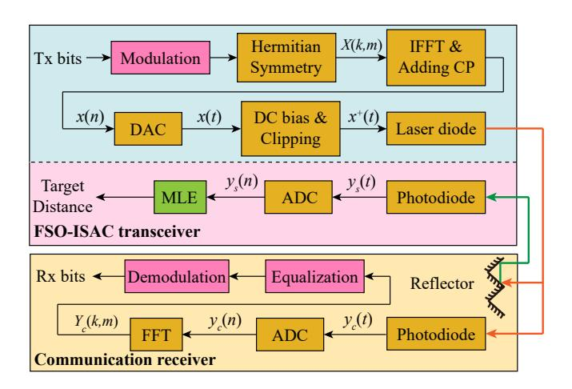
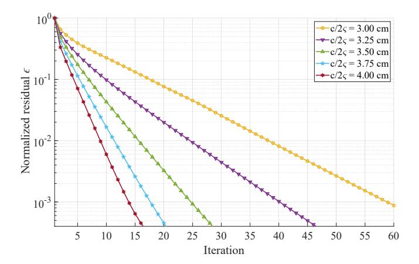
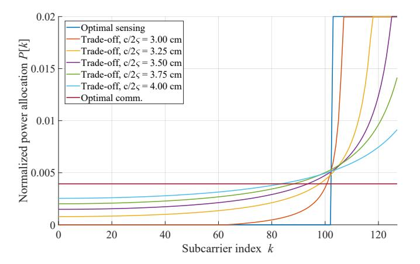
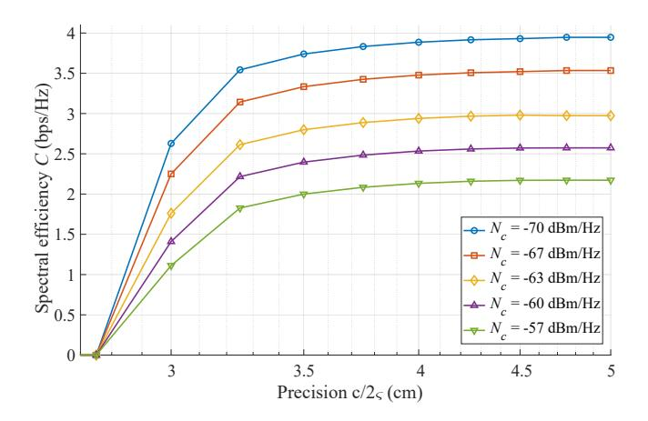

{0}------------------------------------------------

FSO-ISAC system.

# Power Allocation for OFDM-Based Free Space Optical Integrated Sensing and Communication

Yunfeng Wen1 , Fang Yang1 , Jian Song1,2, and Zhu Han3 1Department of Electronic Engineering, Beijing National Research Center for Information Science and Technology, Tsinghua University, Beijing 100084, P. R. China 2Shenzhen International Graduate School, Tsinghua University, Shenzhen 518055, P. R. China

3Department of Electrical and Computer Engineering, University of Houston, Houston, TX 77004 USA

*Abstract*—Integrated sensing and communication (ISAC) is one of the six usage scenarios of the sixth generation (6G) mobile communication system. Since an optical system can also provide communication and sensing abilities, optical ISAC has become a potential complement to radio-frequency (RF) ISAC. As orthogonal frequency division multiplexing (OFDM) has gained increasing interest in optical systems, we propose a directcurrent-biased optical OFDM (DCO-OFDM) scheme for free space optical (FSO) ISAC in this paper. To derive the spectral efficiency for communication and the Fisher information for sensing, we model the clipping noise of DCO-OFDM with the Bussgang theorem to obtain the expression of the signal-to-noise ratio. In addition, based on the derived performance metrics, an optimization problem for power allocation is formulated, and an iterative algorithm is proposed to solve the problem efficiently. Meanwhile, numerical simulations demonstrate the effectiveness of the proposed algorithm and reveal the trade-off between communication and sensing functionalities of the OFDM-based

*Index Terms*—Integrated sensing and communication, orthogonal frequency division multiplexing, free space optics, clipping noise, power allocation.

## I. INTRODUCTION

Integrated sensing and communication (ISAC) is a technology that combines both sensing and communication functionalities within a single system [1]. Leveraging the coexistence, cooperation, and co-design of these functionalities, an ISAC system provides both large communication capacities and high precision sensing abilities simultaneously [2]. Therefore, ISAC is recognized by IMT-2030 as one of the six usage scenarios of the sixth generation (6G) mobile communication system [3] and also a key enabler for future applications like the Internet of Things [4], intelligent transportation systems [5], and remote sensing [6]. Similar to the joint radarcommunication scheme in the radio frequency (RF), ISAC can also be implemented with active optical sensing devices, e.g., light detection and ranging (LiDAR), thus motivating the concept of free space optical ISAC (FSO-ISAC).

Researchers have developed numerous optical signal design scheme to provide simultaneous communication and sensing abilities for FSO-ISAC. For instance, the boomerang transmission system combines automotive LiDAR with FSO communication, which employs time-hopping pulses as the ISAC signal [8]. Similarly, a group of optical pulses is utilized for FSO-ISAC by the pulse sequence sensing and pulse position modulation scheme, which exploits pulse positions for both communication and sensing [9]. For continuous-wave FSO-ISAC, a unified waveform is proposed based on quadrature phase shift keying and direct sequence spread spectrum, which loads communication data on pseudorandom noise sequence [10]. In addition, a frequency-modulated continuous-wave coherent LiDAR is addressed to provide downlink communications capability [11]. Moreover, the phase-shift laser ranging with communication is investigated to mitigate ambiguity caused by the phase-coded signal [12]. However, most of the existing FSO-ISAC signals focus on pulses or single-carrier continuous waves, and much less attention has been paid to the multicarrier scheme for FSO-ISAC.

Among widely utilized multi-carrier schemes, orthogonal frequency division multiplexing (OFDM) has gained popularity in RF-ISAC systems due to its time-frequency interpretation. To overcome the limitations of time-domain cross correlation, an element-wise-division method can be adopted for OFDM-based ISAC to achieve a higher peak-to-sidelobe ratio [13]. Besides, the maximum-likelihood (ML) method can also be utilized to approach the Cramer-Rao Bound (CRB) ` asymptotically for point targets in a prior [14]. Moreover, power minimization presents another objective for OFDMbased ISAC, with constraints on the quality of communication and sensing services [15]. Considering practical limitations in capturing a precise channel response, an uncertainty model is exploited to obtain robust solutions for power minimization [16]. Nevertheless, most of the RF-ISAC waveforms cannot be directly extended to FSO-ISAC, since an optical waveform based on the intensity modulation and direct detection scheme is restricted to being real and non-negative [17].

In this paper, we propose a direct-current-biased optical OFDM (DCO-OFDM) scheme for FSO-ISAC, and our specific contributions are listed as follows. (I) We formulate an optimization problem in the communication-centric scenario, which jointly optimizes the direct-current (DC) bias and the normalized power allocation for each subcarrier. (II) The non-convex optimization problem is decomposed into two sub-problems to obtain a concise solution, and an iterative algorithm is proposed to optimize power allocation. (III) We conduct numerical simulations to demonstrate the effectiveness of the proposed algorithm. Furthermore, the trade-off between communication and sensing functionalities is also revealed by

{1}------------------------------------------------

Fig. 1. System model of the DCO-OFDM scheme for FSO-ISAC.

simulations for OFDM-based FSO-ISAC.

The remainder of this paper is organized as follows. In Section II, the system model of OFDM-based FSO-ISAC is introduced, and performance metrics for communication and sensing are derived with the clipping noise modelled by the Bussgang theorem. In Section III, the optimization problem is formulated in the communication-centric scenario, whose solutions are derived according to three specific conditions. The numerical results are illustrated in Section IV, which consists of the convergence of the proposed algorithm and solutions to the optimization problem. Finally, the conclusion is drawn in Section V.

#### II. SYSTEM MODEL

In this section, we introduce the system model of the DCO-OFDM scheme for FSO-ISAC. For conciseness, a unidirectional communication and sensing scenario is considered, which is readily applicable to bi-directional sensing and communication by time division multiplexing or wavelength division multiplexing. As illustrated in Fig. 1, the FSO-ISAC transceiver is based on a LiDAR, which provides active sensing abilities for both cooperative and uncooperative targets. Moreover, once the communication receiver of the cooperative target is not obstructed, a communication link can be established to achieve sensing-communication integration. The signal processing procedures are described as follows.

The time-domain OFDM signal is expressed as

$$x(t) = \frac{1}{\sqrt{N}} \sum_{m=0}^{M-1} \left\{ \sum_{k=0}^{N-1} \left[ X(k, m) \right] \exp\left(j2\pi k \Delta f(t - mT_o) \right) \right] \operatorname{rect}\left(\frac{t - mT_o}{T_o}\right) ,$$
(1)

where  $X\left(k,m\right)$  is the communication data transmitted on the k-th subcarrier of the m-th OFDM symbol. Notations M,N, and  $\Delta f$  are the amount of OFDM symbols in each frame, the number of subcarriers, and the subcarrier spacing, respectively. A guard interval is concatenated in front of each OFDM

symbol to avoid inter-symbol interference. The durations of the elementary OFDM symbol, the guard interval, and the total OFDM symbol are denoted as T,  $T_g$ , and  $T_o$ , respectively, where  $T=1/\Delta f$  and  $T_o=T+T_g$ . Besides, rect  $(\cdot)$  denotes a rectangular window, during which the signal is sampled at the rate of  $R_s=N/T$  for digital signal processing. Additionally, the occupied bandwidth of x(t) is  $B=N\Delta f$ , and its power is denoted as  $\sigma_x^2$ .

To obtain a non-negative signal, a DC component b is added to  $x\left(t\right)$ . Then, the negative part of  $x\left(t\right)$  is clipped, which generates the transmitted DCO-OFDM signal as

$$x^{+}(t) = \{x(t) + b\}^{+},$$
 (2)

where the notation  $\{\cdot\}^+$  is defined as  $\{x\}^+ = \max\{x, 0\}$ .

### A. Communication Subsystem

The channel response for communication consists of the attenuation, scintillation, and dispersion of the atmospheric channel. Supposing that the channel response for communication is denoted as  $h_c\left(t\right)$ , the received communication signal is expressed as

$$y_c(n) = x_c\left(\frac{n}{R_s}\right) + w_c(n), \qquad (3)$$

where  $w_c(n) \sim \mathcal{N}\left(0,\sigma_c^2\right)$  is additive white Gaussian noise (AWGN) with a power spectral density (PSD) of  $N_c = \sigma_c^2/B$ .  $x_c(t) = x^+(t) * h_c(t)$  is the received signal without noise, where the operator \* denotes the linear convolution. If the delay spread of  $h_c(t)$  does not exceed the duration of the guard interval, the linear convolution can be substituted by the cyclic convolution, and a frequency-domain expression for the communication signal can be obtained as

$$Y_c(k,m) = X^+(k,m) H_c(k) + W_c(k),$$
 (4)

where  $X^+\left(k,m\right)$  and  $H_c\left(k\right)$  are the discrete Fourier transform (DFT) of  $x^+\left(n/R_s\right)$  and  $h_c\left(n/R_s\right)$ , respectively. When  $X\left(k,m\right)$  obeys the Gaussian distribution independently, the performance metric of the communication subsystem, i.e., the spectral efficiency, can be expressed as

$$C(b, \tilde{P}(k)) = \frac{1}{BT_o} \sum_{k=1}^{\frac{N}{2}-1} \log(1 + |H_c(k)|^2 \gamma_c(b) \, \tilde{P}(k)),$$
(5)

where  $\gamma_c(b)$  is the normalized SNR on the k-th subcarrier for the communication signal. Additionally, the total electrical power P is utilized by both the DC bias and communication on each subcarrier, i.e.,

$$P = b^{2} + \sum_{k=1}^{\frac{N}{2} - 1} \mathbb{E}\left( |X(k, m)|^{2} \right).$$
 (6)

Then, the normalized power allocation for the k-th subcarrier is defined as

$$\tilde{P}(k) = \frac{\mathbb{E}\left(\left|X\left(k,m\right)\right|^{2}\right)}{P - b^{2}}.$$
(7)

{2}------------------------------------------------

#### B. Sensing Subsystem

Distinct from the communication subsystem, only line-ofsight (LoS) channels are considered for the sensing subsystem, since the attenuation of none-line-of-sight (NLoS) channels is much larger due to reflection and extra propagation distance. Therefore, the received sensing signal is expressed as

$$y_s(n) = h_s x^+ \left(\frac{n}{R_s} - \tau_0\right) + w_s(n), \qquad (8)$$

where  $w_s(n) \sim \mathcal{N}\left(0, \sigma_s^2\right)$  is AWGN with a PSD of  $N_s = \sigma_s^2/B$ .  $\tau_0$  is the time of flight (ToF) of the sensing signal, and  $h_s$  depicts the attenuation and scintillation of the atmospheric channel, which is also assumed to be stationary within an OFDM symbol.

Once the optical signal is received, the sensing receiver can utilize the cross-correlation method to obtain the maximum-likelihood estimation (MLE) of  $\tau_0$  as

$$\hat{\tau}_0 = \arg\max_{\tau} \sum_{n=0}^{N-1} y_s(n) x\left(\frac{n}{R_s} - \tau\right), \tag{9}$$

which further yields the target distance as  $\hat{D} = 2\hat{\tau}_0/c$  with c denoting the speed of light.

With appropriate interpolation schemes, the precision of MLE approaches CRB asymptotically. Since CRB is inversely proportional to the Fisher information, which is proportional to the mean square bandwidth of  $x\left(t\right)$ , the performance metric for sensing can be expressed as

$$I\left(b,\tilde{P}\left(k\right)\right) = \frac{8\pi^{2}M\Delta f^{2}}{N} \sum_{k=1}^{\frac{N}{2}-1} k^{2}\gamma_{s}\left(b\right)\tilde{P}\left(k\right), \tag{10}$$

where  $\gamma_s$  is the normalized SNR on the k-th subcarrier for the sensing signal.

## C. Clipping Noise Statistics

To obtain the expressions for  $\gamma_c\left(b\right)$  and  $\gamma_s\left(b\right)$ , the statistical properties of  $x^+\left(n\right)$  should be evaluated. Since  $x^+\left(n\right)$  is a clipped version of  $x\left(n\right)$ , the Bussgang theorem indicates that  $x^+\left(n\right)$  can be decomposed as

$$x^{+}(n) = Kx(n) + w_{p}(n),$$
 (11)

where  $w_p(n)$  is the clipping noise uncorrelated to x(n) [19]. Denoting the complementary cumulative distribution function of the standard Gaussian distribution as  $Q(\cdot)$ , the coefficient K can be calculated as

$$K = \frac{\mathbb{E}\left(x\left(n\right)x^{+}\left(n\right)\right)}{\mathbb{E}\left(x^{2}\left(n\right)\right)} = Q\left(\lambda_{b}\right),\tag{12}$$

where  $\lambda_b = -b/\sigma_x$  is the normalized clipping level [18]. Meanwhile, the variance of  $w_v(n)$  is calculated as

$$\sigma_{w_p}^2 = \sigma_x^2 \left( \lambda_b^2 \left( 1 - Q(\lambda_b) \right) + \lambda_b \phi(\lambda_b) + Q(\lambda_b) - K^2 - \left( \lambda_b \left( 1 - Q(\lambda_b) \right) - \phi(\lambda_b) \right)^2 \right), \tag{13}$$

where  $\phi\left(\cdot\right)$  denotes the probability distribution function of the standard Gaussian distribution.

According to the central limit theorem, the frequency-domain clipping noise can be modelled as a Gaussian random process uncorrelated to the original signal, and therefore the normalized SNR  $\gamma_c(b)$  for communication and  $\gamma_s(b)$  for sensing are expressed respectively as

$$\gamma_c(b) = \frac{K^2 \left(P - b^2\right)}{\frac{N_c \Delta f}{2} + \sigma_{w_p}^2},$$
(14a)

$$\gamma_s(b) = \frac{K^2 \left(P - b^2\right)}{\frac{N_s \Delta f}{2} + \sigma_{w_p}^2}.$$
 (14b)

#### III. OPTIMAL POWER ALLOCATION FOR DCO-OFDM

As indicated by (14a) and (14b), the normalized SNRs depend on the power allocation for DC bias and each subcarrier, which further affects the spectral efficiency and the Fisher information. In this section, we consider a communication-centric power allocation problem, which achieves the maximum spectral efficiency and guarantees the sensing precision simultaneously. Therefore, the optimization problem is formulated as

(P1): 
$$\max_{b,\tilde{P}(k)} C\left(b,\tilde{P}(k)\right)$$
 (15)

s.t. 
$$I\left(b,\tilde{P}\left(k\right)\right) \ge \varsigma^{2},$$
 (15a)

$$0 \le b \le \sqrt{P},\tag{15b}$$

$$0 < \tilde{P}(k) < P_m, \tag{15c}$$

$$\sum_{k=1}^{\frac{N}{2}-1} \tilde{P}(k) = \frac{1}{2},$$
(15d)

where  $c/2\varsigma$  is the desired precision of sensing, and  $P_m$  is the maximum normalized power that can be allocated to an individual subcarrier. Constraint (15a) guarantees that the sensing subsystem can achieve the desired precision, while constraints (15b) and (15c) restrict b and  $\tilde{P}(k)$  to be non-negative, respectively. Additionally, constraints (15b) and (15d) impose constraints on the total power, and we set  $P_m < 1/2 < (N/2-1) P_m$  to avoid invalid constraints.

Unfortunately, the joint optimization for b and  $\tilde{P}(k)$  is non-convex in (P1). By decomposing (P1) into the optimization problem (P1-1) for b and (P1-2) for  $\tilde{P}(k)$  with fixed b, we obtain a single-variable non-convex optimization problem and a convex optimization problem with N/2-1 variables, respectively. Therefore, by serially solving (P1-1) and (P1-2), the optimal  $b^*$  and  $\tilde{P}^*(k)$  can be obtained, which is discussed in the following subsections.

#### A. Power Allocation for DC Bias

The sub-problem to optimize the DC bias is formulated as

(P1-1): 
$$\max_{b} C\left(b, \tilde{P}\left(k\right)\right), \tag{16}$$

s.t. 
$$0 < b < \sqrt{P}$$
. (16a)

To maximize the spectral efficiency C, the log-sum of the normalized SNR  $\gamma_c(b)$  should be maximized. On one hand,

{3}------------------------------------------------

the clipping noise is independent of the normalized power allocation, which does not affect the solution of (P1-1). On the other hand, although the DC bias b affects K,  $\sigma_{w_n}^2$ , and  $P-b^2$  simultaneously,  $\gamma_c\left(b\right)$  is generally dominated by the numerator in (14a) for large  $N_c$ , i.e.,

$$\gamma_{c}\left(b\right) \approx \frac{2K^{2}\left(P-b^{2}\right)}{N_{c}\Delta f}, \text{ if } \frac{N_{c}\Delta f}{2} \gg P_{w_{p}}\left(k\right).$$
 (17)

Consequently,  $\gamma_c(b)$  is a quasi-concave function of b, and golden search can be adopted to solve (P1-1) through the feasible interval, which obtains the solution  $b^*$ .

#### B. Power Allocation for Subcarriers

Once  $b^*$  is obtained by solving (P1-1), the normalized power allocation P(k) for each subcarrier is further optimized to maximize the spectral efficiency. Therefore, the sub-problem to optimize power allocation for each subcarrier is formulated

(P1-2): 
$$\max_{\tilde{P}(k)} C\left(b^*, \tilde{P}(k)\right), \tag{18}$$

$$\text{s.t.} \qquad I\left(b^{*}, \tilde{P}\left(k\right)\right) \geq \varsigma^{2}, \tag{18a}$$

$$\sum_{k=1}^{\frac{N}{2}-1} \tilde{P}(k) = \frac{1}{2},$$
(18b)

$$0 \le \tilde{P}(k) \le P_m. \tag{18c}$$

As indicated by (5) and (10), the objective of (P1-2) is a concave function of  $\tilde{P}(k)$ , while the constraints are affine functions of  $\tilde{P}(k)$ . In consequence, maximizing a concave objective under affine constraints yields a convex optimization problem. Therefore, the optimal solution to (P1-2) is obtained if and only if the Karush-Kuhn-Tucker (KKT) conditions hold, based on which three cases can be considered as follows.

1) Case A: The sensing constraint in (18a) is first assumed to be inactive, and therefore the power allocation problem can be solved by the conventional water-filling method. Thus, the normalized power allocation for the k-th subcarrier is then expressed as

$$\xi_{0}(\mu, \eta, k) = \max \left\{ \mu - \eta \gamma_{s}(b^{*}) k^{2}, \\ 1/\left( P_{m} + 1/\left( \gamma_{c}(b^{*}) |H_{c}(k)|^{2} \right) \right) \right\}, \quad (19a)$$

$$\tilde{P}_{c}\left(k\right) = \left\{\frac{1}{\xi_{0}\left(\mu^{*}, 0, k\right)} - \frac{1}{\gamma_{c}\left(b^{*}\right) \left|H_{c}\left(k\right)\right|^{2}}\right\}^{+}, \quad (19b)$$

where the optimal dual variable  $\mu^*$  can be obtained by solving  $\sum_{k=1}^{N/2-1} \tilde{P}_c(k) = 1/2$  with the bisection method. If the sensing constraint is still satisfied, i.e.,

$$\sum_{k=1}^{\frac{N}{2}-1} k^2 \gamma_s (b^*) \, \tilde{P}_c (k) \ge \tilde{\varsigma}^2, \tag{20}$$

where the threshold for the Fisher information is given by

$$\tilde{\varsigma}^2 = \frac{N\varsigma^2}{8\pi^2 M \Delta f^2},\tag{21}$$

then the optimal solution is  $\tilde{P}^*(k) = \tilde{P}_c(k)$ .

Algorithm 1 Iterative Optimization Algorithm for Dual Variables in Communication-centric Scenarios

**Input:** Tolerance  $\varepsilon_{\mu}, \varepsilon_{\eta}$  for  $\mu, \eta$ .

**Output:** Optimal  $\eta^*$  and  $\mu^*$ .

- 1: Initialize  $\eta^{(0)} \leftarrow 0$ ,  $\mu^{(0)} \leftarrow 0$ ,  $i \leftarrow 0$ . 2: **while**  $|\mu^{(i+1)} \mu^{(i)}| \ge \varepsilon_{\mu}$  or  $|\eta^{(i+1)} \eta^{(i)}| \ge \varepsilon_{\eta}$  **do**
- Calculate upper bound  $\mu_c(i)$  by (27a). 3:
- Solve (26a) on  $\left[\mu^{(i)}, \mu_c(i)\right]$  to obtain  $\mu^{(i+1)}$ . 4:
- Calculate upper bound  $\eta_c(i)$  by (27b).
- Solve (26b) on  $\left[\eta^{(i)},\eta_{c}\left(i\right)\right]$  to obtain  $\eta^{(i+1)}$  . 6:
- $i \leftarrow i + 1$ .
- 8: end while
- 9:  $\eta^* \leftarrow \eta^{(i)}$ ,  $\mu^* \leftarrow \mu^{(i)}$ .

2) Case B: The optimal Fisher information is considered, which requires more power allocated to subcarriers with the highest frequency. In this case, index k of each subcarrier is first sorted as  $k_l$  in ascending order, which satisfies

$$k_{l_1}^2 \le k_{l_2}^2, \quad \forall \ l_1 \le l_2.$$
 (22)

Then, by defining  $l_m = |N/2 - 1/(2P_m)|$ , the normalized power allocation for the  $k_l$ -th subcarrier is expressed as

power allocation for the 
$$k_l$$
-th subcarrier is expressed as 
$$\tilde{P}_s\left(k_l\right) = \begin{cases} 0, & 1 \leq k_l \leq k_{l_m} - 1, \\ \frac{1}{2} - \left(\frac{N}{2} - 1 - k_{l_m}\right) P_m, & k_l = k_{l_m}, \\ P_m, & k_{l_m} + 1 \leq k_l < \frac{N}{2}. \end{cases} \tag{23}$$

If  $P_s(k)$  cannot satisfy the sensing constraint in (P1-2), i.e.,

$$\sum_{k=1}^{\frac{N}{2}-1} k^2 \gamma_s \left(b^*\right) \tilde{P}_s \left(k\right) < \tilde{\varsigma}^2, \tag{24}$$

then the problem is infeasible. Otherwise, the optimization is further conducted in Case C.

3) Case C: In this case, the sensing constraint cannot be satisfied by  $P_c(k)$ , while the problem is still feasible for  $P_s(k)$ . Consequently, a trade-off exists between communication and sensing metrics, and the optimal power allocation yielded by the KKT conditions is expressed as

$$\tilde{P}^{*}(k) = \left\{ \frac{1}{\xi_{0}(\mu^{*}, \eta^{*}, k)} - \frac{1}{\gamma_{c}(b^{*}) |H_{c}(k)|^{2}} \right\}^{+}.$$
 (25)

As the sensing constraint (18a) is always active in this case, the optimal dual variables  $\mu^*$  and  $\eta^*$  can be obtained by simultaneously solving

$$\sum_{k=1}^{\frac{N}{2}-1} \left\{ \frac{1}{\xi_0(\mu^*, \eta^*, k)} - \frac{1}{\gamma_c |H_c(k)|^2} \right\}^+ = \frac{1}{2}, \tag{26a}$$

$$\sum_{k=1}^{\frac{N}{2}-1} k^{2} \gamma_{s} \left\{ \frac{1}{\xi_{0} (\mu^{*}, \eta^{*}, k)} - \frac{1}{\gamma_{c} |H_{c}(k)|^{2}} \right\}^{+} = \tilde{\varsigma}^{2}. \quad (26b)$$

{4}------------------------------------------------

TABLE I SIMULATION CONFIGURATIONS

| Parameter                        | Notation   | Value      |
|----------------------------------|------------|------------|
| OFDM symbols in each frame       | M          | 64         |
| Subcarriers in each OFDM symbol  | N          | 256        |
| Subcarrier spacing               | $\Delta f$ | 1 MHz      |
| Duration of a guard interval     | $T_g$      | 0.2 μs     |
| Duration of an OFDM symbol       | $T_o$      | 1.2 µs     |
| Total power                      | P          | 1 W        |
| Target distance                  | D          | 100 m      |
| Normalized noise PSD for sensing | $N_s$      | -50 dBm/Hz |

To obtain the value of  $\tilde{P}^*(k)$ , an iterative optimization algorithm is proposed, which solves (26a) and (26b) with the bisection method iteratively until the values of  $\eta$  and  $\mu$  converge. The algorithm is summarized in **Algorithm 1**. Moreover, the upper bounds of dual variables during the iteration are defined as

$$\mu_c(i) = \max_{l} \gamma_s(b^*) l^2 \eta^{(i)} + \gamma_c(b^*) |\tilde{H}(l)|^2,$$
 (27a)

$$\eta_c(i) = \max_{l} \frac{\mu^{(i+1)}}{l^2}.$$
(27b)

#### C. Convergence Analysis

To characterize the speed of convergence for **Algorithm 1**, a normalized residual is defined as

$$\epsilon^{(i)} = \frac{|\mu^{(i)} - \mu^*|}{|\mu^{(0)} - \mu^*|} + \frac{|\eta^{(i)} - \eta^*|}{|\eta^{(0)} - \eta^*|}.$$
 (28)

Meanwhile, according to the assumption of *Case C*, the optimal  $(\mu^*, \eta^*)$  lies in the region

$$\mathcal{R}: \ \gamma_{s}(b^{*}) \eta \leq \mu \leq \gamma_{s}(b^{*}) l_{1}(\eta)^{2} \eta + \gamma_{c}(b^{*}) |H_{c}(l_{1}(\eta))|^{2},$$
(29)

where the index  $l_1(\eta)$  is obtained by

$$l_1(\eta) = \arg\max_{l} \gamma_s(b^*) l^2 \eta + \gamma_c(b^*) |H_c(l)|^2.$$
 (30)

Therefore, during the iteration of **Algorithm 1**, the dual variables  $\mu^{(i)}$  and  $\eta^{(i)}$  cannot leave the region  $\mathcal R$  where the optimal solution exists. Besides,  $\mathcal R$  also upper bounds the interval in each iteration, which ensures that the bisection method converges within finite steps.

Furthermore, we have the initial points  $\mu^{(0)} < \mu^*, \eta^{(0)} < \eta^*$ . Supposing that  $\eta^{(i)} < \eta^*$ , solving (26a) yields  $\mu^{(i)} < \mu^{(i+1)} < \mu^*$ . Similarly, assuming that  $\mu^{(i+1)} < \mu^*$ , solving (26b) yields  $\eta^{(i)} < \eta^{(i+1)} < \eta^*$ . Therefore, the distance between the current solution and the optimal solution declines as the algorithm proceeds, i.e.,

$$|\mu^{(i+1)} - \mu^*| < |\mu^{(i)} - \mu^*|,$$
 (31a)

$$|\eta^{(i+1)} - \eta^*| < |\eta^{(i)} - \eta^*|. \tag{31b}$$

In consequence, the normalized residual descends, i.e.,  $\epsilon^{(i+1)} < \epsilon^{(i)}$ , and the convergence of **Algorithm 1** is proven by the Monotone and Boundedness theorem.

Fig. 2. Normalized residual of dual variables.

Fig. 3. Normalized power allocation for each subcarrier.

#### IV. NUMERICAL RESULTS

This section provides numerical results to validate the effectiveness of the proposed algorithm for optimal power allocation, and Table I shows configurations for system parameters. Due to the narrow and collimated laser beams adopted by FSO-ISAC, only LoS channels are considered for both communication and sensing, i.e.,  $H_c\left(k\right)=h_c$ . Moreover, to obtain concise results, the effects of geometric loss, atmospheric attenuation, and processing gain of the receiver are normalized into the PSD of noise, i.e.,  $h_c=h_s=1$  with  $N_s=-50$  dBm/Hz and varied  $N_c$ .

Fig. 2 shows the normalized residual of dual variables. As the iteration of **Algorithm 1** proceeds, the residual declines almost geometrically, which converges to the precision  $\varepsilon$  within  $\mathcal{O}\left(\log\left(1/\varepsilon\right)\right)$  iterations. In addition, as the desired sensing precision becomes higher, the distance between  $(\mu^*, \eta^*)$  and  $(\mu^{(0)}, \eta^{(0)})$  also increases, which slow down the convergence of dual variables and the whole algorithm.

Fig. 3 shows the normalized power allocation for each subcarrier with respect to the desired sensing precision. Meanwhile, the optimal power allocation schemes for communication and sensing are also illustrated for a comparison. As described in Subsection III-B, the water-filling method yields

{5}------------------------------------------------

Fig. 4. Optimal spectral efficiency with respect to different sensing precisions.

a nearly uniform distribution for the communication-centric power allocation. On the contrary, more power is allocated to subcarriers with a higher frequency in a sensing-centric scenario. Moreover, for the scenario described in *Case C*, the curvature of power allocation curves increases continuously as the desired sensing precision becomes higher, which embodies the compromise between communication and sensing. Therefore, both communication and sensing performances can be modified flexibly by tuning the desired precision c/2ς.

Fig. 4 illustrates the optimal spectral efficiency with respect to the desired sensing precision. As γc (b ∗ ) is mainly influenced by the noise PSD Nc for communication, the spectral efficiency can be divided into three regions based on the desired precision. For a desired sensing precision of smaller than 2.25 cm, the sensing constraint (15a) cannot be satisfied, and (P1) becomes infeasible. In addition, for 2.5 cm ≤ c/2ς ≤ 3.5 cm, the spectral efficiency grows rapidly as the feasible region given by (15a) is enlarged. However, for a desired sensing precision of larger than 4 cm, the spectral efficiency nearly reaches saturation, which cannot be further improved by increasing c/2ς.

# V. CONCLUSION

In this paper, we proposed a DCO-OFDM scheme for FSO-ISAC and studied the optimal power allocation in the communication-centric scenario. The Bussgang theorem is adopted to model the clipping noise of DCO-OFDM in the derivation of communication and sensing performance metrics. Moreover, the joint optimization problem is decomposed into a non-convex sub-problem for DC bias and a convex subproblem for power allocation on each subcarrier, which is solved by an iterative algorithm efficiently. As revealed by the numerical results, the spectral efficiency can be modified by tuning the desired sensing precision, which embodies the trade-off between communication and sensing functionalities in OFDM-based FSO-ISAC.

# ACKNOWLEDGMENT

This work was supported in part by National Key Research and Development Program of China under Grant 2022YFE0101700; and in part by Science, Technology and Innovation Commission of Shenzhen Municipality under Grant JSGG20211029095003004.

## REFERENCES

- [1] F. Liu, C. Masouros, A. P. Petropulu, H. Griffiths, and L. Hanzo, "Joint radar and communication design: applications, state-of-the-art, and the road ahead," *IEEE Trans. Commun.*, vol. 68, no. 6, pp. 3834-3862, Jun. 2020.
- [2] A. R. Chiriyath, B. Paul and D. W. Bliss, "Radar-communications convergence: coexistence, cooperation, and co-design," *IEEE Trans. Cogn. Commun. Netw.*, vol. 3, no. 1, pp. 1-12, Mar. 2017.
- [3] "Future technology trends for the evolution of IMT towards 2030 and beyond," in *Liaison Statement, ITU-R Working Party 5D*, ITU, Geneva, Switzerland, Oct. 2020.
- [4] Y. Cui, F. Liu, X. Jing and J. Mu, "Integrating sensing and communications for ubiquitous IoT: applications, trends, and challenges," *IEEE Netw.*, vol. 35, no. 5, pp. 158-167, Nov. 2021.
- [5] D. Ma, N. Shlezinger, T. Huang, Y. Liu, and Y. C. Eldar, "Joint radarcommunication strategies for autonomous vehicles: combining two key automotive technologies," *IEEE Signal Process. Mag.*, vol. 37, no. 4, pp. 85-97, Jul. 2020.
- [6] M.-E. Chatzitheodoridi, A. Taylor, O. Rabaste, and H. Oriot, "A cooperative SAR-communication system using continuous phase modulation codes and mismatched filters," *IEEE Trans. Geosci. Remote Sens.*, vol. 61, pp. 1-14, Dec. 2023.
- [7] Y. Li and J. Ibanez-Guzman, "Lidar for autonomous driving: the principles, challenges, and trends for automotive lidar and perception systems," *IEEE Signal Process. Mag.*, vol. 37, no. 4, pp. 50-61, Jun. 2020.
- [8] A. J. Suzuki and K. Mizui, "Laser radar and visible light in a bidirectional V2V communication and ranging system," in *IEEE International Conference on Vehicular Electronics and Safety (ICVES)*, Yokohama, Japan, Nov. 2015, pp. 19-24.
- [9] Y. Wen, F. Yang, J. Song, and Z. Han, "Pulse sequence sensing and pulse position modulation for optical integrated sensing and communication," *IEEE Commun. Lett.*, vol. 27, no. 6, pp. 1525-1529, Apr. 2023.
- [10] M. Cao, Y. Wang, Y. Zhang, D. Gao, and H. Zhou, "A unified waveform for optical wireless integrated sensing and communication," in *Asia Communications and Photonics Conference (ACP)*, Shenzhen, China, Nov. 2022, pp. 448-452.
- [11] Z. Xu, K. Chen, X. Sun, K. Zhang, Y. Wang, J. Deng, and S. Pan, "Frequency-modulated continuous-wave coherent lidar with downlink communications capability," *IEEE Photon. Technol. Lett.*, vol. 32, no. 11, pp. 655-658, Jun. 2020.
- [12] Y. Hai, Y. Luo, C. Liu, and A. Dang, "Remote phase-shift LiDAR with communication," *IEEE Trans. Commun.*, vol. 71, no. 2, pp. 1059-1070, Jan. 2023.
- [13] C. Sturm and W. Wiesbeck, "Waveform design and signal processing aspects for fusion of wireless communications and radar sensing," *Proc. IEEE*, vol. 99, no. 7, pp. 1236-1259, Jul. 2011.
- [14] S. D. Liyanaarachchi, T. Riihonen, C. B. Barneto, and M. Valkama, "Optimized waveforms for 5G-6G communication with sensing: theory, simulations and experiments," *IEEE Trans. Wireless Commun.*, vol. 20, no. 12, pp. 8301-8315, Dec. 2021.
- [15] J. Zhu, Y. Cui, J. Mu, L. Hu, and X. Jing, "Power minimization strategy based subcarrier allocation and power assignment for integrated sensing and communication," in *IEEE Wireless Communications and Networking Conference (WCNC)*, Glasgow, UK, Mar. 2023, pp. 1-6.
- [16] C. Shi, F. Wang, M. Sellathurai, J. Zhou, and S. Salous, "Power minimization-based robust OFDM radar waveform design for radar and communication systems in coexistence," *IEEE Trans. Signal Process.*, vol. 66, no. 5, pp. 1316-1330, Mar. 2018.
- [17] S. D. Dissanayake and J. Armstrong, "Comparison of ACO-OFDM, DCO-OFDM and ADO-OFDM in IM/DD systems," *J. Lightw. Technol.*, vol. 31, no. 7, pp. 1063-1072, Apr. 2013.
- [18] S. Dimitrov, S. Sinanovic, and H. Haas, "Clipping noise in OFDM-based optical wireless communication systems," *IEEE Trans. Commun.*, vol. 60, no. 4, pp. 1072-1081, Apr. 2012.
- [19] J. Bussgang, "Cross correlation function of amplitude-distorted gaussian signals," *Research Laboratory for Electronics*, Massachusetts Institute of Technology, Cambridge, MA, Tech. Rep., Mar. 1952, technical Report 216.