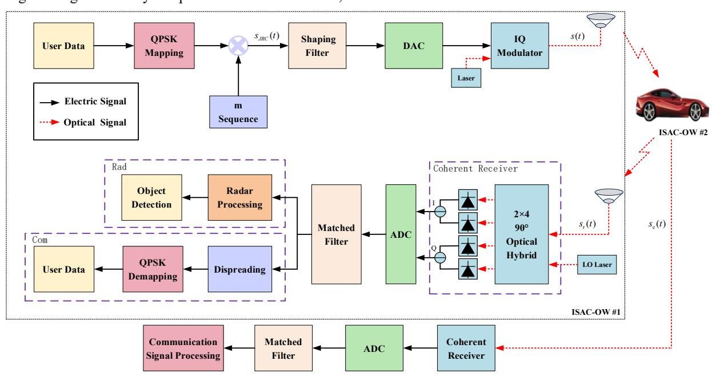
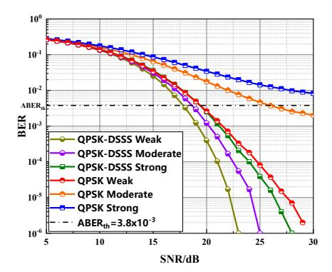

{0}------------------------------------------------

# A Unified Waveform for Optical Wireless Integrated Sensing and Communication

Minghua Cao
School of Computer and Communication
Lanzhou University of Technology
Lanzhou, Gansu 730050, China
caominghua@lut.edu.cn

Ying Wang
School of Computer and Communication
Lanzhou University of Technology
Lanzhou, Gansu 730050, China
qyty1314@qq.com

Yue Zhang
School of Computer and Communication
Lanzhou University of Technology
Lanzhou, Gansu 730050, China
zyue940209@163.com

Daqing Gao School of Computer and Communication Lanzhou University of Technology Lanzhou, Gansu 730050, China gdq1123@qq.com Hongtao Zhou
School of Computer and Communication
Lanzhou University of Technology
Lanzhou, Gansu 730050, China
1243971352@qq.com

Abstract—The integrated sensing and communication with optical wireless (ISAC-OW) can effectively reduce the demand of spectrum and hardware while improving the sensing resolution and data rate. However, the key challenge is to design a fully unified waveform that enables both light detection and ranging (LiDAR) and communication. To this issue, an ISAC-OW unified waveform is proposed based on quadrature phase shift keying (QPSK) and direct sequence spread spectrum (DSSS). The key idea of the proposal is to load the modulated user data on the pseudorandom noise (PN) sequence by direct spread spectrum (DSS). Subsequently, the proposed ISAC-OW system is simulated and analyzed under Gamma-Gamma atmospheric turbulence channels. The results show that our proposal can not only guarantee the excellent ranging performance of LiDAR, but also realize high-speed and reliable data transmission.

Keywords—Integrated sensing and communication, optical wireless communication, unified waveform, direct spread spectrum, Gamma-Gamma atmospheric turbulence channels.

## I. INTRODUCTION

Recently, as an emerging technology, integrated sensing and communication (ISAC) has attracted widespread attention from both academia and industry [1]. This technology performs communication and sensing functions through software and hardware resource sharing. It not only improves the spectrum utilization, but also reduces the size, cost and power consumption of the equipment. It plays an important role in a variety of emerging civil and military scenes, such as autonomous vehicles, remote health-caring and military confrontation.

The key to realize ISAC is the waveform design. The existing waveform design methods mainly include multiplexing and sharing [2]. Multiplexing technology combines radar waveform and communication waveform into an integrated waveform. The common approaches are space division multiplexing (SDM), time division multiplexing (TDM), frequency division multiplexing (FDM) and code division multiplexing (CDM) [3]. These approaches have the advantages of simple implementation and flexible design, but

there are also the following disadvantages such as low spectrum utilization and waste of hardware resource. Compared with multiplexing technology, sharing technology simultaneously performs the functions of communication and sensing by designing a fully unified waveform. It can effectively improve the utilization of spectrum resource and hardware resource. Therefore, it is favored by scholars.

Spread spectrum (SS) and phase modulation (PM) are typical approaches of sharing technology. In [4], an ISAC system based on DSSS was proposed. The system used the good cross-correlation of the PN sequence to make the radar signal and the communication signal orthogonal, which was conducive to the separation of the two signals at the receiving end. In [5], the unified waveform design method based on PM was proposed. The data were mapped to different phase symbols and then modulated for multiple-input multiple-output (MIMO) transmission. In [6], a novel type of unified waveform was designed by modulating improved binary phase shift keying (BPSK) data into chirp signal and utilizing hybrid chaotic spread spectrum code.

However, radio frequency (RF) has limited available bandwidth and may cause significant broadcast problem since the RF signal is usually transmitted in all directions. Furthermore, the RF ranging method cannot provide high lateral resolution because of its wide beamwidth, which can result in location ambiguity [7]. The optical frequency band has the significant advantages of large bandwidth, no electromagnetic interference and high energy efficiency, which can effectively make up for the shortage of RF. As a result, it has been widely used in independent LiDAR imaging [8] and atmospheric laser communication [9]. At present, the research of ISAC with optical wireless (ISAC-OW) has been developed vigorously, which provides an effective solution for high-precision sensing and high-speed communication. In [10], the DSSS technology was employed to achieve the integrated LiDAR of ranging and communication. However, the working mode of the bidirectional communication system is complicated, and the use of light emitting diode (LED) limits the transmission distance. In [11], an integrated LiDAR of ranging and communication based on pseudorandom code

{1}------------------------------------------------

modulation was proposed. The detection distance of LiDAR is increased, but the decoding process at the receiving end is relatively cumbersome and the communication rate is difficult to meet the actual demand. In [12], a method based on dual pulse interval modulation (DPIM) was proposed to simultaneously realize LiDAR ranging and communication, which also reduced the complexity of the communication system. However, the time-of-flight (TOF) sensor has certain limitations and the external background light will affect both the detection range and detection accuracy of the system. In [13], it proposed a method to insert ranging frames into the communication data sequence to realize the integrated LiDAR of ranging and communication. Although the BPSK modulation/heterodyne coherent detection system has the advantages of high sensitivity reception and anti-interference,

the transmission rate of the system cannot be effectively improved.

From what has been discussed above, it is necessary to design a fully unified waveform for optical wireless systems to ensure the excellent ranging performance of LiDAR, and to achieve high-speed/high-quality communication. In addition, the practical atmospheric channel has the characteristic of time-varying and randomness. Its influence on the system performance cannot be ignored. In view of these problems, the distinctive autocorrelation characteristic of PN sequence in SS technology can be utilized to ensure the ranging performance, and the high-order PM modulation technology can be utilized to improve the data transmission rate.

Figure 1. The block diagram of ISAC-OW system.

#### II. SYSTEM MODEL

Fig. 1 shows a block diagram of the proposed ISAC-OW system for autonomous vehicles. Assume ISAC-OW#1 is the signal transmitter, ISAC-OW#2 is the data transmission destination and LiDAR detection object. Both vehicles are equipped with ISAC-OW system. When ISAC-OW#1 has signal to transmit. The user data can firstly be mapped to QPSK, and the complex signal can be expressed as

$$x(t) = \sum_{i=0}^{N-1} a_i g(t - iT_b)$$
 (1)

where sequence  $a_i = a_{I,i} + ja_{Q,i}$ ,  $a_{I,i}$  and  $a_{Q,i}$  are the symbols carried by the *i*-th symbol on the in-phase (*I*) and quadrature (*Q*) component, respectively. g(t) denotes the pulse

waveform with time width  $T_b$ , and N denotes the length of user data.

Secondly, PN sequence with randomness and sharp autocorrelation is used as carriers for object detection and data transmission. Where, the m sequence is composed of PN sequence generated by the maximum length linear shift feedback register (LSFR), which can be expressed as

$$m(t) = \sum_{i=0}^{L-1} b_i g(t - iT_c)$$
 (2)

where  $b_i$  denotes the information carried by the i-th symbol, g(t) denotes the pulse waveform with time width  $T_c$ , L denotes the number of chips in each bit (spreading factor), which can be defined as  $L = T_b / T_c$ .

This work was supported in part by the NSFC Program (62265010, 61875080), and Natural Science Foundation of Gansu Province, China (20JR5RA472).

{2}------------------------------------------------

Thereafter, x(t) is loaded onto m(t) by DSS to obtain the baseband signal  $s_{JRC}(t)$ , which can be expressed as

$$s_{JRC}(t) = x(t) \cdot m(t) = \sum_{i=0}^{NL-1} c_i g(t - iT_c)$$
 (3)

Finally,  $s_{JRC}(t)$  is processed by the shaping filter, digital-to-analog converter (DAC) and IQ electro-optical modulator to get s(t), which can be expressed as

$$s(t) = s_{RC}(t) \cdot \exp[j(\omega_s t + \theta_s)] \tag{4}$$

where  $\omega_s$  is the signal frequency and  $\theta_s$  is the initial phase.

s(t) is broadcasted via a signal aperture transmitter, propagating through the atmospheric channel and received by ISAC-OW#2. The received signal can be expressed as

$$s_c(t) = h \cdot s(t) + z(t) \tag{5}$$

where z(t) is the noise and h is the light intensity fading coefficient of the atmospheric channel. It should be noted that h usually follows the Gamma-Gamma distribution, and its probability density function can be expressed as [14]

$$\varphi(h) = \frac{2(\alpha\beta)^{\frac{\alpha+\beta}{2}-1}}{\Gamma(\alpha)\Gamma(\beta)} \cdot h^{\frac{\alpha+\beta}{2}-1} \cdot K_{\alpha-\beta}(2\sqrt{\alpha\beta h}), \quad h > 0$$
 (6)

where  $K_V(\cdot)$  denotes the modified Bessel function of the second kind V,  $\Gamma(\cdot)$  denotes the Gamma function,  $\alpha$  denotes the large-scale scattering coefficient,  $\beta$  denotes the small-scale scattering coefficient.  $\alpha$  and  $\beta$  can be respectively expressed as

$$\alpha = \left\{ \exp \left[ \frac{0.49\sigma^2}{(1 + 0.65d^2 + 1.11\sigma^{12/5})^{\frac{7}{6}}} \right] - 1 \right\}^{-1}$$
 (7)

$$\beta = \left\{ \exp \left[ \frac{0.51\sigma^2}{(1 + 0.9d^2 + 0.62\sigma^{12/5})^{\frac{5}{6}}} \right] - 1 \right\}^{-1}$$
 (8)

where  $\sigma^2 = 1.23 C_n^2 k^{7/6} R^{11/6}$  denotes Rytov variance,  $C_n^2$  denotes the atmospheric refractive index structure constant, R denotes the transmission distance,  $k = 2\pi/\lambda$ , and  $\lambda$  denotes the wavelength,  $d = \sqrt{kD^2/4R}$ , and D denotes the aperture diameter of receiver.

Assume that the output of local oscillator (LO) laser is

$$s_{lo}(t) = \exp[j(\omega_{lo}t + \theta_{lo})] \tag{9}$$

where  $\omega_{lo}$  is the frequency and  $\theta_{lo}$  is the initial phase.

Assume that the phase and frequency of  $s_{lo}(t)$  and  $s_{c}(t)$  are consistent. At the coherent receiver,  $s_{c}(t)$  is mixed with

 $s_{lo}(t)$  in a 2×4 90° optical hybrid, and then two balanced photodetectors (BPDs) are used to perform the photoelectric conversion. The outputs of I and Q branches can be respectively expressed as

$$S_{cl,I}(t) = \eta h \cdot S_{IRC}(t) \cdot \cos(\theta_s - \theta_{lo}) + Z_{I,I}(t)$$
 (10)

$$s_{cl,O}(t) = \eta h \cdot s_{JRC}(t) \cdot \sin(\theta_s - \theta_{lo}) + z_{l,O}(t)$$
 (11)

where  $\eta$  is the photoelectric conversion efficiency,  $z_{l,I}(t)$  and  $z_{l,Q}(t)$  are the I and Q noise, respectively. As a result, the signal that combines the digitized I and Q components can be expressed as

$$s_{cl}(t) = s_{cl,l}(t) + js_{cl,O}(t) = \eta h \cdot s_{JRC}(t) + z_{l}(t)$$
 (12)

Assumed that the impulse response of the matched filter is exactly the same as that of the shaping filter at the transmitter. After  $S_{cl}(t)$  passes through the matched filter, the signal can be expressed as

$$y_{i} = \int_{-\infty}^{+\infty} s_{cl}(t)g^{*}(t - \varepsilon T_{c})dt = \eta h \sum_{i=0}^{NL-1} c_{i}r_{i-\varepsilon} + z_{\varepsilon} =$$

$$\eta h \{c_{\varepsilon}r_{0} + \sum_{i=0, i \neq \varepsilon}^{NL-1} c_{i}r_{i-\varepsilon}\} + z_{\varepsilon}$$

$$(13)$$

where  $r_{i-\varepsilon} = \int_{-\infty}^{+\infty} g(t-iT_c) \cdot g^*(t-\varepsilon T_c) dt$  denotes the impulse response of inter-symbol interference,  $z_{\varepsilon} = \int_{-\infty}^{+\infty} z_I(t) \cdot g^*(t-\varepsilon T_c) dt$  denotes the noise. It follows the Gaussian distribution with parameter  $(\mu, N_0/2)$ , where  $\mu \geqslant 0$  denotes the mean and  $N_0/2$  denotes the variance. Afterwards, the transmitted user data can be recovered through the process of dispreading and de-mapping, respectively.

The ISAC-OW#1 receiver picks up the reflected signal from the ISAC-OW#2, namely the echo signal, which can be expressed as

$$s_r(t) = \gamma s(t - t_r) + z(t) \tag{14}$$

where  $\gamma$  denotes the round-trip pathloss and radar cross-section (RCS) of the object,  $t_r = 2R_0/C$  denotes the round-trip delay,  $R_0$  denotes the relative distance between the object and the LiDAR, C denotes the speed of light.

After coherent homodyne detection,  $s_{rl}(t)$  can then be expressed as

$$S_{rl}(t) = \eta \gamma \cdot S_{IRC}(t - t_r) + Z_l(t) \tag{15}$$

And after matched filter and radar processing, the signal can be expressed as

{3}------------------------------------------------

$$r(t,t_{r}) = \int_{-\infty}^{+\infty} s_{rl}(t)g^{*}(t-t_{r}-\kappa T_{c})dt + z_{\kappa} =$$

$$\eta \gamma \sum_{i=0}^{NL-1} c_{i} \int_{-\infty}^{+\infty} g(t-\frac{2R_{0}}{C}-iT_{c}) \cdot g^{*}(t-t_{r}-\kappa T_{c})dt + z_{\kappa}$$
(16)

where  $z_{\kappa} = \int_{-\infty}^{+\infty} z_l(t) \cdot g^*(t - t_r - \kappa T_c) dt$  denotes the noise. The maximum delay of the matched filter output response is the object delay, namely  $t_r = (2R_0 / C) - (\kappa - i)T_c$ .

#### III. SIMULATION ANALYSIS

In order to better present the performance of the proposed unified waveform. Monte Carlo simulation is employed to evaluate its bit error rate (BER) performance and ranging accuracy. The simulation parameters are shown in Table I.

TABLE I. SIMULATION PARAMETERS

| Parameter                                                      | Value | Parameter                                                        | Value                                                                                        |
|----------------------------------------------------------------|-------|------------------------------------------------------------------|----------------------------------------------------------------------------------------------|
| Wavelength $\lambda$ /nm                                       | 1550  | Receiver aperture diameter D/m                                | 0.2                                                                                          |
| Spreading factor L                                             | 7     | Shaping filter                                                   | Root raised cosine roll-off 0.8                                                              |
| Photoelectric conversion efficiency $\eta$ $/mA \cdot mW^{-1}$ | 0.5   | Atmospheric refractive index structure constant $C_n^2/m^{-2/3}$ | $1 \times 10^{-17}$ (Weak) $4 \times 10^{-14}$ (Moderate) $5 \times 10^{-12}$ (Strong) |

## A. BER Performance

Figure 2. BER of ISAC-OW signals with and without spectrum-spreading process under different turbulence channels.

Fig. 2 shows the BER of received ISAC-OW signals versus signal-to-noise ratio (SNR) with and without spectrum-spreading process under different turbulence channels. It is evident from the figure that under the same turbulence intensity, the BER performance with spread spectrum is better than that of without spread spectrum. For example, when the average BER threshold is  $ABER_{th} = 3.8 \times 10^{-3}$ , the SNR can be improved by about 1.5dB and 7.5dB under weak and moderate turbulence conditions, respectively. The reason for this is that the SS technology expanding the noise signal, and a large number of noise can be filtered out through the matched filter, so that the system gets better BER performance. Moreover, the BER performance gradually deteriorates with the increase

of the turbulence intensity. For example, when  $ABER_{th} = 3.8 \times 10^{-3}$ , the SNR of ISAC-OW system with spread spectrum loses about 1dB and 1.5dB under moderate and strong turbulence than that of weak turbulence, respectively. The reason for this may be that when the laser signal is transmitted in the atmospheric channel, it is affected by atmospheric turbulence and aerosol particles, such as reflection, refraction, scattering and attenuation. The ISAC-OW with spread spectrum performs well against strong turbulence.

#### B. Transmission Rate

The transmission rate of MPSK-DSSS can be expressed as

$$R_b = \frac{\log_2(M)}{LT_c} \tag{17}$$

where M is the modulation order. TABLE II shows the transmission rate of our proposal and the existing schemes in [11] and [13]. It can be found that our proposal can further improve the transmission rate.

TABLE II. COMPARING OUR SCHEME WITH EXISTING TECHNOLOGY SCHEMES

| References   | Method    | Transmission rate      |
|--------------|-----------|------------------------|
| [11]         | DSSS      | $R_b = \frac{1}{LT_c}$ |
| [13]         | BPSK      | $R_b = \frac{1}{LT_c}$ |
| Our proposal | QPSK-DSSS | $R_b = \frac{2}{LT_c}$ |

#### C. LiDAR Performance

Figure 3. Single object ranging result.

According to (16), ranging can be achieved by the correlation operation between the copy of the LiDAR transmitted signal and the echo signal. In this way, the distance information of the object can be obtained. Assumed that the object reference range is  $R_0 = 100$  m, the transmitted pulse width is  $T_c = 1$  ns, and the Doppler effect of the object can be neglected, as shown in Fig. 3, the ranging result is 100.011 m. This indicates that the proposed method has high ranging accuracy under the premise of ensuring BER.

{4}------------------------------------------------

# IV. CONCLUSION

The proposal combines the superiority of QPSK and DSSS technologies to promote mutual benefits between communication and ranging. The advantages of PN sequence in high-resolution LiDAR and PM in communication are fully utilized. In addition, because of the inherent characteristics of spread spectrum, anti-interference capability and information security significantly improved. It has a certain prospect in the future multifunctional and intelligent applications.

# REFERENCES

- [1] Liu F, Cui Y, Masouros C, Xu J, Han T X, Eldar Y C, Buzzi S, "Integrated sensing and communications: Towards dual-functional wireless networks for 6G and beyond," IEEE journal on selected areas in communications, vol. 40, no. 6, pp.1728-1767, Jun. 2022.
- [2] Liu F, Zhou L, Masouros C, Li A, Luo W, Petropulu A, "Toward dualfunctional radar-communication systems: Optimal waveform design," IEEE Transactions on Signal Processing, vol. 66, no.16, pp. 4264-4279, Aug. 2018.
- [3] Zhang J A, Liu F, Masouros C, Heath, R W, Feng Z, Zheng L, Petropulu A, "An overview of signal processing techniques for joint communication and radar sensing," IEEE Journal of Selected Topics in Signal Processing, vol. 15, no. 6, pp. 1295-1315, Nov. 2021.
- [4] Xu S , Bing C , Ping Z, "Radar-Communication Integration Based on DSSS Techniques," International Conference on Signal Processing. IEEE, 2007.
- [5] Hassanien A, Aboutanios E, Amin M G, Fabrizio G A, "A dualfunction MIMO radar-communication system via waveform permutation," Digital Signal Processing, vol. 83, pp. 118-128, Dec. 2018.

- [6] Ma H, Wang J, Sun X, Hou T, Jin W X, "Joint radar-communication relying on spread spectrum: a hybrid chaotic sequence design," Wireless Communications and Mobile Computing, vol. 2020, 2020.
- [7] Li Z, Liao L, Wang A, Chen G, "Vehicular optical ranging and communication system," EURASIP Journal on Wireless Communications and Networking, vol. 2015, no.1, pp. 1-6, Jul. 2015.
- [8] Li Y, Ibanez-Guzman J, "Lidar for autonomous driving: The principles, challenges, and trends for automotive lidar and perception systems," IEEE Signal Processing Magazine, vol. 37, no. 4, pp. 50-61, Jul. 2020.
- [9] Chen G, Xue B, Yang J, Zhao Y, Wang X, He J, "Polarization properties of calibration reflector system in the polarization-modulated space laser communication," Optics Communications, vol. 430, pp. 311-317, Jan. 2019.
- [10] Suzuki A J, Yamamoto M, Mizui K, "Visible Light V2V Communication and Ranging System Prototypes Using Spread Spectrum Techniques," IEICE TRANSACTIONS on Fundamentals of Electronics, Communications and Computer Sciences, vol.103, no. 1, pp. 243-251, Jan. 2020.
- [11] Zhang Y, He Y, Liu M, Chen W, "Integrated lidar of ranging and communication based on pseudorandom code modulation," Infrared and Laser Engineering, vol. 47, no. 9, pp. 930003, Sept. 2018.
- [12] Tao M, Guan J, Peng T, Li S, Yu S Y, Song J, Song Z, Gao L, "Simultaneous realization of laser ranging and communication based on dual-pulse interval modulation," IEEE Transactions on Instrumentation and Measurement, vol.70, pp. 1-10, 2021.
- [13] Liu X, Li Y, Xiang C, Chen M, Li X, "Research on integrated technology of laser ranging and communication and exploration of deep space applications," Journal of Deep Space Exploration, vol. 5, no. 2, pp. 147-153, 2018.
- [14] Chen D, Hui J, "Parameter estimation of Gamma–Gamma fading channel in free space optical communication," Optics Communications, vol. 488, no. 3, pp. 126830, Jun. 2021.