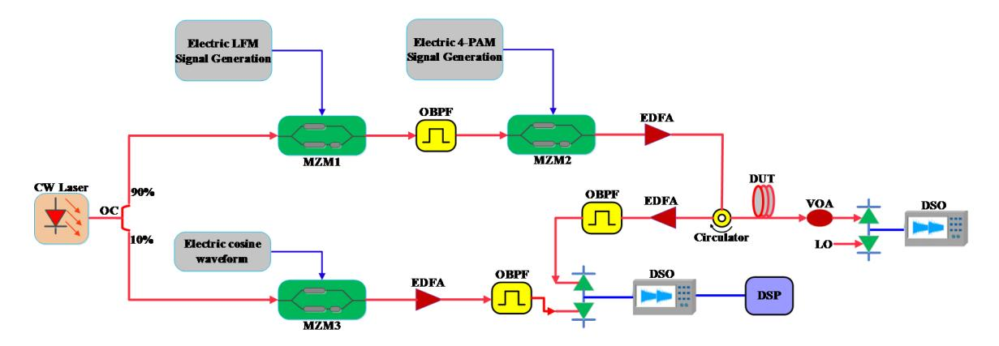
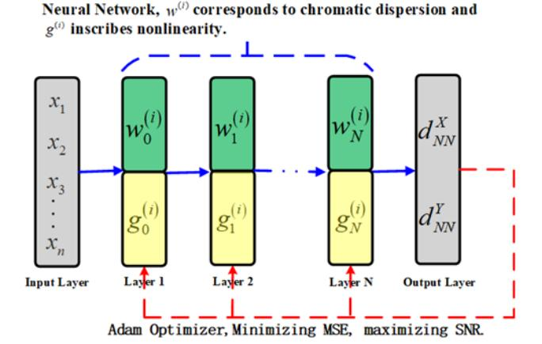
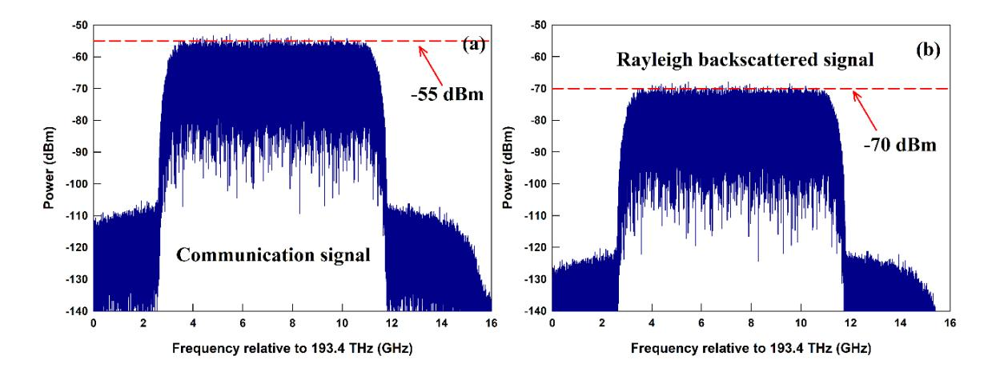
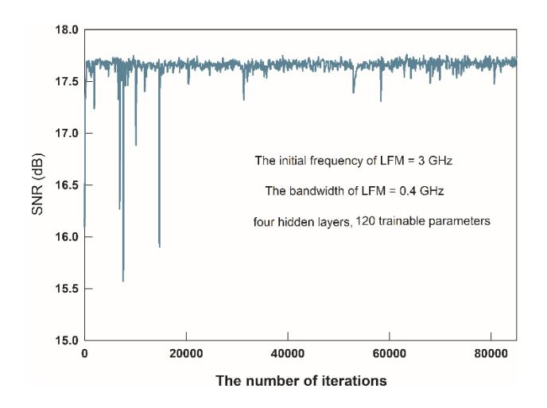
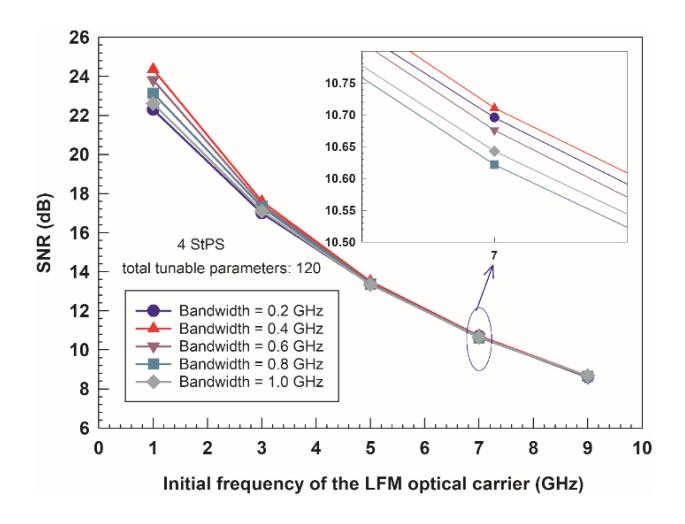
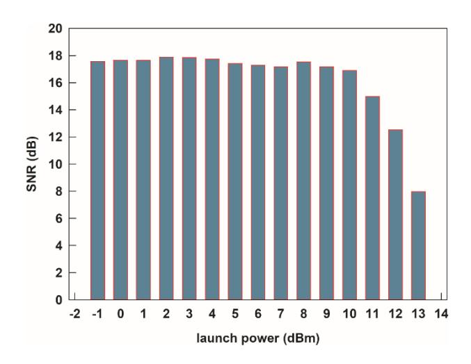

.

Latest updates: [hps://dl.acm.org/doi/10.1145/3638782.3638830](https://dl.acm.org/doi/10.1145/3638782.3638830)

#### RESEARCH-ARTICLE

# Learned Digital Back-Propagation for an optical-domain waveform integrated with communication and sensing

ZHIYI [CHEN](https://dl.acm.org/doi/10.1145/contrib-99661195728), State Grid [Corporation](https://dl.acm.org/doi/10.1145/institution-60004246) of China, Beijing, China [PEIZHE](https://dl.acm.org/doi/10.1145/contrib-99661195043) XIN, State Grid [Corporation](https://dl.acm.org/doi/10.1145/institution-60004246) of China, Beijing, China

PENG [ZHAN](https://dl.acm.org/doi/10.1145/contrib-99661543188), State Grid [Corporation](https://dl.acm.org/doi/10.1145/institution-60004246) of China, Beijing, China

[MENHUA](https://dl.acm.org/doi/10.1145/contrib-99661195351) ZHENG, State Grid [Corporation](https://dl.acm.org/doi/10.1145/institution-60004246) of China, Beijing, China

[YUXIAO](https://dl.acm.org/doi/10.1145/contrib-99661195149) SUN, State Grid [Corporation](https://dl.acm.org/doi/10.1145/institution-60004246) of China, Beijing, China

[CAN LI](https://dl.acm.org/doi/10.1145/contrib-99661195825), State Grid [Corporation](https://dl.acm.org/doi/10.1145/institution-60004246) of China, Beijing, China

[View](https://dl.acm.org/doi/10.1145/3638782.3638830) all

Open Access [Support](https://libraries.acm.org/acmopen) provided by:

State Grid [Corporation](https://dl.acm.org/doi/10.1145/institution-60004246) of China

Beijing University of Posts and [Telecommunications](https://dl.acm.org/doi/10.1145/institution-60016930)

PDF Download 3638782.3638830.pdf 30 December 2025 Total Citations: 0 Total Downloads: 68

Published: 06 December 2023

[Citation](https://dl.acm.org/action/exportCiteProcCitation?dois=10.1145%2F3638782.3638830&targetFile=custom-bibtex&format=bibtex) in BibTeX format

[ICCNS 2023: 2023 13th International](https://dl.acm.org/conference/iccns) Conference on [Communication](https://dl.acm.org/conference/iccns) and [Network](https://dl.acm.org/conference/iccns) Security

*December 6 - 8, 2023 Fuzhou, China*

# Learned Digital Back-Propagation for an optical-domain waveform integrated with communication and sensing

Zhiyi Chen Czy Chen\* State Grid economic and Technology Research Institute Co. Ltd, Beijing, China chen900750@163.com

Menhua Zheng Zmh Zheng State Grid Hubei Electric Power Co. Ltd., Information & Communication Branch, Wuhan, China zhengmenh@163.com

Ping Meng Mp Meng State Grid Information & Telecommunication Branch, Beijing, China ping\_meng@yeah.net

Peizhe Xin Xpz Xin State Grid economic and Technology Research Institute Co. Ltd, Beijing, China xinpeizhe@chinasperi.sgcc.com.cn

Yuxiao Sun Syx Sun State Grid Information & Telecommunication Branch, Beijing, China 34457985@qq.com

Yajie Li Lyj Li Beijing University of Posts and Telecommunications, Beijing, China yajieli@bupt.edu.cn

Peng Zhan Zp Zhan State Grid Hubei Electric Power Co. Ltd., Information & Communication Branch, Wuhan, China 58551986@qq.com

Can Li Lc Li State Grid Information & Telecommunication Branch, Beijing, China 892865925@qq.com

Yongli Zhao Zyl Zhao Beijing University of Posts and Telecommunications, Beijing, China yonglizhao@bupt.edu.cn

## ABSTRACT

This paper presents a nonlinear impairment compensation method for an integrated sensing and communication system (ISAC) in optical fibers. The proposed method is based on learned digital backpropagation algorithm (LDBP). The optical domain ISAC waveform used in this work, i.e., 4-PAM-LFM, is generated by modulating a linear frequency modulation (LFM) optical carrier with a 4-level pulse amplitude-modulation signal. The LFM optical carrier makes the dispersion and nonlinear impairment characteristics of 4-PAM-LFM very different from those of the conventional optical communication waveforms (e.g., 16-QAM). The effectiveness of LDBP for 4-PAM-LFM is verified by building a numerical simulation platform. The influence of initial frequency, bandwidth, and launch power of 4-PAM-LFM on the compensation effectiveness of LDBP is also examined. It is observed that the LDBP compensation results become obviously worse when the initial frequency is increased. On the contrary, the bandwidth of 4-PAM-LFM only has a slight impact on the LDBP compensation results. This work provides a beneficial reference for the design of optical-domain ISAC waveforms.

# CCS CONCEPTS

• Computing methodologies; • Modeling and simulation;

Permission to make digital or hard copies of all or part of this work for personal or classroom use is granted without fee provided that copies are not made or distributed for profit or commercial advantage and that copies bear this notice and the full citation on the first page. Copyrights for components of this work owned by others than the author(s) must be honored. Abstracting with credit is permitted. To copy otherwise, or republish, to post on servers or to redistribute to lists, requires prior specific permission and/or a fee. Request permissions from permissions@acm.org.

ICCNS 2023, December 01–03, 2023, Fuzhou, China

© 2023 Copyright held by the owner/author(s). Publication rights licensed to ACM. ACM ISBN 979-8-4007-0796-4/23/12

<https://doi.org/10.1145/3638782.3638830>

## KEYWORDS

Integrated sensing and communication system, nonlinear impairment, learned digital back-propagation

#### ACM Reference Format:

Zhiyi Chen Czy Chen\*, Peizhe Xin Xpz Xin, Peng Zhan Zp Zhan, Menhua Zheng Zmh Zheng, Yuxiao Sun Syx Sun, Can Li Lc Li, Ping Meng Mp Meng, Yajie Li Lyj Li, and Yongli Zhao Zyl Zhao. 2023. Learned Digital Back-Propagation for an optical-domain waveform integrated with communication and sensing. In 2023 13th International Conference on Communication and Network Security (ICCNS) (ICCNS 2023), December 01–03, 2023, Fuzhou, China. ACM, New York, NY, USA, [5](#page-5-0) pages. [https:](https://doi.org/10.1145/3638782.3638830) [//doi.org/10.1145/3638782.3638830](https://doi.org/10.1145/3638782.3638830)

## 1 INTRODUCTION

In sixth generation (6G) wireless communication systems, the integration of sensing and communication (ISAC) is a core concept [\[1,](#page-5-1) [2\]](#page-5-2). This integration provides various benefits, such as improvement in the measurement distance and accuracy for sensing, appropriate use of spectrum resources, and cost reduction. Nowadays, this focus has also become a research hotspot in fiber optic systems [\[3\]](#page-5-3). Many solutions for the integration of communication and sensing that are applicable in fiber optic systems have been proposed [\[4](#page-5-4)[-8\]](#page-5-5). A very direct way to realize ISAC is the frequency division multiplexing of communication and sensing signals. In [\[4\]](#page-5-4), a coexisting system comprising probabilistic-shaped DP-144-QAM data transmission and distributed optical fiber sensing was successfully demonstrated through operational telecom network. However, this system has a separate design for communication and sensing transceivers, as well as baseband signal processing. A microwave photonic system realizing ISAC has been proposed and implemented in [\[5\]](#page-5-6). The authors employed the orthogonal frequency division multiplexing (OFDM) signal for communications and radar sensing simultaneously. The researchers in [\[6\]](#page-5-7) presented an ISAC waveform in the

Figure 1: A schematic diagram of an ISAC system in optical fiber.

optical domain with higher robustness based on the angle modulation of linear frequency modulation (LFM) radar carrier using constant-envelope OFDM. However, in the solutions presented in [\[5\]](#page-5-6) and [\[6\]](#page-5-7), the optical fibers are only being used as a low-loss transmission media to provide effective geographic coverage for microwave signals.

In this paper, our focus is on another optical-domain ISAC waveform called 4-PAM-LFM [\[7\]](#page-5-8), which is generated by modulating an LFM optical carrier by a 4-level pulse amplitude-modulation (PAM4) signal. In this proposed solution, the optical fiber serves both as a channel for transmitting the data and as a sensitive medium for the Rayleigh backscattering technology. After transmission through the fiber, the communication data is extracted from the forward PAM4 signal, whereas the carrier-corresponding Rayleigh backscattering light is detected to retrieve the sensing information. Similar to the traditional optical communication systems, 4-PAM-LFM also suffers from nonlinear impairment introduced by the single-mode fiber. For instance, a strong self-phase modulation effect (SPM) [\[9\]](#page-5-9) in the fiber is employed to mitigate the CD-induced power fading in [\[7\]](#page-5-8). For this purpose, the launch power of 4-PAM-LFM is increased by about 16 dBm. Apart from these, the stimulated Brillouin scattering (SBS) and laser phase noise also have an impact on 4-PAM-LFM. Additionally, the LFM optical carrier results in a change in the dispersion and nonlinear impairment characteristics of 4-PAM-LFM with respect to conventional optical communication waveforms. How to effectively compensate the nonlinear fiber transmission impairments in 4-PAM-LFM is a valuable and worthy question to be discussed. An effective digital back-propagation algorithm (DBP) [\[10](#page-5-10)[-12\]](#page-5-11) is being used frequently to compensate the nonlinear impairments in a fiber optic communication system. However, it is noteworthy that DBP achieved by means of a split-step Fourier approach (SSFM) suffers from high computational complexity. In this paper, we use a learned digital back-propagation (LDBP) algorithm [\[13\]](#page-5-12) to simultaneously compensate for CD and SPM. In contrast to the SSFM-based DBP, LDBP has low computational complexity and better compensation for nonlinear impairments.

# 2 SYSTEM MODEL AND THE PRINCIPLE OF LDBP

We consider an ISAC system as shown in Figure [1.](#page-2-0) This system is deployed over a standard single-mode fiber. The light emitted by a continuous-wave laser with an ultra-narrow linewidth is divided into two branches, i.e., upper branch and lower branch. The light in the upper branch is routed through a Mach-Zehnder optical modulator (MZM1) and an optical bandpass filter (OBPF1) to create a LFM optical carrier with single-sideband modulation (SSB). MZM1 is operated at the minimum transmission point so as to implement the carrier-suppressed double-sideband modulation (CS-DSB), and its drive voltage is loaded with an electrical LFM signal. OBPF1 is used to remove the -1st order optical sideband to enable SSB. The LFM optical carrier is further fed into the second MZM (MZM2) of the upper branch to accomplish PAM4 modulation. The electrical PAM4 waveform is generated by pulse shaping and pre-distortion operations, and is then loaded onto the drive voltage of MZM2. The power of the optical signal 4-PAM-LFM is boosted using an erbium-doped fiber amplifier (EDFA) and then injected into the fiber. The front end of the fiber results in a Rayleigh-backscattered

Figure 2: The operating principle of LDBP algorithm.

Figure 3: The optical spectrums of the communication signal at the receiver (a) and the Rayleigh backscattered signal (b). Figure Descriptions.

optical signal, whereas the transmitted optical signal is formed at the back end. The power of the transmitted optical signal is tuned by using an adjustable light attenuation (VOA), and is then subject to a pair of balanced photodetectors (PD) for coherent detection, PAM4 decoding, and communication data recovery. The Rayleigh-backscattered optical signal, together with the reference light generated on the lower branch, is sent into a balanced detector for coherent detection and extraction of sensing information.

We denote the optical signal before it enters the fiber optic as  $S_{ISAC}(t)$ . This is mathematically expressed as follows:

$$S_{ISAC}(t) = E_{in}(t) \exp \left[ j \left[ 2\pi \left( f_0 t + \frac{1}{2} k t^2 \right) + \frac{\pi}{4} \right] \right]$$

$$\cos \left[ \pi \frac{S_{PAM}(t)}{V_{\pi}} - \frac{\pi}{4} \right]$$
(1)

where,  $E_{in}(t)$  represents the optical signal from the continuous wave laser,  $S_{\rm PAM}(t)$  is the electrical waveform of PAM4,  $f_0$  is the initial frequency of the LFM optical carrier,  $k=B/T_p$  is the chirp rate of the LFM waveform, and B and  $T_b$  are the bandwidth and repetition period of the LFM optical carrier, respectively [14]. After being transmitted through the fiber, the received signal is superimposed with physical impairments caused by CD, SPM, and phase noise, resulting in the degradation of communication quality. Let the channel impulse response of an optical fiber link be h(t), then the received signal of the communication branch is expressed as:

$$r_{comm}(t) = S_{ISAC}(t) \otimes h(t)$$
 (2)

where,  $\otimes$  denotes the convolution operation. This paper concentrates on the compensation of physical impairments caused by CD and SPM of  $r_{comm}(t)$ .

This paper uses the LDBP algorithm to eliminate the linear and nonlinear impairments in 4-PAM-LFM. LDBP is a deep neural network designed based on the physical knowledge of the fiber optic channel. Each layer in the network contains several weighting coefficients  $\boldsymbol{w}^{(i)}$  and nonlinear activation functions  $\boldsymbol{g}^{(i)}$ . Unlike

other deep learning algorithms, LDBP does not use the bias coefficients during the linear transformation. The weighting coefficients  $w^{(i)}$  are initialized according to the frequency response of the CD. Moreover, in order to lower the computational complexity, we modestly pruned the number of  $w^{(i)}$  contained in each layer of the network. The nonlinear activation function  $g^{(i)}$  is defined as  $g^{(i)}(x) = x \exp(-j\alpha_i |x|^2)$ , where  $w^{(i)}$  and  $\alpha_i$  are optimized by training the neural network based on the steepest gradient descend method. LDBP has the following correspondence with SSFM-based DBP [15]:

$$\hat{\mathbf{x}}_{LDBP} = \mathbf{g} \left( \mathbf{w} \left( \cdots \mathbf{g} \left( \mathbf{w} \mathbf{y} \right) \right) \right), \\ \hat{\mathbf{x}}_{DBP} = \mathbf{N} \left( \mathbf{D} \left( \cdots \mathbf{N} \left( \mathbf{D} \mathbf{y} \right) \right) \right)$$
(3)

where, **y** is the sampled signal at the receiving end, **w** is the matrix formed by the weight coefficients w(i), and **D** and **N** represent the dispersion and nonlinearity operators of the DBP, respectively. During the training process, mean square error, i.e.,  $MSE = E\{|\mathbf{x} - \hat{\mathbf{x}}_{LDBP}|^2\}$  is used as the loss function. Here, **x** is the transmitted symbol and  $\hat{\mathbf{x}}_{LDBP}$  is the actual output of the neural network. Please note that minimizing the MSE is equivalent to maximizing the effective SNR.  $SNR = E\{(|\mathbf{x} - \hat{\mathbf{x}}_{LDBP}|^2)^{-1}\}$ .

#### 3 RESULTS AND DISCUSSION

In order to test the validity of the LDBP algorithm as presented in Figure. 2 on 4-PAM-LFM, we build a numerical simulation platform of the ISAC system as shown in Figure. 1. The laser at the transmitter side has a very small linewidth (50Hz) and an average optical power of 11dBm, with a center frequency of 193.4 THz. The initial frequency and bandwidth of the LFM optical carrier are adjustable. The repetition period of the LFM optical carrier is set to 262.144  $\mu$ s, which corresponds to ~27 km of standard single-mode fiber (SSMF). The length of SSMF is set to 25 km for this study, which is slightly less than 27 km. The PAM4 signal has a data transmission rate of 8 GBaud/s. The transmission of the optical signals in the fiber is simulated using a two-step method [16]. First, the power distribution for the forward and backward propagating signals is solved based on

Figure 4: SNR versus training iteration.

Figure 5: SNR versus the initial frequency of LFM for different bandwidths.

the boundary conditions. Then, the waveforms of the forward and backward signals at each location are derived using SSFM. Figure. 3 shows the optical spectrum diagrams of the Rayleigh backscattered signal and the communication signal at the receiver, respectively. The dispersion parameter and differential group delay (DGD) of SSMF were set to 16 ps/nm/km and  $0.1ps/\sqrt{km}$ , respectively. The impairments due to the non-linearity of the fiber are described by a nonlinear refractive index of SSMF ( $2.6 \times 10^{-20} \ m^2/W$ ). The ASE noise due to EDFA is characterized by a noise figure of 4 dB.

For compensating the nonlinear fiber channel impairments in the communication signals, we use TensorFlow to construct a deep neural network as presented in Figure. 2. It includes four hidden layers with 30 trainable parameters in each layer. Therefore, the

Figure 6: SNR versus the launch power of 4-PAM-LFM, when the initial frequency = 3 GHz, the bandwidth = 0.4 GHz.

total number of trainable parameters is initially 120. In order to further reduce the computational complexity, a pruning algorithm is adopted, which eventually reduces the total number of trainable parameters to 52. Figure. 4 shows the training process of the deep neural network when using the Adam optimizer. As presented, the effective SNR improves by 1.5 dB from the initial 16 dB after training. The multiple minima that appear in the figure are a result of using the pruning algorithm.

The major difference between the ISAC waveform of 4-PAM-LFM and the conventional optical communication waveform is the use of an LFM optical carrier. The initial frequency and bandwidth of LFM may affect the compensation for channel impairments. Hence, we concentrate on the influence of the initial frequency and the bandwidth of the LFM on the compensation efficiency of LDBP. The initial frequency is increased from 1 GHz to 9 GHz, and the bandwidth is increased from 0.2 GHz to 1 GHz. In each case, the effective SNR of the communication signals after compensation by the trained LDBP algorithm is measured. The results are shown in Figure. 5. It can be found that the initial frequency of LFM has a significant influence on the compensation efficiency of LDBP. The higher the initial frequency, the worse the compensation result of LDBP. In particular, when the initial frequency is equal to 9 GHz, the effective SNR is only ~8 dB, which corresponds to a BER of roughly 10-3. At a given initial frequency, the bandwidth of the LFM also has a slight influence on the compensation results of the LDBP.

Finally, we examine the influence of the power injected in the fiber on the LDBP compensation results. The initial frequency of the LFM is set to 3 GHz, and the bandwidth is set to 0.4 GHz. The corresponding results are shown in Figure. 6. When the launch power varies between -1dbm and 9 dBm, the SNR after LDBP compensation stabilizes at about 17 dB. Once the launch power exceeds 10 dBm, the compensated SNR drops rapidly as the nonlinear impairments become very strong. Please note that for improving the

compensation efficiency, we can increase the number of layers and trainable parameters of the neural network for LDBP.

## 4 CONCLUSIONS

In this work, we investigate nonlinear impairment compensation for ISAC systems in optical fibers. A LDBP algorithm is developed for the optical-domain ISAC waveform of 4-PAM-LFM, which is implemented by using a four-layer deep neural network containing ∼52 trainable parameters. The simulation results confirm the effectiveness of LDBP in terms of compensating the nonlinear impairments in 4-PAM-LFM. Meanwhile, the influences of the initial frequency and bandwidth of LFM on the compensation effectiveness of LDBP are compared and discussed. The results show that the initial frequency of LFM remarkably affects the compensation of nonlinear impairments. Therefore, when designing an LDBP for 4-PAM-LFM, the initial frequency is a key factor that should be emphasized.

## ACKNOWLEDGMENTS

This work is supported by the Science and Technology Project of State Grid Corporation of China (No. 5700-202352265A-1-1-ZN).

## REFERENCES

- [1] Zhongxiang Wei, Fan Liu, Christos Masouros, et al. 2022. Toward multi-functional 6G wireless networks: Integrating sensing, communication, and security. IEEE Commun Mag 60, 4 (April 2022), 65-71. [https://doi.org/10.1109/MCOM.002.](https://doi.org/10.1109/MCOM.002.2100972) [2100972](https://doi.org/10.1109/MCOM.002.2100972)
- [2] Fan Liu, Yuanhao Cui, Christos Masouros, et al. 2022. Integrated sensing and communications: Toward dual-functional wireless networks for 6G and beyond. IEEE J. Sel. Areas Commun 40, 6 (March 2022), 1728-1767. [https://doi.org/10.1109/](https://doi.org/10.1109/JSAC.2022.3156632) [JSAC.2022.3156632](https://doi.org/10.1109/JSAC.2022.3156632)
- [3] Yaxi Yan, Hua Zheng, Zhiyong Zhao, et al. 2021. Distributed optical fiber sensing assisted by optical communication techniques. J Light. Technol. 39, 12 (February

- 2021), 3654-3670.<https://doi.org/10.1109/JLT.2021.3057670>
- [4] Ming-Fan Huang, Milad Salemi, Yuheng Chen, et al. 2019. First field trial of distributed fiber optical sensing and high-speed communication over an operational telecom network. J Light. Technol. 38, 1 (August 2019), 75-81. [https:](https://doi.org/10.1109/JLT.2019.2935422) [//doi.org/10.1109/JLT.2019.2935422](https://doi.org/10.1109/JLT.2019.2935422)
- [5] Huang L, Li R, Liu S, et al. 2019. Centralized fiber-distributed data communication and sensing convergence system based on microwave photonics. Journal of Lightwave Technol, 37,21(August 2019), 5406-5416[.https://doi.org/10.1109/JLT.](https://doi.org/10.1109/JLT.2019.2935930) [2019.2935930](https://doi.org/10.1109/JLT.2019.2935930)
- [6] Bai W, Li P, Zou X, et al. 2022. Millimeter-wave joint radar and communication system based on photonic frequency-multiplying constant envelope LFM-OFDM. Opt Express, 30,15(June 2022), 26407-26425.<https://doi.org/10.1364/OE.461508>
- [7] He H, Jiang L, Pan Y, et al. 2023. Integrated sensing and communication in an optical fibre. Light: Science & Applications,12,1(January 2023), 25. [https:](https://doi.org/10.1038/s41377-022-01067-1) [//doi.org/10.1038/s41377-022-01067-1](https://doi.org/10.1038/s41377-022-01067-1)
- [8] Chen Y, Xiao Y, Chen S, et al. 2023. Field Trials of Communication and Sensing System in Space Division Multiplexing Optical Fiber Cable. IEEE Commun Mag, 61,8(August 2023), 182-188[.https://doi.org/10.1109/MCOM.004.2200885](https://doi.org/10.1109/MCOM.004.2200885)
- [9] Gong X, Guo L, Dong Y, et al. 2017. SPM-improved transmission performance of software-reconfigurable IMDD PONs based on digital orthogonal filtering. Journal of Lightwave Technol, 35,20 (August 2017), 4488-4496. [https://doi.org/10.](https://doi.org/10.1109/JLT.2017.2743983) [1109/JLT.2017.2743983](https://doi.org/10.1109/JLT.2017.2743983)
- [10] Behrens C, Makovejs S, Killey R I, et al. 2011. Pulse-shaping versus digital backpropagation in 224Gbit/s PDM-16QAM transmission. Optics express, 19, 14(June 2011),12879-12884.<https://doi.org/10.1364/OE.19.012879>
- [11] Goldfarb G, Li G. 2009. Efficient backward-propagation using wavelet-based filtering for fiber backward-propagation. Optics Express, 17, 11 (May 2009), 8815- 8821.<https://doi.org/10.1364/OE.17.008815>
- [12] Dien N V, Son L T, Tuan N V, et al. 2021. Digital back-propagation optimization for high-baudrate single-channel optical fiber transmissions. Opt Commun, 491,15(July 2021), 126913.<https://doi.org/10.1016/j.optcom.2021.126913>
- [13] Christian Häger and Henry D. Pfister.2021. Physics-Based Deep Learning for Fiber-Optic Communication Systems. IEEE J. Sel. Areas Commun.39,1 (January 2021), 280-294.<http://doi.org/10.1109/JSAC.2020.3036950>
- [14] Pei Zhou; Fangzheng Zhang; Shilong Pan. 2018. Generation of linear frequencymodulated waveforms by a frequency-sweeping optoelectronic oscillator. J Light. Technol. 36,18(15 September 2018), 3927 - 3934. [http://doi.org/10.1109/JLT.2018.](http://doi.org/10.1109/JLT.2018.2854713) [2854713](http://doi.org/10.1109/JLT.2018.2854713)
- [15] Christian Häger, and Henry D. Pfister.2018. Deep learning of the nonlinear Schrödinger equation in fiber-optic communications. In Proceedings of 2018 IEEE International Symposium on Information Theory. (Jun 2018), IEEE, Vail, USA, 1590-1594.<https://doi.org/10.1109/ISIT.2018.8437734>
- [16] Agrawal G P. 2007. Nonlinear Fiber Optics, Fourth edition, Academic Press.