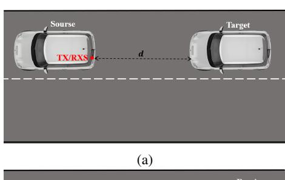
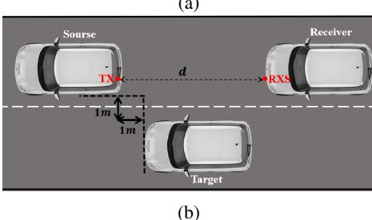
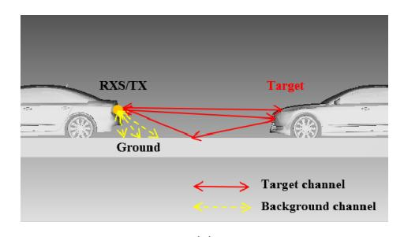
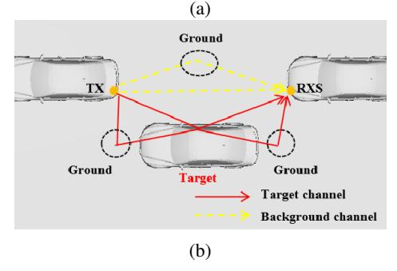
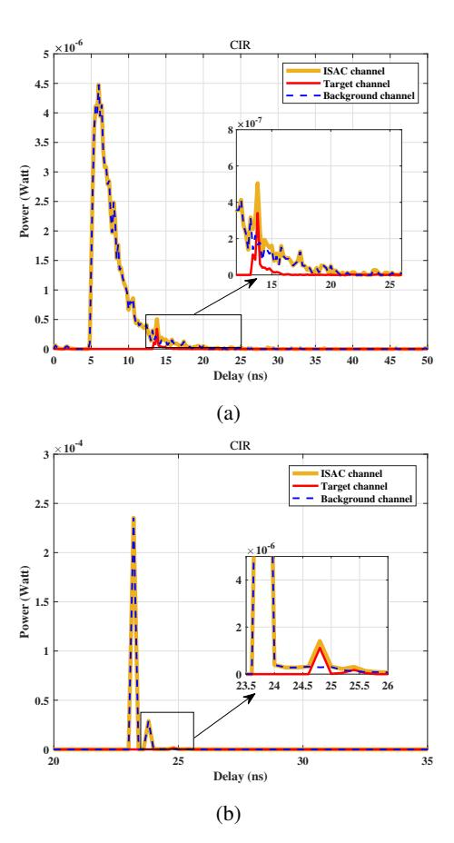
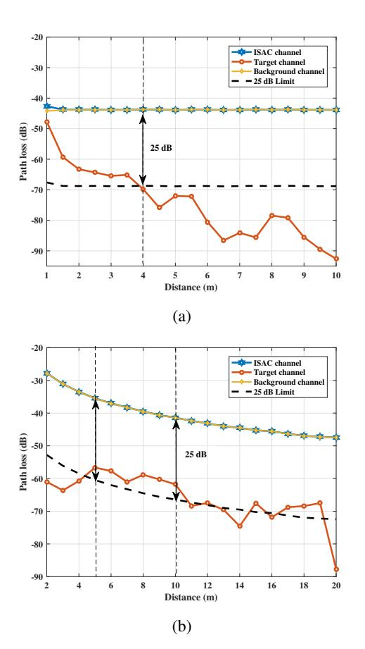
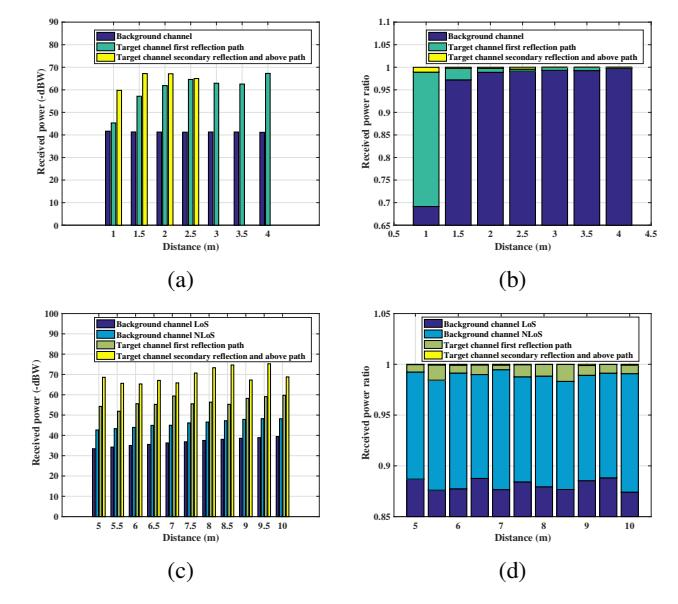
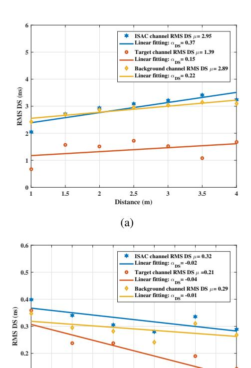

{0}------------------------------------------------

# Analysis of Visible Light-Based ISAC Channel Characteristics in a V2V Scenario

Peiyao Dong1, Pan Tang2, Yue Yin1, Lei Tian1, and Jianhua Zhang1

1State Key Laboratory of Networking and Switching Technology,

Beijing University of Posts and Telecommunications, Beijing, China, 100876

2State Key Laboratory of Information Photonics and Optical Communications,

Beijing University of Posts and Telecommunications, Beijing, China, 100876

{peiyaod, tangpan27}@bupt.edu.cn

Abstract-In this paper, we investigate the visible light-based integrated sensing and communication (ISAC) channel characteristics in a vehicle-to-vehicle (V2V) scenario, focusing on monostatic sensing and bi-static sensing modes. The ISAC channel is divided into a target channel and a background channel. The channel impulse response (CIR) at different distances, as well as the fading characteristics, multipath correlation, and delay spread of the channel within the effective sensing distance in the two sensing modes are investigated by ray tracing simulation. The results show that with the increase of distance, the target channel received power ratio of mono-static sensing decreases by 30%, while the received power ratio of bi-static sensing is stable at about 1.06%, the target channel fading of monostatic sensing is faster than that of bi-static sensing. In addition, the linear fit coefficient of the root mean square (RMS) delay spread (DS) values for mono-static sensing is positive with a mean value of 2.95 which is greater than the mean value of 0.32 for the RMS DS values for bi-static sensing, while the linear fit coefficient of the RMS DS values for bi-static sensing is negative. Overall, the bi-static sensing system outperforms at longer distances, has a more stable target signal received power ratio, better handling target signals and background noise, reducing signal RMS DS, and improving transmission quality and anti-interference capabilities, indicating the advantages of bi-static sensing in V2V scenarios using visible light-based ISAC.

*Index Terms*—V2V, ISAC, visible light communication, channel characteristics, large-scale fading, RMS DS.

# I. INTRODUCTION

Rapid development of intelligent transportation systems (ITS) has led to advancements in vehicle-to-vehicle (V2V) communication technology, which is crucial for improving road safety and traffic efficiency. V2V communication enables vehicles to exchange real-time information about their status and surroundings for better decision-making on the road. Integrated Sensing and Communication (ISAC) technology is considered as a potential technology of the sixth generation (6G) [1]. The application of ISAC technology in V2V systems improves the intelligence of vehicular networks, allowing them not only to communicate but also to collect and analyze data about their environment. In various communication technologies such as sub-6 GHz [2], ultra-wideband (UWB), millimeter wave, terahertz (THz), infrared (IR), and visible light, visible light communication (VLC) is particularly promising, as it uses LED lights for high-speed data transmission and

precise detection. VLC offers high bandwidth, low latency, and strong resistance to electromagnetic interference, making it ideal for vehicle environments [3]. In addition, its easy deployment is facilitated by the widespread availability of visible-light illumination. Thus, the visible light spectrum is a valuable resource for ISAC system applications [4].

In recent years, visible light has found extensive applications in sensing fields, particularly in visible light positioning (VLP) and scatterer sensing. In particular, Ma et al. in [5] explored the backshot VLC and retroreflective visible light communication and positioning (R-VLCP) systems, while Shao et al. in [6] developed a return channel model for return visible light communication and positioning. Zhang et al. in [7] explored the NLoS (Non-Line-of-Sight) optical channels formed by reflections from the ground or objects to establish an integrated channel model for simultaneous communication and sensing. Most of the above are characterization and modeling of ISAC channels in indoor VLC, and the studies focus on characterizing ISAC channels using echo patterns. While the research on sensing integrated channel for outdoor visible light communication is still at an early stage, the research on VLC channel in V2V scenarios has been very extensive, but the research on sensing channel is relatively limited, especially the different sensing modes with different positions of transmitter (TX) and sensing receiver (RXS), and the sensing channel involves the TX-Target-RXS link, which is very different from the communication channel in terms of characterization. Therefore, when analyzing the visible-based ISAC channel characteristics according to some of the existing channel study methods [8], key factors such as large-scale fading, Doppler effects, multipath effects such as LoS (lineof-sight) and NLoS composition, scattering, and reflection must be considered. By comprehensively considering these factors, the signal propagation characteristics under different environmental conditions can be better understood, and the reliability, accuracy, and energy efficiency of ISAC system in complex scenes can be improved.

In this work, we aim to explore the VL-based ISAC channel characteristics under mono-static sensing and bi-static sensing modes by analyzing the signals from unilateral car taillights in a V2V scenario. First, we divide the ISAC channel into

{1}------------------------------------------------

# 2025 IEEE Wireless Communications and Networking Conference (WCNC): 2025 IEEE Wireless Communications and Networking Conference (WCNC) Workshops

the sum of the target channel and the background channel according to the 3GPP framework. Subsequently, we study the difference of the channel impulse response (CIR) at different distances under the two sensing modes. Following this, we study their path loss and root mean square (RMS) delay spread (DS) within the effective sensing distance, respectively. The distribution of the multipath components of the ISAC channel and their proportion are further explored. Finally, we compare and summarize the characteristics of the ISAC channel in mono-static sensing and bi-static sensing modes.

The remainder of this paper is organized as follows. Section II introduces the construction of simulation scenarios. Section III analyzes the characteristics of VL-based ISAC channels in two typical sensing modes. Finally, the concluding remarks are presented.

Fig. 1: (a) mono-static sensing vehicle-to-vehicle scenario; (b) bi-static sensing vehicle-to-vehicle scenario.

#### II. SIMULATION SETUP

# A. Simulation Scenario Set Up

In this work, we used the ray tracing method of the Zemax software, which has been utilized in the creation of IEEE 802.15.13 and 802.11bb reference channel characterization studies, validated with extensive measurements in [9]. We first constructed two typical modes of mono-static sensing and bistatic sensing vehicle scenarios, as depicted in Fig. 1. Vehicle CAD models were imported and manipulated in Zemax®'s "Part Designer", which allowed for user-defined CAD object creation, and the specific type of reflection was determined using the "scattering fraction (SF)" parameter, according to the specifications of the International Commission on Lighting (CIE) [10]. It was assumed that the type of road was R2, the material was asphalt concrete, the car surface was black gloss paint and the scattering coefficient was set to 0.2. TABLE I summarized the specifications for the reference scenario and the coating materials. The selected taillight was

Fig. 2: (a) mono-static sensing vehicle-to-vehicle 3D scenario; (b) bi-static sensing vehicle-to-vehicle 3D scenario.

the commercially available LED OSRAM SYNIOS® P2720 KR DMLQ32.23, with a 60 ° half-angle of view, positioned at the rear of the car. Each luminaire had an optical power set to 1.8 watts to meet typical environmental lighting levels.

TABLE I: Parameters of simulation setup

| Parameter                        | Value                     |
|----------------------------------|---------------------------|
| Lane width                       | 3.75 m                    |
| Light source and detector height | 0.75 m                    |
| Road surface material            | Asphaltic Concrete        |
| Road scatter fraction            | R2                        |
| Car surface                      | Black gloss paint         |
| Car scatter fraction             | 0.2                       |
| LED light source brand type      | OSRAM SYNIOS® P2720       |
|                                  | KR DMLQ32.23-6J5L-26-J3T3 |
| Light source power               | 1.8 W                     |
| View angle of lighting           | 120 °                     |
| Delay resolution                 | 0.2 ns                    |
| FOV of PD                        | 180 °                     |
| Radial size of PD                | 100 mm                    |

The 3D scene layout for V2V in Zemax shown in Fig. 2 is used to study the VL-based ISAC channel characteristics through a simulation setup. Specifically mono-static sensing selects the unilateral red LED automobile taillight as the light source, places the sensing detector at the same location as the taillight, and changes the distance d between the front and rear vehicles in order to analyze the channel characteristics, whereas in bi-static sensing, the relative distances between the transmitting light source and the sensed target are kept unchanged, only the distances d between the transmitting end

{2}------------------------------------------------

and the receiving end are varied in order to analyze the bistatic sensing channel characteristics.

#### III. VL-BASED ISAC CHANNEL CHARACTERIZATION

#### A. VL-based ISAC channel model

The current framework of the ISAC channel model in 3GPP is defined as consisting of two parts: the target channel and the background channel [11]. Specifically, the interaction of a deterministic target on the received signal is modeled by the target-specific channel, while the interaction of the environment other than the target on the received signal is modeled by the background channel. The background channel includes all effects of unintended objects, i.e., environmental targets and clutter. It has also been shown in some existing ISAC channel modeling studies that it is a superposition of the target and background channels [12]–[14]. The 3GPP framework can be expressed by the following equation:

$$H_{ISAC} = H_{target} + H_{background}, \tag{1}$$

where  $H_{ISAC}$ ,  $H_{target}$ , and  $H_{background}$  denote the ISAC channel, the target specific channel, the background channel, respectively. With such a framework in place, further elaboration is needed to analyze specific target and background channels.

# B. Channel Impulse Responses

After creating the simulation environment in Zemax®, we used its non-sequential ray tracing capabilities to determine the CIR. In ray tracing methods, rays are tracked along physically achievable paths until they intercept objects. The software can accurately describe the interaction of light emitted by a light source within a specific range. For a given number of rays and scattering events, the received power and associated path length are calculated for each ray. This is then imported into Matlab® and processed to generate the CIR:

$$h(t) = \sum_{i=1}^{N} P_i \delta(t - \tau_i), \qquad (2)$$

where N is the number of rays received by PD,  $P_i$  represents the received power of the  $i^{th}$  ray,  $\delta(t)$  is the Dirac delta function,  $\tau_i$  is the propagation time of the  $i^{th}$  ray, therefore, the CIR of ISAC channel can be expressed as [15]:

$$h_{isac}(t) = \sum_{i=1}^{N} P_{isac}^{i} \delta(t - \tau_i), \tag{3}$$

$$h_{tar}(t) = \sum_{i=1}^{N} P_{tar}^{i} \delta(t - \tau_i), \tag{4}$$

$$h_{bg}(t) = \sum_{i=1}^{N} P_{bg}^{i} \delta(t - \tau_{i}),$$
 (5)

where  $P_{isac}^{i}$ ,  $P_{tar}^{i}$ ,  $P_{bg}^{i}$  represent the received power of the  $i^{th}$  ray of the ISAC, target and background channels,  $h_{isac}(t)$ ,

Fig. 3: (a) CIR of mono-static sensing channel; (b) CIR of bi-static sensing channel.

 $h_{tar}(t)$ ,  $h_{bg}(t)$  denote the channel impulse response of the ISAC, target and background channels, respectively.

As shown in Fig. 3, shows the CIR at different distances for mono-static sensing and bi-static sensing, respectively. It can be seen that the delay range of the mono-static sensing channel pulse is larger than that of the bi-static sensing, and the trailing is longer. This is because mono-static sensing mainly involves ground reflections near taillights as well as reflected echoes from the target vehicle. Due to the relatively large number of paths reflected by the ground and the varying length of time to reach the receiver, a long trailing part is usually generated in the signal, which complicates the monostatic sensing multipath effect. While bi-static sensing mainly involves the LoS path between the transmitter and receiver, the NLoS path through the ground, and the multipath path through the target composition. The LoS path accounts for the dominance of the ISAC channel, the propagation path of the signal is short and relatively straight line, the multipath effect is small, and the arrival time of the signal is mainly concentrated in a certain range. Even with reflections from the ground and the sensing target, the trailing of the signal is relatively short.

{3}------------------------------------------------

# C. Optical Path Loss

The visible light optical path loss (OPL) can describe the attenuation of the power during the propagation of an optical signal through space. It can be expressed as:

$$OPL = 10\log_{10}\left(P_{RXS}/P_{TX}\right),\tag{6}$$

$$P_{RXS} = \int_0^\infty h(t)dt,\tag{7}$$

where  $P_{RXS}$  is the received power of sensing detector,  $P_{TX}$  is the Light source emission power of LED and h(t) denotes the CIR between the LED and the PD.

Fig. 4: (a) mono-static sensing channel path loss simulation data; (b) bi-static sensing channel path loss simulation data.

Fig. 4 analyzes the path loss simulation data of the overall ISAC channel, target channel, and background channel for mono-static sensing and bi-static sensing. We use 25 dB as a threshold limit for the analysis, and call the distance where the difference between the ISAC channel path loss and the target channel path loss is less than 25 dB as the effective sensing distance, so it can be seen from Fig. 4 that the effective sensing distance for mono-static sensing is the distance between TX and the target in the range of 4 m, while the bi-static sensing is in the range of the first 5 m, the target vehicle and the receiving vehicle will overlap and affect the

Fig. 5: (a) Received power of mono-static sensing channel; (b) Received power ratio of mono-static sensing channel; (c) Received power of bi-static sensing channel; (d) Received power ratio of bi-static sensing channel.

sensing effect, so the effective sensing distance for bi-static sensing is the distance between TX and RXS in the range of 5-10 m.

Fig. 5 specifically extracts the multipath channel parameters from the simulation data [16] and analyzes the different multipath received power comparison plots and the percentage of multipath within the sensing effective distance for monostatic sensing and bi-static sensing. In the mono-static sensing scenario, within the effective sensing distance, the received power of the target channel decreases with distance increases due to the attenuation of both first and secondary reflection signals, and its received power ratio also decreases from 31% to 0.24%, a power attenuation of about 30%. The background and ISAC channels remain nearly constant, as the background channel dominates the ISAC channel (about 95% or more) mainly from direct light reflections from the surrounding ground. Only when the target vehicle is very close to the light source, e.g., around 1-1.5 m, the light is partially blocked by the target vehicle. When the distance increases to about 1.5 m, the background channel power increases temporarily until it is no longer blocked by the target vehicle. After that, the background channel power stabilizes and changes very little with distance. In the bi-static sensing scenario, within the effective distance, the received power of the target channel also decreases with distance, and its received power ratio varies between 1.56% and 0.53%, fluctuating around the average value of 1.06%. Because the increase in path length between the target and receiver, the first reflection signal and the secondary reflection will be affected by more reflection paths, which may lead to the signal being smoother 

{4}------------------------------------------------

or showing anomalous fluctuations at certain distances, but the overall reflected signal passing through the target shows the a gradual attenuation with increasing distance, so the received power of the target decreases. The received power of the background channel and ISAC channel also decreases with distance increases. Because the power of both the LoS and NLoS paths of the background channel diminishes with distance, and since the background channel constitutes a significant portion of the ISAC channel, where the LoS path is dominant and the received power ratio is stable above 85% their trends are similar.

In summary, the received power of the mono-static target channel decays faster than the bi-static sensing modes with distance increases, due to the reflections from the TX-Target and Target-RXS path. These signals, especially the first and secondary reflections, weaken rapidly with distance, and their received power ratio decreases rapidly. In contrast, the bistatic sensing target channel only experiences attenuation from the Target-RXS path, resulting in slower power decay, and the received power ratio of the target channel is more stable. The received power of the bi-static sensing background channel decays faster than that of the mono-static background channel with distance increases, as the LoS and NLoS signal attenuation in bi-static sensing changes more rapidly with distance. Meanwhile, the mono-static background channel is mainly influenced by the surrounding ground reflections, causing its received power to vary relatively smoothly.

#### D. RMS DS

Another fundamental channel characteristic is the root mean square delay spread which is a metric that represents the temporal dispersion of multipath transmissions. the RMS delay spread and mean excess delay are given by [17], respectively:

$$\tau_{RMS} = \sqrt{\frac{\int_0^\infty (t - \tau_0)^2 h(t) dt}{\int_0^\infty h(t) dt}},$$
 (8)

$$\tau_0 = \frac{\int_0^\infty t \times h(t)dt}{\int_0^\infty h(t)dt},\tag{9}$$

the linear model is often used to fit the RMS DS in existing research, which can be expressed as:

$$\tau = \alpha_{DS} \cdot d + \beta_{DS} + X_{\sigma}^{DS},\tag{10}$$

where  $\alpha_{DS}$  and  $\beta_{DS}$  are the slope and intercept of fitting curves, and  $X_{\sigma}^{DS}$  is the standard deviation between the RMS DS and fitting curve.

As shown in Fig. 6, the RMS DS within the effective sensing distance of mono-static sensing and bi-static sensing is simulated and fitted with a linear equation. Specifically, as shown in Fig. 6a, in the mono-static sensing scenario, with increasing distance, the RMS DS of the ISAC, background, and target channels generally show an upward trend, as evidenced by the positive slopes of the fits. The background channel is close to the trend of the overall channel because

Fig. 6: (a) RMS DS simulation data and linear fitting of monostatic sensing channel; (b) RMS DS simulation data and linear fitting of bi-static sensing channel.

7.5

the background channel accounts for a large proportion of the overall ISAC channel, with a mean value of  $\mu=2.89$  greater than the target channel mean value of  $\mu=1.39$ , indicating that the background signal is more affected by the propagation environment. The reason that the target channel RMS DS changes with increasing distance is that when in mono-static sensing, the increasing distance of the target may lead to changes in the reflection path of the signal, the multipath components of TX-Target, Target-RXS may change, and the effect of multipath propagation effect is intensified, resulting in longer delay of the signal transmission, increased complexity of the channel, and gradual degradation of the signal quality.

In contrast, in bi-static sensing Fig. 6b, the RMS DS of the ISAC and target channels show a downward trend with increasing distance, and the background channel trend remains similar to the overall ISAC channel. The slopes of their linear fits are all negative. This is because in bi-static sensing, the LoS path of the background channel dominates the overall ISAC channel, and the effect of multipath propagation decreases with distance. The RMS DS mean of the background channel is  $\mu=0.29$ , higher than the target channel's mean

{5}------------------------------------------------

value  $\mu=0.21$ . Because for the target channel, which itself has fewer propagation paths, coupled with that the relative distance between TX and target remains constant, while only the Target-RXS distance changes, the multipath variation is relatively reduced compared to the change of TX-RXS of the background channel. The attenuation effect of the propagation of the target signal may be more pronounced with the increase of the Target-RXS distance, especially in long-distance transmissions, where the power of the target signal is diminished, leading to a reduction in RMS DS.

Both mono-static and bi-static sensing show large fluctuations in the target signal's delay spread, likely due to the presence and irregular shape of the target, causing significant path variations. The background channel delay also shows slight fluctuations due to the target channel's influence [15]. The key difference is that the overall RMS DS in mono-static sensing is larger than bi-static sensing, and increases with distance, while in bi-static sensing, the RMS DS decreases. Therefore, bi-static sensing offers better performance, especially at longer sensing distances, effectively handling target signals and background noise, reducing signal delay spread, improving signal quality, and enhancing robustness and accuracy of the sensing system.

#### IV. CONCLUSIONS

This paper investigates the visible light-based integrated sensing and communication channel characteristics in V2V scenarios using ray-tracing simulations. Two typical modes of mono-static sensing and bi-static sensing are selected, the large-scale fading characteristics, multipath correlation, and delay spread are analyzed in the effective sensing distance. The simulation results show that the received power of the target channel of mono-static sensing fades faster than that of bi-static sensing with distance increases, because its signal needs to go through the TX-Target and Target-RXS echo reflection paths, while bi-static sensing only considers the Target-RXS path, and its target channel received power ratio is also relatively stable. As for the background channel, with distance increases the received power of bi-static sensing fades faster because its LoS and NLoS signal attenuation varies significantly with the distance, while mono-static sensing is mainly affected by the surrounding ground reflection and the variation is smoother. In addition, the RMS DS of mono-static sensing is larger than that of bi-static sensing, and with the increase of sensing distance, the RMS DS value of monostatic sensing gradually increases, while the RMS DS of bistatic sensing gradually decreases. In conclusion, the bi-static sensing can more effectively deal with the target signal and background noise at longer distances, has a more stable target signal received power ratio, reduce the delay spread, and improve the signal transmission quality and anti-interference capability.

# ACKNOWLEDGMENT

The work was supported by the National Natural Science Foundation of China (No. 62201086, No. 62201087

and No. 62101069), the Fund of State Key Laboratory of IPOC (BUPT) (No. IPOC2023ZT02), and funded by Beijing University of Posts and Telecommunications-China Mobile Research Institute Joint Innovation Center.

#### REFERENCES

- J. Zhang, J. Wang, Y. Zhang, Y. Liu, Z. Chai, G. Liu, and T. Jiang, "Integrated sensing and communication channel: Measurements, characteristics, and modeling," *IEEE Communications Magazine*, vol. 62, no. 6, pp. 98–104, 2024.
- [2] J. Zhang, Y. Zhang, Y. Yu, R. Xu, Q. Zheng, and P. Zhang, "3-D mimo: How much does it meet our expectations observed from channel measurements?" *IEEE Journal on Selected Areas in Communications*, vol. 35, no. 8, pp. 1887–1903, 2017.
- [3] M. Uysal, Z. Ghassemlooy, A. Bekkali, A. Kadri, and H. Menouar, "Visible light communication for vehicular networking: Performance study of a V2V system using a measured headlamp beam pattern model," *IEEE Vehicular Technology Magazine*, vol. 10, no. 4, pp. 45– 53, 2015.
- [4] P. Tang, Y. Yin, Y. Tong, S. Liu, L. Li, T. Jiang, Q. Wang, and M. Chen, "Channel characterization and modeling for VLC-IOE applications in 6G: A survey," *IEEE Internet of Things Journal*, vol. 11, no. 21, pp. 34872–34895, 2024.
- [5] S. Ma, R. Yang, B. Li, Y. Chen, H. Li, Y. Wu, M. Safari, S. Li, and N. Al-Dhahir, "Optimal power allocation for integrated visible light positioning and communication system with a single led-lamp," *IEEE Transactions on Communications*, vol. 70, no. 10, pp. 6734–6747, 2022.
- [6] S. Shao, A. Salustri, A. Khreishah, C. Xu, and S. Ma, "R-VLCP: Channel modeling and simulation in retroreflective visible light communication and positioning systems," *IEEE Internet of Things Journal*, vol. 10, no. 13, pp. 11 429–11 439, 2023.
- [7] P. Zhang, J. Wu, Z. Wei, Y. Sun, R. Deng, and Y. Yang, "Channel modeling for NLoS visible light networks with integrated sensing and communication," *Optics Letters*, vol. 49, no. 11, pp. 2861–2864, 2024.
- [8] T. Jiang, J. Zhang, P. Tang, L. Tian, Y. Zheng, J. Dou, H. Asplund, L. Raschkowski, R. D'Errico, and T. Jämsä, "3GPP standardized 5G channel model for IIOT scenarios: A survey," *IEEE Internet of Things Journal*, vol. 8, no. 11, pp. 8799–8815, 2021.
- [9] H. B. Eldeeb, M. Uysal, S. M. Mana, P. Hellwig, J. Hilt, and V. Jungnickel, "Channel modelling for light communications: Validation of ray tracing by measurements," in 2020 12th International Symposium on Communication Systems, Networks and Digital Signal Processing (CSNDSP), 2020, pp. 1–6.
- [10] R. E. Stark, "Road surfaces reflectance influences lighting design," Lighting Design+ Application, vol. 16, no. 4, pp. 42–46, 1986.
- [11] Y. Zhang, J. Zhang, Y. Pei, Y. Liu, and T. Jiang, "Latest progress for 3GPP ISAC channel modeling standardization," *Science China* (*Information Sciences*), vol. 67, no. 11, pp. 357–358, 2024.
- [12] J. Lou, R. Liu, C. Jiang, X. Han, Z. Han, Q. Yang, and Z. Wang, "A unified channel model for both communication and sensing in integrated sensing and communication systems," in 2023 IEEE 98th Vehicular Technology Conference (VTC2023-Fall), 2023, pp. 1–6.
- [13] Y. Chen, Z. Yu, J. He, W. Yang, J. Li, and G. Wang, "Multi-scattering centers extraction and modeling for ISAC channel modeling," in 2024 18th European Conference on Antennas and Propagation (EuCAP), 2024, pp. 1–5.
- [14] Y. Liu, J. Zhang, Y. Zhang, H. Gong, T. Jiang, and G. Liu, "How to extend 3-D GBSM to integrated sensing and communication channel with sharing feature?" *IEEE Wireless Communications Letters*, vol. 13, no. 8, pp. 2045–2049, 2024.
- [15] W. Chen, Y. Zhang, Y. Liu, J. Zhang, H. Gong, T. Jiang, and L. Xia, "An empirical study of ISAC channel characteristics with human target impact at 105 GHz," *Electronics Letters*, vol. 60, no. 17, p. e70017, 2024
- [16] J. Zhang, C. Pan, F. Pei, G. Liu, and X. Cheng, "Three-dimensional fading channel models: A survey of elevation angle research," *IEEE Communications Magazine*, vol. 52, no. 6, pp. 218–226, 2014.
- [17] E. Sarbazi, M. Uysal, M. Abdallah, and K. Qaraqe, "Ray tracing based channel modeling for visible light communications," in 2014 22nd Signal Processing and Communications Applications Conference (SIU), 2014, pp. 702–705.