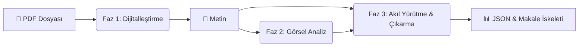

# 🏭 O-ISAC Extraction Pipeline (v4.0) - Kullanım Kılavuzu

Bu belge, projenin "kalbi" olan **Otomatik Veri Çıkarma Hattı (Extraction Pipeline v4)** sisteminin nasıl çalıştığını, hangi veriyi nereden aldığını ve nasıl işlediğini adım adım açıklar.

---

## 🏗️ Büyük Resim: Sistem Nasıl Çalışıyor?

Sistemimiz bir "Fabrika Hattı" gibi çalışır. Bir uçtan **PDF** girer, diğer uçtan **Özetlenmiş Yapısal Veri (JSON/CSV)** çıkar. Bu süreç 3 ana fazdan oluşur.

---

## 🔍 Adım Adım Detaylar

### 🏁 GİRDİ (Input)
*   **Kaynak:** `data/retrieved_docs/` klasörü.
*   **Format:** `O_ISAC_XXX.pdf` formatındaki bilimsel makaleler.
*   **Tetikleyici:** Bu klasöre yeni bir PDF eklendiğinde sistem onu fark eder (Checkpoint mekanizması).

---

### Phase 1: Dijitalleştirme (OCR & Temizlik)
Fabrikanın ilk adımı, PDF'i makinenin okuyabileceği bir formata çevirmektir.

*   **Motor:** `marker-pdf` (Python kütüphanesi).
*   **Ne Yapar?**
    *   PDF sayfalarını tarar.
    *   Yazıları metne çevirir.
    *   Matematik formüllerini LaTeX formatına dönüştürür.
    *   Tabloları ve resimleri ayıklar.
*   **Çıktı:** `data/processed_markdowns/O_ISAC_XXX/` klasöründe bir `.md` dosyası ve resim klasörü.

👉 **[Detaylı Teknik İnceleme: Phase 1 Nasıl Çalışır?](PHASE1_DIGITIZATION.md)**

---

### Phase 2: Görsel Analiz (Visual Intelligence)
Metin tek başına yetmez; grafikler performansı anlatır.

*   **Motor:** **Google Gemini 2.5 Flash** (Vision Model).
*   **Ne Yapar?**
    *   Faz 1'de ayrıştırılan resimlere tek tek bakar.
    *   *"Bu bir Sankey diyagramı mı? Bu bir BER (Bit Error Rate) grafiği mi?"* diye sorar.
    *   Grafik ise üzerindeki verileri okumaya çalışır (örn: *"SNR 20dB iken BER 10^-3"*).
*   **Çıktı:** Makale klasörü içinde `visual_analysis.txt` dosyası. (Bu dosya, resimlerin "metinleşmiş" halidir).

👉 **[Detaylı Teknik İnceleme: Phase 2 Nasıl Çalışır?](PHASE2_VISUAL_ANALYSIS.md)**

---

### Phase 3: Akıl Yürütme & Veri Çıkarma (The Brain)
Burası en kritik "Düşünme" aşamasıdır. V4 Pipeline burada devreye girer.

*   **Motor:** **Llama 3.3 70B** (Groq API üzerinden) + `CoTAssembler` (Kendi yazdığımız modül).
*   **Girdi:**
    1.  Faz 1'den gelen Metin.
    2.  Faz 2'den gelen Görsel Analiz notları.
    3.  `schema_v2.yaml` (Hangi verileri aradığımızı söyleyen şablon).
*   **Süreç (Zincirleme Düşünce - Chain of Thought):**
    Modelden hemen cevabı istemeyiz. Şu adımları izletiriz:
    1.  **Rol Tanımı:** *"Sen kıdemli bir editörsün."*
    2.  **Görsel Kontrol:** *"Görsellerden ne anladığını önce bana kanıtla."*
    3.  **Konsept Analizi:** *"Bu sistem kablolu mu kablosuz mu? Hibrit mi?"*
    4.  **Veri Doğrulama:** *"Verilen rakamlar fizik kurallarına uyuyor mu?"*
    5.  **JSON Çıktısı:** Son olarak, tüm bu bilgileri `Paper_ID`, `Data_Rate`, `Waveform_Type` gibi 50+ kategoriye ayırarak doldurur.
*   **Çıktı:** `data/extraction_results_v4/` içinde:
    *   `O_ISAC_XXX.json`: Her makale için detaylı karne.
    *   `extraction_v4_unified.json`: Tüm makalelerin toplu hali.

👉 **[Detaylı Teknik İnceleme: Phase 3 Nasıl Çalışır?](PHASE3_COT_ENGINE.md)**

---

## 📦 ÇIKTI (Output) ve Kullanım

Sistem çalıştıktan sonra elinizde şunlar olur:

1.  **JSON Dosyaları:** Makinenin okuyacağı ham veri.
2.  **CSV Özeti:** Excel'de açıp filtreleyebileceğiniz tablo (`extraction_v4_summary.csv`).
3.  **Makale İskeleti (Backbone):** Bu veriler, makale yazım aşamasında *"Results"* ve *"Tables"* bölümlerini otomatik besler.

---

## 🛠️ Teknik Özet Tablosu

| Aşama | Girdi | İşleyen Motor | Çıktı | Konum |
|:---|:---|:---|:---|:---|
| **P1** | `.pdf` | `marker` | `.md` + `.png` | `data/processed_markdowns/` |
| **P2** | `.png` | `Gemini 2.5` | `visual_analysis.txt` | `data/processed_markdowns/.../` |
| **P3** | `.md` + `.txt` | `Llama 3.3` (Groq) | `.json` (+Reasoning) | `data/extraction_results_v4/` |

---

## 📂 Teknik Dosya ve Çıktı Haritası (Technical File Map)

Sistemin arka planında çalışan kodların tam adresleri ve ürettikleri dosyaların detaylı listesi şöyledir:

### 1. Ana Yönetici (The Controller)
*   **Dosya:** [`analysis/notebooks/extraction_pipeline_v4.py`](analysis/notebooks/extraction_pipeline_v4.py)
*   **Görevi:** Tüm süreci yöneten ana komutan. Faz 1, 2 ve 3'ü sırayla çağırır.
*   **Fonksiyon:** `run_v4_pipeline()`

### 2. Faz 1: Dijitalleştirme Motoru
*   **Dosya:** [`analysis/notebooks/extraction_pipeline_v3.py`](analysis/notebooks/extraction_pipeline_v3.py) (V3'ten miras alındı)
*   **Fonksiyon:** `phase1_marker_conversion()`
*   **Girdi:** `data/retrieved_docs/[ID].pdf`
*   **Çıktı:** 
    *   `data/processed_markdowns/[ID]/[ID].md` (Ham Metin)
    *   `data/processed_markdowns/[ID]/[ID]/` (Resim Klasörü)

### 3. Faz 2: Görsel Analiz Motoru
*   **Dosya:** [`analysis/notebooks/extraction_pipeline_v3.py`](analysis/notebooks/extraction_pipeline_v3.py) (V3'ten miras alındı)
*   **Fonksiyon:** `phase2_visual_analysis()`
*   **Girdi:** Faz 1'den çıkan resimler (`.png`, `.jpg`).
*   **Çıktı:** `data/processed_markdowns/[ID]/visual_analysis.txt` (Grafiklerin metin açıklaması).

### 4. Faz 3: Akıl Yürütme Motoru (CoT Engine)
*   **Dosya:** [`analysis/cot_laboratory/core/assembler.py`](analysis/cot_laboratory/core/assembler.py)
*   **Sınıf:** `CoTAssembler`
*   **Görevi:** "Tarif" (Recipe) dosyasına göre LLM'i yönlendirmek.
*   **Kullanılan Tarif:** [`analysis/cot_laboratory/recipes/experiment_v1_full_analysis.yaml`](analysis/cot_laboratory/recipes/experiment_v1_full_analysis.yaml)
*   **Girdi:** 
    *   `.md` metni (Faz 1'den)
    *   `visual_analysis.txt` (Faz 2'den)
*   **Çıktı:** [`data/extraction_results_v4/[ID]_v4.json`](data/extraction_results_v4/) (Nihai Analiz).

### 5. Sonuç Toplayıcı (Aggregator)
*   **Dosya:** [`analysis/notebooks/extraction_pipeline_v4.py`](analysis/notebooks/extraction_pipeline_v4.py)
*   **Fonksiyon:** `save_aggregated_results()`
*   **Görevi:** Biten tüm JSON'ları toplar, CSV yapar.
*   **Nihai Çıktılar:**
    *   `data/extraction_results_v4/extraction_v4_unified.json` (Tüm veri seti)
    *   `data/extraction_results_v4/extraction_v4_summary.csv` (Excel için özet tablo)

---

