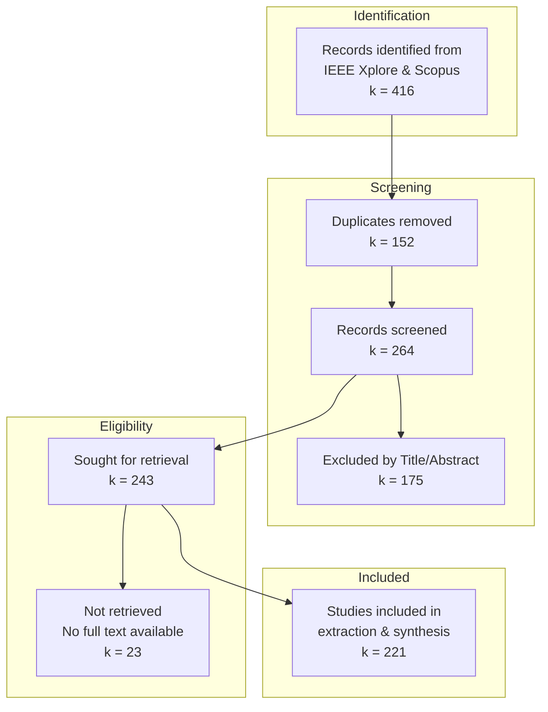

# II. SURVEY METHODOLOGY (PRISMA 2020)

## A. Protocol and Registration
This systematic review was conducted in strict accordance with the **Preferred Reporting Items for Systematic Reviews and Meta-Analyses (PRISMA) 2020** guidelines [Page2020]. Unlike traditional narrative reviews, which are susceptible to selection bias, our methodology follows a formal protocol to ensure reproducibility and comprehensiveness. The protocol for this review, including the research questions and search strategy, was documented prior to the literature search and is available at [OSF Link].

## B. Information Sources and Search Strategy
To capture the multidisciplinary nature of Optical Integrated Sensing and Communication (O-ISAC), we performed a comprehensive search across two major academic databases: **IEEE Xplore** and **Scopus**. The search covered the period from **January 2020 to December 2025**, with earlier foundational works (pre-2020) included if they clearly demonstrated joint sensing-communication functionality on optical carriers.

We employed a multi-string Boolean search strategy combining keywords from two primary domains:

*   **Block A (ISAC Concepts):** ("integrated sensing and communication" OR ISAC OR "joint sensing and communication" OR "joint communication and sensing" OR "joint radar-communication" OR "dual-function radar-communication" OR DFRC OR "simultaneous sensing and communication")
*   **Block B (Optical Media):** (optical OR photonic OR "optical fibre" OR "optical fiber" OR fibre OR fiber OR "free-space optical" OR FSO OR "visible light" OR "visible light communication" OR VLC OR LiFi OR LiDAR OR LIDAR OR "optical radar")

The core Boolean structure used for searches was: **(Block A) AND (Block B)**. The full search strings and query syntax for each database are detailed in **Appendix A**.

## C. Eligibility Criteria
To ensure a focused analysis of the physical-layer integration, the following inclusion and exclusion criteria were applied:

**Inclusion Criteria:**
1.  **Scope:** Studies proposing a physical-layer convergence of optical sensing and communication (e.g., shared waveform, shared hardware, or joint spectrum allocation).
2.  **Type:** Peer-reviewed journal articles and full-length conference proceedings.
3.  **Content:** Papers providing quantitative performance metrics (at least one communication metric AND one sensing metric) or specific system architectures.
4.  **Domain:** Both cabled O-ISAC (fiber-based) and wireless O-ISAC (FSO, VLC, LiDAR-like) systems.

**Exclusion Criteria:**
1.  **Domain:** Studies focused solely on RF-domain ISAC without an optical component.
2.  **Modality:** Studies focused on "Pure Sensing" (e.g., classical LiDAR, φ-OTDR without communication) or "Pure Communication" (e.g., standard FSO link) without integration.
3.  **Language:** Non-English publications.
4.  **Format:** Abstracts, posters, patents, theses, and non-peer-reviewed preprints.

## D. Study Selection Process
The selection process followed a three-phase screening workflow conducted by **two independent reviewers**, as illustrated in the **PRISMA Flow Diagram (Fig. 2)**.

**Fig. 2.** PRISMA 2020 Flow Diagram describing the study selection process for O-ISAC systematic review.

Title/abstract screening was performed independently by two reviewers, with disagreements resolved through consensus discussion. For full-text eligibility, records were coded using standardized exclusion reasons: `EXC-WRONG-DOMAIN` (RF-only ISAC), `EXC-PURE-SENSING` (no communication function), `EXC-PURE-COMM` (no sensing function), and `EXC-NO-PHY` (insufficient physical-layer detail).

## E. Data Extraction and Quality Assessment

### E.1 Data Extraction Process
For each included study, we extracted data using a predefined, version-controlled **O-ISAC Extraction Schema** (JSON format). Extraction was performed at two levels:

*   **Study-level:** Bibliographic information, system classification (cabled vs. wireless O-ISAC), and qualitative claims.
*   **Scenario-level:** Multiple operating points per study (e.g., different distances, SNR regimes, turbulence levels) to faithfully capture trade-off curves.

The extracted data items included:
1.  **System Characteristics:** Medium class (fiber/FSO/VLC), carrier band, operational environment, link topology.
2.  **Transceiver Architecture:** Source type (laser/LED), modulation type, detector, wavelength, power.
3.  **Waveform Design:** Communication waveform family, sensing waveform family, ISAC waveform relationship.
4.  **Channel Parameters:** Fiber length, attenuation, turbulence model, link distance.
5.  **Performance Metrics:** Data rate (Gbps), BER, spectral efficiency, sensing range, range resolution, localization error.
6.  **Trade-off Characterization:** Coupling mode, trade-off type (rate vs. RMSE, etc.), representation (curve/Pareto/single-point).

### E.2 Technical Quality Assessment Form (TQAF)
Given the engineering nature of O-ISAC studies, conventional clinical risk-of-bias tools are not applicable. Instead, we developed a custom **Technical Quality Appraisal Framework (TQAF)** tailored for physical-layer research. Each study was independently rated by two reviewers across five dimensions using an ordinal scale (0 = low, 1 = moderate, 2 = high):

| Dimension | Assessment Focus |
|:----------|:-----------------|
| **Modelling Fidelity** | Explicit, realistic signal/channel/hardware models |
| **Validation Strength** | Meaningful baselines, scenario coverage, stress testing |
| **Experimental Validity** | Hardware transparency, calibration, repetition (if experimental) |
| **Metric Completeness** | Both communication AND sensing metrics reported under same scenario |
| **Reproducibility** | Parameter sufficiency, code/data availability |

TQAF ratings were not used as exclusion criteria, but informed the strength of evidence in the narrative synthesis and sensitivity analyses.

## F. Data Synthesis
A formal statistical meta-analysis was not performed due to the high heterogeneity in performance metrics and evaluation scenarios. Instead, we conducted:

1.  **Qualitative Synthesis:** A structured narrative synthesis organized by medium (cabled O-ISAC vs. wireless O-ISAC), with a hierarchical **physical-layer taxonomy** visualized as a sunburst chart.
2.  **Quantitative Descriptive Analysis:** Key performance trade-off relations (Capacity vs. Estimation Accuracy, Rate vs. Range Resolution) were analyzed to identify common operating regimes and design trends.
3.  **Gap Analysis:** Methodological gaps and open research problems were identified through systematic comparison across the taxonomy branches.
