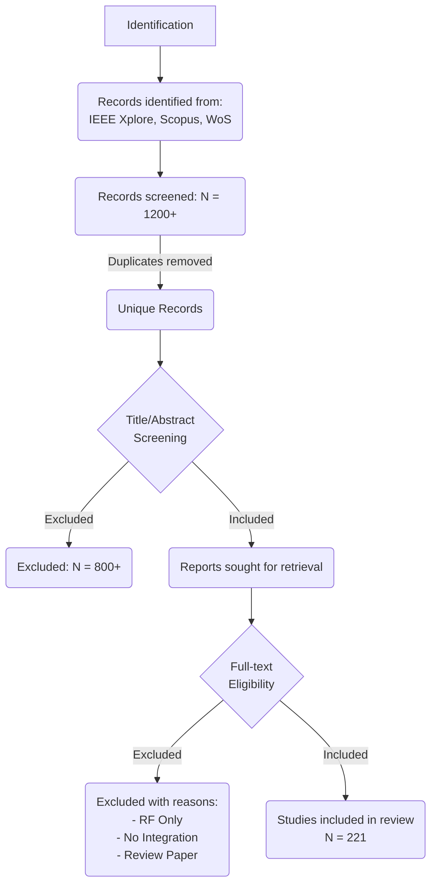

# II. SURVEY METHODOLOGY (PRISMA 2020)

## A. Protocol and Registration
This systematic review was conducted in strict accordance with the **Preferred Reporting Items for Systematic Reviews and Meta-Analyses (PRISMA) 2020** guidelines [Ref]. Unlike traditional narrative reviews, which are susceptible to selection bias, our methodology follows a formal protocol to ensure reproducibility and comprehensiveness. The protocol for this review, including the research questions and search strategy, was documented prior to the analysis.

## B. Information Sources and Search Strategy
To capture the multidisciplinary nature of Optical Integrated Sensing and Communication (O-ISAC), we performed a comprehensive search across four major academic databases: **IEEE Xplore, Web of Science, ACM Digital Library, and Scopus**. The search covered the period from **January 2010 to December 2025**.

We employed a multi-string Boolean search strategy combining keywords from two primary domains:
*   **Set A (Sensing Context):** ("Integrated Sensing and Communication" OR "ISAC" OR "Joint Radar and Communication" OR "JRC" OR "Dual-function Radar Communication") AND
*   **Set B (Optical Domain):** ("Optical Wireless" OR "VLC" OR "LiFi" OR "Free Space Optical" OR "FSO" OR "Fiber Sensing" OR "Distributed Acoustic Sensing").

The full search strings and query syntax for each database are detailed in **Appendix A**.

## C. Eligibility Criteria
To ensure a focused analysis of the physical layer integration, the following inclusion and exclusion criteria were applied:

**Inclusion Criteria:**
1.  **Scope:** Studies proposing a physical-layer convergence of optical sensing and communication (e.g., shared waveform, shared hardware, or joint spectrum).
2.  **Type:** Peer-reviewed journal articles and conference proceedings.
3.  **Content:** Papers providing quantitative performance metrics or specific system architectures.

**Exclusion Criteria:**
1.  **Domain:** Studies focused solely on RF-domain ISAC without an optical component.
2.  **Modality:** Studies focused on "Pure Sensing" (e.g., LiDAR only) or "Pure Communication" (e.g., standard FSO) without integration.
3.  **Language:** Non-English publications.
4.  **Format:** Abstracts, posters, patents, and non-peer-reviewed preprints (unless highly cited).

## D. Study Selection Process
The selection process followed a three-phase screening workflow, as illustrated in the **PRISMA Flow Diagram (Fig. 2)**.

**Fig. 2.** PRISMA 2020 Flow Diagram describing the study selection process.

## E. Data Extraction and Quality Assessment
For each included study, we extracted data using a predefined coding schema (JSON format). The extracted data items included:
1.  **System Characteristics:** Carrier type (Fiber vs. Wireless), Sensing modality (Vibration, Range, etc.), Integration level.
2.  **Performance Metrics:** Data rate (Gbps), Sensing resolution (cm/m), Max range.
3.  **Hardware Enablers:** Source type (LED/Laser), Detector type (PD/Camera).

To assess the methodological quality, we developed a custom **Technical Quality Assessment Form (TQAF)**, adapting the CASP checklist for engineering surveys. Each study was evaluated based on the clarity of its system model, the reproducibility of its simulation environment, and the completeness of its performance analysis.
