# Optical integrated sensing and communication: Fundamentals, applications, challenges and future aspects

> Kaynak PDF: `2.pdf`  
> Makale: Optical Switching and Networking 61 (2026) 100854  
> DOI: https://doi.org/10.1016/j.osn.2026.100854  
> Not: Bu dosya PDF'ten Markdown'a dönüştürülmüştür. Makale metni özgün dilinde korunmuş, şekiller ayrı görsel olarak eklenmiş ve her şekil için Türkçe yorum yazılmıştır.

## Şekiller ve Türkçe Yorumlar

### Fig. 1 - Structure of this study.

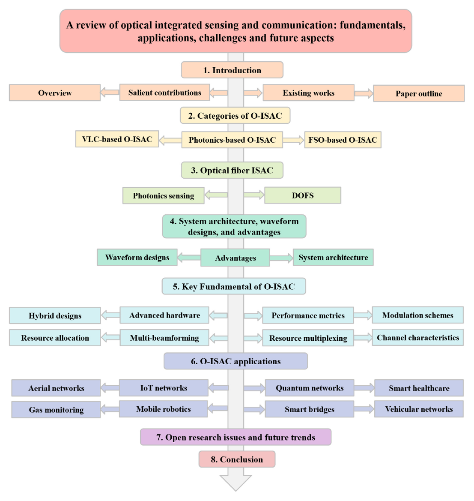

**Yorum:** Çalışmanın iskeletini yukarıdan aşağıya gösteriyor: giriş, O-ISAC kategorileri, optik fiber ISAC, sistem mimarisi/dalga biçimleri, temel konular, uygulamalar, açık problemler ve sonuç bölümleri tek akışta bağlanmış.

### Fig. 2 - O-ISAC is categorized into VLC, FSO and photonic sensing.

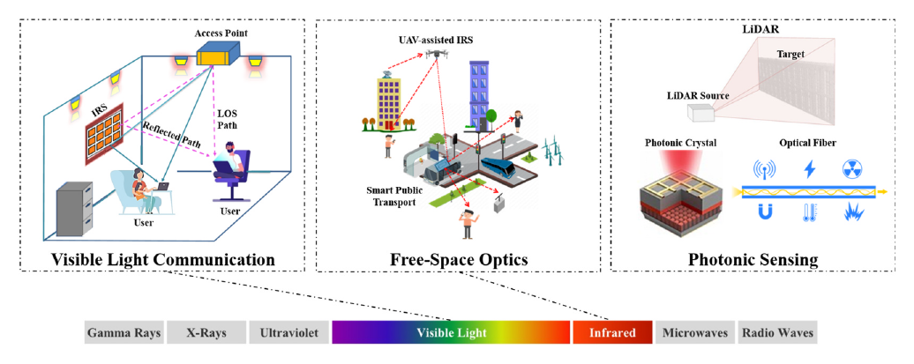

**Yorum:** O-ISAC üç ana uygulama alanına ayrılıyor: görünür ışık haberleşmesi, serbest uzay optiği ve fotonik algılama. Alt kısımdaki elektromanyetik spektrum şeridi, bu yaklaşımların özellikle görünür ışık ve kızılötesi bantlarla ilişkisini vurguluyor.

### Fig. 3 - MoF architecture, echo spectra, cross-correlation results, and constellation diagrams.

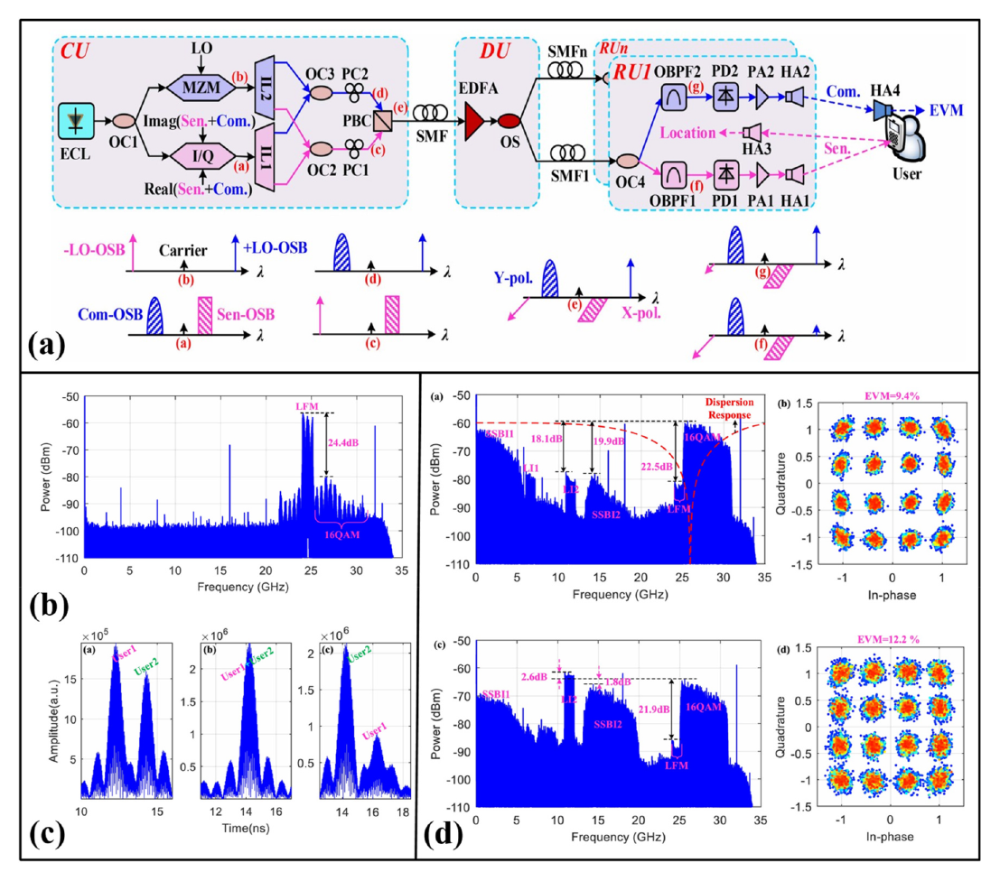

**Yorum:** Şekil, mmWave-over-fiber mimarisinde haberleşme ve algılama yan bantlarının aynı optik altyapıda nasıl taşındığını gösteriyor. Spektrum ve korelasyon grafikleri mesafe algılamayı; takımyıldız diyagramları ise haberleşme kalitesini birlikte doğruluyor.

### Fig. 4 - Distributed fiber sensing techniques.

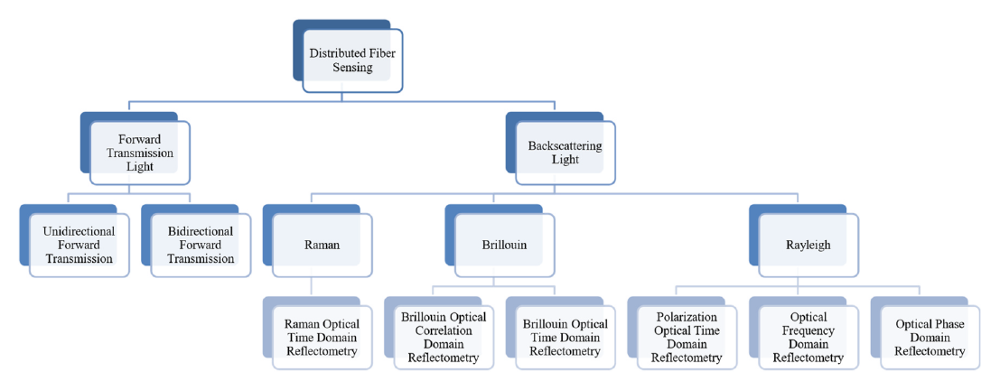

**Yorum:** Dağıtık fiber algılama yöntemleri iki ana kola ayrılmış: ileri iletim ışığı ve geri saçılma ışığı. Raman, Brillouin ve Rayleigh temelli yöntemler sıcaklık, gerinim, titreşim ve faz gibi fiziksel büyüklükleri ölçmek için konumlandırılmış.

### Fig. 5 - Schematic of backscattering signals.

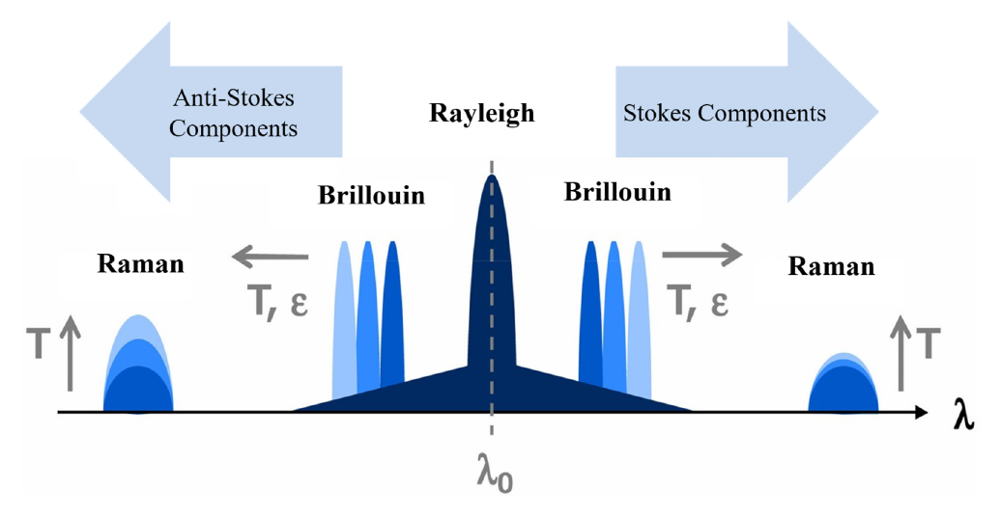

**Yorum:** Fiberdeki geri saçılma spektrumu merkezde Rayleigh, yanlarda Brillouin ve Raman bileşenleriyle gösteriliyor. Brillouin ve Raman kaymaları sıcaklık ve gerinim gibi çevresel değişkenlere duyarlı olduğu için algılamanın fiziksel temelini oluşturuyor.

### Fig. 6 - Schematic of distributed optical fiber sensing systems.

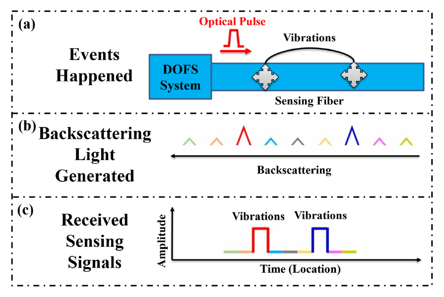

**Yorum:** Bir optik darbe fiber boyunca ilerlerken titreşimler ve bozulmalar geri saçılma üretir. Alıcı tarafta zaman/konum eksenindeki sinyal değişimleri çözümlenerek fiber hattı boyunca olayların nerede oluştuğu anlaşılır.

### Fig. 7 - Schematic spectrum of communication signals, received data and sensing signals.

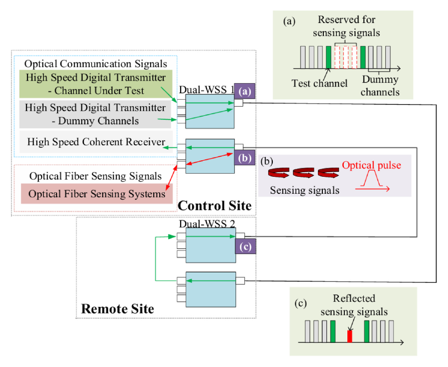

**Yorum:** Yüksek hızlı haberleşme kanalları ile optik fiber algılama sinyallerinin aynı hat üzerinde nasıl ayrıştırıldığını anlatıyor. Bazı bantlar veri için, bazı bantlar algılama için ayrılmış; yansıyan sinyaller rota üzerindeki olayları işaret ediyor.

### Fig. 8 - Integrated sensing and communication in an optic fiber (ISAC-OF).

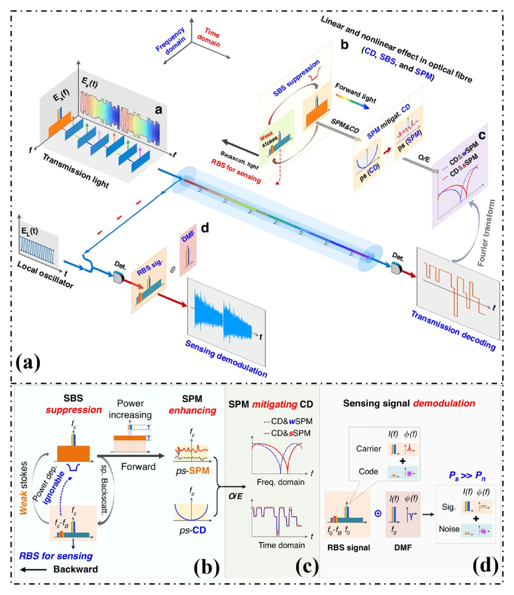

**Yorum:** ISAC-OF yapısı, optik fiberde iletim ışığının zaman/frekans özelliklerini, fiber içi doğrusal-doğrusal olmayan etkileri ve algılama sinyalinin frekans alanında nasıl demodüle edildiğini bir araya getiriyor.

### Fig. 9 - Generalized system architecture of O-ISAC.

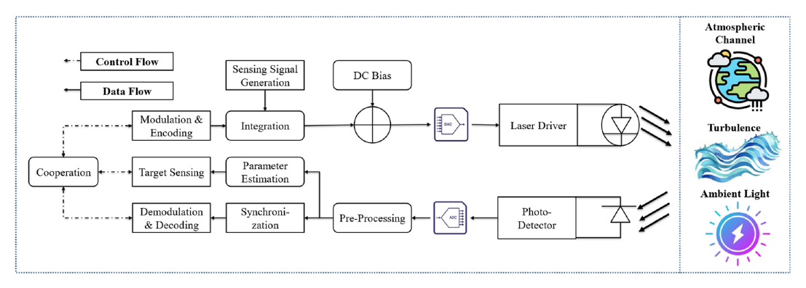

**Yorum:** Genel O-ISAC zinciri özetlenmiş: haberleşme verisi ve algılama bilgisi birleştirilip optik kaynağa veriliyor, atmosferik kanal üzerinden iletiliyor ve alıcıda fotodedektör ile tekrar ayrıştırılıyor. Gürültü, türbülans ve ortam ışığı sistemin temel bozucu etkileri olarak gösteriliyor.

### Fig. 10 - Waveform design for O-ISAC.

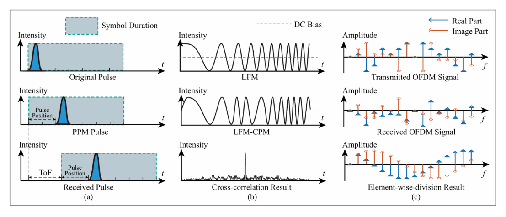

**Yorum:** Üç dalga biçimi karşılaştırılıyor: darbe konumu tabanlı yapı mesafe/veri bilgisini zaman konumundan alıyor; LFM-CPM sabit modüllü yapı korelasyonla algılama yapıyor; OFDM çok taşıyıcılı yapı ise haberleşme ve algılamayı alt taşıyıcılara dağıtıyor.

### Fig. 11 - Key fundamentals of O-ISAC and integration of DL.

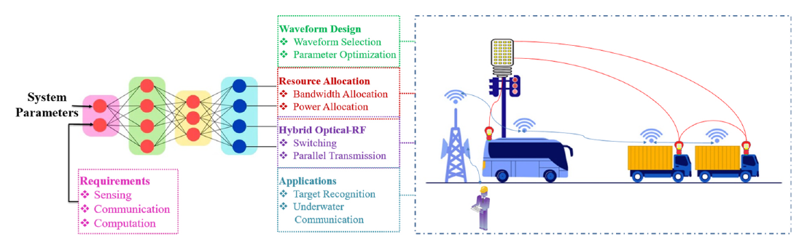

**Yorum:** Derin öğrenme, sistem parametreleri ve gereksinimler arasındaki optimizasyon katmanı gibi konumlandırılmış. Dalgabiçimi tasarımı, kaynak tahsisi, hibrid sistemler ve hedef algılama gibi O-ISAC temel bileşenleriyle ilişkilendiriliyor.

### Fig. 12 - Core performance metrics for O-ISAC system applications.

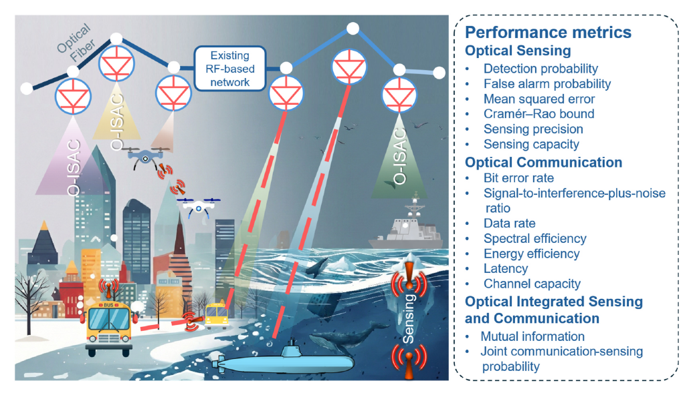

**Yorum:** Kentsel, hava ve deniz senaryolarında O-ISAC performans ölçütleri özetleniyor. Konumlama hassasiyeti, BER, SNR, kapasite, gecikme ve ortak haberleşme-algılama başarımı birlikte değerlendirilmesi gereken metrikler olarak verilmiş.

### Fig. 13 - PSS-PPM based O-ISAC and LFM-CPM based O-ISAC.

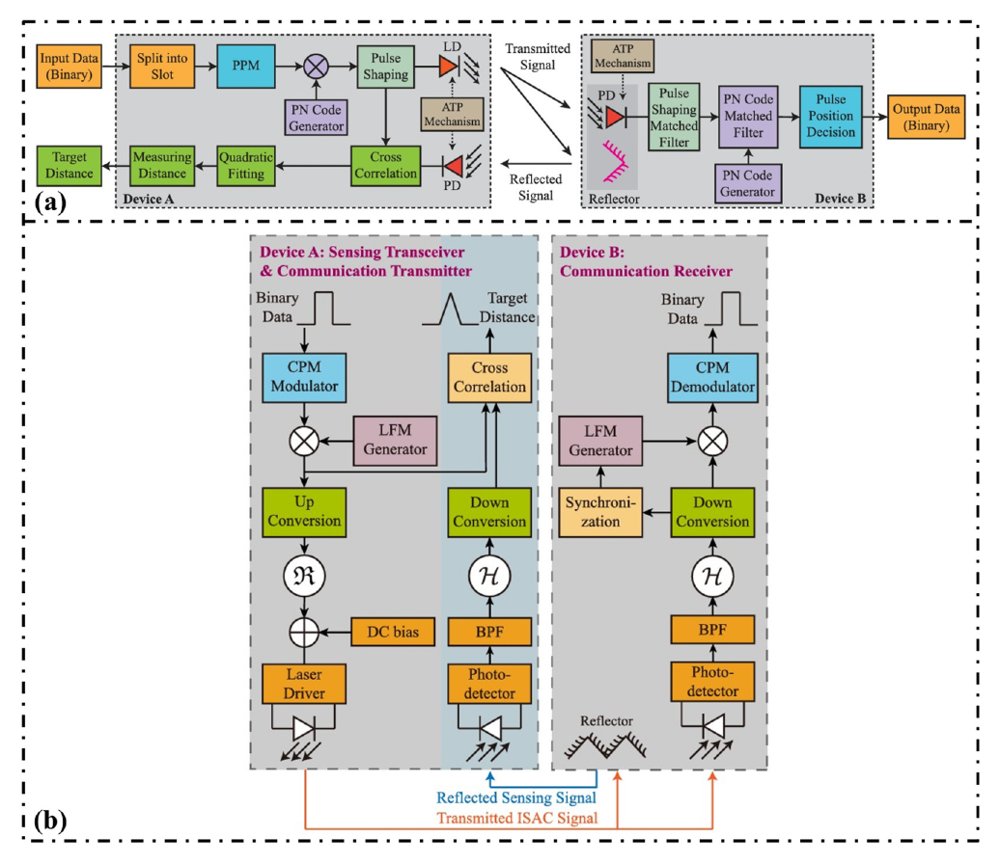

**Yorum:** İki somut O-ISAC dalga biçimi mimarisi gösteriliyor. PSS-PPM daha darbe/konum tabanlı bir çözüm sunarken, LFM-CPM yapısı ayrı algılama ve haberleşme alıcılarıyla daha ayrıntılı bir çift işlevli mimari kuruyor.

### Fig. 14 - Multi-beamforming based ISAC scenarios and framework.

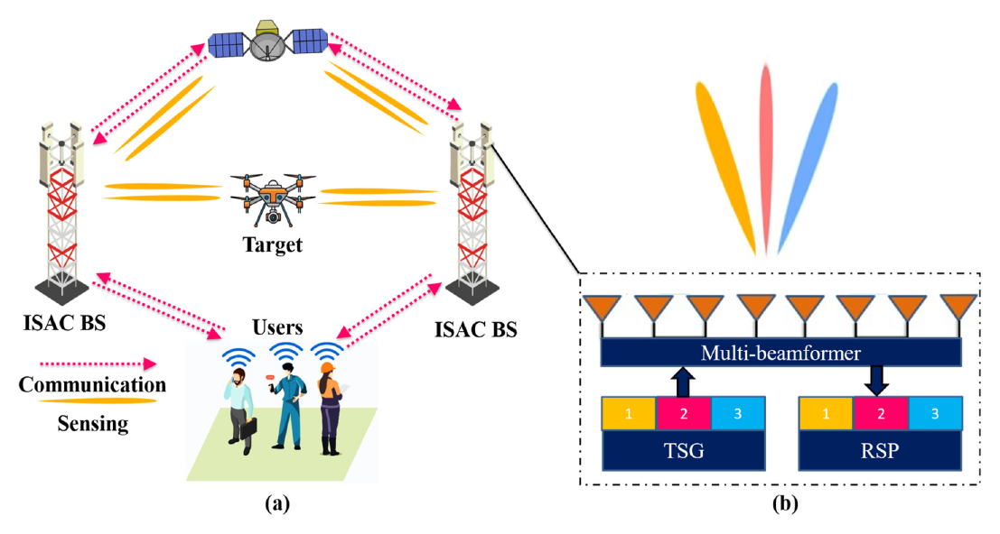

**Yorum:** Çoklu ışın oluşturma sayesinde aynı baz istasyonu farklı yönlerde algılama ve haberleşme yapabiliyor. Sağdaki mimari, optik/elektrik işleme birimleriyle birden fazla ışının eşzamanlı üretimini temsil ediyor.

### Fig. 15 - Strategy diagrams of TDM, FDM, HRDM and SDM.

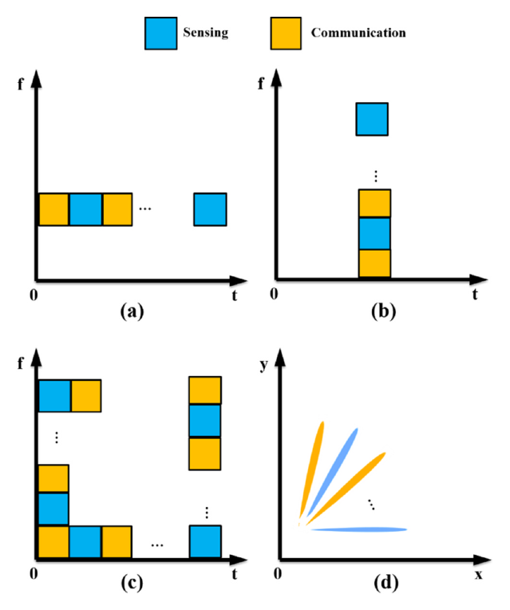

**Yorum:** Kaynak çoklama stratejileri renklerle ayrılmış: mavi algılama, sarı haberleşme. Zaman, frekans, hibrit kaynak ve uzay alanı çoklaması, aynı kaynakların iki görev arasında nasıl paylaştırılabileceğini gösteriyor.

### Fig. 16 - ML in optical fiber communication for eavesdropping monitoring.

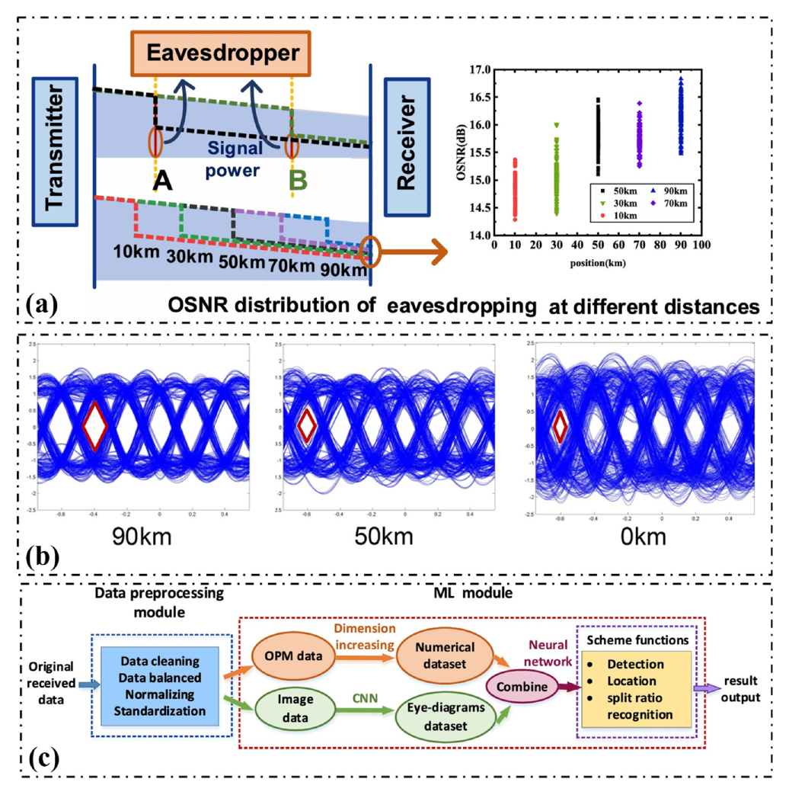

**Yorum:** Makine öğrenmesi tabanlı izinsiz dinleme tespiti gösteriliyor. Farklı konumlardaki eavesdropper etkisi OSNR ve eye-diagram değişimleriyle izleniyor; alt kısımdaki model akışı bu izleri sınıflandırıp müdahale kararına dönüştürüyor.

### Fig. 17 - Multiparameter distributed sensing system and dual-parameter measurement.

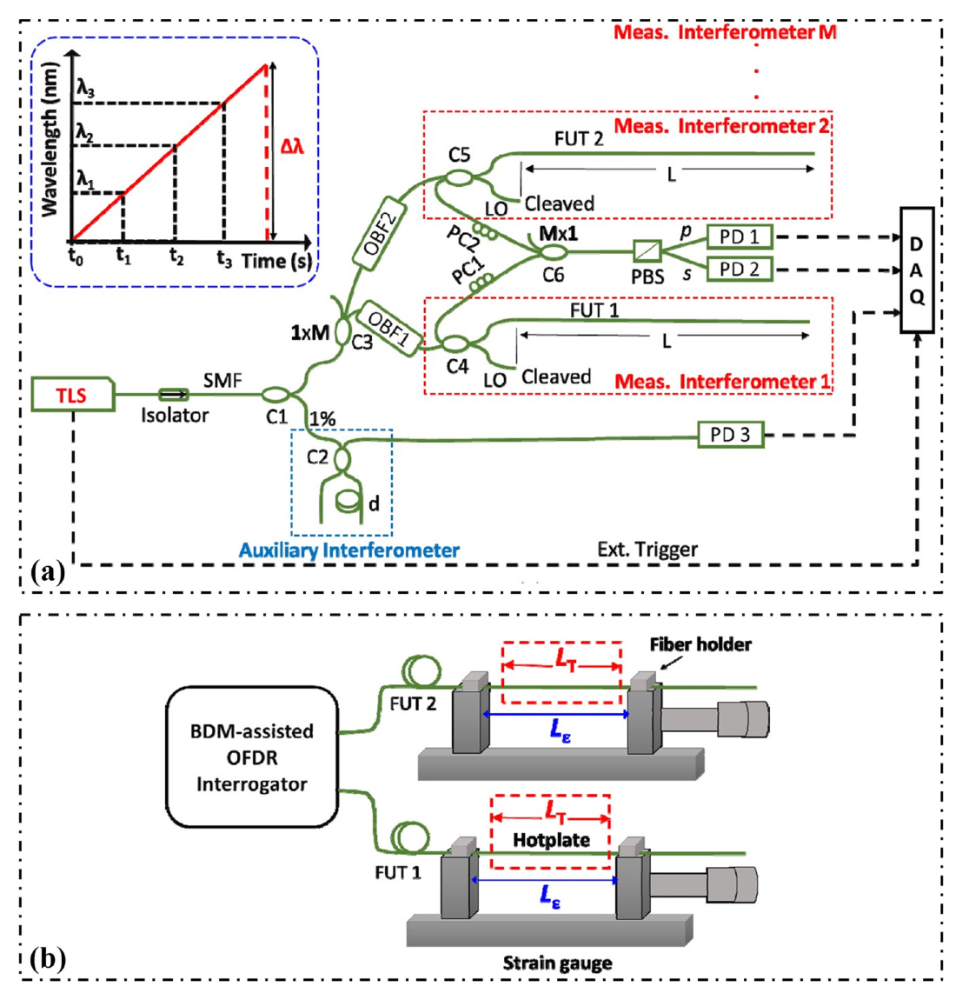

**Yorum:** Dağıtık algılama sistemi, geniş bant süpürülen ışığı alt bantlara ayırarak birden fazla fiziksel parametreyi ölçmeye çalışıyor. Alt şemada sıcaklık ve gerinim ölçümlerinin bağımsız alınması gösterilmiş.

### Fig. 18 - Deep QTNs for multimodal beam prediction in ISAC systems.

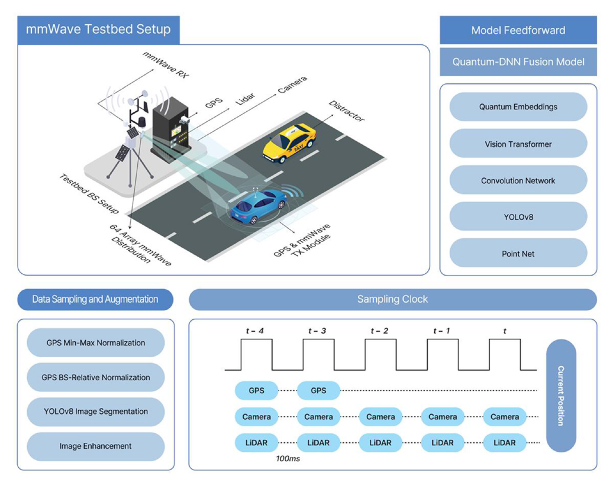

**Yorum:** Araç-altyapı test düzeneği; GPS, kamera ve LiDAR verilerini kuantum/transformer tabanlı bir tahmin hattına besliyor. Amaç, mobil araçlar için mmWave ışın seçimini multimodal algılama verisiyle iyileştirmek.

### Fig. 19 - Sensing assisted UAV optical wireless communication scheme.

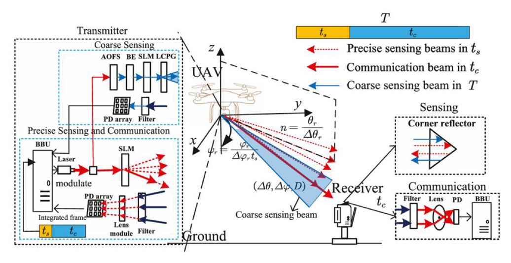

**Yorum:** UAV optik kablosuz haberleşmesinde hassas ve kaba algılama ışınları birlikte kullanılıyor. Şema, gönderici/alıcı optik modüllerini ve hedefe yönlenen algılama-haberleşme ışınlarını aynı geometri üzerinde gösteriyor.

### Fig. 20 - ROS-compatible O-ISAC for cooperative mobile robotics.

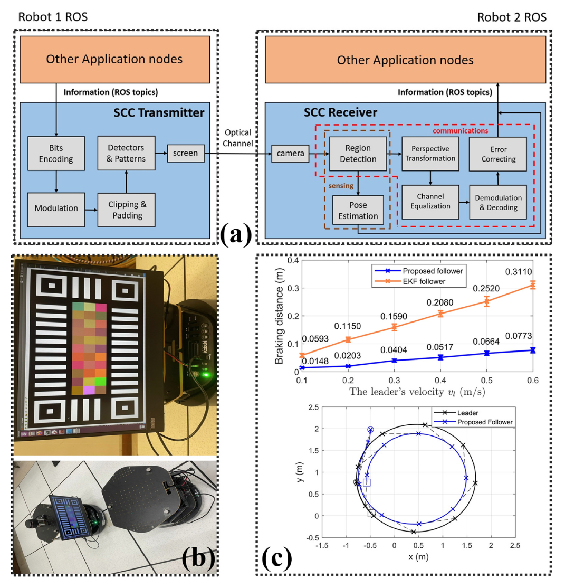

**Yorum:** Robotik senaryoda O-ISAC modülleri ROS uyumlu verici/alıcı bloklarına bağlanmış. Deney fotoğrafı ve yörünge grafikleri, görsel/O-ISAC destekli kontrolün formasyonu ve fren mesafesini iyileştirdiğini gösteriyor.

### Fig. 21 - Silicon photonics-based O-ISAC in healthcare.

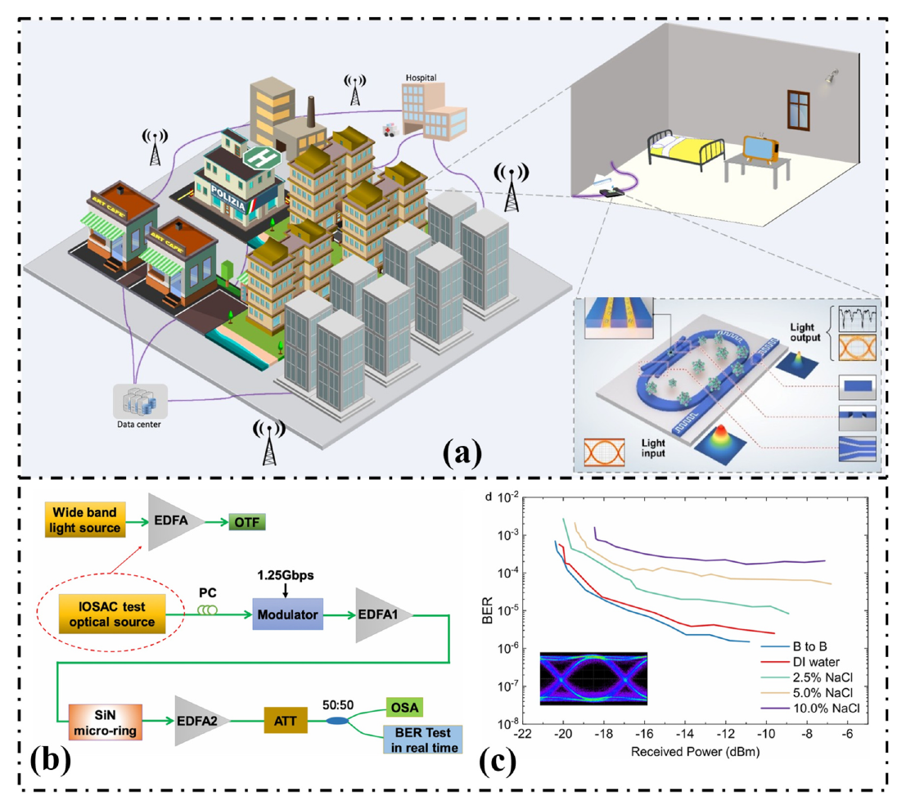

**Yorum:** Akıllı sağlık senaryosunda fotonik algılama modülleri iletişim altyapısına gömülüyor. Deney kurulumunda farklı koşullardaki BER eğrileri, sistemin algılama koşulları değişirken haberleşme performansını nasıl koruduğunu göstermeyi amaçlıyor.

### Fig. 22 - Dual-functionality O-ISAC for gas monitoring.

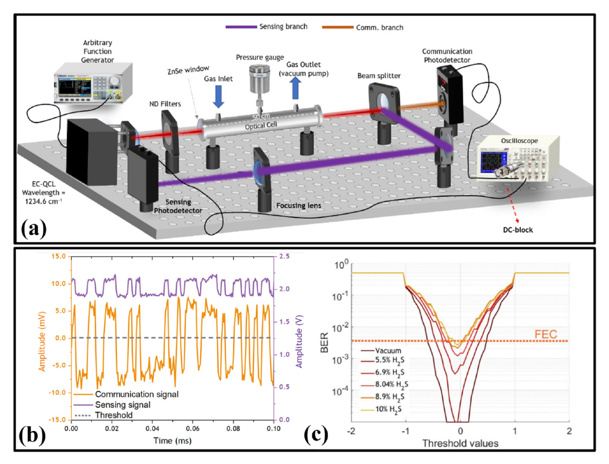

**Yorum:** Ortak, algılama ve haberleşme lazer kolları aynı düzenekte birleştirilmiş. H2S yoğunluğu değiştikçe BER-eşik eğrilerinin değişmesi, gaz algılama ile veri iletiminin aynı optik sistemde değerlendirildiğini gösteriyor.

### Fig. 23 - Fiber optic system for smart structure monitoring.

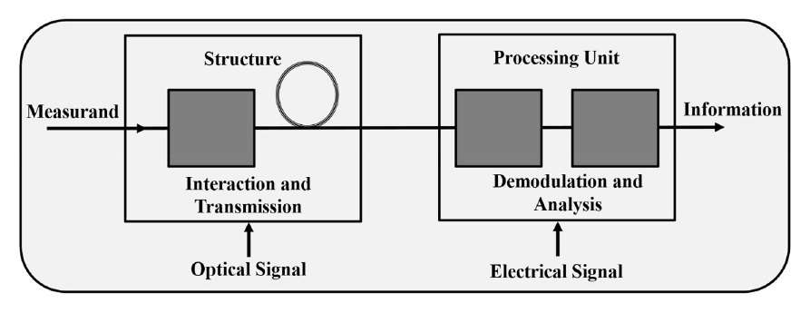

**Yorum:** Akıllı yapı izlemede ölçülen fiziksel büyüklük fiber üzerinden sisteme giriyor, yapı ile etkileşimden sonra işleme biriminde demodüle edilip bilgiye dönüştürülüyor. Çıkış bilgisi yapının durumunu izleme veya kontrol etme amacıyla kullanılabilir.

### Fig. 24 - Fiber optic sensing and communication for high-speed train rails and bridges.

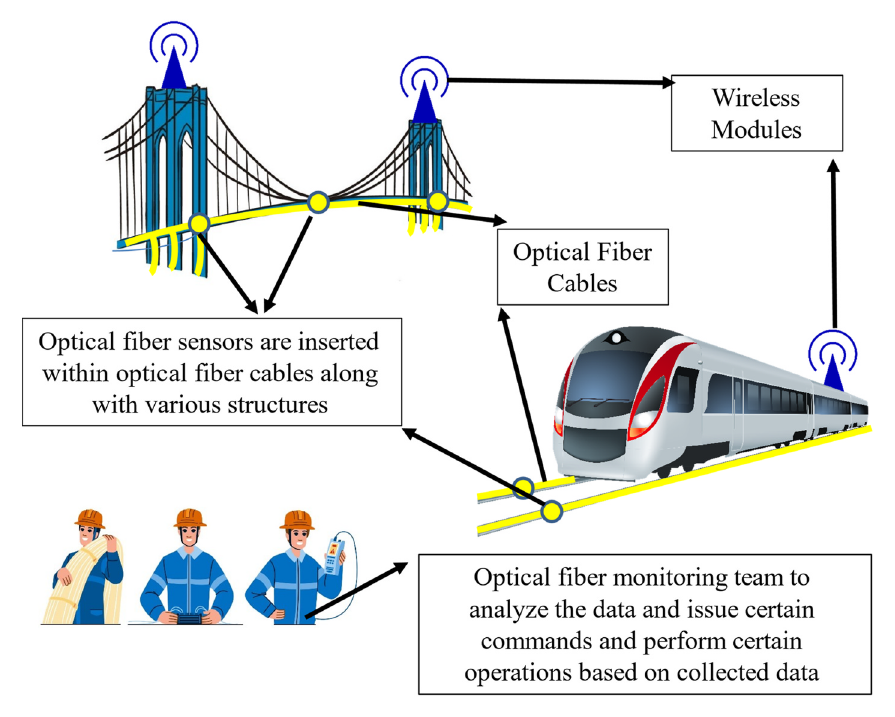

**Yorum:** Ray, köprü ve tren hattı boyunca fiber sensörler ile kablosuz modüllerin birlikte çalışması gösteriliyor. Toplanan veri, bakım ekiplerinin ray/köprü durumunu sürekli izlemesine ve karar vermesine destek oluyor.

### Fig. 25 - O-ISAC application scenario: a vehicular network.

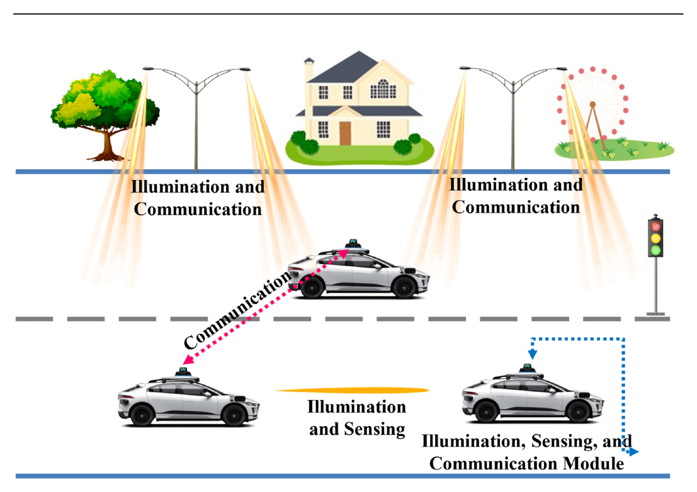

**Yorum:** Araç farları aydınlatma, haberleşme ve algılama görevlerini birlikte üstleniyor. Araçlar arası iletişim, yol kenarı algılama ve LiDAR benzeri konumlama aynı görsel senaryoda birleştirilmiş.

## Tam Metin

Contents lists available at ScienceDirect

Optical Switching and Networking journal homepage: www.elsevier.com/locate/osn

# Optical integrated sensing and communication: Fundamentals, applications, challenges and future aspects S.A.H. Mohsan a , Siyu Bai b , Haoyu Huang b , Yi Hao b , Shichen Zheng b , Qian Li a,c,* , H.Y. Fu b,** a b c

School of Electronic and Computer Engineering, Peking University, Shenzhen, 518055, China Tsinghua Shenzhen International Graduate School, Tsinghua University, Shenzhen, 518055, China Guangdong Provincial Key Laboratory of In-Memory Computing Chips, School of Electronic and Computer Engineering, Peking University, Shenzhen, 518055, China

## Abstract

Integrated sensing and communication (ISAC) is viewed as a powerful component of future mobile networks and has gained considerable attention from both academic and industrial experts. This promising technology aims to offer both high-resolution sensing/ranging and large-capacity wireless communication simultaneously. Similar to the concept of radio-frequency (RF) ISAC, the integration between optical communication and optical sensing yields optical-ISAC (O-ISAC), which is regarded as a strong complement to and augment of its RF counterpart. O-ISAC technology can effectively reduce the stringent requirements of spectrum and hardware with efficient resource utilization while simultaneously performing high-accuracy sensing and high-capacity communication. In this review, we first elaborate on the generalized system of O-ISAC in light of existing contributions, recent advances, and then explain different categories of O-ISAC in the context of photonics, visible light communication, free space optics, and optical fiber technologies. We also outline the role of promising distributed optical fiber sensing and its coexistence with joint waveform designs. To further highlight scientific efforts on this topic, this paper presents a comprehensive overview of several experimental works from the literature. Also, we elaborate on the appealing benefits of O-ISAC such as maximizing communication rate, improving sensing capability, and reducing interference. Next, waveform designs including pulsed waveform, constant-modulus waveform, and multi-carrier waveform are discussed. Furthermore, advanced hardware designs, hybrid designs, performance metrics, modulation schemes, multi-beamforming, and resource-multiplexing are discussed as key fundamentals of robust and scalable O-ISAC systems. Additionally, machine learning and deep learning solutions are explored for efficient resource allocation. To indicate the prospects in future intelligent and multifunctional applications, we also highlight some application scenarios of O-ISAC in terms of Internet-of-things networks, quantum communication networks, aerial networks, cooperative mobile robotics, smart healthcare, toxic or corrosive gas leakage monitoring, smart bridges, and vehicular networks. In the end, we put forward open research issues and future perspectives, which are envisioned to offer some novel directions for future research. We believe this study will present the vision of paramount and innovative aspects of O-ISAC technology for both academic and industrial progress.

## 1. Introduction

### 1.1. Overview

RF-ISAC has attracted growing research interest in recent years, with many system models and prototypes having been introduced. Generally, it is the mainstream solution for wide coverage, yet the inherent drawback of spectrum congestion and the stringent requirement for highprecision sensing have stimulated more research interest towards optical technologies. Benefiting from the huge spectral bandwidth, optical ISAC (O-ISAC) links can provide ultra-high data rates of gigabits per second. The shorter wavelength of optical beams empowers more precise distance measurements and target localization, which can be further improved through the synergy of promising technologies like light

detection and ranging (LiDAR). The high optical beam diversity also offers significant sensing gains. O-ISAC systems can provide highly refined environmental perception capabilities as compared to RF-ISAC [1,2]. Under feasible sampling and aperture conditions, O-ISAC can achieve microradian-level angular resolution and centimeter-level range resolution. Furthermore, the high directionality of optical beams also enables precise sensing and transmission through beamforming methods, efficiently mitigating interference. Moreover, by leveraging the flexible control and line-of-sight (LoS) propagation of optical beams, O-ISAC can efficiently suppress interference from unwanted sources. Furthermore, optical communication, particularly visible light communication (VLC), can be seamlessly incorporated with existing lighting infrastructures such as light emitting diode (LED) to conceive various functionalities, including communication, coarse-grained sensing,

* Corresponding author. School of Electronic and Computer Engineering, Peking University, Shenzhen, 518055, China. ** Corresponding author. E-mail addresses: liqian@pkusz.edu.cn (Q. Li), hyfu@sz.tsinghua.edu.cn (H.Y. Fu). https://doi.org/10.1016/j.osn.2026.100854 Received 23 December 2025; Received in revised form 3 February 2026; Accepted 4 February 2026 Available online 6 February 2026 1573-4277/© 2026 Elsevier B.V. All rights are reserved, including those for text and data mining, AI training, and similar technologies.

target positioning, and illumination. This coexistence not only reduces deployment costs but also enhances resource allocation efficiency. These appealing advantages highlight the compelling potential of O-ISAC and make it specifically suitable for meeting the ultra-high throughput requirements of 6G. In terms of integrated sensing and communication (ISAC), the optical band shows striking resemblance to the radio frequency (RF) band. As RF-ISAC continues to accelerate, the optical-band-based ISAC emerges as a promising alternative [1]. First, well-established predominant RF-ISAC waveforms like orthogonal frequency division multiplexing (OFDM) and linear frequency modulation (LFM) can be transformed into optical waveforms, empowering optical devices like LEDs and laser diodes (LDs) to offer both active sensing and communication capabilities simultaneously. Second, both optical sensing and optical communication can use the intensity-modulation and direct-detection (IM/DD) scheme, ensuring shared baseband units and optical front ends. Third, the principles of data sharing and joint optimization apply to both optical and RF waveforms, through which cooperation between sensing and communication can be conceived. However, several differences still exist between RF and optical counterparts. Particularly, the distinct features of optical channels and front-ends provide key potentials for sensing and communication; thus, it can serve as a promising complement to RF-ISAC [2]. Consequently, the concept of O-ISAC emerges with the coexistence of optical sensing and optical communication. Leveraging the inherent advantages of short wavelength, immunity to RF interference, and expansive unlicensed bandwidth of the optical spectrum, O-ISAC offers the capability to support Gbps-level communication and centimeter-level precise sensing [3,4]. With its blend of high-precision sensing and high-speed communication, O-ISAC is envisaged to augment and complement its RF counterpart [5]. In O-ISAC, the multiplexing of sensing and communication can further improve the band utility of the system, offer powerful dual-functionality which cannot be conceived through a single VLC or visible light positioning (VLP) system [2,6]. Despite these benefits, traditional O-ISAC systems still depend on natural reflections from surrounding surfaces like ceilings, walls, and other physical objects. Under such conditions, the stability and strength of the echo signal are largely constrained by the surface geometry and material, which often leads to strong sensitivity and weak returns due to roughness and color. It must be emphasized that spatial resolution is the only characteristic that determines the sensing performance. Noise level and echo quality jointly determine the achievable signal-to-noise ratio, which directly impacts the localization and ranging accuracy [7]. Under these practical constraints, achieving reliable and stable sensing over large detection distances is critically challenging. Thus, more sophisticated and controllable reflection mechanisms are needed to fully reveal the potential benefits of O-ISAC. A comparison between RF-ISAC and O-ISAC is presented in Table 1. Table 2 provides a detailed comparison of RF-ISAC and O-ISAC system characteristics. The existing works explore O-ISAC in both wired e.g., optical fiber ISAC [8–10], and wireless O-ISAC [11–13]. Most of the existing wireless O-ISAC works focus on LEDs and LDs [14], which show similarity to RF systems, leading to a straightforward design process. Considering the wide availability and hardware cost of LEDs [15], introduces an LED-aided ISAC architecture. This system incorporates optical sensing and communication through multi-band carrierless amplitude and phase (m-CAP) modulation and received signal strength (RSS)-based trilateration. Similarly [16], proposes an underwater system that integrates optical communication with sensor networks. In this system, the target sensing is determined through cross-correlation values (CCV) based on RSS. These LED-enabled systems efficiently integrate optical sensing and communication, their coexistence is restricted by concurrent utility of transmitted signals. In Ref. [6], the authors propose O-ISAC architecture using cost-efficient LED for improved internet-of-things (IoT) applications. It indicates the feasibility and enhanced performance of O-ISAC benchmarked over separate sensing and communication systems.

### Table 1

Comparisons between RF-ISAC and O-ISAC. Characteristics Sensing

Communication

Physical properties

RF-ISAC Angle resolution Distance resolution Sensing distance Achievable data rate Communication distance Interference Channel (De)modulation Amplitude Frequency

O-ISAC

WiFi

mmWave

N/A ~0.1 m

~1 mrad ~cm

~1 mrad ~cm

<100 m ~100 Mb/s

<1 km ~Gbps

<1 km ~Gbps

<100 m

<100 m

<1 km

Severe Line of sight (LoS) & non LoS (NLoS) Coherent Complex

Moderate Mostly LoS

Slight LoS

Coherent Complex

2.4 GHz, 5 GHz

30–300 GHz

IM/DD Real and nonnegative 28.3–845 THz

Recent studies have focused on free space optics (FSO) based ISAC (FSO-ISAC) using optical sensors like LiDAR [17]. To support sixth generation (6G) applications, FSO-ISAC can be implemented using different waveforms. For example, the boomerang transmission system integrates FSO communication with automotive LiDAR, which uses time-hopping pulses as the ISAC signal. Similarly, the pulse position modulation and pulse sequence sensing use a series of optical pulses for communication and sensing [18]. In Ref. [19], a frequency-modulated continuous-wave coherent LiDAR is used to offer downlink communication for a continuous-wave FSO-ISAC. Additionally, the phase-shift laser ranging with communication is used to address ambiguity due to phase-coded signal [20]. In order to extend sensing ability of an FSO-ISAC system, a pulse-amplitude-modulation technique is proposed for target detection [21]. Most of these systems focus on single or pulsed-carrier continuous waves, which severely restricts achievable data rates and makes critically vulnerable to nonlinear distortions. While limited interest has been shown to multicarrier schemes in FSO-ISAC. For instance, FSO-ISAC prototypes using OFDM have been proposed in Refs. [22,23] to achieve a cm-level ranging resolution and Gbps-level data rate. In Ref. [1], the authors demonstrated the feasibility of direct-current (DC)-biased optical OFDM (DCO-OFDM) for FSO-ISAC. Joint power allocation problems were formulated for performance evaluation of both sensing and communication.

### 1.2. Existing works

Even though, there is a plenty of literature on RF-ISAC, but very limited literature is available on O-ISAC. Till date, a very few reviews, surveys, magazines have been reported on O-ISAC. However, these articles contain a very limited discussion and several aspects are unexplored. Thus, there is a research gap in this domain in the aspects of comprehensive reviews or surveys. The up-to-date list of reviews [2,7,8, 24–26], magazine [27], and a tutorial [28]. To the best of the authors' knowledge, the present review paper addresses an extensive range of topics in the context of O-ISAC as compared to the existing works. A brief comparison between contributions of these studies is summarized in

### Table 3. This review paper offers a unique contribution to the proposed

research topic by offering the first comprehensive investigation of O-ISAC as per the authors’ knowledge. It provides a comprehensive literature from existing works and new technical insights. The main objective of this review is to offer a detailed discussion of O-ISAC technology in multiple aspects such as existing contributions, experimental works, waveform designs, and different categories. By examining state-of-the-art literature, this article highlights key fundamentals,

### Table 2

Comparisons between RF-ISAC and O-ISAC. Category

RF-ISAC

O-ISAC

System features

• It can be implemented alongside existing RF networks like wireless fidelity (WiFi) access points and 5G/6G base stations to provide both functionalities over broader coverage • Preferable for stronger penetration and wide coverage, making it suitable for mobile and large-scale scenarios • Complex-valued signal • Focuses on interference mitigation and multipath equalization in high-scattering environments • Offers limited bandwidth with wide coverage • Facilitates both LoS and NLoS transmissions as well as partially penetrate obstacles • Hinders by multipath fading and propagating • Utilizes RF antenna arrays to provide baseband signals • Facilitates complex modulation schemes • Employs RF front-end devices like amplifiers, mixers, and antennas

• In can be combined with indoor VLC and VLP, or integrated with LiDAR for outdoor sensing and communication (aerial networks, vehicular networks) • Preferable for high data-rate communication and high-precision sensing • Non-negative and real-valued signal • Emphasizes on filtering out ambient light and clipping noise

Signal processing Channel model

Transceivers

Integrated Technologies

• It can be integrated to develop RF-RF or hybrid RF-optical systems • It can integrate promising technologies like unmanned aerial vehicles (UAVS), intelligent reflecting surfaces (IRS), etc.

Promising applications Critical challenges

• It is highly suitable for applications like smart factory, smart weather forecasting, infrastructure monitoring, and vehicular networks etc. • It is critically prone to environmental factors, atmospheric conditions, external threats, blockages, design and implementation cost

hybrid designs, key performance metrics, and role of different promising technologies to enhance the performance of dual functionalities. We also briefly discuss critical limitations and research issues which are highly essentials to tackle in order to conceive maximum performance of O-ISAC. By critically examining the potentials, application scenarios, real-world applicability, this study aims to present valuable insights and guidelines for academic researchers and industry professionals in designing, deploying, and selecting the most effective solutions tailored to specific applicability of O-ISAC systems. We believe this study will provide unique guidelines and novel future directions to research fraternity for further innovations.

• Provides vast bandwidth, high directivity, minimal interference, and high security • Exhibits sensitivity to blockage, requires precise transceiver alignment, LoS propagation with high directionality • Directly detects impinging optical beams through optical receivers like photodetectors • Uses IM/DD scheme and DC bias to achieve required optical power intensity • Primarily uses LEDs or laser diodes (LDs) as optical transmitters • It can be integrated to develop Optical-Optical or hybrid RF-optical systems • It can also be integrated with promising technologies like UAVs, IRS, non-orthogonal multiple access (NOMA), satellites etc. • It is highly suitable for applications like smart homes, smart hospitals, smart bridges, and IoT networks etc. • It is more vulnerable to LoS strictness, misalignment, blockages, pointing errors, atmospheric conditions, limited mobility and FoV support

cooperative mobile robotics, smart healthcare, and toxic gas leakage monitoring, where O-ISAC systems will play a pivotal role. • O-ISAC research issues and future aspects: We explore several research issues which pose limitations on O-ISAC system performance and deployment. Furthermore, some research opportunities and future aspects have been discussed to provide a clear vision for relevant research community to contribute breakthrough innovations to further support the design and development of this technology.

### 1.4. Paper outline

The remainder of this study is as follows. Section 2 explains different categories of O-ISAC systems. Section 2 explores optical-fiber-based OISAC technologies. Section 3 is dedicated to optical fiber-based O-ISAC systems and comprehensively explains DOFS. Furthermore, system architecture, waveform design, and advantages are discussed in Section 4. Extending this development further, Section 5 focuses on the key fundamentals of O-ISAC. Section 6 highlights some potential application scenarios underscoring practical deployment. Section 7 addresses critical challenges and highlights several future research aspects which collectively guide further O-ISAC development in the future. Lastly, we conclude our study in Section 8. The structure of this study is presented in Fig. 1.

### 1.3. Salient contributions

This study comprehensively discusses O-ISAC systems by considering a broad range of aspects. Accordingly, the main contributions of this study are summarized as follows: • Explore O-ISAC: To provide a comprehensive overview of O-ISAC and major differences and potential compared to RF-ISAC, we have discussed several aspects in detail. This study explores categories of O-ISAC in the context of VLC, FSO, and photonics technologies. In addition, we focus on practical implementation and experimental work discussed in the literature. Furthermore, system architecture, benefits, and waveform designs have been explored. • Explore optical-fiber-based ISAC: This paper offers a comprehensive overview of the optical fiber-based ISAC technologies highlighting promising DOFS, the role of wavelength division multiplexing (WDM), joint waveforms and existing designs. This study aims to encourage new scientific efforts to implement O-ISAC in future networks. • Key fundamentals: This study comprehensively discusses several key fundamentals of O-ISAC systems including advanced hardware, performance metrics, hybrid designs, modulation schemes, multibeamforming framework, multi-domain resource multiplexing (MDRM), learning-based resource allocation, and channel characteristics. • Key applications: We have discussed several application scenarios such as IoT networks, quantum networks, aerial networks,

## 2. Categories of O-ISAC

O-ISAC encompasses various deployment methods and spectral ranges, generally classified into VLC, FSO, and photonic sensing, as depicted in Fig. 2. These categories indicate the applicability of optical technologies for joint sensing and communication tasks. Visible light communication in O-ISAC: VLC uses LEDs as transmitters and imaging sensors or photodetectors (PDs) as receivers to achieve environmental sensing and data transmission simultaneously. In ISAC applications, VLC can perform environmental mapping, motion tracking, indoor positioning and localization while serving as a highbandwidth communication medium. To this end, an earlier study focused on a unified O-ISAC framework for 6G, integrating both FSO and VLC links and outlining the key

authors presented the evolution of LiSAC, integration with emerging technologies, application scenarios, and challenges. Free-space optics in O-ISAC: FSO considers modulated optical beams, typically in the infrared or laser spectrum, for environmental sensing and long-range communication in free space. Contrary to VLC, FSO facilitates terabits-per-second data rate transmission and operates over longer distances, making it feasible for outdoor practical scenarios. For instance, the authors in Ref. [30] proposed capacity distortion tradeoffs in FSO-ISAC, considering optimal range-distortion regions and investigating the effect of nonlinear estimation methods such as maximum a posteriori and maximum likelihood for sensing targets; Bayesian Cramér-Rao bound (CRB) was used to formulate fundamental performance limits. In addition [1,31], proposed DCO-OFDM based techniques for FSO-ISAC, modeling power allocation and clipping noise impacts on Fisher information (sensing), and spectral efficiency (communication), as well as proposing techniques to balance these performance metrics while overcoming impairments associated with optical waveforms. The authors in Ref. [32] demonstrated an experimental evaluation of seamless fifth generation (5G) outdoor FSO system, quantifying the effect of atmospheric-induced fading and pointing errors on high-frequency FSO links, which resulted in potential degradation under harsh foggy weather conditions, but overall ensuring high signal stability under clear conditions. Photonic sensing in O-ISAC: Photonic sensing techniques such as vibrating fiber sensing, LiDAR, and other precision optical detection technologies are primarily used for various tasks including environmental mapping, ranging, and object detection. The high versatility and accuracy of photonic sensing lays the foundation for its application in Wband and other higher frequency ISAC systems. Photonic W-band ISAC systems can flexibly leverage photonic frontends and fiber-optic backhaul to conceive centimeter-level multi-target localization while ensuring Gbps-level data rates through joint optimization of power allocation and bandwidth across FDM channels and OFDM subcarriers [33]. Similarly, the authors in Ref. [34] investigated OFDM-based photonic ISAC waveforms with a digital signal processing (DSP) aided correction and dual-stage carrier frequency recovery algorithm, providing accurate photon-assisted radar detection and 47.54-Gbps data rate. Additionally, by considering optical Quadrature Phase Shift Keying (QPSK)-coded linear-frequency-modulated continuous-wave (LFMCW) signaling, prototypes were developed to demonstrate sub-20-mm ranging accuracy for a single-user case and decimeter-level resolution for a two-user sensing scenario at 28 GHz, validating that coherent photonic ISAC can facilitate both multi-user communication and high-precision sensing in the lower millimeter wave (mmWave) bands [35]. Photonics-aided ISAC systems offer the benefits of high bandwidth in the context of high-speed data transmission and high-resolution sensing and can be easily integrated with optical fiber networks. To provide a flexible application scenario, the authors in Ref. [36] introduced an mmWave photonics-aided flexible ISAC system including an adaptive waveform design for W-band optical fiber networks. Furthermore, photonic-aided W-band ISAC waveforms are designed through heterodyning two external cavity laser diodes. The proposed system supports seamless and centralized optical fiber sensing and communication. In the proposed system, LFM and OFDM signals were integrated through FDM for sharing the same bandwidth. It can adaptively allocate bandwidth to LFM and OFDM waveforms to realize a flexible application scenario for both high-resolution radar sensing and high-speed communication. The authors demonstrated a W-band ISAC system at 96.5 GHz over 10-km optical fiber, obtaining adaptive sensing resolutions from 1.53 to 6.94 cm and adaptive data rates from 5.98 to 41.48 Gbps after over 1-m free-space channel. In another work [37], the authors experimentally demonstrated a photonic-aided ISAC system at D-band (110-170 GHz), integrating high-resolution offline sensing. The experimental findings indicate that two FDM-aided sub terahertz (THz) ISAC signals were sent over 10-m

### Table 3

Comparisons between research contributions of existing works. Reference

Type

Contributions

[2]

Review

[7]

Review

[8]

Technical Review

[24]

Review

[25]

Review

[26]

Review

[27]

Magazine

[28]

Tutorial

Our Work

Review

This review outlines lighting, sensing, and communication (LiSAC) concept for VLC and explains several technical aspects, evolution of LiSAC, integration with communication technologies and emerging application scenarios. Additionally, this study highlights some challenges and presents outlooks on future aspects. This study proposes retroreflective O-ISAC, conceptual architecture, and retroreflection mechanism. Furthermore, it explores some key enabling technologies, suitability for different environments, challenges, and future research directions. This study reviews the state-of-the-art technologies of ISAC in optical transmission system. It offers a detailed comparison of possible solutions, potential research challenges, and research directions. This review provides a comprehensive discussion about O-ISAC in three different aspects: fundamental theory, system optimization design, and application scenarios. This study comprehensively discusses the role of ML tools to improve the capabilities and potentials of polarization based ISAC systems. Furthermore, it highlights the potential of optical fiber for joint environmental sensing and data transmission. This study provides an overview of random fiber lasers (RFLs) in optical fiber communication and sensing. It briefly explained basic operation principles, typical properties, scenarios to extend signal transmission distance, and static and dynamic point sensing. This study introduces the generalized architecture of O-ISAC, elaborates some benefits, waveform designs, and resource allocation. Furthermore, it highlights some challenges and future research directions. This tutorial covers the recent advancements, future aspects, in optical wireless communication, freespace optical communication and sensing from device to applications. Our work comprehensively reviews O-ISAC, different categories, key fundamentals, potential benefits, emerging application scenarios, critical challenges in research and development, and novel research directions which will pave a solid foundation for future breakthroughs. Notably, most of the applications and research challenges have been ignored in existing works. The comprehensive discussions about optical fiber sensing (DOFS) and photonics-assisted ISAC also differentiates our study from existing works. It offers promising guidelines and motivation to relevant research fraternity to further contribute in this research domain to fulfill existing research gaps in various aspects.

challenges of joint signal processing, the design of illuminationcompatible intensity-modulated waveforms, and the susceptibility issue of complementary metal-oxide-semiconductor (CMOS) PDs to ambient light saturation, while also demonstrating that O-ISAC can outperform RF-ISAC in indoor and urban environments [27]. Another study realized an LED-aided ISAC prototype operating in two complementary modes: a directional mode that integrates collimating optics and beamforming to improve sensing accuracy and bit error rate (BER) performance, and a non-directional mode that integrates small-aperture imaging for sensing and broadcast VLC for communication [6]. Recently, an m-CAP framework with RSS-aided positioning was demonstrated in a 1.2 m × 1.2 m × 2.16 m indoor testbed, obtaining a centimeter-level localization accuracy [29]. To illustrate the same concept, another study [2] discussed the LiSAC idea for VLC and comprehensively reviewed the technical aspects like system design, modulation techniques, and channel characteristics. Particularly, the

*Fig. 1. Structure of this study.*

*Fig. 2. O-ISAC is categorized into VLC, FSO and photonic sensing.*

distance. The proposed system achieved a real-time 251.03 Gbps communication rate using an ultra-wideband THz fiber system. Furthermore, an offline 2.5 cm radial resolution was achieved through an optical frequency comb to mitigate phase noise and frequency offset. In [33], the authors presented a flexible photonics-aided W-band ISAC system to support a seamless and centralized optical fiber network. It offers the capability of detecting multiple targets under the same angular sector. The proposed system integrates LFM and subcarrier modulation (SCM) signals through FDM to allocate power and bandwidth between two signals, thus obtaining a balanced tradeoff between two functionalities. The proposed system demonstrated a photonic-aided ISAC at 97.5 GHz over 10-km fiber transmission, achieving 15-60 Gbps at 1-m distance and resolution ranging from 1.76 to 3.15 cm. In another study [38], the authors experimentally demonstrated a photonic-aided OFDM ISAC system. The proposed system utilizes OFDM signals to efficiently use spectrum resources. Using offline DSP, the proposed system achieved 47.07 Gbps over 10-m distance, while offering a sensing resolution of 1.02 cm. The aforementioned O-ISAC technologies have been categorized based on their unique signal transmission methods, application scenarios, and operating ranges. A comparison of different types of O-ISAC technologies is summarized in Table 4.

the wireless domain, developing a photonics-based ISAC technique [8, 42]. For instance, the authors in Ref. [43] developed a novel spectrum-efficient mmWave-over-fiber (MoF) framework for ISAC technology in beyond 5G (B5G) optical-wireless integrated networks to address the urgent need for ultra-high speeds and high-precision sensing. The proposed MoF architecture is based on polarization interleaving and polarization-insensitive filtering. The structural diagram is depicted in Fig. 3 (a). In this proposed system, the communication and sensing sidebands are generated simultaneously using asymmetrical single-sideband (ASSB) modulation, while the two local oscillator (LO) sidebands converting the communication and sensing signals to mmWave are generated through carrier-suppressed double-sideband (CS-DSB) modulation. By interleaving the developed two sets of sidebands for communication and sensing in two orthogonal polarizations, the generated sidebands are polarization-interleaved. After this process, it is transmitted over a single mode fiber (SMF) to the main distribution unit (DU). Because of polarization interleaving, no photocurrent affecting the optical sideband is developed in two orthogonal polarizations. Thus, the fully communication-centric and sensing-centric signals are distributed by simply filtering out the –LO-OSB and +LO-OSB at the remote unit (RU). At the receiver end, the fully communication-centric and sensing-centric signals are applied for wireless transmission to carry out information transmission and distance sensing. The integration of photonics technology plays a pivotal role in optimizing sensing and communication performance. By interleaving the sidebands for communication and sensing in orthogonal polarizations, the need for bandwidth-constrained devices and spectral occupancy can be significantly reduced. The ASSB modulation can significantly eliminate the chromatic-dispersion-induced power fading over long-reach links. The polarization-insensitive filtering also mitigates the demands for complex polarization tracking, leading to simple architecture at the RUs and DSP without polarization at the user ends. Furthermore, the sidebands are generated using a shared laser, so frequency offset estimation can also be mitigated to further reduce power consumption and complexity, thereby offering a user-friendly scenario. The experimental findings indicate that a ±15-mm ranging accuracy for single target detection is obtained at B5G MMW band, while a 30-cm ranging resolution is realized for dual-target detection. Besides, a 23-Gbps rate at 28-GHz over 5.41-km SMF and 2-m wireless distance is achieved without involving frequency offset compensation. The measured electrical spectra of echoes is depicted in Fig. 3(b) which clearly indicates power fading points due to superposition of the echoes. The insets a, b, and c in Fig. 3(c) depict the cross-correlation results between the echoes and corresponding references at 1200 mm, 1500 mm and 1800 mm, respectively. Moreover, the insets a and b in Fig. 3(d) depict the electrical spectrum at the PD and constellation diagram measured from 16 quadrature amplitude modulation (16QAM) using a polarization beam combiner (PBC). In contrast, the insets c and d represent the electrical spectrum at the PD's output and constellation diagram measured from 16QAM using an optical coupler (OC).

## 3. Optical-fiber-based ISAC

With the appealing benefits of high interference immunity, large bandwidth, and low loss, optical fibers are extensively implemented for data transmission in several applications. To date, optical fiber communication has become the most prominent technology contributing above 90% of global data transmissions [39]. Apart from applicability in data transmissions, optical fibers have been used for sensing purposes as well [40]. Fiber optic sensing technology uses transmission characteristics of optical beams to detect physical quantities or calculate environmental parameters. It enables remote monitoring of optical signals and high sensitivity [41]. It can empower high-precision sensing even in uneven or harsh scenarios like radiation, underwater, and high temperature. As the need for data transmission continues to expand, the use of fiber optic technology is growing at an unprecedented rate. Furthermore, vast-scale implementation of fiber optic technology also needs high-precision monitoring. Consequently, it has emerged as a notable research domain to realize real-time monitoring and sensing of optical fibers during data transmissions. It can ensure precise tracking of optical fibers to avoid any disruptions such as damage by sharks in underwater environments. Fiber-optic based ISAC technology has become an interesting research topic and several efforts have been made in the literature [42].

### 3.1. Photonics-assisted technique

With the integration and intersection of wireless and optical transmission, the research community has integrated photonics concepts into

### Table 4

Comparisons of O-ISAC types. Type

Sensing Mode

Communication Mode

Carrier Medium

Challenges

FSO-based OISAC

Atmospheric analysis, Velocity detection, angle/distance sensing Spatial mapping, motion detection, environmental monitoring Strain sensing, vibration detection, high-precision displacement

Laser-based detection such as LFM based continuous phase modulation (CPM), DCOOFDM IMM/DD detection such as CAP, OFDM

Infrared or near-infrared (740-1600 nm)

High maintenance for scalability, strict alignment needed, sensitive to turbulence

Visible light (400-700 nm)

Shared medium with sensing targets

Optical signals (Infrared, visible and localized wavelengths)

Issue with diffusion/occlusion, ambient light interference, short-range in LoS, LoSdependent Limited to static sensing, sensitive to environmental noise, high cost

VLC-based OISAC Photonic Sensing based O-ISAC

*Fig. 3. (a) Schematic diagram of proposed user-friendly and spectrum-efficient MoF architecture, (b) measured electrical spectra of the echoes, (c) cross-correlation*

results between the echoes and references at 1200 mm, 1500 mm,1800 mm, and (d) electrical spectra and its constellation diagram using a PBC, electrical spectra and constellation diagram using an OC [43].

### 3.2. Distributed optical fiber sensing

distributed acoustic sensor (DAS) to measure distributed vibration [45], Brillouin Optical Time Domain Reflectometer (BOTDR) [46] for distributed sensing of strain and temperature, Brillouin Optical Time Domain analyzer (BOTDA) [47], as well as Raman scattering based distributed temperature sensor (DTS) [48]. DOFS technologies based on forward transmission optical beams through interferometric methods have been demonstrated in the literature [49]. By leveraging Raman,

One of the burgeoning optical fiber sensing technologies that has gained widespread attention is distributed optical fiber sensing (DOFS). Over the past decade, several DOFS techniques have been introduced as depicted in Fig. 4 [44]. Most DOFS technologies have been implemented to measure optical backscattering such as Rayleigh scattering-based

*Fig. 4. Distributed fiber sensing techniques.*

Brillouin, and scattering, any related thermodynamics characteristic can be sensed at any point along an optical fiber. The above works indicate a broad overview and applicability of DOFS in environmental monitoring, electric power industry, and petrochemical domains. Recent advances in DOFS have empowered telecom network operators to precisely monitor fiber infrastructure while developing new revenue streams in smart city and public safety applications. It has been widely implemented in intrusion detection, pipeline leakage detection, and down-well monitoring in the oil and gas industry by sensing variations in vibration, strain, and temperature. In earlier works, deploying fiber sensing techniques to measure road traffic was investigated, where a fiber optic interferometer using a dedicated fiber across the road was implemented [50]. Moreover, the authors in Ref. [51] examined social sensing activities through DOFS systems across metro network in Dallas, USA. This work indicates that telecom industry providers can support sensing functions. In Ref. [45], the authors reviewed recent techniques that ensure simultaneous transmission and sensing using the same fiber. Fig. 5 schematically illustrates the spectra of backscattering from a fiber, which occurs simultaneously as Raman, Brillouin and Rayleigh scattering [52]. Even though distributed sensing and optical communication systems have been designed separately, these systems possess striking similarities. In a common optical communication system, the transmission is performed to alter the polarization, phase, or amplitude of a waveform specifically developed for the optical fiber channel as depicted in Fig. 6. The optical waveform is hampered by the linear and nonlinear distortions introduced by the fiber optics as shown in Fig. 6(a). The backscattering light is generated as indicated in Fig. 6(b). At the receiving end, estimation and equalization techniques are implemented to accurately estimate polarization, amplitude, and phase variations as shown in Fig. 6(c) [53]. The phenomenon is realized by a polarization diversity coherent receiver [54] in modern optical communication systems. In addition, DSP techniques have been proposed to recover polarization, amplitude, and phase in the presence of laser phase noise and amplified spontaneous emission (ASE) noise [44]. In a DOFS system based on time-domain method, a pulse is typically transmitted to the optical fiber and the vibration in polarization, phase, and amplitude of linear and nonlinear backscattered pulse due to Brillouin, Raman, and Rayleigh scattering is considered to estimate the variation in external parameters including temperature and strain at different positions of optical fiber. For instance, in Raman effect based distributed temperature sensor, the amplitude response of Stoke and anti-Stoke waves is modified by temperature along the fiber. In the case

of BOTDA, for a provided pump and probe wave, the phase and amplitude of the probe signals are functions of both strain and temperature distribution along the fiber. Similarly, in the case of DAS, the phase of the backscattered signal is a function of local strain. Consequently, an accurate estimation of polarization, phase, and amplitude information of the detected signal will empower an enhanced sensing system. Because of these resemblances, there has been a substantial amount of research work on using detection schemes specifically designed for optical communication systems for sensing or target detection, such as using coherent detection to detect polarization, phase, and amplitude of sensing signal [55] and OFDM-based digital frequency comb is used to remove the demand for frequency scanning in sensing signal detection [56]. Furthermore, multi-carrier signaling and polarization diversity have been widely utilized to enhance the sensing performance. In a recent study [44], the authors comprehensively discussed these techniques, their applications in Brillouin optical time domain analyzer and phase sensitive optical time domain reflectometry as well as introduced a unidirectional forward transmission based DOFS.

### 3.3. DOFS combined with wavelength division multiplexing

Optical fibers are sensitive to variation in the surrounding environment. It can provide a massive number of “virtual sensors” across the whole optical fiber. The environmental vibrations cause strain variations, leading to disturbance of refractive index changes in the optical fiber [57]. To validate this through experimental field trials, the authors in Ref. [52] proposed a DOFS mechanism, the schematic of which is illustrated in Fig. 7. The proposed DOFS system can measure the variation in intensity of Rayleigh scattering through interferometric phase beating. For an impinging signal pulse as depicted in Fig. 7(a), the backscattering signals at positions A and B are stronger because of environmental vibrations as depicted in Fig. 7(b). Considering OTDR and coherent-OTDR schemes, both A and B locations can be found through DOFS system by inferring characteristics of the surrounding environment as depicted by Fig. 7(c). The proposed scheme validates that strain, temperature, acoustics or any relevant thermodynamic property can be identified at any point of optical fiber [58]. The presented findings indicate the 36.8 Tbps data transmission along with distributed sensing. The proposed system was the first field implementation to integrate high-speed communication and optical fiber sensing. The proposed system can realize the detection of vehicle speed, distributed sensing, and traffic flow via distributed sensing as well as perform communication transmission. As depicted in Fig. 7, the

*Fig. 5. Schematic of backscattering signals, where ε is constant, T refers to temperature, and λ is wavelength.*

*Fig. 6. Schematic of distributed optical fiber sensing systems. (a) occurrence of linear and nonlinear distortions within optical fiber, (b) backscattering light generation, and (c) received sensing information.*

*Fig. 7. Schematic spectrum of (a) communication signals and (b) received data and sensing signals; (c) sensing signal along the route [52].*

proposed system used two dual-wavelength multiplexing switches to multiplex sensing signals and communication signals. Furthermore, the proposed distributed sensing system contains optical communication channel at the control site as well as reserves three 50-GHz channels at port (a) to receive backscattered signals. The depicted red line and green line showcase the transmission direction of sensing and communication signals, respectively. As highlighted on the port (b), the sensing and communication signals are propagated backward in the optical fiber, consequently, the nonlinear impact on the communication signals can be significantly reduced.

### 3.4. DOFS combined with joint waveform

The existing fiber optic networks have been used for road roughness detection and traffic monitoring. It is foreseeable that more potential applications including ocean detection, safety monitoring of the city gas pipeline, and urban structure imaging are likely to be developed. However, the existing schemes only share fiber optic networks while operating DOFS and communication as two individual systems. Due to reserved channels for DOFS (spectrum or fiber), the existing solutions limit the transmission efficiency. For integrated systems using individual

spectrum channels in DOFS and communication, the transmission performance is impacted by nonlinear distortions. In addition, coherent optical communication is typically utilized for long-range propagation, and it does not match well with traditional DOFS. Since data transmission is the key objective of fiber optic networks, an efficient integrated system should further enhance the transmission performance. Theoretically, transmission performance can be enhanced by using or suppressing the nonlinear effects. Thus, the existing solutions may not be suitable methods to perform ISAC in optical fibers. Although ISAC can be realized via FDM or WDM, both FDM and WDM schemes are required to reserve channels for sensing. WDM is a popular approach in optical fiber ISAC. In fiber sensing, it has been widely implemented for multipath distributed vibration detection, enhancing the frequency bandwidth of the vibration measurement and increasing the signal-to-noise ratio (SNR) of DAS systems. Another technique analogous to WDM is the

bandwidth division multiplexing (BDM). It is used to fast sweep the optical light over a long measurement range at a reduced sampling rate. The probes utilized in DOFS can cause nonlinear distortions, which can significantly impact communication performance. Some recent studies have proposed joint waveform solutions to overcome this issue. In a recent work [59], the authors proposed an ISAC system by integrating LFM sensing probes into communication data frames for spectrum sharing. In the proposed system, several LFM probes with various center frequencies were designed to mitigate interference fading and enhance SNR of sensing signals. The applicability of LFM supports securing sub-meter level sensing resolution. The authors experimentally demonstrated 60-GBaud 16-QAM data transmission and sensing with a 0.5-m spatial resolution. The proposed system does not need any additional dedicated wavelength channel as it uses multiplexing of existing frames for both sensing and communication tasks. In another reported

*Fig. 8. Illustration of the integrated sensing and communication in an optic fiber (ISAC-OF), (a) Time and frequency characteristics of the transmission light, (b) the*

linear and nonlinear effects in optical fiber, including light backscattering, (c) the characteristics of the electrical signal for CD mitigation using SPM, (d) the illustration of the sensing signal demodulation in the frequency domain [10].

work [10], the authors presented a solution for integrating IM/DD scheme with DOFS to empower simultaneous vibration monitoring and data transmission over the same channel (using the same spectrum and optical fiber resources). With the periodic single-sideband modulation (SSB) modulation, an LFM optical carrier is designed for a 4-level pulse amplitude modulation (PAM4) signal and operates as a sensing probe to observe vibrations along the fiber. The authors experimentally performed distributed vibration calculations and 56 Gbit/s PAM4 signal transmissions simultaneously in a 24.5 km optical fiber. Utilizing the efficient suppression mechanism of stimulated Brillouin scattering (SBS) by the LFM optical carrier, the SBS and launching power are effectively improved, thereby enhancing the transmission performance and reducing the chromatic dispersion (CD)-induced power fading. The presented experimental findings indicate that the optimal launching power was enhanced by 7 dB as compared to the traditional PAM4 signal transmission. Considering the respective optimal launching powers in both schemes, the presented system obtains an ~1.3 dB performance gain at 7% forward error correction (FEC) threshold. In the proposed optical fiber ISAC system, only the carrier-associated Rayleigh backscattering sensor (RBS) optical beam is sensed to retrieve the sensing information. Through demodulation of the phase, vibrations along a 24.5 km optical fiber are accurately detected with an effective sampling rate of 42 kHz, spatial resolution of 4m, and efficient strain resolution. Particularly, the sensing accuracy is only decreased by ~1.25 dB as that of LFM-aided phasesensitive optical time domain reflectometer (Φ-OTDR), slightly affecting the sensing performance. The operating principle of the proposed optical fiber ISAC is illustrated in Fig. 8, which contains a single transmitter, single receiver, and an optical fiber link. At the transmitter side, an LFM optical carrier is generated using SSB modulation. Subsequently, PAM4 code is loaded on the generated LFM optical carrier for generating the transmission light Ex (t), as depicted in Fig. 8(a). When the transmission light Ex (t) is propagated through the optical fiber, the backscattering light is also generated and sent back to the transmitter end. Moreover, linear and nonlinear impacts on the optical fiber combine with each other and alter transmission light characteristics, particularly for a high launching power as depicted in Fig. 8(b). In general, SBS interaction can degrade the transmission performance and also restricts the launching power. In this optical fiber ISAC system, it is difficult to design the steady-state SBS through LFM optical carrier, so the power of backscattering Stokes light is relatively low. The power depletion on the optical carrier due to the weak Stokes can be avoided. It can further enhance the launching power, hence dramatically increasing the selfphase modulation (SPM) [60,61]. After tuning the launching power, an accurate SPM is developed to nullify the CD-induced power fading and further enhance the transmission performance as depicted in Fig. 8 (c). On the other hand, the RBS signal is utilized for retrieving the vibrations alongside optical fiber. Since the maximum part of the transmission light Ex (t) power is focused on the optical carrier (~95%), only the carrier-associated RBS signal can be extracted as the sensing signal. For signal detection, two separate receivers are needed for the detection of transmitted and sensing signals at the remote and local sides, respectively. At the remote side, the transmission light is converted into an electrical signal through direct detection method. Because of distinct time-frequency features of the LFM optical carrier, the electrical signal also exhibits time-frequency features similar to those needed for the traditional PAM4 transmission. Thus, the same optoelectronic components (data acquisition and photodetector devices) and decoding techniques are used as in conventional schemes. For sensing signal demodulation, coherent detection is considered for converting the RBS light ER (t) at the transmitter end. Moreover, a digital matched filter (DMF) is developed considering the system deployment and parameters of the LFM optical carrier. By convoluting the collected RBS signal and DMF, the effective RBS signal can be retrieved, as shown in Fig. 8(d). Even though the transmission code induces extra optical noise in the LFM optical carrier, the noise power is relatively low and has a very

small impact on the sensing performance.

### 3.5. Existing experimental works on O-ISAC

The adaptation of O-ISAC can be validated not only through simulations [62–64] but also through experimental works [65–70]. From an experimental point of view, some studies on O-ISAC have been reported, indicating interesting performance as depicted in Table 5. In these works, pulsed modulations such as on-off keying (OOK) have been integrated with multiple positioning schemes, such as computer vision and RSS to ensure positioning accuracy of 2-3 cm, but with low data rates in the order of 1 Mbps. In Ref. [70], an OFDM-based phase difference of arrival (PDOA) system is demonstrated, offering a data rate of 22.3 Mbps and positioning error below 8 cm. Multi-carrier modulations like OFDM and OFDM multiple access (OFDMA) have been considered for higher data rates with positioning accuracy below 10 cm, such as in Ref. [71] where it was integrated with RSS with positioning error of 1.68 cm. These works validate the applicability of different modulation schemes and RSS to experimentally implement O-ISAC systems. Most of these works depend mainly on commercially available transceivers such as LEDs and PDs. In Ref. [29], the authors experimentally demonstrated the feasibility of O-ISAC system in two aspects: the adaptation of m-CAP and RSS as well as the applicability of optical antennas. The main objective of proposed system was to enhance positioning performance rather than communication performance. In this context, the authors implemented a prototype with universal software radio peripheral boards to generate and process signals, combined with optical transceivers based on infrared LEDs for transmission and PIN PDs for reception. Using four such antennas, the authors transmitted data at a pre-FEC rate of 12 Mbps with a BER less than 3.8 × 10− 3 and also estimated the user's coordinates with an accuracy error below 5.9 cm in 90% of experiments.

## 4. System architecture, waveform designs and advantages

O-ISAC integrates optical sensing and communication in a unified system architecture, where the promising advantages of enhanced communication rate, enhanced sensing precision, and reduced multiuser interference (MUI) can be achieved. Next, we briefly discuss the system architecture and advantages in detail.

### 4.1. System architecture

*Fig. 9 presents the generalized system architecture of O-ISAC system*

as reported in earlier studies. At the transmitting end, the communication signal is encoded and modulated before integration with the sensing signal to design the O-ISAC signal. After that, the O-ISAC signal is DCbiased and transmitted using optical source e.g., an LD in the free space channel. The O-ISAC signal propagates in the free space atmospheric channel and is hampered by ambient light, turbulence, and attenuation. The atmospheric turbulence and attenuation are generally considered at the receiver side, while the ambient light can be mitigated through photon coincidence detection or a closed-loop circuit [73]. Moreover, the target also reflects some part of the O-ISAC signal, whose spatial information is integrated into the reflected signal and recovered by the sensing receiver. At the receiving end, analog-to-digital converter and PD are common modules shared by the sensing and communication receivers, followed by the pre-processing modules to nullify ambient light and amplify received signal. Essential characteristics such as the velocity, distance, and time of flight (ToF), can be obtained by the sensing receiver, and the communication receiver can perform synchronization, demodulation and decoding. If the communication modules are omitted, the operating principle of O-ISAC resembles a laser radar. Thus, deploying O-ISAC on a laser radar or optical sensing devices is more appealing than establishing a new system. Furthermore, large antenna arrays in RF-ISAC can be replaced with LDs and PDs to develop an O-ISAC system.

### Table 5

Comparisons between existing experimental works on O-ISAC. Ref.

Year

Modulation

Positioning Algorithm

Data Rate

Positioning Accuracy

Tx and Rx

Test Space

[71] [65] [72] [66] [67] [68] [69] [70] [29]

OFDMA FBMC OFDM CDMA OOK OOK DDM OFDMA m-CAP

RSS PDOA TOF RSS RSS Computer vision RSS PDOA RSS

1.7 Mbaud 1-3 Mbps 0.12 Mbps 0.44 Mbps 22.3 Mbps 12 Mbps

1.68 cm 6.08 cm <10 cm 1.5 cm 3.43 cm 3.35 cm 2 cm 8 cm 5.9 cm

3 LEDs, 1 PD 3 LEDs, 1 PD 3 LEDs, 1 PD 4 LEDs, 1 PD 1 LED, 5 PDS 1 LED and 1 beacon, 1 PD and 1 camera 4 LEDs, 1 PD 4 LEDs, 1 PD 4 LEDs, 3 PDs

0.2 × 0.2 × 0.15 m3 1.2 × 1.2 × 2.1 m3 1 × 1 × 2 m3 0.6 × 0.6 × 0.5 m3 1 × 1 × 2.5 m3 2 × 2 × 3 m3 0.6 × 0.6 × 0.9 m3 2 × 2 × 1.5 m3 1.2 × 1.2 × 2.16 m3

*Fig. 9. Generalized system architecture of O-ISAC, where communication and sensing signals are integrated to develop O-ISAC signal and passed through atmospheric channel.*

### 4.2. Advantages

### 4.3. Waveform design for O-ISAC

Maximizing communication rate: In contrast to the congested RF spectrum, the optical spectrum provides a wide unlicensed spectrum for high data rate communication. Moreover, benefitting from the promising coherence, collimation, and monochromaticity of laser beams, multiple data streams can be transmitted in parallel using multiplexing schemes such as mode division multiplexing, FDM and WDM, through which communication rate can be further improved [27]. Improving sensing capability: As extensively used optical sensors, laser radars have the potential of recognition, imaging, ranging, and detection. Compared to RF counterparts, laser radars can ensure more delicate spatial information and highly sophisticated resolution under the same operating mechanism, owing to their small divergence angle and wide bandwidth of laser beams. These features can significantly enhance the sensing capability of O-ISAC with higher distance and angular resolution than those of RF-ISAC. However, a higher angular resolution also needs more sophisticated acquisition, pointing, and tracking (APT) mechanism, which poses more stringent demands for both signal processing and hardware architecture. Reducing interference: Another critical task for ISAC systems is to cancel interference between sensing and communication. The optical spectrum offers even narrow beams as compared to mmWave of the same aperture, and therefore different access points and users can be separated accurately in the spatial domain. Moreover, O-ISAC typically relies on LoS channels, which mitigates the interference as optical beams cannot penetrate opaque obstructions. Meanwhile, beamforming and beam steering methods can be adapted to mitigate interference. Thus, OISAC yields a superior anti-interference ability. By dynamically controlling the directivity of the laser beams, O-ISAC can mitigate interference and precisely focus beams on targets. Most of the existing beam steering techniques are expensive, fragile, and bulky, thus novel techniques must be introduced to ensure superior sensing and communication performance of O-ISAC systems.

Another important element for ISAC is waveform design, which emphasizes developing a unified waveform to support sensing and communication functionalities simultaneously. Extensive research has been carried out on waveform design for RF-ISAC, including nonoverlapped resource allocation and fully joint waveform strategies. However, an O-ISAC waveform based on IM/DD scheme is limited to being non-negative and real, and therefore existing RF-ISAC waveforms cannot be directly applied to O-ISAC due to their complex-valued nature. To tackle this challenge, several strategies have been introduced to make RF-ISAC waveforms compatible with O-ISAC, such as multi-carrier waveform, constant-modulus waveform, and pulsed waveform. Subsequently, resource allocation and waveform optimization can be performed to secure global optimal waveform design. Pulsed waveform: The pulsed waveform is highly embraced by both optical sensing and communication owing to its cost-effective implementation and high energy efficiency. Pulse position modulation (PPM), that encodes communication signals onto pulses in particular binary slots, is validated to be optimal in the context of energy efficiency. Additionally, distance information can be collected from the ToF of pulses as they reflect from the target. Since the positioning of pulse holds the information about target distance and communication data, an OISAC scheme based on PPM is promising as depicted in Fig. 10(a). Constant modulus waveform: The constant-modulus waveform is regarded as a subset of subcarrier intensity modulation (SIM), where data is first modulated onto an electrical wave and then used to modulate the optical signal intensity. In order to obtain a non-negative and real optical signal, DC-bias is applied to ensure that negative component is not clipped. Constant-modulus waveform tends to be more energyefficient than non-constant-modulus waveforms like QAM and amplitude modulation (AM). An example of such waveform is the integration of LFM and CPM as depicted in Fig. 10(b). At the transmitting end, the complex LFM-CPM baseband signal is modulated, whose real-part is then DC-biased and used to modulate the optical signal intensity. To

*Fig. 10. Waveform design for O-ISAC: a) pulsed waveform where pulse position provides the information about target distance and communication data; b) constantmodulus waveform where LFM-CPM baseband signal is modulated at transmitter and cross-correlation is perform at receiver; c) OFDM multi-carrier waveform where*

element-wise-division is used to find the impact of transmitted symbols [27].

recover the baseband signal at the receiving end, Hilbert transform and down-conversion are considered. After that, the sensing target performs the cross-correlation to ensure a maximum-likelihood estimation of the target distance. Multi-carrier waveform: Another subset of SIM is termed multicarrier waveform, which transmits data in parallel over multiple subcarriers. A very common example of multi-carrier waveforms is OFDM which uses orthogonal subcarriers. As depicted in Fig. 10(c), an elementwise division technique can be considered by the OFDM-based sensing receiver to overcome the impact of transmitted symbols in the frequency domain. It is worth noting that element-wise division technique is already practical for O-ISAC [74].

to the highest sub-carrier for sensing. On the other hand, the power allocation on remaining subcarriers also impacts the sensing and communication tradeoff. Therefore, to ensure an optimal solution for OISAC, a joint optimization problem can be formulated to optimize the power allocation and DC-bias for subcarriers simultaneously. Meanwhile, OPA is an appealing approach for both FSO and solid-state laser radars. OPA enables beam steering by configuring the phase shifts, which changes the phase front of the transmitted optical beam. In Ref. [75], the authors presented an FSO communication demonstrator and OPA-aided laser radar, which obtains chip-to-chip FSO communication and velocity extraction at 50 m and 200 m, respectively. Even though advanced hardware designs can further accelerate the evolution of O-ISAC systems, theoretical models and compatible signal processing techniques must be explored to bridge the gap between optimal system design and novel hardware architecture. Meanwhile, learning approaches can be introduced to further support the optimization tasks.

## 5. Key fundamentals of O-ISAC

Advanced hardware designs, novel performance metrics, hybrid systems, and new modulation schemes are key fundamentals of O-ISAC systems, while promising DL approaches can also be integrated to ensure a reliable and robust system as depicted in Fig. 11.

### 5.2. Performance metrics

Owing to LoS channels and narrow beams, the received signal at the sensing receiver of an O-ISAC typically appears from the reflection of a point target. Such differences lead to incompatibility of existing performance metrics devoted to multi-target sensing cases, such as integrated-side lobe ratio and peak-to-side lobe ratio. In addition, another urgent task for O-ISAC is to establish an information-theorycentric foundation, which can ensure a unified performance metric through joint optimization problem formulation. Herein, the critical intricacy lies in nonlinear distortions of optical signals, which can lead to a complicated problem formulation of performance metrics [76].

### 5.1. Advanced hardware

The widespread applicability of O-ISAC systems mainly depends on miniaturization and superior durability of optical hardware, which requires removing bulky mechanical equipment in an optical system. In this context, optical phased array (OPA), liquid crystal, reflecting mirrors, and micro-electro-mechanical systems (MEMS) have gained significant attention. For sensing, the CRB is adopted as a key performance metric, which refers to the optimal power allocation of the entire power

*Fig. 11. Key fundamentals of O-ISAC and integration of DL [27].*

Thus, a close dependency between performance metrics and waveform designs is worth consideration in future contributions of O-ISAC. In O-ISAC research, the design and development of system key performance evaluation metrics is crucial, as they directly impact the subsequent system design and optimization. Some recent works have focused on unique characteristics of O-ISAC systems to explore and develop the core performance metrics [1,3]. Notably, RF-ISAC can be conceived through existing communication infrastructure where the transmitter transmits a single signal to perform sensing and communication simultaneously. In O-ISAC systems, visible light can simultaneously perform sensing and communication tasks using a single optical source. Nevertheless, in LD-based O-ISAC systems, it is critically hard to achieve both sensing and communication tasks using a single optical source due to extremely narrow beam width. Therefore, it is highly feasible to develop an integrated system that combines LD-based optical communication with LiDAR sensing [24]. Generally, the concept behind communication is to achieve reliable and efficient information transmission under different propagation environments. Communication system performance metrics can be divided into multiple dimensions, such as latency, energy efficiency, spectral efficiency, transmission capability, and signal quality and reliability. BER and signal-to-interference-plus-noise ratio (SINR) evaluate signal quality and reliability, while spectral efficiency and data rate reflect transmission capability. Latency assesses the timeliness of systems, and energy efficiency calculates power consumption. In contrast, the primary tasks of sensing are recognition, classification, estimation, tracking, and detection of targets through sensing surrounding objects, focusing on metrics like sensing accuracy, CRB, mean squared error (MSE), false alarm probability, and detection probability as illustrated in

*Fig. 12. Some recent studies have focused on investigating O-ISAC performance evaluation whether a unified metric can be proposed to*

characterize both sensing and communication capabilities, thereby providing a comprehensive evaluation tool which is essential to further support system design and optimization [6]. The authors proposed a unified performance metric, termed joint communication-sensing probability, to quantify the probability that sensing and communication requirements are simultaneously achieved in O-ISAC systems. Based on the aforementioned discussion about performance metrics for O-ISAC, there lies a pressing need for in-depth theoretical modelling to investigate a unified metric having capability of simultaneously evaluating the key performance of dual functionalities. Such unified

metrics will not only quantify the estimation accuracy of sensing parameters, but also characterize the efficiency of information transmission in communication function, efficiently characterizing the OISAC system properties under the cooperation and integration of dual functionalities. Since existing theoretical derivations are based on RFISAC, determining whether these metrics can be modified to O-ISAC, and how to accurately characterize it, remain an unexplored research area.

### 5.3. Hybrid RF and optical design

Even though O-ISAC showcases strong interference suppression capabilities, it is still particularly prone to obstructions that lead to dead zones, misalignment and pointing errors which can be mitigated through RF-ISAC. Furthermore, since IM/DD scheme-aided O-ISAC is unable to extract velocity information directly, delay-Doppler analysis empowers RF-ISAC to sense several mobile targets simultaneously. Thus, both RF-ISAC and O-ISAC are strongly correlated, leading to a hybrid architecture as depicted in Fig. 11 to benefit from capabilities of both systems. Research has focused on hybrid systems that integrate both RF and optical systems to achieve enhanced scalability, coverage, and performance trade-offs. Hybrid systems incorporate the capabilities of both technologies: RF-ISAC delivers enhanced robustness and broader coverage in NLoS scenarios, while O-ISAC offers high bandwidth and precision in indoor and LoS conditions. A hybrid system can provide an essential backbone link if any link, either RF or optical is not working. OISAC systems can compensate for the shortcomings of RF-ISAC in scenarios including limited spectrum and high electromagnetic interference. For example, if optical link is impacted by atmospheric turbulence, then RF link can be activated to continue sensing and communication tasks without any disruptions. In addition, both systems can be developed in parallel transmission with bandwidth and power resources allocated to both O-ISAC and RF-ISAC systems. Besides, the hybrid system can be practically implemented using switching technique for specific user requirements and channel states. Several studies have focused on power allocation and waveform optimization techniques to obtain this balance between both modalities. For instance, insights from O-ISAC— such as those obtained from optical beamforming using collimating lenses in Ref. [6]—have been implemented to focus light for improved precision while providing broader coverage tasks to RF-ISAC functions. In another work [77], the authors investigated resource

*Fig. 12. Illustrative diagram of core performance metrics for O-ISAC system applications.*

allocation and waveform optimization for FSO-ISAC, and their power allocation techniques can be implemented in hybrid RF-ISAC and O-ISAC systems through dynamic power control strategies based on sensing requirements and environmental conditions. The critical challenge here lies in unifying both systems through joint optimization of performance metrics and key parameters to develop a globally optimal hybrid design satisfying the requirements for the dual functionalities of RF-ISAC and O-ISAC. In another recent work [78], the authors presented a novel design for a hybrid communication, DAS and fiber Bragg grating (FBG) aided temperature sensing system over a multicore fiber (MCF). The authors demonstrated full-duplex communication and sensing efficiently with negligible crosstalk. The communication links were robust to interference and noise from the DAS and FBG channels with BERs lower than the FEC limit. These findings indicate the importance of considering telecommunication fibers for distributed sensing and communication simultaneously.

spectral efficiencies, yielding hybrid schemes like hybrid ACO OFDM (HACO-OFDM) [81] and asymmetrically-clipped DC-biased optical OFDM (ADO-OFDM) [82]. Furthermore, the optical OFDM schemes can be improved by adding modulation layers; a prominent example is referred to as layered ACO-OFDM (LACO-OFDM) [79]. Despite the maturity of these OFDM schemes, their modifications to O-ISAC are not simple, since successive interference cancellation (SIC) techniques are not directly implemented on optical sensing as in their optical communication counterparts. As a consequence, O-ISAC systems become more prone to detrimental clipping noise than traditional optical wireless communication systems. Similarly, the optimal subcarrier assignment and power allocation may differ as the functionality evolves from a communication-centric system to ISAC system, raising the demand for sophisticated optimal resource allocation strategies. In this context, the authors in Ref. [81] proposed an enhanced asymmetrically clipped direct-current-biased optical OFDM (EADO-OFDM) for flexible resource allocation and waveform design in O-ISAC. The authors formulated a joint optimization problem of resource allocation for EADO-OFDM to adaptively balance sensing and communication performance metrics. In a recent study [18], the authors introduced a pulse sequence sensing and pulse position modulation (PSS-PPM) scheme for O-ISAC, which offers communication and sensing features for a laser radar simultaneously. PPM provides higher power efficiency than OOK, thereby improving the endurance of O-ISAC system. The proposed scheme uses optical beams reflected from the targets, so it can efficiently work for both ISAC transceivers and non-cooperative targets, making the proposed PSS-PPM highly flexible for conventional sensing and O-ISAC tasks as depicted in Fig. 13(a). In another work [77], the authors proposed novel O-ISAC scheme by integrating LFM with CPM as depicted in Fig. 13(b) A uni-directional O-ISAC scenario is depicted

### 5.4. Modulation schemes

Although different optical OFDM schemes have been reported in the literature, DCO-OFDM has become the baseline for O-ISAC, whose functionalities of simultaneous sensing and communication have been validated theoretically and experimentally [23]. However, the excessive DC-bias neither contributes to sensing nor carries communication data, which severely deteriorates the power efficiency of DCO-OFDM. To this end, several power-efficient techniques have been proposed without additional DC-bias such as flip-OFDM [79], pulse-amplitude-modulated discrete multi-tone (PAM-DMT) [80], and asymmetrically-clipped optical OFDM (ACO-OFDM) [4]. In addition, these optical OFDM schemes can be integrated with each other to strike a balance between power and

*Fig. 13. (a) PSS-PPM based O-ISAC [18], (b) LFM-CPM based O-ISAC [77].*

where the first device serves as communication transmitter and sensing transceiver simultaneously, while the second device operates only as a communication receiver. The LFM-CPM signal is transmitted by the LD of the first device and detected by the PD of second device, and demodulation is performed on the received signal to extract the communication signal. Moreover, the LFM-CPM signal is also reflected by the second device reflector and detected by the PD of first device. Later, first device can calculate the distance to the second device through estimation of ToF. The DC-bias, intermediate frequency, and the Hilbert transform are considered to make the complex LFM-CPM signal compatible with optical IM/DD scheme. The presented numerical simulations in this study indicate the simultaneous sensing and communication capabilities of the proposed scheme based on LFM-CPM, reveal the trade-off between sensing and communication functionalities and provide insights into the optimal waveform design for O-ISAC and reveal superior performance over constant-modulus waveform. The LFM-CPM signal can be observed as a generalization of constant-modulus waveforms like LFM and CPM, ensuring higher power efficiency than non-constant-modulus waveforms like QAM. Nonetheless, LFM-CPM is a double-sideband complex signal and therefore cannot be directly used by IM/DD scheme.

efficiency, low-latency data exchange, and regulatory capabilities. The multi-beam collaborative framework not only optimizes resource allocation but also facilitates flexible and efficient ISAC tasks in complex environments. Multi-beamforming-based ISAC systems offer advanced solutions for both functions on a shared hardware framework by effectively using multiplexing techniques like space division multiplexing (SDM) [83]. To obtain optimal compatibility between high-speed communication and high-precision sensing, the multi-beamformers must provide precise beam-pointing, large instantaneous bandwidth, and broad operational frequency range capabilities. These characteristics are ideally suited to the benefits provided by the photonic integrated broadband multi-beamformers. The photonic integrated broadband multi-beamformer as depicted in Fig. 14(b) employs an optical true-time-delay aided Blass matrix mechanism as a receiver. Using SDM endowed by multi-beamforming, the proposed photonics-based ISAC framework highlights its pivotal role in an advanced multimodal information system for multi-domain applications.

### 5.6. Multi-domain resource multiplexing

ISAC has emerged as a potential key enabling technology for the Internet of everything (IoE) in future generation networks, empowering several transformative applications including high-precision target localization for multi-static communications, environment mapping, and tracking UAV swarms. For these application scenarios, the generation and processing of wide-bandwidth, high frequency ISAC signals are crucially necessary to provide high-resolution sensing and high-capacity communication functionalities. Nevertheless, conventional electronic techniques are vulnerable to several challenges due to electronic bottlenecks including high transmission loss in coaxial cables, high cost, narrow bandwidth, and low frequency. These shortcomings hinder the real-time applicability of ISAC systems, necessitating alternative solutions. Alternatively, the expansive deployment of microwave photonics (MWP) techniques has become a viable solution to overcome these limitations [84]. With distinct benefits including strong immunity to electromagnetic interference, fast analog signal processing, flat frequency response, low frequency-dependent loss, large instantaneous bandwidth, and high operating frequency, MWP techniques have demonstrated an unprecedented ability to achieve ultra-high-resolution sensing and extremely high-capacity mmWave/THz communication.

### 5.5. Multi-beamforming framework

Multi-beamforming-based ISAC systems overcome the intricate shortcomings of conventional systems in the frequency and time domains, empowering flexible signal detection tailored to various services to meet diverse operational demands. For example, Fig. 14(a) exhibits some typical applications of multi-beamforming based ISAC systems. For instance, in satellite communications, Earth observation, and low altitude economy (LAE) applications, ISAC-assisted payloads leverage multiple radar beams to establish multi-dimensional remote sensing channels, ensuring mobile target detection and high-resolution wideswath imaging. Similarly, multiple communication beams can offer multi-user parallel communication and high-speed remote sensing data transmission, significantly improving the mission adaptability and payload efficiency. In low-altitude UAV surveillance, ISAC systems generate multiple radar beams for real time environmental sensing, allowing simultaneous tracking and monitoring UAVs. Concurrently, multiple communication beams support enhanced airspace utilization

*Fig. 14. (a) The application scenarios for ISAC systems based on multi-beamforming, (b) ISAC system framework based on multi-beamformers based on two-stage*

beamformer (TSB) and reconfigurable signal processing (RSP).

Some recent advancements in MWP-based ISAC have focused on integrated waveform (IW) and MDRM [85]. MWP-based ISAC with MDRM exploits the frequency, time and space resources in single or multiple dimensions to support dual-functional applications. The schematic diagrams of time division multiplexing (TDM), FDM, hybrid resource division multiplexing (HRDM), and SDM modes are depicted in Fig. 15 (a)-15(d) including both sensing and communication components. In the case of TDM and FDM, different time and frequency slots respectively are used to carry sensing and communication signals. In contrast, time and frequency resources are mixed to form HRDM. Meanwhile, SDM mode transmits the communication and sensing signals using various spatial beams in multi-beam antenna apertures. A performance comparison of different MWP-based ISAC systems is presented in Table 6.

### Table 7 summarizes state-of-the-art MWP-based ISAC systems for

multi-domain resource multiplexing.

### Table 6

Performance comparison of MWP-based ISAC systems. System

Method

Cofrequency

Cotime

Cospace

No tradeoff

Communicationcentric Sensing-centric

OFDM OCDM LFMPM PMCW TDM FDM SDM HRDM

✓ ✓ ✓

✓ ✓ ✓

✓ ✓ ✓

× × ×

✓ × ✓ ✓ ✓

✓ ✓ × ✓ ✓

✓ ✓ ✓ × ✓

× ✓ ✓ ✓ ×

MDRM

### Table 7

Summary of MWP-based ISAC systems for multi-domain resource multiplexing.

### 5.7. Efficient resource allocation

Recently, integration of learning algorithms has emerged as a viable solution for efficient resource allocation in O-ISAC systems. More precisely, DL algorithms can dynamically optimize spectrum allocation, empowering O-ISAC systems to learn optimal channel conditions without predefined conditions. Furthermore, attention-based models and recurrent neural networks (RNNs) can enhance time scheduling through resource prediction and configuring transmission slots accordingly. Similarly, for efficient power allocation, policy gradient and Qlearning approaches can support adaptive power distributions through analyzing environmental situation and configuring power allocation in real-time. Due to the expanding stringent requirements and applications of O-ISAC, the end-to-end optimization solutions based on DL can be used to significantly enhance the performance of O-ISAC. DL algorithms can be used for serve as efficient resource allocation and waveform design in O-ISAC and achieve superior performance compared with traditional optimization algorithms. Unlike conventional allocation methods, DL methods can optimize under uncertainty, scale effectively,

Year, Ref.

Operational Mode

Modulation

Communication Data Rate (Gbps)

Sensing Resolution (cm)

[2022] [86],

TDM

38.1

1.57

[2021] [87], [2022] [88], [2022] [89], [2023] [90], [2018] [91], [2024] [92],

FDM

OFDM(QPSK/ 16/64-QAM)/ LFM M-QAM/LFM

3.8

OFDMNOMA/LFM M-QAM/LFM

3.125

0.97

SDM

OFDM (16QAM)/LFM QPSK/chirp

0.02

HRDM

SCM/LFM

15–60

1.53–4.39

FDM FDM FDM

and improve resource allocation across complex O-ISAC environments. For instance, when the target object is located close to the O-ISAC system, fewer resources such as power and spectrum can be assigned to the sensing function, while more resources can be allocated to the communication function. Moreover, DL algorithms can also support semantic communication, behavior prediction, target recognition, which are typically not considered in conventional ISAC systems. Since the traditional O-ISAC systems only focus on sensing and communication functionalities, DL-based O-ISAC involves computation functionality. This feature is progressively essential in terms of tremendous computing resources involving high-quality huge datasets. DL approaches can substantially reduce computational complexity and provide task offloading capabilities in O-ISAC systems. In the context of hybrid systems, optimization of resource allocation is important to balance the tradeoff between sensing accuracy and communication efficiency. With the growing complexity of hybrid ISAC systems, DL has emerged as a powerful approach to optimize resource allocation in multi-modal dynamic environments. DL tools can learn to balance sensing fidelity and communication throughput by continuously reallocating resources between RF and optical modalities, thereby obtaining enhanced end-to-end ISAC performance in dynamic scenarios [33,93].

### 5.8. Channel characteristics

Most of the existing works in the literature on ISAC systems for optical transmission require external sensing devices. It can lead to additional cost, complexity and complicated deployment. To overcome these issues, some recent works have proposed ISAC systems where sensing functionalities are achieved by closely monitoring the channel characteristics during optical communication. Such systems can significantly reduce the cost and complexity of additional instrumentations.

*Fig. 15. Strategy diagrams of (a) TDM, (b) FDM, (c) HRDM, and (d) SDM.*

#### 5.8.1. Machine-learning-based eavesdropping detection

Security and privacy of both communication and sensing data are crucial for any ISAC system. In existing works, several methods have been proposed to mitigate external attacks or data leakage as eavesdropping is the most common attack in optical fiber communication. As a typical eavesdropping technique, splitting eavesdroppers can impact physical parameters of the optical fiber channel, which can be closely monitored to precisely locate the eavesdropping positions. In the case of a small splitting ratio, it is harder to detect the changes in these physical parameters and discern the negative impacts. In this context, ML is a viable approach to observe the small differences between samples and detect the impact of those small disturbances. With the potential to precisely analyze any changes in communication or sensing data, ML tools can efficiently process these physical-layer parameters. The current detection schemes for optical fiber eavesdropping usually include two categories. The first category is eavesdropping detection based on physical properties such as polarization, phase, etc. The most common example is DOFS with the sensing fiber [94]. DOFS offers a sound or vibration technique for security monitoring using the Φ-OTDR method. Since the physical properties of the optical fiber are sensitive to vibrations in the surrounding environment, it can lead to false information. The second category is based on monitoring optical transmission performance for eavesdropping detection. Since the power of optical signal is an important parameter, it can reflect the signal loss due to potential eavesdropping impact. In Ref. [95], the authors introduced a detection strategy based on average optical power. In the proposed system, an alarm signal was triggered when the average optical power changed from a given reference value. Nevertheless, the premise of the proposed strategy is an encoding method, which is complex and limits it to low transmission efficiency. Similarly, the OTDR is a common mechanism to monitor and maintain optical fiber by measuring the reduction in signal power [96]. However, it is typically utilized to identify the fault points in network fault such as fiber cut. Since eavesdropping can be performed with a small loss in signal power, OTDR is unable to effectively detect eavesdropping. The emergence of ML technology offers an innovative way for eavesdropping detection in optical fiber. ML has been extensively utilized in the optical physical layer to efficiently handle uncertainty and uncertain information [97], such as transmission quality estimation [98], optical amplifier control [99], fiber nonlinearity compensation [100], modulation format identification [101], and optical performance monitoring [102]. In recent studies, ML has been implemented for security diagnostics in optical networks. In Ref. [103], the authors experimentally investigated an ML framework to detect and identify in-band and out-band polarization scrambling attacks and jamming signal insertion attacks. In Ref. [104], the authors performed investigation and recognition of Optical Spectrum Feature Analysis (OSFA) for physical layer attacks. However, the proposed system only focuses on the detection of malicious attacks in the optical network but does not address eavesdropping in the end-to-end system. Several studies have focused on investigating the effect of physical parameters on channel characteristics of optical fiber. The authors in Ref. [105] developed an analytical model of coherent optical OFDM (CO-OFDM) by combining the impacts of dispersion and amplified spontaneous emission (ASE) noise and four-wave mixing (FWM) scheme. Furthermore, a closed-form analytical expression was formulated in Ref. [106] for the nonlinear system performance of CO-OFDM systems. Hence, some physical properties of optical fiber channel are highly sensitive to attacks, failure, and eavesdropping. In simple words, the eavesdropping in optical fiber can be distinguished by analyzing and observing the variations in physical metrics. In a relevant work, the authors proposed ML algorithms to tackle the optical performance by monitoring eye diagrams and data. To enhance the accuracy and efficiency of eavesdropping detection, both eyediagrams and optical performance monitoring (OPM) are used opted as input data. After that, ML algorithms can accurately predict results

based on the changes between different samples [107]. The authors designed and tested three different ML classifiers to realize split ratio recognition, localization, and eavesdropping detection, respectively. The processing module of the proposed ML approach is depicted in

*Fig. 16. By combining the channel characteristics at the receiver end, the*

proposed ML approach can empower ISAC functionalities in an optical transmission system without requiring any extra hardware components. To validate the feasibility of the proposed system, the authors performed an experimental demonstration in end-to-end fiber transmission using CO-OFDM. The authors simulated and performed eavesdropping through optical couplers at various positions equally spaced from 0 to 90 km. Moreover, different splitting ratios of 5% and 10% are considered. The presented findings indicate 92.76% and 100% accuracy in localization and eavesdropping, respectively. The experimental demonstrations comprised one normal case and 20 eavesdropping cases in total. In Fig. 16(a), different signal powers are received by the eavesdropper at various locations, leading to different optical SNRs at the receiver. The gradual decrease in signal power is depicted by the blue shading. While points A and B represent the near and far locations from the transmitter, respectively. When the eavesdropper is close to the transmitter, more of the optical signal can be captured. In the scatter plots, the received optical SNR can be easily distinguished when the eavesdropper is located at different distances. To observe this difference more clearly, one of the data points extracted from the eye diagrams is adopted as X-axis to visualize the optical SNR plot. Different levels of chaos considering different positions of eavesdropping are depicted in

*Fig. 16(b). It can be clearly observed that the eyes diagrams gradually*

close as the eavesdropping positions move forward. Therefore, eye diagrams associated with 90 km are wider open. Thus, the eye diagrams and OPM data reflect different status under different eavesdropping conditions, which makes it possible to locate and detect the eavesdropping. This ML-based eavesdropping location and detection strategy can enhance the security of the end-to-end communication system. The overall workflow of the proposed strategy is illustrated in Fig. 16(c). This strategy includes three functions: split ratio recognition, eavesdropping location, and eavesdropping detection. The data pre-processing module can extract data and convert them into eyes-diagrams and OPM data which are more feasible to perform ML analysis. In another recent work [108], the authors used different ML techniques to improve the capabilities and performance of polarization-aided ISAC systems by precisely detecting the state of polarization to monitor environmental changes. Gradient-aided strategies such as adaptive zero-forcing equalization are investigated to improve sensing accuracy. In addition, this study also examined novel ML-aided techniques for blind channel estimation through variational auto-encoders, with the objective of enhancing channel estimation as compared to the conventional adaptive equalization techniques. Furthermore, the authors also discussed distributed polarization sensing, physics-aided learning technique for Jones matrix factorization, and leveraging the potential of dual-functional auto-encoders to optimize ISAC transmit waveforms and transmitters. The proposed study also underscored the capability of telecom optical fibers for joint environmental sensing and data transmission empowered by ML and DSP techniques.

#### 5.8.2. Polarization rotation vector

Recently, OFDR technique based multi-parameter distributed sensing objects have gained considerable attention for diverse applications such as strain and temperature discrimination, real-time monitoring of water level and temperature of fuel storage, and shape sensing [25,109]. For simultaneous strain and temperature measurement, the authors in Ref. [110] proposed the polarization-based RBS modulation characteristics of the high-birefringence fiber (HBF). By using auto-correlation and cross-correlation functions, they examined the measured and induced spectral sensitivities. While, authors in Ref. [25]

*Fig. 16. An illustration of ML in optical fiber communication (a) the impact of different eavesdropping locations on optical SNR, (b) Eye-diagrams under different*

eavesdropping positions, and (c) flowchart of eavesdropping monitoring and handling strategy [107].

utilized two different types of optical fiber sensors having dual-detection channels to distinguish between two parameters. These reported systems indicate simultaneous distributed-sensing capability; however, they require multi-acquisition channels or specialty optical fiber for sensing, which significantly increases cost and computational complexities. The above discussion indicates two or more sensor fibers are crucial to measure multiple parameters [111]. However, multiplexing scheme offers cost-efficient solution by using a single optical source and a single detection channel; moreover, it can significantly decrease the computational complexity for retrieving data from multiple fiber sensors as well as improve the performance of the sensing system. In this context, OFDR scheme can interrogate multiple fiber sensors multiplexed either in series [112] or in parallel [113]. For example, a method has been utilized for 3D shape sensing through multiplexing parallel optical fibers [113]. Each parallel optical link contains a fiber sensor and a delay fiber with a particular length to identify the RBS signature of the fiber sensor in the spatial domain. Additionally, to obtain a high SNR for its RBS signature, the fiber sensor needs higher backscattering coefficient than adjacent delay fiber [114]. This technique offers the key advantage of passive mode operability with high SNR for the multi-parameter distributed sensing system. Conversely, it is limited in measurement range owing to the limited length of the parallel fiber sensors. Similarly,

the applicability of special fiber sensors like specialty optical fibers and FBG can be impractical in several use cases. To utilize the full-length resources of each parallel fiber sensor, one solution is optical switch to retrieve RBS signatures of fiber sensors in different time slots [115]. However, the optical switching control mechanism, optimizing the switching time, and the synchronization time are critical issues which can limit the performance of multi-parameter distributed sensor system based on OFDR. As discussed in previous sections, several multiplexing techniques have been used for different application scenarios. In Ref. [109], the authors used BDM for a novel multi parameter distributed sensor method based on OFDR to interrogate several parallel fiber sensors using a single optical source and a single detection channel. In the proposed system, the bandwidth of the optical source is subdivided into multiple bandwidths for multiple parallel optical fibers. The proposed system uses SMFs for distributed sensing without compromising maximum measurement range. The simultaneous independent distributed measurement of dual parameters was conceived by analyzing temperature and strain sensitivities of optical fibers through matrix inversion technique and BDM-based OFDR. The proposed multi parameter distributed sensor system can be implemented for different applications including non-destructive evaluations of complex structures, structural health monitoring, 2D/3D temperature and stress profiling, and shape sensing. The schematic layout of the

multi-parameter distributed sensor system based on BDM and OFDR methods is depicted in Fig. 17(a). The inset indicates the bandwidth distribution of the sweeping light into consecutive sub-bandwidths. Moreover, Fig. 17(b) presents the schematic setup for independent distributed measurement of temperature and strain. In another work [116], the authors discussed and analyzed the sensitivity of polarization rotation vector of fiber optic channel transmission matrix to perturbations of the surrounding environment. They proposed an environmental sensing technique based on coherent detection without requiring any additional devices. Assuming that the transmitted signal is polarization multiplexed in a digitally coherent transmission module, the data is separately encoded on two orthogonal polarizations. During the adaptive equalization, the coherent receiver gives inverse matrix of the transmission matrix. Using singular value decomposition, the polarization rotation vector can be accurately extracted from the estimated transmission matrix. In order to sufficiently enhance the accuracy of experimental monitoring, the authors filtered out the impact of slowly-varying changes by mitigating the average rotation.

## 6. O-ISAC applications

### 6.1. Internet-of-Things networks

The O-ISAC systems are capable of facilitating high data-rate transmission for live streaming, video transmission, control information, photographs, and high-precision sensing, for content-intensive internet applications for massive number of IoT devices in smart factory, smart industry, smart home, smart ocean and smart city. The IoT networks can use optical beams for communication between IoT entities and the associated cloud centers with high-speed data rates, leading to fast data transmission and low latency. Moreover, it is worth noting that several application scenarios like underwater communications, smart parking, smart hospital, airports, smart transportation and shopping malls need O-ISAC architecture to support real-time applications with highaccuracy tracking or sensing and high-speed communication. • Indoor localization and tracking: In an indoor IoT environment, there is an important issue of indoor localization which can solve the need for several localization assisted IoT applications with desired

*Fig. 17. (a) Schematic layout of multiparameter distributed sensing system, (b) independent measurement of dual-parameters [109].*

responsiveness, accuracy, robustness, and simplicity. O-ISAC based localization offers the capability to ensure real-time localization with high precision and accuracy as compared to RF-ISAC system, which validates its feasibility and compatibility for real-time tracking of IoT devices in an indoor environment. The sensing feature of O-ISAC can be utilized for indoor positioning or tracking for patient monitoring, home surveillance, monitoring office employee activities, and tracking robots' movement in a smart industry. • Energy harvesting: In an indoor environment, there are several energy-hungry devices such as sensing devices for indoor air quality and humidity monitoring, etc. It is crucial to extend the lifespan of these devices due to their limited power budget. In an O-ISAC based IoT network, energy harvesting can be conceived using optical components to support different sensing and communication tasks. Thus, O-ISAC can support IoT networks by charging IoT devices in indoor environments. Meanwhile, O-ISAC can also integrate inherent security feature in electromagnetically sensitive IoT environments such as gas stations, airports, and hospitals. • Underwater IoT communication: Underwater communication based on optical wireless communication or optical fiber is important for various maritime applications like ocean observation, sea-bed monitoring, underwater exploration, and diver-to-diver communication, etc. However, RF-ISAC systems cannot effectively operate in such underwater environments due to high attenuation. In contrast, O-ISAC is capable of supporting high data rate communication and underwater localization. It can enable support autonomous underwater vehicles (AUVs) and divers to communicate and accurately track positioning of other divers and vehicles.

networks. The proposed system uses both pilot signals and quantum signals for transmission. Pilot signals are utilized for sensing, while quantum signals are utilized for continuous variables QKD (CV-QKD). Moreover, the authors used FDM to transmit multiple QKD signals from various nodes, and proposed a spectrum phase monitoring protocol for distributed sensing and experiments were performed to show the feasibility of the proposed scheme in a star network structure. The proposed system achieved secrecy key rate (SKR) of approximately 0.7 Mbps for each user over 10 km with a network capacity of 8 users. It can also achieve a spatial resolution of 0.20 m and vibration response bandwidth from 1 to 2 kHz. Similarly, quantum machine learning (QML) is envisioned to revolutionize the traditional ML paradigm by harnessing the computational power of quantum machines. With the expanding high-data density and quantum computing abilities, QML is envisaged to efficiently solve computationally-hard problems, which are intractable with existing conventional computing devices [119]. In the context of intricate problems and huge data sets, QML offers the distinct quality to surpass conventional models, particularly for efficient learning from limited training data [120]. To reap the full potentials of quantum computing, hybrid architectures have been introduced recently [121,122]. In a recent study [123], the authors proposed hybrid deep quantum transformer networks (QTNs) to predict the optimal beam for mmWave-based vehicular ISAC systems. In mobile vehicular networks, high-frequency aided vehicle-to-infrastructure (V2I) communication needs narrow beams and large antenna arrays, leading to high-beam training overhead. In such a case, choosing an optimal beam for maximizing the received signal power can be learned from the sensing data provided by the user positioning and data gathered at the base station (BS). Such multimodal sensing data can be used by DL or deep reinforcement learning (DRL) tools for intelligent prediction and situational awareness of optimal beams. The authors evaluated the proposed learning framework in real-time V2I applications empowered by the multimodal deep-sense 6G data sets. The experimental findings indicate a distance-aided accuracy of 0.8832 and 0.9124 for positioning and multimodal based data, respectively. The proposed QTN models can achieve high performance and low complexity, exhibiting their capabilities to overcome beam management issue in mmWave-based vehicular ISAC systems.

*Fig. 18 depicts a V2I testbed for mmWave based beam prediction.*

The experimental setup is based on a BS equipped with mmWave antennas, a Global Positioning System (GPS) sensor, and augmented by vision sensors such as Red, Green, and Blue (RGB) camera and LiDAR. The BS initiates downlink communication with a user equipped with mmWave transmitter and a GPS sensor. This scenario poses a potential distractor able to construct the LoS, causing problem to ensure a robust communication link. Augmentation and data sampling techniques are implemented to preprocess and analyze the sensing data gathered within particular time slots. The collected data is fed to an ML model to perform optical beam prediction for upcoming data frames. Particularly, the learning approach is developed to optimize the received signal strength, thereby enhancing the dependability and quality of the communication channel. In the future, deep reinforcement DRL framework can be integrated with quantum networks-based ISAC systems to enhance the sensing accuracy and efficiency of computational task offloading as well as reduce the dimensionality of the decision space [124].

### 6.2. Quantum networks

One of the most concerned communication techniques is quantum communication which facilitates innovative application scenarios for OISAC systems. The core technology of quantum communication is known as quantum key distribution (QKD), providing secure keys based on the principles of quantum mechanics for legitimate users. Several works have been reported in the literature on prototype design, chip integration, field verification, experimental trials, and security proof [117]. In a recent study [117], the authors practically implemented QKD in which optical signals were used as carriers to transmit secure key information as optical signals are sensitive to any variations in wavelength, amplitude, phase, etc. Moreover, obstructions and environmental changes can also lead to significant corresponding changes. In order to eliminate impacts on QKD signals, pilot signals are typically used. This characteristic can be implemented for DOFS. DOFS technology uses particular effects of temperature, acoustics, and vibration on the wavelength, amplitude, and phase of optical signals in fiber optic to ensure DTS based sensing, DAS based sensing, and distributed fiber vibration sensing (DVS) [118]. Accordingly, the integrated sensing and quantum communication (ISAQC) system needs simultaneous QKD and sensing without any additional hardware. Furthermore, an integrated sensing and quantum network (ISAQN), comprised of several ISAQC systems, needs the differentiation of sensing and QKD signals from different nodes. Each node can serve as sensing node and QKD node, thereby forming an ensuring ISAQN. Nevertheless, there are some critical issues which must be addressed such as inability of poor QKD signals to perform high-precision sensing. Particularly, the optical QKD signals are weak, whereas DOFS backscattering requires strong optical signals. Since both key information and sensing information are loaded in a single coherent state, extracting the information and demodulating the sensing data is critical, leading to the need for a feasible scheme to successfully implement ISAQN. In this context, the authors in Ref. [117] proposed a time-frequency ISAQN to obtain sensing in multi-point QKD

### 6.3. Aerial networks

Recently, the UAV-aided optical wireless communication system has emerged as a promising approach due to various appealing benefits. UAVs offer the benefits of small size, low cost, high flexibility, and they can be utilized as the aerial nodes to provide a LoS communication link

*Fig. 18. Schematic diagram of deep QTNs for multimodal beam prediction in ISAC Systems based on V2I testbed setup and data sampling [123].*

between the transceivers [125]. Besides, this technology also offers the key advantages of high reliability, high security, ultra-high data rate, and ease of deployment. The UAV-aided optical wireless communication typically deploys directional laser beams [126], which can ensure near-to-perfect energy concentration [127]. However, because of narrow laser beam, it is essential to maintain a precise beam-alignment between the transmitted beam and the receiving component [128]. Therefore, the quality of the UAV-aided optical wireless communication link is hampered by the UAV random fluctuations and the positioning accuracy of the receiver. Similarly, there are several studies on channel models considering the fluctuating pointing errors, the atmospheric turbulence, and the atmospheric attenuation to enhance UAV-aided optical wireless communication [129]. Some studies have focused on APT methods with low power-consumption, small size, and high accuracy to reduce the effect of beam misalignment. The conventional high-precision APT systems have high power-consumption, heavy weight, and large volume [130], which limits UAV's battery endurance and payload capacity. Thus, conventional systems are not suitable for lightweight and low-power consumption UAV-aided optical wireless communication system. In some recent works [131], the researchers utilized a beam splitter to divide the received signal energy into symbol detection and beam tracking paths for target tracking. In Ref. [132], the authors proposed optimal power allocation technique for the data detection and beam tracking and overall system performance was greatly enhanced. The existing studies do not jointly consider the communication system and APT system, and the effect of resources consumption for sensing is also ignored. Furthermore, UAV offers high flexibility but its load is limited and energy is insufficient. Therefore, the existing techniques are

not feasible for practical applications. To overcome these issues, a recent study [14] proposed a sensing aided optical wireless communication scheme for hovering UAVs. The proposed system incorporates the optical wireless communication and APT in a single system using TDM. Both the communication and sensing functions share the same baseband processing unit (BBU) and transceiver front-end, thus reducing the need to load two separate systems on the UAV. The sensing uses a multi-line scanning mode and its hardware system is similar to LiDAR, where the transmitter uses a spatial light modulator (SLM) to emit multiple laser beams, and perceives the target through scanning and rotation. The proposed system is depicted in Fig. 19, where the PD and lens module are utilized by the communication system. While multiple layers of liquid crystal polarization gratings (LCPGs), beam expander (BE), and acousto-optic frequency shifter (AOFS) are utilized by the coarse sensing system [133]. Unlike the conventional FSO communication, the transmission rate criteria for the proposed system are not high, so the surface area of PD is enough and the receiver is not restricted to the misaligned angle of arrival (AOA). Besides, the random jitters of the hovering UAV are not prone to atmospheric fluctuations, internal vibrations, and wind, so they are relatively small in the proposed system. Since the misaligned AOA due to UAV jitter is milli-radians (mrad) level [134], it has a small effect on the communication performance with a low probability of link interruption [135]. The proposed system jointly considers the AOA error, UAV position error, atmospheric loss, and sensing errors. Moreover, the coarse sensing system constantly monitors and adjusts the misaligned AOA to keep it within the FOV of the receiver. A more reliable communication link can be established by increasing the FOV of the receiver, but it will reduce the transmission rate. The proposed system offers the key benefits of low energy consumption, small volume and

*Fig. 19. Schematic diagram sensing assisted UAV optical wireless communication scheme [14].*

weight, and low complexity. Besides, the proposed system uses an active sensing approach, so it can accurately sense the surrounding environment to ensure a reliable O-ISAC application scenario. The integration of precise sensing can further enhance the communication service quality. The proposed system jointly considers the dual-functionality error in the case of fixed time resource. Thus, such optimal time allocation can ensure constructive suggestions to design reliable O-ISAC systems in the future.

formation to evaluate the performance gain of proposed O-ISAC system as it is the typical performance evaluation criterion for cooperative mobile robotics. Most recent vision-aided leader-follower formation control research focuses on camera sensing techniques such as extended Kalman filtering (EKF) and observer-aided output feedback algorithms that consider observing different markers on the leader for estimation of its states [140]. In the proposed study, the authors realized that due to the absence of a communication part, previous camera-based sensing-centric techniques may consider the follower less agile to the dynamic mobility of the leader. The authors used SCC, an optical camera communication technology [141], where a screen is used to display images with data encoded in particular visual patterns, and an optical camera is used to capture these images and subsequently decodes the embedded data. The proposed study integrates SCC and optical camera sensing such that communication and sensing can be realized over a single optical link. Thus, the follower appears to be more responsive and precisely follow the movement variations of the leader. However, the current SCC designs for static optical links are no longer suitable for such a mobile scenario based on delay-sensitive control and robot movements. The block diagram of the proposed ROS-compatible O-ISAC system and experimental setup are depicted in Fig. 20(a) and (b), respectively. The results for breaking distance and trajectories recorded by the motion capture system are depicted in Fig. 20(c). The trajectory results show that the proposed system can ensure an accurate and stable formation under mobility. For the braking distance results, it can be clearly noticed that the proposed vision scheme has a much shorter braking distance than the EKF method. It is due to the follower is more agile to the drastic variations of the leader's velocity, resulting in a more robust control law in nonuniform mobility. Future work in this domain should focus on considering different optical communication technologies like VLC and adapting the O-ISAC systems to perform more complex tasks including cooperative object transportation and obstacle or collision avoidance. Furthermore, ML and DL approaches can be used to further enhance the sensing and communication performance of such robotic systems.

### 6.4. Cooperative mobile robotics

Reliable RF communication has been the mainstay of existing ISAC systems. However, RF-ISAC systems are severely hampered by radio interference and external attacks in any application scenario which is unfeasible for radio propagation such as military zones, healthcare centers, airports, and underwater environments. Consequently, several cooperative mobile robotic research groups have shifted their focus to the development of RF-free or sensing-centric methods to eliminate the reliance on RF communication [136]. To this end, low-cost cameras have emerged as a preferable alternative solution to costly sensors like LiDAR. Meanwhile, camera-based sensing has been extensively implemented in various cooperative mobile robotics services designed by well-developed computer vision technologies [137,138]. However, the absence of communication inevitably declines the applicability and performance of cooperative robotic systems, despite several efforts have been made on advanced and complicated sensing techniques to overcome this limitation. In this context, O-ISAC based cooperative mobile robotics that incorporate optical communications and camera sensing is an emerging research domain which can empower innovative application scenarios. O-ISAC technology can assist robotic systems to simultaneously perceive and receive information through low-cost cameras, increasing the resource utilization of optical channels. Such kind of systems can address the shortcomings of a RF-ISAC systems and offer a more cost-efficient and reliable solution for cooperative mobile robotics. Furthermore, such an O-ISAC system can be easily deployed in harsh environments where RF-ISAC systems cannot be implemented. In a recent study [139] focusing on cooperative mobile robotics, the authors designed a robot operating system (ROS)-compatible O-ISAC that seamlessly incorporates screen-camera communication (SCC) and camera sensing. Since ROS has become a widely practical software platform for robotic systems, this study indicates compatibility of ROS with O-ISAC. The authors used vision-aided leader-follower control

### 6.5. Smart healthcare

Optics and photonics devices have shown promising contributions to achieve high-sensitivity sensors and high-performance communication systems in practical application scenario like smart city, smart traffic monitoring, underwater communication, etc., [142–144]. Most of the

*Fig. 20. (a) Block diagram of ROS-compatible O-ISAC, (b) experimental prototype, and (c) experimental results for trajectory showing stable formation and shorter*

braking distance than EKF [139].

existing works focus on individually optical sensing and communication. In this context, the concept of O-ISAC considering shared architecture for dual-functionalities based on optic and photonic technologies is an interesting research direction. In the past few decades, silicon photonics has gained significant attention in several applications due to its key merits such as high compatibility with current semiconductor fabrication processes, high integration density due to high refractive index of silicon, and ultra-low cost [145]. It is regarded as the core technology enabling photonic integrated circuits (PICs) with portability, cutting-edge functionality, and high density, following the characteristics of electronic integrated circuits (EICs) [146,147]. This technology has shown its notable contribution to optoelectronics, healthcare, smart industry, smart manufacturing, smart devices, and several other applications. The integration and performance of silicon photonics devices have been widely explored and boosted by the compatible advanced manufacturing technologies such as CMOS industry [148]. It empowers an extensive range of transformative applications in the telecommunication industry, data centers, and on-chip sensors [149]. Silicon

photonics transceivers have become an integral part of optical communication networks, including wireless optical communication and optical fiber communication [150,151]. Nevertheless, the sensing function of silicon photonic technologies has not been fully explored in communication networks. As the global pandemic further accelerates, the worldwide transformation of optical communication networks, O-ISAC based on silicon photonic technologies can play a vital role with versatile functionalities. The O-ISAC system can use the optical channel to perform high-performance bio-sensing, so that thereby the bio-sensing data can be transmitted along with communication data, empowering real-time sensing without impacting the performance of communication functionality. In a recent study [152], the authors demonstrated a real-time O-ISAC system using CMOS-compatible silicon nitride (SiN) platform. The proposed system can be deployed as a particular bio-sensor for bio-functionalization and clinical diagnosis data transmission can be performed using the integrated communication function. The proposed O-ISAC system based on micro-ring resonators is capable of monitoring the changes of analytes, performing real-time functionalities, and removing bulk optical devices for high-speed and

*Fig. 21. (a) Conceptual illustration of silicon photonics-based O-ISAC in healthcare, (b) testing experimental setup, and (c) BER performance at various received*

powers for five different conditions [152]. (For interpretation of the references to color in this figure legend, the reader is referred to the Web version of this article.)

high-precision applications. The conceptual diagram of the proposed O-ISAC system and suitable application scenarios is presented in Fig. 21 (a), where sensing modules are embedded in existing fiber optical networks in real-life communication to achieve both sensing and communication operations. For instance, the biological data can be collected at home using O-ISAC system and transferred to hospitals and data-centers for further medical analysis. Moreover, the advanced O-ISAC system can also be designed to monitor the surrounding environment including temperature, vibrations, earthquakes, and toxic gases. Integrated with ubiquitous optical fiber network, the collected data can be efficiently processed, leading to a smart healthcare sector. The testing experimental setup is depicted in Fig. 21(b). While results for BER performance against various received powers are illustrated in Fig. 21(c) for five different conditions including back-to-back, de-ionized water, and different concentrations of Sodium chloride (NaCl). In the future, low-loss and highly sensitive waveguides [153] and advanced silicon photonic switches [154] can be used to offer high sensitivity sensors and low external loss of dual-functionalities.

and accurate decision making. On the other hand, optical sensing empowers precise detection of toxic and flammable gas leakage i.e., methane, improving environmental protection and safety. In this context, O-ISAC systems can assist to accurately and timely trace gas leakage in order to take early precautionary measures to avoid any possible damages. Particularly, tracing gas through laser absorption spectroscopy (LAS) has become a strong tool in industrial sector due to its fast response time, non-intrusive operability, and exceptional selectivity and sensitivity. These attributes make LAS exceptionally feasible for real-time scenarios, specifically under highly transient conditions, as well as harsh environments including oil and gas exploration. LAS aided detection or tracking in industrial applications is crucial to ensure safety and optimization of industrial processing such as prevention from hazardous gas leakage. For example, hydrogen sulfide (H2S) exposure in the oil and gas has led to numerous fatalities across the globe due to its severe toxicity. Traditional sensing techniques, such as electro-chemical sensors are often restricted in scalability and coverage [155]. In this case, LAS can overcome these issues and offers an optimum solution with vast spatial coverage and access to remote areas. LAS in the mid-infrared (MIR) region is powerful due to strong vibrational bands associated with multitude of species. It makes MIR a strong candidate for LAS aided sensing. In a recent work [156], the authors demonstrated the feasibility of a hybrid system considering quantum-cascade laser for optical communication and LAS aided H2S gas sensing simultaneously.

### 6.6. Gas leakage monitoring

Optical communication has become an integral part of numerous industries owing to its high-speed data transmission in uneven and harsh environments, operational frequency, empowering remote monitoring,

*Fig. 22. (a) An illustration of the dual-functionality O-ISAC. The common, sensing, and communication laser branches are presented in red, purple, and orange,*

respectively. (b) Sample communication and sensing laser signals through an AFG as collected on the oscilloscope, (c) curves depict the relationship between BER and threshold values for various H2S concentrations [156]. (For interpretation of the references to color in this figure legend, the reader is referred to the Web version of this article.)

The proposed system is presented in Fig. 22(a), where a beam splitter was used to divide the laser beam into two branches: one dedicated to gas sensing and the other to optical communication. Each branch was equipped with its own PD, and signals were captured through an oscilloscope. It is worth mentioning that beam splitting was carried out after the source beam passed through the H2S gas enclosed in an optical cell, such that simultaneous performance can be investigated. To obtain accurate signal processing, analogue to digital conversion (ADC) block was linked to communication branch. Fig. 22(b) illustrates the detection of intensity modulated signals by the PDs. Furthermore, a decision threshold was set to distinguish between binary values. Fig. 22(c) presents curves for different H2S concentrations against threshold values as defined in Fig. 22(b). The results clearly indicate that for 0% concentration (vacuum), the BER is zero for a wide range of thresholds. As the concentration is increased, the curves shift upwards toward the FEC limit, indicating a clear decrease in SNR. Despite the increase in error with concentration, the BER at the maximum of 10% H2S concentration is still below the FEC limit, which validates the optical communication performance of the proposed system even at high H2S mole fractions. Through integrated functionalities, the proposed system offers a cost-effective solution for long-range and real-time monitoring using a shared architecture. The highly corrosive and toxic H2S gas was considered as the target demonstration to evaluate the system performance in realistic scenarios like oil and gas industry. The proposed system paved the foundation to further explore and develop hybrid open path designs, specifically for industries where operational efficiency and workers’ safety are paramount. The selected opted wavelength was optimized by spectral simulations to enable high sensitivity of H2S

detection within acceptable accuracy along with reducing interference from atmospheric CO2 and H2O. Further extensions of this work can explore the possibility of detecting other gases with more complex operational conditions.

### 6.7. Smart bridges

Bridges indicate an enormous investment across the globe are playing a pivotal role in tourism and trade. Additional expenses are needed for maintenance, repairing, upgrading or removing these infrastructures. Allocation of these resources is specifically acute nowadays. Multiple existing structures, particularly those designed in the 20th century are close to their service life and still carrying unanticipated traffic burdens. The uncertain events of catastrophic floods or earthquakes, vehicular accidents, and terrorist activities further add the maintenance difficulty. Infrastructure assessment performed by the engineers trained in visual inspection is common practice, but is inherently prone to inaccuracies. At present, engineers are working on advanced materials and techniques in conjunction with permanent instrumentation to maximize the service life and lower the costs for both existing and future structures. Advanced instruments for civil engineering infrastructures can address an extensive range of interdisciplinary challenges. An efficient implementation incorporates sensing technology, advanced material, matured structural mechanics, and advanced signal processing techniques. Efficient structural instruments can be based on optical fiber sensing [157]. To this end, several types of optical fiber sensors have been developed with varying characteristics such as fluorescence, scattering mechanisms, Bragg gratings, and interferometry.

*Fig. 23. Fiber optic system for smart structure monitoring where input measurand indicates the physical properties to be measured and output information can be*

used to control physical properties.

These all benefit from the low loss and low profile of optical fibers. These sensors can be located at different places and particular data can be transmitted over long lengths of fiber. A smart structure can integrate these fiber optic sensors to ensure interpretation and control attributes. With this smart integration, the structures can intelligently adjust or interpret its current state according to the surrounding environmental conditions. Fig. 23 illustrates a typical ISAC system for smart sensing through optical fibers. The measurand indicates the physical property to be measured, it combines with the integrated sensor to develop an optical signal. The signal is transmitted over the optical fiber toward the processing unit to perform demodulation and particular analysis. The demodulated data can be utilized to monitor and control physical properties of the structure or to analyze different aspects of the structure under different conditions. For example, the control body can be warned for any possible deterioration or actuators can be activated to damp unwanted vibrations. A smart bridge system can offer an automated fast response and can accurately sense or trace internal conditions that might be hard to assess. However, a smart bridge needs proper understanding of the tradeoffs between the component technologies. Firstly, the

integrated optical fiber sensor must be compatible with the host material. Secondly, different optical fiber sensing techniques can provide the system analysis, such as detection of the certain physical properties at a single point, multiple points, or along side the fiber. Point detection can help to find localized effects and spatial variations such as strain, while integrated sensing can offer measurement of the surrounding characteristics like average temperature. The ongoing advancements in the production and development of optical fiber technologies can play a great role in innovative sensing systems, geotechnical monitoring or health monitoring of bridges. The key features for this integration are the reduced dimensions and weight of optical fiber sensors, enhanced environmental resistance, high immunity to electromagnetic interference, and the flexibility or ease of installation. In addition to data transmission, these optical fiber systems can support high resolution sensing potentials that cannot be achieved through traditional technologies. Moreover, these technologies offer a number of appealing benefits such as multiplexing an appreciable number of sensors along a single optical fiber, operating over long distance, high data rate transmission, remote monitoring, low signal

*Fig. 24. Fiber optic sensing and communication in cooperation with optical wireless modules to monitor high-speed train rails and bridges.*

transmission losses, mitigating undesirable noise, empowering continuous monitoring, long-term stability, free from corrosion, and sensing multiple parameters. Also, the sensors and cabling are very light and small, making it possible to be permanently installed into the structures. For these advantages, it is evident that optical fiber sensors will revolutionize the instrumentation industry in the same way as it they have shown breakthrough novelties in the communication domain. Furthermore, this technology can overcome most of the shortcomings encountered in other sensing technologies. Such optical fiber sensors are advantageous in terms of high accuracy and reliability in target scenarios. In terms of functionality, such sensors can accurately measure parameters like electric fields, rotations, accelerations, temperature, forces, deformation, deflections, strain, and vibrations. This technology has emerged as a high-resolution paradigm by replacing conventional technologies. However, the communication function can be significantly impacted by the sensing priority of this technology as communication is critically limited to certain directions where sensors are deployed. In this context, optical wireless modules can be an alternative solution to overcome the communication tradeoff. Since wireless links are usually fast and mobile, integration of both technologies can be beneficial as show in Fig. 24 where optical fiber sensors and wireless modules can be integrated on high-speed train rails and bridges. Future works can focus on exploring these wired and wireless optical technologies to further enhance acquisition speed, sensing accuracy, and enhancing the density of sensing points [158].

measurements and communication performance. These testbeds serve as baselines for multi-modal ISAC fusion algorithms required for immersive environments and autonomous driving [159,160]. Considering the distinct characteristics of vehicular networks, some existing works proposed solutions to tackle with the characteristics of high-speed systems. For instance, the authors in Ref. [161] introduced transformer-based beamforming to deal with channel fading and beam misalignment in high-speed mobile communication. Examining the potential of the roadside unit (RSU) in high mobility vehicular networks, the authors in Ref. [162] designed a novel framework by integrating computer vision methods to improve the potentials of vision-aided algorithms, addressing the critical shortcomings of conventional methods that are not compatible with ISAC systems. Further advancing the ISAC potentials in vehicular networks, the authors in Ref. [163] introduced a novel uplink sensing method using orthogonal time frequency space (OTFS) modulation and an LSTM algorithm for robust vehicular tracking in high-mobility ISAC systems. These works can pave the foundation to develop O-ISAC based vehicular networks. In a recent study [24], the authors proposed an integrated module for “illumination, sensing, and communication” for vehicular networks as illustrated in Fig. 25. A light source is installed on vehicle to consolidate communication, sensing, and illumination functions into a single multifunctional unit, empowering resource sharing and coordinated functionalities. By incorporating LiDAR sensing with the adaptive headlight system of vehicles, efficient data transmission and precise localization can be conceived. Within this framework, the O-ISAC can be categorized into two modes for enhanced performance: (1) communication-based LiDAR sensing: in this mode, communication is utilized to obtain target location, empowering LiDAR to optimize its detection range, thus avoiding interference, delay, and energy consumption. (2) LiDAR-based communication: where LiDAR is utilized to acquire the directional information of communication targets and forwards to vehicle's headlight system for precise communication, substantially improving transmission data rates. In the context of

### 6.8. Vehicular networks

For application-driven contexts like indoor positioning and autonomous driving, multi-sensor ISAC networks have been proposed. Indoor localization and vehicular network testbeds are developed that incorporate RF sensing and communication with other modalities to design synchronized datasets encompassing both high-accuracy spatial

*Fig. 25. O-ISAC application scenario: A vehicular network.*

O-ISAC based vehicular networks, future research aspects include communication-sensing functions characterized by high reliability and low latency as well as robust beamforming techniques. In addition, optimizing system performance through multi-frame joint processing and multi-sensor fusion techniques can improve service quality and network connectivity in future intelligent vehicular networks, thereby empowering enhanced system efficiency and safety in complex vehicular scenarios. In future O-ISAC systems, vehicular networks can specifically benefit from DL-assisted predictive beamforming methods since it is hard to obtain the instantaneous channel data in such complex scenarios due to high mobility of vehicles [164]. Predictive beamforming methods are feasible in complex vehicular networks because they may fuse optical camera images, sensing data, and historical channel data to ensure a high-accuracy beamforming performance along with significantly reducing the communication overheads [165].

Furthermore, research efforts are required to integrate various detection techniques to enhance sensing performance. For instance, unidirectional forward transmission techniques can overcome the issues of high frequency vibration detection, dynamic range, and sensing range, but the problems of low frequency detection and location accuracy must be further explored for wider practical deployments. In future O-ISAC systems, DOFS integrated with Rayleigh backscattering-based and forward transmission-based sensing systems can be a viable solution for distributed sensing with large amplitude and wide-frequency range. • Unified framework: Several reported works use unidirectional forward transmission light for long-haul distributed vibration sensing, but several efforts have been made on continuous wave light as well. Research efforts are still needed to extract sensing signals directly from the communication signals. For instance, even though the communication signals are random yet known to the transmitter, it supports the possibility to reconstruct the fiber loss profile through single pixel imaging and Rayleigh backscattering signal techniques. Commercially available fiber optic cables have been used for urban traffic flow monitoring and submarine cables have been deployed to detect the seismic activities, while the communication and sensing functionalities are separate. Therefore, it is essential to merge both functionalities in a unified optical system. • DSP algorithms: At present, several advanced and sophisticated DSP algorithms for optical communication systems have been introduced; it will also be worth exploring to consider mature DSP algorithms to improve the performance of O-ISAC, particularly distributed fiber sensors. For instance, signal monitoring techniques through deep neural network (DNN) aided digital backpropagation empowers the detection and monitoring of loss profile along different spans of optical communication links. It can be implemented to perform sensing operations of long optical transmission links.

## 7. Open research issues and future aspects

In this section, we have highlighted critical issues which pose limitations on the performance and deployment of this technology and future research directions to overcome these critical issues and further advance this technology. Here, we have discussed different challenges in O-ISAC systems in detail. • Multi-parameter sensing: Most of the existing reported O-ISAC systems can only perform sensing of vibrations during transmission. It imposes a critical limit to integrate different sensing objects where vibration is not the key constraint or where different physical parameters are essential to be monitored. For instance, multiplexed sensing fibers are utilized to obtain dual-parameter distributed sensing, calculating strain and temperature simultaneously [12]. In such cases, the designed systems for vibrations will not be practical anymore. Thus, novel systems based on multi-parameters sensing are needed to overcome this issue. • Balance trade-off: For the O-ISAC system integrated with DOFS, the optimal balance of the trade-off between sensing and communication performance must be considered. The nonlinearity due to DOFS has puts a substantial impact on the communication performance. Some recent works have addressed this issue. The authors in Ref. [9] proposed and designed the integration of DOFS with joint waveform to significantly decrease the nonlinearity impact on the communication performance. Thus, the research fraternity should explore novel joint waveforms that can enhance both sensing and communication performance. • Advanced optical techniques: With the aim of breaking the limitation of conventional optical fiber systems, a considerable amount of effort has been devoted to enhance the sensing performance of DOFS by adopting different optical communication techniques, and significant achievements have been made, which opens a new research direction to improve the performance of DOFS. However, these attempts are only made considering simple optical communication detection techniques for distributed sensing. Recently, a notable interest has been made in considering advanced optical communication techniques to empower sensing functionality. Specifically, it is highly essential to explore the applicability and feasibility of extracting sensing data directly from an integrated optical communication system. Since this is an untouched research domain, further investigation should be made for possible integration of advanced optical communication systems with distributed sensing. • Detection techniques: SDM using a few modes or multicore fiber has been widely explored in the literature. It has shown promising potential for distributed optical sensing systems, where detection of various parameters empowers innovative sensing applications.

O-ISAC systems frequently depend on DNNs, ML, RL, and FL, each introducing distinct benefits and limitations [166]. In particular, DNNs are efficient at capturing nonlinear, complex relationships and have shown state-of-the-art potential in tasks like joint waveform optimization, channel estimation, and target detection without any need for explicit signal models. However, their dependency on significant computational resources and largely labeled training data can pose limitations for real-time adaptation and on-device training in resource-constrained O-ISAC environments. Similarly, ML tools are advancing at an unprecedented pace, and have been implemented in diverse applications due to their exceptional performance in target recognition, accurate sensing, and data processing. ML can be integrated with O-ISAC and LiSAC systems in various perspectives such as modulation design, to reduce computational complexity, channel modelling, and positioning accuracy enhancement [2,167]. RL methods also demonstrate high significance in dynamic environments—such as underwater networks, UAV operations or vehicle-to-infrastructure networks—where interference patterns and channel conditions vary rapidly. While dealing with the environment and optimizing reward functions, RL agents can perform adaptive beamforming and resource allocation strategies, yielding a robust performance under dynamic situations. However, RL's typical slow convergence and complexity of policies transfer from simulation to real-world practical developments are critical challenges that need to be carefully tackled. Similarly, FL provides a compelling alternative to preserve privacy and reduce sensing or communication overhead. It enables collaborative training method to ensure robustness and reliable convergence. However, it is critically vulnerable to synchronization delays and heterogeneous client capabilities, which require further research investigations.

• Harsh conditions: Since optical signals play a key fundamental role in O-ISAC systems, future works must consider challenges like misalignment, pointing error, obstructions and atmospheric turbulence which significantly impact the performance of optical signals. Future works should devote efforts to reducing the impact of these harsh conditions. For example, future O-ISAC systems should reduce positioning errors, while considerably restricting the number of calibration points currently needed, particularly by selecting a more robust and realistic RRS model along with ML or DL approaches to precisely determine the error correction points. Furthermore, it will be more interesting and practical for future applications to switch from 2D to 3D sensing positioning in O-ISAC systems. • Multi-beamformers: Several notable works have been reported on the multi-beamformers to achieve high-quality, broadband beamforming for O-ISAC systems. However, several shortcomings are encountered, such as the relatively wide bandwidth and the limited number of receiving channels, which cause problems like inter-beam crosstalk. Additionally, the operational frequency range or antenna elements and filters impose a considerable constraint on the total performance of the multi-beamformer, thereby restricting both the bandwidth of waveforms like LFM and the transmission rate of the carrier such a QAM signal. Moving forward, ML and DL tools can iteratively optimize the broadband multi-beamformer to overcome these shortcomings and further improve the performance of O-ISAC systems. The ongoing and future research efforts to consider these learning approaches will empower viable solutions for highperformance communication and sensing in the futuristic O-ISAC systems in B5G/6G networks. • Channel characteristics: The channel characteristics of any O-ISAC system play a crucial role. Thus, it is essential to investigate optimization strategies to enhance the accuracy of locating and detection as well the elimination of interference. Researchers should explore the sensitivity factor of channel characteristics due to external factors like physical layer eavesdropping, pressure, temperature, etc. Thus, it is an interesting research direction to realize an O-ISAC system considering these channel characteristics. • Realistic models: Another critical research gap lies in realistic timevarying O-ISAC channel models that accurately describe how different environmental perturbations cause variations in channel parameters. Several existing works take simple assumptions that environmental disturbance only impacts rotation elements due to the gap in realistic channel models. Furthermore, different deployment scenarios also lack associated channel models that define the environmental effect on the channel characteristics of underlying optical fiber. Designing new channel models therefore urges for novel datadriven algorithms, ML-aided channel estimation techniques, polarization-aided O-ISAC systems, and innovative approaches to accurately assess the performance tradeoffs of channel parameters. • Resource allocation: Looking at the complexity of existing models, it is necessary to develop innovative models to adapt to resourcesconstrained O-ISAC hardware components. In this context, hybrid optical wireless designs and ML tools can efficiently learn from OISAC data and enhance the accuracy of channel estimation, processing of sensing data and beam prediction tasks. However, the convergence of quantum communication in 6G networks poses several critical challenges such as the need to effectively manage decoherence, quantum noise and error correction mechanisms. Moreover, incorporating such advanced quantum technologies with traditional systems requires sophisticated hybrid model and upgraded hardware components compatible to handle dynamic nature and high complexity of future networks. Thus, addressing these challenges is crucial for optimizing resource allocation and ensuring the efficiency and reliability of next generation O-ISAC systems.

• Real-time practice: At present, the existing O-ISAC systems are critically limited to a small-scale level. For instance, the existing systems are only validated through theoretical and simulation analysis. Thus, there lies a notable research gap to validate the feasibility of this technology in real-time practical scenarios. The existing contributions have been made at the academic research level and only a few prototypes have been developed. However, the validation of academic research through industrial deployment and commercialization plays a pivotal role to advance any technology. Thus, there is a need for experimental field trials and the development of advanced practical O-ISAC systems to deploy in real-time environments such as traffic monitoring, toxic gas monitoring, bridge diagnostics, high-speed train monitoring, seismic analyses, healthcare centers, and smart cities. • Other salient features: As a promising complement to RF-ISAC, widespread research contributions are urgently required for future O-ISAC systems. In the case of waveform design for O-ISAC, optical OFDM schemes such as DCO-OFDM, ACO-OFDM etc., must be investigated to offer additional DoF for joint optimization. Additionally, novel performance metrics must be introduced for different sensing operations such as recognition, tracking, and detection to enhance the sensing performance of O-ISAC and save the scarce power and energy resources. Furthermore, angular domain sensing also remains an unexplored research direction in O-ISAC, which requires cost-effective and robust beamforming designs for optical sensors. With the emergence of photonic technologies like optical phased arrays and MEMS, O-ISAC systems can precisely sense and design a map of the surrounding environment based on the angular range profile, which paves a solid foundation to perform multiobjective sensing tasks in future 6G IoE networks. • Hardware cost and deployment: Considering the wide availability and hardware cost of optical transmitters like LEDs, some works have reported LED-aided O-ISAC system designs [6]. While these LED-assisted systems efficiently integrate optical communication and optical sensing, their incorporation is presently restricted by the concurrent use of transmitted signals. However, O-ISAC systems extend beyond simple signal sharing and hardware. Such O-ISAC systems are inherently complementary: optical communication offers required illumination to perform optical sensing, while optical sensing provides environmental information that can substantially improve optical communication. This dual functionality does not only enhance resource allocation but also opens up new directions for novel applications in diverse scenarios. Several new works have developed O-ISAC frameworks based on cost-efficient LEDs [7]. The authors in Ref. [6] briefly discussed the impact of considering IM/DD scheme for optical communication and pinhole imaging principle for optical sensing which provide a compelling advantage over RF-ISAC. For instance, the key benefit of using pinhole imaging sensing principle lied in its potential to project reflected optical signals from both the target objects and non-target objects onto distinct spatial coordinates. This spatial isolation of echo signals can significantly mitigate interference from non-target objects, thereby mitigating massive echo challenges. Future works should focus on exploring conventional boundaries to pave the way for more resource-efficient, cost-efficient, and intelligent O-ISAC systems. • Cross-domain implementation: In diverse application scenarios of O-ISAC, cross-domain data transmission is also inevitably essential. For example, optical transmission from air to underwater environments must keep account of not only the fundamental differences between atmospheric and underwater channels, but also the impacts of optical refraction and water surface waves on transmission. In a recent work, the authors proposed a channel model for blue-green vortex beams, accounting for the impacts of oceanic turbulence,

the air-sea interface, and atmospheric turbulence [168]. Meanwhile, recent developments into air-sea cross-boundary communications have focused on analyzing critical challenges and explored possible research aspects to achieve integrated space air-ground-ocean networks towards 6G [169]. In O-ISAC scenarios, multiple wavelength bands can be employed simultaneously for sensing and communication; therefore, it is essential to design a unified framework or channel model to accommodate multi-band optical transmissions with varying wavelengths. These channel models should also consider the realistic condition of atmospheric turbulence, beam alignment sensitivity, and pointing errors. The key objective of designing an optical channel model for O-ISAC is to comprehensively analyze the attenuation caused by optical characteristics like scattering, refraction, and reflection, as well as stochastic channel characteristics resulting from terrain/environmental factors like shadowing, turbulence, and multipath propagation. Furthermore, such channel models can integrate wavelength and medium-dependent factors to introduce intelligent wireless channel model with diverse applicability. • Collaborative integration: Even though research activities on OISAC are rapidly progressing, it still remains in an infancy level. The existing works on O-ISAC primarily emphasize on specialized optical system configurations, considering communication and sensing as separate tasks and providing ensuring limited evidence of their collaborative framework. Future O-ISAC systems will go beyond simply co-locating sensing and communication functions within a single device, harnessing their integration to maximize efficiency and strengthen application capabilities. Similarly, the lack of a comprehensive framework restricts its further developments, and

critical aspects like design methodologies, optimization strategies, performance metrics, theoretical models, hardware designs remain unexplored. In addition, the absence of real-time implementation, practical validations, and specific application scenarios critically limit the deployment of corresponding technologies and theories. Consequently, it is crucially important to explore the intrinsic interaction between optical sensing and optical communication, addressing theoretical limits, key technologies, and emerging use cases, in order to fully characterize the design and development of robust O-ISAC research framework. In a recent study, the authors provided a concrete discussion about O-ISAC, encompassing the system design, fundamental theory, and application scenarios, with the aim to jointly address communication and sensing requirements within a unified optimization framework [24]. • Data fusion with learning algorithms: Data fusion in integration with advanced learning tools can further revolutionize the next generation O-ISAC systems. By combining diverse information sources such as contextual data, communication feedback, sensor readings, O-ISAC will become more adaptable, resilient, and robust. To this end, ML, particularly RL and DL [170], can effectively extract complex patterns from data fusion, thereby leading to more precise predictions, estimations, resource management, and adaptive decision-making strategies [164]. Similarly, FL can comprehensively tackle privacy and security concerns by integrating data received from distributed nodes. In this context, multi-model learning such as multi-agent reinforcement learning (MARL) can be used to leverage heterogeneous sensing and communication data for enhanced environmental monitoring and situational awareness. Some existing issues such as energy efficiency, low-latency, and model robustness in harsh or dynamic scenarios (underground, underwater) may need innovative O-ISAC solutions in terms of signal processing, channel prediction and estimation, and optimal resource allocation. Collaborative research focusing on innovative designs and hybrid mechanism will empower seamless O-ISAC implementation in diverse applications. We have summarized ML roles and examples for O-ISAC in Table 8.

### Table 8

Machine learning roles and examples for O-SAC [174]. Category

Roles

Examples

Joint communication and sensing

Empower network operation

MARL can be used to jointly optimize O-ISAC power allocation and beamforming vectors with minimal coordination. High level parameters, such as communication data rate and positioning of sensing target objects can be monitors to mitigate external threats on both communication and sensing through autoencoders. Leveraging RL, O-ISAC system observations such as target detection accuracy and achievable data rate can be utilized to dynamically optimize and allocate the communication and sensing frequency, time, power, and beam resources. Nonlinear impacts that are hard to precisely models can be learned by using supervised DNN models. For example, a DNN model that is provided with transmit signal as input can effectively learn how to accurately approximate the nonlinear effects and estimate channel models to precisely predict self-interference. O-ISAC systems can use online RL models to smartly self-configure their optical beam patterns to match the surrounding environment (e.g., indoor room) and hardware imperfections through power measurements as reward functions. Active learning can be leveraged to adaptively optimize the O-ISAC waveforms to maximize the achievable communication data rates and target detection probability.

Improve system security

Resource optimization

Self-interference cancellation

Learning spatial beam patterns

Waveform optimization

• Standardization gaps: Despite notable research progress achieved across various academic initiatives and industrial projects, the standardization framework for RF-ISAC and O-ISAC remains insufficient. Fundamental issues remain associated with designing unified performance metrics, hybrid technologies, and integrated protocol frameworks that efficiently combine the conventionally separate communication and sensing functionalities. The variations in system architectures, prototypes, sensing techniques, and channel modeling methods prevent interoperability, standardization, and vendoragnostic deployment across different environments. The critical lack of resilient and robust security and privacy standards especially designed for pervasive sensing information impedes applicability, specifically in sensitive human-centered services. Addressing these research gaps needs sustained efforts on aligning diverse applications and configuration in cross-layer designs, creating universal benchmarking strategies, and developing adaptable yet robust cross-layer and cross-application interfaces. This necessitates a concrete collaboration among academic institutions, industry consortia, government bodies, and standardization organizations to introduce compatible and adaptable futuristic standards that can progress with constantly evolving O-ISAC systems and applications. • Generative AI for O-ISAC: In the context of O-ISAC, another critical factor worth exploring is channel estimation that is closely associated with resource allocation and beamforming design. Nevertheless, it becomes a challenging task in O-ISAC systems owing to their dynamic and complicated environmental conditions. Some recent studies have shown the potential of using generative artificial intelligence (GAI) algorithms [171] to enhance the performance of channel estimation as compared to conventional methods like least

### Table 9

A comparison between different O-ISAC from literature. Ref.

O-ISAC method

Sensing Object

Benefits

Future Aspects

[6]

LED based O-ISAC

[10]

DOFS, joint waveforms

Optical imaging Vibration

Cost efficient, Feasible and impressive performance of proposed system for dual-functionalities Enhanced transmission performance, reduced complexity, enhanced spectral efficiency

[43]

Photonics, polarization interweaving

Distance

[52]

DOFS, WDM

Vibration

[83]

Photonic integrated broadband multibeamformer

Imaging

[107]

ML

Eavesdropper

Low power consumption, reduced complexity, widearea coverage, mitigate the need for high-bandwidth devices Long-distance sensing and transmission, integration of DOFS and high-speed transmission Simultaneous high speed wireless communication and broadband radar sensing, capable of simultaneously synthesizing five squint-free beams directed at distinct angles Reduced cost by avoiding extra hardware, enhanced accuracy and efficiency of eavesdropping detection

Practical deployment and implementation for real-time system performance evaluation Use pre-distortion to compensate LFM waveform fluctuations, implement optical injection locking for highperformance LFM waveform Replacing ionic liquids (ILs) with FBG to enhance frequency turnability and reduce cost

[108]

ML aided polarization sensing and communication in optical fibers Muller matrix, polarization rotation vector

Polarization

Gradient-based techniques to enhance sensing accuracy, enhanced channel estimation

Perturbation

Quantum communication

Secrecy key rate

Reduced cost by avoiding extra hardware, environmental monitoring through polarization rotation vector Offers simultaneous distributed sensing and quantum communication in a multi-point network

[116] [117]

Intergradation of various scattering based distributed sensors to realize more sensing objects Iterative optimization of the integrated broadband multibeamformer Optimize model parameters through the flexibility of location function, reduce dataset requirements, real-time prediction function, effects apart from eavesdropping must be distinguished Develop novel data-driven algorithms to further investigate polarization aided O-ISAC and asses performance tradeoffs Investigate the impacts of perturbation on different components, examine other data included in the transmission matrix Future large-scale quantum networks and high-precision sensing networks, sensing implementation throughout the entire fiber optic path to incorporate with DOFS

cutting-edge technologies like ML and DL with O-ISAC. Developing such learning models and data-driven algorithms therefore presents a significant opportunity to facilitate further advancements towards O-ISAC systems and accurately access their performance trade-offs. In the future, O-ISAC will emerge as a key enabler for numerous innovative applications in next generation optical networks. To this end, our review provides comprehensive guidelines, paving the way for groundbreaking innovations. This review will offer an invaluable source for researchers and practitioners to understand and further advance the design and development of O-ISAC systems.

square (LS) in communication-centric systems. Therefore, implementing GAI algorithms has gained considerable interest for channel estimation in O-ISAC systems. For instance, the authors in Ref. [172] modeled the channel matrix in the format of an image, and then recast the channel estimation problem formulation as a signal denoising task. It is worth noting that due to the potential of creating images, based on the channel estimation, the fusion models can be further utilized to visualize the target objects in a 3D environment in the O-ISAC system as demonstrated in Ref. [173]. Future works should focus on exploring innovative GAI algorithms for robust channel estimation problems in O-ISAC.

## CRediT authorship contribution statement

In Table 9, we have summarized different O-ISAC systems from literature and compared their methodologies, sensing objects, benefits, and future aspects.

S.A.H. Mohsan: Writing – original draft, Validation, Methodology, Investigation, Data curation, Conceptualization. Siyu Bai: Writing – review & editing. Haoyu Huang: Writing – review & editing. Yi Hao: Writing – review & editing. Shichen Zheng: Writing – review & editing. Qian Li: Supervision, Writing – review & editing. H.Y. Fu: Supervision, Writing – review & editing.

## 8. Conclusion

In this study, we provided a comprehensive overview of recent advances in O-ISAC in light of reported studies from the literature and discussed different categories based on VLC, FSO, photonics and optical fibers, based on which some key benefits were explained such as enhancing communication rate, improving sensing precision, and mitigating interference. We also briefly outlined several experimental studies works reported in the literature. In addition, we outlined the some basic fundamentals of O-ISAC such as waveform designs, modulation schemes, hybrid systems, advanced hardware, multibeamforming, and MDRM. Additionally, we explained channel characteristics in detail. Furthermore, to validate the feasibility of O-ISAC systems, we explored application scenarios like IoT networks, quantum communication networks, aerial networks, cooperative mobile robotics, smart healthcare, smart bridges, vehicular networks, and toxic gas leakage monitoring. Finally, some open research issues and future trends for O-ISAC were also put forward, which called for the incorporation of

## Declaration of competing interest

The authors declare that they have no known competing financial interests or personal relationships that could have appeared to influence the work reported in this paper. Acknowledgment This work was supported in part by Peking University Shenzhen Graduate School Postdoctoral Fellowship, in part by Guangdong Provincial Key Laboratory of In Memory Computing Chips (2024B1212020002), and supported in part by the Tsinghua Shenzhen International Graduate School-Shenzhen Pengrui Young Faculty Program of Shenzhen Pengrui Foundation (SZPR2023008).

Appendix Abbreviations frequently used in this paper are listed in Table 10.

### Table 10

List of abbreviations frequently used in this paper. Abbreviation

Description

Abbreviation

Description

ISAC O-ISAC FSO ML IoT LoS LED OFDM IM/DD m-CAP CCV DCO-OFDM UAV NOMA WDM PD BER CRB DSP LFMCW THz SCM MoF ASSB CS-DSB DU FOE PBC DAS BOTDA ASE BDM PAM CD RBS ISAC-OF OOK OFDMA MUI DAC APT SIM OPA SINR JCSP MCF ACO-OFDM ADO-OFDM SIC LAE TSG IoE IW TDM OSFA ASE OPM AUV DVS ISAQN SKR QTN BS GPS BBU LCPG AOFS ROS EKF

Integrated Sensing and Communication Optical Integrated Sensing and Communication Free Space Optics Machine Learning Internet-Of-Things Line-Of-Sight Light Emitting Diode Orthogonal Frequency Division Multiplexing Intensity Modulation and Direct Detection Multi-Band Carrierless Amplitude and Phase Cross-Correlation Value Direct-Current Based Optical OFDM Unmanned Aerial Vehicle Non-Orthogonal Multiple Access Wavelength Division Multiplexing Photodetector Bit Error Rate Cramér-Rao bound Digital Signal Processing Linear-Frequency-Modulated Continuous-Wave Terahertz Subcarrier Modulated mmWave-over-fiber Asymmetrical Single-Sideband carrier-suppressed double-sideband Distribution Unit Frequency Offset Estimation Polarization Beam Combiner Distributed Acoustic Sensor Brillouin Optical Time Domain analyzer Amplified Spontaneous Emission Bandwidth Division Multiplexing Pulse Amplitude Modulation Chromatic Dispersion Rayleigh Backscattering Sensor ISAC In an Optic Fiber On-Off Keying OFDM Multiple Access Multi-User Interference Digital-To-Analog Converter Acquisition, Pointing, and Tracking Subcarrier Intensity Modulation Optical Phased Array Signal-To-Interference-Plus-Noise Ratio Joint Communication-Sensing Probability Multicore Fiber Asymmetrically-Clipped Optical OFDM Asymmetrically-Clipped DC-Biased Optical OFDM Successive Interference Cancellation Low Altitude Economy Two-Stage Beamformer Internet of Everything Integrated Waveform Time Division Multiplexing Optical Spectrum Feature Analysis Amplified Spontaneous Emission Optical Performance Monitoring Autonomous Underwater Vehicle Distributed Fiber Vibration Sensing Integrated Sensing And Quantum Network Secret Key Rate Quantum Transformer Network Base Station Global Positioning System Baseband Processing Unit liquid crystal polarization grating Acousto-Optic Frequency Shifter Robot Operating System Extended Kalman Filtering

RF VLC DOFS DL LiDAR NLoS LD LFM VLP RSS 6G WiFi IRS RFL MDRM CMOS LiSAC 5G QPSK mmWave OFC CPM B5G LO SMF RU QAM OC BOTDR DTS SNR SSB SBS FEC DMF SPM PDOA USRP ADC MDM PPM AM MEMS MSE FBG PAM-DMT HACO-OFDM LACO-OFDM PSS-PPM SDM RSP MWP HRDM RNN CO-OFDM FWM HBF QKD ISAQC CV-QKD QML V2I DRL RGB SLM BE AOA SCC PIC

Radio Frequency Visible Light Communication Distributed Optical Fiber Sensing Deep Learning Light Detection and Ranging Non-Line-Of-Sight Laser Diode Linear Frequency Modulation Visible Light Positioning Received Signal Strength Sixth Generation Wireless Fidelity Intelligent Reflecting Surface Random Fiber Laser Multi-Domain Resource Multiplexing Complementary Metal-Oxide-Semiconductor Lighting, Sensing, and Communication Fifth Generation Quadrature Phase Shift Keying Millimeter Wave Optical Frequency Comb Continuous Phase Modulation Beyond 5G Local Oscillator Single Mode Fiber Remote Unit Quadrature Amplitude Modulation Optical Coupler Brillouin Optical Time Domain Reflectometer Distributed Temperature Sensor Signal To Noise Ratio Single Sideband Modulation Stimulated Brillouin Scattering Forward Error Correction Digital Matched Filter Self-Phase Modulation Phase Difference Of Arrival Universal Software Radio Peripheral Analog-To-Digital Converter Mode Division Multiplexing Pulse Position Modulation Amplitude Modulation Micro-Electro-Mechanical System Mean Squared Error Fiber Bragg Grating Pulse-Amplitude-Modulated Discrete Multi-Tone Hybrid ACO OFDM Layered ACO-OFDM Pulse Sequence Sensing and Pulse Position Modulation Space Division Multiplexing Reconfigurable Signal Processing Microwave Photonics Hybrid Resource Division Multiplexing Recurrent Neural Network Coherent Optical OFDM Four-Wave Mixing High-Birefringence Fiber Quantum Key Distribution Integrated Sensing And Quantum Communication Continuous Variables QKD Quantum Machine Learning Vehicle-To-Infrastructure Deep Reinforcement Learning Red, Green, and Blue Space Light Modulator Beam Expander Angle Of Arrival Screen-Camera Communication Photonic Integrated Circuit (continued on next page)

### Table 10 (continued )

Abbreviation

Description

Abbreviation

Description

EIC NaCl MAR OTFS MARL LS

Electronic Integrated Circuit Sodium Chloride Mid-Infrared Orthogonal Time Frequency Space Multi-Agent Reinforcement Learning Least Square

SiN LAS RSU DNN GAI IL

Silicon Nitride Laser Absorption Spectroscopy Roadside Unit Deep Neural Network Generative Artificial Intelligence Ionic Liquid

## Data availability

[19] Z. Xu, K. Chen, X. Sun, K. Zhang, Y. Wang, J. Deng, S. Pan, Frequency-modulated continuous-wave coherent Lidar with downlink communications capability, IEEE Photon. Technol. Lett. 32 (2020) 655–658. https://doi.org/10.1109/LPT.2020.2 990942. [20] Y. Hai, Y. Luo, C. Liu, A. Dang, Remote phase-shift LiDAR with communication, IEEE Trans. Commun. 71 (2023) 1059–1070. https://doi.org/10.1109/TCOMM.2 023.3233962. [21] J. Wang, N. Huang, C. Gong, W. Wang, X. Li, PAM waveform design for joint communication and sensing based on visible light, IEEE Internet Things J 11 (2024) 20731–20742. https://doi.org/10.1109/JIOT.2024.3373447. [22] E.B. Muller, V.N.H. Silva, P.P. Monteiro, M.C.R. Medeiros, Joint optical wireless communication and localization using OFDM, IEEE Photon. Technol. Lett. 34 (2022) 757–760. https://doi.org/10.1109/LPT.2022.3186734. [23] Y. Cui, C. Chen, Y. Cai, Z. Zeng, M. Liu, J. Ye, S. Shao, H. Haas, Retroreflective optical ISAC using OFDM: channel modeling and performance analysis, Opt. Lett. 49 (2024) 4214–4217. https://doi.org/10.1364/OL.528029. [24] X. Su, J. Song, Z. Liu, X. Guan, F. Yang, Y. Dong, H. Zhang, J. Wang, C. Pan, X. Zhang, Optical integrated sensing and communication: from theory to practice, Tsinghua Sci. Technol. (2025). https://doi.org/10.26599/TST.2025.9010099. [25] A. Rode, M. Farsi, V. Lauinger, M. Karlsson, E. Agrell, L. Schmalen, C. Haeger, Machine learning opportunities for integrated polarization sensing and communication in optical fibers, Opt. Fiber Technol. 90 (2025) 104047. https:// doi.org/10.1016/j.yofte.2024.104047. [26] B. Han, Y. Ma, Y. Zhao, H. Wu, The applications of random fiber lasers in optical fiber communication and sensing systems: a review, IEEE Trans. Instrum. Meas. 73 (2023) 7001017. https://doi.org/10.1109/TIM.2023.3335534. [27] Y. Wen, F. Yang, J. Song, Z. Han, Optical integrated sensing and communication: architectures, potentials and challenges, IEEE Internet Things Mag 7 (2024) 68–74. https://doi.org/10.1109/IOTM.001.2300196. [28] C.W. Chow, Recent advances and future perspectives in optical wireless communication, free space optical communication and sensing for 6G, J. Lightwave Technol. 42 (2024) 3972–3980. https://doi.org/10.1109/JLT.202 4.3386630. [29] L. Shi, Z. Liu, B. Béchadergue, H. Guan, L. Chassagne, X. Zhang, Experimental demonstration of integrated optical wireless sensing and communication, J. Lightwave Technol. 42 (2024) 7070–7084. https://doi.org/10.1109/JLT.202 4.3415417. [30] A.G. Khorasgani, M. Mirmohseni, A. Elzanaty. Optical ISAC: Fundamental Performance Limits and Transceiver Design, 2024. https://doi.org/10.4855 0/arXiv.2408.11792. [31] Y. Wen, F. Yang, J. Song, Z. Han, in: Power allocation for OFDM-based free space optical integrated sensing and communication, IEEE, 2024, June, pp. 2408–2413. https://doi.org/10.1109/ICC51166.2024.10622583. [32] J. Bohata, D.N. Nguyen, J. Spáčil, D. Suslov, D. Dousek, S. Zvánovec, Z. Ghassemlooy, M. Komanec, Performance evaluation of seamless 5G outdoor RoFSO transmission at 39 GHz, IEEE Photon. Technol. Lett. 34 (2022) 7–10. https://doi.org/10.1109/LPT.2021.3134559. [33] B. Dong, J. Jia, Z. Li, G. Li, J. Shi, H. Wang, N. Chi, J. Zhang, Photonic-based flexible integrated sensing and communication with multiple targets detection capability for W-band fiber-wireless network, IEEE Trans. Microw. Theor. Tech. 72 (2024) 4878–4891. https://doi.org/10.1109/TMTT.2024.3355936. [34] H. Yan, X. Li, X. Pan, T. Xie, L. Fang, J. Bi, X. Geng, X. Xin, W-band photonicaided mm-wave ISAC system enabled by a shared OFDM signal waveform and a two-stage carrier frequency recovery algorithm, Opt. Lett 49 (2024) 5280–5283. https://doi.org/10.1364/OL.537847. [35] M. Lei, B. Hua, Y. Cai, J. Zhang, Y. Zou, W. Tong, X. Liu, M. Fang, J. Yu, M. Zhu, Photonics-aided integrated sensing and communications in mmW bands based on a DC-offset QPSK-encoded LFMCW, Opt. Express 30 (2022) 43088–43103. http s://doi.org/10.1364/OE.474055. [36] B. Dong, J. Jia, G. Li, J. Shi, H. Wang, J. Zhang, N. Chi, Demonstration of photonics-based flexible integration of sensing and communication with adaptive waveforms for a W-band fiber-wireless integrated network, Opt. Express 30 (2022) 40936–40950. https://doi.org/10.1364/OE.472693. [37] M. Lei, Z. Lyu, Q. Zhou, J. Zhang, H. Li, B. Hua, J. Zhang, Y. Cai, J. Ding, X. Chen, L. Zhang, J. Yu, M. Zhu, in: Demonstration of photonic Sub-THz ISAC System with real-time 251.03-Gbps communication rate and offline 2.5-cm sensing resolution, 2024, IEEE, 2024, July, pp. 1–3. [38] J. Liu, J. Yu, X. Zhao, C. Bian, X. Yang, L. Zhang, W. He, J. Long, Y. Zhang, Y. Zhang, Z. Ju, X. Wang, W. Zhou, K. Wang, F. Zhao, in: W-band photonics-aided ISAC wireless system sharing OFDM signal as communication, Optica Publishing Group, 2024, March. https://doi.org/10.1364/OFC.2024.Tu3K.4.

No data was used for the research described in the article.

## References

[1] Y. Wen, F. Yang, J. Song, Z. Han, Free space optical integrated sensing and communication based on DCO-OFDM: performance metrics and resource allocation, IEEE Internet Things J 12 (2025) 2158–2173. https://doi.org/10.110 9/JIOT.2024.3469279. [2] C. Liang, J. Li, S. Liu, F. Yang, Y. Dong, J. Song, X.-P. Zhang, W. Ding, Integrated sensing, lighting and communication based on visible light communication: a review, Digit, Signal Process. 145 (2024). https://doi.org/10.1016/j.dsp.2023.10 4340, 104340. [3] Y. Wen, F. Yang, J. Song, Z. Han, Optical wireless integrated sensing and communication based on optical phased array: performance metric and optimal beamforming, IEEE Trans. Wirel Commun. 24 (2025) 7221–7236. https://doi. org/10.1109/TWC.2025.3559254. [4] C. Xu, C. Masouros, S. Sugiura, P. Petropoulos, R.G. Maunder, L.-L. Yang, H. Haas, L. Hanzo, Integrated positioning and communication relying on wireless optical OFDM, IEEE J. Sel. Area. Commun. 43 (2025) 1721–1737. https://doi.org/10. 1109/JSAC.2025.3543532. [5] H. Wang, C. Chen, Z. Zeng, S. Shao, H. Haas, Bidirectional retroreflective optical ISAC using time division duplexing and clipped OFDM, IEEE Photon. Technol. Lett. 37 (2025) 587–590. https://doi.org/10.1109/LPT.2025.3541038. [6] R. Zhang, Y. Shao, M. Li, L. Lu, Y.C. Eldar, Optical integrated sensing and communication with light-emitting diode, IEEE Internet Things J 12 (2025) 12896–12911. https://doi.org/10.1109/JIOT.2024.3523045. [7] T. Chu, C. Chen, J. Ye, X. Xiong, S. Shao, Z. Zeng, D. Wang, F. Yang, G. Xu, H. Haas, Retroreflective optical ISAC for 6G: technologies, applications and future directions, arXiv preprint (2025). https://doi.org/10.48550/arXiv.2512.

## 01275. arXiv:2512.01275.

[8] J. Yan, F. Zheng, Y. Li, M. Pan, Y. Wu, J. Liu, F. Chen, Y. Wang, G. Wu, X. Li, Q. Wang, X. An, Z. Chen, P. Xin, Y. Zhao, J. Zhang, in: A technical review of integrated sensing and communication in optical transmission system, 2023, IEEE, 2023, July, pp. 1–3. [9] S. Chen, K. Zhu, J. Han, Q. Sui, Z. Li, Photonic integrated sensing and communication system harnessing submarine fiber optic cables for coastal event monitoring, IEEE Commun. Mag. 60 (2022) 110–116. https://doi.org/10.110 9/MCOM.002.2200191. [10] H. He, L. Jiang, Y. Pan, A. Yi, X. Zou, W. Pan, A.E. Willner, X. Fan, Z. He, L. Yan, Integrated sensing and communication in an optical fibre, Light Sci. Appl. 12 (2023) 25. https://doi.org/10.1038/s41377-022-01067-1. [11] M. Cao, H. Zhou, Y. Qiu, Y. Wang, D. Chen, Y. Zhang, H. Wang, 4-PPM optical wireless design for vehicular integrated sensing and communication, Authorea Preprints (2023). https://doi.org/10.22541/au.168499271.10767401/v1. [12] M. Cao, Y. Wang, Y. Zhang, D. Gao, H. Zhou, in: A unified waveform for optical wireless integrated sensing and communication, 2022 Asia Communications and Photonics Conference (ACP), IEEE, 2022, November, pp. 448–452. https://doi. org/10.1109/ACP55869.2022.10088865. [13] Z. Lyu, L. Zhang, H. Zhang, Z. Yang, H. Yang, N. Li, L. Li, V. Bobrovs, O. Ozolins, X. Pang, X. YuSA, Radar-centric photonic terahertz integrated sensing and communication system based on LFM-PSK waveform, IEEE Trans. Microw. Theor. Tech. 71 (2023) 5019–5027. https://doi.org/10.1109/TMTT.2023.3267546. [14] Y. Li, L. Wu, Z. Zhang, J. Dang, B. Zhu, X. Zhang, Y. Wu, Sensing assisted optical wireless communication for UAVs, IEEE Trans. Veh. Technol. 73 (2024) 18620–18634. https://doi.org/10.1109/TVT.2024.3426588. [15] L. Shi, B. Béchadergue, L. Chassagne, H. Guan, Joint visible light sensing and communication using m-CAP modulation, IEEE Trans. Broadcast. 69 (2023) 276–288. https://doi.org/10.1109/TBC.2022.3201649. [16] Y. Zhang, Z. Wei, Z. Liu, C. Cheng, Z. Wang, X. Tang, Y. Yang, C. Yu, H.Y. Fu, Optical communication and positioning convergence for flexible underwater wireless sensor network, J. Lightwave Technol. 41 (2023) 5321–5327. https://doi .org/10.1109/JLT.2023.3264023. [17] A.J. Suzuki, K. Mizui, in: Laser radar and visible light in a bidirectional V2V communication and ranging system, IEEE, 2015, November, pp. 19–24. htt ps://doi.org/10.1109/ICVES.2015.7396887. [18] Y. Wen, F. Yang, J. Song, Z. Han, Pulse sequence sensing and pulse position modulation for optical integrated sensing and communication, IEEE Commun. Lett. 27 (2023) 1525–1529. https://doi.org/10.1109/LCOMM.2023.3270184.

[39] Z. Teng, D. Guo, R. Gao, L. Kong, W. Han, H. Chang, Z. Li, X. Xin, An end-to-end autoencoder-based probabilistic shaping method for optical communication, 7th Optics Young Scientist Summit (OYSS 2024) 13520 (2025 January) 125–131. SPIE, https://doi.org/10.1117/12.3056362. [40] P. Lu, N. Lalam, M. Badar, B. Liu, B.T. Chorpening, M.P. Buric, P.R. Ohodnicki, Distributed optical fiber sensing: review and perspective, Appl. Phys. Rev. 6 (2019) 041302. https://doi.org/10.1063/1.5113955. [41] C. Zhang, X. Tang, G. Wang, M. Zhang, S. Shen, Research frontier of communication and sensing integration technology for optical networks, Laser & Optoelectronics Progress 60 (2023) 0100001. http://dx.doi.org/10.3788/ LOP221419. [42] Y. Cui, F. Liu, X. Jing, J. Mu, Integrating sensing and communications for ubiquitous IoT: applications, trends, and challenges, IEEE Network 35 (2021) 158–167. https://doi.org/10.1109/MNET.010.2100152. [43] M. Lei, M. Zhu, B. Hua, J. Zhang, Y. Cai, Y. Zou, X. Liu, J. Yu, A spectrum-efficient MoF architecture for joint sensing and communication in B5G based on polarization interleaving and polarization-insensitive filtering, J. Lightwave Technol. 40 (2022) 6701–6711. https://doi.org/10.1109/JLT.2022.3181608. [44] Y. Yan, H. Zheng, Z. Zhao, C. Guo, X. Wu, J. Hu, A.P.T. Lau, C. Lu, Distributed optical fiber sensing assisted by optical communication techniques, J. Lightwave Technol. 39 (2021) 3654–3670. https://doi.org/10.1109/JLT.2021.3057670. [45] Y.K. Huang, E. Ip, J. Hu, M.F. Huang, F. Yaman, T. Wang, Y. Aono, in: Simultaneous sensing and communication in optical fibers, IEEE, 2022, September, pp. 1–4. https://ieeexplore.ieee.org/document/9979501. [46] Q. Bai, Q. Wang, D. Wang, Y. Wang, Y. Gao, H. Zhang, M. Zhang, B. Jin, Recent advances in Brillouin optical time domain reflectometry, Sensors 19 (2019) 1862. https://doi.org/10.3390/s19081862. [47] A. Motil, A. Bergman, M. Tur, State of the art of Brillouin fiber-optic distributed sensing, Opt Laser. Technol. 78 (2016) 81–103. https://doi.org/10.1016/j.op tlastec.2015.09.013. [48] G. Bolognini, A. Hartog, Raman-based fibre sensors: trends and applications, Opt. Fiber Technol 19 (6) (2013) 678–688. https://doi.org/10.1016/j.yofte.2013.0 8.003. [49] F. Teng, D. Yi, X. Hong, X. Li, Distributed fiber optics disturbance sensor using a dual-sagnac interferometer, Opt. Lett. 44 (20) (2019) 5101–5103. https://doi. org/10.1364/OL.44.005101. [50] J. Nedoma, M. Fajkus, R. Kahankova, R. Martinek, M. Dvorsky, J. Vanus, V. Vasinek, D. Cvejn, Fiber-optic interferometric sensor for monitoring automobile and rail traffic, Turk. J. Electr. Eng. Comput. Sci. 26 (2018) 2986–2995. https://doi.org/10.3906/elk-1712-166. [51] G.A. Wellbrock, T.J. Xia, M.-F. Huang, Y. Chen, M. Salemi, Y.-K. Huang, P. Ji, E. Ip, T. Wang, First field trial of sensing vehicle speed, density, and road conditions by using fiber carrying high speed data, 2019 Optical Fiber Communications Conference and Exhibition (OFC), IEEE, (2019 March) 1–3. htt ps://ieeexplore.ieee.org/abstract/document/8696316/. [52] M.-F. Huang, M. Salemi, Y. Chen, J. Zhao, T.J. Xia, G.A. Wellbrock, Y.-K. Huang, G. Milione, E. Ip, P. Ji, T. Wang, Y. Aono, First field trial of distributed fiber optical sensing and high-speed communication over an operational telecom network, J. Lightwave Technol. 38 (1) (2020) 75–81. https://doi.org/10.11 09/JLT.2019.2935422. [53] E.M. Ip, J.M. Kahn, Fiber impairment compensation using coherent detection and digital signal processing, J. Lightwave Technol. 28 (2010) 502–519. https://doi. org/10.1109/JLT.2009.2028245. [54] K. Kikuchi, Fundamentals of coherent optical fiber communications, J. Lightwave Technol. 34 (2016) 157–179. https://doi.org/10.1109/JLT.2015.2463719. [55] N. Guo, X. Zhang, C. Jin, Z. Zhao, L. Wang, H.Y. Tam, C. Lu, Averaging-free vector Brillouin optical time domain analyzer assisted by reference probe lightwave, Opt. Express 26 (2018) 33993–34001. https://doi.org/10.1364/OE.26.033993. [56] C. Jin, L. Wang, Y. Chen, N. Guo, W. Chung, H. Au, Z. Li, H.-Y. Tam, C. Lu, Singlemeasurement digital optical frequency comb based phase-detection Brillouin optical time domain analyzer, Opt. Express 25 (2017) 9213–9224. https://doi. org/10.1364/OE.25.009213. [57] S. Liehr, S. Münzenberger, K. Krebber, Wavelength-scanning coherent OTDR for dynamic high strain resolution sensing, Opt. Express 26 (2018) 10573–10588. https://doi.org/10.1364/OE.26.010573. [58] A. Barrias, J.R. Casas, S. Villalba, A review of distributed optical fiber sensors for civil engineering applications, Sensors 16 (2016) 748. https://doi.org/10.3390/ s16050748. [59] J. Wang, L. Lu, L. Wang, Y. Yan, A. P. T. Lau, C. Lu, High-efficiency ISAC to enable sub-meter level vibration sensing for coherent fiber networks, 2024 Optical Fiber Communication Conference (OFC), IEEE, 2024, March, paper Tu2J.3. https://doi. org/10.1364/OFC.2024.Tu2J.3. [60] X. Gong, L. Guo, Y. Dong, M. Deng, R.P. Giddings, J.M. Tang, SPM-improved transmission performance of software-reconfigurable IMDD PONs based on digital orthogonal filtering, J. Lightwave Technol. 35 (2017) 4488–4496. https://doi.org/10.1109/JLT.2017.2743983. [61] H.Y. Chen, C.C. Wei, I.C. Lu, H.H. Chu, Y.C. Chen, J. Chen, High-capacity and high-loss-budget OFDM long-reach PON without an optical amplifier, J. Opt. Commun. Netw. 7 (2015) A59–A65. https://doi.org/10.1364/JOCN.7.000A59. [62] H. Yang, C. Chen, W.D. Zhong, S. Zhang, P. Du, An integrated indoor visible light communication and positioning system based on FBMC-SCM, in: 2017 IEEE Photonics Conference (IPC), IEEE, 2017, October, pp. 129–130. [63] H. Yang, W.D. Zhong, C.H.E.N. Chen, A. Alphones, P. Du, QoS-driven optimized design-based integrated visible light communication and positioning for indoor IoT networks, IEEE Internet Things J 7 (2020) 269–283. https://doi.org/10.110 9/JIOT.2019.2951396.

[64] M. Nassiri, G. Baghersalimi, Z. Ghassemlooy, A hybrid VLP and VLC system using m-CAP modulation and fingerprinting algorithm, Opt. Commun. 473 (2020)

## 125699. https://doi.org/10.1016/j.optcom.2020.125699.

[65] H. Yang, C. Chen, W.D. Zhong, A. Alphones, S. Zhang, P. Du, Demonstration of a quasi-gapless integrated visible light communication and positioning system, IEEE Photon. Technol. Lett. 30 (2018) 2001–2004. https://doi.org/10.11 09/LPT.2018.2874311. [66] D. Chen, K. Fan, J. Wang, H. Lu, J. Jin, L. Feng, H. Chen, Z. Xue, Y. Wang, Integrated visible light communication and positioning CDMA system employing modified ZCZ and Walsh code, Opt. Express 30 (2022) 40455–40469. https://doi. org/10.1364/OE.474687. [67] J. Jin, H. Lu, J. Wang, J. Huang, L. Feng, D. Chen, H. Chen, T. Dong, Y. Su, Y. Wang, Adaptive feedback threshold based demodulation for mobile visible light communication and positioning integrated system, Opt. Express 30 (2022) 13331–13344. https://doi.org/10.1364/OE.456076. [68] J. Fang, J. Pan, X. Huang, J. Lin, C. Jiang, Integrated physical-layer secure visible light communication and positioning system based on polar codes, Opt. Express 31 (2023) 41756–41772. https://doi.org/10.1364/OE.502114. [69] Z. Liu, C. Yu, Multi-user visible light communication and positioning system based on dual-domain multiplexing scheme, Photonics 10 (2023) 306. htt ps://doi.org/10.3390/photonics10030306. [70] H. Yang, S. Zhang, A. Alphones, C. Chen, K.Y. Lam, Z. Xiong, Y. Zhang, An advanced integrated visible light communication and localization system, IEEE Trans. Commun. 71 (2023) 7149–7162. https://doi.org/10.1109/TCOMM.202 3.3309823. [71] B. Lin, X. Tang, Z. Ghassemlooy, C. Lin, Y. Li, Experimental demonstration of an indoor VLC positioning system based on OFDMA, IEEE Photon. J. 9 (2017)

## 7902209. https://doi.org/10.1109/JPHOT.2017.2672038.

[72] S.M. Kouhini, C. Kottke, Z. Ma, R. Freund, V. Jungnickel, M. Müller, D. Behnke, M.M. Vazquez, J.P.M.G. Linnartz, LiFi positioning for industry 4.0, IEEE J. Sel. Top. Quant. Electron. 27 (2021) 7701215. https://doi.org/10.1109/JSTQE.202 1.3095364. [73] M. Beer, O.M. Schrey, J.F. Haase, J. Ruskowski, W. Brockherde, B.J. Hosticka, R. Kokozinski, SPAD-based flash LiDAR sensor with high ambient light rejection for automotive applications, in: Quantum Sensing and Nano Electronics and Photonics XV, 10540, SPIE, 2018, January, pp. 320–327. [74] C. Sturm, W. Wiesbeck, Waveform design and signal processing aspects for fusion of wireless communications and radar sensing, Proc. IEEE 99 (2011) 1236–1259, in: https://doi.org/10.1109/JPROC.2011.2131110. [75] C.V. Poulton, M.J. Byrd, P. Russo, E. Timurdogan, M. Khandaker, D. Vermeulen, M.R. Watts, Long-range LiDAR and free-space data communication with highperformance optical phased arrays, IEEE J. Sel. Top. Quant. Electron. 25 (2019)

## 7700108. https://doi.org/10.1109/JSTQE.2019.2908555.

[76] X. Ling, J. Wang, X. Liang, Z. Ding, C. Zhao, Offset and power optimization for DCO-OFDM in visible light communication systems, IEEE Trans. Signal Process. 64 (2016) 349–363. https://doi.org/10.1109/TSP.2015.2477799. [77] Y. Wen, F. Yang, J. Song, Z. Han, Free space optical integrated sensing and communication based on LFM and CPM, IEEE Commun. Lett. 28 (2024) 43–47. https://doi.org/10.1109/LCOMM.2023.3332658. [78] Y. Guo, I. Ashry, A. Trichili, Y. Mao, J.M. Mosquera, T.K. Ng, B.S. Ooi, 27th International Conference on Optical Fiber Sensors, Optica Publishing Group, 2022, August, p. Th4-30 https://doi.org/10.1364/OFS.2022.Th4.30. [79] X. Zhang, Z. Babar, P. Petropoulos, H. Haas, L. Hanzo, The evolution of optical OFDM, IEEE Commun. Surv. Tutor. 23 (2021) 1430–1457. https://doi. org/10.1109/COMST.2021.3065907. [80] Z. Geng, X. Tang, X.P. Zhang, Y. Dong, Layered hybrid PAM-DMT for IM/DD OWC systems, Opt. Express 31 (2023) 32383–32392. https://doi.org/10.1364/ OE.493545. [81] Y. Wen, F. Yang, J. Song, Z. Han, Optical wireless integrated sensing and communication based on EADO-OFDM: a flexible resource allocation perspective, IEEE Trans. Wireless Commun. 24 (2025) 6964–6979. https://doi.org/10.11 09/TWC.2025.3557061. [82] Y. Wen, F. Yang, J. Song, Z. Han, in: Adaptive resource allocation in ADO-OFDM for optical wireless integrated sensing and communication, GLOBECOM 20242024, IEEE, 2024, December, pp. 2311–2316. https://doi.org/10.110 9/GLOBECOM52923.2024.10901628. [83] R. Wang, W. Ma, J. Liu, H. Xu, Z. Shen, W. Li, Integrated sensing and communication system based on a photonic integrated broadband multibeamformer, Opt. Express 33 (2025) 20619–20631. https://doi.org/10.1364/ OE.555053. [84] J. Yao, J. Capmany, Microwave photonics, Sci. China Inf. Sci. 65 (2022) 221401. https://doi.org/10.1007/s11432-021-3524-0. [85] W. Bai, X. Zou, J. Xu, A. Xie, Z. Chen, X. Zhong, T. Zhou, Microwave photonics promotes emerging integrated sensing and communication technology, APL Photonics 10 (2025) 031101. https://doi.org/10.1063/5.0225373. [86] Y. Wang, W. Li, J. Ding, J. Zhang, M. Zhu, F. Zhao, M. Wang, J. Yu, Integrated high-resolution radar and long-distance communication based-on photonic in terahertz band, J. Lightwave Technol. 40 (2022) 2731–2738. https://doi.org/1 0.1109/JLT.2022.3143849. [87] Y. Wang, F. Zhao, K. Wang, J. Zhang, M. Lei, M. Zhu, J. Yu, in: Integrated terahertz high-speed data communication and high-resolution radar sensing system based-on photonics, 2021, IEEE, 2021, September, pp. 1–4. https://doi. org/10.1109/ECOC52684.2021.9606102. [88] R. Song, J. He, OFDM-NOMA combined with LFM signal for W-band communication and radar detection simultaneously, Opt. Lett. 47 (2022) 2931–2934. https://doi.org/10.1364/OL.460188.

[89] Y. Wang, J. Liu, J. Ding, M. Wang, F. Zhao, J. Yu, Joint communication and radar sensing functions system based on photonics at the W-band, Opt. Express 30 (2022) 13404–13415. https://doi.org/10.1364/OE.449153. [90] N. Zhong, P. Li, W. Bai, W. Pan, L. Yan, X. Zou, Spectral-efficient frequencydivision photonic millimeter-wave integrated sensing and communication system using improved sparse LFM sub-bands fusion, J. Lightwave Technol. 41 (2023) 7105–7114. https://doi.org/10.1109/JLT.2023.3265799. [91] J.C. Deroba, G.J. Schneider, C.A. Schuetz, D.W. Prather, Multifunction radio frequency photonic array with beam-space down-converting receiver, IEEE Trans. Aero. Electron. Syst. 54 (2018) 2746–2761. https://doi.org/10.1109/TAES.2018. 2829359. [92] B. Dong, J. Jia, L. Tao, G. Li, Z. Li, C. Huang, J. Shi, H. Wang, Z. Tang, J. Zhang, S. Pan, N. Chi, Photonic-based w-band integrated sensing and communication system with flexible time-frequency division multiplexed waveforms for fiberwireless network, J. Lightwave Technol. 42 (4) (2024) 1281–1295. https://doi. org/10.1109/JLT.2024.3354070. [93] Z. Huang, Z. Wang, M. Huang, W. Li, T. Lin, P. He, Y. Ji, Hybrid optical wireless network for future SAGO-integrated communication based on FSO/VLC heterogeneous interconnection, IEEE Photon. J. 9 (2) (2017) 1–10. https://doi. org/10.1109/JPHOT.2017.2655004, 7902410. [94] J. Li, M. Zhang, Physics and applications of Raman distributed optical fiber sensing, Light Sci. Appl. 11 (1) (2022) 128. https://doi.org/10.1038/s41377-022 -00811-x. [95] K. Shaneman, S. Gray, Optical network security: technical analysis of fiber tapping mechanisms and methods for detection & prevention, in: IEEE MILCOM

## 2004. Military Communications Conference, 2004, 2, IEEE, 2004, October,

pp. 711–716. [96] H. Si, H. Liu, H. Ma, Optical fiber communication network eavesdropping and defensive measures, 2nd International Forum on Management, Education and Information Technology Application (IFMEITA 2017) (2018 February) 307–310. Atlantis Press, https://doi.org/10.1109/MILCOM.2004.1494884. [97] F.N. Khan, Q. Fan, C. Lu, A.P.T. Lau, An optical communication's perspective on machine learning and its applications, J. Lightwave Technol. 37 (2) (2019) 493–516. https://doi.org/10.1109/JLT.2019.2897313. [98] W. Mo, Y.K. Huang, S. Zhang, E. Ip, D.C. Kilper, Y. Aono, T. Tajima, in: ANNbased transfer learning for QoT prediction in real-time mixed line-rate systems Optical Fiber Communication Conference, Optica Publishing Group, 2018 March paper W4F.3. https://doi.org/10.1364/OFC.2018.W4F.3. [99] Y. Huang, C.L. Gutterman, P. Samadi, P.B. Cho, W. Samoud, C. Ware, M. Lourdiane, G. Zussman, K. Bergman, Dynamic mitigation of EDFA power excursions with machine learning, Opt. Express 25 (3) (2017) 2245–2258. https://doi.org/10.1364/OE.25.002245. [100] E. Giacoumidis, S. Mhatli, M.F. Stephens, A. Tsokanos, J. Wei, M.E. McCarthy, N. J. Doran, A.D. Ellis, Reduction of nonlinear intersubcarrier intermixing in coherent optical OFDM by a fast newton-based support vector machine nonlinear equalizer, J. Lightwave Technol. 35 (12) (2017) 2391–2397. https://doi.org/1 0.1109/JLT.2017.2678511. [101] R. Borkowski, D. Zibar, A. Caballero, V. Arlunno, I.T. Monroy, Stokes space-based optical modulation format recognition for digital coherent receivers, IEEE Photon. Technol. Lett. 25 (21) (2013) 2129–2132. https://doi.org/10.1109/LPT.201 3.2282303. [102] F. Meng, S. Yan, K. Nikolovgenis, Y. Ou, R. Wang, Y. Bi, E. Hugues-Salas, R. Nejabati, D. Simeonidou, in: Field trial of Gaussian process learning of function-agnostic channel performance under uncertainty, Optica Publishing Group, 2018, March, pp. W4F–5. https://doi.org/10.1364/OFC.2018.W4F.5. [103] C. Natalino, M. Schiano, A. Di Giglio, L. Wosinska, M. Furdek, Experimental study of machine-learning-based detection and identification of physical-layer attacks in optical networks, J. Lightwave Technol. 37 (16) (2019) 4173–4182. https://doi .org/10.1109/JLT.2019.2923558. [104] Y. Li, N. Hua, J. Li, Z. Zhong, S. Li, C. Zhao, X. Xue, X. Zheng, Optical spectrum feature analysis and recognition for optical network security with machine learning, Opt. Express 27 (2019) 24808–24827. https://doi.org/10.1364/OE.27. 024808. [105] M. Nazarathy, J. Khurgin, R. Weidenfeld, Y. Meiman, P. Cho, R. Noe, I. Shpantzer, V. Karagodsky, Phased-array cancellation of nonlinear FWM in coherent OFDM dispersive multi-span links, Opt. Express 16 (20) (2008) 15777–15810. https:// doi.org/10.1364/OE.16.015777. [106] X. Chen, W. Shieh, Closed-form expressions for nonlinear transmission performance of densely spaced coherent optical OFDM systems, Opt. Express 18 (18) (2010) 19039–19054. https://doi.org/10.1364/OE.18.019039. [107] H. Song, Y. Li, M. Liu, K. Wang, J. Li, M. Zhang, Y. Zhao, J. Zhang, Experimental study of machine-learning-based detection and location of eavesdropping in endto-end optical fiber communications, Opt. Fiber Technol. 68 (2022) 102669. http s://doi.org/10.1016/j.yofte.2021.102669. [108] K. Naeem, C. Lee, K. Linganna, C. Kang, M.K. Oh, N.E. Yu, H. Kang, B.H. Kim, Multiparameter distributed fiber sensor based on optical frequency-domain reflectometry and bandwidth-division multiplexing, IEEE Sens. J. 21 (22) (2021) 25703–25709. https://doi.org/10.1109/JSEN.2021.3106385. [109] Z. Ding, D. Yang, Y. Du, K. Liu, Y. Zhou, R. Zhang, Z. Xu, J. Jiang, T. Liu, Distributed strain and temperature discrimination using two types of fiber in OFDR, IEEE Photon. J. 8 (5) (2016) 1–8. https://doi.org/10.1109/JPHOT.201 6.2605011, 6804608. [110] W. Li, L. Chen, X. Bao, Compensation of temperature and strain coefficients due to local birefringence using optical frequency domain reflectometry, Opt. Commun. 311 (2013) 26–32. https://doi.org/10.1016/j.optcom.2013.08.022.

[111] Y. Ou, C. Zhou, A. Zheng, C. Cheng, D. Fan, J. Yin, Method of hybrid multiplexing for fiber-optic fabry–perot sensors utilizing frequency-shifted interferometry, Appl. Opt. 53 (35) (2014) 8358–8365. https://doi.org/10.1364/AO.53.008358. [112] H. Zhang, D. Fan, Y. Ma, Z. Xiong, Y. Pang, X. Chen, C. Zhou, Interrogation of 5000 ultraweak fiber bragg grating sensors using optical frequency domain reflectometry, Opt. Eng. 57 (10) (2018) 106110. https://doi.org/10.1117/1.OE. 57.10.106110, 106110. [113] A. Beisenova, A. Issatayeva, I. Iordachita, W. Blanc, C. Molardi, D. Tosi, Distributed fiber optics 3D shape sensing by means of high scattering NP-doped fibers simultaneous spatial multiplexing, Opt. Express 27 (16) (2019) 22074–22087. https://doi.org/10.1364/OE.27.022074. [114] M. Sypabekova, S. Korganbayev, W. Blanc, T. Ayupova, A. Bekmurzayeva, M. Shaimerdenova, K. Dukenbayev, C. Molardi, D. Tosi, Fiber optic refractive index sensors through spectral detection of Rayleigh backscattering in a chemically etched MgO-based nanoparticle-doped fiber, Opt. Lett. 43 (24) (2018) 5945–5948. https://doi.org/10.1364/OL.43.005945. [115] S. Zhao, J. Cui, C. Yang, Z. Ding, J. Tan, Simultaneous measurement of shape and temperature in the substrate-attaching-fibers sensing system, IEEE Photon. J. 9 (6) (2017) 1–9. https://doi.org/10.1109/JPHOT.2017.2773092, 6805008. [116] A. Mecozzi, C. Antonelli, M. Mazur, N. Fontaine, H. Chen, L. Dallachiesa, R. Ryf, Use of optical coherent detection for environmental sensing, J. Lightwave Technol. 41 (11) (2023) 3350–3357. https://doi.org/10.1109/JLT.2023.3252 444. [117] Y. Xu, T. Wang, P. Huang, G. Zeng, Integrated distributed sensing and quantum communication networks, Research 7 (2024) 416 https://doi.org/10.34133/rese arch.0416. [118] T. Yamate, G. Fujisawa, T. Ikegami, Optical sensors for the exploration of oil and gas, J. Lightwave Technol. 35 (16) (2017) 3538–3545. https://doi.org/10.11 09/JLT.2016.2614544. [119] I. Cong, S. Choi, M.D. Lukin, Quantum convolutional neural networks, Nat. Phys. 15 (12) (2019) 1273–1278. https://doi.org/10.1038/s41567-019-0648-8. [120] J. Liu, M. Liu, J.P. Liu, Z. Ye, Y. Wang, Y. Alexeev, J. Eisert, L. Jiang, Towards provably efficient quantum algorithms for large-scale machine-learning models, Nat. Commun. 15 (1) (2024) 434. https://doi.org/10.1038/s41467-023-43957-x. [121] C. Park, W.J. Yun, J.P. Kim, T.K. Rodrigues, S. Park, S. Jung, J. Kim, Quantum multiagent actor–critic networks for cooperative mobile access in multi-UAV systems, IEEE Internet Things J. 10 (22) (2023) 20033–20048. https://doi. org/10.1109/JIOT.2023.3282908. [122] D. Wang, B. Song, P. Lin, F.R. Yu, X. Du, M. Guizani, Resource management for edge intelligence (EI)-assisted IoV using quantum-inspired reinforcement learning, IEEE Internet Things J 9 (2022) 12588–12600. https://doi.org/10.110 9/JIOT.2021.3137984. [123] S. Tariq, B.E. Arfeto, U. Khalid, S. Kim, T.Q. Duong, H. Shin, Deep quantumtransformer networks for multimodal beam prediction in isac systems, IEEE Internet Things J. 11 (18) (2024) 29387–29401. https://doi.org/10.110 9/JIOT.2024.3420455. [124] A. Paul, K. Singh, A. Kaushik, C.P. Li, O.A. Dobre, M. Di Renzo, T.Q. Duong, Quantum-enhanced drl optimization for doa estimation and task offloading in isac systems, IEEE J. Sel. Area. Commun. 43 (2025) 364–381. https://doi.org/10.110 9/JSAC.2024.3460061. [125] W. Fawaz, C. Abou-Rjeily, C. Assi, UAV-aided cooperation for FSO communication systems, IEEE Commun. Mag. 56 (1) (2018) 70–75. https://doi. org/10.1109/MCOM.2017.1700320. [126] F. Yang, J. Cheng, T.A. Tsiftsis, Free-space optical communication with nonzero boresight pointing errors, IEEE Trans. Commun. 62 (2) (2014) 713–725. https://d oi.org/10.1109/TCOMM.2014.010914.130249. [127] Z. Zhang, J. Dang, L. Wu, H. Wang, J. Xia, W. Lei, J. Wang, X. You, Optical mobile communications: principles, implementation, and performance analysis, IEEE Trans. Veh. Technol. 68 (1) (2019) 471–482. https://doi.org/10.1109/TVT.201 8.2880817. [128] A. Kaadan, H.H. Refai, P.G. LoPresti, Multielement FSO transceivers alignment for inter-UAV communications, J. Lightwave Technol. 32 (24) (2014) 4785–47795. https://doi.org/10.1109/JLT.2014.2364795. [129] X. Li, X. Zhao, P. Zhang, S. Tong, BER performance of FSO communication system with differential signaling over correlated atmospheric turbulence fading, China Commun. 17 (4) (2020) 51–65. https://doi.org/10.23919/JCC.2020.04.006. [130] Q. Li, L. Liu, X. Ma, S.L. Chen, H. Yun, S. Tang, Development of multitarget acquisition, pointing, and tracking system for airborne laser communication, IEEE Trans. Ind. Inf. 15 (2019) 1720–1729. https://doi.org/10.1109/TII.2018.28681 43. [131] Q. Li, S. Xu, J. Yu, L. Yan, Y. Huang, An improved method for the position detection of a quadrant detector for free space optical communication, Sensors 19 (1) (2019) 175. https://doi.org/10.3390/s19010175. [132] M.S. Bashir, M.S. Alouini, Optimal power allocation between beam tracking and symbol detection channels in a free-space optical communications receiver, IEEE Trans. Commun. 69 (11) (2021) 7631–7646. https://doi.org/10.1109/TCOMM.2 021.3099838. [133] Y. Kaymak, R. Rojas-Cessa, J. Feng, N. Ansari, M. Zhou, T. Zhang, A survey on acquisition, tracking, and pointing mechanisms for mobile free-space optical communications, IEEE Commun. Surv. Tutor. 20 (2) (2018) 1104–1123. htt ps://doi.org/10.1109/COMST.2018.2804323. [134] M.T. Dabiri, M. Rezaee, I.S. Ansari, V. Yazdanian, Channel modeling for UAVbased optical wireless links with nonzero boresight pointing errors, IEEE Trans. Veh. Technol. 69 (12) (2020) 14238–14246. https://doi.org/10.1109/TVT.202 0.3037308.

[135] M.T. Dabiri, S.M.S. Sadough, M.A. Khalighi, Channel modeling and parameter optimization for hovering UAV-based free-space optical links, IEEE J. Sel. Area. Commun. 36 (9) (2018) 2104–2113. https://doi.org/10.1109/JSAC.2018. 2864416. [136] J.P. Queralta, C. McCord, T.N. Gia, H. Tenhunen, T. Westerlund, Communicationfree and index-free distributed formation control algorithm for multi-robot systems, Procedia Comput. Sci. 151 (2019) 431–438, in: https://doi.org/10.10 16/j.procs.2019.04.059. [137] A. Khan, B. Rinner, A. Cavallaro, Cooperative robots to observe moving targets, IEEE Trans. Cybern. 48 (1) (2018) 187–198. https://doi.org/10.1109/TCYB.201 6.2628161. [138] H. Wang, D. Guo, X. Liang, W. Chen, G. Hu, K.K. Leang, Adaptive vision-based leader–follower formation control of mobile robots, IEEE Trans. Ind. Electron. 64 (2017) 2893–2902. https://doi.org/10.1109/TIE.2016.2631514. [139] S. Wang, H. Chen, in: Optical integrated sensing and communication for cooperative Mobile robotics: design and experiments, 2023 21st International Symposium on Modeling and Optimization in Mobile, Ad Hoc, and Wireless Networks (WiOpt), IEEE, 2023, August, pp. 207–214. https://doi.org/10.23 919/WiOpt58741.2023.10349823. [140] R. Tron, J. Thomas, G. Loianno, K. Daniilidis, V. Kumar, A distributed optimization framework for localization and formation control: applications to vision-based measurements, IEEE Control Syst. Mag. 36 (2016) 22–44. https://doi .org/10.1109/MCS.2016.2558401. [141] S.A.H. Mohsan, Optical camera communications: practical constraints, applications, potential challenges, and future directions, J. Opt. Technol. 88 (2021) 729–741. https://doi.org/10.1364/JOT.88.000729. [142] W. Shi, Y. Tian, A. Gervais, Scaling capacity of fiber-optic transmission systems via silicon photonics, Nanophotonics 9 (2020) 4629–4663. https://doi.org/10.15 15/nanoph-2020-0309. [143] M.A. Khalighi, H. Akhouayri, S. Hranilovic, Silicon-photomultiplier-based underwater wireless optical communication using pulse-amplitude modulation, IEEE J. Ocean. Eng. 45 (2020) 1611–1621. https://doi.org/10.1109/JOE.201 9.2923501. [144] L. Cheng, S. Mao, Z. Li, Y. Han, H.Y. Fu, Grating couplers on silicon photonics: design principles, emerging trends and practical issues, Micromachines 11 (2020)

## 666. https://doi.org/10.3390/mi11070666.

[145] X. Mu, S. Wu, L. Cheng, H.Y. Fu, Edge couplers in silicon photonic integrated circuits: a review, Appl. Sci. 10 (2020) 1538. https://doi.org/10.3390/app 10041538. [146] C. Xiang, S.M. Bowers, A. Bjorlin, R. Blum, J.E. Bowers, Perspective on the future of silicon photonics and electronics, Appl. Phys. Lett. 118 (2021) 220501. https:// doi.org/10.1063/5.0050117. [147] A.H. Atabaki, S. Moazeni, F. Pavanello, H. Gevorgyan, J. Notaros, L. Alloatti, M. T. Wade, C. Sun, S.A. Kruger, H. Meng, K.A. Qubaisi, I. Wang, B. Zhang, A. Khilo, C.V. Baiocco, M.A. Popović, V.M. Stojanović, R.J. Ram, Integrating photonics with silicon nanoelectronics for the next generation of systems on a chip, Nature 556 (2018) 349–354. https://doi.org/10.1038/s41586-018-0028-z. [148] C. Xiang, W. Jin, D. Huang, M.A. Tran, J. Guo, Y. Wan, W. Xie, G. Kurczveil, A. M. Netherton, D. Liang, H. Rong, J.E. Bowers, High-performance silicon photonics using heterogeneous integration, IEEE J. Sel. Top. Quant. Electron. 28 (2022)

## 8200515. https://doi.org/10.1109/JSTQE.2021.3126124.

[149] C. Liu, J. Guo, L. Yu, J. Li, M. Zhang, H. Li, Y. Shi, D. Dai, Silicon/2D-material photodetectors: from near-infrared to mid-infrared, Light Sci. Appl. 10 (2021)

## 123. https://doi.org/10.1038/s41377-021-00551-4.

[150] S. Mao, L. Cheng, C. Zhao, F.N. Khan, Q. Li, H.Y. Fu, Inverse design for silicon photonics: from iterative optimization algorithms to deep neural networks, Appl. Sci. 11 (2021) 3822. https://doi.org/10.3390/app11093822. [151] J. Tao, Q. You, Z. Li, M. Luo, Z. Liu, Y. Qiu, Y. Yang, Y. Zeng, Z. He, X. Xiao, G. Zheng, S. Yu, Mass-manufactured beam-steering metasurfaces for high-speed full-duplex optical wireless-broadcasting communications, Adv. Mater. 34 (2022)

## 2106080. https://doi.org/10.1002/adma.202106080.

[152] X. Ou, Y. Qiu, M. Luo, F. Sun, P. Zhang, G. Yang, J. Li, J. Gao, X. He, A. Du, B. Tang, B. Li, Z. Liu, Z. Li, L. Xie, X. Xiao, J. Luo, W. Wang, J. Tao, Y. Yang, Exploring the Potential of Integrated Optical Sensing and Communication (IOSAC) Systems with Si Waveguides for Future Networks, arXiv preprint arXiv: 2307.05386 (2023) https://doi.org/10.48550/arXiv.2307.05386. [153] S. Wu, X. Mu, L. Cheng, S. Mao, H.Y. Fu, State-of-the-art and perspectives on silicon waveguide crossings: a review, Micromachines 11 (2020) 326. https://doi. org/10.3390/mi11030326. [154] X. Tu, C. Song, T. Huang, Z. Chen, H. Fu, State of the art and perspectives on silicon photonic switches, Micromachines 10 (2019) 51. https://doi.org /10.3390/mi10010051.

[155] Ü. Anik, S. Timur, Z. Dursun, Metal organic frameworks in electrochemical and optical sensing platforms: a review, Microchim. Acta 186 (2019) 196. https://doi. org/10.1007/s00604-019-3321-0. [156] A. Elkhazraji, M. Sait, A. Farooq, Integrated optical gas sensing and wireless communication in the mid-infrared, Appl. Opt. 64 (2025) D114–D121. https:// doi.org/10.1364/AO.559367. [157] C. Pend˜ ao, I. Silva, Optical fiber sensors and sensing networks: overview of the main principles and applications, Sensors 22 (2022) 7554. https://doi.org/ 10.3390/s22197554. [158] A. Dominguez-Lopez, M.A. Soto, S. Martin-Lopez, L. Thevenaz, M. GonzalezHerraez, Resolving 1 million sensing points in an optimized differential timedomain Brillouin sensor, Opt. Lett 42 (2017) 1903–1906. https://doi.org/10.1 364/OL.42.001903. [159] N. González-Prelcic, D. Tagliaferri, M.F. Keskin, H. Wymeersch, L. Song, Six integration avenues for ISAC in 6G and beyond: a forward-looking vision, IEEE Veh. Technol. Mag. 20 (2025) 18–39. https://doi.org/10.1109/MVT.2025.352 9403. [160] B. Lin, C. Zhao, F. Gao, G.Y. Li, J. Qian, H. Wang, Environment reconstruction based on multi-user selection and multi-modal fusion in ISAC, IEEE Trans. Wirel. Commun. 23 (2024) 15083–15095. https://doi.org/10.1109/TWC.2024.342 4849. [161] Y. Cui, J. Nie, X. Cao, T. Yu, J. Zou, J. Mu, X. Jing, Sensing-assisted high reliable communication: a transformer-based beamforming approach, IEEE J. Sel. Top. Signal Process. 18 (2024) 782–795. https://doi.org/10.1109/JSTSP.202 4.3405859. [162] L. Cazzella, M. Mizmizi, D. Tagliaferri, D. Badini, M. Matteucci, U. Spagnolini, Deep learning-based target-to-user association in integrated sensing and communication systems, IEEE J. Sel. Top. Signal Process. 18 (2024) 886–900. htt ps://doi.org/10.1109/JSTSP.2024.3438128. [163] L. Cai, Z. Yan, X. Zhang, S. Yang, in: Uplink sensing in vehicular networks with OTFS signaling: a LSTM-based approach, IEEE, 2024, April, pp. 1–6. https://doi. org/10.1109/WCNC57260.2024.10570714. [164] M. Temiz, Y. Zhang, Y. Fu, C. Zhang, C. Meng, O. Kaplan, C. Masouros, Deep learning-based techniques for integrated sensing and communication systems: State-of-the-art, challenges, and opportunities, IEEE Open J. Commun. Soc. 6 (2025) 5940–5968. [165] Y. Zhang, S. Li, D. Li, J. Zhu, Q. Guan, Transformer-based predictive beamforming for integrated sensing and communication in vehicular networks, IEEE Internet Things J 11 (2024) 20690–20705. https://doi.org/10.1109/JIOT.2024.3372060. [166] S. Aldirmaz-Colak, M. Namdar, A. Basgumus, S. Özyurt, S. Kulac, N. Calik, M. A. Yazici, A. Serbes, L. Durak-Ata, A comprehensive review on ISAC for 6G: enabling technologies, security, and AI/ML perspectives, IEEE Access 13 (2025) 97152–97193. https://doi.org/10.1109/ACCESS.2025.3573371. [167] R. Liu, Z. Liang, K. Yang, W. Li, Machine learning based visible light indoor positioning with single-LED and single rotatable photo detector, IEEE Photon. J. 14 (2022) 7322511. https://doi.org/10.1109/JPHOT.2022.3163415. [168] M. Wang, Q. Cheng, J. Li, Y. Wang, Transmission characteristics of blue-green vortex beams in the lower atmosphere-upper ocean link, J. Quant. Spectrosc. Radiat. Transf. 286 (2022) 108205. https://doi.org/10.1016/j.jqsrt.2022.10820 5. [169] H. Luo, J. Wang, F. Bu, R. Ruby, K. Wu, Z. Guo, Recent progress of air/water cross-boundary communications for underwater sensor networks: a review, IEEE Sens. J. 22 (2022) 8360–8382. https://doi.org/10.1109/JSEN.2022.3162600. [170] S. Lu, F. Liu, Y. Li, K. Zhang, H. Huang, J. Zou, X. Li, Y. Dong, F. Dong, J. Zhu, Y. Xiong, W. Yuan, Y. Cui, L. Hanzo, Integrated sensing and communications: recent advances and ten open challenges, IEEE Internet Things J 11 (2024) 19094–19120. https://doi.org/10.1109/JIOT.2024.3361173. [171] N.C. Luong, T. Huynh-The, T.H. Vu, D. Van Le, H.T. Nguyen, N.D. Hai, G. V. Nguyen, N.D.D. Anh, D. Niyato, D.I. Kim, Q.V. Pham, Advanced learning algorithms for integrated sensing and communication (ISAC) systems in 6G and beyond: a comprehensive survey, IEEE Commun. Surv. Tutor. 28 (2025) 2572–2611. https://doi.org/10.1109/COMST.2025.3584333. [172] S. Xu, J. Zhang, Y. Xu, C. Li, L. Yang, Brownian bridge-based diffusion channel denoising for ISAC massive MIMO systems, IEEE Trans. Cognitive Commun. Netw. 11 (2025) 764–776. https://doi.org/10.1109/TCCN.2025.3537103. [173] Y. Jiang, F. Gao, S. Jin, T.J. Cui, Electromagnetic property sensing based on diffusion model in ISAC system, IEEE Trans. Wirel. Commun. 24 (2025) 2036–2051. https://doi.org/10.1109/TWC.2024.3516008. [174] U. Demirhan, A. Alkhateeb, Integrated sensing and communication for 6G: ten key machine learning roles, IEEE Commun. Mag. 61 (2023) 113–119. https://doi. org/10.1109/MCOM.006.2200480.
