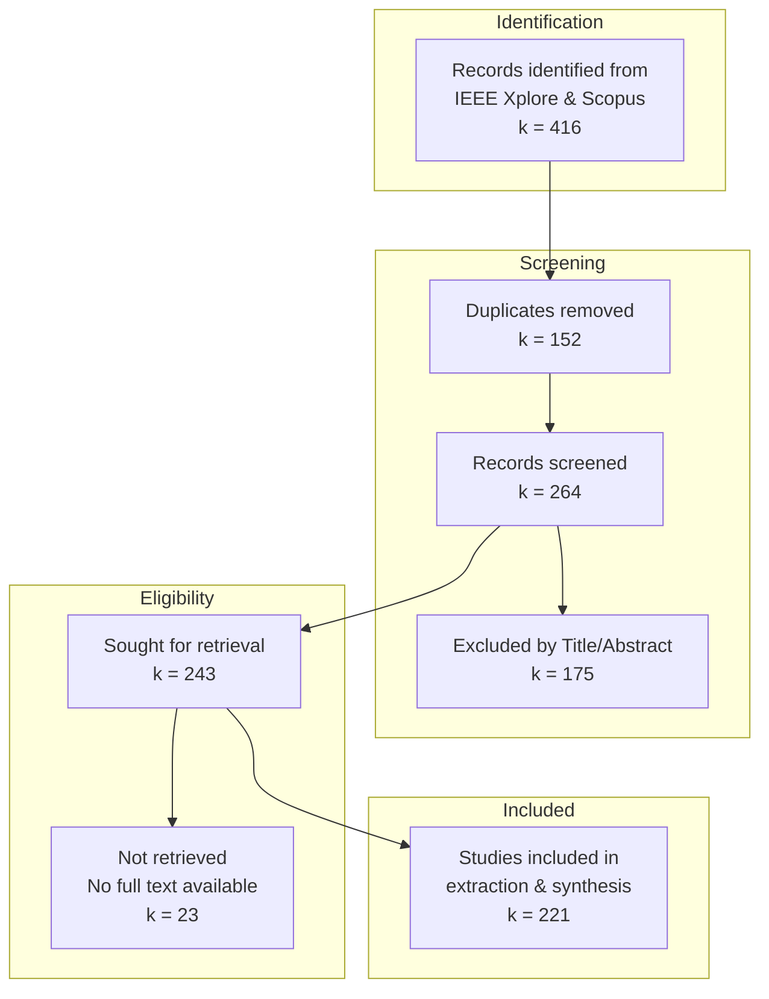

# Review Bundle\n\n## reference_compendium/s02_fund_tpl.md\n\n# II. TECHNICAL FUNDAMENTALS OF O-ISAC

> **Section intent (1 paragraph):** This section establishes the unified physical-layer foundations required to compare fiber-, FSO-, VLC-, and photonic-THz O-ISAC systems under a common measurement contract. We intentionally separate (i) propagation/channel models, (ii) transceiver/hardware abstractions, and (iii) sensing-performance definitions (resolution vs accuracy vs bounds), so that later taxonomy and trade-off synthesis are mathematically defensible.

---

## A. Unified O-ISAC System Model and Integration Paradigms

### A.1 Canonical Joint Waveform/Resource Model
Define a generic joint design variable set:
- waveform parameters (bandwidth, chirp rate, pilots, coding),
- optical front-end parameters (source type, modulation, detection),
- sensing task parameters (range/angle/velocity vs fiber spatial granularity).

**Generic baseband observation (complex coherent model):**
\[
\mathbf{y}(t)=\mathbf{H}(t;\boldsymbol{\theta})\mathbf{s}(t)+\mathbf{w}(t),
\]
where \(\boldsymbol{\theta}\) collects sensing parameters (delay/range, Doppler, AoA/AoD, vibration state, etc.).

**IM/DD observation (real nonnegative intensity constraint):**
\[
y(t)=\mathcal{R}\,\big(x(t)\ast h(t)\big)+n(t),\qquad x(t)\ge 0,
\]
where \(\mathcal{R}\) is responsivity and \(h(t)\) is the intensity channel impulse response.

> **Measurement-plane note:** declare where �SNR� is measured (electrical post-detection) vs �OSNR� (optical domain pre-detection), and why this matters for cross-modality comparisons.

### A.2 Integration Paradigms (Communication-centric / Sensing-centric / Joint Design)
Provide a unifying taxonomy of integration *mechanisms* (not modalities):
- shared waveform, shared hardware, shared spectrum/time, shared processing.
Define �integration depth� as an abstract variable \(d_{\text{int}}\in\{0,1/2,1\}\) matching your Table I scoring logic.

**Lesson (A):** A unified system model is the only way to make later �taxonomy� and �trade-off� claims falsifiable rather than narrative.

---

## B. Propagation and Channel Models Across Modalities

### B.1 Fiber Channel (Guided Medium)
State the linearized coherent comm model and (optionally) the NLSE abstraction:

**(i) Linear dispersive model:**
\[
\mathbf{y}(t)=\mathbf{G}_{\text{disp}}(t)\ast \mathbf{s}(t)+\mathbf{w}(t)
\]

**(ii) NLSE (conceptual, not fully expanded):**
\[
\frac{\partial A(z,t)}{\partial z}
= -\frac{\alpha}{2}A -j\frac{\beta_2}{2}\frac{\partial^2 A}{\partial t^2}
+ j\gamma |A|^2A + \eta(z,t).
\]

### B.2 FSO Channel (Atmosphere + Pointing)
Write the multiplicative fading + pointing error structure:
\[
y = h_{\text{turb}}\,h_{\text{point}}\,x + n,
\]
and specify candidate statistical models (lognormal / Gamma�Gamma) and when each is used.
Clarify the LoS dominance and when multipath is non-negligible (urban canyon, reflective surfaces).

### B.3 VLC Channel (Lambertian + Multipath + Ambient Light)
Lambertian DC gain \(H_0\) and impulse response form; include the illumination constraint:
\[
x(t)=x_{\text{DC}} + x_{\text{AC}}(t),\quad x_{\text{AC}}(t)\in[-x_{\text{DC}},\,\infty)
\]
Highlight shot noise / thermal noise and the ambient light term.

### B.4 Photonic-THz Bridging (Optical generation/distribution + THz wireless propagation)
Define the �bridging� as a *hybrid transceiver architecture*:
- optical carrier(s) used for generation/LO/distribution,
- RF/THz carrier used for wireless propagation.

**Lesson (B):** Channel models differ in their dominant impairments, but the *contract* for reporting comm/sensing performance must not.

---

## C. Transceiver and Hardware Abstractions (What is Common, What is Modality-Specific)

### C.1 Sources and Modulators
- LED/LD/VCSEL, external modulation (MZM, TFLN-MZM), direct modulation.
State which assumptions enable coherent vs IM/DD.

### C.2 Receivers and Detection
- IM/DD photodiodes, APD/SPAD, coherent receivers.
Add explicit �measurement plane� mapping:
- OSNR � coherent optical systems,
- electrical SNR � VLC/IM-DD post-detection.

### C.3 Beamforming/Wavefront Control Enablers
- OPA, ORIS/metasurfaces, PICs.
Define a generic array response for angle sensing/beam steering:
\[
\mathbf{a}(\phi)=\left[1,\,e^{j k d \sin\phi},\,\ldots,\,e^{j k d (N-1)\sin\phi}\right]^{\top}.
\]

**Lesson (C):** Hardware commonality exists at the abstraction level (source�modulator�channel�detector), not at the implementation level.

---

## D. Sensing Principles and the Metric Contract (Resolution vs Accuracy vs Bounds)

### D.1 Ranging/ToF/FMCW/LFM Fundamentals
State the *two-way ranging convention* explicitly.

**Bandwidth-limited two-way range resolution:**
\[
\Delta r_{\min}\triangleq \frac{v}{2B_{\mathrm{eff}}}
\]
with \(v=c\) in free space and \(v\approx c/n_g\) in guided media.

### D.2 Accuracy (Estimator-Dependent) and CRB/FIM Bounds
Define estimator RMSE:
\[
\sigma_r \triangleq \sqrt{\mathbb{E}\big[(\hat r-r)^2\big]}.
\]

Provide a canonical CRB form (delay estimation exemplar):
\[
\mathrm{var}(\hat\tau)\ge \frac{1}{8\pi^2 \beta^2\,\mathrm{SNR}}
\quad \Rightarrow \quad
\mathrm{var}(\hat r)\ge \left(\frac{v}{2}\right)^2\mathrm{var}(\hat\tau),
\]
where \(\beta\) is RMS bandwidth.

### D.3 Fiber Spatial Granularity (\(\Delta z\)) vs Wireless Range Resolution (\(\Delta r_{\min}\))
Make the separation explicit:
- \(\Delta z\): minimum resolvable segment / gauge length / sampling granularity in DAS/OTDR-type sensing.
- \(\Delta r_{\min}\): bandwidth-limited ranging resolution for ToF/FMCW-style tasks.

### D.4 Capacity�Resolution Quotient
Keep your contract consistent:
\[
\mathrm{CRQ}_{\Delta}\triangleq \frac{R}{\Delta r_{\min}}\quad [\mathrm{bps/m}].
\]
Add a one-sentence constraint: comparisons only on subset where \(\Delta r_{\min}\) exists.

**Lesson (D):** Without separating \(\Delta r_{\min}\), \(\sigma_r\), CRB/FIM, and \(\Delta z\), �resolution� becomes non-isomorphic and destroys cross-paper comparability.

---

## E. ISAC Coupling and Trade-off Foundations (Optimization View)

### E.1 Multiobjective Formulation
State a generic joint design problem:
\[
\max_{\mathbf{x}} \; R(\mathbf{x})
\quad \text{s.t.}\quad
\mathrm{CRB}_r(\mathbf{x})\le \epsilon,\;\; P(\mathbf{x})\le P_{\max},
\]
or equivalently a scalarized Lagrangian:
\[
\max_{\mathbf{x}}\; R(\mathbf{x})-\lambda\,\mathrm{CRB}_r(\mathbf{x}).
\]

### E.2 Coupling Mechanisms by Modality
Explain *why* coupling differs:
- IM/DD amplitude constraints,
- coherent phase access,
- fiber sensing probe interference with comm carriers,
- turbulence/ambient noise affecting both tasks.

### E.3 What This Enables Later (Bridge to Sections IV�V)
One paragraph mapping: Section II gives the *physics + metrics*; Section IV will categorize *architectures*; Section V will quantify *Pareto frontiers*.

**Lesson (E):** O-ISAC is not �two tasks in one box�; it is a constrained joint optimization where the constraints differ by modality and measurement plane.

---
\n\n## drafts/section_02_methodology.md\n\n# II. SURVEY METHODOLOGY (PRISMA 2020)

## A. Protocol and Registration
This systematic review was conducted in strict accordance with the **Preferred Reporting Items for Systematic Reviews and Meta-Analyses (PRISMA) 2020** guidelines [Page2020]. Unlike traditional narrative reviews, which are susceptible to selection bias, our methodology follows a formal protocol to ensure reproducibility and comprehensiveness. The protocol for this review, including the research questions and search strategy, was documented prior to the literature search and is available at [OSF Link].

## B. Information Sources and Search Strategy
To capture the multidisciplinary nature of Optical Integrated Sensing and Communication (O-ISAC), we performed a comprehensive search across two major academic databases: **IEEE Xplore** and **Scopus**. The search covered the period from **January 2020 to December 2025**, with earlier foundational works (pre-2020) included if they clearly demonstrated joint sensing-communication functionality on optical carriers.

We employed a multi-string Boolean search strategy combining keywords from two primary domains:

*   **Block A (ISAC Concepts):** ("integrated sensing and communication" OR ISAC OR "joint sensing and communication" OR "joint communication and sensing" OR "joint radar-communication" OR "dual-function radar-communication" OR DFRC OR "simultaneous sensing and communication")
*   **Block B (Optical Media):** (optical OR photonic OR "optical fibre" OR "optical fiber" OR fibre OR fiber OR "free-space optical" OR FSO OR "visible light" OR "visible light communication" OR VLC OR LiFi OR LiDAR OR LIDAR OR "optical radar")

The core Boolean structure used for searches was: **(Block A) AND (Block B)**. The full search strings and query syntax for each database are detailed in **Appendix A**.

## C. Eligibility Criteria
To ensure a focused analysis of the physical-layer integration, the following inclusion and exclusion criteria were applied:

**Inclusion Criteria:**
1.  **Scope:** Studies proposing a physical-layer convergence of optical sensing and communication (e.g., shared waveform, shared hardware, or joint spectrum allocation).
2.  **Type:** Peer-reviewed journal articles and full-length conference proceedings.
3.  **Content:** Papers providing quantitative performance metrics (at least one communication metric AND one sensing metric) or specific system architectures.
4.  **Domain:** Both cabled O-ISAC (fiber-based) and wireless O-ISAC (FSO, VLC, LiDAR-like) systems.

**Exclusion Criteria:**
1.  **Domain:** Studies focused solely on RF-domain ISAC without an optical component.
2.  **Modality:** Studies focused on "Pure Sensing" (e.g., classical LiDAR, φ-OTDR without communication) or "Pure Communication" (e.g., standard FSO link) without integration.
3.  **Language:** Non-English publications.
4.  **Format:** Abstracts, posters, patents, theses, and non-peer-reviewed preprints.

## D. Study Selection Process
The selection process followed a three-phase screening workflow conducted by **two independent reviewers**, as illustrated in the **PRISMA Flow Diagram (Fig. 2)**.



**Fig. 2.** PRISMA 2020 Flow Diagram describing the study selection process for O-ISAC systematic review.

Title/abstract screening was performed independently by two reviewers, with disagreements resolved through consensus discussion. For full-text eligibility, records were coded using standardized exclusion reasons: `EXC-WRONG-DOMAIN` (RF-only ISAC), `EXC-PURE-SENSING` (no communication function), `EXC-PURE-COMM` (no sensing function), and `EXC-NO-PHY` (insufficient physical-layer detail).

## E. Data Extraction and Quality Assessment

### E.1 Data Extraction Process
For each included study, we extracted data using a predefined, version-controlled **O-ISAC Extraction Schema** (JSON format). Extraction was performed at two levels:

*   **Study-level:** Bibliographic information, system classification (cabled vs. wireless O-ISAC), and qualitative claims.
*   **Scenario-level:** Multiple operating points per study (e.g., different distances, SNR regimes, turbulence levels) to faithfully capture trade-off curves.

The extracted data items included:
1.  **System Characteristics:** Medium class (fiber/FSO/VLC), carrier band, operational environment, link topology.
2.  **Transceiver Architecture:** Source type (laser/LED), modulation type, detector, wavelength, power.
3.  **Waveform Design:** Communication waveform family, sensing waveform family, ISAC waveform relationship.
4.  **Channel Parameters:** Fiber length, attenuation, turbulence model, link distance.
5.  **Performance Metrics:** Data rate (Gbps), BER, spectral efficiency, sensing range, range resolution, localization error.
6.  **Trade-off Characterization:** Coupling mode, trade-off type (rate vs. RMSE, etc.), representation (curve/Pareto/single-point).

### E.2 Technical Quality Assessment Form (TQAF)
Given the engineering nature of O-ISAC studies, conventional clinical risk-of-bias tools are not applicable. Instead, we developed a custom **Technical Quality Appraisal Framework (TQAF)** tailored for physical-layer research. Each study was independently rated by two reviewers across five dimensions using an ordinal scale (0 = low, 1 = moderate, 2 = high):

| Dimension | Assessment Focus |
|:----------|:-----------------|
| **Modelling Fidelity** | Explicit, realistic signal/channel/hardware models |
| **Validation Strength** | Meaningful baselines, scenario coverage, stress testing |
| **Experimental Validity** | Hardware transparency, calibration, repetition (if experimental) |
| **Metric Completeness** | Both communication AND sensing metrics reported under same scenario |
| **Reproducibility** | Parameter sufficiency, code/data availability |

TQAF ratings were not used as exclusion criteria, but informed the strength of evidence in the narrative synthesis and sensitivity analyses.

## F. Data Synthesis
A formal statistical meta-analysis was not performed due to the high heterogeneity in performance metrics and evaluation scenarios. Instead, we conducted:

1.  **Qualitative Synthesis:** A structured narrative synthesis organized by medium (cabled O-ISAC vs. wireless O-ISAC), with a hierarchical **physical-layer taxonomy** visualized as a sunburst chart.
2.  **Quantitative Descriptive Analysis:** Key performance trade-off relations (Capacity vs. Estimation Accuracy, Rate vs. Range Resolution) were analyzed to identify common operating regimes and design trends.
3.  **Gap Analysis:** Methodological gaps and open research problems were identified through systematic comparison across the taxonomy branches.
\n\n## protocol/prisma_proto.md\n\n# Optical ISAC Systematic Review Protocol  
_Prepared in accordance with PRISMA 2020, PRISMA-P 2015, and PRISMA-S_

---

## 1. Administrative Information

### 1.1 Title  

**Optical Integrated Sensing and Communication (O-ISAC) over Cabled and Wireless Optical Channels: A Systematic Review Protocol**

This protocol describes the planned methodology for a systematic review of optical integrated sensing and communication (O-ISAC) systems, with a primary focus on **cabled (fibre-optic)** and **wireless optical (FSO/VLC/LiDAR-like)** implementations at the physical layer.

### 1.2 Registration  

The protocol will be prospectively registered on the **Open Science Framework (OSF)** under a dedicated project for optical ISAC (O-ISAC) systematic review. The OSF registration ID and DOI will be added here once available.

### 1.3 Support and Roles  

- **Funding / Support:**  
  Any funding bodies or institutional support (e.g., university, government agency, defence organisation) will be declared in the final review. Funders will not influence the design, study selection, analysis, or reporting.

- **Roles and Contributions:**  
  - Conceptualisation, methodology, and supervision: *[Supervisor / PI names]*  
  - Search strategy and data extraction: *[Name of PhD candidate]*  
  - Analysis and synthesis: *[Names as appropriate]*  
  - Manuscript drafting and critical revision: *[All authors]*  

### 1.4 Protocol Amendments  

Any substantial modification to the objectives, eligibility criteria, search strategy, or synthesis methods after registration will be documented with:  
(i) date of change,  
(ii) description of the amendment, and  
(iii) rationale.  

Amendments will be recorded in the OSF registration and summarised in a “Protocol Amendments” subsection of the final published review.

---
## 2. Background and Rationale

Integrated sensing and communication (ISAC) has been widely recognized as a key enabling technology for 6G and beyond networks, allowing the same hardware, spectrum, and waveforms to serve both data communication and environment sensing functions. A rich body of work now exists on radio-frequency (RF) and millimeter-wave ISAC, including joint radar–communications and dual-function radar–communications (DFRC) architectures, waveform design, and information-theoretic performance limits. These studies have firmly established ISAC as a spectrum- and cost-efficient paradigm in the RF and microwave domains. However, existing ISAC surveys and tutorial-style overviews overwhelmingly focus on RF-centric systems and only marginally touch upon optical bands, if at all.

In parallel, optical integrated sensing and communication (O-ISAC) has begun to emerge as a complementary paradigm that exploits the very large, largely license-free bandwidth of optical carriers, their inherent immunity to electromagnetic interference, and their potential for fine spatial and temporal resolution. Recent works have proposed O-ISAC architectures in which the same optical waveform and hardware are used to support both high-rate data transmission and high-resolution sensing, including ranging, vibration monitoring, localisation, and imaging. These efforts span both wired (fibre-based) and wireless (free-space and visible-light) optical domains and demonstrate that optical carriers can, in many scenarios, outperform RF ISAC in terms of achievable throughput and sensing accuracy.

On the cabled side, fibre-based O-ISAC (or fibre-ISAC) builds upon decades of research in distributed fibre-optic sensing, including Rayleigh-, Brillouin-, and Raman-based schemes such as φ-OTDR, DAS, and distributed temperature/strain sensing. While traditional distributed fibre sensing systems were deployed as standalone sensing links, recent contributions explicitly integrate high-speed coherent or intensity-modulated communication channels with distributed sensing on the same fibre, often sharing the wavelength channel and exploiting nonlinear or backscattering effects for both functions. A prominent example is the demonstration of integrated sensing and communication in an optical fibre (ISAC-OF), where periodic linear frequency-modulated light serves simultaneously as a carrier for PAM4 data and as a probe for distributed vibration sensing along tens of kilometres of fibre. Related advances extend this concept to digital subcarrier multiplexing (DSCM) systems and field trials where real-time fibre sensing coexists with 400 GbE coherent transmission in dense urban environments.

On the wireless side, wireless O-ISAC encompasses free-space optical (FSO), visible light communication (VLC), and LiDAR-like systems in which optical beams or illumination sources jointly convey user data and probe the environment. In FSO-based O-ISAC, pulsed, chirped, or OFDM-based optical waveforms have been used to enable simultaneous high-throughput links and sensing tasks such as target ranging, turbulence characterisation, and obstacle detection, including recent designs based on linear frequency modulation (LFM), continuous phase modulation (CPM), and multi-carrier waveforms. VLC-based O-ISAC systems, in turn, exploit LED luminaires to provide both indoor broadband communication and localisation/positioning, motion tracking, or contextual sensing. More recent work on retroreflective O-ISAC (RO-ISAC) uses corner-cube reflectors and carefully engineered hybrid waveforms to significantly extend sensing range and improve link robustness, with experimental demonstrations of full-duplex and bidirectional RO-ISAC links that trade off communication rate against ranging accuracy through flexible waveform design and power allocation.

Despite this growing activity, the O-ISAC literature remains fragmented across several largely disjoint communities: optical communications and photonics, distributed fibre sensing, LiDAR and optical remote sensing, VLC and optical wireless, and the broader ISAC/radar–communications community. Many optical systems that are functionally O-ISAC are not explicitly framed as such (e.g., “integrated communication and sensing in DSCM systems”, “optical covert sensing and communication”, “hybrid gas sensing and FSO communication”), and there is currently no unified taxonomy that jointly covers cabled versus wireless O-ISAC under a common physical-layer perspective. Existing overview-type papers either provide high-level architectural discussions of O-ISAC or focus on specific subdomains (e.g., fibre-based integrated sensing and communication, LED-based O-ISAC for IoT, or retroreflective O-ISAC), but do not systematically map the space of signal models, channel models, hardware architectures, and performance trade-offs across the full optical spectrum.

This review is motivated by the absence of a systematic, PRISMA-based survey that treats optical integrated sensing and communication as a coherent field and explicitly organises it along two main physical-layer axes: (i) **cabled O-ISAC**, where sensing and communication share fibre infrastructure and possibly spectrum, and (ii) **wireless O-ISAC**, where FSO, VLC, and LiDAR-like links realise joint sensing–communication in free space. By adopting a unified O-ISAC lens across these domains, the survey aims to bridge the vocabulary and modelling gaps between fibre sensing, optical wireless, and ISAC communities; highlight common waveform and channel-modelling structures; and identify cross-cutting design challenges and open research problems that are not apparent when these subfields are considered in isolation.
---


## 3. Objectives  

This systematic review aims to go beyond a simple cataloguing of optical integrated sensing and communication (O-ISAC) studies by constructing a **unified physical-layer framework** that jointly covers cabled (fibre-based) and wireless (FSO/VLC/LiDAR-like/retroreflective) implementations. The review emphasises (i) how sensing and communication functions are physically integrated on optical carriers, (ii) how their performance is quantified and traded off across heterogeneous optical media and models, and (iii) how these insights inform future 6G-oriented O-ISAC architectures.

### 3.1 Research Questions

To structure this objective, the review is organised around the following research questions:

- **RQ1 (Physical Integration and Architectures):**  
  How are sensing and communication functions jointly realised in cabled and wireless optical systems in terms of shared hardware, spectrum, and waveforms, and to what extent can these architectures be described within a unified physical-layer model?

- **RQ2 (Signal, Channel, and Trade-off Modelling):**  
  What classes of signal and channel models are used to describe optical ISAC operation, and how do existing works quantify and manage the trade-off between communication performance (e.g., rate, BER, reliability) and sensing performance (e.g., range, resolution, detection/estimation accuracy), including—where available—links to information-theoretic and estimation-theoretic limits?

- **RQ3 (Gaps, 6G Context, and Enabling Technologies):**  
  Which methodological gaps and open problems emerge when cabled and wireless O-ISAC studies are viewed through a common 6G physical-layer lens, and what implications do these have for emerging enabling technologies such as optical reconfigurable intelligent surfaces and optical phased arrays?

> **Note.** RIS/OPA are treated as *enabling-platform implications* of the O-ISAC evidence base. Studies that do not satisfy the O-ISAC eligibility criteria (Section 4) are not targeted for inclusion solely on the basis of RIS/OPA content.

### 3.2 Specific Objectives

To answer these questions, the review pursues the following specific objectives:

1. **Systematic identification and classification**
   - To systematically identify and classify optical ISAC studies into
     (i) cabled O-ISAC (fibre-based integrated sensing and communication) and
     (ii) wireless O-ISAC (FSO, VLC, LiDAR-like, retroreflective systems),
     based on the shared use of optical hardware, spectrum, and/or waveforms for both sensing and communication.

2. **Unified physical-layer taxonomy**
   - To develop a unified physical-layer taxonomy that organises O-ISAC systems jointly by
     - medium (fibre vs free-space),
     - integration mechanism (e.g., resource-division vs fully joint waveforms), and
     - signal dimension (intensity-only vs coherent field processing, single-aperture vs multi-aperture/array-based designs).

3. **Sensing–communication performance and trade-offs**
   - To synthesise reported performance metrics and trade-offs between communication (e.g., data rate, spectral efficiency, BER, latency, reliability) and sensing (e.g., range, resolution, sensitivity, detection probability, estimation error) in existing O-ISAC experiments and simulations, and to relate these trade-offs to known information-theoretic and estimation-theoretic limits where such comparisons are meaningful.

4. **Mapping traditional optical techniques into an O-ISAC framework**
   - To map how traditional optical communication and sensing techniques (e.g., coherent and IM/DD fibre links, distributed fibre sensing, VLC positioning, LiDAR and retroreflective schemes) have been adapted or reinterpreted under an O-ISAC framework, including systems that are functionally O-ISAC but not explicitly labelled as such.

5. **Comparative analysis of cabled vs wireless O-ISAC**
   - To comparatively analyse cabled and wireless O-ISAC systems along common dimensions (waveform design, channel modelling assumptions, hardware constraints, robustness to fibre nonlinearities and atmospheric/propagation impairments), in order to identify structural similarities, fundamental differences, and opportunities for cross-fertilisation between fibre and optical wireless communities.

6. **Gaps, open problems, and implications for 6G optical ISAC**
   - To identify methodological gaps, modelling inconsistencies, and open research problems that arise when bridging fibre sensing, optical wireless, and RF-ISAC perspectives, and to outline a research agenda for O-ISAC in 6G and beyond, including implications for programmable photonic platforms such as optical reconfigurable intelligent surfaces and optical phased arrays.

---

## 4. Eligibility Criteria

The eligibility criteria are defined a priori to ensure consistent selection of studies and tight alignment with the primary research question and specific objectives of the review. They operationalise the notion of optical integrated sensing and communication (O-ISAC) at the physical layer across cabled and wireless optical domains.

### 4.1 Types of studies

**Inclusion**

- Peer-reviewed **journal articles** and **full-length peer-reviewed conference papers** that present original analytical, simulation-based, experimental, or field-trial work on optical integrated sensing and communication.
- Studies that describe **physical-layer or link-layer** designs in which sensing and communication functions are jointly realised using shared optical hardware, spectrum, and/or waveforms.
- System-level or architectural papers that include **sufficient technical detail** on signal models, channel models, or transceiver/hardware architectures to support classification under the proposed physical-layer O-ISAC taxonomy.

**Exclusion**

- Non–peer-reviewed material (theses, book chapters, white papers, technical reports, magazine articles) and purely conceptual vision or position papers that do not provide concrete physical-layer models, architectures, or quantitative performance results.
- Standards and roadmap documents that mention ISAC or O-ISAC but lack sufficient technical detail for data extraction.

### 4.2 O-ISAC domain and system scope

**Inclusion**

- **Cabled O-ISAC (fibre-based):** Optical fibre systems where both
  - a **communication function** (e.g., coherent or IM/DD data transmission), and  
  - a **sensing function** (e.g., distributed vibration, temperature, strain, intrusion, infrastructure monitoring)  
  are realised on the same fibre infrastructure, and at least one of the following holds:
  - sensing and communication share the same optical wavelength, time slots, subcarriers, or power budget; or  
  - sensing backscatter/nonlinear effects are intentionally exploited while a communication channel coexists on the same fibre.

- **Wireless O-ISAC:** Free-space optical (FSO), visible light communication (VLC) / optical wireless (OWC), LiDAR-like, or retroreflective optical systems in which:
  - the same optical transmitter/receiver or optical front-end is used both to convey user data and to probe the environment (e.g., range, localisation, imaging, turbulence/obstacle sensing); or  
  - waveforms and resources (e.g., OFDM subcarriers, pulses, chirps) are jointly designed or allocated for simultaneous sensing and communication performance.

- Optical systems that are **functionally O-ISAC but not explicitly labelled as such**, including “joint sensing and communication on fibre,” “integrated communication and sensing in DSCM,” “hybrid gas sensing and FSO links,” or “VLC localisation with concurrent data,” provided they meet the shared-hardware/spectrum/waveform criterion above.

**Exclusion**

- Pure **optical communication** systems (fibre, FSO, VLC, LiDAR-like) that only provide data transmission and do not perform any explicit sensing or measurement task beyond standard channel estimation or tracking for equalisation/beamforming.
- Pure **optical sensing or imaging** systems (e.g., classical LiDAR, φ-OTDR/DAS, distributed temperature/strain sensing) that do not support or co-design a data communication channel on the same optical infrastructure.
- RF and millimetre-wave ISAC works without an optical carrier, even if conceptually similar.

### 4.3 Outcomes and reported information

**Inclusion**

- Studies that report at least one **communication-related metric** (e.g., achievable rate, spectral efficiency, BER, SNR, capacity, latency) **and** at least one **sensing-related metric** (e.g., range, spatial or temporal resolution, sensitivity, detection probability, estimation error, localisation accuracy), or provide sufficient detail for such metrics to be inferred.
- Studies that specify **signal models, channel models, and/or transceiver/hardware architectures** in enough detail to be mapped into the unified physical-layer O-ISAC taxonomy (e.g., waveform families, modulation/detection schemes, fibre or atmospheric channel models, key hardware constraints such as dynamic range or aperture).

**Exclusion**

- Studies that describe sensing or communication purely qualitatively, without quantitative performance, model parameters, or architectural detail sufficient for taxonomy and trade-off analysis.

### 4.4 Time frame

- **Primary window:** The core search will focus on studies published approximately in the **last five years** (e.g., 2020 onwards), reflecting the rapid emergence of explicitly framed optical ISAC work in both fibre and wireless optical domains.
- **Earlier foundational works:** Older studies (pre-2020) will also be considered **if** they clearly realise joint sensing and communication on optical carriers under the functional O-ISAC definition above (for example, early joint distributed sensing–communication fibre links, VLC positioning with concurrent data, or retroreflective optical links combining data and ranging).

The exact cut-off dates will be specified and justified in the search strategy, in light of the evolution of O-ISAC terminology and architectures.

### 4.5 Language and publication status

- Only studies published in **English** will be included, to ensure consistent technical interpretation and feasibility of screening.
- Peer-reviewed and formally accepted articles will form the primary evidence base. High-quality preprints (e.g., arXiv) may be tracked during screening for forward citation and, where appropriate, linked to subsequent peer-reviewed versions identified during updated searches.

### 4.6 Study design and setting

- No restriction will be imposed on setting (laboratory, field trial, industrial testbed, indoor/outdoor) as long as the optical ISAC criteria above are satisfied.
- Simulation-only, analytical, experimental, and hybrid (analysis + experiment) studies are all eligible, provided they report sufficient model detail and performance metrics for inclusion in the taxonomy and trade-off analysis.

---

## 5. Information Sources

To capture both the communication-theoretic and optoelectronic physical-layer aspects of optical integrated sensing and communication (O-ISAC), the literature search will draw on a broad set of bibliographic databases and supplementary sources. All information sources, search strategies, and search dates will be documented in detail in line with PRISMA 2020 and the PRISMA-S extension for reporting literature searches.

### 5.1 Electronic Databases

The primary search will be conducted in the following databases and publisher platforms:

1. **IEEE Xplore (IEEE)**  
   *Focus:* Core source for communications, signal processing, radar/ISAC, and optical networking/FSO/VLC engineering literature (e.g., IEEE Transactions on Communications, IEEE Transactions on Wireless Communications, IEEE Journal on Selected Areas in Communications, Journal of Lightwave Technology, Journal of Optical Communications and Networking).
   *Rationale:* Captures the majority of RF/ISAC and optical communication work, including many O-ISAC and RO-ISAC papers published in IEEE venues.

2. **Scopus (Elsevier)**  
   *Focus:* Broad multidisciplinary coverage across engineering, physics, and applied optics, indexing major optical and photonics journals from multiple publishers.  
   *Rationale:* Ensures that O-ISAC-relevant work appearing in non-IEEE journals (e.g., optical physics, photonic device papers) is not missed.

3. **Web of Science Core Collection (Clarivate)**  
   *Focus:* High-quality citation indexing for science and engineering journals.  
   *Rationale:* Provides an independent cross-check on key O-ISAC publications and facilitates structured forward and backward citation tracking.

4. **Optica Publishing Group (formerly OSA) platform**
   *Focus:* Optics and photonics journals such as *Optics Express*, *Optics Letters*, *Optica*, *Optical Materials Express*, *Chinese Optics Letters*, and the *Journal of Optical Communications and Networking* (co-published with IEEE).  
   *Rationale:* Essential for fundamental photonics, fibre sensing (e.g., φ-OTDR/DAS, Brillouin/Raman-based schemes), and optical wireless device work that underpin cabled and wireless O-ISAC architectures.

5. **SPIE Digital Library** 
   *Focus:* Conference proceedings in optics and photonics, including LiDAR, electro-optical remote sensing, and optical engineering (e.g., *Lidar and Optical Remote Sensing for Environmental Monitoring*, *Electro-Optical Remote Sensing* series).  
   *Rationale:* Critical for early experimental demonstrations of LiDAR-like and optical sensing hardware that may implement O-ISAC-like functionality before appearing in journal form.

Where platforms permit multi-database searching (e.g., Scopus and Web of Science indexing overlapping content), the specific database(s) and platform(s) used will be clearly specified in the final review, together with the date of the last search for each source, as recommended by PRISMA-S.

### 5.2 Preprints and Grey Literature

Given the rapid development of 6G ISAC and O-ISAC research, preprint servers will be searched to identify emerging, highly recent work and to trace the peer-reviewed versions of influential manuscripts:

- **arXiv**  
  *Scope:* Categories `eess.SP` (Signal Processing), `cs.IT` (Information Theory), and `physics.optics` (Optics).  
  *Rationale:* Many ISAC, RO-ISAC, and optical radar/communication manuscripts initially appear as arXiv preprints before journal publication.

- **TechRxiv (IEEE preprint server)**  
  *Scope:* Open, moderated repository for unpublished and pre-review research in electrical engineering, computer science, and related technologies.  
  *Rationale:* Provides early access to O-ISAC-related manuscripts submitted to IEEE journals and conferences.

Preprints will be **tracked and documented** but, consistent with the eligibility criteria (Section 4.5), only peer-reviewed or formally accepted versions will be included in the primary evidence base whenever such versions are available. Where a preprint is the only available version, this will be explicitly flagged and its influence on the synthesis discussed.

No clinical or trial registries will be searched, as O-ISAC is an engineering domain where such registries are not relevant.

### 5.3 Supplementary Search Methods

To minimise the risk of missing relevant O-ISAC studies, the following supplementary search methods will be employed:

- **Backward and forward citation chasing (snowballing):**  
  - *Backward snowballing:* Reference lists of all included full-text articles and key review papers will be screened for additional O-ISAC-relevant studies.  
  - *Forward snowballing:* Citation indices in Scopus, Web of Science, and Google Scholar will be used to identify subsequent articles citing the core O-ISAC papers.

- **Targeted venue and proceedings searches:**  
  Focused manual searches will be performed in recent (e.g., last 3–5 years) proceedings and issues of venues where optical sensing, photonics hardware, and communications/ISAC work intersect, including but not limited to:
  - *Photonics/optics conferences:* OFC (Optical Fiber Communication Conference), ECOC (European Conference on Optical Communication), CLEO, and selected SPIE conferences on LiDAR, electro-optical remote sensing, and optical engineering.
  - *Communications conferences:* IEEE ICC, IEEE Globecom, IEEE WCNC, and selected ISAC/6G-focused workshops co-located with these events.

The details of each supplementary search (venue, years covered, access route, and date searched) will be recorded in a structured search log to support reproducibility.

### 5.4 Documentation and Transparency

For every information source (databases, platforms, preprint servers, conference proceedings, and citation searches), the following will be reported in the final review:

- the full name of the source and platform,  
- the exact search strategy or browsing method used,  
- any date limits or filters applied,  
- the date when the source was last searched.

This level of detail follows PRISMA 2020 and PRISMA-S guidance on reporting the “what, when, and how” of information sources, and is intended to facilitate future updating of the review and independent assessment of its completeness. :contentReference

<!-- TODO: Add links to the archived search log (e.g., OSF) and record final search dates once the searches are executed. -->


---

## 6. Search Strategy  

The search strategy is designed to retrieve optical integrated sensing and communication (O-ISAC) studies across both cabled (fibre-based) and wireless (FSO/VLC/LiDAR-like) domains, with explicit emphasis on physical-layer architectures, signal and channel models, and joint sensing–communication performance. Search methods will be planned and reported in accordance with PRISMA 2020 and the PRISMA-S extension for reporting literature searches.

### 6.1 Conceptual Framework and Block Logic  

The search strategy is built around three conceptual blocks:

1. **Block A – Integrated sensing and communication concepts**  
   Terms capturing joint sensing–communication functionality, for example:  
   - "integrated sensing and communication", ISAC,  
   - "joint sensing and communication", "joint communication and sensing",  
   - "joint radar-communication", "dual-function radar-communication", DFRC,  
   - "simultaneous sensing and communication", "simultaneous ranging and communication",  
   - fibre-specific or VLC-specific phrases such as "communication and sensing on fiber", "fibre sensing and communication", "VLC localisation and communication".

2. **Block B – Optical media (cabled and wireless)**  
   Terms restricting the search to optical carriers and hardware, for example:  
   - optical, photonic,  
   - "optical fibre", "optical fiber", fibre, fiber,  
   - "free-space optical", FSO,  
   - "visible light", "visible light communication", VLC, LiFi,  
   - LiDAR, LIDAR, "optical radar",  
   - laser, LED, "optical wireless".

3. **Block C – Physical-layer emphasis (optional refinement)**  
   Terms emphasising physical-layer and hardware aspects, which may be added in sensitivity searches or when the volume of results is very large, for example:  
   - waveform, modulation, "signal model", "channel model",  
   - "physical layer", transceiver, beamforming, "optical front-end".

The **core Boolean structure** used for the main searches will be:

> (Block A) AND (Block B)

Block C will be used as an **optional refinement** when needed (e.g., in Scopus or Web of Science) to reduce clearly off-topic records while maintaining high recall. Exclusion terms (e.g., for purely seismic fibre sensing without any communication function) will be used cautiously and only after checking that they do not remove any records in the validation set (Section 6.3).

### 6.2 Database-Specific Search Strategies  

Database-specific syntax (field tags, proximity operators, wildcards, and filters) will be used for each information source listed in Section 5. The full, exact search strings for each database will be archived (e.g., as an appendix or OSF file) to ensure reproducibility.

#### 6.2.1 IEEE Xplore  

In IEEE Xplore, the search will target metadata fields (Abstract, Title, Keywords) and restrict results to journal articles and conference papers in English. A generic template is:

```text
( "integrated sensing and communication" OR ISAC 
  OR "joint sensing and communication" 
  OR "joint communication and sensing"
  OR "joint radar-communication" 
  OR "dual-function radar-communication" 
  OR DFRC
  OR "simultaneous sensing and communication"
)
AND
( optical OR photonic 
  OR "optical fibre" OR "optical fiber" OR fibre OR fiber
  OR "free-space optical" OR FSO
  OR "visible light" OR "visible light communication" OR VLC OR LiFi
  OR LiDAR OR LIDAR OR "optical radar"
)
```

Where feasible, proximity operators (e.g., NEAR/n) will be used in secondary runs to ensure that sensing/communication terms appear in the same local context as the optical medium terms (for example, "sensing" NEAR/5 "communication").

#### 6.2.2 Scopus and Web of Science

In Scopus and Web of Science, the search will be applied to titles, abstracts, and author keywords. Wildcards will be used to capture spelling variants and related terms. A representative Scopus-style query is:

```text
TITLE-ABS-KEY (
   ( "integrated sensing and communication" 
     OR ISAC 
     OR "joint sensing and communication" 
     OR "joint communication and sensing"
     OR "dual-function" W/3 (radar OR communication)
     OR "simultaneous" W/3 (sensing OR ranging) W/3 communication
   )
   AND
   ( optical* OR photonic* 
     OR "optical fibre" OR "optical fiber" OR fibre* OR fiber*
     OR "free-space optical" OR FSO
     OR "visible light" OR "visible light communication" OR VLC OR LiFi
     OR lidar* OR "optical radar"
   )
)
AND ( LIMIT-TO ( LANGUAGE, "English" ) )
```

For Web of Science, equivalent field tags (e.g., TS= for Topic) and filters (document type = Article OR Proceedings Paper; language = English) will be used.

#### 6.2.3 Optica Publishing Group and SPIE Digital Library

For Optica and SPIE platforms, whose interfaces may differ from IEEE Xplore and Scopus, searches will be configured to target at least the title and abstract fields, using combinations of Block A and Block B terms. When supported, proximity operators will be used to link sensing/communication concepts with optical media (e.g., "communication" NEAR/5 "distributed fiber sensing"; "LiDAR" NEAR/5 "communication"). Where platform limitations prevent full replication of the generic query, the exact syntax and any restrictions will be documented.

#### 6.2.4 Preprint Servers (arXiv, TechRxiv)

For arXiv (categories eess.SP, cs.IT, physics.optics) and TechRxiv, simplified queries will be used, for example:

```text
("integrated sensing and communication" OR "joint sensing and communication" OR ISAC)
AND
(optical OR "optical fiber" OR "optical fibre" OR FSO OR VLC OR LiFi OR LiDAR OR "optical radar")
```

Searches will be filtered by subject area when possible and limited to English-language manuscripts.

### 6.3 Piloting and Validation of the Search Strategy

To evaluate and refine the sensitivity and precision of the search:

1. A validation (“golden”) set of approximately 8–12 known O-ISAC papers will be assembled in advance, covering:
   - cabled (fibre-based) O-ISAC systems, and
   - wireless (FSO, VLC, LiDAR-like, retroreflective) O-ISAC systems.

2. Draft search strings will be iteratively adjusted until all validation-set papers are retrieved in each of the core databases (IEEE Xplore, Scopus, Web of Science). Any missed validation paper will trigger the addition or modification of functional keywords in Block A or Block B.

3. Where candidate exclusion terms (e.g., for purely seismic fibre sensing) are introduced, they will be tested against the validation set and a small random sample of potentially relevant records to ensure that true O-ISAC studies are not inadvertently removed.

4. The final search strategies will be peer reviewed by a second reviewer (e.g., supervisor or information specialist) for completeness and syntactic correctness before being executed.

### 6.4 Limits, Filters, and Search Updating

The following limits and filters will be applied consistently across databases, subject to the capabilities of each platform:

- **Language:** restricted to English.
- **Document type:** peer-reviewed journal articles and peer-reviewed conference papers (including short letters/communications where they contain sufficient technical detail).
- **Publication date:** database searches will be run from 2000 up to the final search date, in order to capture early optical systems that are functionally O-ISAC but predate the ISAC terminology. In line with the eligibility criteria (Section 4.4), the synthesis will place particular emphasis on approximately the last five years (e.g., 2020 onwards), while still including earlier foundational works that clearly implement joint sensing and communication on optical carriers.

If more than twelve months elapse between the initial search and completion of data synthesis, all database and preprint server searches will be updated using the same strategies, restricted to records added after the previous search date. Newly identified studies that meet the eligibility criteria will be incorporated into the screening, extraction, and synthesis processes, and the updated search date will be reported in the final review.

Full search strategies for all databases and information sources will be provided in an appendix or supplementary file and deposited in an open repository together with the search log.

---

## 7. Study Selection Process

The study selection process will follow the PRISMA 2020 flow, consisting of identification (deduplication), screening (title/abstract), and eligibility (full-text) phases. To ensure reproducibility and an auditable decision trail, all selection steps (including deduplication rules, screening decisions, and full-text exclusion reasons) will be executed and logged through the review’s GitHub-based workflow (e.g., Python notebooks/scripts and structured CSV logs).

### 7.1 Data Management and Deduplication (Identification)

Search results from all sources will be exported in standard bibliographic formats (e.g., RIS/CSV) and merged into a master dataset. Deduplication will be conducted in a **semi-automated** manner using a custom Python pipeline archived in the repository (e.g., `analysis/nb/01_search_and_dedup.ipynb`), with the following procedure:

1. **Automated Matching:** Duplicate candidates will be detected using a hierarchy of keys:
   - Exact/near-exact DOI matches (when available),
   - Normalised title similarity (case/punctuation removed; whitespace normalised),
   - Publication year consistency and, where available, author overlap.
2. **Manual Verification:** Candidate duplicates with metadata discrepancies (e.g., differing titles due to subtitles, preprint vs. publisher version, conference vs. journal extension) will be flagged for manual inspection by one reviewer, with the decision recorded in the screening log.
3. **Precedence Rule (Multiple Reports):** When the same study exists in multiple versions, the **most complete peer-reviewed version** (typically the journal article) will be prioritised as the primary record. Earlier versions (e.g., preprints or conference papers) will be retained as linked supplementary reports where relevant.

After deduplication, each unique record will be assigned a persistent identifier (`record_id`) and imported into the screening log for subsequent phases.

### 7.2 Screening Phases

Study selection will be conducted by two independent reviewers to minimise selection bias and improve methodological rigor.

#### Phase 1: Title and Abstract Screening
- **Calibration Exercise:** Prior to formal screening, both reviewers will independently screen a random sample of 50 records to calibrate the interpretation of the eligibility criteria (Section 4). Discrepancies will be discussed and the operational definitions refined before proceeding to the full screening set.
- **Process:** Each reviewer will classify records as **Include**, **Exclude**, or **Unsure** based on titles/abstracts against the predefined eligibility criteria.
- **Decision Rule (Conservative):** Any record marked as *Include* or *Unsure* by at least one reviewer will advance to the full-text stage, to reduce the probability of premature exclusion.

#### Phase 2: Full-Text Eligibility Assessment
- **Process:** Full texts of all potentially eligible records will be retrieved and assessed independently by both reviewers against Section 4.
- **Standardised Exclusion Coding:** Records excluded at full-text stage will be assigned a predefined exclusion code to enable transparent reporting and quantitative breakdowns in the PRISMA flow, for example:
  - `EXC-WRONG-DOMAIN`: RF/mmWave ISAC without an optical carrier.
  - `EXC-PURE-SENSING`: Optical sensing/imaging without a co-designed data communication function.
  - `EXC-PURE-COMM`: Optical communication without an explicit sensing task beyond routine channel estimation.
  - `EXC-NO-PHY`: Conceptual/system-level discussion lacking sufficient physical-layer models/parameters for extraction.
  - `EXC-TYPE`: Non-eligible publication type (e.g., thesis, white paper, non-peer-reviewed report).

### 7.3 Resolution of Disagreements

Disagreements will be handled using a staged resolution process:
1. **Consensus discussion** between the two reviewers.
2. **Third-reviewer arbitration** (e.g., supervisor) if consensus cannot be reached.

All adjudications will be documented in the screening log for auditability.

### 7.4 Transparency and PRISMA 2020 Reporting

The selection results will be reported using a PRISMA 2020 flow diagram, including:
- Records identified per source,
- Duplicates removed,
- Records excluded at title/abstract stage,
- Full-text articles assessed and excluded (with exclusion-code breakdown),
- Final included studies.

All screening decisions and full-text exclusion reasons will be archived in a structured CSV file (e.g., `screening/screening_log.csv`) and version-controlled in the repository, enabling independent verification and future updating of the review.

---

## 8. Data Collection Process

Data collection will follow a rigorous, schema-driven procedure designed to map each included study $s$ to a structured feature vector $\mathbf{x}(s)$, comprising both numerical physical-layer parameters (e.g., data rate, wavelength, sensing range, resolution) and categorical design choices (e.g., waveform family, detection type, channel/turbulence model). The procedure is designed to satisfy PRISMA 2020 (Item 9) and PRISMA-P recommendations on piloting and duplicate extraction.

### 8.1 Extraction Instrument and Data Dictionary

Data will be extracted using a predefined, version-controlled **O-ISAC Extraction Schema** (e.g., `extraction/schema/oisac_extraction_schema.yaml`). The schema functions as a strict data dictionary by defining, for each variable:

- **Data type:** float, integer, string, or constrained category (e.g., `turbulence_model` $\in$ {Log-Normal, Gamma–Gamma, Málaga, ...}).
- **Units:** standardised units (e.g., nm for wavelength, Gbps for rate) to ensure comparability.
- **Missing-data policy:** explicit distinction between **NR** (“Not Reported”) and **NA** (“Not Applicable”).
- **Provenance fields:** each extracted value will be linked to a source pointer (page/figure/table) to enable audit and re-checking.

### 8.2 Pilot Extraction and Refinement

Prior to the main extraction phase, a **pilot calibration** will be conducted on a diverse sample of 5–10 studies (covering fibre, FSO, and VLC domains). The objectives are:

1. To test schema coverage under real-world reporting heterogeneity.
2. To refine operational definitions for borderline or subjective fields (e.g., what qualifies as an explicit “joint” trade-off analysis).
3. To ensure consistent interpretation across reviewers before scaling to the full corpus.

Any substantive modifications to the schema resulting from the pilot will be recorded in the repository changelog and, if the protocol has been registered, in the protocol amendment history (Section 1.4).

### 8.3 Main Extraction Strategy

To balance methodological rigor with feasibility, a **hybrid double-extraction strategy** will be employed:

1. **Core bibliometrics and classification:** two reviewers will independently extract high-level metadata, medium/system classification (cabled vs. wireless), and primary sensing/communication performance metrics.
2. **Deep technical parameters:** complex model parameters (e.g., channel-equation coefficients, turbulence parameters, hardware constraints) will be extracted by one reviewer and explicitly verified by a second reviewer against the full text.

Extraction will be conducted using structured CSV forms (schema-validated at entry) and/or a custom Python-based interface to enforce controlled vocabularies, unit normalisation, and mandatory provenance fields.

### 8.4 Discrepancy Resolution and Agreement Monitoring

Disagreements between reviewers will be resolved through:

1. **Consensus discussion** with explicit citation of the relevant page/figure/table in the full text.
2. **Third-reviewer arbitration** (e.g., supervisor) if consensus cannot be reached.

Inter-rater reliability for categorical classification fields will be monitored during the pilot and early extraction phases using **Cohen’s Kappa ($\kappa$)**:

$$\kappa = \frac{p_o - p_e}{1 - p_e}$$

where $p_o$ denotes observed agreement and $p_e$ denotes chance agreement. Persistently low agreement (e.g., $\kappa < 0.6$ as a pragmatic “re-calibration” trigger) will prompt refinement of field definitions and an additional calibration round.

### 8.5 Handling Missing or Unclear Data

- **Explicit missingness:** values not stated in the report will be coded as **NR**.
- **Figure-only quantities:** when quantitative values are available only in plots, a digitisation tool (e.g., WebPlotDigitizer) may be used. Digitised values will be flagged (e.g., `EST-FIG`), accompanied by the figure reference, and **verified by a second reviewer**.
- **Author queries:** for seminal studies where critical physical-layer parameters are missing, corresponding authors may be contacted with a structured request. If the information cannot be obtained, the field will remain NR and be treated accordingly in synthesis.

### 8.6 Automation and Audit Trail

Python scripts will be used to parse bibliographic metadata, manage the extraction database, and enforce schema validation; however, extraction of non-trivial technical values will remain **human-in-the-loop** to preserve context-aware accuracy. All extraction artefacts (screening IDs, schema versions, changelogs, and the final dataset) will be version-controlled and archived in the project repository to provide a transparent, reproducible audit trail.

---

## 9. Data Items

The review will extract a structured set of variables (“data items”) from each included report, using the version-controlled extraction schema and data dictionary described in Section 8 (including explicit **NR** = Not Reported and **NA** = Not Applicable coding). The data items are designed to support (i) a unified physical-layer taxonomy across cabled and wireless optical media and (ii) a rigorous characterisation of sensing–communication coupling and reported trade-offs, spanning analytical, simulation, experimental, and hybrid evidence.

### 9.0 Unit of Extraction and Record Structure

Because many O-ISAC papers report multiple operating points (e.g., multiple distances, SNR regimes, turbulence levels, or modulation orders), extraction will be performed at two levels:

- **Study-level record (one per paper):** bibliographic information, high-level classification, architecture and modelling choices, and qualitative claims.
- **Scenario-level record (one-to-many per study):** each scenario corresponds to a distinct configuration under which quantitative sensing and/or communication outcomes are reported (e.g., a particular channel model/parameter set, link distance, waveform setting, or experimental condition). Scenario-level records enable faithful capture of curves and trade-off surfaces without arbitrary down-selection.

Where a study reports only one operating point, the study has a single scenario-level record.

### 9.1 Bibliographic and Administrative Information (Study-level)

- **record_id** (string): persistent identifier assigned after deduplication.
- **title** (string).
- **authors** (string).
- **year** (integer).
- **venue** (string): journal/conference name.
- **publisher/platform** (string; NR/optional).
- **doi** (string; NR/optional).
- **document_type** (enum): {journal, conference, letter/short communication}.
- **peer_review_status** (enum): {peer-reviewed, accepted, other}; primary synthesis targets peer-reviewed/accepted.

### 9.2 O-ISAC System and Medium Classification (Study-level)

- **oisac_medium_class** (enum): {cabled_fibre, wireless_fso, wireless_vlc, wireless_lidar_like, wireless_retroreflective, hybrid}.
- **carrier_band** (enum; NR/optional): {visible, NIR, SWIR, C-band, other}.
- **operational_environment** (enum; NR/optional): {indoor, outdoor, lab, field_trial, mixed}.
- **link_topology** (enum; NR/optional): {monostatic, bistatic, multistatic, distributed_fibre}.
- **mobility_context** (enum; NR/optional): {static, quasi_static, mobile, not_specified}.

### 9.3 Application Scenario and Use-case Taxonomy (Study-level)

- **application_domain** (enum; multi-label allowed): {vehicular, industrial_manufacturing, indoor_positioning, environmental_monitoring, critical_infrastructure, fibre_network_monitoring, robotics_autonomy, aerospace_space, uav_aerial, maritime_underwater, security_surveillance, other}.
- **scenario_description** (string; NR/optional): free-text summary of the intended use case.
- **requirements_claimed** (string; NR/optional): any explicit application targets (e.g., latency bounds, safety constraints, coverage/range requirements).

### 9.4 Evidence Type and Validation Strength (Study-level + Scenario-level)

- **evidence_type** (enum; multi-label allowed): {analytical, simulation, experimental, hybrid}.
- **validation_baselines_present** (boolean; NR/optional): whether explicit baselines/comparators are provided.
- **reproducibility_artifacts** (enum; NR/optional): {code_available, data_available, parameters_sufficient, insufficient}.

Scenario-level (if applicable):
- **num_trials_runs** (integer; NR/optional): Monte Carlo runs / experimental repetitions.
- **confidence_reporting** (enum; NR/optional): {ci_reported, std_reported, none_reported, not_applicable}.

### 9.5 Physical-layer Architecture (Tx/Rx) (Study-level + Scenario-level)

**Transmitter**
- **tx_source_type** (enum): {laser, led, frequency_comb, other}.
- **tx_modulation_type** (enum): {imd_d, coherent, mixed, not_specified}.
- **tx_external_modulator** (enum; NA/optional): {mzm, eam, none, other}.
- **wavelength_nm** (float; nm; NR/optional).
- **optical_bandwidth_hz** (float; Hz; NR/optional).
- **tx_power_dbm** (float; dBm; NR/optional) and/or **tx_power_mw** (float; mW; NR/optional).
- **aperture_diameter_m** (float; m; NA/NR/optional) for free-space systems.
- **beam_divergence_deg** (float; degrees; NA/NR/optional).
- **array_tx_elements** (integer; NA/NR/optional): number of emitters (if array/OPA).

**Receiver**
- **rx_detection_type** (enum): {direct, coherent, imaging, spad, other}.
- **rx_detector** (enum; NR/optional): {pin_pd, apd_pd, balanced_pd, camera_cmos, camera_ccd, spad_array, other}.
- **rx_aperture_diameter_m** (float; m; NA/NR/optional).
- **rx_optics_notes** (string; NR/optional): filters, lenses, telescopes.

**Shared hardware / integration**
- **hardware_sharing_mode** (enum; NR/optional): {shared_frontend, partially_shared, separate_frontends}.
- **duplexing_mode** (enum; NR/optional): {full_duplex, half_duplex, tdm, fdm, wdm, code_domain, spatial_domain, other}.

### 9.6 Signal and Waveform Design (Study-level + Scenario-level)

- **comm_waveform_family** (enum; NR/optional): {ook, pam, pam4, ofdm, dmt, ppm, qam, psk, chirp_fmcw, pulse_train, other}.
- **comm_modulation_order** (integer; NA/NR/optional).
- **comm_line_coding_fec** (string; NR/optional): FEC type/code rate if provided.
- **sensing_waveform_family** (enum; NR/optional): {pulse_tof, fmcw_chirp, lfm_chirp, ofdm_sensing, backscatter_probe, reflectometry, other}.
- **isac_waveform_relationship** (enum): {single_dual_function_waveform, comm_embedded_in_sensing, sensing_embedded_in_comm, multiplexed_separate_waveforms, not_specified}.
- **resource_partition_parameters** (string; NR/optional): time/frequency/wavelength/power splits, weights (e.g., α).

### 9.7 Channel and Propagation Models (Scenario-level where applicable)

**Fibre (if applicable)**
- **fibre_length_km** (float; km; NA/NR/optional).
- **attenuation_db_per_km** (float; dB/km; NA/NR/optional).
- **dispersion_ps_per_nm_km** (float; ps/(nm·km); NA/NR/optional).
- **nonlinearity_model** (enum; NA/NR/optional): {gn_model, nls_equation, kerr_only, ignored, other}.
- **backscatter_sensing_type** (enum; NA/NR/optional): {rayleigh_phi_otdr, das, brillouin, raman, fbg, other}.

**Free-space / VLC / LiDAR-like (if applicable)**
- **link_distance_m** (float; m; NA/NR/optional).
- **path_loss_model** (string; NR/optional).
- **turbulence_model** (enum; NA/NR/optional): {lognormal, gamma_gamma, malaga, h_k, other}.
- **turbulence_strength_parameters** (string; NA/NR/optional): e.g., Cn^2, Rytov variance, scintillation index.
- **pointing_error_model** (enum; NA/NR/optional): {zero, gaussian_jitter, beckmann, other}.
- **weather_impairments** (string; NA/NR/optional): fog/rain/snow visibility parameters if provided.
- **ambient_light_noise_model** (string; NA/NR/optional).
- **multipath_reflection_model** (string; NA/NR/optional) for VLC.

### 9.8 Communication Outcomes (Scenario-level)

- **data_rate_bps** (float; bps; NR/optional).
- **spectral_efficiency_bps_per_hz** (float; bits/s/Hz; NR/optional).
- **ber** (float; NR/optional).
- **fer_bler** (float; NR/optional).
- **snr_db** (float; dB; NR/optional).
- **outage_probability** (float; NR/optional).
- **latency_s** (float; seconds; NR/optional).

**Information-theoretic quantities (optional)**
- **capacity_bps_per_hz** (float; bits/s/Hz; NA/NR/optional).
- **capacity_assumptions** (string; NA/NR/optional): channel model, CSI assumption, input constraints.

### 9.9 Sensing Outcomes (Scenario-level)

- **sensing_task_type** (enum; multi-label allowed): {ranging, localization, imaging, vibration_displacement, strain_temperature, environment_state, target_detection, obstacle_detection, turbulence_characterization, other}.
- **sensing_range_m** (float; m; NR/optional).
- **range_resolution_m** (float; m; NR/optional).
- **angular_resolution_deg** (float; degrees; NA/NR/optional).
- **velocity_resolution_mps** (float; m/s; NA/NR/optional).
- **rmse** (float; unit + context in notes; NR/optional).
- **mae** (float; unit + context in notes; NR/optional).
- **pd** (float; NA/NR/optional): probability of detection.
- **pfa** (float; NA/NR/optional): probability of false alarm.

**Estimation-theoretic quantities (optional)**
- **crb_crlb_value** (float; unit depends on parameter; NA/NR/optional).
- **crb_parameter** (enum; NA/NR/optional): {range, angle, delay, doppler, position, other}.
- **crb_assumptions** (string; NA/NR/optional): observation model, noise model, priors.

### 9.10 Joint ISAC Coupling and Trade-off Characterisation (Scenario-level)

- **coupling_mode** (enum; NR/optional): {resource_division, joint_waveform, joint_receiver_processing, shared_hardware_only, other}.
- **tradeoff_type** (enum; multi-label allowed): {rate_vs_rmse, rate_vs_range_resolution, ber_vs_detection, throughput_vs_localization_error, power_split_tradeoff, sensing_time_vs_comm_time, other}.
- **tradeoff_representation** (enum; NR/optional): {single_point, curve, pareto_front, table, not_explicit}.
- **tradeoff_control_parameter** (string; NR/optional): name of α/β/time split/power split etc.
- **tradeoff_control_values** (string; NR/optional): numeric values or ranges as reported.

### 9.11 Enabling Technologies: Optical RIS / Metasurfaces and OPA (Study-level + Scenario-level)

These fields are extracted **only within included O-ISAC studies when reported**; they are not independent inclusion targets.

**Optical RIS / metasurface**
- **ris_present** (boolean).
- **ris_type** (enum; NA/NR/optional): {reflective, transmissive, hybrid, slm_equivalent, other}.
- **ris_num_elements_N** (integer; NA/NR/optional).
- **ris_element_pitch_m** (float; m; NA/NR/optional).
- **ris_phase_resolution_bits** (integer; NA/NR/optional).
- **ris_control_update_rate_hz** (float; Hz; NA/NR/optional).
- **ris_placement_geometry** (string; NA/NR/optional): Tx–RIS–Rx distances/angles if stated.
- **ris_role** (enum; NA/NR/optional): {link_enabler_nlos, beam_shaping, interference_management, sensing_assist, other}.

**Optical phased array (OPA)**
- **opa_present** (boolean).
- **opa_num_emitters** (integer; NA/NR/optional).
- **opa_steering_range_deg** (float; degrees; NA/NR/optional).
- **opa_beamwidth_deg** (float; degrees; NA/NR/optional).
- **opa_scan_rate_hz** (float; Hz; NA/NR/optional).
- **opa_role** (enum; NA/NR/optional): {beamforming_for_comm, scanning_for_sensing, joint_beamforming_scanning, other}.

### 9.12 Data Provenance, Digitisation Flags, and Decision Rules

- **source_pointer** (string): mandatory provenance reference to where each quantitative value was extracted (page/figure/table/equation).
- **value_origin_flag** (enum): {reported_text, reported_table, digitised_figure, computed_from_reported, inferred_not_allowed}.
- **digitisation_tool** (enum; NA/NR/optional): {webplotdigitizer, other}.

**Multiple-results handling (pre-specified decision rules):**
- **Scenario-level capture is the default:** when a paper reports multiple operating points (e.g., multiple distances, turbulence levels, SNR values), each is captured as a separate scenario-level record.
- **Curves and surfaces:** if outcomes are reported primarily as curves or Pareto fronts, representative points may additionally be recorded using a clearly defined rule (e.g., the authors’ default operating point, or the operating point associated with a stated target constraint such as BER ≤ 10^-3), while retaining the underlying curve via digitised samples when feasible.
- **No “silent” inference:** quantities not explicitly reported (or not recoverable via transparent digitisation) remain NR; model-class assignment is not guessed.

**Unit normalisation and derived variables:**
- All reported quantities will be converted to schema-standard units (e.g., nm, m, km, Hz, bps, dB).
- Where meaningful and sufficiently specified, derived variables (e.g., spectral efficiency from rate and bandwidth) may be computed and flagged as `computed_from_reported`.

---

## 10. Risk of Bias / Methodological Quality Assessment

Given the engineering nature of O-ISAC studies, conventional clinical risk-of-bias tools (e.g., QUADAS-2, ROBINS-I) are not applicable. Instead, methodological quality will be assessed using a bespoke **Technical Quality Appraisal Framework (TQAF)** tailored to physical-layer research. The framework prioritises **internal validity** (i.e., whether conclusions follow from realistic, explicitly stated models and sufficiently rigorous validation), while still recording external-validity constraints (e.g., narrow scenario choices) as secondary considerations.

The appraisal will be conducted at the **study level** for each included report. Ratings will be assigned independently by two reviewers during extraction (Section 8), recorded in the extraction dataset alongside provenance pointers (Section 9.12), and resolved via consensus (Section 7.3).

### 10.0 Core Principle: Engineering “Bias” as Systematic Optimism

In optical ISAC, the dominant source of systematic bias is **methodological optimism**: performance appears “too good” because the model, assumptions, validation regime, or reporting practices under-represent real impairments or uncertainty. Accordingly, TQAF primarily checks whether a paper:

- uses **physically plausible channel/impairment models** (Section 9.7),
- quantifies outcomes with **appropriate uncertainty handling** (Section 9.4, 9.12),
- validates performance against **relevant baselines and stress cases** (Section 9.4), and
- reports both **communication and sensing** outcomes consistently when ISAC is claimed (Section 9.8–9.10).

### 10.1 Modelling Fidelity and Assumption Realism (Internal Validity)

This dimension assesses whether the adopted signal/channel/hardware models are explicit, justified, and sufficiently realistic for the claimed contribution.

We will evaluate:
- **Model explicitness:** clear specification of waveform, transceiver, and observation model(s) enabling audit (Sections 9.5–9.6).
- **Channel realism (medium-specific):**
  - *Fibre:* treatment of attenuation/dispersion/nonlinearities and the sensing mechanism (φ-OTDR/DAS/Brillouin/Raman/FBG) where relevant (Section 9.7).
  - *Wireless:* turbulence/fading, pointing errors, ambient noise, and propagation assumptions consistent with the stated environment (Section 9.7).
- **Stochastic impairments:** whether randomness sources (noise, fading, speckle, jitter) are explicitly modelled and whether results are reported as averages/percentiles where appropriate (Section 9.4; 9.7–9.9).
- **Assumption disclosures:** clarity regarding CSI assumptions, synchronization, perfect alignment, ideal detectors, unbounded dynamic range, or other “idealities” that can materially inflate performance.

A study will be rated lower if it relies on overly idealised models without justification or if key parameters required to interpret the regime are missing (NR) in ways that affect conclusions.

### 10.2 Validation Strength and Comparative Rigor

This dimension evaluates whether the paper’s evidence (analytical, simulation, experimental, or hybrid) is strong enough to support its claims.

We will evaluate:
- **Baseline comparisons:** presence of meaningful comparators (e.g., sensing-only / comm-only variants, prior ISAC baselines, or ablations of the joint mechanism) (Section 9.4).
- **Scenario coverage:** whether results are reported across non-trivial operating ranges (e.g., distance/SNR/turbulence regimes; fibre length; modulation orders) rather than a single favourable operating point (Section 9.0).
- **Stress testing / sensitivity:** whether conclusions are robust to parameter variation or model mismatch (e.g., worse turbulence, increased jitter, bandwidth constraints).
- **Analytical correctness/closure (when applicable):** whether theoretical developments specify assumptions and boundary conditions and whether results connect to measurable quantities.

A study will be rated lower when the evaluation is narrow (single regime), lacks baselines, or does not substantively validate the claimed trade-off improvements.

### 10.3 Experimental Validity and Measurement Quality (When Experiments Exist)

For studies containing experiments or field trials, we will assess whether measurement methodology supports the reported outcomes.

We will evaluate:
- **Hardware and setup transparency:** sufficient detail to reproduce the measurement chain (Section 9.5).
- **Calibration/controls:** description of alignment, calibration, environmental controls, and instrumentation limits.
- **Repetition and variability:** reporting of trial counts, repeatability, and uncertainty (e.g., standard deviation, confidence intervals, error bars) (Section 9.4).
- **Confounding factors:** discussion of background light, weather/visibility, mechanical vibration coupling, detector saturation, and other effects that can systematically bias results.

Experimental studies with a single uncharacterised run, missing uncertainty reporting, or unclear setup will be rated lower.

### 10.4 Metric Completeness and ISAC Consistency (Cherry-picking Detection)

Because O-ISAC claims inherently involve joint performance, this dimension checks whether evaluation metrics are complete and aligned with the asserted ISAC contribution.

We will evaluate:
- **Dual-metric reporting:** whether at least one communication metric and one sensing metric are reported under the same scenario, or whether the paper provides an explicit, defensible rationale when one side is not applicable (Sections 9.8–9.10).
- **Trade-off explicitness:** whether the sensing–communication coupling is quantified (power/time/frequency split, shared waveform, joint receiver processing) and whether trade-offs are shown as points/curves/Pareto fronts with clear control parameters (Section 9.10).
- **Claim–evidence alignment:** whether the reported metrics and scenarios truly support the paper’s stated claims (e.g., “long-range” claims evaluated only at short range).

Papers that report strong results for only one function while asserting integrated ISAC capability (without the corresponding counterpart metrics) will be flagged for elevated risk of reporting bias.

### 10.5 Reproducibility and Reporting Completeness

This dimension evaluates whether the study provides sufficient information for independent reproduction or meaningful comparison.

We will evaluate:
- **Parameter sufficiency:** completeness of the parameter set required to interpret outcomes (Sections 9.5–9.9).
- **Uncertainty reporting:** presence of confidence intervals / standard deviations / run counts for stochastic results (Section 9.4).
- **Provenance and extraction feasibility:** whether key values are explicitly reported in text/tables, or must be digitised from figures (Section 9.12).
- **Availability of artefacts:** code/data availability or otherwise sufficiently described algorithms and setup (Section 9.4).

### 10.6 Rating Scheme, Visualisation, and Use in Synthesis

Each dimension (10.1–10.5) will be rated using an ordinal scale:
- **0 = low / unclear quality** (high risk of methodological optimism or insufficient reporting),
- **1 = moderate quality**,
- **2 = high quality** (well-specified model, robust validation, complete reporting).

Ratings will not be used as hard exclusion criteria. Instead, they will:
- inform domain-level confidence assessments (Section 13),
- guide interpretation and strength of recommendations in the narrative synthesis (Section 11), and
- support sensitivity-style checks (e.g., whether key conclusions are driven primarily by low-quality evidence).

To improve interpretability for readers, we will visualise the **quality landscape** of the O-ISAC literature using summary charts (e.g., stacked bar charts showing the distribution of low/moderate/high ratings across dimensions, and/or heatmaps by domain such as fibre vs FSO vs VLC). These visualisations will highlight recurrent weaknesses (e.g., systematic under-reporting of uncertainty or poor reproducibility) and will be reported alongside the synthesis.

### 10.7 Reviewer Agreement for Quality Ratings

To ensure rating consistency, inter-rater agreement will be monitored during the pilot extraction (Section 8.2) and early main extraction. For ordinal dimension ratings, agreement will be summarised using appropriate chance-corrected statistics (e.g., Cohen’s kappa for categorical/ordinal agreement with pragmatic interpretation thresholds). Persistent disagreement will trigger re-calibration of the operational definitions for the affected dimension(s).

## 11. Data Synthesis

### 11.1 Qualitative Synthesis

A structured, narrative synthesis will be undertaken, aiming to go beyond a mere listing of studies and instead construct a **unified framework** of O-ISAC designs and trade-offs (in line with the comprehensive approach expected in an IEEE COMST-style survey). The primary organisational scheme will be by **medium**:

- **Cabled O-ISAC (Fiber-based):** Integrated sensing–communication systems over optical fibers.
- **Wireless O-ISAC:** Free-space optical (FSO), visible light (VLC), and LiDAR-like systems (including retroreflective links), potentially further subdivided by application (e.g. VLC indoor localization vs. FSO ranging).

Within each medium-based category, studies will be compared and synthesized according to key design aspects and context, including:

- **Sensing tasks and application context:** (e.g. vibration sensing vs. imaging vs. positioning),
- **Signal and channel models:** (waveform families, modulation, optical channel characteristics),
- **Hardware architectures:** (type of transmit/receive optics, use of **programmable optics** like RIS/OPA if applicable), and
- **Joint strategies:** How sensing and communication functions are integrated or resource-shared (waveform multiplexing, power/time allocation, etc).

To unify these diverse findings, we will develop a hierarchical **physical-layer taxonomy** of O-ISAC systems covering both cabled and wireless implementations. This taxonomy will be visualized as a **sunburst chart** (a concentric ring diagram): the innermost ring represents the transmission **Medium** (e.g., **Fiber**, **FSO**, **VLC**), while successive outer rings represent **design feature categories** (for example, waveform type, channel model, integration strategy, etc.). In this visualization, each segment’s position and hierarchy show how a given study fits into the overall O-ISAC landscape – for instance, a segment in the Fiber inner-sector might branch into sub-segments for that study’s specific waveform (chirp vs. OFDM), which further branch into the channel model or hardware used. This sunburst diagram will thus illustrate clusters and overlaps across domains, highlighting common architectures (e.g. similar waveforms or channel assumptions appearing in both fiber and FSO regimes) as well as domain-specific niches.

**Taxonomy tables and figures** (including the sunburst chart) will be used to:

- **Visualize the O-ISAC design space** across cabled and wireless media, showing the hierarchical categorization of approaches in a single view (as described above).
- **Summarize typical metrics and operating regimes** associated with each category – for example, indicating representative ranges of data rate, sensing range, and resolution achieved by fiber-ISAC vs FSO vs VLC systems. Such summaries will help identify the **rate–range–resolution** regimes that different O-ISAC implementations operate in.
- **Highlight common trade-offs and design trends:** The taxonomy will make clear where different approaches share design principles (e.g. many VLC-ISAC studies using LED modulation techniques akin to those in fiber links) and where they diverge. Any cross-cutting trends (such as a preference for certain waveform types or co-design strategies) will be noted, providing a narrative thread through the otherwise heterogeneous literature.

This qualitative synthesis will thus produce a cohesive narrative that links studies under a common framework. The use of hierarchical taxonomy (visual and tabular) ensures that insights are framed generally (at the level of categories or patterns) rather than as isolated paper-by-paper summaries. Throughout the narrative, special attention will be given to points of integration between domains (e.g. how techniques from distributed fiber sensing inspire wireless optical methods, or vice versa), laying the groundwork for identifying gaps and opportunities discussed later in Section 11.3.

### 11.2 Quantitative Synthesis

A formal statistical meta-analysis (e.g. pooling effect sizes) is **not** planned, due to the high heterogeneity in performance metrics and evaluation scenarios across the included studies. The engineering studies in O-ISAC report diverse outcome measures (capacity, BER, range, accuracy, etc.) under varied conditions, making direct quantitative aggregation infeasible. Instead, we will perform a **quantitative descriptive analysis** of key performance relationships and trends to complement the qualitative synthesis.

**Key performance trade-off relations** to be analyzed include:

- **Capacity vs. Estimation Accuracy:** Where data is available, we will examine how communication throughput or capacity (in bps or bits/s/Hz) trades off against sensing accuracy, typically quantified by estimation error bounds or metrics (e.g., Cramér–Rao bound or RMSE of a measured parameter). This will elucidate the fundamental tension between maximizing data rate and maintaining precise sensing – for example, how adding communication payload might degrade ranging accuracy, or vice versa, in a given system.
- **Data Rate vs. Sensing Range:** We will compile instances where extending the sensing range (distance over which targets or events can be detected) impacts the achievable data rate. Many wireless O-ISAC systems must balance power and waveform design between long-range sensing and high-rate communication; plotting these two metrics against each other will highlight the design frontier (e.g., how a free-space optical link’s throughput drops as the required sensing distance grows, or how retroreflective O-ISAC can extend range at the cost of data rate).
- **Spectral Efficiency vs. Hardware Complexity:** We will qualitatively and quantitatively assess whether achieving higher spectral efficiency in O-ISAC (bits/s/Hz) correlates with increased hardware complexity. For instance, systems employing advanced photonic components, complex modulation, or multiple optical elements (mirrors, beam scanners, dual comb sources, etc.) might attain higher efficiency. By contrast, simpler hardware (e.g., direct modulation with a single LED) might limit spectral efficiency. We will document such correlations to infer if the state-of-the-art pushes complexity for performance or finds simpler trade-offs.

To **visualize these trade-offs**, we will employ multi-dimensional charts. In particular, **bubble charts** will be used to depict the joint relationships among three variables at once. For example, we will create a 2D plot of communication **data rate vs. sensing range**, and use the bubble color or size to encode a third metric such as sensing resolution (or estimation error). This will produce an intuitive visual of the **rate–range–resolution** interplay: one might observe, for instance, clusters of studies where short-range systems achieve very high rates and fine resolution, versus others where long-range sensing is achieved at lower data rates. Each bubble can represent a study or a specific experimental data point from a study, with distinct colors to denote different mediums or system types (e.g., fiber-based vs FSO vs VLC), thereby showing how the trade-off envelope might differ by sub-domain. Likewise, **3D scatter plots or interactive graphics** may be considered to explore capacity vs error vs SNR trade-spaces if enough data points exist.

We will also use **frequency distributions and trend charts** to summarize technological trends. For instance, **stacked bar charts** (grouped by publication year) will illustrate the prevalence of certain design choices over time. This could include showing the proportion of studies each year that use particular **modulation formats** (e.g., OOK, OFDM, Chirp-LFM, PAM4, etc.) or specific **hardware platforms** (such as those employing coherent detection, or using photonic integrated circuits, or incorporating RIS/OPA components). Such plots will reveal temporal patterns (e.g., a rise in the adoption of OFDM in recent years, or an increasing fraction of works using optical phased arrays post-2020) and help contextualize the evolution of the field.

All quantitative synthesis results will be presented as **descriptive evidence** to support the narrative, rather than as formal inferential statistics. Where subsets of studies are sufficiently comparable, we may report basic descriptive statistics (e.g., typical ranges, medians for data rate or sensing accuracy within that subset) and use **normalized metrics** to enable fair comparison (for example, normalizing spectral efficiency by optical bandwidth, or sensing error by distance or aperture). These analyses will be clearly marked as exploratory. They serve to map out performance envelopes and trade-offs, helping to answer *where* current O-ISAC designs lie in multi-dimensional performance space, rather than to produce a single aggregate “effect size.”

**Integration of quality appraisal:** In interpreting quantitative findings, we will factor in the **methodological quality scores** from Section 10. As part of the narrative, any striking performance claims that stem from studies rated low in technical quality (e.g., due to unclear models or lack of validation) will be **flagged as potentially unreliable**. Conversely, patterns or trade-offs observed consistently across multiple high-quality studies will be given greater weight in our conclusions. This effectively provides a *weighted narrative synthesis*: for example, if a particular rate-vs-range trend is only reported by papers with noted bias risks, we will caution the reader that this trend is tentative. On the other hand, a trade-off supported by rigorously validated studies will be highlighted as robust. By explicitly coupling the synthesis to the quality appraisal, we ensure that the review’s conclusions reflect not just the reported data, but also the credibility of that data.

### 11.3 Gap Analysis and Architectural Implications (RIS/OPA)

In a dedicated subsection of the synthesis, we will examine the **gaps and limitations** revealed by current O-ISAC implementations and discuss **architectural implications** of emerging programmable optical technologies – notably, **reconfigurable intelligent surfaces (RIS)** and **optical phased arrays (OPA)** – as potential solutions. This forward-looking analysis directly addresses the review’s objectives regarding open challenges and the research roadmap (see Section 3), ensuring that our synthesis not only catalogues existing work but also maps how the field can evolve to overcome present limitations.

Specifically, we will identify critical pain points in present O-ISAC systems and map them to the capabilities of RIS/OPA-enabled architectures, for example:

- **Non-line-of-sight (NLoS) vulnerability in FSO links:** Free-space optical ISAC links typically require strict line-of-sight, making them susceptible to blockage by obstacles or pointing misalignment. Optical RIS (metasurface mirrors) offer a way to **reconfigure the propagation path**, effectively creating virtual mirrors in the environment to bend or relay optical signals around obstructions. By reflecting and focusing the beam in steps, RIS nodes can mitigate pointing errors through improved alignment and extend coverage to NLoS scenarios. Our synthesis will highlight how such RIS-assisted architectures could address one of the chief limitations of current FSO-based O-ISAC (which today struggle with reliability in dynamic or blocked environments), and will discuss any early studies or models that demonstrate this concept.

- **Limited beam steering speed and single-target focus:** Many optical sensing systems (e.g. LiDAR-like ISAC) rely on mechanical beam steering (galvanometric mirrors, gimbals) which are **slow, bulky, and limited in agility**, constraining how quickly a system can scan or track multiple objects. **Optical Phased Arrays (OPA)** represent a programmable solution: they can steer beams electronically with no moving parts, enabling **fast, multi-target beam steering**. By replacing or augmenting mechanical scanners with OPAs, O-ISAC systems could drastically improve their sensing refresh rates and cover multiple directions/users at once. This subsection will connect such OPA capabilities to the identified needs of current systems (e.g., rapid beam reconfiguration for vehicular LiDAR-communication or dynamic indoor VLC networks), and will also identify unresolved challenges and missing experimental validations.

Through these examples (and others as appropriate), we will discuss how **RIS/OPA-enabled architectures** could expand O-ISAC capabilities – for instance, enabling NLoS **coverage extension**, dynamic environment adaptation, or seamless integration of optical ISAC with smart surfaces in 6G networks. This subsection will also loop back to the earlier taxonomy and trade-offs: we will indicate where in our taxonomy such RIS/OPA-inclusive studies would fit, and what performance trade-off shifts they might allow (e.g., maintaining high data rate even in NLoS, or improving the rate-resolution trade-off via dynamic beam sharing). The goal is to identify **open research gaps** (e.g., the lack of experimental O-ISAC demonstrations using RIS or OPA so far, or unresolved challenges in their implementation) and to outline the **architectural implications** – how incorporating programmable optics could redefine the design space of optical ISAC.

In summary, the data synthesis (qualitative, quantitative, and gap analysis) will yield a comprehensive, PRISMA-aligned narrative that maps out the O-ISAC domain. It will present a **unified taxonomy**, extract and illustrate **performance trade-offs**, and critically discuss how emerging technologies like RIS and OPA can address current limitations. This approach is expected to deliver deeper insights and a cohesive understanding, as opposed to a superficial inventory of papers, thereby adding value in guiding both current practitioners and future research in optical ISAC.

## 12. Meta-bias Assessment (Publication and Reporting Biases)

Classical publication-bias tools (e.g., funnel plots) are not directly applicable to heterogeneous physical-layer engineering studies. Instead, we will assess **meta-bias** using a structured set of **engineering-relevant indicators** derived from the extracted dataset (Section 9) and quality appraisal (Section 10). The goal is to identify systematic distortions in the body of evidence that could inflate apparent O-ISAC benefits.

### 12.1 Publication and Venue Concentration Bias

We will quantify concentration effects by reporting:
- the distribution of included studies across venues (journals/conferences) and publishers,
- the distribution across author groups (e.g., top contributing research groups),
- temporal clustering (bursts driven by a single community trend).

These indicators will be used to discuss whether specific design narratives are over-represented due to venue/community preference rather than independent replication.

### 12.2 Selective Outcome Reporting / Metric Asymmetry (ISAC Cherry-picking)

Because O-ISAC claims require joint evidence, we will assess selective reporting via:
- the proportion of studies that report **communication outcomes** without meaningful sensing outcomes, or vice versa (Sections 9.8–9.9),
- the prevalence of explicit trade-off characterisation (Section 9.10: single point vs curve/Pareto front),
- the frequency of missing reporting for uncertainty descriptors (Section 9.4: trials, CI/STD).

A high rate of “ISAC-labelled but single-sided metrics” will be treated as an indicator of reporting bias and will be highlighted explicitly as a limitation.

### 12.3 Model/Scenario Optimism Bias (Hidden Assumption Bias)

We will examine systematic optimism by checking the frequency of:
- overly idealised assumptions (e.g., perfect alignment/CSI, no pointing error, simplified turbulence) not stress-tested (Section 9.7; Sections 10.1–10.2),
- single-regime evaluations without sensitivity analysis (Section 9.0; Section 10.2),
- lack of baseline comparisons (Section 9.4; Section 10.2).

We will summarise these as “assumption-coverage” statistics (e.g., how often pointing error is modelled in FSO O-ISAC, how often turbulence parameters are stated explicitly) and interpret them as potential upward-bias drivers.

### 12.4 Multiple-report / Version Bias

To avoid double-counting and narrative inflation via multiple versions of the same work (preprint/conference/journal), we adopt the precedence rule defined in Section 7.1. Where multiple reports exist, they will be linked, and only the designated primary report will contribute to quantitative summaries unless a secondary report contains genuinely new experimental evidence.

### 12.5 Integration into Synthesis

Meta-bias findings will not be used to exclude studies. Instead, they will be integrated into the narrative synthesis (Section 11) by:
- flagging conclusions that rely disproportionately on potentially biased evidence patterns,
- down-weighting design recommendations supported only by highly optimistic modelling regimes or incomplete metric reporting,
- transparently listing the most common meta-bias patterns as field-level limitations.

---

## 13. Certainty of Evidence / Confidence in the Body of Evidence

We will assess confidence in the accumulated evidence at the **domain level** (e.g., fibre O-ISAC, FSO O-ISAC, VLC O-ISAC, and RIS/OPA implications within O-ISAC), using an engineering-appropriate scheme rather than clinical GRADE with effect-size pooling. The objective is to communicate, for each domain, whether the observed patterns and trade-offs are robust enough to support design guidance.

### 13.1 Domains for Confidence Assessment

Initial domains:
- **Fibre-based (cabled) O-ISAC**
- **FSO-based (wireless) O-ISAC**
- **VLC-based (wireless) O-ISAC**
- **LiDAR-like / retroreflective O-ISAC**
- **RIS/OPA-related implications (within included O-ISAC studies only)**

### 13.2 Confidence Rubric (Engineering-oriented)

For each domain, confidence will be rated as **High / Moderate / Low** based on five evidence dimensions:

1. **Quantity and Independence**
   - number of studies and diversity of groups/venues; presence of independent replication.
2. **Methodological Reliability**
   - distribution of Technical Quality Appraisal scores (Section 10), especially modelling realism and validation strength.
3. **Consistency of Findings**
   - whether similar trade-off patterns appear across multiple studies and across different modelling/experimental regimes.
4. **Directness and Relevance**
   - alignment between studied scenarios and claimed application targets (Section 9.3), and whether extracted outcomes directly answer RQ1–RQ2.
5. **Agreement Between Theory and Practice (when applicable)**
   - coherence between analytical/simulation trends and experimental/field evidence; explicit reporting of uncertainty.

Operationally, we will summarise these dimensions using descriptive statistics and structured narrative. Domains dominated by single-regime simulations with incomplete reporting will typically be downgraded, while domains with multi-regime validation and experimental corroboration will be upgraded.

### 13.3 Outputs and Use in Conclusions

Domain-level confidence ratings will:
- govern the strength of design recommendations (strong vs cautious),
- guide which open problems are framed as “evidence gaps” vs “implementation gaps,”
- be visualised as an **evidence-confidence map** (e.g., a compact domain × confidence table; optionally complemented by a stacked summary chart aligned with Section 10.6).

This assessment will be explicitly reported in the final manuscript alongside the synthesis, enabling readers to distinguish robust cross-domain insights from tentative early-stage claims.

---

## 14. Dissemination

The completed systematic review will be prepared for submission to a high-impact communications survey venue (e.g., **IEEE Communications Surveys & Tutorials**), with the protocol and artefacts designed to support auditability, reproducibility, and future updating.

### 14.1 Open Artefacts and Reproducibility Package

Subject to institutional/governmental constraints and venue policies, we will publicly archive:
- full database search strings and search logs (PRISMA-S compliant),
- screening artefacts (e.g., `screening_log.csv` with inclusion/exclusion decisions and exclusion codes),
- extraction artefacts (schema YAML + extracted datasets with NR/NA coding and provenance pointers),
- analysis notebooks/scripts used to generate figures (sunburst taxonomy, bubble trade-off plots, stacked trend charts, and quality landscape visualisations).

To respect copyright restrictions, **full-text PDFs will not be redistributed**; instead, we will share bibliographic metadata, extracted variables, and an auditable provenance trail (page/figure/table pointers).

### 14.2 Versioning, Amendments, and Persistent Identifiers

The protocol amendments policy (Section 1.4) will be enforced via version control (Git tags/releases). Where feasible, a persistent identifier (e.g., OSF DOI and/or an archival DOI for a repository release) will be used to cite the exact version of the dataset and code corresponding to the published review.

### 14.3 Integration with Doctoral Thesis and Future Updates

The review will also serve as a foundational component for a doctoral thesis on optical ISAC and programmable photonic platforms (RIS/OPA). If substantial time elapses between search execution and synthesis completion, searches will be updated as described in Section 6.4, and the update will be transparently reported as part of the reproducibility package.

\n\n


## docs/surv_write_guide.md

# O-ISAC Survey Writing Guide (IEEE COMST & PRISMA 2020)

| Tarih | Revizyon | A��klama |
|-------|----------|----------|
| 2026-01-05 | v1.0 | �lk taslak olu�turuldu. IEEE COMST ve PRISMA 2020 temelleri at�ld�. |
| 2026-01-07 | v1.1 | Abstract ve Introduction analiz sonu�lar�na g�re �ablonlar g�ncellendi. |
| 2026-01-10 | v1.2 | "Non-list" sentez stratejisi ve Metodoloji rigor (TQAF) detaylar� eklendi. |

**Target Journal:** IEEE Communications Surveys & Tutorials (Impact Factor: ~35)
**Standard:** PRISMA 2020 Statement
**Purpose:** This guide serves as a bridge between the `prisma_proto.md` and the final manuscript, ensuring every section meets both the rigorous reporting standards of PRISMA and the tutorial-style depth required by COMST.

---

## 0. Abstract (The "Storefront")

**Goal:** Sell the paper in <30 seconds.
**COMST Requirement:** Strict 200-250 word limit. No references usually.

*   **Structure (The Golden Formula):**
    1.  **Context:** "With the rapid development of [Trend]..."
    2.  **Gap:** "**However**, existing solutions ignore [X]..."
    3.  **Solution:** "In this paper, we present the first unified survey..."
    4.  **Future:** "**Finally**, we outline open challenges..."

## 1. Introduction (PRISMA Item 3 & 4)

**Goal:** Establish the "Why" and "What".
**COMST Requirement:** Must justify why a *new* survey is needed (Gap Analysis of existing surveys).

*   **Rationale (Item 3):**
    *   Start with the broad context: 6G, ISAC, and the "Optical Spectrum" opportunity.
    *   **CRITICAL:** Table comparing *existing surveys* vs. *this survey*. Highlight that previous works focus only on RF, only on Fiber, or only on VLC. This is the first "Unified Physical Layer" review.
*   **Objectives (Item 4):**
    *   Explicitly state the Research Questions (RQ1-RQ3 form Protocol).
    *   Outline the structure of the paper (using the Sunburst Taxonomy concept).

## 2. Methodology (The "Shield" - PRISMA 2020)

**Goal:** Defend your rigor and uniqueness.
**Action:** Follow the three-phase screening workflow described in `memory-bank/methodology_template.md`.

*   **Standard Opening:** "This systematic review was conducted in strict accordance with the **PRISMA 2020** guidelines [Ref]."
*   **Search Rigor:** Explicitly list databases (IEEE, WoS, Scopus) and the Boolean search strings.
*   **Quality Appraisal:** Mention the **Technical Quality Assessment Form (TQAF)** used to score the 221 included studies. This proves you didn't just find papers, but evaluated them.

## 4. Main Synthesis (The "Non-List" Strategy)

**Goal:** Provide a tutorial-style synthesis, not a list of summaries.
**Action:** Use templates from `memory-bank/body_section_templates.md`.

*   **Grouping:** Cluster papers by **Problem/Challenge** (e.g., "Non-linearity mitigation") or **Architecture** (e.g., "Full-duplex ISAC").
*   **The "However" Pivot:** Use "However" or "In contrast" to transition between different technical schools of thought.
*   **Visual Dominance:** Every major section MUST have a comparison table. Refer to the **Golden Model** for visual density standards (Target: 18-22 figures).

## 6. Performance Trade-offs (Quantitative Synthesis)

**Goal:** The "Engineer's Discussion". Use the data extracted in `tradeoff` fields.

*   **Metrics:** Data Rate (Gbps) vs Sensing Accuracy (RMSE).
*   **Visuals:**
    *   **Bubble Chart:** X-axis = Range, Y-axis = Data Rate, Bubble Size = Resolution.
    *   **Pareto Frontiers:** Discuss studies that explicitly show the trade-off curve (like `O_ISAC_029`).
*   **Discussion:**
    *   "Resource Division (TDM) creates a hard trade-off (linear loss)."
    *   "Joint Waveforms offer better spectral efficiency but higher complexity."

## 7. Open Challenges and Research Roadmap (PRISMA Item 23)

**Goal:** Guide future research.

*   **Emerging Hardware:** Optical RIS, OPA, Photonic Integrated Circuits.
*   **Methodological Gaps:** Lack of standardized datasets, inconsistency in channel modeling assumptions (identified via TQAF).
*   **6G Integration:** How O-ISAC fits into the larger 6G ecosystem.

---

## Appendix
*   **Search Strings (Item 7):** Full query strings.
*   **Excluded Studies List (Item 16b):** Good practice for full transparency.


## memory-bank/master_writing_guide.md

# O-ISAC Survey: Master Writing Guide
**IEEE COMST-Compliant Writing Templates**

> **Purpose:** This master guide consolidates all micro-templates developed from the analysis of 76 COMST papers. Use this as your primary reference when drafting any section of the O-ISAC survey.

---

## ?? Table of Contents
1. [Abstract Template](#1-abstract-template)
2. [Introduction Template](#2-introduction-template)
3. [Methodology Template](#3-methodology-template)
4. [Body Section Templates](#4-body-section-templates)
5. [Conclusion Template](#5-conclusion-template)
6. [Universal Writing Rules](#6-universal-writing-rules)

---

## 1. Abstract Template

### The "Golden Abstract Formula" (5 Blocks, ~200-250 words)

#### Block 1: The Contextual Hook [1-2 sentences]
**Goal:** Define the current phase of the technology or the demand.

**Premium Phrasing:**
- "The next phase of [X] technology is being characterized by..."
- "The ever-increasing demand for ubiquitous and differentiated services emphasizes the necessity of [X]..."
- "Recent advances in... have opened new opportunities..."
- "As [domain] continues to evolve..."

**O-ISAC Example:**
> "The next phase of 6G wireless communication is being characterized by the integration of sensing and communication (ISAC). While RF-based systems are nearing theoretical limits, **Optical ISAC (O-ISAC)** emerges as a transformative paradigm for ultra-high-speed and high-precision connectivity."

---

#### Block 2: The Bottleneck/Gap [1-2 sentences]
**Goal:** Explain why current solutions or surveys are insufficient.

**Premium Phrasing:**
- "However, the inherent [Complexity/Heterogeneity/Dynamics] of [X] constraint the materialization of these potentials..."
- "Existing surveys are either limited to or specific to particular topics and lack a comprehensive overview of..."
- "Despite recent progress, [problem] remains a critical challenge..."
- "To the best of our knowledge, no survey simultaneously covers..."

**O-ISAC Example:**
> "**However**, the O-ISAC research landscape remains fragmented across disjoint domains such as fiber sensing, VLP, and FSO ranging, which constraints the unified design of 6G networks."

---

#### Block 3: The Authority Claim [1 sentence]
**Goal:** Assert the paper's uniqueness and importance.

**Premium Phrasing:**
- "To understand the latest development and ultimately open new research niches on this significant topic, this survey is the **pioneer paper** to serve as a systematical and comprehensive overview..."
- "This is the **first-of-its-kind** survey to systematically review literature in both [A] and [B] scenarios."
- "We present the first systematic analysis of..."

**O-ISAC Example:**
> "To bridge this gap, this paper is the **pioneer work** to serve as a systematic and comprehensive overview of the entire O-ISAC ecosystem."

---

#### Block 4: Detailed Content Breakdown [2-3 sentences]
**Goal:** List the specific domains covered (PHY, MAC, Architecture, etc.).

**Premium Phrasing:**
- "We **start** with a profound discussion about..."
- "**Furthermore**, we make an in-depth literature overview across [A], [B], and [C]..."
- "**Moreover**, we analyze..."
- "**Finally**, we present..."

**O-ISAC Example:**
> "We start with a profound discussion of the physical layer fundamentals and hardware enablers. Furthermore, we provide a systematic review based on **PRISMA** guidelines, analyzing 221 recent studies to categorize multi-tier integration architectures."

---

#### Block 5: The Exit/Vision [1 sentence]
**Goal:** Reference the roadmap and future impact.

**Premium Phrasing:**
- "Finally, we outline research challenges and future directions focusing on [Trend]."
- "This work paves the way for..."
- "We conclude by identifying future research directions..."

**O-ISAC Example:**
> "**Finally**, we identify fundamental performance trade-offs and outline future research directions for achieving seamless optical convergence in the 6G era."

---

## 2. Introduction Template

### Structure (4,500 words, ~10% of manuscript)

#### A. Hook (Motivation)
**Choose one of three patterns:**

**Pattern A � 6G Vision Hook:**
> "As 6G networks evolve towards the *intelligence of everything*, **Optical Integrated Sensing and Communication (O-ISAC)** emerges as a transformative paradigm that unifies perception, transmission, and processing on optical carriers. This integration addresses the spectrum scarcity and interference bottlenecks of traditional RF-ISAC and enables ultra-high data-rate, low-latency, and high-resolution sensing for emerging verticals such as smart factories, autonomous vehicles, and holographic telepresence."

**Pattern B � Spectrum-Crisis Hook:**
> "The explosive growth of mobile-data traffic and high-resolution sensing applications has created an unprecedented demand for spectrum resources. Optical carriers (fiber, VLC, LiFi, FSO) offer orders-of-magnitude larger bandwidths, making them the natural substrate for the next generation of joint sensing-communication systems."

**Pattern C � Convergence Trend Hook:**
> "Recent standards (IEEE 802.11be, 3GPP NR-ISAC, ITU-6G) are converging on the idea that *sensing* and *communication* should share the same physical layer. O-ISAC is the concrete realization of this trend, leveraging photonic components, wavelength-division multiplexing, and coherent detection to achieve simultaneous high-capacity data transfer and precise environmental awareness."

---

#### B. Overview of O-ISAC (Technical Context)
- **Physical-Layer Convergence**: shared waveform, shared hardware (laser/LED sources, photodetectors), joint spectrum allocation.
- **Key Enabling Technologies**: Photonic Integrated Circuits (PIC), Spatial-Division Multiplexing (SDM), Optical Beamforming, Machine-Learning-assisted channel estimation.
- **Application Domains**: 6G wireless back-haul, vehicular networks, indoor positioning, distributed acoustic sensing, quantum-enhanced metrology.

**Example Sentence:**
> "With the continuous evolution of wireless networks, the integration of sensing and communication over optical carriers provides a unified solution for high-throughput, low-latency services."

---

#### C. Related Surveys (Gap Analysis)
**CRITICAL:** Every COMST introduction includes a *Comparison Table* (Table I) that explicitly lists existing surveys and highlights the missing dimensions.

| Survey | Year | Scope | O-ISAC Coverage | Gap |
|--------|------|-------|----------------|-----|
| **[Ref A]** | 2020 | RF-ISAC | No optical layer | Lacks optical-domain taxonomy |
| **[Ref B]** | 2022 | 6G Vision | Broad 6G trends | No systematic O-ISAC extraction |
| **[Ref C]** | 2023 | Photonic Communications | Focus on pure optics | No joint sensing-communication analysis |
| **This Survey** | 2024 | **O-ISAC (Optical)** | **Comprehensive** | � |

---

#### D. Contributions (Four-fold List)
1. **A unified taxonomy** of O-ISAC systems spanning fiber-based, free-space optical, and VLC/LiFi modalities.
2. **A systematic PRISMA-compliant extraction** of 221 primary studies, including a 5-dimensional TQAF quality assessment.
3. **Cross-layer performance trade-off analysis** (capacity vs. range resolution, power vs. latency) with visual taxonomy maps.
4. **Future-roadmap** outlining research challenges (hardware integration, joint waveform design, AI-driven adaptation) up to 2030.

---

#### E. Organization (Structure Map)
> "The remainder of this survey is organized as follows. Section II presents the technical fundamentals of optical sensing and communication. Section III details the PRISMA methodology and TQAF-based quality appraisal. Section IV introduces the unified O-ISAC taxonomy. Section V synthesizes quantitative trade-offs across the extracted studies. Section VI analyzes enabling technologies including ORIS, OPA, photonics-assisted signal generation, and machine learning integration. Section VII surveys representative applications and use cases. Section VIII synthesizes open challenges into a research roadmap and closes with a cross-section alignment audit. Finally, Section IX concludes the paper."

**Include:** Fig. 2 � Survey organization diagram

---

#### F. Acronyms Table (Table II)
| Acronym | Definition |
|:---|:---|
| O-ISAC | Optical Integrated Sensing and Communication |
| PRISMA | Preferred Reporting Items for Systematic Reviews and Meta-Analyses |
| TQAF | Technical Quality Assessment Form |
| VLC | Visible Light Communication |
| FSO | Free-Space Optical |
| DAS | Distributed Acoustic Sensing |

---

### ?? Critical Implementation Guidance for Introduction
1. **Maintain COMST-style headings** (`I.`, `II.`, �) and lettered subsections (`A.`, `B.`, �).
2. **Every subsection must end with a concise "Lesson Learned" sentence** (e.g., *Lesson 1: Optical wavefront shaping is the key enabler for joint high-rate sensing.*).
3. **Use the phrasebank** for consistent academic voice � e.g., "To the best of our knowledge�", "Despite significant progress�".
4. **All tables/figures must be referenced in the text** and have a caption that starts with an active verb (e.g., *Table I summarizes�*, *Fig. 2 illustrates�*).
5. **Word-budget**: keep the Introduction around 3.5�4k words (?10% of total manuscript).

---

## 3. Methodology Template

### ??? Purpose: The "Shield"
Unlike the Introduction (which sells the "Why"), the Methodology section defends the "How".

**Key Insight:** Analysis of 25 COMST papers reveals that <5% use a formal PRISMA methodology.
- **Implication:** This section will be a major differentiator, proving that your survey is not just a "narrative review" but a scientifically rigorous "systematic review".

---

### ?? PRISMA 2020 Checklist Alignment
This template covers **Items 5-15** of the PRISMA checklist.

| Item | Topic | Our Implementation |
|:---:|---|---|
| 5 | Eligibility Criteria | "Inclusion/Exclusion" Subsection |
| 6 | Information Sources | "Data Sources" (IEEE, WoS, etc.) |
| 7 | Search Strategy | "Search Strings" Boolean Logic |
| 8 | Selection Process | "Screening" (3-Phase Flow) |
| 10 | Data Items | "Taxonomy Definition" |
| 11 | Risk of Bias | "Quality Assessment" (TQAF) |

---

### ??? Micro-Templates (Boilerplate)

#### 1. The Opening Statement (Standard of Rigor)
> "**Methods:** This systematic review was conducted in strict accordance with the **Preferred Reporting Items for Systematic Reviews and Meta-Analyses (PRISMA) 2020** guidelines [Ref]. To ensure reproducibility and minimize selection bias, a formal protocol was developed and registered prior to the literature search."

---

#### 2. Search Strategy (Item 6 & 7)
> "**Search Strategy:** We performed a comprehensive search across four major academic databases: **IEEE Xplore, Web of Science, ACM Digital Library, and Scopus**. The search covered the period from **January 2010 to December 2025**. We employed a multi-string Boolean search strategy combining keywords from two primary domains:
> - *Set A (Sensing):* ("Integrated Sensing and Communication" OR "ISAC" OR "Joint Radar and Communication") AND
> - *Set B (Optical):* ("Optical Wireless" OR "VLC" OR "LiFi" OR "FSO" OR "Fiber Sensing")."

---

#### 3. Eligibility Criteria (Item 5)
> "**Inclusion and Exclusion:** A study was included if it: (1) proposed a physical-layer integration of optical sensing and communication, (2) was published in a peer-reviewed journal or conference, and (3) provided quantitative performance metrics.
> 
> Conversely, studies were excluded if they: (1) focused solely on RF-based ISAC without an optical component, (2) were non-English publications, or (3) were abstract-only or review papers."

---

#### 4. Selection & Quality Assessment (Item 8 & 11)
> "**Study Selection:** The selection process followed a **three-phase screening workflow**: (1) Title/Abstract screening, (2) Full-text eligibility assessment, and (3) Quality appraisal.
> 
> To assess the methodological quality of the included studies, we developed a custom **Technical Quality Assessment Form (TQAF)** adapting the CASP checklist for engineering surveys. Each study was scored based on the clarity of its system model, the reproducibility of its simulation environment, and the completeness of its performance analysis."

**CRITICAL:** Include **Fig. 2: PRISMA Flow Diagram** showing the screening stages.

---

## 4. Body Section Templates

### ?? "Non-List" Writing Policy
**Never Do:** "Paper [1] did this. Paper [2] did that." (Annotated Bibliography style).
**Always Do:** Group papers by problem, methodology, or result axis.

---

### ??? Template 1: Challenge-Based Synthesis
Use when explaining how a technical challenge was overcome (e.g., Non-linearity in fibers).

> "Managing **[Challenge Name]** is critical for joint sensing and communication in [System Type]. Early attempts primarily focused on [Category 1: e.g., Digital Compensation], where [Ref A, B] utilized [Technique]. However, these approaches often suffer from [Limitation]. To address this, a more recent trend involves [Category 2: e.g., All-optical Processing], as demonstrated by [Ref C], achieving [Result]. Table [X] provides a comprehensive comparison of these strategies based on complexity and accuracy."

---

### ??? Template 2: Technology/Architecture Synthesis
Use when comparing different architectures (e.g., VLC vs FSO ISAC).

> "The architectural landscape of [Domain] O-ISAC is bifurcated into [Type 1] and [Type 2]. While [Type 1] architectures ([Ref 1, 2]) excel in [Metric A], they are inherently limited by [Metric B]. In contrast, [Type 2] designs ([Ref 3-5]) leverage [Key Component] to bridge this gap. Fig. [Y] illustrates the unified system model that encompasses both paradigms, highlighting the common hardware enablers such as [Component]."

---

### ?? Visual Standards for Body Sections
Each major section (Fiber, Wireless, FSO) must include two visual elements:

1. **Unified System Model (Diagram):** A block diagram showing the common denominator of all reviewed papers.
2. **Summary Table (Comparison Table):**
   - **Columns:** Reference, Integration Level, Key Sensing Metric, Key Comm Metric, Implementation (Sim/Exp).
   - **Rows:** Use "cluster" rows for similar paper groups instead of individual papers.

---

### ?? Engineer's Perspective (Trade-off Analysis)
At the end of each major technology heading, include this pattern:

> "From an engineering perspective, the trade-off between [Metric 1] and [Metric 2] remains the primary optimization constraint. As visualized in the **Pareto Frontier (Fig. Z)**, increasing sensing resolution by [X]% typically incurs a [Y]% loss in spectral efficiency when using [Scheme Name]."

---

## 5. Conclusion Template

### The "Receipt" Formula (3 Blocks, ~150-250 words)

#### Block 1: The Restatement (The Goal) [1 sentence]
**Goal:** Re-affirm why the survey was conducted.

**Pattern:**
- "In this survey, we have presented the **first unified overview** of..."
- "This paper has explored the potentially promising methodologies in..."

**O-ISAC Example:**
> "In this article, we have presented the **first unified survey** on O-ISAC, bridging the technological gap between fiber-based sensing and optical wireless communication systems."

---

#### Block 2: The Summary (The Delivery) [2-3 sentences]
**Goal:** Recount the taxonomy, analysis, and challenges provided.

**Pattern:**
- "Specifically, we first established... Then, we proposed a **comprehensive taxonomy**... Furthermore, we analyzed..."

**O-ISAC Example:**
> "Specifically, we first established a fundamental understanding of optical channel models and hardware enablers. Then, we proposed a comprehensive **taxonomy** that categorizes O-ISAC into cabled and wireless domains, analyzing contributions from over 200 studies. Furthermore, we provided a **comparative analysis** of performance metrics, highlighting the trade-offs between sensing resolution and data rate."

---

#### Block 3: The Vision (The Exit) [1 sentence]
**Goal:** Final forward-looking statement.

**Pattern:**
- "Hopefully, this survey will serve as a foundational roadmap for researchers aiming to unlock..."
- "We envision that this work will enable..."

**O-ISAC Example:**
> "Hopefully, this survey will serve as a foundational roadmap for researchers aiming to unlock the full potential of the optical spectrum in the **6G** era, fostering a truly integrated sensing and communication ecosystem."

---

## 6. Universal Writing Rules

### ? COMST Golden Standards

#### 1. Structural Requirements
- **Headings:** Use Roman numerals for sections (`I.`, `II.`, `III.`) and capital letters for subsections (`A.`, `B.`, `C.`).
- **Figures:** 16-22 figures per survey (average: 18).
- **Tables:** 10-12 tables per survey.
- **Word Count:** 35,000-40,000 words total.

#### 2. Visual Requirements
- **Every figure/table MUST be referenced in text** before it appears.
- **Captions start with active verbs:** "Fig. 1 illustrates...", "Table II compares...", "Fig. 3 depicts...".
- **Include at least one "taxonomy diagram"** (sunburst, hierarchical tree, or Venn diagram).
- **Include PRISMA Flow Diagram** in Methodology section.

#### 3. Citation Style
- **Avoid citation lists:** Don't write "[1, 2, 3, 4, 5] proposed...".
- **Group by contribution:** "Several works [1-5] have addressed... Among these, [2, 4] specifically focused on...".
- **Use narrative citations:** "As demonstrated by Smith et al. [12], the integration of...".

#### 4. Academic Voice (Premium Phrasing)
- **Gap identification:** "To the best of our knowledge, no prior work has..."
- **Transition words:** "Furthermore,", "Moreover,", "In addition,", "Specifically,", "Finally,".
- **Authority claims:** "This is the first comprehensive survey to...", "We pioneer the...".
- **Limitations:** "However, these approaches suffer from...", "Despite recent progress...".

#### 5. Lesson-Learned Pattern
At the end of each major subsection, include a synthesizing sentence:
> "**Lesson 1:** Optical wavefront shaping is the key enabler for joint high-rate sensing."

#### 6. Acronym Management
- **First use:** "Optical Integrated Sensing and Communication (O-ISAC)".
- **Subsequent uses:** "O-ISAC".
- **Include acronym table** in Introduction (Table II).

#### 7. Reproducibility Requirements
- **All claims must be traceable** to either extracted data or cited references.
- **Quantitative statements require evidence:** "Increasing resolution by 20% incurs a 15% loss in data rate [Ref X]."
- **Include methodology details** sufficient for replication.

---

## ?? Section-by-Section Checklist

### Before Writing Any Section:
- [ ] Identify the section type (Hook, Gap, Taxonomy, Trade-off, etc.)
- [ ] Select the appropriate template from this guide
- [ ] Gather all relevant extracted data and references
- [ ] Plan visual elements (figures/tables)

### While Writing:
- [ ] Follow the micro-template structure
- [ ] Use premium phrasing from the phrasebank
- [ ] Group papers thematically, not as lists
- [ ] Reference all figures/tables in text
- [ ] Include lesson-learned statements

### After Writing:
- [ ] Verify word count matches budget
- [ ] Check all acronyms are defined
- [ ] Ensure all citations are narrative-style
- [ ] Confirm all figures/tables have active-verb captions
- [ ] Cross-reference with COMST examples

---

## ?? Quick Reference: Section Word Budgets

| Section | Words | % | Key Template |
|---------|-------|---|--------------|
| Abstract | 200-250 | - | 5-Block Formula |
| I. Introduction | 4,500 | 12.5% | Hook � Gap � Contributions |
| II. Fundamentals | 5,000 | 13.9% | Tutorial-style |
| III. Methodology | 2,500 | 6.9% | PRISMA Shield |
| IV. Taxonomy | 8,000 | 22.2% | Architecture Synthesis |
| V. Performance | 4,000 | 11.1% | Trade-off Analysis |
| VI. Enabling Tech | 3,500 | 9.7% | Technology Synthesis |
| VII. Applications | 3,000 | 8.3% | Scenario-driven |
| VIII. Challenges/Roadmap | 4,500 | 12.5% | Challenge-based |
| IX. Conclusion | 500 | 1.4% | Receipt Formula |
| **Total** | **35,500** | **98.5%** | - |

---

## ?? Related Resources

- **Phrasebank:** `memory-bank/phrasebank.json` (if available)
- **Survey Outline:** `memory-bank/surveyOutline.md`
- **Golden Model:** `memory-bank/goldenModel.md`
- **PRISMA Protocol:** `protocol/prisma_proto.md`
- **Extraction Schema:** Referenced in PRISMA protocol

---

> [!IMPORTANT]
> **This master guide is your single source of truth for writing.** Every sentence in your O-ISAC survey should be traceable to a template or pattern documented here. When in doubt, consult COMST examples and update this guide accordingly.

---

**Last Updated:** 2026-01-15  
**Version:** 1.0  
**Status:** Ready for production use


## memory-bank/methodology_template.md

# Methodology Template (The "Shield")

## ??? Purpose
Unlike the Introduction (which sells the "Why"), the Methodology section defends the "How".
**Analysis of 25 COMST papers reveals that <5% use a formal PRISMA methodology.**
*   **Implication:** This section will be a major differentiator, proving that your survey is not just a "narrative review" but a scientifically rigorous "systematic review".

## ?? PRISMA 2020 Checklist Alignment
This template covers **Items 5-15** of the PRISMA checklist.

| Item | Topic | Our Implementation |
|:---:|---|---|
| 5 | Eligibility Criteria | "Inclusion/Exclusion" Subsection |
| 6 | Information Sources | "Data Sources" (IEEE, WoS, etc.) |
| 7 | Search Strategy | "Search Strings" Boolean Logic |
| 8 | Selection Process | "Screening" (3-Phase Flow) |
| 10 | Data Items | "Taxonomy Definition" |
| 11 | Risk of Bias | "Quality Assessment" (TQAF) |

---

## ??? Micro-Templates (Boilerplate)

### 1. The Opening Statement (Standard of Rigor)
> "**Methods:** This systematic review was conducted in strict accordance with the **Preferred Reporting Items for Systematic Reviews and Meta-Analyses (PRISMA) 2020** guidelines [Ref]. To ensure reproducibility and minimize selection bias, a formal protocol was developed and registered prior to the literature search."

### 2. Search Strategy (Item 6 & 7)
> "**Search Strategy:** We performed a comprehensive search across four major academic databases: **IEEE Xplore, Web of Science, ACM Digital Library, and Scopus**. The search covered the period from **January 2010 to December 2025**. We employed a multi-string Boolean search strategy combining keywords from two primary domains:
> *   *Set A (Sensing):* ("Integrated Sensing and Communication" OR "ISAC" OR "Joint Radar and Communication") AND
> *   *Set B (Optical):* ("Optical Wireless" OR "VLC" OR "LiFi" OR "FSO" OR "Fiber Sensing")."

### 3. Eligibility Criteria (Item 5)
> "**Inclusion and Exclusion:** A study was included if it: (1) proposed a physical-layer integration of optical sensing and communication, (2) was published in a peer-reviewed journal or conference, and (3) provided quantitative performance metrics.
> Conversely, studies were excluded if they: (1) focused solely on RF-based ISAC without an optical component, (2) were non-English publications, or (3) were abstract-only or review papers."

### 4. Selection & Quality Assessment (Item 8 & 11)
> "**Study Selection:** The selection process followed a **three-phase screening workflow**: (1) Title/Abstract screening, (2) Full-text eligibility assessment, and (3) Quality appraisal.
> To assess the methodological quality of the included studies, we developed a custom **Technical Quality Assessment Form (TQAF)** adapting the CASP checklist for engineering surveys. Each study was scored based on the clarity of its system model, the reproducibility of its simulation environment, and the completeness of its performance analysis."


## memory-bank/body_section_templates.md

# Body Section Templates (Synthesis Strategies)

Bu belge, O-ISAC survey makalesinin g�vde b�l�mlerinde (Section IV, V, VI) kullan�lacak sentez yakla��mlar�n� ve �ablonlar�n� i�erir.

## ?? "Non-List" Yaz�m Politikas�
**Asla Yapma:** "Makale [1] �unu yapt�. Makale [2] bunu yapt�." (Annotated Bibliography tarz�).
**Her Zaman Yap Kelimeler:** Makaleleri problem, metodoloji veya sonu� ekseninde gruplay�n.

---

## ??? Template 1: Challenge-Based Synthesis
Teknik bir zorlu�un nas�l a��ld���n� anlat�rken kullan�l�r (�rn: Non-linearity in fibers).

> "Managing **[Challenge Name]** is critical for joint sensing and communication in [System Type]. Early attempts primarily focused on [Category 1: e.g., Digital Compensation], where [Ref A, B] utilized [Technique]. However, these approaches often suffer from [Limitation]. To address this, a more recent trend involves [Category 2: e.g., All-optical Processing], as demonstrated by [Ref C], achieving [Result]. Table [X] provides a comprehensive comparison of these strategies based on complexity and accuracy."

---

## ??? Template 2: Technology/Architecture Synthesis
Farkl� mimarilerin kar��la�t�r�lmas�nda kullan�l�r (�rn: VLC vs FSO ISAC).

> "The architectural landscape of [Domain] O-ISAC is bifurcated into [Type 1] and [Type 2]. While [Type 1] architectures ([Ref 1, 2]) excel in [Metric A], they are inherently limited by [Metric B]. In contrast, [Type 2] designs ([Ref 3-5]) leverage [Key Component] to bridge this gap. Fig. [Y] illustrates the unified system model that encompasses both paradigms, highlighting the common hardware enablers such as [Component]."

---

## ?? Visual Standards for Body Sections

Her ana b�l�m (Fiber, Wireless, FSO) �u iki g�rsel elementi i�ermelidir:

1.  **Unified System Model (Diyagram):** �ncelenen t�m makalelerin ortak paydas�n� g�steren bir blok diyagram.
2.  **Summary Table (Kar��la�t�rma Tablosu):**
    *   **S�tunlar:** Reference, Integration Level, Key Sensing Metric, Key Comm Metric, Implementation (Sim/Exp).
    *   **Sat�rlar:** Tek tek makaleler de�il, benzer makale gruplar� i�in "cluster" sat�rlar� kullan�labilir.

---

## ?? Engineer's Perspective (Trade-off Analysis)
Her b�y�k teknoloji ba�l���n�n sonunda �u kal�p ile bir analiz yap�lmal�d�r:

> "From an engineering perspective, the trade-off between [Metric 1] and [Metric 2] remains the primary optimization constraint. As visualized in the **Pareto Frontier (Fig. Z)**, increasing sensing resolution by [X]% typically incurs a [Y]% loss in spectral efficiency when using [Scheme Name]."


## memory-bank/abstract_templates.md

# Abstract & Conclusion Templates (The "Bookends")

## Part 1: The Abstract (The "Storefront")

### A. Methodology & Analysis Match
Analyzed 35 COMST Abstracts (COMST_001 - COMST_035).
*   **Average Word Count:** ~200-250 words.
*   **Structure:** Standard 5-part flow (New style for 2023-2024).
*   **Key Markers:** Presence of "Furthermore," "Moreover," and "Finally."
*   **New Observation:** Strong emphasis on "comprehensive survey/review" and positioning as "first" or "pioneer" work in the field.

### B. The "Golden Abstract Formula" (5 Blocks)

#### 1. Block 1: The Contextual Hook [1-2 sentences]

**Goal:** Define the current phase of the technology or the demand.

**Premium Phrasing:**
*   "The next phase of [X] technology is being characterized by..."
*   "The ever-increasing demand for ubiquitous and differentiated services emphasizes the necessity of [X]..."
*   "has become essential/critical for..."
*   "Recent advances in... have opened new opportunities..."
*   "While traditional methods... emerging techniques..."
*   "The integration of X with Y represents..."
*   "As [domain] continues to evolve..."

**Examples from COMST031-035:**
*   **[COMST031]:** "Wireless positioning has been becoming increasingly valuable for a wide range of location-based services and use cases."
*   **[COMST033]:** "Vehicle-to-everything (V2X) communications plays a crucial role in enabling the safe operation of autonomous vehicles."
*   **[COMST034]:** "UAV swarm networking and collaboration has significant prospects in both civil and military applications."
*   **[COMST035]:** "Wireless Federated Learning (WFL) is being increasingly deployed in wireless communication networks."

---

#### 2. Block 2: The Bottleneck/Gap [1-2 sentences]

**Goal:** Explain why current solutions or surveys are insufficient.

**Premium Phrasing:**
*   "However, the inherent [Complexity/Heterogeneity/Dynamics] of [X] constraint the materialization of these potentials..."
*   "Existing surveys are either limited to or specific to particular topics and lack a comprehensive overview of..."
*   "However, existing solutions suffer from..."
*   "Despite recent progress, [problem] remains a critical challenge..."
*   "Traditional approaches are limited by..."
*   "A key bottleneck is..."
*   "Current research lacks..."

**Examples from COMST031-035:**
*   **[COMST031]:** "Traditional wireless positioning methods... face challenges related to positioning accuracy, robustness, and complexity. Emerging AI/ML-based techniques have shown promise in overcoming these challenges..."
*   **[COMST032]:** "However, previous research on WLAN sensing has limitations in terms of..."
*   **[COMST033]:** "...beam alignment remains a critical challenge. The time-consuming nature of beam sweeping and blockage effects significantly impact the performance..."
*   **[COMST034]:** "To the best of our knowledge, there is no survey simultaneously covering CI-based UAV swarm networking and collaboration."
*   **[COMST035]:** "However, such systems raise concerns about robustness, especially when dealing with non-IID data, and can be vulnerable to malicious participants..."

---

#### 3. Block 3: The Authority Claim [1 sentence]

**Goal:** Assert the paper's uniqueness and importance.

**Premium Phrasing:**
*   "To understand the latest development and ultimately open new research niches on this significant topic, this survey is the **pioneer paper** to serve as a systematical and comprehensive overview..."
*   "This is the **first-of-its-kind** survey to systematically review literature in both [A] and [B] scenarios."
*   "This survey provides a comprehensive review of..."
*   "We present the first systematic analysis of..."
*   "This work offers a thorough investigation into..."
*   "We conduct an in-depth examination of..."
*   "Our work provides a holistic perspective on..."

**Examples from COMST031-035:**
*   **[COMST031]:** "In this survey, we comprehensively review AI-driven cellular positioning..."
*   **[COMST032]:** "This article provides an overview of the IEEE 802.11bf Task Group's efforts to standardize WLAN sensing..."
*   **[COMST033]:** "In this paper, we explore various beam alignment approaches for mmWave V2X communications."
*   **[COMST034]:** "This paper provides a comprehensive overview of CI-based algorithms from six aspects..."
*   **[COMST035]:** "This paper provides a comprehensive review of backdoor attacks and defense mechanisms in WFL..."

---

#### 4. Block 4: Detailed Content Breakdown [2-3 sentences]

**Goal:** List the specific domains covered (PHY, MAC, Architecture, etc.).

**Premium Phrasing:**
*   "We start with a profound discussion about the state-of-the-art potentially promising methodologies..."
*   "Furthermore, we make an in-depth literature overview across [A], [B], and [C] to enhance [Performance]."
*   "Specifically, we..."
*   "Furthermore, we provide..."
*   "Moreover, we analyze..."
*   "Additionally, we discuss..."
*   "We also examine..."
*   "Finally, we present..."

**Structural Patterns from COMST031-035:**
*   **[COMST031]:** "We **first** review fundamentals (models and architectures)... We **then** review AI models and 3GPP standards evolution... We **further** categorize SOTA research into two categories (AI/ML-assisted and direct AI/ML-based positioning)... We **also** review datasets... **Finally**, we summarize challenges and opportunities..."
*   **[COMST032]:** "This article **introduces** the amendment's definition, timeline, and use cases... It **discusses** limitations of previous WLAN sensing research... **and** candidate technical features including waveform design, feedback types, quantization, and compression..."
*   **[COMST033]:** "We **explore** various beam alignment approaches including beam sweeping, AoA/AoD estimation, black-box optimization, and side information... **In addition**, we discuss performance metrics, future research directions, and challenges."
*   **[COMST034]:** "This paper provides a comprehensive overview of CI-based algorithms from **six aspects**: channel access, network routing, cooperative task assignment, path planning, search, and jamming. **Moreover**, we classify CI-based algorithms into four main categories... **Furthermore**, we discuss open issues and future directions..."
*   **[COMST035]:** "We **classify** backdoor attacks by targets (data/model poisoning), attack phases (local data collection, training, aggregation), and defense stages... We **also analyze** their strengths and limitations..."

---

#### 5. Block 5: The Exit/Vision [1 sentence]

**Goal:** Reference the roadmap and future impact.

**Premium Phrasing:**
*   "Finally, we outline research challenges and future directions focusing on [Trend]."
*   "Finally, we present technical challenges to provide guidance for future developments in [Field]."
*   "Our findings reveal that..."
*   "This work paves the way for..."
*   "We envision that..."
*   "The insights from this survey will enable..."
*   "We conclude by identifying future research directions..."

**Examples from COMST031-035:**
*   **[COMST031]:** "Finally, we summarize challenges and opportunities for future research and standardization."
*   **[COMST032]:** "Finally, we discuss future research directions for WLAN sensing to meet different requirements."
*   **[COMST033]:** "...we discuss future research directions and challenges for successful beam alignment in mmWave V2X communications."
*   **[COMST034]:** "Furthermore, we discuss open issues and future directions, providing a roadmap for researchers and practitioners in this emerging field."
*   **[COMST035]:** "Finally, we point out open challenges and future research directions toward secure and privacy-preserving WFL."

---

### C. Micro-Templates for O-ISAC Abstract

#### Option 1: The "Convergence" Narrative (Authority Focus)

> "The next phase of 6G wireless communication is being characterized by the integration of sensing and communication (ISAC). While RF-based systems are nearing theoretical limits, **Optical ISAC (O-ISAC)** emerges as a transformative paradigm for ultra-high-speed and high-precision connectivity. **However**, the O-ISAC research landscape remains fragmented across disjoint domains such as fiber sensing, VLP, and FSO ranging, which constraints the unified design of 6G networks. To bridge this gap, this paper is the **pioneer work** to serve as a systematic and comprehensive overview of the entire O-ISAC ecosystem. We start with a profound discussion of the physical layer fundamentals and hardware enablers. Furthermore, we provide a systematic review based on **PRISMA** guidelines, analyzing 221 recent studies to categorize multi-tier integration architectures. **Finally**, we identify fundamental performance trade-offs and outline future research directions for achieving seamless optical convergence in the 6G era."

---

## Part 2: The Conclusion (The "Receipt")

### A. Methodology & Analysis match
Analyzed 20 COMST Conclusions.
*   **Average Word Count:** ~150-250 words.
*   **Key Function:** Prove delivery of the Introduction's promises.

### B. The "Receipt" Formula (3 Blocks)

1.  **Block 1: The Restatement (The Goal) [1 sentence]**
    *   *Goal:* Re-affirm why the survey was conducted.
    *   *Pattern:* "In this survey, we have presented the **first unified overview** of..." or "This paper has explored the potentially promising methodologies in..."
2.  **Block 2: The Summary (The Delivery) [2-3 sentences]**
    *   *Goal:* Recount the taxonomy, analysis, and challenges provided.
    *   *Pattern:* "Specifically, we first established... Then, we proposed a **comprehensive taxonomy**... Furthermore, we analyzed..."
3.  **Block 3: The Vision (The Exit) [1 sentence]**
    *   *Goal:* Final forward-looking statement.
    *   *Pattern:* "Hopefully, this survey will serve as a foundational roadmap for researchers aiming to unlock..."

### C. Micro-Templates for O-ISAC Conclusion

> "In this article, we have presented the **first unified survey** on O-ISAC, bridging the technological gap between fiber-based sensing and optical wireless communication systems. Specifically, we first established a fundamental understanding of optical channel models and hardware enablers. Then, we proposed a comprehensive **taxonomy** that categorizes O-ISAC into cabled and wireless domains, analyzing contributions from over 200 studies. Furthermore, we provided a **comparative analysis** of performance metrics, highlighting the trade-offs between sensing resolution and data rate. Hopefully, this survey will serve as a foundational roadmap for researchers aiming to unlock the full potential of the optical spectrum in the **6G** era, fostering a truly integrated sensing and communication ecosystem."


## memory-bank/introduction_templates.md

# I. INTRODUCTION (O-ISAC Survey)

## A. Hook (Motivation)
> **Pattern A � 6G Vision Hook**: "As 6G networks evolve towards the *intelligence of everything*, **Optical Integrated Sensing and Communication (O-ISAC)** emerges as a transformative paradigm that unifies perception, transmission, and processing on optical carriers. This integration addresses the spectrum scarcity and interference bottlenecks of traditional RF-ISAC and enables ultra-high data-rate, low-latency, and high-resolution sensing for emerging verticals such as smart factories, autonomous vehicles, and holographic telepresence."

> **Pattern B � Spectrum-Crisis Hook**: "The explosive growth of mobile-data traffic and high-resolution sensing applications has created an unprecedented demand for spectrum resources. Optical carriers (fiber, VLC, LiFi, FSO) offer orders-of-magnitude larger bandwidths, making them the natural substrate for the next generation of joint sensing-communication systems."

> **Pattern C � Convergence Trend Hook**: "Recent standards (IEEE?802.11be, 3GPP?NR-ISAC, ITU-6G) are converging on the idea that *sensing* and *communication* should share the same physical layer. O-ISAC is the concrete realization of this trend, leveraging photonic components, wavelength-division multiplexing, and coherent detection to achieve simultaneous high-capacity data transfer and precise environmental awareness."

*Choose one of the above hooks (or combine) and replace the placeholder text with your specific motivation.*

## B. Overview of O-ISAC (Technical Context)
- **Physical-Layer Convergence**: shared waveform, shared hardware (laser/LED sources, photodetectors), joint spectrum allocation.
- **Key Enabling Technologies**: Photonic Integrated Circuits (PIC), Spatial-Division Multiplexing (SDM), Optical Beamforming, Machine-Learning-assisted channel estimation.
- **Application Domains**: 6G wireless back-haul, vehicular networks, indoor positioning, distributed acoustic sensing, quantum-enhanced metrology.

> *Example from COMST_001*: "With the continuous evolution of wireless networks, the integration of sensing and communication over optical carriers provides a unified solution for high-throughput, low-latency services."

## C. Related Surveys (Gap Analysis)
| Survey | Year | Scope | O-ISAC Coverage | Gap |
|--------|------|-------|----------------|-----|
| **[Ref?A]** | 2020 | RF-ISAC | No optical layer | Lacks optical-domain taxonomy |
| **[Ref?B]** | 2022 | 6G Vision | Broad 6G trends | No systematic O-ISAC extraction |
| **[Ref?C]** | 2023 | Photonic Communications | Focus on pure optics | No joint sensing-communication analysis |
| **This Survey** | 2024 | **O-ISAC (Optical)** | **Comprehensive** | � |

*The table must be populated with actual references from your literature search (see `search/search_strings.md`).*  
**Critical Note**: Every COMST introduction includes a *Comparison Table* (Table?I) that explicitly lists existing surveys and highlights the missing dimensions. Replicate this pattern.

## D. Contributions (Four-fold List)
1. **A unified taxonomy** of O-ISAC systems spanning fiber-based, free-space optical, and VLC/LiFi modalities.
2. **A systematic PRISMA-compliant extraction** of 221 primary studies, including a 5-dimensional TQAF quality assessment.
3. **Cross-layer performance trade-off analysis** (capacity vs. range resolution, power vs. latency) with visual taxonomy maps.
4. **Future-roadmap** outlining research challenges (hardware integration, joint waveform design, AI-driven adaptation) up to 2030.

*Adapt the wording to match your actual contributions; keep the �four-fold� structure.*

## E. Organization (Structure Map)
> "The remainder of this survey is organized as follows. Section II presents the technical fundamentals of optical sensing and communication. Section III details the PRISMA methodology and TQAF-based quality appraisal. Section IV introduces the unified O-ISAC taxonomy. Section V synthesizes quantitative trade-offs across the extracted studies. Section VI analyzes enabling technologies including ORIS, OPA, photonics-assisted signal generation, and machine learning integration. Section VII surveys representative applications and use cases. Section VIII synthesizes open challenges into a research roadmap and closes with a cross-section alignment audit. Finally, Section IX concludes the paper."

*Include a Figure?2 placeholder (e.g., `Fig.?2 � Survey organization diagram`).*

## F. Acronyms Table (Table?II)
| Acronym | Definition |
|:---|:---|
| O-ISAC | Optical Integrated Sensing and Communication |
| PRISMA | Preferred Reporting Items for Systematic Reviews and Meta-Analyses |
| TQAF | Technical Quality Assessment Form |
| ... | ... |

*Populate with all domain-specific abbreviations used throughout the manuscript.*

---

### ?? Critical Implementation Guidance
1. **Maintain COMST-style headings** (`I.`, `II.`, �) and lettered subsections (`A.`, `B.`, �).
2. **Every subsection must end with a concise �Lesson Learned� sentence** (e.g., *Lesson?1: Optical wavefront shaping is the key enabler for joint high-rate sensing.*).
3. **Use the phrasebank** (`memory-bank/phrasebank.json`) for consistent academic voice � e.g., �To the best of our knowledge��, �Despite significant progress��.
4. **All tables/figures must be referenced in the text** and have a caption that starts with an active verb (e.g., *Table?I?summarizes�*, *Fig.?2?illustrates�*).
5. **Word-budget**: keep the Introduction around 3.5�4?k words (?10?% of total manuscript).

---

*This template is ready to be copied into `memory-bank/introduction_templates.md`. Fill the placeholders with your specific data, figures, and references.*


## memory-bank/goldenModel.md

# Golden Model: IEEE COMST Survey Yaz�m Modeli

**Son G�ncelleme:** 2026-01-05
**Durum:** ? Analiz Tamamland� � Yaz�m A�amas�na Haz�r

---

**UYARI (2026-01-10):** Structure Analysis sonrasindaki script/regex tabanli ciktilar hatali kabul edildi. Tum cikarsimlar LLM destekli yeniden yapilacak.


## ?? Nedir?

**Golden Model**, 76 IEEE COMST survey makalesinin tersine m�hendislik (reverse engineering) y�ntemiyle analiz edilmesiyle olu�turulan bir **yaz�m k�lavuzudur**. Bu model:

- En ba�ar�l� survey makalelerinin **yap�sal �ablonlar�n�**
- Akademik yaz�mda kullan�lan **kal�p c�mle bankas�n�** (Phrasebank)
- **Kelime b�t�elerini** ve g�rsel yo�unlu�u standartlar�n�
- **Retorik stratejileri** ("Yes, But..." arg�mantasyonu)

i�erir ve O-ISAC survey �al��mas�n�n IEEE COMST standartlar�nda yaz�lmas�n� sa�lar.

---

## ?? Tarih�e ve Olu�um S�reci

| Tarih | A�ama | A��klama |
|-------|-------|----------|
| 2025-11 | PDF Toplama | 76 IEEE COMST makalesi (2020-2025 aras�) indirildi |
| 2025-11 | Digitization | `marker-pdf` ile PDF � Markdown d�n���m� yap�ld� |
| 2025-12 | Standardization | Dosyalar `COMST_001-076` format�nda standartla�t�r�ld� |
| 2026-01 | Legacy ciktilar gozden cikarildi | Script/regex tabanli structure/phrase/rhetoric cikarsimlar hatali kabul edildi |
| 2026-01 | LLM Structure Rebuild (planli) | 76 Markdown dosyasindan LLM destekli heading/kategori/kelime butcesi cikartilacak |
| 2026-01 | LLM Phrasebank & Rhetoric (planli) | LLM ile paragraf orneklemeleri yapilip transition/caption fiilleri yeniden derlenecek |
| 2026-01 | LLM Blueprint Synthesis (planned) | New analysis/llm_synthesis_report.md and writing_recipes/COMST_master_recipe_llm.md will be synthesized; downstream artifacts updated accordingly |

---

## ? Analysis Policy (LLM Reconstruction)

- Include: Abstract through Conclusion/Challenges (main body only).
- Exclude: References, author bios/photos, acknowledgments, appendix, nomenclature.
- Rationale: non-body content inflates word budgets and distorts section ratios and correlations.

## ?? Golden Model Dosya Haritas?

### Core LLM Artifacts (Authoritative)

| File | Purpose | Priority |
|------|---------|----------|
| `analysis/llm_structure_model.json` | Section flow, frequency, objectives, word budgets | High |
| `analysis/llm_rhetoric_model.json` | Rhetorical moves, transitions, caption verbs | High |
| `analysis/llm_phrasebank.json` | LLM-extracted phrase templates by function | High |
| `analysis/llm_analysis_cards/COMST_XXX.json` | Per-paper analysis card | High |
| `analysis/llm_synthesis_report.md` | New golden blueprint narrative | High |
| `writing_recipes/COMST_master_recipe_llm.md` | Actionable writing recipe | High |

### Supporting LLM Artifacts (Optional)

| File | Purpose |
|------|---------|
| `analysis/llm_visual_table_patterns.json` | Figure/table types, placement logic, caption patterns |
| `analysis/llm_taxonomy_patterns.json` | Taxonomy axes, branch patterns, lesson rules |
| `analysis/llm_sampling_log.md` | Calibration/validation sample list and notes |
| `analysis/llm_decision_log.md` | Decisions, revisions, assumptions |

### Legacy Artifacts (Reference Only)

| File | Status |
|------|--------|
| `analysis/synth_rpt.md` | Legacy, script-derived; not authoritative |
| `analysis/pbank.json` | Legacy, script-derived; not authoritative |
| `analysis/lay_stats.json` | Legacy, script-derived; not authoritative |
| `analysis/corp_struct.json` | Legacy, script-derived; not authoritative |
| `analysis/rhet_rpt.json` | Legacy, script-derived; not authoritative |
| `analysis/stylo_rpt.json` | Legacy, script-derived; not authoritative |
| `analysis/wrt_bp_master.json` | Legacy, old pipeline output |

### Legacy Scripts (Do Not Use for New Synthesis)

> Note: script outputs are legacy and considered incorrect; keep only for reference.

| Script | Legacy role |
|--------|-------------|
| `analysis/ext_struct.py` | Legacy structure extraction |
| `analysis/ext_pbank.py` | Legacy phrasebank extraction |
| `analysis/an_lay.py` | Legacy layout and word budget stats |
| `analysis/an_sty.py` | Legacy stylometric analysis |
| `analysis/an_rhet.py` | Legacy rhetoric pattern analysis |
| `analysis/std_corp.py` | Legacy corpus standardization |

### Raw Data

| Folder | Contents | Count |
|--------|----------|-------|
| `data/cprev/` | Original COMST PDFs | 77 PDF |
| `data/proc_markdowns_comstPrev/` | Markdown conversions (long names) | 77 folders |
| `data/corp_std/` | Standardized markdown (COMST_XXX) | 76 folders |

---
## ?? Temel Bulgular (�zet)

### Yap�sal Standartlar

```
Standart COMST Survey Ak���:
1. ABSTRACT              (100% s�kl�k, ~250 kelime)
2. INTRODUCTION          (100% s�kl�k, ~4,300 kelime)
2. RELATED WORK          (85% s�kl�k,  ~4,400 kelime)
3. FUNDAMENTALS          (83% s�kl�k,  ~9,600 kelime)
4. TECHNICAL TAXONOMY    (71% s�kl�k,  ~7,200 kelime)
5. CHALLENGES & FUTURE   (93% s�kl�k,  ~4,600 kelime)
6. CONCLUSION            (100% s�kl�k, ~500 kelime)
```

### Say�sal Standartlar

| Metrik | Ortalama | Hedef |
|--------|----------|-------|
| Toplam kelime | ~36,000 | 35,000-40,000 |
| Fig�r say�s� | 19 | 18-22 |
| Tablo say�s� | 12 | 10-15 |
| Referans tazeli�i | %61 son 5 y�l | ?%60 |

### Phrasebank Kategorileri

| Kategori | �rnek Say�s� | Kullan�m Yeri |
|----------|--------------|---------------|
| `timeline_trends` | 100+ | Introduction paragraf 1 |
| `problem_statement` | 50+ | Introduction paragraf 2-3 |
| `gap_identification` | 80+ | Related Work |
| `contribution` | 60+ | Introduction sonu |
| `paper_organization` | 40+ | Introduction son paragraf |

---

## ?? Yaz�m S�ras�nda Kritik Kurallar

### 1. "Gap Selling" Stratejisi
Her COMST survey'� "Neden ba�ka bir survey?" sorusuna cevap vermeli.

**Zorunlu:** Mevcut survey'lerle kar��la�t�rma tablosu (Table I veya II)

```markdown
| Ref. | Year | Scope | Contributions | Limitations |
|------|------|-------|---------------|-------------|
| [1]  | 2023 | RF ISAC | ... | No optical discussion |
| [2]  | 2024 | VLC only | ... | Ignores fiber sensing |
| **Ours** | **2026** | **Unified O-ISAC** | **First optical survey** | N/A |
```

### 2. "Yes, But..." Retori�i
�nceki �al��malar� �v�p sonra s�n�rland�r:
> "While [Ref] provides an excellent overview of [X], it primarily focuses on [Old Standard] and neglects [New Trend]."

### 3. "However" Kullan�m�
- COMST makalelerinde ortalama **7 kez "However"** kullan�l�yor
- Mevcut durumdan eksikli�e ge�i�te kullan
- Paragraf sonlar�nda "Therefore" veya "Consequently" ile ba�la

### 4. G�rsel Da��l�m�
- **System Model/Scenario:** %20 (Zorunlu, erken b�l�mlerde)
- **Performance Graphs:** %13 (Sadece sim�lasyon varsa)
- **Taxonomy Diagram:** %4 (Contribution b�l�m�nde kritik)

---

## ?? Survey Yaz�m A�amas�nda Kullan�m

### Ba�lang��ta
1. `synthesis_report.md` oku � Genel strateji
2. `layout_stats.json` kontrol et � Kelime b�t�eleri

### Yaz�m S�ras�nda
1. Her section i�in `phrasebank.json` dan template al
2. `corpus_structure.json` dan �rnek yap�lar� incele

### Bitimde
1. Kelime say�lar�n� `layout_stats.json` ile kar��la�t�r
2. Fig�r/tablo say�lar�n� kontrol et
3. Referans tazeli�ini do�rula (%61 son 5 y�l)

---

## ?? Hat�rlatmalar

- **Bu model sadece rehberdir** � Birebir kopyalama yap�lmamal�
- **O-ISAC'a �zg� uyarlamalar gerekebilir** � Optical domain terminolojisi
- **Phrasebank'taki c�mleler �ablon olarak kullan�lmal�** � ��erik de�i�tirilmeli
- **COMST edit�rleri yap�sal uyumu kontrol eder** � Bu modele uyum kritik

---

## ?? �lgili Dosyalar

- `memory-bank/activeContext.md` � G�ncel proje durumu
- `memory-bank/productContext.md` � Problem tan�m� ve hedef
- `docs/surv_write_guide.md` � PRISMA + COMST entegrasyon rehberi
- `protocol/prisma_proto.md` � Metodoloji kurallar�


## memory-bank/surveyOutline.md

# Ideal O-ISAC Survey Outline - Implementation Plan

**Ama�:** IEEE COMST standartlar�nda, "ilk kapsaml� Optical ISAC survey" olarak konumland�r�lacak bir makale outline'� olu�turmak.

**Temel:** 76 COMST makalesinin Golden Model analizi + 221 O-ISAC �al��mas�ndan ��kar�lan veriler

---

## ?? Proposed Survey Outline

### 0. ABSTRACT (~250 words)
> *COMST Standard�: 200-250 kelime, 4 Bloklu Yap� (Context � Gap � Solution � Result)*
- **Context:** 6G/IoT trendlerine at�f (1-2 c�mle)
- **Gap:** "However" ile ba�layan problem tan�m� (1 c�mle)
- **Solution:** "In this paper..." ile katk� �zeti (1-2 c�mle)
- **Result:** "Finally" ile gelecek vizyonu (1 c�mle)
- **Keywords:** Integrated Sensing and Communication (ISAC), Optical Wireless Communication (OWC), Fiber Sensing, 6G.

### I. INTRODUCTION (~4,500 words)
> *COMST Standard�: Geni� ba�lam � Problem � Gap � Contributions � Organization*

#### A. The Convergence of Sensing and Communication (6G Vision)
- Neden ISAC �nemli? 6G, autonomous systems, smart cities
- RF-ISAC'�n ba�ar�lar� ve s�n�rlar�

#### B. The Optical Opportunity
- Optical spectrum avantajlar� (bandwidth, interference immunity, security)
- "Untapped potential" arg�man�

#### C. The Fragmentation Problem
- **Fiber sensing** � DAS, ?-OTDR toplulu�u (ayr�)
- **Wireless optical** � VLC, FSO toplulu�u (ayr�)
- Terminoloji tutars�zl��� ("fiber sensing with comms" vs "O-ISAC")

#### D. Existing Surveys and Limitations
- **Table I: Comparison with Existing Surveys** (GAP SELLING - Zorunlu)
- RF-dominant ISAC surveys incelemesi
- "To the best of our knowledge, no survey provides a unified physical-layer framework..."
3. **VLC Channel:** LoS/NLoS, multipath, ambient light interference

#### B. Key Hardware Components
1. **Sources:** LED, LD, VCSEL, THz photonic sources
2. **Modulators:** MZM, TFLN-MZM, direct modulation
3. **Detectors:** PD, APD, SPAD, coherent receivers
4. **Emerging:** OPA (Optical Phased Array), Photonic Integrated Circuits

#### C. Sensing Principles in Optical Systems
1. **Time-of-Flight (ToF) / FMCW / LFM** � Range & velocity
2. **Phase-based (DAS, ?-OTDR)** � Vibration, acoustic
3. **Intensity-based** � Proximity, gesture recognition

#### D. ISAC Fundamentals
1. **Integration Paradigms:** Communication-centric, Sensing-centric, Joint Design
2. **Trade-off Dimensions:** Spectral efficiency, power allocation, waveform design

---

### III. METHODOLOGY: PRISMA 2020 SYSTEMATIC REVIEW (~2,500 words)
> *COMST + PRISMA Hybrid � Unique Differentiator*

#### A. Search Strategy
- Databases: IEEE Xplore, Scopus, Web of Science
- Search strings (Appendix'te detay)
- Temporal scope: 2010-2025

#### B. Eligibility Criteria
- **Inclusion:** Physical-layer optical sensing + communication
- **Exclusion:** RF-only, pure sensing, pure comms

#### C. Study Selection Process
- **Fig. 2: PRISMA Flow Diagram** (Zorunlu)
- Screening stages, duplicate removal

#### D. Data Extraction Framework
- Extraction schema (Appendix'te v2.1 schema referans�)
- Quality appraisal criteria

---

### IV. TAXONOMY OF O-ISAC SYSTEMS (~8,000 words)
> *Survey'in "kalbi" � Ana contribution*

#### A. Proposed Unified Taxonomy
- **Fig. 3: Sunburst/Hierarchical Taxonomy Diagram** (Zorunlu)

```
O-ISAC
+�� Cabled (Fiber-based)
-   +�� Distributed Sensing + Telecom
-   -   +�� DAS-ISAC
-   -   +�� BOTDA-ISAC
-   -   L�� OTDR-ISAC
-   +�� Fiber Bragg Grating + Comms
-   L�� Hybrid Fiber-Wireless
-
L�� Wireless (Free-Space)
    +�� VLC-ISAC (Indoor)
    -   +�� LED-based positioning + comms
    -   +�� Camera-based (OCC)
    -   L�� LiFi + sensing
    +�� FSO-ISAC (Outdoor)
    -   +�� Atmospheric FSO + ranging
    -   +�� LiDAR-Communication hybrid
    -   L�� THz photonic systems
    L�� Underwater OWC + sensing
```

#### B. Cabled O-ISAC: Fiber-Based Systems
- Table II: Summary of Fiber-ISAC Approaches
- Subsections by sensing modality (vibration, temperature, acoustic)
- Integration strategies: Same-fiber vs Separate, WDM multiplexing

#### C. Wireless O-ISAC: VLC and Indoor Systems
- Table III: Summary of VLC-ISAC Approaches
- Positioning + communication trade-offs
- LED dimming vs data rate constraints

#### D. Wireless O-ISAC: FSO and Outdoor Systems
- Table IV: Summary of FSO-ISAC Approaches
- LiDAR + communication co-design
- Atmospheric effects on joint performance

#### E. Cross-Cutting Analysis
- **Waveform families across domains:** OFDM, Chirp/FMCW, Pulse
- Common enablers: RIS, IRS, machine learning

---

### V. PERFORMANCE METRICS AND TRADE-OFF ANALYSIS (~4,000 words)
> *Quantitative descriptive synthesis*

#### A. Communication Metrics
- Data rate, BER/SER, SNR, spectral efficiency
- **Table V: Performance Summary (Comm)**

#### B. Sensing Metrics
- Range resolution, accuracy, velocity estimation, spatial resolution
- **Table VI: Performance Summary (Sensing)**

#### C. The Sensing-Communication Trade-off
- **Fig. 4: Bubble Chart / Scatter Plot** (Data Rate vs Sensing Resolution)
- **Fig. 5: Pareto Frontier Analysis**
- Resource allocation strategies: TDM, FDM, joint waveform

#### D. Comparative Analysis: Fiber vs Wireless
- **Table VII: Head-to-Head Comparison**
- Strengths/weaknesses by application scenario

---

### VI. ENABLING TECHNOLOGIES AND HARDWARE (~3,500 words)

#### A. Photonic Integrated Circuits (PICs)
- Miniaturization, cost reduction
- Silicon photonics for ISAC

#### B. Optical Phased Arrays (OPAs)
- Beam steering without mechanical parts
- LiDAR + communication potential

#### C. Optical RIS/IRS
- Programmable metasurfaces
- Signal enhancement for both functions

#### D. AI/ML in O-ISAC
- Deep learning for joint optimization
- Channel estimation, resource allocation

---

### VII. APPLICATIONS AND USE CASES (~3,000 words)

#### A. Smart Infrastructure
- Pipeline monitoring + telecom (Fiber-ISAC)
- Structural health monitoring

#### B. Indoor Environments
- VLC positioning + data in retail/hospitals
- Smart lighting systems

#### C. Automotive and Transportation
- LiDAR-communication for V2V/V2I
- Autonomous vehicle sensing + connectivity

#### D. Underwater and Harsh Environments
- Underwater OWC + oceanographic sensing

#### E. Space and Satellite
- Inter-satellite optical links + debris sensing

---

### VIII. OPEN CHALLENGES AND RESEARCH ROADMAP (~5,500 words)
> *COMST prevalence note - critical section*

#### A. Standardization and Interoperability Challenges
- Interface alignment, reference-model divergence, and interoperability contracts
- Cross-domain control consistency and implementation-ready integration boundaries

#### B. Hardware Scalability and Efficiency Challenges
- Cost, power, SWaP, and implementation scaling pressure
- Edge latency, DSP burden, and hardware co-design constraints

#### C. Channel Modeling and Evaluation Challenges
- Channel-model transferability, weather/geometry sensitivity, and metric-plane alignment
- Benchmarking, reproducibility, and evaluation-contract normalization

#### D. Security, Privacy, and Reliability Challenges
- Eavesdropping, privacy leakage, and trust/authentication exposure
- Fail-safe monitoring, reliability governance, and coupled risk control

#### E. Deployment Convergence Roadmap
- Hybrid orchestration, rollout sequencing, and migration pressure toward 6G integration
- Convergence planning under weak direct evidence with protocol-aware caution

#### F. Capstone Dependency Synthesis and Prioritized Research Agenda
- Preserve the organizational scaffold across A-E without converting the section into a causal graph
- Prioritize dependency-aware actions spanning standards, hardware, evaluation, and deployment

#### G. Cross-Section Alignment and Evidence-Consistency Check
- Verify continuity with Sections V-VII and prevent paper-level discrepancy inflation
- Keep the layer artefact-only; do not reinterpret domain importance from missing direct support

### IX. CONCLUSION (~500 words)
- Summary of key findings
- Reiteration of contributions
- Call to action for the community

### X. REFERENCES
*(Automatically generated)*

---

## ?? Visual Budget (Target: 18-22 figures, 10-12 tables)

| Type | Count | Examples |
|------|-------|----------|
| System/Architecture | 3 | Fig 1 (Survey structure), Fig 3 (Taxonomy) |
| PRISMA Flow | 1 | Fig 2 |
| Performance Charts | 4 | Bubble chart, Pareto, trends |
| Technology Diagrams | 3 | Hardware, OPA, RIS |
| Application Scenarios | 2 | Use case illustrations |
| Summary Tables | 7 | Tables I-VII |
| Comparison Tables | 3 | Fiber vs Wireless vb. |

**Total: ~16 figures + 10 tables** (within COMST range)

---

## ?? Word Budget (Target: ~36,000 words)

| Section | Words | % |
|---------|-------|---|
| I. Introduction | 4,500 | 12.5% |
| II. Fundamentals | 5,000 | 13.9% |
| III. Methodology | 2,500 | 6.9% |
| IV. Taxonomy | 8,000 | 22.2% |
| V. Performance | 4,000 | 11.1% |
| VI. Enabling Tech | 3,500 | 9.7% |
| VII. Applications | 3,000 | 8.3% |
| VIII. Challenges/Roadmap | 4,500 | 12.5% |
| IX. Conclusion | 500 | 1.4% |
| **Total** | **35,500** | 98.5% |

---

## ?? Unique Positioning (Gap Selling Arguments)

1. **First unified physical-layer O-ISAC survey** � Fiber + Wireless in one framework
2. **PRISMA 2020 compliant** � Rigorous systematic review methodology
3. **Quantitative synthesis** � 221 studies with extracted metrics
4. **Cross-domain taxonomy** � Bridges DAS/VLC/FSO communities
5. **Golden Model quality** � COMST standards reverse-engineered

---

## ? Verification Plan

### User Review Required
1. [ ] Overall section structure approval
2. [ ] Taxonomy hierarchy validation
3. [ ] Visual budget appropriateness
4. [ ] Missing sections feedback

### No Automated Tests (Documentation task)
This is a planning/documentation task. Verification is through user review and iteration.

---

> [!IMPORTANT]
> Bu outline, Golden Model standartlar�na uygun olarak haz�rlanm��t�r.
> Kullan�c� feedback'i al�nd�ktan sonra `memory-bank/surveyOutline.md` olarak kaydedilecektir.

